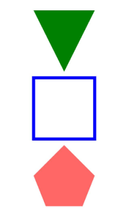
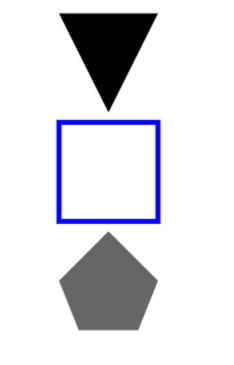
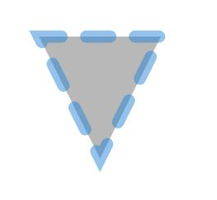

# Polygon
<!--Kit: ArkUI-->
<!--Subsystem: ArkUI-->
<!--Owner: @camlostshi-->
<!--Designer: @fenglinbailu-->
<!--Tester: @liuli0427-->
<!--Adviser: @Brilliantry_Rui-->
<!-- md-trans-meta sourceCommit=814c7cb9af37d443e12a84b71f28815df508c584 translatedAt=2026-08-28T01:24:52.002Z pushedAt=2026-08-31T06:11:43.974Z -->

The **Polygon** component is used to draw a polygon. This component defines the shape of a polygon by setting a list of vertex coordinates, and supports attribute configuration such as fill color and border style. The component uses a two-dimensional coordinate system and connects the vertices in sequence to form a closed polygon area. It is suitable for drawing custom polygon shapes such as triangles, quadrilaterals, and pentagons, as well as for implementing visualization scenarios such as charts and icons that require polygon elements.

>  **NOTE**
>
>  This component is supported since API version 7. Updates will be marked with a superscript to indicate their earliest API version.
>
>  Since API version 20, this component supports updating constructor parameters through the [updateConstructorParams](../js-apis-arkui-AttributeUpdater.md#properties) API of the [AttributeUpdater](../js-apis-arkui-AttributeUpdater.md) class.

## Child Components

None

## APIs

### Polygon

new Polygon(options?: PolygonOptions)

Draws a polygon.

**Widget capability**: Since API version 9, this feature is supported in ArkTS widgets.

**Atomic service API**: This API can be used in atomic services since API version 11.

**System capability**: SystemCapability.ArkUI.ArkUI.Full

**Parameters**

| Name | Type | Mandatory | Description |
| -------- | -------- | -------- | -------- |
| options | [PolygonOptions](#polygonoptions18) | No | Configuration options of the **Polygon** component, used to define the width and height of the drawing area. Pass this parameter when the polygon size needs to be specified. If it is not passed, the default width and height (both 0) are used. If **undefined** or **null** is passed, the parameter setting does not take effect and the component attributes remain unchanged.|

### Polygon

Polygon(options?: PolygonOptions)

Draws a polygon.

**Widget capability**: This API can be used in ArkTS widgets since API version 9.

**Atomic service API**: This API can be used in atomic services since API version 11.

**System capability**: SystemCapability.ArkUI.ArkUI.Full

**Parameters**

| Name| Type| Mandatory| Description|
| -------- | -------- | -------- | -------- |
| options | [PolygonOptions](#polygonoptions18) | No | Configuration options of the **Polygon** component, used to define the width and height of the drawing area. Pass this parameter when the polygon size needs to be specified. If it is not passed, the default width and height (both 0) are used. If **undefined** or **null** is passed, the parameter setting does not take effect and the component attribute remains unchanged.|

## PolygonOptions<sup>18+</sup>

Describes the options of the polygon.

> **NOTE**
>
> To standardize anonymous object definitions, the element definitions here have been revised in API version 18. While historical version information is preserved for anonymous objects, there may be cases where the outer element's @since version number is higher than inner element's. This does not affect interface usability.

**Widget capability**: This API can be used in ArkTS widgets since API version 18.

**Atomic service API**: This API can be used in atomic services since API version 18.

**Model restriction**: This API can be used only in the stage model.

**System capability**: SystemCapability.ArkUI.ArkUI.Full

| Name| Type| Read-Only| No| Description|
| -------- | -------- | -------- | -------- | -------- |
| width<sup>7+</sup> | [Length](ts-types.md#length) | No | Yes | Width, with the value range ≥ 0.<br>Default value: **0**<br>Default unit: vp<br>If the given value is less than 0, the default value is used. The abnormal values **undefined**, **null**, **NaN**, and **Infinity** are handled as the default value.<br>**Widget capability:** This API can be used in ArkTS widgets since API version 9.<br>**Atomic service API:** This API can be used in atomic services since API version 11. |
| height<sup>7+</sup> | [Length](ts-types.md#length) | No | Yes | Height, with the value range ≥ 0.<br>Default value: **0**<br>Default unit: vp<br>If the given value is less than 0, the default value is used. The abnormal values **undefined**, **null**, **NaN**, and **Infinity** are handled as the default value.<br>**Widget capability:** This API can be used in ArkTS widgets since API version 9.<br>**Atomic service API:** This API can be used in atomic services since API version 11. |

## Attributes

In addition to the [universal attributes](ts-component-general-attributes.md) and [common attributes of drawing components](ts-drawing-components-common.md), the following attributes are supported:

### points

points(value: Array&lt;any&gt;)

Sets the vertex coordinates of the polygon. This attribute can be dynamically set using [attributeModifier](ts-universal-attributes-attribute-modifier.md#attributemodifier). Invalid values are treated as the default value.

**Widget capability**: This API can be used in ArkTS widgets since API version 9.

**Atomic service API**: This API can be used in atomic services since API version 11.

**System capability**: SystemCapability.ArkUI.ArkUI.Full

**Parameters**

| Name| Type                                                        | Mandatory| Description                                 |
| ------ | ------------------------------------------------------------ | ---- | ------------------------------------- |
| value  | Array&lt;any&gt; | Yes   | List of vertex coordinates of the polygon. A two-dimensional array is passed in, where each sub-array represents the [x, y] coordinates of a vertex.<br>Default value: [] (empty array)<br>Default unit: vp <br>The abnormal values **undefined** and **null** are handled as the default value.|

## Examples

### Example 1: Drawing a Polygon

This example draws the vertex coordinates, fill color, fill opacity, border color, and border width of the polygon through the **points**, **fill**, **fillOpacity**, **stroke**, and **strokeWidth** attributes, respectively.

```ts
// xxx.ets
@Entry
@Component
struct PolygonExample {
  build() {
    Column({ space: 10 }) {
      // Draw a triangle in a 100 × 100 rectangle. The start point is (0, 0), the end point is (100, 0), and the passing point is (50, 100).
      Polygon({ width: 100, height: 100 })
        .points([[0, 0], [50, 100], [100, 0]])
        .fill(Color.Green)
      // Draw a quadrilateral in a 100 × 100 rectangle. The start point is (0, 0), the end point is (100, 0), and the passing points are (0, 100) and (100, 100).
      Polygon()
        .width(100)
        .height(100)
        .points([[0, 0], [0, 100], [100, 100], [100, 0]])
        .fillOpacity(0)
        .strokeWidth(5)
        .stroke(Color.Blue)
      // Draw a pentagon in a 100 × 100 rectangle. The start point is (50, 0), the end point is (100, 50), and the passing points are (0, 50), (20, 100), and (80, 100).
      Polygon()
        .width(100)
        .height(100)
        .points([[50, 0], [0, 50], [20, 100], [80, 100], [100, 50]])
        .fill(Color.Red)
        .fillOpacity(0.6)
    }.width('100%').margin({ top: 10 })
  }
}
```



### Example 2: Drawing a Polygon with Different Parameter Types for Width and Height

This example demonstrates how to draw a polygon using different length types of the **width** and **height** attributes.

```ts
// xxx.ets
@Entry
@Component
struct PolygonTypeExample {
  build() {
    Column({ space: 10 }) {
      // Draw a triangle in a 100 × 100 rectangle. The start point is (0, 0), the end point is (100, 0), and the passing point is (50, 100).
      Polygon({ width: '100', height: '100' }) // Use the string type.
        .points([[0, 0], [50, 100], [100, 0]])
      // Draw a quadrilateral in a 100 × 100 rectangle. The start point is (0, 0), the end point is (100, 0), and the passing points are (0, 100) and (100, 100).
      Polygon({ width: 100, height: 100 })// Use the number type.
        .points([[0, 0], [0, 100], [100, 100], [100, 0]])
        .fillOpacity(0)
        .strokeWidth(5)
        .stroke(Color.Blue)
      // Draw a pentagon in a 100 × 100 rectangle. The start point is (50, 0), the end point is (100, 50), and the passing points are (0, 50), (20, 100), and (80, 100).
      Polygon({ width: $r('app.string.PolygonWidth'), height: $r('app.string.PolygonHeight') }) // Use the Resource type, which needs to be customized.
        .points([[50, 0], [0, 50], [20, 100], [80, 100], [100, 50]])
        .fillOpacity(0.6)
    }.width('100%').margin({ top: 10 })
  }
}
```



### Example 3: Dynamically Setting Attributes of the Polygon Component Using attributeModifier

This example shows how to use **attributeModifier** to dynamically set the **points**, **fill**, **fillOpacity**, **stroke**, **strokeDashArray**, **strokeDashOffset**, **strokeLineCap**, **strokeLineJoin**, **strokeMiterLimit**, **strokeOpacity**, **strokeWidth**, and **antiAlias** attributes of the **Polygon** component.

```ts
// xxx.ets
class MyPolygonModifier implements AttributeModifier<PolygonAttribute> {
  applyNormalAttribute(instance: PolygonAttribute): void {
    // Triangle starting at (0, 0), passing through (50, 100), and ending at (100, 0). Fill color: #707070; fill opacity: 0.5; stroke color: #2787D9; stroke dash array: [20]; offset to left: 15; cap style: semi-circle; join style: miter; miter limit: 5; stroke opacity: 0.5; stroke width: 10; anti-aliasing enabled.
    instance.points([[0, 0], [50, 100], [100, 0]])
    instance.fill("#707070")
    instance.fillOpacity(0.5)
    instance.stroke("#2787D9")
    instance.strokeDashArray([20])
    instance.strokeDashOffset("15")
    instance.strokeLineCap(LineCapStyle.Round)
    instance.strokeLineJoin(LineJoinStyle.Miter)
    instance.strokeMiterLimit(5)
    instance.strokeOpacity(0.5)
    instance.strokeWidth(10)
    instance.antiAlias(true)
  }
}

@Entry
@Component
struct PolygonModifierDemo {
  @State modifier: MyPolygonModifier = new MyPolygonModifier()

  build() {
    Column() {
      Polygon()
        .width(100)
        .height(100)
        .attributeModifier(this.modifier)
        .offset({ x: 20, y: 20 })
    }
  }
}
```

