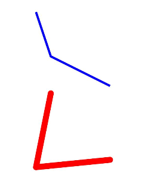
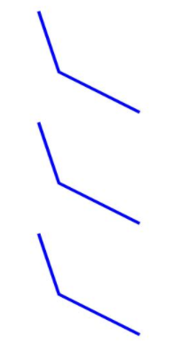
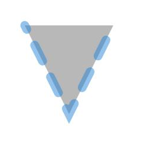

# Polyline
<!--Kit: ArkUI-->
<!--Subsystem: ArkUI-->
<!--Owner: @camlostshi-->
<!--Designer: @fenglinbailu-->
<!--Tester: @liuli0427-->
<!--Adviser: @Brilliantry_Rui-->
<!-- md-trans-meta sourceCommit=814c7cb9af37d443e12a84b71f28815df508c584 translatedAt=2026-08-28T01:25:51.503Z pushedAt=2026-08-31T06:16:28.866Z -->

The **Polyline** component is used to draw a polyline.

>  **NOTE**
>
>  This component is supported since API version 7. Updates to new APIs in later versions are marked with a superscript to indicate their earliest API version.
>
>  This component supports updating constructor parameters through the [updateConstructorParams](../js-apis-arkui-AttributeUpdater.md#properties) API of the [AttributeUpdater](../js-apis-arkui-AttributeUpdater.md) class since API version 20.


## Child Components

None


## APIs

### Polyline

new Polyline(options?: PolylineOptions)

Creates a polyline. 

**Widget capability**: Since API version 9, this feature is supported in ArkTS widgets.

**Atomic service API**: This API can be used in atomic services since API version 11.

**System capability**: SystemCapability.ArkUI.ArkUI.Full

**Parameters**

| Name | Type | Mandatory | Description |
| -------- | -------- | -------- | -------- |
| options | [PolylineOptions](#polylineoptions18) | No | Drawing area of the polyline, used to set the width and height of the **Polyline** component. Pass this parameter when the drawing area size of the polyline needs to be specified. If it is not passed, the default width and height (both 0) are used.<br>The abnormal values **undefined** and **null** are processed as invalid values, and this setting does not take effect.|

### Polyline

Polyline(options?: PolylineOptions)

Creates a polyline. 

**Widget capability**: This API can be used in ArkTS widgets since API version 9.

**Atomic service API**: This API can be used in atomic services since API version 11.

**System capability**: SystemCapability.ArkUI.ArkUI.Full

**Parameters**

| Name| Type| Mandatory| Description|
| -------- | -------- | -------- | -------- |
| options | [PolylineOptions](#polylineoptions18) | No | Drawing area of the **Polyline**, used to set the width and height of the **Polyline** component. Pass this parameter when the drawing area size of the **Polyline** needs to be specified. If it is not passed, the default width and height (both 0) are used.<br>The abnormal values **undefined** and **null** are processed as invalid values, and this setting does not take effect.|

## PolylineOptions<sup>18+</sup>

Describes the options of the polyline.

> **NOTE**
>
> To standardize anonymous object definitions, the element definitions here have been revised in API version 18. While historical version information is preserved for anonymous objects, there may be cases where the outer element's @since version number is higher than inner elements'. This does not affect interface usability.

**Widget capability**: This API can be used in ArkTS widgets since API version 18.

**Atomic service API**: This API can be used in atomic services since API version 18.

**Model restriction**: This API can be used only in the stage model.

**System capability**: SystemCapability.ArkUI.ArkUI.Full

| Name| Type| Read-Only| Optional| Description|
| -------- | -------- | -------- | -------- | -------- |
| width<sup>7+</sup> | [Length](ts-types.md#length) | No | Yes | Width, in the range [0, +∞).<br>Default value: **0**<br>Default unit: vp<br>If the given value is less than 0, the default value is used. The abnormal values **undefined**, **null**, **NaN**, and **Infinity** are processed as the default value.<br>**Widget capability:** This API can be used in ArkTS widgets since API version 9.<br>**Atomic service API:** This API can be used in atomic services since API version 11. |
| height<sup>7+</sup> | [Length](ts-types.md#length) | No | Yes | Height, in the range [0, +∞).<br>Default value: **0**<br>Default unit: vp<br>If the given value is less than 0, the default value is used. The abnormal values **undefined**, **null**, **NaN**, and **Infinity** are processed as the default value.<br>**Widget capability:** This API can be used in ArkTS widgets since API version 9.<br>**Atomic service API:** This API can be used in atomic services since API version 11. |

## Attributes

In addition to the [universal attributes](ts-component-general-attributes.md) and [universal drawing attributes](ts-drawing-components-common.md), the following attributes are supported:

### points

points(value: Array&lt;any&gt;)

Sets the list of coordinate points that the polyline passes through. This attribute supports [attributeModifier](ts-universal-attributes-attribute-modifier.md#attributemodifier) for dynamic setting of the attribute.

**Widget capability**: This API can be used in ArkTS widgets since API version 9.

**Atomic service API**: This API can be used in atomic services since API version 11.

**System capability**: SystemCapability.ArkUI.ArkUI.Full

**Parameters**

| Name| Type                                                        | Mandatory| Description                               |
| ------ | ------------------------------------------------------------ | ---- | ----------------------------------- |
| value  | Array&lt;any&gt; | Yes   | List of coordinate points that the polyline passes through. Pass in a two-dimensional array, where each sub-array represents the [x, y] coordinates of a vertex.<br>Default value: [] (empty array)<br>Default unit: vp <br>Abnormal values undefined and null are processed as the default value.|

## Examples

### Example 1: Drawing a Polyline

This example draws the passing coordinates, opacity, stroke color, stroke width, join style, and endpoint style of the polyline through the **points**, **fillOpacity**, **stroke**, **strokeWidth**, **strokeLineJoin**, and **strokeLineCap** attributes, respectively.

```ts
// xxx.ets
@Entry
@Component
struct PolylineExample {
  build() {
    Column({ space: 10 }) {
      // Draw a polyline in a 100 × 100 rectangle. The start point is (0, 0), the end point is (100, 100), and the passing point is (20,60).
      Polyline({ width: 100, height: 100 })
        .points([[0, 0], [20, 60], [100, 100]])
        .fillOpacity(0)
        .stroke(Color.Blue)
        .strokeWidth(3)
      // Draw a polyline in a 100 × 100 rectangle. The start point is (20, 0), the end point is (100, 90), and the passing point is (0,100).
      Polyline()
        .width(100)
        .height(100)
        .fillOpacity(0)
        .stroke(Color.Red)
        .strokeWidth(8)
        .points([[20, 0], [0, 100], [100, 90]])
        // Set the join style of the stroke to a rounded corner.
        .strokeLineJoin(LineJoinStyle.Round)
        // Set the cap style of the stroke to a half circle.
        .strokeLineCap(LineCapStyle.Round)
    }.width('100%')
  }
}
```



### Example 2: Drawing a Polyline with Different Parameter Types for Width and Height

This example demonstrates how to draw a polyline using different length types of the **width** and **height** attributes.

```ts
// xxx.ets
@Entry
@Component
struct PolylineTypeExample {
  build() {
    Column({ space: 10 }) {
      // Draw a polyline in a 100 × 100 rectangle. The start point is (0, 0), the end point is (100, 100), and the passing point is (20,60).
      Polyline({ width: '100', height: '100' }) // Use the string type.
        .points([[0, 0], [20, 60], [100, 100]])
        .fillOpacity(0)
        .stroke(Color.Blue)
        .strokeWidth(3)
      Polyline({ width: 100, height: 100 }) // Use the number type.
        .points([[0, 0], [20, 60], [100, 100]])
        .fillOpacity(0)
        .stroke(Color.Blue)
        .strokeWidth(3)
      Polyline({ width: $r('app.string.PolylineWidth'), height: $r('app.string.PolylineHeight') }) // Use the Resource type, which needs to be customized.
        .points([[0, 0], [20, 60], [100, 100]])
        .fillOpacity(0)
        .stroke(Color.Blue)
        .strokeWidth(3)
    }.width('100%')
  }
}
```



### Example 3: Dynamically Setting Attributes of the Polyline Component Using attributeModifier

This example shows how to use **attributeModifier** to dynamically set the **points**, **fill**, **fillOpacity**, **stroke**, **strokeDashArray**, **strokeDashOffset**, **strokeLineCap**, **strokeLineJoin**, **strokeMiterLimit**, **strokeOpacity**, **strokeWidth**, and **antiAlias** attributes of the **Polyline** component.

```ts
// xxx.ets
class MyPolylineModifier implements AttributeModifier<PolylineAttribute> {
  applyNormalAttribute(instance: PolylineAttribute): void {
    // Line starting at (0, 0), passing through (50, 100), and ending at (100, 0). Fill color: #707070; fill opacity: 0.5; stroke color: #2787D9; stroke dash array: [20]; offset to left: 15; cap style: semi-circle; join style: miter; miter limit: 5; stroke opacity: 0.5; stroke width: 10; anti-aliasing enabled.
    instance.points([[0, 0], [50, 100], [100, 0]])
    instance.fill("#707070")
    instance.fillOpacity(0.5)
    instance.stroke("#2787D9")
    instance.strokeDashArray([20])
    instance.strokeDashOffset("15")
    instance.strokeLineCap(LineCapStyle.Round)
    instance.strokeLineJoin(LineJoinStyle.Miter)
    instance.strokeMiterLimit(5)
    instance.strokeOpacity(0.5)
    instance.strokeWidth(10)
    instance.antiAlias(true)
  }
}

@Entry
@Component
struct PolylineModifierDemo {
  @State modifier: MyPolylineModifier = new MyPolylineModifier()

  build() {
    Column() {
      Polyline()
        .width(100)
        .height(100)
        .attributeModifier(this.modifier)
        .offset({ x: 20, y: 20 })
    }
  }
}
```

