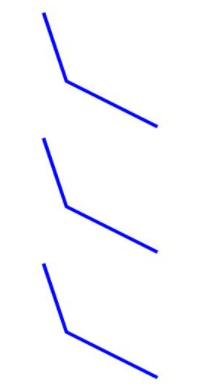
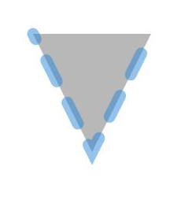

# Polyline
<!--Kit: ArkUI-->
<!--Subsystem: ArkUI-->
<!--Owner: @zjsxstar-->
<!--Designer: @sunbees-->
<!--Tester: @liuli0427-->
<!--Adviser: @Brilliantry_Rui-->

The **Polyline** component is used to draw a polyline.

>  **NOTE**
>
>  This component is supported since API version 7. Updates will be marked with a superscript to indicate their earliest API version.
>
>  This component supports dynamic constructor parameter updates using the [updateConstructorParams](../js-apis-arkui-AttributeUpdater.md#properties) API of the [AttributeUpdater](../js-apis-arkui-AttributeUpdater.md) class since API version 20.


## Child Components

Not supported


## APIs

Polyline(options?: PolylineOptions)

**Widget capability**: This API can be used in ArkTS widgets since API version 9.

**Atomic service API**: This API can be used in atomic services since API version 11.

**Parameters**

| Name| Type| Mandatory| Description|
| -------- | -------- | -------- | -------- |
| options | [PolylineOptions](ts-drawing-components-polyline.md#polylineoptions18) | No| Options for drawing a polyline.<br>The **undefined** and **null** values are treated as invalid.|

## PolylineOptions<sup>18+</sup>

Describes the options for drawing a polyline.

> **NOTE**
>
> To standardize anonymous object definitions, the element definitions here have been revised in API version 18. While historical version information is preserved for anonymous objects, there may be cases where the outer element's @since version number is higher than inner elements'. This does not affect interface usability.

**Widget capability**: This API can be used in ArkTS widgets since API version 18.

**Atomic service API**: This API can be used in atomic services since API version 18.

**System capability**: SystemCapability.ArkUI.ArkUI.Full

| Name| Type| Read-Only| Optional| Description|
| -------- | -------- | -------- | -------- | -------- |
| width<sup>7+</sup> | [Length](ts-types.md#length) | No| Yes| Width. The value must be greater than or equal to 0.<br>Default value: **0**.<br>Default unit: vp.<br>If the value is **undefined**, **null**, **NaN**, or **Infinity**, the default value will be used.<br>**Widget capability**: This API can be used in ArkTS widgets since API version 9.<br>**Atomic service API**: This API can be used in atomic services since API version 11.|
| height<sup>7+</sup> | [Length](ts-types.md#length) | No| Yes| Height. The value must be greater than or equal to 0.<br>Default value: **0**.<br>Default unit: vp.<br>If the value is **undefined**, **null**, **NaN**, or **Infinity**, the default value will be used.<br>**Widget capability**: This API can be used in ArkTS widgets since API version 9.<br>**Atomic service API**: This API can be used in atomic services since API version 11.|

## Attributes

In addition to the [universal attributes](ts-component-general-attributes.md), the following attributes are supported.

### points

points(value: Array&lt;any&gt;)

Sets the list of coordinates through which the line passes. The [attributeModifier](ts-universal-attributes-attribute-modifier.md#attributemodifier) attribute can be dynamically set.

**Widget capability**: This API can be used in ArkTS widgets since API version 9.

**Atomic service API**: This API can be used in atomic services since API version 11.

**System capability**: SystemCapability.ArkUI.ArkUI.Full

**Parameters**

| Name| Type                                                        | Mandatory| Description                               |
| ------ | ------------------------------------------------------------ | ---- | ----------------------------------- |
| value  | Array&lt;any&gt; | Yes  | List of coordinates that the polyline passes through. A two-dimensional array is passed. Each subarray indicates the [x, y] coordinates of a vertex.<br>Default value: [] (empty array)<br>Default unit: vp.<br>The **undefined** and **null** values are treated as the default value.|

### fill

fill(value: ResourceColor)

Sets the color of the filled area. The [attributeModifier](ts-universal-attributes-attribute-modifier.md#attributemodifier) method is supported. If this attribute and the universal attribute **foregroundColor** are both set, whichever is set later takes effect.

**Widget capability**: This API can be used in ArkTS widgets since API version 9.

**Atomic service API**: This API can be used in atomic services since API version 11.

**System capability**: SystemCapability.ArkUI.ArkUI.Full

**Parameters**

| Name| Type                                      | Mandatory| Description                                  |
| ------ | ------------------------------------------ | ---- | -------------------------------------- |
| value  | [ResourceColor](ts-types.md#resourcecolor) | Yes  | Color of the fill area.<br>Default value: **Color.Black**.<br>If the value is **undefined**, **null**, **NaN**, or **Infinity**, the default value will be used.|

### fillOpacity

fillOpacity(value: number | string | Resource)

Sets the opacity of the fill area. This attribute can be dynamically set using [attributeModifier](ts-universal-attributes-attribute-modifier.md#attributemodifier).

**Widget capability**: This API can be used in ArkTS widgets since API version 9.

**Atomic service API**: This API can be used in atomic services since API version 11.

**System capability**: SystemCapability.ArkUI.ArkUI.Full

**Parameters**

| Name| Type                                                        | Mandatory| Description                          |
| ------ | ------------------------------------------------------------ | ---- | ------------------------------ |
| value  | number \| string \| [Resource](ts-types.md#resource) | Yes  | Opacity of the fill area.<br>**NOTE**<br>The value range of the number format is [0.0, 1.0]. If the specified value is less than 0.0, the value is 0.0. If the specified value is greater than 1.0, the value is 1.0. Other abnormal values are processed as 1.0.<br>The string format supports the string format of the number format. The value range is the same as that of the number format.<br>The Resource format supports character strings in system resources or application resources. The value range is the same as that of the number format.<br>**NaN** is treated as **0.0**, while **undefined**, **null**, and **Infinity** are treated as **1.0**.<br>Default value: **1.0**.|

### stroke

stroke(value: ResourceColor)

Sets the stroke color. This attribute can be dynamically set using [attributeModifier](ts-universal-attributes-attribute-modifier.md#attributemodifier). If this attribute is not set, the default stroke transparency is 0, that is, no stroke is displayed.

**Widget capability**: This API can be used in ArkTS widgets since API version 9.

**Atomic service API**: This API can be used in atomic services since API version 11.

**System capability**: SystemCapability.ArkUI.ArkUI.Full

**Parameters**

| Name| Type                                      | Mandatory| Description      |
| ------ | ------------------------------------------ | ---- | ---------- |
| value  | [ResourceColor](ts-types.md#resourcecolor) | Yes  | Stroke color.<br>Abnormal values undefined and null are processed based on the default value, and NaN and Infinity are processed based on Color.Black.|

### strokeDashArray

strokeDashArray(value: Array&lt;any&gt;)

Sets the stroke dashes. The [attributeModifier](ts-universal-attributes-attribute-modifier.md#attributemodifier) method can be used to dynamically set attributes. Line segments may overlap when they intersect. The value must be greater than or equal to 0. Invalid values are treated as the default value.

**Widget capability**: This API can be used in ArkTS widgets since API version 9.

**Atomic service API**: This API can be used in atomic services since API version 11.

**System capability**: SystemCapability.ArkUI.ArkUI.Full

**Parameters**

| Name| Type            | Mandatory| Description                     |
| ------ | ---------------- | ---- | ------------------------- |
| value  | Array&lt;any&gt; | Yes  | Array defining the dash pattern for the polyline outline. Elements alternate between dash length and gap length.<br>Default value: [] (empty array)<br>Default unit: vp.<br>The **undefined** and **null** values are treated as the default value.<br>**NOTE**<br>Empty array: solid line<br>Even-numbered array: Elements cycle sequentially, for example, [a, b, c, d] represents: dash a -> gap b -> dash c -> gap d -> dash a -> ...<br>Odd-numbered array: Elements are duplicated to create an even-numbered array, for example, [a, b, c] becomes [a, b, c, a, b, c], representing: dash a -> gap b -> dash c -> gap a -> dash b -> gap c -> dash a -> ...|

### strokeDashOffset

strokeDashOffset(value: number | string)

Sets the offset of the line drawing start point. This attribute can be dynamically set using [attributeModifier](ts-universal-attributes-attribute-modifier.md#attributemodifier).

**Widget capability**: This API can be used in ArkTS widgets since API version 9.

**Atomic service API**: This API can be used in atomic services since API version 11.

**System capability**: SystemCapability.ArkUI.ArkUI.Full

**Parameters**

| Name| Type                      | Mandatory| Description                                |
| ------ | -------------------------- | ---- | ------------------------------------ |
| value  | number \| string | Yes  | Offset of the start point for drawing the stroke.<br>Default value: **0**.<br>Default unit: vp.<br>Abnormal values undefined and null are processed based on the default values. NaN and Infinity will cause strokeDashArray to become invalid.|

### strokeLineCap

strokeLineCap(value: LineCapStyle)

Sets the style of end points of lines. This attribute can be dynamically set using [attributeModifier](ts-universal-attributes-attribute-modifier.md#attributemodifier).

**Widget capability**: This API can be used in ArkTS widgets since API version 9.

**Atomic service API**: This API can be used in atomic services since API version 11.

**System capability**: SystemCapability.ArkUI.ArkUI.Full

**Parameters**

| Name| Type                                             | Mandatory| Description                                            |
| ------ | ------------------------------------------------- | ---- | ------------------------------------------------ |
| value  | [LineCapStyle](ts-appendix-enums.md#linecapstyle) | Yes  | Cap style of the stroke.<br>Default value: **LineCapStyle.Butt**<br>If the value is **undefined**, **null**, **NaN**, or **Infinity**, the default value will be used.|

### strokeLineJoin

strokeLineJoin(value: LineJoinStyle)

Sets the join style of the stroke. This attribute can be dynamically set using [attributeModifier](ts-universal-attributes-attribute-modifier.md#attributemodifier).

**Widget capability**: This API can be used in ArkTS widgets since API version 9.

**Atomic service API**: This API can be used in atomic services since API version 11.

**System capability**: SystemCapability.ArkUI.ArkUI.Full

**Parameters**

| Name| Type                                               | Mandatory| Description                                              |
| ------ | --------------------------------------------------- | ---- | -------------------------------------------------- |
| value  | [LineJoinStyle](ts-appendix-enums.md#linejoinstyle) | Yes  | Join style of lines.<br>Default value: **LineJoinStyle.Miter**<br>If the value is **undefined**, **null**, **NaN**, or **Infinity**, the default value will be used.|

### strokeMiterLimit

strokeMiterLimit(value: number | string)

Sets the limit on the ratio of the miter length to the value of stroke width used to draw a miter join. This attribute can be dynamically set using [attributeModifier](ts-universal-attributes-attribute-modifier.md#attributemodifier). The miter length indicates the distance from the outer tip to the inner corner of the miter. This attribute is valid only when strokeLineJoin is set to LineJoinStyle.Miter.

**Widget capability**: This API can be used in ArkTS widgets since API version 9.

**Atomic service API**: This API can be used in atomic services since API version 11.

**System capability**: SystemCapability.ArkUI.ArkUI.Full

**Parameters**

| Name| Type                      | Mandatory| Description                                          |
| ------ | -------------------------- | ---- | ---------------------------------------------- |
| value  | number \| string | Yes  | Limit on the ratio of the miter length to the value of **strokeWidth** used to draw a miter join.<br>Default value: **4**<br>The valid value of this attribute must be greater than or equal to 1.0. If the value is within the [0, 1) range, 1.0 is used.<br>The abnormal values undefined, null, and NaN are processed based on the default values. Infinity causes the stroke failure.|

### strokeOpacity

strokeOpacity(value: number | string | Resource)

Sets the stroke opacity. This attribute can be dynamically set using [attributeModifier](ts-universal-attributes-attribute-modifier.md#attributemodifier).

**Widget capability**: This API can be used in ArkTS widgets since API version 9.

**Atomic service API**: This API can be used in atomic services since API version 11.

**System capability**: SystemCapability.ArkUI.ArkUI.Full

**Parameters**

| Name| Type                                                        | Mandatory| Description                      |
| ------ | ------------------------------------------------------------ | ---- | -------------------------- |
| value  | number \| string \| [Resource](ts-types.md#resource) | Yes  | Stroke opacity. The value range is [0.0, 1.0].<br>Default value: opacityset by the [stroke](#stroke) API.<br>If the given value is less than 0.0, the value is 0.0. If the given value is greater than 1.0, the value is 1.0.<br>**NaN** is treated as **0.0**, while **undefined**, **null**, and **Infinity** are treated as **1.0**.|

### strokeWidth

strokeWidth(value: Length)

Sets the stroke width. This attribute can be dynamically set using [attributeModifier](ts-universal-attributes-attribute-modifier.md#attributemodifier). If this attribute is of the string type, the percentage is not supported. The percentage is processed as 1px.

**Widget capability**: This API can be used in ArkTS widgets since API version 9.

**Atomic service API**: This API can be used in atomic services since API version 11.

**System capability**: SystemCapability.ArkUI.ArkUI.Full

**Parameters**

| Name| Type                        | Mandatory| Description                    |
| ------ | ---------------------------- | ---- | ------------------------ |
| value  | [Length](ts-types.md#length) | Yes  | Stroke width. The value must be greater than or equal to 0.<br>Default value: **1**<br>Default unit: vp.<br>For abnormal values undefined, null, and NaN, the default value is used. For Infinity, the value 0 is used.|

### antiAlias

antiAlias(value: boolean)

Sets whether to enable anti-aliasing. This attribute can be dynamically set using [attributeModifier](ts-universal-attributes-attribute-modifier.md#attributemodifier).

**Widget capability**: This API can be used in ArkTS widgets since API version 9.

**Atomic service API**: This API can be used in atomic services since API version 11.

**System capability**: SystemCapability.ArkUI.ArkUI.Full

**Parameters**

| Name| Type   | Mandatory| Description                                 |
| ------ | ------- | ---- | ------------------------------------- |
| value  | boolean | Yes  | Whether anti-aliasing is enabled.<br>**true**: Anti-aliasing is enabled.<br>**false**: Anti-aliasing is disabled.<br>Default value: **true**<br>The **undefined** and **null** values are treated as the default value.|

## Example

### Example 1: Drawing Rectangles

This example demonstrates how to use **points**, **fillOpacity**, **stroke**, **strokeLineJoin**, and **strokeLineCap** to draw a polyline with specific coordinates, opacity, stroke colors, corner styles, and endpoint styles.

```ts
// xxx.ets
@Entry
@Component
struct PolylineExample {
  build() {
    Column({ space: 10 }) {
      // Draw a polyline in a 100 x 100 rectangle. The start point is (0, 0), the end point is (100, 100), and the passing point is (20,60).
      Polyline({ width: 100, height: 100 })
        .points([[0, 0], [20, 60], [100, 100]])
        .fillOpacity(0)
        .stroke(Color.Blue)
        .strokeWidth(3)
      // Draw a polyline in a 100 x 100 rectangle. The start point is (20, 0), the end point is (100, 90), and the passing point is (0,100).
      Polyline()
        .width(100)
        .height(100)
        .fillOpacity(0)
        .stroke(Color.Red)
        .strokeWidth(8)
        .points([[20, 0], [0, 100], [100, 90]])
        // Set the join style of the stroke to a rounded corner.
        .strokeLineJoin(LineJoinStyle.Round)
        // Set the cap style of the stroke to a half circle.
        .strokeLineCap(LineCapStyle.Round)
    }.width('100%')
  }
}
```


### Example 2 (Using Different Parameter Types for Width and Height to Draw a Polyline)

The width and height attributes are used to draw a graph of different length types.

```ts
// xxx.ets
@Entry
@Component
struct PolylineTypeExample {
  build() {
    Column({ space: 10 }) {
      // Draw a polyline in a 100 x 100 rectangle. The start point is (0, 0), the end point is (100, 100), and the passing point is (20,60).
      Polyline ({ width: '100', height: '100' })// Use the string type.
        .points([[0, 0], [20, 60], [100, 100]])
        .fillOpacity(0)
        .stroke(Color.Blue)
        .strokeWidth(3)
      Polyline ({ width: 100, height: 100 })// Use the number type.
        .points([[0, 0], [20, 60], [100, 100]])
        .fillOpacity(0)
        .stroke(Color.Blue)
        .strokeWidth(3)
      Polyline({ width: $r('app.string.PolylineWidth'), height: $r('app.string.PolylineHeight') })// Use the Resource type, which needs to be customized by users.
        .points([[0, 0], [20, 60], [100, 100]])
        .fillOpacity(0)
        .stroke(Color.Blue)
        .strokeWidth(3)
    }.width('100%')
  }
}
```



### Example 3: : Dynamically Setting Attributes of the Polyline Component Using attributeModifier

This example shows how to use **attributeModifier** to dynamically set the various attributes of the **Polyline** component, such as **points**, **fill**, **stroke**, and **antiAlias**.

```ts
// xxx.ets
class MyPolylineModifier implements AttributeModifier<PolylineAttribute> {
  applyNormalAttribute(instance: PolylineAttribute): void {
    // Line starting at (0, 0), passing through (50, 100), and ending at (100, 0). Fill color: #707070, fill opacity: 0.5, stroke color: #2787D9, stroke dash array: [20], dash offset: 15, line cap: round, line join: miter, miter limit: 5, stroke opacity: 0.5, stroke width: 10, anti-aliasing enabled.
    instance.points([[0, 0], [50, 100], [100, 0]])
    instance.fill("#707070")
    instance.fillOpacity(0.5)
    instance.stroke("#2787D9")
    instance.strokeDashArray([20])
    instance.strokeDashOffset("15")
    instance.strokeLineCap(LineCapStyle.Round)
    instance.strokeLineJoin(LineJoinStyle.Miter)
    instance.strokeMiterLimit(5)
    instance.strokeOpacity(0.5)
    instance.strokeWidth(10)
    instance.antiAlias(true)
  }
}

@Entry
@Component
struct PolylineModifierDemo {
  @State modifier: MyPolylineModifier = new MyPolylineModifier()

  build() {
    Column() {
      Polyline()
        .width(100)
        .height(100)
        .attributeModifier(this.modifier)
        .offset({ x: 20, y: 20 })
    }
  }
}
```


