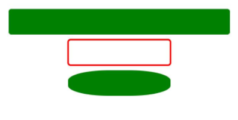
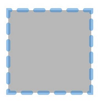

# Rect
<!--Kit: ArkUI-->
<!--Subsystem: ArkUI-->
<!--Owner: @zjsxstar-->
<!--Designer: @sunbees-->
<!--Tester: @liuli0427-->
<!--Adviser: @Brilliantry_Rui-->

The **Rect** component is used to draw a rectangle.

>  **NOTE**
>
>  This component is supported since API version 7. Updates will be marked with a superscript to indicate their earliest API version.
>
>  This component supports the update of construction parameters using the [updateConstructorParams](../js-apis-arkui-AttributeUpdater.md#properties) API of the [AttributeUpdater](../js-apis-arkui-AttributeUpdater.md) class since API version 20.


## Child Components

Not supported


## APIs

Rect(options?: RectOptions | RoundedRectOptions)

**Widget capability**: This API can be used in ArkTS widgets since API version 9.

**Atomic service API**: This API can be used in atomic services since API version 11.

**System capability**: SystemCapability.ArkUI.ArkUI.Full

**Parameters**

| Name| Type| Mandatory| Description|
| -------- | -------- | -------- | -------- |
| options | [RectOptions](ts-drawing-components-rect.md#rectoptions18) \| [RoundedRectOptions](ts-drawing-components-rect.md#roundedrectoptions18)  | No| Options for drawing a rectangle.<br>The **undefined** and **null** values are treated as invalid.|

## RectOptions<sup>18+</sup>

Describes the options for drawing a rectangle.

> **NOTE**
>
> To standardize anonymous object definitions, the element definitions here have been revised in API version 18. While historical version information is preserved for anonymous objects, there may be cases where the outer element's @since version number is higher than inner elements'. This does not affect interface usability.

**Widget capability**: This API can be used in ArkTS widgets since API version 18.

**Atomic service API**: This API can be used in atomic services since API version 18.

**System capability**: SystemCapability.ArkUI.ArkUI.Full

| Name| Type| Read-Only| Optional| Description|
| -------- | -------- | -------- | -------- | -------- |
| width<sup>7+</sup> | [Length](ts-types.md#length) | No| Yes| Width. The value must be greater than or equal to 0.<br>Default value: **0**<br>Default unit: vp<br>If the value is **undefined**, **null**, **NaN**, or **Infinity**, the default value will be used.<br>**Widget capability**: This API can be used in ArkTS widgets since API version 9.<br>**Atomic service API**: This API can be used in atomic services since API version 11.|
| height<sup>7+</sup> | [Length](ts-types.md#length) | No| Yes| Height. The value must be greater than or equal to 0.<br>Default value: **0**<br>Default unit: vp<br>If the value is **undefined**, **null**, **NaN**, or **Infinity**, the default value will be used.<br>**Widget capability**: This API can be used in ArkTS widgets since API version 9.<br>**Atomic service API**: This API can be used in atomic services since API version 11.|
| radius<sup>7+</sup> | [Length](ts-types.md#length) \| Array&lt;any&gt; | No| Yes| Radius of the rounded corner. You can set separate radii for the four rounded corners. The value must be greater than or equal to 0. <br>This property takes precedence over **radiusWidth** and **radiusHeight** when used together.<br>Default value: **0**<br>Default unit: vp<br>If the value is **undefined**, **null**, **NaN**, or **Infinity**, the default value will be used.<br>**Widget capability**: This API can be used in ArkTS widgets since API version 9.<br>**Atomic service API**: This API can be used in atomic services since API version 11.|

## RoundedRectOptions<sup>18+</sup>
Describes the options for drawing a rectangle.

> **NOTE**
>
> To standardize anonymous object definitions, the element definitions here have been revised in API version 18. While historical version information is preserved for anonymous objects, there may be cases where the outer element's @since version number is higher than inner elements'. This does not affect interface usability.

**Widget capability**: This API can be used in ArkTS widgets since API version 18.

**Atomic service API**: This API can be used in atomic services since API version 18.

**System capability**: SystemCapability.ArkUI.ArkUI.Full

| Name| Type| Read-Only| Optional| Description|
| -------- | -------- | -------- | -------- | -------- |
| width<sup>7+</sup> | [Length](ts-types.md#length) | No| Yes| Width. The value must be greater than or equal to 0.<br>Default value: **0**<br>Default unit: vp<br>An invalid value is handled as the default value.<br>**Widget capability**: This API can be used in ArkTS widgets since API version 9.<br>**Atomic service API**: This API can be used in atomic services since API version 11.|
| height<sup>7+</sup> | [Length](ts-types.md#length) | No| Yes| Height. The value must be greater than or equal to 0.<br>Default value: **0**<br>Default unit: vp<br>An invalid value is handled as the default value.<br>**Widget capability**: This API can be used in ArkTS widgets since API version 9.<br>**Atomic service API**: This API can be used in atomic services since API version 11.|
| radiusWidth<sup>7+</sup> | [Length](ts-types.md#length) | No| Yes| Width of the rounded corner. The value must be greater than or equal to 0.<br>Default value: **0**<br>Default unit: vp<br>An invalid value is handled as the default value.<br>**Widget capability**: This API can be used in ArkTS widgets since API version 9.<br>**Atomic service API**: This API can be used in atomic services since API version 11.|
| radiusHeight<sup>7+</sup> | [Length](ts-types.md#length) | No| Yes| Height of the rounded corner. The value must be greater than or equal to 0.<br>Default value: **0**<br>Default unit: vp<br>An invalid value is handled as the default value.<br>**Widget capability**: This API can be used in ArkTS widgets since API version 9.<br>**Atomic service API**: This API can be used in atomic services since API version 11.|

## Attributes

In addition to the [universal attributes](ts-component-general-attributes.md), the following attributes are supported.

### radiusWidth

radiusWidth(value: Length)

Sets the width of the rounded corner. When only the width is set, the width and height are the same. This property can be set dynamically in [attributeModifier](ts-universal-attributes-attribute-modifier.md#attributemodifier). An invalid value is handled as the default value.

**Widget capability**: This API can be used in ArkTS widgets since API version 9.

**Atomic service API**: This API can be used in atomic services since API version 11.

**System capability**: SystemCapability.ArkUI.ArkUI.Full

**Parameters**

| Name| Type                      | Mandatory| Description                      |
| ------ | -------------------------- | ---- | -------------------------- |
| value  | [Length](ts-types.md#length) | Yes  | Width of the rounded corner. The value must be greater than or equal to 0.<br>Default value: **0**<br>Default unit: vp<br>An abnormal value undefined is processed as the default value.|

### radiusHeight

radiusHeight(value: Length)

Sets the height of the rounded corner. When only the height is set, the width and height are the same. This property can be set dynamically in [attributeModifier](ts-universal-attributes-attribute-modifier.md#attributemodifier).  An invalid value is handled as the default value.

**Widget capability**: This API can be used in ArkTS widgets since API version 9.

**Atomic service API**: This API can be used in atomic services since API version 11.

**System capability**: SystemCapability.ArkUI.ArkUI.Full

**Parameters**

| Name| Type                      | Mandatory| Description                      |
| ------ | -------------------------- | ---- | -------------------------- |
| value  | [Length](ts-types.md#length) | Yes  | Height of the rounded corner. The value must be greater than or equal to 0.<br>Default value: **0**<br>Default unit: vp<br>An abnormal value undefined is processed as the default value.|

### radius

radius(value: Length | Array&lt;any&gt;)

Sets the radius of a rounded corner. The value is greater than or equal to 0. The [attributeModifier](ts-universal-attributes-attribute-modifier.md#attributemodifier) method is supported. An invalid value is handled as the default value.

**Widget capability**: This API can be used in ArkTS widgets since API version 9.

**Atomic service API**: This API can be used in atomic services since API version 11.

**System capability**: SystemCapability.ArkUI.ArkUI.Full

**Parameters**

| Name| Type                                                        | Mandatory| Description                        |
| ------ | ------------------------------------------------------------ | ---- | ---------------------------- |
| value  | [Length](ts-types.md#length) \| Array&lt;any&gt; | Yes  | Radius of the rounded corner. You can set separate radii for the four rounded corners.<br>Default value: **0**<br>Default unit: vp<br>Abnormal values undefined and null are processed as invalid values.|

### fill

fill(value: ResourceColor)

Color of the filling area. The [attributeModifier](ts-universal-attributes-attribute-modifier.md#attributemodifier) method is used to dynamically set attributes. Abnormal values are processed based on the default values. If this attribute and the universal attribute **foregroundColor** are both set, whichever is set later takes effect.

**Widget capability**: This API can be used in ArkTS widgets since API version 9.

**Atomic service API**: This API can be used in atomic services since API version 11.

**System capability**: SystemCapability.ArkUI.ArkUI.Full

**Parameters**

| Name| Type                                      | Mandatory| Description                                  |
| ------ | ------------------------------------------ | ---- | -------------------------------------- |
| value  | [ResourceColor](ts-types.md#resourcecolor) | Yes  | Color of the fill area.<br>Default value: **Color.Black**<br>If the value is **undefined**, **null**, **NaN**, or **Infinity**, the default value will be used.|

### fillOpacity

fillOpacity(value: number | string | Resource)

Sets the transparency of the filling area. The [attributeModifier](ts-universal-attributes-attribute-modifier.md#attributemodifier) method can be used to dynamically set attributes.

**Widget capability**: This API can be used in ArkTS widgets since API version 9.

**Atomic service API**: This API can be used in atomic services since API version 11.

**System capability**: SystemCapability.ArkUI.ArkUI.Full

**Parameters**

| Name| Type                                                        | Mandatory| Description                          |
| ------ | ------------------------------------------------------------ | ---- | ------------------------------ |
| value  | number \| string \| [Resource](ts-types.md#resource) | Yes  | Opacity of the fill area.<br>**NOTE**<br>The value range is [0.0, 1.0]. A value less than 0.0 is treated as **0.0**. A value greater than 1.0 is treated as **1.0**. Any other value is treated as **1.0**.<br>The string format supports the string format of the number format. The value range is the same as that of the number format.<br>The Resource format supports character strings in system resources or application resources. The value range is the same as that of the number format.<br>**NaN** is treated as **0.0**, while **undefined**, **null**, and **Infinity** are treated as **1.0**.<br>Default value: **1.0**|

### stroke

stroke(value: ResourceColor)

Sets the border color. This attribute can be dynamically set using [attributeModifier](ts-universal-attributes-attribute-modifier.md#attributemodifier). If the attribute is not set, the border transparency is 0 by default, that is, there is no border.

**Widget capability**: This API can be used in ArkTS widgets since API version 9.

**Atomic service API**: This API can be used in atomic services since API version 11.

**System capability**: SystemCapability.ArkUI.ArkUI.Full

**Parameters**

| Name| Type                                      | Mandatory| Description      |
| ------ | ------------------------------------------ | ---- | ---------- |
| value  | [ResourceColor](ts-types.md#resourcecolor) | Yes  | Stroke color.<br>Abnormal values undefined and null are processed based on the default value, and NaN and Infinity are processed based on Color.Black.|

### strokeDashArray

strokeDashArray(value: Array&lt;any&gt;)

Sets the stroke dashes. This attribute can be dynamically set using [attributeModifier](ts-universal-attributes-attribute-modifier.md#attributemodifier). Value range: 0. Abnormal values are processed as default values.

**Widget capability**: This API can be used in ArkTS widgets since API version 9.

**Atomic service API**: This API can be used in atomic services since API version 11.

**System capability**: SystemCapability.ArkUI.ArkUI.Full

**Parameters**

| Name| Type            | Mandatory| Description                     |
| ------ | ---------------- | ---- | ------------------------- |
| value  | Array&lt;any&gt; | Yes  | Array defining the dash pattern for the rectangular outline. Elements alternate between dash length and gap length.<br>The default value is an empty array.<br>Default unit: vp<br>The abnormal values undefined and null are processed based on the default values.<br>**NOTE**<br>Empty array: solid line<br>Even-numbered array: Elements cycle sequentially, for example, [a, b, c, d] represents: dash a -> gap b -> dash c -> gap d -> dash a -> ...<br>Odd-numbered array: Elements are duplicated to create an even-numbered array, for example, [a, b, c] becomes [a, b, c, a, b, c], representing: dash a -> gap b -> dash c -> gap a -> dash b -> gap c -> dash a -> ...|

### strokeDashOffset

strokeDashOffset(value: number | string)

Sets the offset of the start point for drawing the stroke. This attribute can be dynamically set using [attributeModifier](ts-universal-attributes-attribute-modifier.md#attributemodifier). An invalid value is handled as the default value.

**Widget capability**: This API can be used in ArkTS widgets since API version 9.

**Atomic service API**: This API can be used in atomic services since API version 11.

**System capability**: SystemCapability.ArkUI.ArkUI.Full

**Parameters**

| Name| Type                      | Mandatory| Description                                |
| ------ | -------------------------- | ---- | ------------------------------------ |
| value  | number \| string | Yes  | Offset of the start point for drawing the stroke.<br>Default value: **0**<br>Default unit: vp<br>Abnormal values undefined and null are processed based on the default values. NaN and Infinity will cause strokeDashArray to become invalid.|

### strokeLineCap

strokeLineCap(value: LineCapStyle)

Sets the offset of the end point for drawing the stroke. This attribute can be dynamically set using [attributeModifier](ts-universal-attributes-attribute-modifier.md#attributemodifier).

**Widget capability**: This API can be used in ArkTS widgets since API version 9.

**Atomic service API**: This API can be used in atomic services since API version 11.

**System capability**: SystemCapability.ArkUI.ArkUI.Full

**Parameters**

| Name| Type                                             | Mandatory| Description                                            |
| ------ | ------------------------------------------------- | ---- | ------------------------------------------------ |
| value  | [LineCapStyle](ts-appendix-enums.md#linecapstyle) | Yes  | Cap style of the stroke.<br>Default value: **LineCapStyle.Butt**<br>If the value is **undefined**, **null**, **NaN**, or **Infinity**, the default value will be used.|

### strokeLineJoin

strokeLineJoin(value: LineJoinStyle)

Sets the join style of the stroke. This attribute can be dynamically set using [attributeModifier](ts-universal-attributes-attribute-modifier.md#attributemodifier).

**Widget capability**: This API can be used in ArkTS widgets since API version 9.

**Atomic service API**: This API can be used in atomic services since API version 11.

**System capability**: SystemCapability.ArkUI.ArkUI.Full

**Parameters**

| Name| Type                                               | Mandatory| Description                                              |
| ------ | --------------------------------------------------- | ---- | -------------------------------------------------- |
| value  | [LineJoinStyle](ts-appendix-enums.md#linejoinstyle) | Yes  | Join style of the stroke.<br>Default value: **LineJoinStyle.Miter**<br>If the value is **undefined**, **null**, **NaN**, or **Infinity**, the default value will be used.|

### strokeMiterLimit

strokeMiterLimit(value: number | string)

Sets the limit on the ratio of the miter length to the value of stroke width used to draw a miter join. This attribute can be dynamically set using [attributeModifier](ts-universal-attributes-attribute-modifier.md#attributemodifier). The miter length indicates the distance from the outer tip to the inner corner of the miter. This attribute works only when **strokeLineJoin** is set to **LineJoinStyle.Miter**.

The value must be greater than or equal to 1.0. If the value is in the [0, 1) range, the value **1.0** will be used. In other cases, the default value will be used.

**Widget capability**: This API can be used in ArkTS widgets since API version 9.

**Atomic service API**: This API can be used in atomic services since API version 11.

**System capability**: SystemCapability.ArkUI.ArkUI.Full

**Parameters**

| Name| Type                      | Mandatory| Description                                          |
| ------ | -------------------------- | ---- | ---------------------------------------------- |
| value  | number \| string | Yes  | Limit on the ratio of the miter length to the value of **strokeWidth** used to draw a miter join.<br>Default value: **4**<br>The abnormal values undefined, null, and NaN are processed based on the default values. Infinity causes the stroke failure.|

### strokeOpacity

strokeOpacity(value: number | string | Resource)

Sets the stroke opacity. This attribute can be dynamically set using [attributeModifier](ts-universal-attributes-attribute-modifier.md#attributemodifier). The value range is [0.0, 1.0]. If the set value is less than 0.0, **0.0** will be used. If the set value is greater than 1.0, **1.0** will be used.

**Widget capability**: This API can be used in ArkTS widgets since API version 9.

**Atomic service API**: This API can be used in atomic services since API version 11.

**System capability**: SystemCapability.ArkUI.ArkUI.Full

**Parameters**

| Name| Type                                                        | Mandatory| Description                      |
| ------ | ------------------------------------------------------------ | ---- | -------------------------- |
| value  | number \| string \| [Resource](ts-types.md#resource) | Yes  | Stroke opacity.<br>Default value: transparency set by the [stroke](#stroke) API.<br>**NaN** is treated as **0.0**, while **undefined**, **null**, and **Infinity** are treated as **1.0**.|

### strokeWidth

strokeWidth(value: Length)

Sets the stroke width. This attribute can be dynamically set using [attributeModifier](ts-universal-attributes-attribute-modifier.md#attributemodifier). If this attribute is of the string type, percentage values are not supported and will be treated as 1 px.

**Widget capability**: This API can be used in ArkTS widgets since API version 9.

**Atomic service API**: This API can be used in atomic services since API version 11.

**System capability**: SystemCapability.ArkUI.ArkUI.Full

**Parameters**

| Name| Type                        | Mandatory| Description                    |
| ------ | ---------------------------- | ---- | ------------------------ |
| value  | [Length](ts-types.md#length) | Yes  | Stroke width. The value must be greater than or equal to 0.<br>Default value: **1**<br>Default unit: vp<br>For abnormal values undefined, null, and NaN, the default value is used. For Infinity, the value 0 is used.|

### antiAlias

antiAlias(value: boolean)

Sets whether to enable anti-aliasing. This attribute can be dynamically set using [attributeModifier](ts-universal-attributes-attribute-modifier.md#attributemodifier).

**Widget capability**: This API can be used in ArkTS widgets since API version 9.

**Atomic service API**: This API can be used in atomic services since API version 11.

**System capability**: SystemCapability.ArkUI.ArkUI.Full

**Parameters**

| Name| Type   | Mandatory| Description                                 |
| ------ | ------- | ---- | ------------------------------------- |
| value  | boolean | Yes  | Whether anti-aliasing is enabled.<br>**true**: Anti-aliasing is enabled.<br>**false**: Anti-aliasing is disabled.<br>Default value: **true**<br>The abnormal values undefined and null are processed based on the default values.|

## Example

### Example 1: Drawing Rectangles

This example demonstrates how to use **fill**, **fillOpacity**, **stroke**, and **radius** to draw rectangles with specific fill colors, opacity, stroke colors, and rounded corners.

```ts
// xxx.ets
@Entry
@Component
struct RectExample {
  build() {
    Column({ space: 10 }) {
      Text('normal').fontSize(11).fontColor(0xCCCCCC).width('90%')
      // Draw a 90% x 50 rectangle.
      Column({ space: 5 }) {
        Text('normal').fontSize(9).fontColor(0xCCCCCC).width('90%')
        // Draw a 90% x 50 rectangle.
        Rect({ width: '90%', height: 50 })
          .fill(Color.Pink)
        // Draw a 90% x 50 rectangle.
        Rect()
          .width('90%')
          .height(50)
          .fillOpacity(0)
          .stroke(Color.Red)
          .strokeWidth(3)

        Text('with rounded corners').fontSize(11).fontColor(0xCCCCCC).width('90%')
        // Draw a 90% x 80 rectangle, with the width and height of its rounded corners being 40 and 20, respectively.
        Rect({ width: '90%', height: 80 })
          .radiusHeight(20)
          .radiusWidth(40)
          .fill(Color.Pink)
        // Draw a 90% x 80 rectangle, with the width and height of its rounded corners being both 20.
        Rect({ width: '90%', height: 80 })
          .radius(20)
          .fill(Color.Pink)
          .stroke(Color.Transparent)
      }.width('100%').margin({ top: 10 })

      // Draw a 90% x 50 rectangle, with the width and height of its rounded corners as follows: 40 for the upper left rounded corner, 20 for the upper right rounded corner, 40 for the lower right rounded corner, and 20 for the lower left rounded corner.
      Rect({ width: '90%', height: 80 })
        .radius([[40, 40], [20, 20], [40, 40], [20, 20]])
        .fill(Color.Pink)
    }.width('100%').margin({ top: 5 })
  }
}
```


### Example 2: Drawing a Gradient Rectangle

This example demonstrates how to use the universal attributes **linearGradient** and **clipShape** to draw a gradient rectangle.

```ts
// xxx.ets
@Entry
@Component
struct RectExample {
  build() {
    Column({ space: 10 }) {
      Column()
        .width(100)
        .height(100)
        .linearGradient({
          direction: GradientDirection.Right,
          colors: [[0xff0000, 0.0], [0x0000ff, 0.3], [0xffff00, 1.0]]
        })
        .clipShape(new Rect({ width: 100, height: 100, radius: 40 }))
      Rect()
        .width(100)
        .height(100)
        // Set the color of the fill area. To display the color gradient of the background, set .fillOpacity(0.0).
        .fill(Color.Pink)
        // Set the radius of the rounded corner to 40.
        .radius(40)
        .stroke(Color.Black)
        // Set the color gradient. It takes effect only for a 100 x 100 rectangular area. The boundary of the gradient does not contain rounded corners.
        .linearGradient({
          direction: GradientDirection.Right,
          colors: [[0xff0000, 0.0], [0x0000ff, 0.3], [0xffff00, 1.0]]
        })
    }
  }
}
```


### Example 3: Drawing Rectangles Using Different Parameter Types

The width, height, radius, radiusWidth, and radiusHeight attributes are used to draw graphics of different length types.

```ts
// xxx.ets
@Entry
@Component
struct RectExample {
  build() {
    Column({ space: 10 }) {
      // Draw a rectangle with the width of 90% x 50 and the radius of 5.
      Rect({ width: '90%', height: '50', radius: '5' })// Use the string type.
        .fill(Color.Green)
      // Draw a rectangle with the size of 200 x 50 and the radius of 5.
      Rect({ width: 200, height: 50, radius: 5 })// Use the number type.
        .fillOpacity(0)
        .stroke(Color.Red)
        .strokeWidth(3)
      // Draw a rectangle with the size of 200 x 50, the radius width of 80, and the radius height of 20.
      Rect({
        width: $r('app.string.RectWidth'), // Use the Resource type, which is user-defined.
        height: $r('app.string.RectHeight'),
        radius: $r('app.string.RectRadius')
      })
        .radiusWidth($r('app.string.RectRadiusWidth'))
        .radiusHeight($r('app.string.RectRadiusHeight'))
        .fill(Color.Green)
    }.width('100%').margin({ top: 5 })
  }
}
```



### Example 4: : Dynamically Setting Attributes of the Rect Component Using attributeModifier

This example shows how to use **attributeModifier** to dynamically set the various attributes of the **Rect** component, such as **fill**, **stroke**, and **antiAlias**.

```ts
// xxx.ets
class MyRectModifier implements AttributeModifier<RectAttribute> {
  applyNormalAttribute(instance: RectAttribute): void {
    // Set the fill color to #707070, fill opacity to 0.5, stroke color to #2787D9, stroke dash to [20], left offset to 15, line end style to half circle, corner style to sharp corner connection path segment, ratio of the bevel length to the border width to 5, stroke opacity to 0.5, stroke width to 10, and anti-aliasing enabled.
    instance.fill("#707070")
    instance.fillOpacity(0.5)
    instance.stroke("#2787D9")
    instance.strokeDashArray([20])
    instance.strokeDashOffset("15")
    instance.strokeLineCap(LineCapStyle.Round)
    instance.strokeLineJoin(LineJoinStyle.Miter)
    instance.strokeMiterLimit(5)
    instance.strokeOpacity(0.5)
    instance.strokeWidth(10)
    instance.antiAlias(true)
  }
}

@Entry
@Component
struct RectModifierDemo {
  @State modifier: MyRectModifier = new MyRectModifier()

  build() {
    Column() {
      Rect()
        .width(200)
        .height(200)
        .attributeModifier(this.modifier)
        .offset({ x: 20, y: 20 })
    }
  }
}
```


