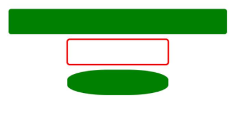
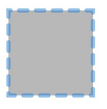

# Rect
<!--Kit: ArkUI-->
<!--Subsystem: ArkUI-->
<!--Owner: @camlostshi-->
<!--Designer: @fenglinbailu-->
<!--Tester: @liuli0427-->
<!--Adviser: @Brilliantry_Rui-->

The **Rect** component is used to draw a rectangle.

>  **NOTE**
>
>  This component is supported since API version 7. Updates will be marked with a superscript to indicate their earliest API version.
>
>  This component supports dynamic constructor parameter updates using the [updateConstructorParams](../js-apis-arkui-AttributeUpdater.md#properties) API of the [AttributeUpdater](../js-apis-arkui-AttributeUpdater.md) class since API version 20.


## Child Components

None


## APIs

Rect(options?: RectOptions | RoundedRectOptions)

**Widget capability**: This API can be used in ArkTS widgets since API version 9.

**Atomic service API**: This API can be used in atomic services since API version 11.

**System capability**: SystemCapability.ArkUI.ArkUI.Full

**Parameters**

| Name| Type| Mandatory| Description|
| -------- | -------- | -------- | -------- |
| options | [RectOptions](ts-drawing-components-rect.md#rectoptions18) \| [RoundedRectOptions](ts-drawing-components-rect.md#roundedrectoptions18)  | No| Options of the rectangle.<br>The **undefined** and **null** values are treated as invalid and will not take effect.|

## RectOptions<sup>18+</sup>

Describes the options of the rectangle.

> **NOTE**
>
> To standardize anonymous object definitions, the element definitions here have been revised in API version 18. While historical version information is preserved for anonymous objects, there may be cases where the outer element's @since version number is higher than inner elements'. This does not affect interface usability.

**Widget capability**: This API can be used in ArkTS widgets since API version 18.

**Atomic service API**: This API can be used in atomic services since API version 18.

**System capability**: SystemCapability.ArkUI.ArkUI.Full

| Name| Type| Read-Only| Optional| Description|
| -------- | -------- | -------- | -------- | -------- |
| width<sup>7+</sup> | [Length](ts-types.md#length) | No| Yes| Width. The value must be greater than or equal to 0.<br>Default value: **0**<br>Default unit: vp<br>The **undefined**, **null**, **NaN**, and **Infinity** values are invalid and treated as the default value.<br>**Widget capability**: This API can be used in ArkTS widgets since API version 9.<br>**Atomic service API**: This API can be used in atomic services since API version 11.|
| height<sup>7+</sup> | [Length](ts-types.md#length) | No| Yes| Height. The value must be greater than or equal to 0.<br>Default value: **0**<br>Default unit: vp<br>The **undefined**, **null**, **NaN**, and **Infinity** values are invalid and treated as the default value.<br>**Widget capability**: This API can be used in ArkTS widgets since API version 9.<br>**Atomic service API**: This API can be used in atomic services since API version 11.|
| radius<sup>7+</sup> | [Length](ts-types.md#length) \| Array&lt;any&gt; | No| Yes| Radius of the rounded corner. You can set separate radii for the four rounded corners. The value must be greater than or equal to 0.<br>This attribute takes precedence over **radiusWidth** and **radiusHeight** when used together.<br>Default value: **0**<br>Default unit: vp<br>The **undefined**, **null**, **NaN**, and **Infinity** values are invalid and treated as the default value.<br>**Widget capability**: This API can be used in ArkTS widgets since API version 9.<br>**Atomic service API**: This API can be used in atomic services since API version 11.|

## RoundedRectOptions<sup>18+</sup>
Describes the options of the rounded rectangle.

> **NOTE**
>
> To standardize anonymous object definitions, the element definitions here have been revised in API version 18. While historical version information is preserved for anonymous objects, there may be cases where the outer element's @since version number is higher than inner elements'. This does not affect interface usability.

**Widget capability**: This API can be used in ArkTS widgets since API version 18.

**Atomic service API**: This API can be used in atomic services since API version 18.

**System capability**: SystemCapability.ArkUI.ArkUI.Full

| Name| Type| Read-Only| Optional| Description|
| -------- | -------- | -------- | -------- | -------- |
| width<sup>7+</sup> | [Length](ts-types.md#length) | No| Yes| Width. The value must be greater than or equal to 0.<br>Default value: **0**<br>Default unit: vp<br>Invalid values are treated as the default value.<br>**Widget capability**: This API can be used in ArkTS widgets since API version 9.<br>**Atomic service API**: This API can be used in atomic services since API version 11.|
| height<sup>7+</sup> | [Length](ts-types.md#length) | No| Yes| Height. The value must be greater than or equal to 0.<br>Default value: **0**<br>Default unit: vp<br>Invalid values are treated as the default value.<br>**Widget capability**: This API can be used in ArkTS widgets since API version 9.<br>**Atomic service API**: This API can be used in atomic services since API version 11.|
| radiusWidth<sup>7+</sup> | [Length](ts-types.md#length) | No| Yes| Width of the rounded corner. The value must be greater than or equal to 0.<br>Default value: **0**<br>Default unit: vp<br>Invalid values are treated as the default value.<br>**Widget capability**: This API can be used in ArkTS widgets since API version 9.<br>**Atomic service API**: This API can be used in atomic services since API version 11.|
| radiusHeight<sup>7+</sup> | [Length](ts-types.md#length) | No| Yes| Height of the rounded corner. The value must be greater than or equal to 0.<br>Default value: **0**<br>Default unit: vp<br>Invalid values are treated as the default value.<br>**Widget capability**: This API can be used in ArkTS widgets since API version 9.<br>**Atomic service API**: This API can be used in atomic services since API version 11.|

## Attributes

In addition to the [universal attributes](ts-component-general-attributes.md), the following attributes are supported.

### radiusWidth

radiusWidth(value: Length)

Sets the width of the rounded corner. The width and height are the same when only the width is set. This attribute can be dynamically set using [attributeModifier](ts-universal-attributes-attribute-modifier.md#attributemodifier). Invalid values are treated as the default value.

**Widget capability**: This API can be used in ArkTS widgets since API version 9.

**Atomic service API**: This API can be used in atomic services since API version 11.

**System capability**: SystemCapability.ArkUI.ArkUI.Full

**Parameters**

| Name| Type                      | Mandatory| Description                      |
| ------ | -------------------------- | ---- | -------------------------- |
| value  | [Length](ts-types.md#length) | Yes  | Width of the rounded corner. The value must be greater than or equal to 0.<br>Default value: **0**<br>Default unit: vp<br>The **undefined** value is invalid and treated as the default value.|

### radiusHeight

radiusHeight(value: Length)

Sets the height of the rounded corner. The width and height are the same when only the height is set. This attribute can be dynamically set using [attributeModifier](ts-universal-attributes-attribute-modifier.md#attributemodifier).  Invalid values are treated as the default value.

**Widget capability**: This API can be used in ArkTS widgets since API version 9.

**Atomic service API**: This API can be used in atomic services since API version 11.

**System capability**: SystemCapability.ArkUI.ArkUI.Full

**Parameters**

| Name| Type                      | Mandatory| Description                      |
| ------ | -------------------------- | ---- | -------------------------- |
| value  | [Length](ts-types.md#length) | Yes  | Height of the rounded corner. The value must be greater than or equal to 0.<br>Default value: **0**<br>Default unit: vp<br>The **undefined** value is invalid and treated as the default value.|

### radius

radius(value: Length | Array&lt;any&gt;)

Sets the radius of the rounded corner. The value must be greater than or equal to 0. This attribute can be dynamically set using [attributeModifier](ts-universal-attributes-attribute-modifier.md#attributemodifier). Invalid values are treated as the default value.

**Widget capability**: This API can be used in ArkTS widgets since API version 9.

**Atomic service API**: This API can be used in atomic services since API version 11.

**System capability**: SystemCapability.ArkUI.ArkUI.Full

**Parameters**

| Name| Type                                                        | Mandatory| Description                        |
| ------ | ------------------------------------------------------------ | ---- | ---------------------------- |
| value  | [Length](ts-types.md#length) \|&nbsp;Array&lt;any&gt; | Yes  | Radius of the rounded corner. You can set separate radii for the four rounded corners.<br>Default value: **0**<br>Default unit: vp<br>Invalid values **undefined** and **null** are treated as **[[0, 0], [0, 0], [0, 0], [0, 0]]**.|

### fill

fill(value: ResourceColor)

Sets the color of the fill area. This attribute can be dynamically set using [attributeModifier](ts-universal-attributes-attribute-modifier.md#attributemodifier). Invalid values are treated as the default value. If this attribute and the universal attribute **foregroundColor** are both set, whichever is set later takes effect.

**Widget capability**: This API can be used in ArkTS widgets since API version 9.

**Atomic service API**: This API can be used in atomic services since API version 11.

**System capability**: SystemCapability.ArkUI.ArkUI.Full

**Parameters**

| Name| Type                                      | Mandatory| Description                                  |
| ------ | ------------------------------------------ | ---- | -------------------------------------- |
| value  | [ResourceColor](ts-types.md#resourcecolor) | Yes  | Color of the fill area.<br>Default value: [Color](ts-appendix-enums.md#color).Black<br>The **undefined**, **null**, **NaN**, and **Infinity** values are invalid and treated as the default value.|

### fillOpacity

fillOpacity(value: number | string | Resource)

Sets the opacity of the fill area. This attribute can be dynamically set using [attributeModifier](ts-universal-attributes-attribute-modifier.md#attributemodifier).

**Widget capability**: This API can be used in ArkTS widgets since API version 9.

**Atomic service API**: This API can be used in atomic services since API version 11.

**System capability**: SystemCapability.ArkUI.ArkUI.Full

**Parameters**

| Name| Type                                                        | Mandatory| Description                          |
| ------ | ------------------------------------------------------------ | ---- | ------------------------------ |
| value  | number&nbsp;\|&nbsp;string&nbsp;\|&nbsp;[Resource](ts-types.md#resource) | Yes  | Opacity of the fill area.<br>**NOTE**<br>For the number type, the value range is [0.0, 1.0]. A value less than 0.0 is treated as **0.0**. A value greater than 1.0 is treated as **1.0**. Any other value is treated as **1.0**.<br>For the string type, the value is a character string of the number type. The value range is the same as that of the number type.<br>For the Resource type, the value is a character string from the system resource or application resource. The value range is the same as that of the number type.<br>Invalid value **NaN** is treated as **0.0**, while invalid values **undefined**, **null**, and **Infinity** are treated as **1.0**.<br>Default value: **1.0**|

### stroke

stroke(value: ResourceColor)

Sets the stroke color. This attribute can be dynamically set using [attributeModifier](ts-universal-attributes-attribute-modifier.md#attributemodifier). If this attribute is not set, the default stroke opacity is **0**, meaning no stroke is displayed.

**Widget capability**: This API can be used in ArkTS widgets since API version 9.

**Atomic service API**: This API can be used in atomic services since API version 11.

**System capability**: SystemCapability.ArkUI.ArkUI.Full

**Parameters**

| Name| Type                                      | Mandatory| Description      |
| ------ | ------------------------------------------ | ---- | ---------- |
| value  | [ResourceColor](ts-types.md#resourcecolor) | Yes  | Stroke color.<br>Default value: [Color](ts-appendix-enums.md#color).Transparent<br>Invalid values **undefined** and **null** values are treated as the default value, and invalid values **NaN** and **Infinity** are treated as [Color](ts-appendix-enums.md#color).Black.|

### strokeDashArray

strokeDashArray(value: Array&lt;any&gt;)

Sets the stroke dashes. This attribute can be dynamically set using [attributeModifier](ts-universal-attributes-attribute-modifier.md#attributemodifier). The value must be greater than or equal to 0. Invalid values are treated as the default value.

**Widget capability**: This API can be used in ArkTS widgets since API version 9.

**Atomic service API**: This API can be used in atomic services since API version 11.

**System capability**: SystemCapability.ArkUI.ArkUI.Full

**Parameters**

| Name| Type            | Mandatory| Description                     |
| ------ | ---------------- | ---- | ------------------------- |
| value  | Array&lt;any&gt; | Yes  | Array defining the dash pattern for the rectangular outline. Elements alternate between dash length and gap length.<br>Default value: **[]** (empty array)<br>Default unit: vp<br>The **undefined** and **null** values are invalid and treated as the default value.<br>**NOTE**<br>Empty array: solid line<br>Even-numbered array: Elements cycle sequentially, for example, [a, b, c, d] represents: dash a -> gap b -> dash c -> gap d -> dash a -> ...<br>Odd-numbered array: Elements are duplicated to create an even-numbered array, for example, [a, b, c] becomes [a, b, c, a, b, c], representing: dash a -> gap b -> dash c -> gap a -> dash b -> gap c -> dash a -> ...|

### strokeDashOffset

strokeDashOffset(value: number | string)

Sets the offset of the start point for drawing the stroke. This attribute can be dynamically set using [attributeModifier](ts-universal-attributes-attribute-modifier.md#attributemodifier). Invalid values are treated as the default value.

**Widget capability**: This API can be used in ArkTS widgets since API version 9.

**Atomic service API**: This API can be used in atomic services since API version 11.

**System capability**: SystemCapability.ArkUI.ArkUI.Full

**Parameters**

| Name| Type                      | Mandatory| Description                                |
| ------ | -------------------------- | ---- | ------------------------------------ |
| value  | number&nbsp;\|&nbsp;string | Yes  | Offset of the start point for drawing the stroke.<br>Default value: **0**<br>Default unit: vp<br>Invalid values **undefined** and **null** are treated as the default value. If set to **NaN** or **Infinity**, **strokeDashArray** has no effect.|

### strokeLineCap

strokeLineCap(value: LineCapStyle)

Sets the cap style of the stroke. This attribute can be dynamically set using [attributeModifier](ts-universal-attributes-attribute-modifier.md#attributemodifier).

**Widget capability**: This API can be used in ArkTS widgets since API version 9.

**Atomic service API**: This API can be used in atomic services since API version 11.

**System capability**: SystemCapability.ArkUI.ArkUI.Full

**Parameters**

| Name| Type                                             | Mandatory| Description                                            |
| ------ | ------------------------------------------------- | ---- | ------------------------------------------------ |
| value  | [LineCapStyle](ts-appendix-enums.md#linecapstyle) | Yes  | Cap style of the stroke.<br>Default value: **LineCapStyle.Butt**<br>The **undefined**, **null**, **NaN**, and **Infinity** values are invalid and treated as the default value.|

### strokeLineJoin

strokeLineJoin(value: LineJoinStyle)

Sets the join style of the stroke. This attribute can be dynamically set using [attributeModifier](ts-universal-attributes-attribute-modifier.md#attributemodifier).

**Widget capability**: This API can be used in ArkTS widgets since API version 9.

**Atomic service API**: This API can be used in atomic services since API version 11.

**System capability**: SystemCapability.ArkUI.ArkUI.Full

**Parameters**

| Name| Type                                               | Mandatory| Description                                              |
| ------ | --------------------------------------------------- | ---- | -------------------------------------------------- |
| value  | [LineJoinStyle](ts-appendix-enums.md#linejoinstyle) | Yes  | Join style of the stroke.<br>Default value: **LineJoinStyle.Miter**<br>The **undefined**, **null**, **NaN**, and **Infinity** values are invalid and treated as the default value.|

### strokeMiterLimit

strokeMiterLimit(value: number | string)

Sets the limit on the ratio of the miter length to the value of stroke width used to draw a miter join. This attribute can be dynamically set using [attributeModifier](ts-universal-attributes-attribute-modifier.md#attributemodifier). The miter length indicates the distance from the outer tip to the inner corner of the miter. The border width is the value of **strokeWidth**. This attribute works only when **strokeLineJoin** is set to **LineJoinStyle.Miter**.

The value must be greater than or equal to 1.0. If the value is in the [0, 1) range, the value **1.0** will be used. In other cases, the default value will be used.

**Widget capability**: This API can be used in ArkTS widgets since API version 9.

**Atomic service API**: This API can be used in atomic services since API version 11.

**System capability**: SystemCapability.ArkUI.ArkUI.Full

**Parameters**

| Name| Type                      | Mandatory| Description                                          |
| ------ | -------------------------- | ---- | ---------------------------------------------- |
| value  | number&nbsp;\|&nbsp;string | Yes  | Limit on the ratio of the miter length to the value of **strokeWidth** used to draw a miter join.<br>Default value: **4**<br>Invalid values **undefined**, **null**, and **NaN** are treated as the default value. If set to **Infinity**, **stroke** has no effect.|

### strokeOpacity

strokeOpacity(value: number | string | Resource)

Sets the stroke opacity. This attribute can be dynamically set using [attributeModifier](ts-universal-attributes-attribute-modifier.md#attributemodifier). The value range is [0.0, 1.0]. If the set value is less than 0.0, **0.0** will be used. If the set value is greater than 1.0, **1.0** will be used.

**Widget capability**: This API can be used in ArkTS widgets since API version 9.

**Atomic service API**: This API can be used in atomic services since API version 11.

**System capability**: SystemCapability.ArkUI.ArkUI.Full

**Parameters**

| Name| Type                                                        | Mandatory| Description                      |
| ------ | ------------------------------------------------------------ | ---- | -------------------------- |
| value  | number&nbsp;\|&nbsp;string&nbsp;\|&nbsp;[Resource](ts-types.md#resource) | Yes  | Stroke opacity.<br>Default value: opacity set by the [stroke](#stroke) API<br>Invalid value **NaN** is treated as **0.0**, while invalid values **undefined**, **null**, and **Infinity** are treated as **1.0**.|

### strokeWidth

strokeWidth(value: Length)

Sets the stroke width. This attribute can be dynamically set using [attributeModifier](ts-universal-attributes-attribute-modifier.md#attributemodifier). If this attribute is of the string type, percentage values are not supported and will be treated as 1 px.

**Widget capability**: This API can be used in ArkTS widgets since API version 9.

**Atomic service API**: This API can be used in atomic services since API version 11.

**System capability**: SystemCapability.ArkUI.ArkUI.Full

**Parameters**

| Name| Type                        | Mandatory| Description                    |
| ------ | ---------------------------- | ---- | ------------------------ |
| value  | [Length](ts-types.md#length) | Yes  | Stroke width. The value must be greater than or equal to 0.<br>Default value: **1**<br>Default unit: vp<br>Invalid values **undefined**, **null**, and **NaN** are treated as the default value, and invalid value **Infinity** is treated as **0**.|

### antiAlias

antiAlias(value: boolean)

Sets whether to enable anti-aliasing. This attribute can be dynamically set using [attributeModifier](ts-universal-attributes-attribute-modifier.md#attributemodifier).

**Widget capability**: This API can be used in ArkTS widgets since API version 9.

**Atomic service API**: This API can be used in atomic services since API version 11.

**System capability**: SystemCapability.ArkUI.ArkUI.Full

**Parameters**

| Name| Type   | Mandatory| Description                                 |
| ------ | ------- | ---- | ------------------------------------- |
| value  | boolean | Yes  | Whether anti-aliasing is enabled.<br>**true**: enable anti-aliasing; **false**: disable anti-aliasing.<br>Default value: **true**<br>Invalid values **undefined** and **null** are treated as **false**.|

## Examples

### Example 1: Drawing a Rectangle

This example demonstrates how to use **fill**, **fillOpacity**, **stroke**, and **radius** to draw rectangles with specific fill colors, opacity, stroke colors, and rounded corners.

```ts
// xxx.ets
@Entry
@Component
struct RectExample {
  build() {
    Column({ space: 10 }) {
      Text('normal').fontSize(11).fontColor(0xCCCCCC).width('90%')
      // Draw a 90% × 50 rectangle.
      Column({ space: 5 }) {
        Text('normal').fontSize(9).fontColor(0xCCCCCC).width('90%')
        // Draw a 90% × 50 rectangle.
        Rect({ width: '90%', height: 50 })
          .fill(Color.Pink)
        // Draw a 90% × 50 rectangle.
        Rect()
          .width('90%')
          .height(50)
          .fillOpacity(0)
          .stroke(Color.Red)
          .strokeWidth(3)

        Text('with rounded corners').fontSize(11).fontColor(0xCCCCCC).width('90%')
        // Draw a 90% × 80 rectangle, with the width and height of its rounded corners being 40 and 20, respectively.
        Rect({ width: '90%', height: 80 })
          .radiusHeight(20)
          .radiusWidth(40)
          .fill(Color.Pink)
        // Draw a 90% × 80 rectangle, with the width and height of its rounded corners being both 20.
        Rect({ width: '90%', height: 80 })
          .radius(20)
          .fill(Color.Pink)
          .stroke(Color.Transparent)
      }.width('100%').margin({ top: 10 })

      // Draw a 90% × 50 rectangle, with the width and height of its rounded corners as follows: 40 for the upper left rounded corner, 20 for the upper right rounded corner, 40 for the lower right rounded corner, and 20 for the lower left rounded corner.
      Rect({ width: '90%', height: 80 })
        .radius([[40, 40], [20, 20], [40, 40], [20, 20]])
        .fill(Color.Pink)
    }.width('100%').margin({ top: 5 })
  }
}
```


### Example 2: Drawing a Gradient Rectangle

This example demonstrates how to use the universal attributes [linearGradient](../../../reference/apis-arkui/arkui-ts/ts-universal-attributes-gradient-color.md#lineargradient18) and [clipShape](../../../reference/apis-arkui/arkui-ts/ts-universal-attributes-sharp-clipping.md#clipshape18) to draw a gradient rectangle.

The universal attributes **linearGradient** and **clipShape** are supported since API version 18.

```ts
// xxx.ets
@Entry
@Component
struct RectExample {
  build() {
    Column({ space: 10 }) {
      Column()
        .width(100)
        .height(100)
        .linearGradient({
          direction: GradientDirection.Right,
          colors: [[0xff0000, 0.0], [0x0000ff, 0.3], [0xffff00, 1.0]]
        })
        .clipShape(new Rect({ width: 100, height: 100, radius: 40 }))
      Rect()
        .width(100)
        .height(100)
        // Set the color of the fill area. To display the gradient color of the background, set .fillOpacity(0.0).
        .fill(Color.Pink)
        // Set the radius of the chamfer to 40.
        .radius(40)
        .stroke(Color.Black)
        // Set the gradient color. It takes effect only for a 100 × 100 rectangular area. The boundary of the gradient color does not contain chamfers.
        .linearGradient({
          direction: GradientDirection.Right,
          colors: [[0xff0000, 0.0], [0x0000ff, 0.3], [0xffff00, 1.0]]
        })
    }
  }
}
```


### Example 3: Drawing a Rectangle with Different Parameter Types

This example demonstrates how to draw a rectangle using different parameter types for the **width**, **height**, **radius**, **radiusWidth**, and **radiusHeight** attributes.

```ts
// xxx.ets
@Entry
@Component
struct RectExample {
  build() {
    Column({ space: 10 }) {
      // Draw a 90% × 50 rectangle, with the radius of rounded corners being 5.
      Rect({ width: '90%', height: '50', radius: '5' }) // Use the string type.
        .fill(Color.Green)
      // Draw a 200 × 50 rectangle, with the radius of rounded corners being 5.
      Rect({ width: 200, height: 50, radius: 5 }) // Use the number type.
        .fillOpacity(0)
        .stroke(Color.Red)
        .strokeWidth(3)
      // Draw a 200 × 50 rectangle, with the width and height of its rounded corners being 80 and 20, respectively.
      Rect({
        width: $r('app.string.RectWidth'), // Use the Resource type, which needs to be customized.
        height: $r('app.string.RectHeight'),
        radius: $r('app.string.RectRadius')
      })
        .radiusWidth($r('app.string.RectRadiusWidth'))
        .radiusHeight($r('app.string.RectRadiusHeight'))
        .fill(Color.Green)
    }.width('100%').margin({ top: 5 })
  }
}
```



### Example 4: Dynamically Setting Attributes of the Rect Component Using attributeModifier

This example shows how to use **attributeModifier** to dynamically set the **fill**, **fillOpacity**, **stroke**, **strokeDashArray**, **strokeDashOffset**, **strokeLineCap**, **strokeLineJoin**, **strokeMiterLimit**, **strokeOpacity**, **strokeWidth**, and **antiAlias** attributes of the **Rect** component.

```ts
// xxx.ets
class MyRectModifier implements AttributeModifier<RectAttribute> {
  applyNormalAttribute(instance: RectAttribute): void {
    // Fill color: #707070; fill opacity: 0.5; stroke color: #2787D9; stroke dash array: [20]; offset to left: 15; cap style: semi-circle; join style: miter; miter limit: 5; stroke opacity: 0.5; stroke width: 10; anti-aliasing enabled.
    instance.fill("#707070")
    instance.fillOpacity(0.5)
    instance.stroke("#2787D9")
    instance.strokeDashArray([20])
    instance.strokeDashOffset("15")
    instance.strokeLineCap(LineCapStyle.Round)
    instance.strokeLineJoin(LineJoinStyle.Miter)
    instance.strokeMiterLimit(5)
    instance.strokeOpacity(0.5)
    instance.strokeWidth(10)
    instance.antiAlias(true)
  }
}

@Entry
@Component
struct RectModifierDemo {
  @State modifier: MyRectModifier = new MyRectModifier()

  build() {
    Column() {
      Rect()
        .width(200)
        .height(200)
        .attributeModifier(this.modifier)
        .offset({ x: 20, y: 20 })
    }
  }
}
```


