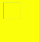
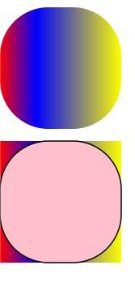
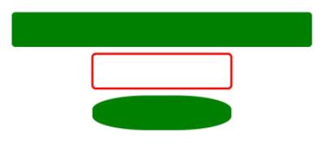
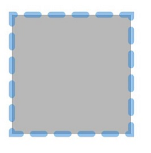

# Rect
<!--Kit: ArkUI-->
<!--Subsystem: ArkUI-->
<!--Owner: @camlostshi-->
<!--Designer: @fenglinbailu-->
<!--Tester: @liuli0427-->
<!--Adviser: @Brilliantry_Rui-->
<!-- md-trans-meta sourceCommit=814c7cb9af37d443e12a84b71f28815df508c584 translatedAt=2026-08-28T01:26:57.439Z pushedAt=2026-08-31T07:02:21.700Z -->

The **Rect** component is used to draw a rectangle. It supports setting attributes such as fill color, stroke style, and rounded corners.

>  **NOTE**
>
>  This component is supported since API version 7. Updates will be marked with a superscript to indicate their earliest API version.
>
>  Since API version 20, this component supports using the [updateConstructorParams](../js-apis-arkui-AttributeUpdater.md#properties) API of the [AttributeUpdater](../js-apis-arkui-AttributeUpdater.md) class to update constructor parameters.


## Child Components

None

## APIs

### Rect

new Rect(options?: RectOptions | RoundedRectOptions)

Draws a rectangle. After being called, it creates a **Rect** object, for which attributes such as width, height, and rounded corners can be set.

**Widget capability**: Since API version 9, this feature is supported in ArkTS widgets.

**Atomic service API**: This API can be used in atomic services since API version 11.

**System capability**: SystemCapability.ArkUI.ArkUI.Full

**Parameters**

| Name | Type | Mandatory | Description |
| -------- | -------- | -------- | -------- |
| options | [RectOptions](ts-drawing-components-rect.md#rectoptions18) \| [RoundedRectOptions](ts-drawing-components-rect.md#roundedrectoptions18)  | No | Drawing attributes of the rectangle, including the width, height, and rounded corners. If this parameter is not set, the rectangle is drawn with the default values of the attributes (the width, height, and rounded corners are all 0).<br>The abnormal values **undefined** and **null** are treated as invalid values, and the setting does not take effect.|

### Rect

Rect(options?: RectOptions | RoundedRectOptions)

Draws a rectangle. After being called, it creates a **Rect** object, for which attributes such as width, height, and rounded corners can be set.

**Widget capability**: This API can be used in ArkTS widgets since API version 9.

**Atomic service API**: This API can be used in atomic services since API version 11.

**System capability**: SystemCapability.ArkUI.ArkUI.Full

**Parameters**

| Name| Type| Mandatory| Description|
| -------- | -------- | -------- | -------- |
| options | [RectOptions](ts-drawing-components-rect.md#rectoptions18) \| [RoundedRectOptions](ts-drawing-components-rect.md#roundedrectoptions18) | No | Rect drawing attributes, including the width, height, and rounded corner configurations. If this parameter is not passed, the rectangle is drawn with the default values of the attributes (the width, height, and rounded corners are all 0).<br>The abnormal values **undefined** and **null** are treated as invalid values, and this setting does not take effect.|

## RectOptions<sup>18+</sup>

Describes the drawing attributes of the **Rect** component.

> **NOTE**
>
> To standardize anonymous object definitions, the element definitions here have been revised in API version 18. While historical version information is preserved for anonymous objects, there may be cases where the outer element's @since version number is higher than inner elements'. This does not affect interface usability.

**Widget capability**: This API can be used in ArkTS widgets since API version 18.

**Atomic service API**: This API can be used in atomic services since API version 18.

**Model restriction**: This API can be used only in the stage model.

**System capability**: SystemCapability.ArkUI.ArkUI.Full

| Name| Type| Read-Only| Optional| Description|
| -------- | -------- | -------- | -------- | -------- |
| width<sup>7+</sup> | [Length](ts-types.md#length) | No | Yes | Width, with the value range greater than or equal to 0.<br>Default value: **0**<br>Default unit: vp.<br>Abnormal values **undefined**, **null**, **NaN**, and **Infinity** are handled as the default value.<br>**Widget capability:** This API can be used in ArkTS widgets since API version 9.<br>**Atomic service API:** This API can be used in atomic services since API version 11. |
| height<sup>7+</sup> | [Length](ts-types.md#length) | No | Yes | Height, with the value range greater than or equal to 0.<br>Default value: **0**<br>Default unit: vp.<br>Abnormal values **undefined**, **null**, **NaN**, and **Infinity** are handled as the default value.<br>**Widget capability:** This API can be used in ArkTS widgets since API version 9.<br>**Atomic service API:** This API can be used in atomic services since API version 11. |
| radius<sup>7+</sup> | [Length](ts-types.md#length) \| Array&lt;any&gt; | No | Yes | Rounded corner radius. The radius of each of the four corners can be set separately, with the value range greater than or equal to 0.<br>This attribute has an effect similar to that of **radiusWidth**/**radiusHeight**. When used together, it takes precedence over **radiusWidth**/**radiusHeight**.<br>Default value: **0**<br>Default unit: vp.<br>Abnormal values **undefined**, **null**, **NaN**, and **Infinity** are handled as the default value.<br>**Widget capability:** This API can be used in ArkTS widgets since API version 9.<br>**Atomic service API:** This API can be used in atomic services since API version 11. |

## RoundedRectOptions<sup>18+</sup>
Describes the drawing attributes of the rounded rectangle component.

> **NOTE**
>
> To standardize anonymous object definitions, the element definitions here have been revised in API version 18. While historical version information is preserved for anonymous objects, there may be cases where the outer element's @since version number is higher than inner element's. This does not affect interface usability.

**Widget capability**: This API can be used in ArkTS widgets since API version 18.

**Atomic service API**: This API can be used in atomic services since API version 18.

**Model restriction**: This API can be used only in the stage model.

**System capability**: SystemCapability.ArkUI.ArkUI.Full

| Name| Type| Read-Only| Optional| Description|
| -------- | -------- | -------- | -------- | -------- |
| width<sup>7+</sup> | [Length](ts-types.md#length) | No | Yes | Width, value range: ≥ 0.<br>Default value: **0**<br>Default unit: vp.<br>Abnormal values **undefined**, **null**, **NaN**, and **Infinity** are handled as the default value.<br>**Widget capability:** This API can be used in ArkTS widgets since API version 9.<br>**Atomic service API:** This API can be used in atomic services since API version 11. |
| height<sup>7+</sup> | [Length](ts-types.md#length) | No | Yes | Height, value range: ≥ 0.<br>Default value: **0**<br>Default unit: vp.<br>Abnormal values **undefined**, **null**, **NaN**, and **Infinity** are handled as the default value.<br>**Widget capability:** This API can be used in ArkTS widgets since API version 9.<br>**Atomic service API:** This API can be used in atomic services since API version 11. |
| radiusWidth<sup>7+</sup> | [Length](ts-types.md#length) | No | Yes | Width of the rounded corner, value range: ≥ 0.<br>Default value: **0**<br>Default unit: vp.<br>Abnormal values **undefined**, **null**, **NaN**, and **Infinity** are handled as the default value.<br>**Widget capability:** This API can be used in ArkTS widgets since API version 9.<br>**Atomic service API:** This API can be used in atomic services since API version 11. |
| radiusHeight<sup>7+</sup> | [Length](ts-types.md#length) | No | Yes | Height of the rounded corner, value range: ≥ 0.<br>Default value: **0**<br>Default unit: vp.<br>Abnormal values **undefined**, **null**, **NaN**, and **Infinity** are handled as the default value.<br>**Widget capability:** This API can be used in ArkTS widgets since API version 9.<br>**Atomic service API:** This API can be used in atomic services since API version 11. |

## Attributes

In addition to the [universal attributes](ts-component-general-attributes.md) and [universal drawing attributes](ts-drawing-components-common.md), the following attributes are supported:

### radiusWidth

radiusWidth(value: Length)

Sets the width of the rounded corner. When only **radiusWidth** is set, the width and height of the rounded corner are the same. This attribute has an effect similar to that of [radius](#radius). When used together with **radius**, **radius** takes precedence over this attribute. This attribute supports dynamic setting of the attribute method through [attributeModifier](ts-universal-attributes-attribute-modifier.md#attributemodifier). The abnormal values **undefined**, **null**, **NaN**, and **Infinity** are handled based on the default value.

**Widget capability**: This API can be used in ArkTS widgets since API version 9.

**Atomic service API**: This API can be used in atomic services since API version 11.

**System capability**: SystemCapability.ArkUI.ArkUI.Full

**Parameters**

| Name| Type                      | Mandatory| Description                      |
| ------ | -------------------------- | ---- | -------------------------- |
| value  | [Length](ts-types.md#length) | Yes   | Width of the rounded corner. Value range: ≥ 0.<br>Default value: **0**<br>Default unit: vp<br>The abnormal values **undefined**, **null**, **NaN**, and **Infinity** are processed as the default value. |

### radiusHeight

radiusHeight(value: Length)

Sets the height of the rounded corner. When only **radiusHeight** is set, the height and width of the rounded corner are the same. This attribute has an effect similar to that of [radius](#radius). When used together with **radius**, **radius** takes precedence over this attribute. This attribute supports dynamic setting of the attribute method through [attributeModifier](ts-universal-attributes-attribute-modifier.md#attributemodifier). The abnormal values **undefined**, **null**, **NaN**, and **Infinity** are handled based on the default value.

**Widget capability**: This API can be used in ArkTS widgets since API version 9.

**Atomic service API**: This API can be used in atomic services since API version 11.

**System capability**: SystemCapability.ArkUI.ArkUI.Full

**Parameters**

| Name| Type                      | Mandatory| Description                      |
| ------ | -------------------------- | ---- | -------------------------- |
| value  | [Length](ts-types.md#length) | Yes   | Height of the rounded corner. Value range: ≥ 0.<br>Default value: **0**<br>Default unit: vp.<br>The abnormal values **undefined**, **null**, **NaN**, and **Infinity** are processed as the default value.|

### radius

radius(value: Length | Array&lt;any&gt;)

Sets the radius of the rounded corner. The value range is greater than or equal to 0. This attribute supports dynamic setting of the attribute method through [attributeModifier](ts-universal-attributes-attribute-modifier.md#attributemodifier). This attribute has an effect similar to that of [radiusWidth](#radiuswidth) and [radiusHeight](#radiusheight). When used together, it takes precedence over **radiusWidth** and **radiusHeight**. The abnormal values **undefined**, **null**, **NaN**, and **Infinity** are handled based on the default value.

**Widget capability**: This API can be used in ArkTS widgets since API version 9.

**Atomic service API**: This API can be used in atomic services since API version 11.

**System capability**: SystemCapability.ArkUI.ArkUI.Full

**Parameters**

| Name| Type                                                        | Mandatory| Description                      |
| ------ | ------------------------------------------------------------ | ---- | -------------------------- |
| value  | [Length](ts-types.md#length) \| Array&lt;any&gt; | Yes   | Rounded corner radius.<br>Default value: **0**<br>Default unit: vp <br>Abnormal values **undefined**, **null**, **NaN**, and **Infinity** are processed as [[0, 0], [0, 0], [0, 0], [0, 0]].|

## Examples

### Example 1: Drawing a Rectangle

This example demonstrates how to use **fill**, **fillOpacity**, **stroke**, and **radius** to draw rectangles with specific fill colors, opacity, stroke colors, and rounded corners.

```ts
// xxx.ets
@Entry
@Component
struct RectExample {
  build() {
    Column({ space: 10 }) {
      Text('normal').fontSize(11).fontColor(0xCCCCCC).width('90%')
      // Draw a 90% × 50 rectangle.
      Column({ space: 5 }) {
        Text('normal').fontSize(9).fontColor(0xCCCCCC).width('90%')
        // Draw a 90% × 50 rectangle.
        Rect({ width: '90%', height: 50 })
          .fill(Color.Pink)
        // Draw a 90% × 50 rectangle.
        Rect()
          .width('90%')
          .height(50)
          .fillOpacity(0)
          .stroke(Color.Red)
          .strokeWidth(3)

        Text('with rounded corners').fontSize(11).fontColor(0xCCCCCC).width('90%')
        // Draw a 90% × 80 rectangle, with the width and height of its rounded corners being 40 and 20, respectively.
        Rect({ width: '90%', height: 80 })
          .radiusHeight(20)
          .radiusWidth(40)
          .fill(Color.Pink)
        // Draw a 90% × 80 rectangle, with the width and height of its rounded corners being both 20.
        Rect({ width: '90%', height: 80 })
          .radius(20)
          .fill(Color.Pink)
          .stroke(Color.Transparent)
      }.width('100%').margin({ top: 10 })

      // Draw a 90% × 80 rectangle, with rounded corner width and height of 40 for the top-left corner, 20 for the top-right corner, 40 for the bottom-right corner, and 20 for the bottom-left corner.
      Rect({ width: '90%', height: 80 })
        .radius([[40, 40], [20, 20], [40, 40], [20, 20]])
        .fill(Color.Pink)
    }.width('100%').margin({ top: 5 })
  }
}
```



### Example 2: Drawing a Gradient Rectangle

This example uses the universal attributes [linearGradient](../../../reference/apis-arkui/arkui-ts/ts-universal-attributes-gradient-color.md#lineargradient18) and [clipShape](../../../reference/apis-arkui/arkui-ts/ts-universal-attributes-sharp-clipping.md#clipshape18) to draw a rectangle with a gradient color.

The universal attributes **linearGradient** and **clipShape** are supported since API version 18.

```ts
// xxx.ets
@Entry
@Component
struct RectExample {
  build() {
    Column({ space: 10 }) {
      Column()
        .width(100)
        .height(100)
        .linearGradient({
          direction: GradientDirection.Right,
          colors: [[0xff0000, 0.0], [0x0000ff, 0.3], [0xffff00, 1.0]]
        })
        .clipShape(new Rect({ width: 100, height: 100, radius: 40 }))
      Rect()
        .width(100)
        .height(100)
        // Set the color of the fill area. To display the gradient color of the background, set .fillOpacity(0.0).
        .fill(Color.Pink)
        // Set the rounded corner to 40.
        .radius(40)
        .stroke(Color.Black)
        // Set the gradient color. It takes effect only for a 100 × 100 rectangular area. The boundary of the gradient color does not contain chamfers.
        .linearGradient({
          direction: GradientDirection.Right,
          colors: [[0xff0000, 0.0], [0x0000ff, 0.3], [0xffff00, 1.0]]
        })
    }
  }
}
```



### Example 3: Drawing a Rectangle with Different Parameter Types

This example demonstrates how to draw a rectangle using different parameter types for the **width**, **height**, **radius**, **radiusWidth**, and **radiusHeight** attributes.

```ts
// xxx.ets
@Entry
@Component
struct RectExample {
  build() {
    Column({ space: 10 }) {
      // Draw a 90% × 50 rectangle, with the radius of rounded corners being 5.
      Rect({ width: '90%', height: '50', radius: '5' }) // Use the string type.
        .fill(Color.Green)
      // Draw a 200 × 50 rectangle, with the radius of rounded corners being 5.
      Rect({ width: 200, height: 50, radius: 5 }) // Use the number type.
        .fillOpacity(0)
        .stroke(Color.Red)
        .strokeWidth(3)
      // Use the Resource type to obtain the size and rounded corner parameters from the resource file to draw a rectangle.
      Rect({
        width: $r('app.string.RectWidth'), // Use the Resource type, which needs to be customized.
        height: $r('app.string.RectHeight'),
        radius: $r('app.string.RectRadius')
      })
        .radiusWidth($r('app.string.RectRadiusWidth'))
        .radiusHeight($r('app.string.RectRadiusHeight'))
        .fill(Color.Green)
    }.width('100%').margin({ top: 5 })
  }
}
```



### Example 4: Dynamically Setting Attributes of the Rect Component Using attributeModifier

This example shows how to use **attributeModifier** to dynamically set the **fill**, **fillOpacity**, **stroke**, **strokeDashArray**, **strokeDashOffset**, **strokeLineCap**, **strokeLineJoin**, **strokeMiterLimit**, **strokeOpacity**, **strokeWidth**, and **antiAlias** attributes of the **Rect** component.

```ts
// xxx.ets
class MyRectModifier implements AttributeModifier<RectAttribute> {
  applyNormalAttribute(instance: RectAttribute): void {
    // Fill with color #707070, fill opacity 0.5, stroke color #2787D9, stroke dash length and gap length both 20, offset 15 to the left, line cap style round, line join style miter, miter limit 5, stroke opacity 0.5, stroke width 10, and anti-aliasing enabled.
    instance.fill("#707070")
    instance.fillOpacity(0.5)
    instance.stroke("#2787D9")
    instance.strokeDashArray([20])
    instance.strokeDashOffset("15")
    instance.strokeLineCap(LineCapStyle.Round)
    instance.strokeLineJoin(LineJoinStyle.Miter)
    instance.strokeMiterLimit(5)
    instance.strokeOpacity(0.5)
    instance.strokeWidth(10)
    instance.antiAlias(true)
  }
}

@Entry
@Component
struct RectModifierDemo {
  @State modifier: MyRectModifier = new MyRectModifier()

  build() {
    Column() {
      Rect()
        .width(200)
        .height(200)
        .attributeModifier(this.modifier)
        .offset({ x: 20, y: 20 })
    }
  }
}
```

