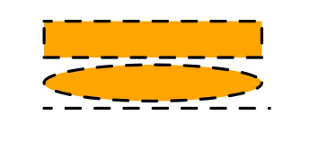
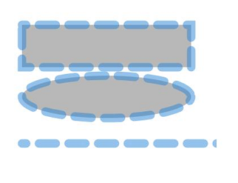

# Shape
<!--Kit: ArkUI-->
<!--Subsystem: ArkUI-->
<!--Owner: @zjsxstar-->
<!--Designer: @sunbees-->
<!--Tester: @liuli0427-->
<!--Adviser: @HelloCrease-->

The **Shape** component is the parent component of the drawing components. The attributes described in this topic are universal attributes supported by all the drawing components.

1. Drawing components use **Shape** as their parent to implement the effect similar to SVG.

2. The **Shape** component is used independently to draw a specific shape.

>  **NOTE**
>
>  This component is supported since API version 7. Updates will be marked with a superscript to indicate their earliest API version.
>
>  This component supports dynamic constructor parameter updates using the [updateConstructorParams](../js-apis-arkui-AttributeUpdater.md#properties) API of the [AttributeUpdater](../js-apis-arkui-AttributeUpdater.md) class since API version 20.


## Child Components

[Rect](ts-drawing-components-rect.md), [Path](ts-drawing-components-path.md), [Circle](ts-drawing-components-circle.md), [Ellipse](ts-drawing-components-ellipse.md), [Polyline](ts-drawing-components-polyline.md), [Polygon](ts-drawing-components-polygon.md), [Image](ts-basic-components-image.md), [Text](ts-basic-components-text.md), [Column](ts-container-column.md), [Row](ts-container-row.md), and Shape child components are included.


## APIs

Shape(value?: PixelMap)

Since API version 9, this API is supported in ArkTS widgets, except that **PixelMap** objects are not supported.

**Atomic service API**: This API can be used in atomic services since API version 11.

**System capability**: SystemCapability.ArkUI.ArkUI.Full

**Parameters**

| Name| Type| Mandatory| Description|
| -------- | -------- | -------- | -------- |
| value | [PixelMap](../../apis-image-kit/arkts-apis-image-PixelMap.md) | No| Drawing target. You can draw a graph in the specified PixelMap object. If this parameter is not set, the graph is drawn in the current drawing target by default.<br>Abnormal values undefined and null are processed as invalid values.|


## ViewportRect<sup>18+</sup>

Describes the drawing attributes of a viewport.

> **NOTE**
>
> To standardize anonymous object definitions, the element definitions here have been revised in API version 18. While historical version information is preserved for anonymous objects, there may be cases where the outer element's @since version number is higher than inner elements'. This does not affect interface usability.

**Widget capability**: This API can be used in ArkTS widgets since API version 18.

**Atomic service API**: This API can be used in atomic services since API version 18.

**System capability**: SystemCapability.ArkUI.ArkUI.Full

| Name| Type| Read-Only| Optional| Description|
| -------- | -------- | -------- | -------- | -------- |
| x<sup>7+</sup> | [Length](ts-types.md#length) | No| Yes| Horizontal coordinate of the start point of the viewport.<br>Default value: **0**.<br>Default unit: vp.<br>Invalid values are treated as the default value.<br>**Widget capability**: Since API version 9, this API is supported in ArkTS widgets.<br>**Atomic service API**: This API can be used in atomic services since API version 11.|
| y<sup>7+</sup> | [Length](ts-types.md#length) | No| Yes| Vertical coordinate of the start point of the viewport.<br>Default value: **0**.<br>Default unit: vp.<br>Invalid values are treated as the default value.<br>**Widget capability**: Since API version 9, this API is supported in ArkTS widgets.<br>**Atomic service API**: This API can be used in atomic services since API version 11.|
| width<sup>7+</sup> | [Length](ts-types.md#length) | No| Yes| Width of the viewport. The value must be greater than or equal to 0.<br>Default value: **0**.<br>Default unit: vp.<br>Invalid values are treated as the default value.<br>**Widget capability**: Since API version 9, this API is supported in ArkTS widgets.<br>**Atomic service API**: This API can be used in atomic services since API version 11.|
| height<sup>7+</sup> | [Length](ts-types.md#length) | No| Yes| Height of the viewport. The value must be greater than or equal to 0.<br>Default value: **0**.<br>Default unit: vp.<br>Invalid values are treated as the default value.<br>**Widget capability**: Since API version 9, this API is supported in ArkTS widgets.<br>**Atomic service API**: This API can be used in atomic services since API version 11.|


## Attributes

In addition to the [universal attributes](ts-component-general-attributes.md), the following attributes are supported.

### viewPort

viewPort(value: ViewportRect)

Sets the viewport of the shape.

**Widget capability**: Since API version 9, this API is supported in ArkTS widgets.

**Atomic service API**: This API can be used in atomic services since API version 11.

**System capability**: SystemCapability.ArkUI.ArkUI.Full

**Parameters**

| Name| Type| Mandatory| Description|
| -------- | -------- | -------- | -------- |
| value | [ViewportRect](ts-drawing-components-shape.md#viewportrect18) | Yes| Options of the viewport.<br>The **undefined** value is treated as the default value.|

### fill

fill(value: ResourceColor)

Sets the color of the fill area. This attribute can be dynamically set using [attributeModifier](ts-universal-attributes-attribute-modifier.md#attributemodifier). Invalid values are treated as the default value. If this attribute and the universal attribute **foregroundColor** are both set, whichever is set later takes effect.

**Widget capability**: Since API version 9, this API is supported in ArkTS widgets.

**Atomic service API**: This API can be used in atomic services since API version 11.

**System capability**: SystemCapability.ArkUI.ArkUI.Full

**Parameters**

| Name| Type                                      | Mandatory| Description                                  |
| ------ | ------------------------------------------ | ---- | -------------------------------------- |
| value  | [ResourceColor](ts-types.md#resourcecolor) | Yes  | Color of the fill area.<br>Default value: **Color.Black**<br>If the value is **undefined**, **null**, **NaN**, or **Infinity**, the default value will be used.|

### fillOpacity

fillOpacity(value: number | string | Resource)

Sets the opacity of the fill area. This attribute can be dynamically set using [attributeModifier](ts-universal-attributes-attribute-modifier.md#attributemodifier).

**Widget capability**: Since API version 9, this API is supported in ArkTS widgets.

**Atomic service API**: This API can be used in atomic services since API version 11.

**System capability**: SystemCapability.ArkUI.ArkUI.Full

**Parameters**

| Name| Type                                                        | Mandatory| Description                          |
| ------ | ------------------------------------------------------------ | ---- | ------------------------------ |
| value  | number \| string \| [Resource](ts-types.md#resource) | Yes  | Opacity of the fill area.<br>**NOTE**<br>The value range of the number format is [0.0, 1.0]. If the specified value is less than 0.0, the value is 0.0. If the specified value is greater than 1.0, the value is 1.0. Other abnormal values are processed as 1.0.<br>The string format supports the string format of the number format. The value range is the same as that of the number format.<br>The Resource format supports character strings in system resources or application resources. The value range is the same as that of the number format.<br>Default value: **1.0**.|

### stroke

stroke(value: ResourceColor)

Sets the stroke color. This attribute can be dynamically set using [attributeModifier](ts-universal-attributes-attribute-modifier.md#attributemodifier). If this attribute is not set, the default stroke opacity is **0**, meaning no border is displayed.

**Widget capability**: Since API version 9, this API is supported in ArkTS widgets.

**Atomic service API**: This API can be used in atomic services since API version 11.

**System capability**: SystemCapability.ArkUI.ArkUI.Full

**Parameters**

| Name| Type                                      | Mandatory| Description      |
| ------ | ------------------------------------------ | ---- | ---------- |
| value  | [ResourceColor](ts-types.md#resourcecolor) | Yes  | Stroke color.<br>Invalid values **undefined** and **null** are treated as the default value. The **NaN** and **Infinity** values are treated as **Color.Black**.|

### strokeDashArray

strokeDashArray(value: Array&lt;any&gt;)

Sets the stroke dashes. This attribute can be dynamically set using [attributeModifier](ts-universal-attributes-attribute-modifier.md#attributemodifier). The value must be greater than or equal to 0. Invalid values are treated as the default value.

**Widget capability**: Since API version 9, this API is supported in ArkTS widgets.

**Atomic service API**: This API can be used in atomic services since API version 11.

**System capability**: SystemCapability.ArkUI.ArkUI.Full

**Parameters**

| Name| Type            | Mandatory| Description                     |
| ------ | ---------------- | ---- | ------------------------- |
| value  | Array&lt;any&gt; | Yes  | Stroke dashes.<br>Default value: [] (empty array)<br>Default unit: vp.<br>The **undefined** and **null** values are treated as the default value.|

### strokeDashOffset

strokeDashOffset(value: Length)

Sets the offset of the start point for drawing the stroke. This attribute can be dynamically set using [attributeModifier](ts-universal-attributes-attribute-modifier.md#attributemodifier). Invalid values are treated as the default value.

**Widget capability**: Since API version 9, this API is supported in ArkTS widgets.

**Atomic service API**: This API can be used in atomic services since API version 11.

**System capability**: SystemCapability.ArkUI.ArkUI.Full

**Parameters**

| Name| Type                      | Mandatory| Description                                |
| ------ | -------------------------- | ---- | ------------------------------------ |
| value  | [Length](ts-types.md#length) | Yes  | Offset of the start point for drawing the stroke.<br>Default value: **0**.<br>Default unit: vp.<br>Abnormal values undefined and null are processed based on the default values. NaN and Infinity will cause strokeDashArray to become invalid.|

### strokeLineCap

strokeLineCap(value: LineCapStyle)

Sets the offset of the end point for drawing the stroke. This attribute can be dynamically set using [attributeModifier](ts-universal-attributes-attribute-modifier.md#attributemodifier).

**Widget capability**: Since API version 9, this API is supported in ArkTS widgets.

**Atomic service API**: This API can be used in atomic services since API version 11.

**System capability**: SystemCapability.ArkUI.ArkUI.Full

**Parameters**

| Name| Type                                             | Mandatory| Description                                            |
| ------ | ------------------------------------------------- | ---- | ------------------------------------------------ |
| value  | [LineCapStyle](ts-appendix-enums.md#linecapstyle) | Yes  | Cap style of the stroke.<br>Default value: **LineCapStyle.Butt**<br>If the value is **undefined**, **null**, **NaN**, or **Infinity**, the default value will be used.|

### strokeLineJoin

strokeLineJoin(value: LineJoinStyle)

Sets the join style of the stroke. This attribute can be dynamically set using [attributeModifier](ts-universal-attributes-attribute-modifier.md#attributemodifier).

**Widget capability**: Since API version 9, this API is supported in ArkTS widgets.

**Atomic service API**: This API can be used in atomic services since API version 11.

**System capability**: SystemCapability.ArkUI.ArkUI.Full

**Parameters**

| Name| Type                                               | Mandatory| Description                                              |
| ------ | --------------------------------------------------- | ---- | -------------------------------------------------- |
| value  | [LineJoinStyle](ts-appendix-enums.md#linejoinstyle) | Yes  | Join style of the stroke.<br>Default value: **LineJoinStyle.Miter**<br>If the value is **undefined**, **null**, **NaN**, or **Infinity**, the default value will be used.|

### strokeMiterLimit

strokeMiterLimit(value: Length)

Sets the limit on the ratio of the miter length to the value of stroke width used to draw a miter join. This attribute can be dynamically set using [attributeModifier](ts-universal-attributes-attribute-modifier.md#attributemodifier). The miter length indicates the distance from the outer tip to the inner corner of the miter. This attribute works only when **strokeLineJoin** is set to **LineJoinStyle.Miter**.

The value must be greater than or equal to 1.0. If the value is in the [0, 1) range, the value **1.0** will be used. In other cases, the default value will be used.

**Widget capability**: Since API version 9, this API is supported in ArkTS widgets.

**Atomic service API**: This API can be used in atomic services since API version 11.

**System capability**: SystemCapability.ArkUI.ArkUI.Full

**Parameters**

| Name| Type                      | Mandatory| Description                                          |
| ------ | -------------------------- | ---- | ---------------------------------------------- |
| value  | [Length](ts-types.md#length) | Yes  | Limit on the ratio of the miter length to the value of **strokeWidth** used to draw a miter join.<br>Default value: **4**<br>If the value is undefined, null, or NaN, the default value is used. If the value is Infinity, the stroke becomes invalid.|

### strokeOpacity

strokeOpacity(value: number | string | Resource)

Sets the stroke opacity. This attribute can be dynamically set using [attributeModifier](ts-universal-attributes-attribute-modifier.md#attributemodifier). The value range of this attribute is [0.0, 1.0]. If the given value is less than 0.0, the value is 0.0. If the given value is greater than 1.0, the value is 1.0.

**Widget capability**: Since API version 9, this API is supported in ArkTS widgets.

**Atomic service API**: This API can be used in atomic services since API version 11.

**System capability**: SystemCapability.ArkUI.ArkUI.Full

**Parameters**

| Name| Type                                                        | Mandatory| Description                      |
| ------ | ------------------------------------------------------------ | ---- | -------------------------- |
| value  | number \| string \| [Resource](ts-types.md#resource) | Yes  | Stroke opacity.<br>Default value: opacity set by the [stroke](#stroke) API.<br>**NaN** is treated as **0.0**, while **undefined**, **null**, and **Infinity** are treated as **1.0**.|

### strokeWidth

strokeWidth(value: Length)

Sets the stroke width. This attribute can be dynamically set using [attributeModifier](ts-universal-attributes-attribute-modifier.md#attributemodifier). If this attribute is of the string type, percentage values are not supported and will be treated as 1 px.

**Widget capability**: Since API version 9, this API is supported in ArkTS widgets.

**Atomic service API**: This API can be used in atomic services since API version 11.

**System capability**: SystemCapability.ArkUI.ArkUI.Full

**Parameters**

| Name| Type                        | Mandatory| Description                    |
| ------ | ---------------------------- | ---- | ------------------------ |
| value  | [Length](ts-types.md#length) | Yes  | Stroke width. The value must be greater than or equal to 0.<br>Default value: **1**.<br>Default unit: vp.<br>Default unit: vp.<br>For abnormal values undefined, null, and NaN, the default value is used. For Infinity, the value 0 is used.|

### antiAlias

antiAlias(value: boolean)

Sets whether to enable anti-aliasing. This attribute can be dynamically set using [attributeModifier](ts-universal-attributes-attribute-modifier.md#attributemodifier).

**Widget capability**: Since API version 9, this API is supported in ArkTS widgets.

**Atomic service API**: This API can be used in atomic services since API version 11.

**System capability**: SystemCapability.ArkUI.ArkUI.Full

**Parameters**

| Name| Type   | Mandatory| Description                                 |
| ------ | ------- | ---- | ------------------------------------- |
| value  | boolean | Yes  | Whether anti-aliasing is enabled.<br>**true**: Anti-aliasing is enabled. **false**: Anti-aliasing is disabled.<br>Default value: **true**<br>The **undefined** and **null** values are treated as the default value.|

### mesh<sup>8+</sup>

mesh(value: Array&lt;any&gt;, column: number, row: number)

Sets the mesh effect. An image is segmented into (row + 1) * (column + 1) grids. The coordinates of the intersection point of each grid are stored in an array (every two elements indicate the x and y coordinates of an intersection point). The coordinates in the value array are used to reposition the grid vertices to implement local image distortion. The [attributeModifier](ts-universal-attributes-attribute-modifier.md#attributemodifier) method can be used to dynamically set attributes.

> **NOTE**
>
> **mesh** takes effect only when a **pixelMap** object is passed to shape, and the effect applies to the passed **pixelMap** object. It produces the same result as [drawPixelMapMesh<sup>12+</sup>](../../../reference/apis-arkgraphics2d/arkts-apis-graphics-drawing-Canvas.md#drawpixelmapmesh12) in the [drawing module](../../../reference/apis-arkgraphics2d/arkts-apis-graphics-drawing.md). It is recommended that you use **drawPixelMapMesh**.

**Widget capability**: Since API version 9, this API is supported in ArkTS widgets.

**Atomic service API**: This API can be used in atomic services since API version 11.

**System capability**: SystemCapability.ArkUI.ArkUI.Full

**Parameters**

| Name| Type               | Mandatory| Description                                                        |
| ------ | ------------------- | ---- | ------------------------------------------------------------ |
| value  | Array&lt;any&gt; | Yes  | An array with the length of (row + 1) x (column + 1) x 2 records the position of each vertex in the distorted bitmap.<br>Abnormal values undefined, null, NaN, and Infinity are processed as invalid values.|
| column | number              | Yes  | Number of columns in the mesh matrix.<br>Abnormal values NaN and Infinity are processed as invalid values.|
| row    | number              | Yes  | Number of rows in the mesh matrix.<br>Abnormal values NaN and Infinity are processed as invalid values.|

## Example

### Example 1: Drawing Rectangles

This example demonstrates how to use the **Shape** component to draw rectangles, ellipses, and lines.

```ts
// xxx.ets
@Entry
@Component
struct ShapeExample {
  build() {
    Column({ space: 10 }) {
      Text('basic').fontSize(11).fontColor(0xCCCCCC).width(320)
      // Draw a 300 x 50 rectangle with strokes at (-2, -2). The fill color is 0x317AF7, the stroke color is black, the stroke width is 4, the stroke dash is 20, the offset is 10 to the left, the cap style is rounded, the join style is rounded, and anti-aliasing is enabled (default).
      // Draw a 300 x 50 ellipse with strokes at (-2, 58). The fill color is 0x317AF7, the stroke color is black, the stroke width is 4, the stroke dash is 20, the offset is 10 to the left, the cap style is rounded, the join style is rounded, and anti-aliasing is enabled (default).
      // Draw a 300 x 10 straight line at (-2, 118). The fill color is 0x317AF7, the stroke color is black, the stroke width is 4, the stroke dash is 20, the offset is 10 to the left, the cap style is rounded, the join style is rounded, and anti-aliasing is enabled (default).
      Shape() {
        Rect().width(300).height(50)
        Ellipse().width(300).height(50).offset({ x: 0, y: 60 })
        Path().width(300).height(10).commands('M0 0 L900 0').offset({ x: 0, y: 120 })
      }
      .width(350)
      .height(140)
      .viewPort({
        x: -2,
        y: -2,
        width: 304,
        height: 130
      })
      .fill(0x317AF7)
      .stroke(Color.Black)
      .strokeWidth(4)
      .strokeDashArray([20])
      .strokeDashOffset(10)
      .strokeLineCap(LineCapStyle.Round)
      .strokeLineJoin(LineJoinStyle.Round)
      .antiAlias(true)

      // Draw a 300 x 50 rectangle with strokes at (0, 0) and (-5, -5). The drawing start point is the midpoint of the stroke width by default. To fully display the strokes, you must set the coordinates of the start position of the viewport to negative values so that the viewport is offset by half the stroke width.
      Shape() {
        Rect().width(300).height(50)
      }
      .width(350)
      .height(80)
      .viewPort({
        x: 0,
        y: 0,
        width: 320,
        height: 70
      })
      .fill(0x317AF7)
      .stroke(Color.Black)
      .strokeWidth(10)

      Shape() {
        Rect().width(300).height(50)
      }
      .width(350)
      .height(80)
      .viewPort({
        x: -5,
        y: -5,
        width: 320,
        height: 70
      })
      .fill(0x317AF7)
      .stroke(Color.Black)
      .strokeWidth(10)

      Text('path').fontSize(11).fontColor(0xCCCCCC).width(320)
      // Draw a straight line at (0, -5). The fill color is 0xEE8443, the stroke width is 10, and the stroke dash is 20.
      Shape() {
        Path().width(300).height(10).commands('M0 0 L900 0')
      }
      .width(350)
      .height(20)
      .viewPort({
        x: 0,
        y: -5,
        width: 300,
        height: 20
      })
      .stroke(0xEE8443)
      .strokeWidth(10)
      .strokeDashArray([20])

      // Draw a straight line at (0, -5). The fill color is 0xEE8443, the stroke width is 10, the stroke dash is 20, and the offset is 10 to the left.
      Shape() {
        Path().width(300).height(10).commands('M0 0 L900 0')
      }
      .width(350)
      .height(20)
      .viewPort({
        x: 0,
        y: -5,
        width: 300,
        height: 20
      })
      .stroke(0xEE8443)
      .strokeWidth(10)
      .strokeDashArray([20])
      .strokeDashOffset(10)

      // Draw a straight line at (0, -5). The fill color is 0xEE8443, the stroke width is 10, and the stroke opacity is 0.5.
      Shape() {
        Path().width(300).height(10).commands('M0 0 L900 0')
      }
      .width(350)
      .height(20)
      .viewPort({
        x: 0,
        y: -5,
        width: 300,
        height: 20
      })
      .stroke(0xEE8443)
      .strokeWidth(10)
      .strokeOpacity(0.5)

      // Draw a straight line at (0, -5). The fill color is 0xEE8443, the stroke width is 10, the stroke dash is 20, and the cap style is rounded.
      Shape() {
        Path().width(300).height(10).commands('M0 0 L900 0')
      }
      .width(350)
      .height(20)
      .viewPort({
        x: 0,
        y: -5,
        width: 300,
        height: 20
      })
      .stroke(0xEE8443)
      .strokeWidth(10)
      .strokeDashArray([20])
      .strokeLineCap(LineCapStyle.Round)

      // Draw a closed path at (-20, -5). The fill color is 0x317AF7, the stroke width is 10, the stroke color is 0xEE8443, and the join style is miter (default value).
      Shape() {
        Path().width(200).height(60).commands('M0 0 L400 0 L400 150 Z')
      }
      .width(300)
      .height(200)
      .viewPort({
        x: -20,
        y: -5,
        width: 310,
        height: 90
      })
      .fill(0x317AF7)
      .stroke(0xEE8443)
      .strokeWidth(10)
      .strokeLineJoin(LineJoinStyle.Miter)
      .strokeMiterLimit(5)
    }.width('100%').margin({ top: 15 })
  }
}
```


### Example 2: Drawing Graphs Using Different Parameter Types

Different length types are used to draw graphs.

```ts
// xxx.ets
@Entry
@Component
struct ShapeTypeExample {
  build() {
    Column({ space: 10 }) {
      // Draw a 300 x 50 rectangle with strokes at (-2, -2). The fill color is 0x317AF7, the stroke color is black, the stroke width is 4, the stroke dash is 20, the offset is 10 to the left, the cap style is rounded, the join style is rounded, and anti-aliasing is enabled (default).
      // Draw a 300 x 50 ellipse with strokes at (-2, 58). The fill color is 0x317AF7, the stroke color is black, the stroke width is 4, the stroke dash is 20, the offset is 10 to the left, the cap style is rounded, the join style is rounded, and anti-aliasing is enabled (default).
      // Draw a 300 x 10 straight line at (-2, 118). The fill color is 0x317AF7, the stroke color is black, the stroke width is 4, the stroke dash is 20, the offset is 10 to the left, the cap style is rounded, the join style is rounded, and anti-aliasing is enabled (default).
      Shape() {
        Rect().width('300').height('50')
        Ellipse().width(300).height(50).offset({ x: 0, y: 60 })
        Path().width(300).height(10).commands('M0 0 L900 0').offset({ x: 0, y: 120 })
      }
      .width(350)
      .height(140)
      .viewPort({
        x: '-2', // Use the string type.
        y: '-2',
        width: $r('app.string.ViewportRectWidth'), // Use the Resource type, which needs to be customized by the user.
        height: $r('app.string.ViewportRectHeight')
      })
      .fill(Color.Orange)
      .stroke(Color.Black)
      .strokeWidth(4)
      .strokeDashArray([20])
      .strokeDashOffset(10) // Use the number type.
      .strokeLineCap(LineCapStyle.Round)
      .strokeLineJoin(LineJoinStyle.Round)
      .strokeMiterLimit(5)
      .antiAlias(true)
    }.width('100%').margin({ top: 15 })
  }
}
```



### Example 3: Using attributeModifier to Dynamically Set Shape Attributes

This example shows how to use **attributeModifier** to dynamically set the various attributes of the **Shape** component, such as **fill**, **stroke**, and **antiAlias**.

```ts
// xxx.ets
class MyShapeModifier implements AttributeModifier<ShapeAttribute> {
  applyNormalAttribute(instance: ShapeAttribute): void {
    // Fill color: #707070, fill opacity: 0.5, stroke color: #2787D9, stroke dash array: [20, 15], dash offset: 15, line cap: round, line join: miter, miter limit: 5, stroke opacity: 0.5, stroke width: 10, anti-aliasing enabled.
    instance.fill("#707070")
    instance.fillOpacity(0.5)
    instance.stroke("#2787D9")
    instance.strokeDashArray([20, 15])
    instance.strokeDashOffset("15")
    instance.strokeLineCap(LineCapStyle.Round)
    instance.strokeLineJoin(LineJoinStyle.Miter)
    instance.strokeMiterLimit(5)
    instance.strokeOpacity(0.5)
    instance.strokeWidth(10)
    instance.antiAlias(true)
  }
}

@Entry
@Component
struct ShapeModifierDemo {
  @State modifier: MyShapeModifier = new MyShapeModifier()

  build() {
    Column() {
      Shape() {
        Rect().width(200).height(50).offset({ x: 20, y: 20 })
        Ellipse().width(200).height(50).offset({ x: 20, y: 80 })
        Path().width(200).height(10).commands('M0 0 L900 0').offset({ x: 20, y: 160 })
      }
      .width(250).height(200)
      .attributeModifier(this.modifier)
    }
  }
}
```


<!--no_check-->