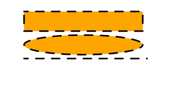
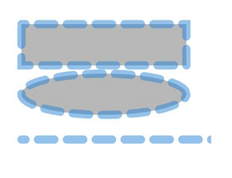

# Shape
<!--Kit: ArkUI-->
<!--Subsystem: ArkUI-->
<!--Owner: @zjsxstar-->
<!--Designer: @sunbees-->
<!--Tester: @liuli0427-->
<!--Adviser: @Brilliantry_Rui-->

The **Shape** component is the parent component of the drawing components. The attributes described in this topic are universal attributes supported by all the drawing components.

1. Drawing components use **Shape** as their parent to implement the effect similar to SVG.

2. Drawing components can be used independently to draw specified shapes.

>  **NOTE**
>
>  This component is supported since API version 7. Updates will be marked with a superscript to indicate their earliest API version.
>
>  This component supports dynamic constructor parameter updates using the [updateConstructorParams](../js-apis-arkui-AttributeUpdater.md#properties) API of the [AttributeUpdater](../js-apis-arkui-AttributeUpdater.md) class since API version 20.


## Child Components

The following child components are supported: [Rect](ts-drawing-components-rect.md), [Path](ts-drawing-components-path.md), [Circle](ts-drawing-components-circle.md), [Ellipse](ts-drawing-components-ellipse.md), [Polyline](ts-drawing-components-polyline.md), [Polygon](ts-drawing-components-polygon.md), [Image](ts-basic-components-image.md), [Text](ts-basic-components-text.md), [Column](ts-container-column.md), [Row](ts-container-row.md), and **Shape**.


## APIs

Shape(value?: PixelMap)

Since API version 9, this API is supported in ArkTS widgets, except that **PixelMap** objects are not supported.

**Atomic service API**: This API can be used in atomic services since API version 11.

**System capability**: SystemCapability.ArkUI.ArkUI.Full

**Parameters**

| Name| Type| Mandatory| Description|
| -------- | -------- | -------- | -------- |
| value | [PixelMap](../../apis-image-kit/arkts-apis-image-PixelMap.md) | No| Drawing target. You can draw a shape in a specified **PixelMap** object. If this parameter is not set, the shape is drawn in the current drawing target by default.<br>The **undefined** and **null** values are treated as invalid and will not take effect.|


## ViewportRect<sup>18+</sup>

Describes the options of the viewport.

> **NOTE**
>
> To standardize anonymous object definitions, the element definitions here have been revised in API version 18. While historical version information is preserved for anonymous objects, there may be cases where the outer element's @since version number is higher than inner elements'. This does not affect interface usability.

**Widget capability**: This API can be used in ArkTS widgets since API version 18.

**Atomic service API**: This API can be used in atomic services since API version 18.

**System capability**: SystemCapability.ArkUI.ArkUI.Full

| Name| Type| Read-Only| Optional| Description|
| -------- | -------- | -------- | -------- | -------- |
| x<sup>7+</sup> | [Length](ts-types.md#length) | No| Yes| Horizontal coordinate of the start point of the viewport.<br>Default value: **0**<br>Default unit: vp<br>Invalid values are treated as the default value.<br>**Widget capability**: This API can be used in ArkTS widgets since API version 9.<br>**Atomic service API**: This API can be used in atomic services since API version 11.|
| y<sup>7+</sup> | [Length](ts-types.md#length) | No| Yes| Vertical coordinate of the start point of the viewport.<br>Default value: **0**<br>Default unit: vp<br>Invalid values are treated as the default value.<br>**Widget capability**: This API can be used in ArkTS widgets since API version 9.<br>**Atomic service API**: This API can be used in atomic services since API version 11.|
| width<sup>7+</sup> | [Length](ts-types.md#length) | No| Yes| Width of the viewport. The value must be greater than or equal to 0.<br>Default value: **0**<br>Default unit: vp<br>Invalid values are treated as the default value.<br>**Widget capability**: This API can be used in ArkTS widgets since API version 9.<br>**Atomic service API**: This API can be used in atomic services since API version 11.|
| height<sup>7+</sup> | [Length](ts-types.md#length) | No| Yes| Height of the viewport. The value must be greater than or equal to 0.<br>Default value: **0**<br>Default unit: vp<br>Invalid values are treated as the default value.<br>**Widget capability**: This API can be used in ArkTS widgets since API version 9.<br>**Atomic service API**: This API can be used in atomic services since API version 11.|


## Attributes

In addition to the [universal attributes](ts-component-general-attributes.md), the following attributes are supported.

### viewPort

viewPort(value: ViewportRect)

Sets the viewport of the shape.

**Widget capability**: This API can be used in ArkTS widgets since API version 9.

**Atomic service API**: This API can be used in atomic services since API version 11.

**System capability**: SystemCapability.ArkUI.ArkUI.Full

**Parameters**

| Name| Type| Mandatory| Description|
| -------- | -------- | -------- | -------- |
| value | [ViewportRect](ts-drawing-components-shape.md#viewportrect18)| Yes| Options of the viewport.<br>Default value: **{}**<br>The **undefined** and **null** values are invalid and treated as the default value.|

### fill

fill(value: ResourceColor)

Sets the color of the fill area. This attribute can be dynamically set using [attributeModifier](ts-universal-attributes-attribute-modifier.md#attributemodifier). Invalid values are treated as the default value. If this attribute and the universal attribute **foregroundColor** are both set, whichever is set later takes effect.

**Widget capability**: This API can be used in ArkTS widgets since API version 9.

**Atomic service API**: This API can be used in atomic services since API version 11.

**System capability**: SystemCapability.ArkUI.ArkUI.Full

**Parameters**

| Name| Type                                      | Mandatory| Description                                  |
| ------ | ------------------------------------------ | ---- | -------------------------------------- |
| value  | [ResourceColor](ts-types.md#resourcecolor) | Yes  | Color of the fill area.<br>Default value: [Color](ts-appendix-enums.md#color).Black<br>The **undefined**, **null**, **NaN**, and **Infinity** values are invalid and treated as the default value.|

### fillOpacity

fillOpacity(value: number | string | Resource)

Sets the opacity of the fill area. This attribute can be dynamically set using [attributeModifier](ts-universal-attributes-attribute-modifier.md#attributemodifier).

**Widget capability**: This API can be used in ArkTS widgets since API version 9.

**Atomic service API**: This API can be used in atomic services since API version 11.

**System capability**: SystemCapability.ArkUI.ArkUI.Full

**Parameters**

| Name| Type                                                        | Mandatory| Description                          |
| ------ | ------------------------------------------------------------ | ---- | ------------------------------ |
| value  | number&nbsp;\|&nbsp;string&nbsp;\|&nbsp;[Resource](ts-types.md#resource) | Yes  | Opacity of the fill area.<br>**NOTE**<br>For the number type, the value range is [0.0, 1.0]. A value less than 0.0 is treated as **0.0**. A value greater than 1.0 is treated as **1.0**. Any other invalid value is treated as **1.0**.<br>For the string type, the value is a character string of the number type. The value range is the same as that of the number type.<br>For the Resource type, the value is a character string from the system resource or application resource. The value range is the same as that of the number type.<br>Default value: **1.0**|

### stroke

stroke(value: ResourceColor)

Sets the stroke color. This attribute can be dynamically set using [attributeModifier](ts-universal-attributes-attribute-modifier.md#attributemodifier). If this attribute is not set, the default stroke opacity is **0**, meaning no stroke is displayed.

**Widget capability**: This API can be used in ArkTS widgets since API version 9.

**Atomic service API**: This API can be used in atomic services since API version 11.

**System capability**: SystemCapability.ArkUI.ArkUI.Full

**Parameters**

| Name| Type                                      | Mandatory| Description      |
| ------ | ------------------------------------------ | ---- | ---------- |
| value  | [ResourceColor](ts-types.md#resourcecolor) | Yes  | Stroke color.<br>Default value: [Color](ts-appendix-enums.md#color).Transparent<br>Invalid values **undefined** and **null** values are treated as the default value, and invalid values **NaN** and **Infinity** are treated as [Color](ts-appendix-enums.md#color).Black.|

### strokeDashArray

strokeDashArray(value: Array&lt;any&gt;)

Sets the stroke dashes. This attribute can be dynamically set using [attributeModifier](ts-universal-attributes-attribute-modifier.md#attributemodifier). The value must be greater than or equal to 0. Invalid values are treated as the default value.

**Widget capability**: This API can be used in ArkTS widgets since API version 9.

**Atomic service API**: This API can be used in atomic services since API version 11.

**System capability**: SystemCapability.ArkUI.ArkUI.Full

**Parameters**

| Name| Type            | Mandatory| Description                     |
| ------ | ---------------- | ---- | ------------------------- |
| value  | Array&lt;any&gt; | Yes  | Array defining the dash pattern for the shape outline. Elements alternate between dash length and gap length.<br>Default value: **[]** (empty array)<br>Default unit: vp<br>The **undefined** and **null** values are invalid and treated as the default value.<br>**NOTE**<br>Empty array: solid line<br>Even-numbered array: Elements cycle sequentially, for example, [a, b, c, d] represents: dash a -> gap b -> dash c -> gap d -> dash a -> ...<br>Odd-numbered array: Elements are duplicated to create an even-numbered array, for example, [a, b, c] becomes [a, b, c, a, b, c], representing: dash a -> gap b -> dash c -> gap a -> dash b -> gap c -> dash a -> ...|

### strokeDashOffset

strokeDashOffset(value: Length)

Sets the offset of the start point for drawing the stroke. This attribute can be dynamically set using [attributeModifier](ts-universal-attributes-attribute-modifier.md#attributemodifier). Invalid values are treated as the default value.

**Widget capability**: This API can be used in ArkTS widgets since API version 9.

**Atomic service API**: This API can be used in atomic services since API version 11.

**System capability**: SystemCapability.ArkUI.ArkUI.Full

**Parameters**

| Name| Type                      | Mandatory| Description                                |
| ------ | -------------------------- | ---- | ------------------------------------ |
| value  | [Length](ts-types.md#length) | Yes  | Offset of the start point for drawing the stroke.<br>Default value: **0**<br>Default unit: vp<br>Invalid values **undefined** and **null** are treated as the default value. If set to **NaN** or **Infinity**, **strokeDashArray** has no effect.|

### strokeLineCap

strokeLineCap(value: LineCapStyle)

Sets the cap style of the stroke. This attribute can be dynamically set using [attributeModifier](ts-universal-attributes-attribute-modifier.md#attributemodifier).

**Widget capability**: This API can be used in ArkTS widgets since API version 9.

**Atomic service API**: This API can be used in atomic services since API version 11.

**System capability**: SystemCapability.ArkUI.ArkUI.Full

**Parameters**

| Name| Type                                             | Mandatory| Description                                            |
| ------ | ------------------------------------------------- | ---- | ------------------------------------------------ |
| value  | [LineCapStyle](ts-appendix-enums.md#linecapstyle) | Yes  | Cap style of the stroke.<br>Default value: **LineCapStyle.Butt**<br>The **undefined**, **null**, **NaN**, and **Infinity** values are invalid and treated as the default value.|

### strokeLineJoin

strokeLineJoin(value: LineJoinStyle)

Sets the join style of the stroke. This attribute can be dynamically set using [attributeModifier](ts-universal-attributes-attribute-modifier.md#attributemodifier).

**Widget capability**: This API can be used in ArkTS widgets since API version 9.

**Atomic service API**: This API can be used in atomic services since API version 11.

**System capability**: SystemCapability.ArkUI.ArkUI.Full

**Parameters**

| Name| Type                                               | Mandatory| Description                                              |
| ------ | --------------------------------------------------- | ---- | -------------------------------------------------- |
| value  | [LineJoinStyle](ts-appendix-enums.md#linejoinstyle) | Yes  | Join style of the stroke.<br>Default value: **LineJoinStyle.Miter**<br>The **undefined**, **null**, **NaN**, and **Infinity** values are invalid and treated as the default value.|

### strokeMiterLimit

strokeMiterLimit(value: Length)

Sets the limit on the ratio of the miter length to the value of stroke width used to draw a miter join. This attribute can be dynamically set using [attributeModifier](ts-universal-attributes-attribute-modifier.md#attributemodifier). The miter length indicates the distance from the outer tip to the inner corner of the miter. The border width is the value of **strokeWidth**. This attribute works only when **strokeLineJoin** is set to **LineJoinStyle.Miter**.

The value must be greater than or equal to 1.0. If the value is in the [0, 1) range, the value **1.0** will be used. In other cases, the default value will be used.

**Widget capability**: This API can be used in ArkTS widgets since API version 9.

**Atomic service API**: This API can be used in atomic services since API version 11.

**System capability**: SystemCapability.ArkUI.ArkUI.Full

**Parameters**

| Name| Type                      | Mandatory| Description                                          |
| ------ | -------------------------- | ---- | ---------------------------------------------- |
| value  | [Length](ts-types.md#length) | Yes  | Limit on the ratio of the miter length to the value of **strokeWidth** used to draw a miter join.<br>Default value: **4**<br>The **undefined**, **null**, and **NaN** values are invalid and treated as the default value. If set to **Infinity**, **stroke** has no effect.|

### strokeOpacity

strokeOpacity(value: number | string | Resource)

Sets the stroke opacity. This attribute can be dynamically set using [attributeModifier](ts-universal-attributes-attribute-modifier.md#attributemodifier). The value range is [0.0, 1.0]. If the set value is less than 0.0, **0.0** will be used. If the set value is greater than 1.0, **1.0** will be used.

**Widget capability**: This API can be used in ArkTS widgets since API version 9.

**Atomic service API**: This API can be used in atomic services since API version 11.

**System capability**: SystemCapability.ArkUI.ArkUI.Full

**Parameters**

| Name| Type                                                        | Mandatory| Description                      |
| ------ | ------------------------------------------------------------ | ---- | -------------------------- |
| value  | number&nbsp;\|&nbsp;string&nbsp;\|&nbsp;[Resource](ts-types.md#resource) | Yes  | Stroke opacity.<br>Default value: opacity set by the [stroke](#stroke) API<br>Invalid value **NaN** is treated as **0.0**, while invalid values **undefined**, **null**, and **Infinity** are treated as **1.0**.|

### strokeWidth

strokeWidth(value: Length)

Sets the stroke width. This attribute can be dynamically set using [attributeModifier](ts-universal-attributes-attribute-modifier.md#attributemodifier). If this attribute is of the string type, percentage values are not supported and will be treated as 1 px.

**Widget capability**: This API can be used in ArkTS widgets since API version 9.

**Atomic service API**: This API can be used in atomic services since API version 11.

**System capability**: SystemCapability.ArkUI.ArkUI.Full

**Parameters**

| Name| Type                        | Mandatory| Description                    |
| ------ | ---------------------------- | ---- | ------------------------ |
| value  | [Length](ts-types.md#length) | Yes  | Stroke width. The value must be greater than or equal to 0.<br>Default value: **1**<br>Default unit: vp<br>Invalid values **undefined**, **null**, and **NaN** are treated as the default value, and invalid value **Infinity** is treated as **0**.|

### antiAlias

antiAlias(value: boolean)

Sets whether to enable anti-aliasing. This attribute can be dynamically set using [attributeModifier](ts-universal-attributes-attribute-modifier.md#attributemodifier).

**Widget capability**: This API can be used in ArkTS widgets since API version 9.

**Atomic service API**: This API can be used in atomic services since API version 11.

**System capability**: SystemCapability.ArkUI.ArkUI.Full

**Parameters**

| Name| Type   | Mandatory| Description                                 |
| ------ | ------- | ---- | ------------------------------------- |
| value  | boolean | Yes  | Whether to enable anti-aliasing.<br>**true**: enable anti-aliasing; **false**: disable anti-aliasing.<br>Default value: **true**<br>Invalid values **undefined** and **null** are treated as **false**.|

### mesh<sup>8+</sup>

mesh(value: Array&lt;any&gt;, column: number, row: number)

Sets the mesh effect. An image is divided into (row + 1) × (column + 1) meshes. The coordinates of each mesh intersection point are stored in the array. (Every two elements indicate the x and y coordinates of an intersection point.) The mesh vertex position is relocated based on the coordinates in the array value to implement partial image distortion. This attribute can be dynamically set using [attributeModifier](ts-universal-attributes-attribute-modifier.md#attributemodifier).

> **NOTE**
>
> **mesh** takes effect only when a **pixelMap** object is passed to the shape, and the effect applies to the passed **pixelMap** object. It produces the same result as [drawPixelMapMesh<sup>12+</sup>](../../../reference/apis-arkgraphics2d/arkts-apis-graphics-drawing-Canvas.md#drawpixelmapmesh12) in the [drawing module](../../../reference/apis-arkgraphics2d/arkts-apis-graphics-drawing.md). It is recommended that you use **drawPixelMapMesh**.

**Widget capability**: This API can be used in ArkTS widgets since API version 9.

**Atomic service API**: This API can be used in atomic services since API version 11.

**System capability**: SystemCapability.ArkUI.ArkUI.Full

**Parameters**

| Name| Type               | Mandatory| Description                                                        |
| ------ | ------------------- | ---- | ------------------------------------------------------------ |
| value  | Array&lt;any&gt; | Yes  | Array with a length of (row + 1) × (column + 1) × 2, which records the position of each vertex of the distorted bitmap.<br>Invalid values **undefined** and **null** are treated as an empty array. If the value is set to an empty array, the values of **column** and **row** are handled as **0**, and the value is handled as an empty array.|
| column | number              | Yes  | Number of mesh matrix columns.<br>If the value is **undefined**, **null**, **NaN**, or **Infinity**, the values of **column** and **row** are treated as **0**, and the value of **value** is treated as an empty array.|
| row    | number              | Yes  | Number of mesh matrix rows.<br>If the value is **undefined**, **null**, **NaN**, or **Infinity**, the values of **column** and **row** are treated as **0**, and the value of **value** is treated as an empty array.|

## Examples

### Example 1: Drawing a Shape

This example demonstrates how to draw rectangles, ellipses, and straight lines using the **Shape** component.

```ts
// xxx.ets
@Entry
@Component
struct ShapeExample {
  build() {
    Column({ space: 10 }) {
      Text('basic').fontSize(11).fontColor(0xCCCCCC).width(320)
      // Draw a 300 × 50 rectangle with strokes at (-2, -2). The fill color is 0x317AF7, the stroke color is black, the stroke width is 4, the stroke dash array is 20, the offset is 10 to the left, the cap style is semi-circle, the join style is rounded, and anti-aliasing is enabled (default).
      // Draw a 300 × 50 ellipse with strokes at (-2, 58). The fill color is 0x317AF7, the stroke color is black, the stroke width is 4, the stroke dash array is 20, the offset is 10 to the left, the cap style is semi-circle, the join style is rounded, and anti-aliasing is enabled (default).
      // Draw a 300 × 10 straight line at (-2, 118). The fill color is 0x317AF7, the stroke color is black, the stroke width is 4, the stroke dash array is 20, the offset is 10 to the left, the cap style is semi-circle, the join style is rounded, and anti-aliasing is enabled (default).
      Shape() {
        Rect().width(300).height(50)
        Ellipse().width(300).height(50).offset({ x: 0, y: 60 })
        Path().width(300).height(10).commands('M0 0 L900 0').offset({ x: 0, y: 120 })
      }
      .width(350)
      .height(140)
      .viewPort({
        x: -2,
        y: -2,
        width: 304,
        height: 130
      })
      .fill(0x317AF7)
      .stroke(Color.Black)
      .strokeWidth(4)
      .strokeDashArray([20])
      .strokeDashOffset(10)
      .strokeLineCap(LineCapStyle.Round)
      .strokeLineJoin(LineJoinStyle.Round)
      .antiAlias(true)

      // Draw a 300 × 50 rectangle with strokes at (0, 0) and (-5, -5). The coordinates of the start position of the viewport are set to negative values because the drawing start point is the midpoint of the line width by default. Therefore, to display the strokes completely, the viewport needs to be offset by half of the line width.
      Shape() {
        Rect().width(300).height(50)
      }
      .width(350)
      .height(80)
      .viewPort({
        x: 0,
        y: 0,
        width: 320,
        height: 70
      })
      .fill(0x317AF7)
      .stroke(Color.Black)
      .strokeWidth(10)

      Shape() {
        Rect().width(300).height(50)
      }
      .width(350)
      .height(80)
      .viewPort({
        x: -5,
        y: -5,
        width: 320,
        height: 70
      })
      .fill(0x317AF7)
      .stroke(Color.Black)
      .strokeWidth(10)

      Text('path').fontSize(11).fontColor(0xCCCCCC).width(320)
      // Draw a straight line at (0, -5). The fill color is 0xEE8443, the stroke width is 10, and the stroke dash array is 20.
      Shape() {
        Path().width(300).height(10).commands('M0 0 L900 0')
      }
      .width(350)
      .height(20)
      .viewPort({
        x: 0,
        y: -5,
        width: 300,
        height: 20
      })
      .stroke(0xEE8443)
      .strokeWidth(10)
      .strokeDashArray([20])

      // Draw a straight line at (0, -5). The fill color is 0xEE8443, the stroke width is 10, the stroke dash array is 20, and the offset is 10 to the left.
      Shape() {
        Path().width(300).height(10).commands('M0 0 L900 0')
      }
      .width(350)
      .height(20)
      .viewPort({
        x: 0,
        y: -5,
        width: 300,
        height: 20
      })
      .stroke(0xEE8443)
      .strokeWidth(10)
      .strokeDashArray([20])
      .strokeDashOffset(10)

      // Draw a straight line at (0, -5). The fill color is 0xEE8443, the stroke width is 10, and the opacity is 0.5.
      Shape() {
        Path().width(300).height(10).commands('M0 0 L900 0')
      }
      .width(350)
      .height(20)
      .viewPort({
        x: 0,
        y: -5,
        width: 300,
        height: 20
      })
      .stroke(0xEE8443)
      .strokeWidth(10)
      .strokeOpacity(0.5)

      // Draw a straight line at (0, -5). The fill color is 0xEE8443, the stroke width is 10, the stroke dash array is 20, and the cap style is semi-circle.
      Shape() {
        Path().width(300).height(10).commands('M0 0 L900 0')
      }
      .width(350)
      .height(20)
      .viewPort({
        x: 0,
        y: -5,
        width: 300,
        height: 20
      })
      .stroke(0xEE8443)
      .strokeWidth(10)
      .strokeDashArray([20])
      .strokeLineCap(LineCapStyle.Round)

      // Draw a closed path at (-20, -5). The fill color is 0x317AF7, the stroke width is 10, the stroke color is 0xEE8443, and the join style is miter (default).
      Shape() {
        Path().width(200).height(60).commands('M0 0 L400 0 L400 150 Z')
      }
      .width(300)
      .height(200)
      .viewPort({
        x: -20,
        y: -5,
        width: 310,
        height: 90
      })
      .fill(0x317AF7)
      .stroke(0xEE8443)
      .strokeWidth(10)
      .strokeLineJoin(LineJoinStyle.Miter)
      .strokeMiterLimit(5)
    }.width('100%').margin({ top: 15 })
  }
}
```


### Example 2: Drawing a Shape with Different Parameter Types

This example demonstrates how to draw shaps with different length types for attribute.

```ts
// xxx.ets
@Entry
@Component
struct ShapeTypeExample {
  build() {
    Column({ space: 10 }) {
      // Draw a 300 × 50 rectangle with strokes at (-2, -2). The fill color is 0x317AF7, the stroke color is black, the stroke width is 4, the stroke dash array is 20, the offset is 10 to the left, the cap style is semi-circle, the join style is rounded, and anti-aliasing is enabled (default).
      // Draw a 300 × 50 ellipse with strokes at (-2, 58). The fill color is 0x317AF7, the stroke color is black, the stroke width is 4, the stroke dash array is 20, the offset is 10 to the left, the cap style is semi-circle, the join style is rounded, and anti-aliasing is enabled (default).
      // Draw a 300 × 10 straight line at (-2, 118). The fill color is 0x317AF7, the stroke color is black, the stroke width is 4, the stroke dash array is 20, the offset is 10 to the left, the cap style is semi-circle, the join style is rounded, and anti-aliasing is enabled (default).
      Shape() {
        Rect().width('300').height('50')
        Ellipse().width(300).height(50).offset({ x: 0, y: 60 })
        Path().width(300).height(10).commands('M0 0 L900 0').offset({ x: 0, y: 120 })
      }
      .width(350)
      .height(140)
      .viewPort({
        x: '-2', // Use the string type.
        y: '-2',
        width: $r('app.string.ViewportRectWidth'), // Use the Resource type, which needs to be customized.
        height: $r('app.string.ViewportRectHeight')
      })
      .fill(Color.Orange)
      .stroke(Color.Black)
      .strokeWidth(4)
      .strokeDashArray([20])
      .strokeDashOffset(10) // Use the number type.
      .strokeLineCap(LineCapStyle.Round)
      .strokeLineJoin(LineJoinStyle.Round)
      .strokeMiterLimit(5)
      .antiAlias(true)
    }.width('100%').margin({ top: 15 })
  }
}
```



### Example 3: Dynamically Setting Attributes of the Shape Component Using attributeModifier

This example shows how to use **attributeModifier** to dynamically set the **fill**, **fillOpacity**, **stroke**, **strokeDashArray**, **strokeDashOffset**, **strokeLineCap**, **strokeLineJoin**, **strokeMiterLimit**, **strokeOpacity**, **strokeWidth**, and **antiAlias** attributes of the **Shape** component.

```ts
// xxx.ets
class MyShapeModifier implements AttributeModifier<ShapeAttribute> {
  applyNormalAttribute(instance: ShapeAttribute): void {
    // Fill color: #707070; fill opacity: 0.5; stroke color: #2787D9; stroke dash array: [20, 15]; offset to left: 15; cap style: semi-circle; join style: miter; miter limit: 5; stroke opacity: 0.5; stroke width: 10; anti-aliasing enabled.
    instance.fill("#707070")
    instance.fillOpacity(0.5)
    instance.stroke("#2787D9")
    instance.strokeDashArray([20, 15])
    instance.strokeDashOffset("15")
    instance.strokeLineCap(LineCapStyle.Round)
    instance.strokeLineJoin(LineJoinStyle.Miter)
    instance.strokeMiterLimit(5)
    instance.strokeOpacity(0.5)
    instance.strokeWidth(10)
    instance.antiAlias(true)
  }
}

@Entry
@Component
struct ShapeModifierDemo {
  @State modifier: MyShapeModifier = new MyShapeModifier()

  build() {
    Column() {
      Shape() {
        Rect().width(200).height(50).offset({ x: 20, y: 20 })
        Ellipse().width(200).height(50).offset({ x: 20, y: 80 })
        Path().width(200).height(10).commands('M0 0 L900 0').offset({ x: 20, y: 160 })
      }
      .width(250).height(200)
      .attributeModifier(this.modifier)
    }
  }
}
```



### Example 4: Using the Mesh for Local Image Distortion

This example demonstrates how to configure **mesh** to achieve local image distortion.

```ts
// xxx.ets
import { image } from '@kit.ImageKit';

@Entry
@Component
struct Index {
  private context: OffscreenCanvasRenderingContext2D = new OffscreenCanvasRenderingContext2D(200, 200)
  private meshArray: Array<number> = [0, 0, 50, 0, 410, 0, 0, 180, 50, 180, 410, 180, 0, 360, 50, 360, 410, 360]
  @State pixelMap: image.PixelMap | undefined = undefined

  aboutToAppear(): void {
    // Replace "resources/base/media/img.png" with the image resource file you use.
    let img: ImageBitmap = new ImageBitmap("resources/base/media/img.png")
    this.context.drawImage(img, 0, 0, 200, 200)
    this.pixelMap = this.context.getPixelMap(0, 0, 200, 200)
  }

  build() {
    Column() {
      Shape(this.pixelMap)
      .backgroundColor(Color.Grey)
      .width(250)
      .height(250)
      .mesh(this.meshArray, 2, 2)

      Shape(this.pixelMap)
      .backgroundColor(Color.Grey)
      .width(250)
      .height(250)
    }
  }
}
```

