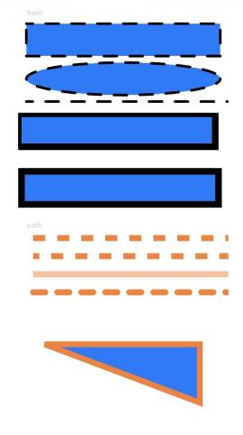
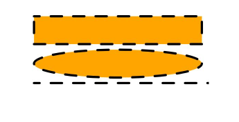
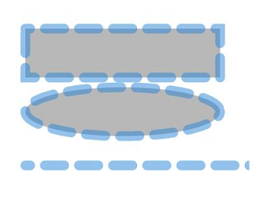

# Shape
<!--Kit: ArkUI-->
<!--Subsystem: ArkUI-->
<!--Owner: @camlostshi-->
<!--Designer: @fenglinbailu-->
<!--Tester: @liuli0427-->
<!--Adviser: @Brilliantry_Rui-->
<!-- md-trans-meta sourceCommit=814c7cb9af37d443e12a84b71f28815df508c584 translatedAt=2026-08-28T01:26:55.169Z pushedAt=2026-08-31T07:44:19.324Z -->

The **Shape** component is the parent component of drawing components. It describes the universal attributes supported by all the drawing components.

The **Shape** component supports the drawing and combination of vector graphics by defining attributes such as the viewport, fill, and stroke. As a container component, **Shape** can contain drawing child components such as **Rect**, **Circle**, and **Path** to implement vector graphics drawing capabilities similar to SVG (Scalable Vector Graphics).

There are two ways to use the **Shape** component:

1. Drawing components use **Shape** as their parent to implement combined drawing of vector graphics similar to SVG.

2. Drawing components can be used independently to draw specified shapes.

>  **NOTE**
>
>  This component is supported since API version 7. New APIs in later versions are marked with a superscript to indicate their earliest API version.
>
>  Since API version 20, this component supports updating constructor parameters using the [updateConstructorParams](../js-apis-arkui-AttributeUpdater.md#properties) API of the [AttributeUpdater](../js-apis-arkui-AttributeUpdater.md) class.


## Child Components

The following child components are supported: [Rect](ts-drawing-components-rect.md), [Path](ts-drawing-components-path.md), [Circle](ts-drawing-components-circle.md), [Ellipse](ts-drawing-components-ellipse.md), [Polyline](ts-drawing-components-polyline.md), [Polygon](ts-drawing-components-polygon.md), [Image](ts-basic-components-image.md), [Text](ts-basic-components-text.md), [Column](ts-container-column.md), [Row](ts-container-row.md), and **Shape**.


## APIs

### Shape

new Shape(value?: PixelMap)

Draws the **Shape** component. After being called, it creates a **Shape** object, on which attributes such as the viewport, fill, and stroke can be set.

**Atomic service API:** Since API version 11, this API is supported in atomic services.

**System capability**: SystemCapability.ArkUI.ArkUI.Full

**Parameters**

| Name | Type | Mandatory | Description |
| -------- | -------- | -------- | -------- |
| value | [PixelMap](../../apis-image-kit/arkts-apis-image-PixelMap.md) | No | Drawing target. You can draw a shape in the specified **PixelMap** object. If this parameter is not set, the shape is drawn in the current drawing target by default.<br>The abnormal values **undefined** and **null** are treated as invalid values, and this setting does not take effect. |

### Shape

Shape(value: PixelMap)

Draws the **Shape** component. After being called, it creates a **Shape** object, on which attributes such as the viewport, fill, and stroke can be set.

**Atomic service API**: This API can be used in atomic services since API version 11.

**System capability**: SystemCapability.ArkUI.ArkUI.Full

**Parameters**

| Name| Type| Mandatory| Description|
| -------- | -------- | -------- | -------- |
| value | [PixelMap](../../apis-image-kit/arkts-apis-image-PixelMap.md) | Yes | Drawing target. The shape can be drawn into the specified **PixelMap** object.<br>Note: This parameter is mandatory. A valid **PixelMap** object must be passed in. The parameter does not take effect when **undefined** or **null** is passed in. |

### Shape

Shape()

Draws the **Shape** component. This function has no parameter. After being called, it creates a **Shape** object with the default viewport and attributes.

**Widget capability**: Since API version 9, this feature is supported in ArkTS widgets.

**Atomic service API**: This API can be used in atomic services since API version 11.

**System capability**: SystemCapability.ArkUI.ArkUI.Full

## ViewportRect<sup>18+</sup>

Describes the options of the viewport.

> **NOTE**
>
> To standardize anonymous object definitions, the element definitions here have been revised in API version 18. While historical version information is preserved for anonymous objects, there may be cases where the outer element's @since version number is higher than inner elements'. This does not affect interface usability.

**Widget capability**: This API can be used in ArkTS widgets since API version 18.

**Atomic service API**: This API can be used in atomic services since API version 18.

**Model restriction**: This API can be used only in the stage model.

**System capability**: SystemCapability.ArkUI.ArkUI.Full

| Name| Type| Read-Only| Optional| Description|
| -------- | -------- | -------- | -------- | -------- |
| x<sup>7+</sup> | [Length](ts-types.md#length) | No | Yes | Horizontal coordinate of the start point of the shape viewport.<br>Default value: **0**<br>Default unit: vp<br>The abnormal values **undefined**, **null**, **NaN**, and **Infinity** are handled as the default value.<br>**Widget capability:** This API can be used in ArkTS widgets since API version 9.<br>**Atomic service API:** This API can be used in atomic services since API version 11. |
| y<sup>7+</sup> | [Length](ts-types.md#length) | No | Yes | Vertical coordinate of the start point of the shape viewport.<br>Default value: **0**<br>Default unit: vp<br>The abnormal values **undefined**, **null**, **NaN**, and **Infinity** are handled as the default value.<br>**Widget capability:** This API can be used in ArkTS widgets since API version 9.<br>**Atomic service API:** This API can be used in atomic services since API version 11. |
| width<sup>7+</sup> | [Length](ts-types.md#length) | No | Yes | Width of the shape viewport. The value range is ≥ 0.<br>Default value: **0**<br>Default unit: vp<br>The abnormal values **undefined**, **null**, **NaN**, and **Infinity** are handled as the default value.<br>**Widget capability:** This API can be used in ArkTS widgets since API version 9.<br>**Atomic service API:** This API can be used in atomic services since API version 11. |
| height<sup>7+</sup> | [Length](ts-types.md#length) | No | Yes | Height of the shape viewport. The value range is ≥ 0.<br>Default value: **0**<br>Default unit: vp<br>The abnormal values **undefined**, **null**, **NaN**, and **Infinity** are handled as the default value.<br>**Widget capability:** This API can be used in ArkTS widgets since API version 9.<br>**Atomic service API:** This API can be used in atomic services since API version 11. |


## Attributes

In addition to the [universal attributes](ts-component-general-attributes.md) and [universal drawing attributes](ts-drawing-components-common.md), the following attributes are supported:

### viewPort

viewPort(value: ViewportRect)

Sets the viewport of the shape.

The viewport defines the coordinate system and display area of the drawing content. The start point coordinates (x, y) and the width and height (width, height) of the viewport determine the display position and range of the drawing content in the component. When the viewport range differs from the component size, the drawing content is automatically scaled to fit. The viewport is commonly used to adjust the display scale and position of the drawing content.

**Widget capability**: This API can be used in ArkTS widgets since API version 9.

**Atomic service API**: This API can be used in atomic services since API version 11.

**System capability**: SystemCapability.ArkUI.ArkUI.Full

**Parameters**

| Name| Type| Mandatory| Description|
| -------- | -------- | -------- | -------- |
| value | [ViewportRect](ts-drawing-components-shape.md#viewportrect18) | Yes | Viewport drawing attribute.<br>Default value: **{x: 0, y: 0, width: 0, height: 0}**<br>The abnormal values **undefined** and **null** are processed as the default value. |

### mesh<sup>8+</sup>

mesh(value: Array&lt;any&gt;, column: number, row: number)

Sets the mesh effect. Divides the image into a grid of (row + 1) × (column + 1), with the coordinates of each grid intersection stored in an array (every two elements represent the x and y coordinates of an intersection). The coordinates in the **value** array are used to reposition the grid vertices, implementing local distortion of the image. This attribute can be dynamically set using [attributeModifier](ts-universal-attributes-attribute-modifier.md#attributemodifier). It is applicable to scenarios that require image deformation effects, such as image distortion and wave effects.

The coordinate array is stored in row-major order. After the original image is evenly divided, each grid area is transformed based on the new coordinates of its vertices, ultimately producing a distortion effect.

> **NOTE**
>
> **mesh** takes effect only when a **pixelMap** object is passed to the shape, and the effect applies to the passed **pixelMap** object. It produces the same result as [drawPixelMapMesh<sup>12+</sup>](../../../reference/apis-arkgraphics2d/arkts-apis-graphics-drawing-Canvas.md#drawpixelmapmesh12) in the [drawing module](../../../reference/apis-arkgraphics2d/arkts-apis-graphics-drawing.md). It is recommended that you use **drawPixelMapMesh**.

**Widget capability**: This API can be used in ArkTS widgets since API version 9.

**Atomic service API**: This API can be used in atomic services since API version 11.

**System capability**: SystemCapability.ArkUI.ArkUI.Full

**Parameters**

| Name| Type               | Mandatory| Description                                                        |
| ------ | ------------------- | ---- | ------------------------------------------------------------ |
| value  | Array&lt;any&gt; | Yes   | Array of length (row + 1) × (column + 1) × 2, which records the position of each vertex of the distorted bitmap. The coordinate system is based on the display area of the **Shape** component, with the origin (0,0) at the upper left corner, the x-axis extending to the right, and the y-axis extending downward.<br>Default unit: vp<br>When the abnormal values **undefined** and **null** are set, the parameter is processed as an empty array. |
| column | number              | Yes   | Number of columns in the mesh matrix. The value range is ≥ 0.<br>Default value: **0**<br>When the abnormal values **undefined**, **null**, **NaN**, and **Infinity** are set, the column and row parameters are processed as the default value **0**, and the value parameter is processed as an empty array. |
| row    | number              | Yes   | Number of rows in the mesh matrix. The value range is ≥ 0.<br>Default value: **0**<br>When the abnormal values **undefined**, **null**, **NaN**, and **Infinity** are set, the column and row parameters are processed as the default value **0**, and the **value** parameter is processed as an empty array. |

## Examples

### Example 1: Drawing a Shape

This example demonstrates how to draw rectangles, ellipses, and straight lines using the **Shape** component.

```ts
// xxx.ets
@Entry
@Component
struct ShapeExample {
  build() {
    Column({ space: 10 }) {
      Text('basic').fontSize(11).fontColor(0xCCCCCC).width(320)
      // Draw a 300 × 50 rectangle with a stroke at the point (-2, -2) in Shape, with the color 0x317AF7, stroke color black, stroke width 4, stroke gap 20, offset to the left by 10, line cap style round, line join style round, and anti-aliasing (enabled by default).
      // Draw a 300 × 50 ellipse with a stroke at the point (-2, 58) in Shape, with the color 0x317AF7, stroke color black, stroke width 4, stroke gap 20, offset to the left by 10, line cap style round, line join style round, and anti-aliasing (enabled by default).
      // Draw a 300 × 10 straight line at the point (-2, 118) in Shape, with the color 0x317AF7, stroke color black, width 4, gap 20, offset to the left by 10, line cap style round, line join style round, and anti-aliasing (enabled by default).
      Shape() {
        Rect().width(300).height(50)
        Ellipse().width(300).height(50).offset({ x: 0, y: 60 })
        Path().width(300).height(10).commands('M0 0 L900 0').offset({ x: 0, y: 120 })
      }
      .width(350)
      .height(140)
      .viewPort({
        x: -2,
        y: -2,
        width: 304,
        height: 130
      })
      .fill(0x317AF7)
      .stroke(Color.Black)
      .strokeWidth(4)
      .strokeDashArray([20])
      .strokeDashOffset(10)
      .strokeLineCap(LineCapStyle.Round)
      .strokeLineJoin(LineJoinStyle.Round)
      .antiAlias(true)

      // Draw a 300 × 50 rectangle with strokes at (0, 0) and (-5, -5). The coordinates of the start position of the viewport are set to negative values because the drawing start point is the midpoint of the line width by default. Therefore, to display the strokes completely, the viewport needs to be offset by half of the line width.
      Shape() {
        Rect().width(300).height(50)
      }
      .width(350)
      .height(80)
      .viewPort({
        x: 0,
        y: 0,
        width: 320,
        height: 70
      })
      .fill(0x317AF7)
      .stroke(Color.Black)
      .strokeWidth(10)

      Shape() {
        Rect().width(300).height(50)
      }
      .width(350)
      .height(80)
      .viewPort({
        x: -5,
        y: -5,
        width: 320,
        height: 70
      })
      .fill(0x317AF7)
      .stroke(Color.Black)
      .strokeWidth(10)

      Text('path').fontSize(11).fontColor(0xCCCCCC).width(320)
      // Draw a straight line at (0, -5). The color is 0xEE8443, the stroke width is 10, and the stroke dash array is 20.
      Shape() {
        Path().width(300).height(10).commands('M0 0 L900 0')
      }
      .width(350)
      .height(20)
      .viewPort({
        x: 0,
        y: -5,
        width: 300,
        height: 20
      })
      .stroke(0xEE8443)
      .strokeWidth(10)
      .strokeDashArray([20])

      // Draw a straight line at (0, -5). The color is 0xEE8443, the stroke width is 10, the stroke dash array is 20, and the offset is 10 to the left.
      Shape() {
        Path().width(300).height(10).commands('M0 0 L900 0')
      }
      .width(350)
      .height(20)
      .viewPort({
        x: 0,
        y: -5,
        width: 300,
        height: 20
      })
      .stroke(0xEE8443)
      .strokeWidth(10)
      .strokeDashArray([20])
      .strokeDashOffset(10)

      // Draw a straight line at (0, -5). The color is 0xEE8443, the stroke width is 10, and the opacity is 0.5.
      Shape() {
        Path().width(300).height(10).commands('M0 0 L900 0')
      }
      .width(350)
      .height(20)
      .viewPort({
        x: 0,
        y: -5,
        width: 300,
        height: 20
      })
      .stroke(0xEE8443)
      .strokeWidth(10)
      .strokeOpacity(0.5)

      // Draw a straight line at (0, -5). The color is 0xEE8443, the stroke width is 10, the stroke dash array is 20, and the cap style is semi-circle.
      Shape() {
        Path().width(300).height(10).commands('M0 0 L900 0')
      }
      .width(350)
      .height(20)
      .viewPort({
        x: 0,
        y: -5,
        width: 300,
        height: 20
      })
      .stroke(0xEE8443)
      .strokeWidth(10)
      .strokeDashArray([20])
      .strokeLineCap(LineCapStyle.Round)

      // Draw a closed path at (-20, -5). The fill color is 0x317AF7, the stroke width is 10, the color is 0xEE8443, and the join style is miter (default).
      Shape() {
        Path().width(200).height(60).commands('M0 0 L400 0 L400 150 Z')
      }
      .width(300)
      .height(200)
      .viewPort({
        x: -20,
        y: -5,
        width: 310,
        height: 90
      })
      .fill(0x317AF7)
      .stroke(0xEE8443)
      .strokeWidth(10)
      .strokeLineJoin(LineJoinStyle.Miter)
      .strokeMiterLimit(5)
    }.width('100%').margin({ top: 15 })
  }
}
```



### Example 2: Drawing a Shape with Different Parameter Types

This example demonstrates how to draw shaps with different length types for attribute.

```ts
// xxx.ets
@Entry
@Component
struct ShapeTypeExample {
  build() {
    Column({ space: 10 }) {
      // Draw a 300 × 50 rectangle with a stroke at point (-2, -2) in Shape, in orange, with a black stroke, stroke width 4, stroke gap 20, offset 10 to the left, line cap style round, line join style round, and anti-aliasing (enabled by default).
      // Draw a 300 × 50 ellipse with a stroke at point (-2, 58) in Shape, in orange, with a black stroke, stroke width 4, stroke gap 20, offset 10 to the left, line cap style round, line join style round, and anti-aliasing (enabled by default).
      // Draw a 300 × 10 straight line at point (-2, 118) in Shape, in orange, with a black stroke, width 4, gap 20, offset 10 to the left, line cap style round, line join style round, and anti-aliasing (enabled by default).
      Shape() {
        Rect().width('300').height('50')
        Ellipse().width(300).height(50).offset({ x: 0, y: 60 })
        Path().width(300).height(10).commands('M0 0 L900 0').offset({ x: 0, y: 120 })
      }
      .width(350)
      .height(140)
      .viewPort({
        x: '-2', // Use the string type.
        y: '-2',
        width: $r('app.string.ViewportRectWidth'), // Use the Resource type, which needs to be customized.
        height: $r('app.string.ViewportRectHeight')
      })
      .fill(Color.Orange)
      .stroke(Color.Black)
      .strokeWidth(4)
      .strokeDashArray([20])
      .strokeDashOffset(10) // Use the number type.
      .strokeLineCap(LineCapStyle.Round)
      .strokeLineJoin(LineJoinStyle.Round)
      .strokeMiterLimit(5)
      .antiAlias(true)
    }.width('100%').margin({ top: 15 })
  }
}
```



### Example 3: Dynamically Setting Attributes of the Shape Component Using attributeModifier

This example shows how to use **attributeModifier** to dynamically set the **fill**, **fillOpacity**, **stroke**, **strokeDashArray**, **strokeDashOffset**, **strokeLineCap**, **strokeLineJoin**, **strokeMiterLimit**, **strokeOpacity**, **strokeWidth**, and **antiAlias** attributes of the **Shape** component.

```ts
// xxx.ets
class MyShapeModifier implements AttributeModifier<ShapeAttribute> {
  applyNormalAttribute(instance: ShapeAttribute): void {
    // Fill color: #707070; fill opacity: 0.5; color: #2787D9; stroke dash array: [20, 15]; offset to left: 15; cap style: semi-circle; join style: miter; miter limit: 5; stroke opacity: 0.5; stroke width: 10; anti-aliasing enabled.
    instance.fill("#707070")
    instance.fillOpacity(0.5)
    instance.stroke("#2787D9")
    instance.strokeDashArray([20, 15])
    instance.strokeDashOffset("15")
    instance.strokeLineCap(LineCapStyle.Round)
    instance.strokeLineJoin(LineJoinStyle.Miter)
    instance.strokeMiterLimit(5)
    instance.strokeOpacity(0.5)
    instance.strokeWidth(10)
    instance.antiAlias(true)
  }
}

@Entry
@Component
struct ShapeModifierDemo {
  @State modifier: MyShapeModifier = new MyShapeModifier()

  build() {
    Column() {
      Shape() {
        Rect().width(200).height(50).offset({ x: 20, y: 20 })
        Ellipse().width(200).height(50).offset({ x: 20, y: 80 })
        Path().width(200).height(10).commands('M0 0 L900 0').offset({ x: 20, y: 160 })
      }
      .width(250).height(200)
      .attributeModifier(this.modifier)
    }
  }
}
```



### Example 4: Using the Mesh for Local Image Distortion

This example demonstrates how to configure **mesh** to achieve local image distortion.

```ts
// xxx.ets
import { image } from '@kit.ImageKit';

@Entry
@Component
struct Index {
  private context: OffscreenCanvasRenderingContext2D = new OffscreenCanvasRenderingContext2D(200, 200)
  // The mesh array, whose length is (row + 1) × (column + 1) × 2, where every two elements represent the x and y coordinates of a mesh vertex.
  private meshArray: Array<number> = [0, 0, 50, 0, 410, 0, 0, 180, 50, 180, 410, 180, 0, 360, 50, 360, 410, 360]
  @State pixelMap: image.PixelMap | undefined = undefined

  aboutToAppear(): void {
    // Replace "resources/base/media/img.png" with the image resource file you use.
    // Create an image bitmap and draw it to the offscreen canvas.
    let img: ImageBitmap = new ImageBitmap("resources/base/media/img.png")
    this.context.drawImage(img, 0, 0, 200, 200)
    // Obtain the PixelMap object from the canvas for the Shape component.
    this.pixelMap = this.context.getPixelMap(0, 0, 200, 200)
  }

  build() {
    Column() {
      Shape(this.pixelMap)
      .backgroundColor(Color.Grey)
      .width(250)
      .height(250)
      .mesh(this.meshArray, 2, 2)

      Shape(this.pixelMap)
      .backgroundColor(Color.Grey)
      .width(250)
      .height(250)
    }
  }
}
```
