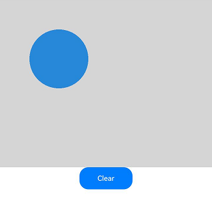
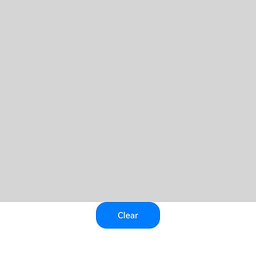

# DrawingRenderingContext
<!--Kit: ArkUI-->
<!--Subsystem: ArkUI-->
<!--Owner: @sd-wu-->
<!--Designer: @sunbees-->
<!--Tester: @liuli0427-->
<!--Adviser: @Brilliantry_Rui-->

**DrawingRenderingContext** provides a rendering context for drawing rectangles, text, images, and other objects on a canvas.

> **NOTE**
>
> The initial APIs of this module are supported since API version 12. Updates will be marked with a superscript to indicate their earliest API version.

## constructor

constructor(unit?: LengthMetricsUnit)

Creates a **Canvas** object for drawing operations using the drawing API. Configuration of the unit mode for the **DrawingRenderingContext** object is supported.

**Widget capability**: This API can be used in ArkTS widgets since API version 12.

**System capability**: SystemCapability.ArkUI.ArkUI.Full

**Parameters**

| Name     | Type| Mandatory  | Description|
| -------- | ---------------------------------------- | ---- | ---------------------------------------- |
| unit  | [LengthMetricsUnit](../js-apis-arkui-graphics.md#lengthmetricsunit12) | No   | Unit mode of the **DrawingRenderingContext** object. The value cannot be changed once set. The configuration method is the same as that of [CanvasRenderingContext2D](ts-canvasrenderingcontext2d.md).<br>Invalid values **undefined**, **NaN** and **Infinity** are treated as the default value.<br>Default value: **DEFAULT**.|

## size

get size(): Size

Obtains the size of the **DrawingRenderingContext** object.

**Atomic service API**: This API can be used in atomic services since API version 12.

**System capability**: SystemCapability.ArkUI.ArkUI.Full

**Return value**

| Type         | Description                                      |
| ----------- | ---------------------------------------- |
| [Size](#size) | Size of the **DrawingRenderingContext** object.|

## canvas

get canvas(): DrawingCanvas

Obtains the canvas object for drawing content.

**Atomic service API**: This API can be used in atomic services since API version 12.

**System capability**: SystemCapability.ArkUI.ArkUI.Full

**Return value**

| Type         | Description                                      |
| ----------- | ---------------------------------------- |
| [DrawingCanvas](#drawingcanvas12) | Canvas object for drawing content.|

## invalidate

invalidate(): void

Invalidates the component and triggers re-rendering of the component.

**Atomic service API**: This API can be used in atomic services since API version 12.

**System capability**: SystemCapability.ArkUI.ArkUI.Full

## DrawingCanvas<sup>12+</sup>

type DrawingCanvas = Canvas

Defines a canvas object for drawing content on the **XComponent** component.

**Atomic service API**: This API can be used in atomic services since API version 12.

**System capability**: SystemCapability.ArkUI.ArkUI.Full

| Type                 | Description          |
| --------------------- | -------------- |
| [Canvas](../../apis-arkgraphics2d/arkts-apis-graphics-drawing-Canvas.md) | Canvas object.|

## Size

Provides size information of the **DrawingRenderingContext** object.

**Atomic service API**: This API can be used in atomic services since API version 12.

**System capability**: SystemCapability.ArkUI.ArkUI.Full

| Name| Type| Read Only| Optional| Description|
| ---------- | -------------- | ------ | ---------------- | ------------------------ |
| width | number | No| No| Width of the **DrawingRenderingContext** object, which corresponds to the width of the associated **Canvas** component.|
| height | number | No| No| Height of the **DrawingRenderingContext** object, which corresponds to the height of the associated **Canvas** component.|

## Example

### Example 1: Drawing Shapes

This example demonstrates how to draw shapes using APIs in **DrawingRenderingContext**.

```ts
import { common2D, drawing } from '@kit.ArkGraphics2D';

// xxx.ets
@Entry
@Component
struct CanvasExample {
  private context: DrawingRenderingContext = new DrawingRenderingContext();

  build() {
    Flex({ direction: FlexDirection.Column, alignItems: ItemAlign.Center, justifyContent: FlexAlign.Center }) {
      Canvas(this.context)
        .width('100%')
        .height('50%')
        .backgroundColor('#D5D5D5')
        .onReady(() => {
          let brush = new drawing.Brush();
          // Draw a circle with center at (200, 200) and radius of 100, filled with RGBA(39, 135, 217, 255).
          brush.setColor({
            alpha: 255,
            red: 39,
            green: 135,
            blue: 217
          });
          this.context.canvas.attachBrush(brush);
          this.context.canvas.drawCircle(200, 200, 100);
          this.context.canvas.detachBrush();
          this.context.invalidate();
        })
      Button("Clear")
        .width('120')
        .height('50')
        .onClick(() => {
          let color: common2D.Color = {
            alpha: 0,
            red: 0,
            green: 0,
            blue: 0
          };
          // Clear the canvas using RGBA(0, 0, 0, 0).
          this.context.canvas.clear(color);
          this.context.invalidate();
        })
    }
    .width('100%')
    .height('100%')
  }
}
```

Figure 1 Circle with center at (200, 200) and radius of 100, filled with RGBA(39, 135, 217, 255)

  

Figure 2 Clearing the canvas with the Clear button

  

### Example 2: Drawing Text

This example demonstrates how to draw custom text using [drawTextBlob](../../apis-arkgraphics2d/arkts-apis-graphics-drawing-Canvas.md#drawtextblob), with custom fonts loaded via [makeFromRawFile](../../apis-arkgraphics2d/arkts-apis-graphics-drawing-Typeface.md#makefromrawfile18) (available since API version 18). When the drawing API is used, custom fonts from the **rawfile** directory can be loaded directly with drawing.Typeface.[makeFromRawFile](../../apis-arkgraphics2d/arkts-apis-graphics-drawing-Typeface.md#makefromrawfile18), eliminating the need to pre-register fonts through this.uiContext.getFont().[registerFont](../arkts-apis-uicontext-font.md#registerfont) or fontCollection.[loadFontSync](../../apis-arkgraphics2d/js-apis-graphics-text.md#loadfontsync).

```ts
import { drawing } from '@kit.ArkGraphics2D';

// xxx.ets
@Entry
@Component
struct CanvasExample {
  private context: DrawingRenderingContext = new DrawingRenderingContext();

  build() {
    Flex({ direction: FlexDirection.Column, alignItems: ItemAlign.Center, justifyContent: FlexAlign.Center }) {
      Canvas(this.context)
        .width('100%')
        .height('50%')
        .backgroundColor('#D5D5D5')
        .onReady(() => {
          let font = new drawing.Font();
          font.setSize(50);
          // Load the custom font file HarmonyOS_Sans_Bold.ttf from the rawfile directory.
          const myTypeFace = drawing.Typeface.makeFromRawFile($rawfile('HarmonyOS_Sans_Bold.ttf'));
          font.setTypeface(myTypeFace);
          const textBlob =
            drawing.TextBlob.makeFromString("Hello World", font, drawing.TextEncoding.TEXT_ENCODING_UTF8);
          this.context.canvas.drawTextBlob(textBlob, 60, 100);
          this.context.invalidate();
        })
    }
    .width('100%')
    .height('100%')
  }
}
```


