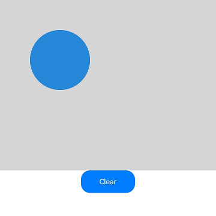

# DrawingRenderingContext
<!--Kit: ArkUI-->
<!--Subsystem: ArkUI-->
<!--Owner: @camlostshi-->
<!--Designer: @fenglinbailu-->
<!--Tester: @liuli0427-->
<!--Adviser: @Brilliantry_Rui-->
<!-- md-trans-meta sourceCommit=0ac6eaf21c519d27b118617e6aaa0ba03069a649 translatedAt=2026-08-28T01:26:16.226Z pushedAt=2026-08-31T07:52:18.276Z -->

After the **DrawingRenderingContext** object is bound to the **Canvas** component, you can draw shapes, texts, and images on the **Canvas** component. Binding method: Pass the **DrawingRenderingContext** object to the constructor of the **Canvas** component to establish the binding. Drawing process: Obtain the **DrawingCanvas** object through the **canvas** property, call the drawing module APIs to perform drawing operations, and finally call **invalidate()** to trigger re-rendering. This is suitable for scenarios such as high-performance graphics drawing, custom charts, and image editing, and provides more flexible drawing APIs than **CanvasRenderingContext2D**.

> **NOTE**
>
> The initial APIs of this module are supported since API version 12. Updates will be marked with a superscript to indicate their earliest API version.

## constructor

constructor(unit?: LengthMetricsUnit)

Creates a **Canvas** object for drawing operations using the **drawing** API. Configuration of the unit mode for the **DrawingRenderingContext** object is supported. After the object is created, you can obtain the canvas object through the **canvas** property of the **DrawingRenderingContext** object to perform drawing operations.

**Atomic service API**: This API can be used in atomic services since API version 12.

**Model restriction:** This API can be used only in the stage model.

**System capability**: SystemCapability.ArkUI.ArkUI.Full

**Parameters**

| Name     | Type| Mandatory  | Description|
| -------- | ---------------------------------------- | ---- | ---------------------------------------- |
| unit  | [LengthMetricsUnit](../js-apis-arkui-graphics.md#lengthmetricsunit12) | No    | Unit mode of the **DrawingRenderingContext** object. Once configured, the unit mode cannot be changed. The configuration method is the same as that of [CanvasRenderingContext2D](ts-canvasrenderingcontext2d.md).<br>Optional values: **DEFAULT** (default vp unit) and **PX** (px pixel unit).<br>Abnormal values **undefined**, **NaN**, and **Infinity** are processed as the default value.<br>Default value: **DEFAULT** |

## size

get size(): Size

Obtains the size of the **DrawingRenderingContext** object. This API can be used only after the **DrawingRenderingContext** object is bound to the **Canvas** component. The returned **Size** object contains the width and height of the canvas, which can be used to calculate the drawing area or adjust drawing parameters.

**Atomic service API**: This API can be used in atomic services since API version 12.

**Model restriction:** This API can be used only in the stage model.

**System capability**: SystemCapability.ArkUI.ArkUI.Full

**Return value**

| Type         | Description                                      |
| ----------- | ---------------------------------------- |
| [Size](#size-1) | Size of the **DrawingRenderingContext** object.|

## canvas

get canvas(): DrawingCanvas

Obtains the canvas object for drawing content. This API can be used only after the **DrawingRenderingContext** object is bound to the **Canvas** component. The obtained **Canvas** object can be used to bind drawing tools such as **Brush** and **Pen** to draw shapes, texts, and images.

**Atomic service API**: This API can be used in atomic services since API version 12.

**Model restriction:** This API can be used only in the stage model.

**System capability**: SystemCapability.ArkUI.ArkUI.Full

**Return value**

| Type         | Description                                      |
| ----------- | ---------------------------------------- |
| [DrawingCanvas](#drawingcanvas) | Canvas object for drawing content. |

## invalidate

invalidate(): void

Marks the component state as changed and triggers re-rendering of the component. Call this API after the **Canvas** component is bound to the **DrawingRenderingContext** object and the drawing operations are complete, so that the drawing content is rendered to the screen.

**Atomic service API**: This API can be used in atomic services since API version 12.

**Model restriction:** This API can be used only in the stage model.

**System capability**: SystemCapability.ArkUI.ArkUI.Full

## DrawingCanvas

type DrawingCanvas = import('../api/@ohos.graphics.drawing').default.Canvas

Draws content on the **DrawingRenderingContext**.

**Atomic service API**: This API can be used in atomic services since API version 12.

**Model restriction:** This API can be used only in the stage model.

**System capability**: SystemCapability.ArkUI.ArkUI.Full

| Type                 | Description          |
| --------------------- | -------------- |
| import('../api/@ohos.graphics.drawing').default.[Canvas](../../apis-arkgraphics2d/arkts-apis-graphics-drawing-Canvas.md) | Returns a **Canvas** object that can be used to draw shapes, text, images, and other content on the **Canvas** component bound to the **DrawingRenderingContext**. |

## Size

Provides size information of the **DrawingRenderingContext** object.

**Atomic service API**: This API can be used in atomic services since API version 12.

**Model restriction:** This API can be used only in the stage model.

**System capability**: SystemCapability.ArkUI.ArkUI.Full

| Name| Type| Read Only| Optional| Description|
| ---------- | -------------- | ------ | ---------------- | ------------------------ |
| width | number | No | No | Width of the **DrawingRenderingContext**, which is the width of the associated **Canvas** component. The unit is determined by the **unit** parameter of the **constructor**. Supported units: vp and px. The default unit is vp. |
| height | number | No | No | Height of the **DrawingRenderingContext**, which is the height of the associated **Canvas** component. The unit is determined by the **unit** parameter of the **constructor**. Supported units: vp and px. The default unit is vp. |

## Example

### Example 1: Drawing Shapes

This example demonstrates how to draw shapes using APIs in **DrawingRenderingContext**.

```ts
import { common2D, drawing } from '@kit.ArkGraphics2D';

// xxx.ets
@Entry
@Component
struct CanvasExample {
  private context: DrawingRenderingContext = new DrawingRenderingContext();

  build() {
    Flex({ direction: FlexDirection.Column, alignItems: ItemAlign.Center, justifyContent: FlexAlign.Center }) {
      Canvas(this.context)
        .width('100%')
        .height('50%')
        .backgroundColor('#D5D5D5')
        .onReady(() => {
          let brush = new drawing.Brush();
          // Draw a circle with center at (200, 200) and radius of 100, filled with RGBA(39, 135, 217, 255).
          brush.setColor({
            alpha: 255,
            red: 39,
            green: 135,
            blue: 217
          });
          this.context.canvas.attachBrush(brush);
          this.context.canvas.drawCircle(200, 200, 100);
          this.context.canvas.detachBrush();
          this.context.invalidate();
        })
      Button("Clear")
        .width('120')
        .height('50')
        .onClick(() => {
          let color: common2D.Color = {
            alpha: 0,
            red: 0,
            green: 0,
            blue: 0
          };
          // Fill the canvas using RGBA(0, 0, 0, 0).
          this.context.canvas.clear(color);
          this.context.invalidate();
        })
    }
    .width('100%')
    .height('100%')
  }
}
```

Figure 1 Circle with center at (200, 200) and radius of 100, filled with RGBA(39, 135, 217, 255)

  

Figure 2 Clearing the canvas with the Clear button

  

### Example 2: Drawing Text

This example demonstrates how to draw custom text using [drawTextBlob](../../apis-arkgraphics2d/arkts-apis-graphics-drawing-Canvas.md#drawtextblob), with custom fonts loaded via [makeFromRawFile](../../apis-arkgraphics2d/arkts-apis-graphics-drawing-Typeface.md#makefromrawfile18) (available since API version 18). When the drawing API is used, custom fonts from the **rawfile** directory can be loaded directly with drawing.Typeface.[makeFromRawFile](../../apis-arkgraphics2d/arkts-apis-graphics-drawing-Typeface.md#makefromrawfile18), eliminating the need to pre-register fonts through this.uiContext.getFont().[registerFont](../arkts-apis-uicontext-font.md#registerfont) or fontCollection.[loadFontSync](../../apis-arkgraphics2d/js-apis-graphics-text.md#loadfontsync).

```ts
import { drawing } from '@kit.ArkGraphics2D';

// xxx.ets
@Entry
@Component
struct CanvasExample {
  private context: DrawingRenderingContext = new DrawingRenderingContext();

  build() {
    Flex({ direction: FlexDirection.Column, alignItems: ItemAlign.Center, justifyContent: FlexAlign.Center }) {
      Canvas(this.context)
        .width('100%')
        .height('50%')
        .backgroundColor('#D5D5D5')
        .onReady(() => {
          // Create the font object and set the font size to 50.
          let font = new drawing.Font();
          font.setSize(50);
          // Load the custom font file HarmonyOS_Sans_Bold.ttf from the rawfile directory.
          const myTypeFace = drawing.Typeface.makeFromRawFile($rawfile('HarmonyOS_Sans_Bold.ttf'));
          font.setTypeface(myTypeFace);
          // Create the text blob object. The parameters are the text content, font object, and text encoding format, in that order.
          const textBlob =
            drawing.TextBlob.makeFromString("Hello World", font, drawing.TextEncoding.TEXT_ENCODING_UTF8);
          // Draw the text blob at the coordinates (60, 100).
          this.context.canvas.drawTextBlob(textBlob, 60, 100);
          this.context.invalidate();
        })
    }
    .width('100%')
    .height('100%')
  }
}
```

