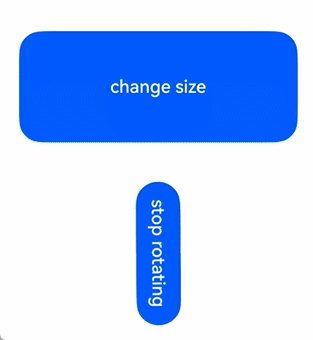
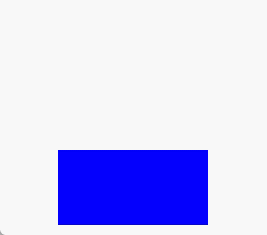

# Explicit Animation (animateTo)
<!--Kit: ArkUI-->
<!--Subsystem: ArkUI-->
<!--Owner: @CCFFWW-->
<!--Designer: @CCFFWW-->
<!--Tester: @lxl007-->
<!--Adviser: @Brilliantry_Rui-->

With **animateTo**, you can build explicit animations for state changes caused by closure code. Similar to property animations, animations that change layout attributes (such as width and height) usually directly jump to the final state, for example, the text or content in [Canvas](ts-components-canvas-canvas.md). To enable the content to change with the width and height during the animation process, you can use the [renderFit](ts-universal-attributes-renderfit.md#renderfit) attribute.

>  **NOTE**
>
>  The initial APIs of this module are supported since API version 7. Updates will be marked with a superscript to indicate their earliest API version.
>
>  The functionality of this module depends on UI context. This means that the APIs of this module cannot be used where [the UI context is unclear](../../../ui/arkts-global-interface.md). For details, see [UIContext](../arkts-apis-uicontext-uicontext.md).

## AnimateParam

Animation effect parameters.

**System capability**: SystemCapability.ArkUI.ArkUI.Full

| Name        | Type         | Read-Only| Optional|    Description                                      |
| ---------- | ---------------|---------- | -------------- | ---------------------------------------- |
| duration   | number         |  No | Yes| Animation duration, in ms.<br>Default value: **1000**<br>Note: 1. The maximum animation duration on an ArkTS widget is 1000 ms. If the duration exceeds 1000 ms, the duration is fixed at 1000 ms.<br>2.&nbsp. You can change the attribute in the animation closure function with the duration of 0 ms to stop the animation of the attribute.<br>3.&nbsp. If the value is less than 0, it is processed as 0.<br>4.&nbsp. If the value is of the floating-point type, the value is rounded down. For example, if the value set is 1.2, **1** will be used.<br>**Widget capability**: This API can be used in ArkTS widgets since API version 9.<br>**Atomic service API**: This API can be used in atomic services since API version 11.|
| tempo      | number         | No| Yes| Animation playback speed. A larger value indicates faster animation playback, and a smaller value indicates slower animation playback. The value **0** means that there is no animation.<br>When the value is set to +∞, the animation ends in the current frame, and the animation end callback is executed immediately.<br>Default value: **1.0**<br>Value range: [0, +∞).<br>Note: If the value is less than 0, the value 1 is used.<br>**Atomic service API**: This API can be used in atomic services since API version 11.|
| curve      | [Curve](ts-appendix-enums.md#curve)&nbsp;\|&nbsp;string&nbsp;\|&nbsp;[ICurve<sup>9+</sup>](#icurve9)| No| Yes| Animation curve.<br>You are advised to specify the curve using the **Curve** or **ICurve** type.<br>When the type is string, the value is the animation interpolation curve. The options are as follows:<br>**"linear"**: The animation changes linearly.<br>**"ease"**: The animation speed is slow at the beginning and end. cubic-bezier (0.25, 0.1, 0.25, 1.0)<br>**"ease-in"**: The animation speed is slow at the beginning and fast at the end. cubic-bezier (0.42, 0.0, 1.0, 1.0)<br>**"ease-out"**: The animation speed is fast at the beginning and slow at the end. cubic-bezier (0.0, 0.0, 0.58, 1.0)<br>**"ease-in-out"**: The animation speed is fast at the beginning and slow at the end. cubic-bezier (0.42, 0.0, 0.58, 1.0)<br>**"fast-out-slow-in"**: Standard curve, **cubic-bezier(0.4, 0.0, 0.2, 1.0)**<br>**"linear-out-slow-in"**: Deceleration curve, **cubic-bezier(0.0, 0.0, 0.2, 1.0)**<br>**"fast-out-linear-in"**: Acceleration curve, **cubic-bezier(0.4, 0.0, 1.0, 1.0)**<br>**"friction"**: Damping curve, **cubic-bezier(0.2, 0.0, 0.2, 1.0)**<br>**"extreme-deceleration"**: Extreme deceleration curve, **cubic-bezier(0.0, 0.0, 0.0, 1.0) curve**<br>**"rhythm"**: Rhythm curve, **cubic-bezier(0.7, 0.0, 0.2, 1.0)**<br>**"sharp"**: Sharp curve, **cubic-bezier(0.33, 0.0, 0.67, 1.0)**<br>**"smooth"**: Smooth curve, **cubic-bezier(0.4, 0.0, 0.4, 1.0)**<br>cubic-bezier(x1, y1, x2, y2): cubic Bezier curve. The values of x1 and x2 must be between 0 and 1. For example, cubic-bezier(0.42, 0.0, 0.58, 1.0).<br>steps(number,step-position): step curve. number must be set to a positive integer. step-position is optional and can be set to start or end. The default value is end. For example, steps(3,start).<br>**"interpolating-spring(velocity,mass,stiffness,damping)"**: For details about the parameters, see the [interpolating spring curve](../js-apis-curve.md#curvesinterpolatingspring10).<br>**"responsive-spring-motion(response,dampingFraction,overlapDuration)"**: For details about the parameters, see the [responsive spring animation curve](../js-apis-curve.md#curvesresponsivespringmotion9).<br>**"spring(velocity,mass,stiffness,damping)"**: For details about the parameters, see the [spring curve](../js-apis-curve.md#curvesspringcurve9).<br>"spring-motion(response,dampingFraction,overlapDuration)": For details about the parameters, see [spring animation curve](../js-apis-curve.md#curvesspringmotion9).<br>Default value: **Curve.EaseInOut**<br>**Widget capability**: This API can be used in ArkTS widgets since API version 9.<br>**Atomic service API**: This API can be used in atomic services since API version 11.|
| delay      | number         | No| Yes| Delay of animation playback, in ms. By default, the playback is not delayed.<br>Default value: **0**<br>Value range: (-∞, +∞)<br>Note: 1. If delay is greater than or equal to 0, the animation is delayed. If delay is less than 0, the animation is played in advance. If the absolute value of **delay** is less than the actual animation duration, the animation starts its first frame from the state at the absolute value. If the absolute value of **delay** is greater than or equal to the actual animation duration, the animation starts its first frame from the end state. The actual animation duration is equal to the duration of a single animation multiplied by the number of animation playback times.<br>2.&nbsp. When a value of the floating-point type is set, the value is rounded down. For example, if the value set is 1.2, **1** will be used.<br>**Atomic service API**: This API can be used in atomic services since API version 11.|
| iterations | number         | No| Yes| Number of times that the animation is played. By default, the animation is played once. The value **-1** indicates that the animation is played for an unlimited number of times. The value **0** indicates that there is no animation.<br>Default value: **1**<br>Value range: [-1, +∞)<br>Note: When a value of the floating-point type is set, the value is rounded down. For example, if the value set is 1.2, **1** will be used.<br>**Atomic service API**: This API can be used in atomic services since API version 11.         |
| playMode   | [PlayMode](ts-appendix-enums.md#playmode)|No| Yes| Playback mode. By default, the animation is played from the beginning after the playback is complete.<br>Default value: **PlayMode.Normal**<br>**Widget capability**: This API can be used in ArkTS widgets since API version 9.<br>For details about the restrictions, see **Notes about PlayMode**.<br>**Atomic service API**: This API can be used in atomic services since API version 11.|
| onFinish   | ()&nbsp;=&gt;&nbsp;void      | No| Yes| Callback invoked when the animation playback is complete. If the UIAbility moves from the foreground to the background, any finite loop animation that is still in progress will be immediately terminated, triggering the completion callback.<br>If the transition animation is disabled in the developer options and the tempo is set to +∞, the callback for the playback completion is executed immediately.<br>**Widget capability**: This API can be used in ArkTS widgets since API version 9.<br>**Atomic service API**: This API can be used in atomic services since API version 11.<br>|
| finishCallbackType<sup>11+</sup>   | [FinishCallbackType](#finishcallbacktype11)| No| Yes| Type of the **onFinish** callback.<br>Default value: **FinishCallbackType.REMOVED**<br>**Widget capability**: This API can be used in ArkTS widgets since API version 11.<br>**Atomic service API**: This API can be used in atomic services since API version 12.|
| expectedFrameRateRange<sup>11+</sup>   | [ExpectedFrameRateRange](#expectedframeraterange11) | No| Yes| Expected frame rate range of the animation.<br>**Atomic service API**: This API can be used in atomic services since API version 12.|

> **Notes about PlayMode**:
>
> - **PlayMode.Normal** and **PlayMode.Alternate** are recommended. Under these settings, the first round of the animation is played forwards. If **PlayMode.Reverse** or **PlayMode.AlternateReverse** is used, the first round of the animation is played backwards. In this case, the animation jumps to the end state and then starts from there.
> - When using **PlayMode.Alternate** or **PlayMode.AlternateReverse**, make sure the final state of the animation is the same as the value of the state variable. In other words, make sure the last round of the animation is played forwards. When **PlayMode.Alternate** is used, **iterations** must be set to an odd number. When **PlayMode.AlternateReverse** is used, **iterations** must be set to an even number.
> - **PlayMode.Reverse** is not recommended. Under this setting, the animation jumps to the end state at the beginning, and its final state will be different from the value of the state variable.

## ICurve<sup>9+</sup>

Curve.

### interpolate<sup>9+</sup>

interpolate(fraction:&nbsp;number): number

Calculates the interpolated value along the curve at the specified normalized time point.

**Atomic service API**: This API can be used in atomic services since API version 11.

**System capability**: SystemCapability.ArkUI.ArkUI.Full

**Widget capability**: This API can be used in ArkTS widgets since API version 9.

**Parameters**

| Name  | Type  | Mandatory| Description                                                        |
| -------- | ------ | ---- | ------------------------------------------------------------ |
| fraction | number | Yes  | Current normalized time.<br>Value range: [0, 1].<br>**NOTE**<br>A value less than 0 is treated as **0**. A value greater than 1 is treated as **1**.|

**Return value**

| Type  | Description                                |
| ------ | ------------------------------------ |
| number | Curve interpolation corresponding to the normalized time point.|

## FinishCallbackType<sup>11+</sup>

Defines the type of the onFinish callback in the animation.

**Widget capability**: This API can be used in ArkTS widgets since API version 11.

**Atomic service API**: This API can be used in atomic services since API version 12.

**System capability**: SystemCapability.ArkUI.ArkUI.Full

| Name      | Value        | Description                                                        |
| --------- | ---------------|------------------------------------------------------------ |
| REMOVED   | 0  | The callback is invoked when the entire animation is removed once it has finished.                        |
| LOGICALLY | 1  | The callback is invoked when the animation logically enters the falling state, though it may still be in its long tail state.|

## ExpectedFrameRateRange<sup>11+</sup>

Sets the expected frame rate of an animation.

**Atomic service API**: This API can be used in atomic services since API version 12.

**System capability**: SystemCapability.ArkUI.ArkUI.Full

| Name | Type    |  Read-Only| Optional   | Description     |
|-----|--------|---------|------- |---------|
| min | number | No| No| Expected minimum frame rate, in frames per second (FPS).<br>The value range is [0, Maximum frame rate of the device].|
| max | number | No| No| Expected maximum frame rate, in frames per second (FPS).<br>The value range is [min, Maximum frame rate of the device].|
| expected | number | No| No| Expected optimal frame rate, in frames per second (FPS).<br>The value range is [min, max]. If this parameter is set to 0, the frame rate of the application is used.|

## animateTo<sup>(deprecated)</sup>

animateTo(value: AnimateParam, event: () => void): void

Defines an explicit animation. This API is explicitly called to change the state to generate an animation.

> **NOTE**
> - This API is supported since API version 7 and deprecated since API version 18. You are advised to use [animateTo](../arkts-apis-uicontext-uicontext.md#animateto) instead.
> - Since API version 10, you can use the [animateTo](../arkts-apis-uicontext-uicontext.md#animateto) API in [UIContext](../arkts-apis-uicontext-uicontext.md) to specify the UI execution context.
> - Avoid using **animateTo** in **aboutToAppear** or **aboutToDisappear**.
> - When **animateTo** is called in [aboutToAppear](./ts-custom-component-lifecycle.md#abouttoappear), the component's build method is not executed yet, and internal components are not created. This means the animation has no initial values to work with and will not function as expected.
> - During [aboutToDisappear](./ts-custom-component-lifecycle.md#abouttodisappear), the component is being destroyed, so animations should not be used.
> - When a component appears or disappears, you can add animation effects through [Component Transition](./ts-transition-animation-component.md).
> - For details about the attributes that are not supported by component transition, see [Example 2](#example-2-enabling-a-component-to-disappear-after-the-animation) to use animateTo to implement the effect that the component disappears after the animation ends.
> - In certain scenarios, using **animateTo** with [state management V2](../../../ui/state-management/arkts-state-management-overview.md#state-management-v2) may produce unexpected results. For details, see [Using animateTo Failed in State Management V2](../../../ui/state-management/arkts-new-local.md#using-animateto-failed-in-state-management-v2).

**Widget capability**: This API can be used in ArkTS widgets since API version 9.

**Atomic service API**: This API can be used in atomic services since API version 11.

**System capability**: SystemCapability.ArkUI.ArkUI.Full

**Parameters**
| Name   | Type                               | Mandatory| Description                                   |
| ----- | --------------------------------- | ---- | ------------------------------------- |
| value | [AnimateParam](#animateparam)| Yes   | Animation settings.                          |
| event | () => void                        | Yes   | Closure function for the animation. The system automatically inserts the transition animation if the state changes in the closure function.|

## Example

### Example 1: Creating an Appearance Animation for a Component

> **NOTE**
> 
> Directly using **animateTo** can lead to the issue of [ambiguous UI context](../../../ui/arkts-global-interface.md). To avoid this, obtain the [UIContext](../arkts-apis-uicontext-uicontext.md) object using the **getUIContext()** API and then call the [animateTo](../arkts-apis-uicontext-uicontext.md#animateto) API through this object.

This example creates an animation effect when a component appears in the **onAppear** method.

<!--deprecated_code_no_check-->
```ts
// xxx.ets
@Entry
@Component
struct AnimateToExample {
  @State widthSize: number = 250;
  @State heightSize: number = 100;
  @State rotateAngle: number = 0;
  private flag: boolean = true;

  build() {
    Column() {
      Button('change size')
        .width(this.widthSize)
        .height(this.heightSize)
        .margin(30)
        .onClick(() => {
          if (this.flag) {
            // You are advised to use this.getUIContext()?.animateTo().
            animateTo({
              duration: 2000,
              curve: Curve.EaseOut,
              iterations: 3,
              playMode: PlayMode.Normal,
              onFinish: () => {
                console.info('play end');
              }
            }, () => {
              this.widthSize = 150;
              this.heightSize = 60;
            })
          } else {
            // You are advised to use this.getUIContext()?.animateTo().
            animateTo({}, () => {
              this.widthSize = 250;
              this.heightSize = 100;
            })
          }
          this.flag = !this.flag;
        })
      Button('stop rotating')
        .margin(50)
        .rotate({ x: 0, y: 0, z: 1, angle: this.rotateAngle })
        .onAppear(() => {
          // Start the animation when the component appears.
          // You are advised to use this.getUIContext()?.animateTo().
          animateTo({
            duration: 1200,
            curve: Curve.Friction,
            delay: 500,
            iterations: -1, // The value -1 indicates that the animation is played for an unlimited number of times.
            playMode: PlayMode.Alternate,
            expectedFrameRateRange: {
              min: 10,
              max: 120,
              expected: 60,
            }
          }, () => {
            this.rotateAngle = 90;
          })
        })
        .onClick(() => {
          // You are advised to use this.getUIContext()?.animateTo().
          animateTo({ duration: 0 }, () => {
            // Modify the property in the animation closure where duration is set to 0. This stops the previous animation and applies the new value.
            this.rotateAngle = 0;
          })
        })
    }.width('100%').margin({ top: 5 })
  }
}
```



### Example 2: Enabling a Component to Disappear After the Animation

This example demonstrates how to make a component disappear after the animation ends.

<!--deprecated_code_no_check-->
```ts
// xxx.ets
@Entry
@Component
struct AttrAnimationExample {
  @State heightSize: number = 100;
  @State isShow: boolean= true;
  @State count: number= 0;
  private isToBottom: boolean = true; // Direction: moving downward.

  build() {
    Column() {
      if (this.isShow) {
        Column()
          .width(200)
          .height(this.heightSize)
          .backgroundColor('blue')
          .onClick(() => {
            // You are advised to use this.getUIContext()?.animateTo().
            animateTo({
              duration: 2000,
              curve: Curve.EaseOut,
              iterations: 1,
              playMode: PlayMode.Normal,
              onFinish: () => {
                this.count--;
                if (this.count = = 0 &&!this.isToBottom) { // The component disappears only after completing the downward animation.
                  this.isShow = false;
                }
              }
            }, () => {
              this.count++;
              if (this.isToBottom) {
                this.heightSize = 60;
              } else {
                this.heightSize = 100;
              }
              this.isToBottom = !this.isToBottom;
            })
          })
      }
    }.width('100%').height('100%').margin({ top: 5 })
    .justifyContent(FlexAlign.End)
  }
}
```


