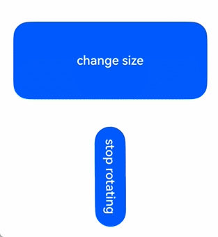

# Explicit Animation (animateTo)
<!--Kit: ArkUI-->
<!--Subsystem: ArkUI-->
<!--Owner: @hehongyang3-->
<!--Designer: @hehongyang3-->
<!--Tester: @lxl007-->
<!--Adviser: @Brilliantry_Rui-->
<!-- md-trans-meta sourceCommit=8dd2d5cdf88acdc31ee17ec2006247a008c91d7c translatedAt=2026-08-28T01:28:33.403Z pushedAt=2026-08-31T09:26:37.964Z -->

Provides the global **animateTo** explicit animation API to insert transition effects for state changes caused by closure code. As with attribute animations, for animations that change layout attributes (such as width and height), the content usually jumps directly to the final state, for example, the text or content in [Canvas](ts-components-canvas-canvas.md). If you want the content to follow the width and height changes, you can use the [renderFit](ts-universal-attributes-renderfit.md#renderfit) attribute for configuration.

>  **NOTE**
>
>  The initial APIs of this module are supported since API version 7. Updates will be marked with a superscript to indicate their earliest API version.
>
>  The functionality of this module depends on UI context. This means that the APIs of this module cannot be used where [the UI context is ambiguous](../../../ui/arkts-global-interface.md#ambiguous-ui-context). For details, see [UIContext](../arkts-apis-uicontext-uicontext.md).

## AnimateParam

Defines parameters related to animation effects.

**System capability**: SystemCapability.ArkUI.ArkUI.Full

<!--Table: 20%; 20%; 8%; 8%; 44%-->
| Name        | Type         | Read-Only| Optional|    Description                                      |
| ---------- | ---------------|---------- | -------------- | ---------------------------------------- |
| duration   | number         |  No  | Yes | Animation duration, in ms.<br>Value range: [0, +∞)<br>Default value: **1000**<br>**Note:** 1. Before API version 26.0.0, the maximum animation duration on ArkTS widgets is 1000 ms. If the value exceeds 1000 ms, it is fixed to 1000 ms. Since API version 26.0.0, the maximum animation duration on ArkTS widgets is adjusted to 2000 ms.<br>2. You can change an attribute in the animation closure function with a duration of 0 to stop the animation of the attribute.<br>3. A value less than 0 is treated as 0.<br>4. When a floating-point value is set, truncation and rounding are performed. For example, if the value is set to 1.2, it is treated as 1.<br>5. When **curve** is set to [springMotion](../js-apis-curve.md#curvesspringmotion9), [responsiveSpringMotion](../js-apis-curve.md#curvesresponsivespringmotion9), or [interpolatingSpring](../js-apis-curve.md#curvesinterpolatingspring10), **duration** does not take effect. The animation duration is determined by the physical parameters (**mass**, **stiffness**, **damping**, etc.) of the spring curve itself.<br>**Widget capability:** This API can be used in ArkTS widgets since API version 9.<br>**Atomic service API:** This API can be used in atomic services since API version 11. |
| tempo      | number         | No | Yes | Animation playback speed. A larger value indicates faster playback, and a smaller value indicates slower playback. The value 0 indicates no animation effect.<br>When set to +∞, the animation ends at the current frame, and the animation completion callback is executed immediately.<br>Default value: **1.0**<br>Value range: [0, +∞)<br>**Note:** A value less than 0 is treated as 1.<br>**Atomic service API:** This API can be used in atomic services since API version 11. |
| curve      | [Curve](ts-appendix-enums.md#curve)&nbsp;\|&nbsp;string&nbsp;\|&nbsp;[ICurve<sup>9+</sup>](#icurve9)| No | Yes | Animation curve.<br>It is recommended to specify the curve in the form of Curve or ICurve.<br>When the type is string, it is an animation interpolation curve and supports only the following optional values:<br>**"linear"**: The animation changes linearly.<br>**"ease"**: The animation speed is slow at the beginning and end, cubic-bezier(0.25, 0.1, 0.25, 1.0).<br>**"ease-in"**: The animation playback speed is slow first and then fast, cubic-bezier(0.42, 0.0, 1.0, 1.0).<br>**"ease-out"**: The animation playback speed is fast first and then slow, cubic-bezier(0.0, 0.0, 0.58, 1.0).<br>**"ease-in-out"**: The animation playback speed accelerates first and then decelerates, cubic-bezier(0.42, 0.0, 0.58, 1.0).<br>**"fast-out-slow-in"**: Standard curve, cubic-bezier(0.4, 0.0, 0.2, 1.0).<br>**"linear-out-slow-in"**: Deceleration curve, cubic-bezier(0.0, 0.0, 0.2, 1.0).<br>**"fast-out-linear-in"**: Acceleration curve, cubic-bezier(0.4, 0.0, 1.0, 1.0).<br>**"friction"**: Damping curve, cubic-bezier(0.2, 0.0, 0.2, 1.0).<br>**"extreme-deceleration"**: Extreme deceleration curve, cubic-bezier(0.0, 0.0, 0.0, 1.0).<br>**"rhythm"**: Rhythm curve, cubic-bezier(0.7, 0.0, 0.2, 1.0).<br>**"sharp"**: Sharp curve, cubic-bezier(0.33, 0.0, 0.67, 1.0).<br>**"smooth"**: Smooth curve, cubic-bezier(0.4, 0.0, 0.4, 1.0).<br>**"cubic-bezier(x1, y1, x2, y2)"**: Cubic Bezier curve. The values of x1 and x2 must be in the range [0, 1]. For example, **"cubic-bezier(0.42, 0.0, 0.58, 1.0)"**.<br>**"steps(number,step-position)"**: Step curve. number is mandatory and must be a positive integer. The step-position parameter is optional and supports start or end, with the default value end. For example, "steps(3,start)".<br>**"interpolating-spring(velocity,mass,stiffness,damping)"**: For details about the specific parameters, see the interpolating spring curve [curves.interpolatingSpring](../js-apis-curve.md#curvesinterpolatingspring10).<br>**"responsive-spring-motion(response,dampingFraction,overlapDuration)"**: For details about the specific parameters, see the responsive spring motion curve [curves.responsiveSpringMotion](../js-apis-curve.md#curvesresponsivespringmotion9).<br>**"spring(velocity,mass,stiffness,damping)"**: For details about the specific parameters, see the spring curve [curves.springCurve](../js-apis-curve.md#curvesspringcurve9).<br>**"spring-motion(response,dampingFraction,overlapDuration)"**: For details about the specific parameters, see the spring motion curve [curves.springMotion](../js-apis-curve.md#curvesspringmotion9).<br>Default value: **Curve.EaseInOut**<br>**Note:** When the string value passed to **curve** is not within the preceding optional values, the default value **Curve.EaseInOut** is used. When curve is set to a spring curve (**interpolating-spring**, **responsive-spring-motion**, or **spring-motion**), the **duration** parameter does not take effect.<br>**Widget capability:** This API can be used in ArkTS widgets since API version 9.<br>**Atomic service API:** This API can be used in atomic services since API version 11. |
| delay      | number         | No | Yes | Animation delay time, in ms. By default, the animation is not delayed.<br>Default value: **0**<br>Value range: (-∞, +∞)<br>**Note:** 1. If **delay** is greater than or equal to 0, the animation is delayed. If **delay** is less than 0, the animation starts in advance. For the case where **delay** is less than 0: if the absolute value of **delay** is less than the actual animation duration, the animation directly moves to the state at the moment of the absolute value of delay in the first frame after the animation starts; if the absolute value of delay is greater than or equal to the actual animation duration, the animation directly moves to the final state in the first frame after the animation starts. The actual animation duration is equal to the single animation duration multiplied by the number of animation playback times, and is also affected by **tempo** (playback speed).<br>2.&nbsp;When a floating-point value is set, truncation and rounding are performed. For example, if the value is set to **1.2**, it is treated as **1**.<br>**Atomic service API:** This API can be used in atomic services since API version 11. |
| iterations | number         | No | Yes | Number of animation playback times. By default, the animation is played once. The value **-1** indicates infinite playback. The value 0 indicates no animation effect. When **PlayMode.Alternate** is used, **iterations** should be an odd number. When **PlayMode.AlternateReverse** is used, **iterations** should be an even number. This ensures that the final state of the animation is consistent with the value of the state variable. For details, see the description of **PlayMode**.<br>Default value: **1** <br>Value range: [-1, +∞)<br>**Note:** When a floating-point value is set, truncation and rounding are performed. For example, if the value is set to 1.2, it is treated as 1.<br>**Atomic service API:** This API can be used in atomic services since API version 11.          |
| playMode   | [PlayMode](ts-appendix-enums.md#playmode)|No | Yes | Animation playback mode. Complete behavior description of each mode: **PlayMode.Normal** plays forward in each round and repeats from the beginning after completion; **PlayMode.Alternate** plays forward and reverse alternately, with the first round forward and the second round reverse, and so on; **PlayMode.Reverse** plays reverse in each round, jumping to the final state at the animation start and then playing reverse; **PlayMode.AlternateReverse** plays reverse and forward alternately, with the first round reverse (jumping to the final state at the animation start) and the second round forward, and so on.<br>Default value: **PlayMode.Normal**<br>**Widget capability:** This API can be used in ArkTS widgets since API version 9.<br>For related usage constraints, see the description of **PlayMode**.<br>**Atomic service API:** This API can be used in atomic services since API version 11. |
| onFinish   | ()&nbsp;=&gt;&nbsp;void      | No | Yes | Callback invoked when the animation playback is complete. The trigger timing of the callback is affected by the **finishCallbackType** parameter. For details, see the description of **finishCallbackType**. When a UIAbility switches from the foreground to the background, a finite loop animation that is still stepping is immediately ended, and the playback completion callback is triggered.<br>When transition animations are disabled in the developer options of system settings, and when **tempo** is set to **+∞**, the animation playback completion callback is executed immediately. <br>**Widget capability:** This API can be used in ArkTS widgets since API version 9.<br>**Atomic service API:** This API can be used in atomic services since API version 11.|
| finishCallbackType<sup>11+</sup>   | [FinishCallbackType](#finishcallbacktype11)| No | Yes| Type of the **onFinish** callback defined in the animation. This parameter takes effect only after the **onFinish** callback is set.<br>Default value: **FinishCallbackType.REMOVED**<br>**Widget capability:** This API can be used in ArkTS widgets since API version 11.<br>**Atomic service API:** This API can be used in atomic services since API version 12.<br>**Model restriction:** This API can be used only in the stage model. |
| expectedFrameRateRange<sup>11+</sup>   | [ExpectedFrameRateRange](#expectedframeraterange11) | No | Yes | Expected frame rate of the animation. For related usage constraints, see the description of **ExpectedFrameRateRange**. When set to 0, the expected frame rate follows the frame rate of the app. When the value exceeds the value range, it is automatically corrected to the boundary value. When this parameter is not set, the animation runs at the default frame rate of the app.<br>**Atomic service API:** This API can be used in atomic services since API version 12.<br>**Model restriction:** This API can be used only in the stage model.|

> **PlayMode NOTE**
>
> - **PlayMode.Normal** and **PlayMode.Alternate** are recommended. In this scenario, the first round of the animation is played in the forward direction. If **PlayMode.Reverse** or **PlayMode.AlternateReverse** is used, the first round of the animation is played in the reverse direction, and the animation jumps to the end state at the very beginning and then plays in reverse.
> - When **PlayMode.Alternate** or **PlayMode.AlternateReverse** is used, developers should ensure that the final state of the animation is consistent with the value of the state variable, that is, ensure that the last round of the animation is played in the forward direction. When **PlayMode.Alternate** is used, iterations should be an odd number; otherwise, the final state of the animation may be inconsistent with the value of the state variable. When **PlayMode.AlternateReverse** is used, iterations should be an even number; otherwise, the final state of the animation may be inconsistent with the value of the state variable.
> - **PlayMode.Reverse** is not recommended. In this scenario, not only does the animation jump to the end state at the very beginning, but the final state of the animation also differs from the value of the state variable.

## ICurve<sup>9+</sup>

Curve.

### interpolate<sup>9+</sup>

interpolate(fraction:&nbsp;number): number

Calculates the interpolation of the interpolation curve. It returns the current interpolation based on the input normalized time parameter.

**Atomic service API**: This API can be used in atomic services since API version 11.

**System capability**: SystemCapability.ArkUI.ArkUI.Full

**Widget capability**: This API can be used in ArkTS widgets since API version 9.

**Parameters**

| Name  | Type  | Mandatory| Description                                                        |
| -------- | ------ | ---- | ------------------------------------------------------------ |
| fraction | number | Yes | Current normalized time parameter.<br>Value range: [0,1]<br>**NOTE**<br>If the value is less than 0, it is processed as 0. If the value is greater than 1, it is processed as 1. |

**Return value**

| Type  | Description                                |
| ------ | ------------------------------------ |
| number | Curve interpolation value corresponding to the normalized time point. |

## FinishCallbackType<sup>11+</sup>

Defines the type of the **onFinish** callback.

**Widget capability**: This API can be used in ArkTS widgets since API version 11.

**Atomic service API**: This API can be used in atomic services since API version 12.

**Model restriction:** This API can be used only in the stage model.

**System capability**: SystemCapability.ArkUI.ArkUI.Full

| Name      | Value        | Description                                                        |
| --------- | ---------------|------------------------------------------------------------ |
| REMOVED   | 0  | Triggered when the entire animation ends and is removed. |
| LOGICALLY | 1  | Triggered when the animation is logically complete but may still be in a long-tail state. That is, the **onFinish** callback is triggered when the main motion logic of the animation is complete, but the animation may still have long-tail effects (such as the aftershock decay of a spring curve) continuing to run. This callback is triggered upon logical completion, rather than waiting for the long-tail effects to fully disappear. |

## ExpectedFrameRateRange<sup>11+</sup>

Sets the expected frame rate range for an animation.

**Atomic service API**: This API can be used in atomic services since API version 12.

**Model restriction:** This API can be used only in the stage model.

**System capability**: SystemCapability.ArkUI.ArkUI.Full

| Name | Type    |  Read-Only| Optional   | Description     |
|-----|--------|---------|------- |---------|
| min | number | No | No | Expected minimum frame rate, in frames per second (fps).<br>Value range: [0, device maximum frame rate]. |
| max | number | No | No | Expected maximum frame rate, in frames per second (fps).<br>Value range: [min, device maximum frame rate]. The device maximum frame rate depends on the refresh rate of the device screen. For example, the device maximum frame rate is 60 fps on a 60 Hz screen and 120 fps on a 120 Hz screen. |
| expected | number | No | No | Expected optimal frame rate, in frames per second (fps).<br>Value range: [min, max]. If the value is out of range, it does not take effect. When set to 0, the frame rate follows that of the app. |

## animateTo<sup>(deprecated)</sup>

animateTo(value: AnimateParam, event: () => void): void

Defines an explicit animation. When an animation is required, call this API explicitly to change the state and produce an animation. For animations that change layout attributes (such as width and height), the content usually jumps directly to the final state. If you want the content to follow the width and height changes, you can use the [renderFit](ts-universal-attributes-renderfit.md#renderfit) attribute for configuration.

> **NOTE**
> - This API is supported since API version 7 and deprecated since API version 18. You are advised to use [animateTo](../arkts-apis-uicontext-uicontext.md#animateto) instead.
> - This API depends on the UI execution context and cannot be used where the UI context is not clear. Since API version 10, you can use [animateTo](../arkts-apis-uicontext-uicontext.md#animateto) in [UIContext](../arkts-apis-uicontext-uicontext.md) to clarify the UI execution context.
> - It is not recommended to call animations in **aboutToAppear** or **aboutToDisappear**.
> - If an animation is called in [aboutToAppear](./ts-custom-component-lifecycle.md#abouttoappear), the animation timing is too early because the **build** in the custom component has not been executed and the internal components have not been created. In this case, the animation attributes have no initial values, and no animation can be produced for the component.
> - When [aboutToDisappear](./ts-custom-component-lifecycle.md#abouttodisappear) is executed, the component is about to be destroyed, so animations cannot be performed in **aboutToDisappear**.
> - When a component appears or disappears, you can add animation effects through [component transition](./ts-transition-animation-component.md).
> - For attributes not supported by component transition, refer to [Example 2](#example-2-enabling-component-disappearance-after-animation-completion) and use **animateTo** to implement the effect that the component disappears after the animation completes.
> - In some scenarios, using **animateTo** for animation in [State Management V2](../../../ui/state-management/arkts-state-management-overview.md#state-management-v2) may produce abnormal effects. For details, see [Using animateTo Failed in State Management V2](../../../ui/state-management/arkts-new-local.md#using-animateto-failed-in-state-management-v2).

**Widget capability**: This API can be used in ArkTS widgets since API version 9.

**Atomic service API**: This API can be used in atomic services since API version 11.

**System capability**: SystemCapability.ArkUI.ArkUI.Full

**Parameters**
| Name   | Type                               | Mandatory| Description                                   |
| ----- | --------------------------------- | ---- | ------------------------------------- |
| value | [AnimateParam](#animateparam)| Yes   | Animation settings.                          |
| event | () => void                        | Yes    | Closure function that specifies the animation effect. For state changes caused within the closure function, the system automatically inserts transition animations. |

## Example

### Example 1: Creating an Appearance Animation for a Component

> **NOTE**
> 
> Directly using **animateTo** can lead to the issue of [ambiguous UI context](../../../ui/arkts-global-interface.md#ambiguous-ui-context). To avoid this, obtain the [UIContext](../arkts-apis-uicontext-uicontext.md) object using the **getUIContext()** API and then call **animateTo** bound to the instance using the [animateTo](../arkts-apis-uicontext-uicontext.md#animateto) API.

This example demonstrates how to create an appearance animation for a component using the **onAppear** method.

<!--deprecated_code_no_check-->
```ts
// xxx.ets
@Entry
@Component
struct AnimateToExample {
  @State widthSize: number = 250;
  @State heightSize: number = 100;
  @State rotateAngle: number = 0;
  private flag: boolean = true;

  build() {
    Column() {
      Button('change size')
        .width(this.widthSize)
        .height(this.heightSize)
        .margin(30)
        .onClick(() => {
          if (this.flag) {
            // You are advised to use this.getUIContext()?.animateTo().
            animateTo({
              duration: 2000,
              curve: Curve.EaseOut,
              iterations: 3,
              playMode: PlayMode.Normal,
              onFinish: () => {
                console.info('play end');
              }
            }, () => {
              this.widthSize = 150;
              this.heightSize = 60;
            })
          } else {
            // You are advised to use this.getUIContext()?.animateTo().
            animateTo({}, () => {
              this.widthSize = 250;
              this.heightSize = 100;
            })
          }
          this.flag = !this.flag;
        })
      Button('stop rotating')
        .margin(50)
        .rotate({ x: 0, y: 0, z: 1, angle: this.rotateAngle })
        .onAppear(() => {
          // Start the animation when the component appears.
          // You are advised to use this.getUIContext()?.animateTo().
          animateTo({
            duration: 1200,
            curve: Curve.Friction,
            delay: 500,
            iterations: -1, // The value -1 indicates that the animation is played for an unlimited number of times.
            playMode: PlayMode.Alternate,
            expectedFrameRateRange: {
              min: 10,
              max: 120,
              expected: 60,
            }
          }, () => {
            this.rotateAngle = 90;
          })
        })
        .onClick(() => {
          // You are advised to use this.getUIContext()?.animateTo().
          animateTo({ duration: 0 }, () => {
            // Modify the property in the animation closure where duration is set to 0. This stops the previous animation and applies the new value.
            this.rotateAngle = 0;
          })
        })
    }.width('100%').margin({ top: 5 })
  }
}
```



### Example 2: Enabling Component Disappearance After Animation Completion

This example demonstrates how to make a component disappear after the animation ends.

<!--deprecated_code_no_check-->
```ts
// xxx.ets
@Entry
@Component
struct AttrAnimationExample {
  @State heightSize: number = 100;
  @State isShow: boolean = true;
  @State count: number = 0;
  private isToBottom: boolean = true; // Direction: moving downward.

  build() {
    Column() {
      if (this.isShow) {
        Column()
          .width(200)
          .height(this.heightSize)
          .backgroundColor('blue')
          .onClick(() => {
            // You are advised to use this.getUIContext()?.animateTo().
            animateTo({
              duration: 2000,
              curve: Curve.EaseOut,
              iterations: 1,
              playMode: PlayMode.Normal,
              onFinish: () => {
                // Decrease the count when the animation is complete. The count reaching zero indicates that all animations have ended.
                this.count--;
                if (this.count == 0 && !this.isToBottom) { // The component disappears only after completing the downward animation.
                  this.isShow = false;
                }
              }
            }, () => {
              // Increase the count when the animation starts. This count is used in the onFinish callback to determine whether the animation is complete.
              this.count++;
              if (this.isToBottom) {
                this.heightSize = 60;
              } else {
                this.heightSize = 100;
              }
              this.isToBottom = !this.isToBottom;
            })
          })
      }
    }.width('100%').height('100%').margin({ top: 5 })
    .justifyContent(FlexAlign.End)
  }
}
```

