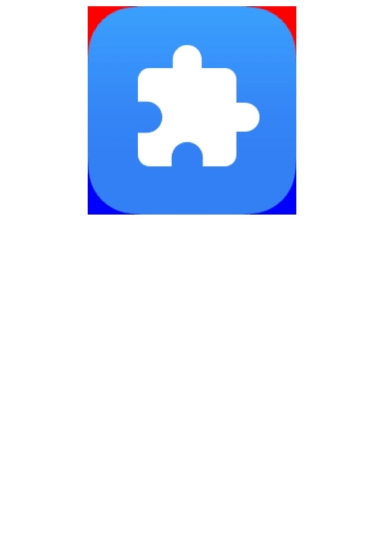

# Custom Gesture Judgment
<!--Kit: ArkUI-->
<!--Subsystem: ArkUI-->
<!--Owner: @yihao-lin-->
<!--Designer: @piggyguy-->
<!--Tester: @songyanhong-->
<!--Adviser: @Brilliantry_Rui-->

You can use the custom gesture judgment APIs to During hand gesture recognition, you can determine whether to respond to a gesture based on the gesture type and touch point position. This capability is applicable to scenarios where the gesture response logic of custom components is required, gestures are controlled by area, or specific gestures are filtered out.

>  **NOTE**
>
> This feature is supported since API version 11. Newly added APIs will be marked with a superscript to indicate their earliest API version.


## onGestureJudgeBegin

onGestureJudgeBegin(callback: (gestureInfo: GestureInfo, event: BaseGestureEvent) => GestureJudgeResult): T

Binds a custom gesture determination callback to the component. When the gesture is about to succeed, the user-defined callback is triggered to obtain the result.

>  **NOTE**
>
>  When this API is used in the Text component, custom gesture judgment cannot be performed on click events.

**Model restriction**: This API can be used only in the stage model.

**Atomic service API**: This API can be used in atomic services since API version 12.

**System capability**: SystemCapability.ArkUI.ArkUI.Full

**Parameters**
| Name       | Type                   | Mandatory | Description                         |
| ---------- | -------------------------- | ------- | ----------------------------- |
| callback      | (gestureInfo: [GestureInfo](./ts-gesture-common.md#gestureinfo11), event: [BaseGestureEvent](./ts-gesture-common.md#basegestureevent11)) => [GestureJudgeResult](./ts-gesture-common.md#gesturejudgeresult11) | Yes    | Custom gesture judgment callback. This callback is triggered when a gesture is about to succeed, and is used to determine whether to continue to respond to the gesture based on the gesture information and basic gesture event. gestureInfo indicates the type and ID of the current gesture, and event indicates the current gesture event information. GestureJudgeResult is returned to specify the gesture judgment result.|

**Return value**

| Type| Description|
| -------- | -------- |
| T | Current component.|

## Examples

### Example 1: Implementing Custom Gesture Judgment

In this example, the [onGestureJudgeBegin](#ongesturejudgebegin) event is configured to implement customized judgment of the press and hold, fast swipe, swipe, pinch, and drag gestures. From API version 21, the [BaseEvent](ts-universal-events-click.md#baseevent8) axisPinch attribute can be used to obtain the two-finger zoom ratio.

```ts
// xxx.ets
@Entry
@Component
struct Index {
  @State message: string = '';

  build() {
    Column() {
      Row({ space: 20 }) {
        Text(this.message).width(200).height(80).backgroundColor(Color.Pink)
          .fontSize(25)
      }.margin(20)
    }
    .width('100%')
    .height(200)
    .borderWidth(2)
    .onDragStart(() => {
      this.message = 'drag';
      console.info('Drag start.');
    })
    .gesture(
      TapGesture()
        .tag('tap1') // Set the tap gesture flag.
        .onAction(() => {
          this.message = 'tap1';
        })
    )
    .gesture(
      LongPressGesture()
        .tag('longPress1') // Set the long press gesture flag.
        .onAction(() => {
          this.message = 'longPress';
        })
    )
    .gesture(
      SwipeGesture()
        .tag('swipe1') // Set the fast swipe gesture flag.
        .onAction(() => {
          this.message = 'swipe1';
        })
    )
    .gesture(
      PanGesture()
        .tag('pan1') // Set the swipe gesture flag.
        .onActionStart(() => {
          this.message = 'pan1';
        })
    )
    .gesture(
      PinchGesture()
        .tag('pinch1') // Set the pinch gesture flag.
        .onActionStart(() => {
          this.message = 'pinch1'
        })
    )
    .onGestureJudgeBegin((gestureInfo: GestureInfo, event: BaseGestureEvent) => {
      // If the gesture type is a long press gesture, convert the event to a long press gesture event.
      if (gestureInfo.type == GestureControl.GestureType.LONG_PRESS_GESTURE) {
        let longPressEvent = event as LongPressGestureEvent;
        console.info(`repeat ${longPressEvent.repeat}`);
      }
      // If the gesture type is a swipe gesture, convert the event to a swipe event.
      if (gestureInfo.type == GestureControl.GestureType.SWIPE_GESTURE) {
        let swipeEvent = event as SwipeGestureEvent;
        console.info(`angle ${swipeEvent.angle}`);
      }
      // If the gesture type is a swipe gesture, convert the event to a swipe gesture event.
      if (gestureInfo.type == GestureControl.GestureType.PAN_GESTURE) {
        let panEvent = event as PanGestureEvent;
        console.info(`velocity ${panEvent.velocity}`);
      }
      // If the gesture type is a pinch gesture, convert the event to a pinch event.
      if (gestureInfo.type == GestureControl.GestureType.PINCH_GESTURE) {
        let pinchEvent = event as PinchGestureEvent;
        console.info(`axisPinch ${pinchEvent.axisPinch}`);
      }
      // Custom criteria
      if (gestureInfo.type == GestureControl.GestureType.DRAG) {
        // If GestureJudgeResult.REJECT is returned, the pan gesture recognition fails.
        return GestureJudgeResult.REJECT;
      } else if (gestureInfo.tag === 'longPress1' && event.fingerList.length > 0 && event.fingerList[0].localY < 100) {
        // If GestureJudgeResult.CONTINUE is returned, the system recognition result is retained.
        return GestureJudgeResult.CONTINUE;
      }
      return GestureJudgeResult.CONTINUE;
    })
  }
}
```


### Example 2: Implementing Custom Area Gesture Judgment

This example uses onGestureJudgeBegin to determine whether to respond to the press and hold gesture and drag gesture based on the area where the gesture is triggered.

```ts
// xxx.ets
import { PromptAction } from '@kit.ArkUI';

@Entry
@Component
struct Index {
  scroller: Scroller = new Scroller()
  promptAction: PromptAction = this.getUIContext().getPromptAction();

  build() {
    Scroll(this.scroller) {
      Column({ space: 8 }) {
        Text('The upper red area is bound to the long press gesture, and the lower blue area is bound to a drag gesture. If a pan is performed after a long press in the upper red area, the area only responds to the long press. In the same case, the lower blue area only responds to the drag.')
          .width('100%')
          .fontSize(20)
          .fontColor('0xffdd00')
          .backgroundColor(0xeeddaa00)
        Stack({ alignContent: Alignment.Center }) {
          Column() {
            // Simulate the upper and lower half areas.
            Stack().width('200').height('100').backgroundColor(Color.Red)
            Stack().width('200').height('100').backgroundColor(Color.Blue)
          }.width('200vp').height('200vp')

          // The lower part of the Stack component is the image area bound to the pan gesture.
          Image($r('sys.media.ohos_app_icon'))
            .draggable(true)
            .onDragStart(() => {
              this.promptAction.showToast({ message: 'When the blue area is dragged, the image responds.' })
            })
            .width('200').height('200')
          // The upper part of the Stack component is the floating area bound to the long press gesture.
          Stack() {
          }
          .width('200')
          .height('200')
          .hitTestBehavior(HitTestMode.Transparent)
          .onGestureJudgeBegin((gestureInfo: GestureInfo, event: BaseGestureEvent) => {
            // Check whether the tag of gestureInfo has a value.
            if (gestureInfo.tag) {
              console.info(`gestureInfo tag ${gestureInfo.tag.toString()}`);
            }
            console.info(`gestureInfo Type ${gestureInfo.type.toString()}`);
            console.info(`isSystemGesture ${gestureInfo.isSystemGesture}`);
            console.info(`pressure ${event.pressure}\nfingerList.length ${event.fingerList.length}\ntimeStamp ${event.timestamp}\nsourceType ${event.source.toString()}\n` +
              `tiltX ${event.tiltX}\ntiltY ${event.tiltY}\nrollAngle ${event.rollAngle}\nsourceTool ${event.sourceTool.toString()}`);
            // If the gesture is a long press gesture, check whether the touch position is in the upper half area.
            if (gestureInfo.type == GestureControl.GestureType.LONG_PRESS_GESTURE) {
              if (event.fingerList.length > 0 && event.fingerList[0].localY < 100) {
                return GestureJudgeResult.CONTINUE
              } else {
                return GestureJudgeResult.REJECT
              }
            }
            return GestureJudgeResult.CONTINUE
          })
          .gesture(GestureGroup(GestureMode.Parallel,
            LongPressGesture()
              .onAction((event: GestureEvent) => {
                this.promptAction.showToast({ message: 'Long-press the upper red area. The red area responds.' })
              })
              .tag('tap111')
          ))

        }.width('100%')
      }.width('100%')
    }
  }
}
```


### Example 3: Implementing Real-time Monitoring of Active Touch Points in Gestures

This example configures the onGestureJudgeBegin callback to read fingerInfos to detect the number of valid touch points, ID of each touch point, and coordinates of each touch point in real time.

```ts
// xxx.ets
@Entry
@Component
struct GestureDetectorExample {
  @State message: string = 'Touch area'
  @State fingerCount: number = 0
  @State fingerDetails: string = ''

  build() {
    Column() {
      // Information display area
      Column() {
        Text(this.message)
          .fontSize(20)
          .fontWeight(FontWeight.Bold)

        Text(`Active touch points: ${this.fingerCount}`)
          .fontSize(16)
          .margin({ top: 8 })


        Text(this.fingerDetails)
          .fontSize(14)
          .margin({ top: 8 })
      }
      .padding(10)
      .border({ width: 1, color: Color.Gray })

      // Gesture detection area
      Column()
        .width('90%')
        .height(200)
        .margin(20)
        .border({ width: 2, color: Color.Black })
        .gesture(
          GestureGroup(GestureMode.Exclusive,
            TapGesture()
              .onAction(() => {
                this.message = 'Tap event'
              }),
            LongPressGesture()
              .onAction(() => {
                this.message = 'Long press event'
              }),
            PanGesture()
              .onActionStart(() => {
                this.message = 'Drag started'
              })
              .onActionUpdate(() => {
                this.message = 'Dragging...'
              })
              .onActionEnd(() => {
                this.message = 'Drag ended'
                this.fingerCount = 0;
                this.fingerDetails = '';
              })
          )
        )
        .onGestureJudgeBegin((_gestureInfo: GestureInfo, event: BaseGestureEvent) => {
          // Access fingerInfos data.
          if (event?.fingerInfos) {
            this.fingerCount = event.fingerInfos.length;
            this.fingerDetails = event.fingerInfos.map(finger =>
            `ID: ${finger.id}: (${finger.localX.toFixed(1)}, ${finger.localY.toFixed(1)})`
            ).join('\n');
            console.info(`Touch point data: ${JSON.stringify(event.fingerInfos)}`)
          }
          // When the number of touch points exceeds 2, the current gesture is rejected.
          if (this.fingerCount > 2) {
            return GestureJudgeResult.REJECT
          }
          return GestureJudgeResult.CONTINUE
        })
    }
    .width('100%')
    .height('100%')
    .padding(10)
  }
}

```
<!--Del--> <!--DelEnd-->
<!--no_check-->