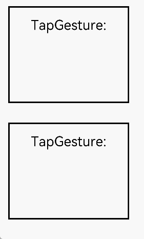

# Binding Gesture Events
<!--Kit: ArkUI-->
<!--Subsystem: ArkUI-->
<!--Owner: @yihao-lin-->
<!--Designer: @piggyguy-->
<!--Tester: @songyanhong-->
<!--Adviser: @Brilliantry_Rui-->
<!-- md-trans-meta sourceCommit=10a20f217ecf0e77e23c0c78c466ce20e1033d43 translatedAt=2026-09-07T08:05:00.627Z -->

Binds different types of gesture events to a component and sets the event response methods. It supports common gesture binding, parent component priority gesture recognition, and simultaneous gesture triggering of parent and child components. It is applicable to scenarios such as component interaction response, gesture priority control between parent and child components, and coordinated gesture triggering of multiple components.

>  **NOTE**
>
> - The initial APIs of this module are supported since API version 7. Newly added APIs will be marked with a superscript to indicate their earliest API version.
>
> - You can use **gesture**, **priorityGesture**, and **parallelGesture** to bind gesture recognition to a component. After gesture recognition succeeds, the component can be notified through event callbacks. You can use the [touch target](ts-universal-attributes-touch-target.md) to specify the area where gestures can be recognized. **gesture**, **priorityGesture**, and **parallelGesture** currently do not support using the ternary operator (`condition ? expression1 : expression2`) to switch gesture binding.

## gesture

gesture(gesture: GestureType, mask?: GestureMask): T

Binds a gesture.

> **NOTE**
>
> This API cannot be called within [attributeModifier](ts-universal-attributes-attribute-modifier.md#attributemodifier).

**Atomic service API**: This API can be used in atomic services since API version 11.

**System capability**: SystemCapability.ArkUI.ArkUI.Full

**Parameters**

| Name | Type                                       | Mandatory | Description                         |
| ------ | ------------------------------------------ | ---- | ---------------------------- |
| gesture  |  [GestureType](./ts-gesture-common.md#gesturetype) | Yes   | Type of the gesture to bind. |
| mask  |  [GestureMask](./ts-gesture-common.md#gesturemask) | No   | Event response setting. Pass this parameter when you need to set whether to block child component gestures when the parent component recognizes a gesture first: **GestureMask.Normal** indicates that child component gestures are not blocked, which applies to the scenario where the parent component recognizes the gesture first but child component gestures are still allowed to participate in recognition according to the default rules; **GestureMask.IgnoreInternal** indicates that child component gestures are blocked, which applies to the scenario where you want the gesture bound by the parent component's **priorityGesture** to respond first and ignore child component gestures. If this parameter is not passed, the default value is **GestureMask.Normal**. |

**Return value**

| Type     | Description        |
| ------ | --------- |
| T | Current component, which can be used for chained calls. |

## priorityGesture

priorityGesture(gesture: GestureType, mask?: GestureMask): T

Binds a gesture that is recognized with priority.

1. By default, the child component recognizes the gesture bound through **gesture** first. When the parent component configures **priorityGesture**, the parent component recognizes the gesture bound through **priorityGesture** first.

2. When a long press gesture is bound, the component with a smaller minimum long press duration takes precedence in responding and ignores the **priorityGesture** setting.

> **NOTE**
>
> This API cannot be called within [attributeModifier](ts-universal-attributes-attribute-modifier.md#attributemodifier).

**Atomic service API**: This API can be used in atomic services since API version 11.

**System capability**: SystemCapability.ArkUI.ArkUI.Full

**Parameters**

| Name | Type                                       | Mandatory | Description                         |
| ------ | ------------------------------------------ | ---- | ---------------------------- |
| gesture | [GestureType](./ts-gesture-common.md#gesturetype) | Yes | Gesture object to bind. When a long press gesture is bound, the component with a smaller minimum long press duration takes precedence in responding and ignores the **priorityGesture** setting. |
| mask  |  [GestureMask](./ts-gesture-common.md#gesturemask) | No   | Event response setting.<br/>Default value: **GestureMask.Normal** |

**Return value**

| Type     | Description        |
| ------ | --------- |
| T | Current component, which can be used for chained calls. |

## parallelGesture

parallelGesture(gesture: GestureType, mask?: GestureMask): T

Binds a gesture that can be triggered together with the child component gesture. Gesture events are non-bubbling events. When the parent component sets parallelGesture, the same gesture events of both the parent and child components can be triggered, achieving an effect similar to bubbling.

> **NOTE**
>
> This API cannot be called within [attributeModifier](ts-universal-attributes-attribute-modifier.md#attributemodifier).

**Atomic service API**: This API can be used in atomic services since API version 11.

**System capability**: SystemCapability.ArkUI.ArkUI.Full

**Parameters**

| Name | Type                                       | Mandatory | Description                         |
| ------ | ------------------------------------------ | ---- | ---------------------------- |
| gesture  |  [GestureType](./ts-gesture-common.md#gesturetype) | Yes   | Gesture object to bind. |
| mask | [GestureMask](./ts-gesture-common.md#gesturemask) | No | Event response setting. When the parent and child component gestures need to be triggered simultaneously, you can pass this parameter to control whether to block the child component gesture. **GestureMask.Normal** indicates that the child component gesture is not blocked, which applies to scenarios where both the parent and child component gestures need to respond. **GestureMask.IgnoreInternal** indicates that the child component gesture is blocked, which applies to scenarios where only the gesture bound by the parent component **parallelGesture** needs to respond. If this parameter is not passed, the default value is **GestureMask.Normal**. |

**Return value**

| Type     | Description        |
| ------ | --------- |
| T | Current component, which can be used for chained calls. |

## SourceType<sup>8+</sup>

Defines the device types corresponding to the input sources.

**System capability**: SystemCapability.ArkUI.ArkUI.Full

| Name | Value | Description |
| ---- | --- | -------- |
| Unknown | 0 | Unknown input source.<br>**Atomic service API:** This API can be used in atomic services since API version 11. |
| Mouse | 1 | Mouse.<br>**Atomic service API:** This API can be used in atomic services since API version 11. |
| TouchScreen | 2 | Touchscreen.<br>**Atomic service API:** This API can be used in atomic services since API version 11. |
| KEY<sup>22+</sup> | 4 | Key.<br>**Atomic service API:** This API can be used in atomic services since API version 22.<br>**Model constraint:** This API can be used only in the stage model. |
| JOYSTICK<sup>22+</sup> | 5 | Joystick.<br>**Atomic service API:** This API can be used in atomic services since API version 22.<br>**Model constraint:** This API can be used only in the stage model. |

## SourceTool<sup>9+</sup>

Enumerates the tool types corresponding to the input sources.

**System capability**: SystemCapability.ArkUI.ArkUI.Full

| Name | Value | Description |
| -------- | - | --------- |
| Unknown | 0 | Unknown input source.<br>**Atomic service API:** Since API version 11, this API is supported in atomic services. |
| Finger | 1 | Finger input.<br>**Atomic service API:** Since API version 11, this API is supported in atomic services. |
| Pen | 2 | Stylus input.<br>**Atomic service API:** Since API version 11, this API is supported in atomic services. |
| MOUSE<sup>12+</sup> | 7 | Mouse input.<br>**Atomic service API:** Since API version 12, this API is supported in atomic services.<br>**Model constraint:** This API can be used only in the stage model. |
| TOUCHPAD<sup>12+</sup> | 9 | Touchpad input. A single-finger input on the touchpad is treated as a mouse input operation.<br>**Atomic service API:** Since API version 12, this API is supported in atomic services.<br>**Model constraint:** This API can be used only in the stage model. |
| JOYSTICK<sup>12+</sup> | 10 | Joystick input.<br>**Atomic service API:** Since API version 12, this API is supported in atomic services.<br>**Model constraint:** This API can be used only in the stage model. |

## Examples

### Example 1: Parent Component Prioritizes Gesture Recognition and Parent and Child Components Trigger Gestures Simultaneously

This example uses priorityGesture and parallelGesture to implement parent component priority gesture recognition and simultaneous gesture triggering by parent and child components, respectively.

```ts
// xxx.ets
@Entry
@Component
struct GestureSettingsExample {
  @State priorityTestValue: string = ''
  @State parallelTestValue: string = ''

  build() {
    Column() {
      Column() {
        Text('TapGesture:' + this.priorityTestValue).fontSize(28)
          .gesture(
            TapGesture()
              .onAction(() => {
                this.priorityTestValue += '\nText';
              }))
      }
      .height(200)
      .width(250)
      .padding(20)
      .margin(20)
      .border({ width: 3 })
      // When priorityGesture is set, tapping the text ignores the TapGesture event of the Text component and prioritizes the TapGesture event of the parent Column component.
      .priorityGesture(
        TapGesture()
          .onAction((event: GestureEvent) => {
            this.priorityTestValue += '\nColumn';
          }), GestureMask.IgnoreInternal)

      Column() {
        Text('TapGesture:' + this.parallelTestValue).fontSize(28)
          .gesture(
            TapGesture()
              .onAction((event: GestureEvent) => {
                this.parallelTestValue += '\nText';
              }))
      }
      .height(200)
      .width(250)
      .padding(20)
      .margin(20)
      .border({ width: 3 })
      // When parallelGesture is set, tapping the text simultaneously triggers the TapGesture events of the child Text component and the parent Column component.
      .parallelGesture(
        TapGesture()
          .onAction((event: GestureEvent) => {
            this.parallelTestValue += '\nColumn';
          }), GestureMask.Normal)
    }
  }
}
```



### Example 2: Monitoring the Number of Valid Touch Points in a Swipe Gesture in Real Time

This example reads **fingerInfos** to monitor the number of valid touch points involved in a swipe gesture in real time.

```ts
// xxx.ets
@Entry
@Component
struct PanGestureWithFingerCount {
  @State offsetX: number = 0
  @State offsetY: number = 0
  @State positionX: number = 0
  @State positionY: number = 0
  @State fingerCount: number = 0 // Record the number of touch points involved in the gesture.
  private panOption: PanGestureOptions = new PanGestureOptions({
    direction: PanDirection.All,
    fingers: 1
  })

  build() {
    Column() {
      // Display the current number of valid touch points.
      Text(`Touch points: ${this.fingerCount}`)
        .fontSize(20)
        .margin(10)

      Column() {
        Text('PanGesture offset:\nX: ' + this.offsetX + '\n' + 'Y: ' + this.offsetY)
      }
      .height(200)
      .width(300)
      .padding(20)
      .border({ width: 3 })
      .margin(50)
      .translate({ x: this.offsetX, y: this.offsetY, z: 0 })
      .gesture(
        PanGesture(this.panOption)
          .onActionStart((event: GestureEvent) => {
            console.info('Pan start');
            this.fingerCount = event.fingerInfos?.length || 0; // Record the number of touch points.
          })
          .onActionUpdate((event: GestureEvent) => {
            if (event) {
              console.info(`fingerInfos ${JSON.stringify(event.fingerInfos)}`);
              this.offsetX = this.positionX + event.offsetX;
              this.offsetY = this.positionY + event.offsetY;
              this.fingerCount = event.fingerInfos?.length || 0; // Update the number of touch points and record the number of valid touch points involved in the current gesture.
            }
          })
          .onActionEnd(() => {
            this.positionX = this.offsetX;
            this.positionY = this.offsetY;
            this.fingerCount = 0; // Reset to zero after the touch point leaves the touch area.
            console.info('Pan end');
          })
          .onActionCancel(() => {
            this.fingerCount = 0; // Reset to zero after the gesture is canceled.
          })
      )

      Button('Switch to two-finger swipe')
        .onClick(() => {
          this.panOption.setFingers(2);
        })
    }
  }
}
```

<!--Del--> <!--DelEnd-->