# Enhanced SVG Tag Parsing
<!--Kit: ArkUI-->
<!--Subsystem: ArkUI-->
<!--Owner: @liyujie43-->
<!--Designer: @weixin_52725220-->
<!--Tester: @xiong0104-->
<!--Adviser: @Brilliantry_Rui-->

In API version 21 and later, when the [supportSvg2](./ts-basic-components-image.md#supportsvg221) attribute of the **Image** component is set to **true**, enhanced SVG tag parsing is enabled. This feature implements the following capabilities defined in the SVG 1.1 specification:

- Usability enhancements: (1) The default parsing format for SVG image source colors is changed from #ARGB to #RGBA, complying with the SVG standard. (2) Strict URL type validation is conducted for referenced resources. (3) The **Image** component's [colorFilter](./ts-basic-components-image.md#colorfilter9) attribute takes effect for the entire SVG image source. (4) The **Image** component's [fillColor](./ts-basic-components-image.md#fillcolor20) attribute respects **fill='none'** declarations in the SVG source.

- Advanced affine transformation support: configurable global pivot points, local rotation centers for **rotate** transformations, matrix transformation modes, invalid value detection and handling, affine transformations in clipping paths, and combined transformation scenarios.

- Extended parsing capabilities: [viewBox](./ts-image-svg2-capabilities.md#configurable-alignment-and-scaling-rules-for-viewbox) attributes allow users to customize alignment and scaling rules; parsing of clipping path units; parsing of gradient units; parsing of mask units and mask content units; parsing of pattern units and pattern content units; parsing of filter units and primitive units.

- Enhanced display effects: (1) The opacity attribute of the **\<g>** (group) element takes effect for all nested child elements in the group. (2) The following features are enhanced: processing for the **clip-path** rule in **\<g>** tags, tiling effects and offset value processing for pattern elements, and translation and scaling effects for linear and radial gradients; (3) The default behavior for abnormal mask and filter parameters is updated.

## Impact of Enhanced SVG Tag Parsing on Elements and Attributes

The following table describes the SVG elements and attributes affected when enhanced parsing is enabled.

| Element          | Attribute                                                        | Description                                                        |
| -------------- | ------------------------------------------------------------ | ------------------------------------------------------------ |
| clipPath       | clipPathUnits                                                | **clipPathUnits**: defines the coordinate system reference for the clipping path.<br>Values:<br>**userSpaceOnUse** (absolute coordinate system) and **objectBoundingBox** (coordinate system relative to the bounding box of the applied element).|
| filter         | filterUnits<br>primitiveUnits<br>x<br>y<br>width<br>height | **filterUnits**: coordinate and size reference for the filter effect area.<br>**primitiveUnits**: coordinate and size reference for filter primitive elements.<br>Values of **filterUnits** and **primitiveUnits**:<br>**userSpaceOnUse** (absolute coordinate system) and **objectBoundingBox** (coordinate system relative to the bounding box of the applied element).<br>**x**: x-axis offset component of the filter area. The default value is **-10%**.<br>**y**: y-axis offset component of the filter area. The default value is **-10%**.<br>**width**: width of the filter area. The default value is **120%**.<br>**height**: height of the filter area. The default value is **120%**. |
| mask           | maskUnits<br>maskContentUnits<br>x<br>y<br>width<br>height | **maskUnits**: coordinate system and rendering mode for the mask.<br>**maskContentUnits**: coordinate system and rendering mode for elements within the mask.<br>Values of **maskUnits** and **maskContentUnits**:<br>**userSpaceOnUse** (absolute coordinate system) and **objectBoundingBox** (coordinate system relative to the bounding box of the applied element).<br>**x**: x-axis offset component of the mask area. The default value is **-10%**.<br>**y**: y-axis offset component of the mask area. The default value is **-10%**.<br>**width**: width of the mask area. The default value is **120%**.<br>**height**: height of the mask area. The default value is **120%**. |
| radialGradient | gradientUnits                                                | **gradientUnits**: coordinate reference system for the gradient.<br>Values:<br>**userSpaceOnUse** (absolute coordinate system) and **objectBoundingBox** (coordinate system relative to the bounding box of the applied element).|
| linearGradient | gradientUnits                                                | **gradientUnits**: coordinate reference system for the gradient.<br>Values:<br>**userSpaceOnUse** (absolute coordinate system) and **objectBoundingBox** (coordinate system relative to the bounding box of the applied element).|
| pattern        | patternUnits<br>patternContentUnits                        | **patternUnits**: coordinate system and scaling for the **\<pattern>** element.<br>**patternContentUnits**: coordinate system and scaling for elements within the pattern.<br>Values of **patternUnits** and **patternContentUnits**:<br>**userSpaceOnUse** (absolute coordinate system) and **objectBoundingBox** (coordinate system relative to the bounding box of the applied element).|
| g              | opacity<br>clip-path                                       | **opacity**: applies to all child elements within the group.<br>**clip-path**: applies to all child elements within the group.|
| General          | transform                                                    | Performs 2D transformations (such as translation, rotation, scaling, and skewing) on SVG elements.<br>translate(x, y): translates an element along the x- or y-axis. ‌<br>rotate(angle, [cx], [cy]): rotates an element. (The optional parameters specify the rotation center.)<br> scale(sx, [sy]): scales an element. (When there is only one parameter, the element is scaled proportionally on the x- or y-axis.)<br> skewX(angle)/skewY(angle): skews an element along the x- or y-axis. ‌<br>matrix(a, b, c, d, e, f): defines complex transformations through a matrix.|
| General          | transform-origin                                             | Defines the transformation reference point. This attribute must be used with the [transform](./ts-universal-attributes-transformation.md#transform) attribute.<br>When **transform-origin** is configured, the specified (x, y) offset serves as the center point for affine transformations.|

## Improved SVG Usability

The default color parsing format for SVG image sources has been updated from #ARGB to the SVG-standard #RGBA. IRI type validation is now strictly enforced. The scope of the **Image** component's [colorFilter](./ts-basic-components-image.md#colorfilter9) and [fillColor](./ts-basic-components-image.md#fillcolor20) attributes has been adjusted for better compliance.

### Updated Color Parsing Format

When SVG image sources use hexadecimal color formats, the default parsing has changed from #ARGB to the SVG-standard #RGBA. Affected attributes include **fill**, **stroke**, **stopColor**, and **stop-color**.

>**NOTE**
>
>The final display of SVG images is affected by the value of the objectFit parameter of the Image component. To ensure that SVG images are completely and correctly displayed, 'objectFit(ImageFit.Contain)' is configured for the images in this document. You need to correctly configure the [objectFit](../../apis-media-library-kit/ohos-multimedia-movingphotoview.md#objectfit) parameter based on the actual display effect.

8-digit hexadecimal color example:

```xml
<svg width="200" height="200" xmlns="http://www.w3.org/2000/svg">
        <rect x="10" y="10" width="180" height="80" fill="#ff000030" />
</svg>
```

| Before Enhancement                                               | After Enhancement                                               |
| :------------------------------------------------------------: | :------------------------------------------------------------: |
| Parsed as #ARGB.<br>Example: display effect of the rectangle with **fill="#ff000030"**<br> | Parsed as #RGBA.<br>Example: display effect of the rectangle with **fill="#ff000030"**<br>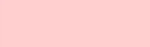|

7-digit hexadecimal color example:

```xml
<svg width="200" height="200" xmlns="http://www.w3.org/2000/svg">
        <rect x="10" y="10" width="180" height="80" fill="#BB88990" />
</svg>
```

| Before Enhancement                                               | After Enhancement                                               |
| :------------------------------------------------------------: | :------------------------------------------------------------: |
| Parsed as #ARGB.<br>Display effect of the rectangle with **fill="#BB88990"**<br> | Renders as default black.<br>Display effect of the rectangle with **fill="#BB88990"**<br> 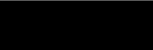|

4-digit hexadecimal color example:

```xml
<svg width="200" height="200" xmlns="http://www.w3.org/2000/svg">
        <rect x="10" y="10" width="180" height="80" fill="#0000" />
</svg>
```

| Before Enhancement                                               | After Enhancement                                               |
| :------------------------------------------------------------: | :------------------------------------------------------------: |
| Parsed as #ARGB.<br>Display effect of the rectangle with **fill="#8888"**<br> | Parsed as #RGBA.<br>Example: display effect of the rectangle with **fill="#0000"** (fully transparent)<br> |

### Strict IRI Type Validation

URL references for **filter**, **clip-path**, and **mask** now undergo strict type validation to prevent reference mismatches.

>**NOTE**
>
>The final display of SVG images is influenced by the **Image** component's **objectFit** value. All examples in this document use **'objectFit(ImageFit.Contain)'** to ensure complete and correct rendering. Configure **objectFit** appropriately based on actual display requirements.

| Before Enhancement                                            | After Enhancement                                    |
| :---------------------------------------------------------: | :-------------------------------------------------: |
| Mismatched URL types for **filter**, **clip-path**, and **mask** references caused incorrect display effects.| When URL types for **filter**, **clip-path**, and **mask** references do not match, the corresponding effects are not applied.<br> For example, the mask, clippath, filter, pattern, and gradient tags have their own IDs. If the filter, clip-path, and mask attributes are bound to the IDs of other types of tags, the corresponding effects do not take effect. The corresponding effect takes effect only when the mask attribute is bound to the mask tag ID, the clip-path attribute is bound to the clipPath tag ID, and the filter attribute is bound to the filter tag ID.|

For example, if the URL types do not match, the mask effect does not take effect.
```xml
<svg width="200" height="100" xmlns="http://www.w3.org/2000/svg">
  <!-- Define a mask. -->
  <defs>
    <clipPath id="myClipPath">
      <circle cx="50" cy="50" r="40"/>
    </clipPath>
    <mask id="myMask">
      <rect x="0" y="0" width="100" height="100" fill="red"/>
    </mask>
  </defs>

  <!-- Use the mask. -->
  <rect x="10" y="10" width="180" height="80" fill="blue" mask="url(#myClipPath)"/>
</svg>
```

### Updated colorFilter Effect Scope

The **Image** component's [colorFilter](./ts-basic-components-image.md#colorfilter9) attribute now applies to the entire SVG image source instead of only the stroke border.

>**NOTE**
>
>The final display of SVG images is influenced by the **Image** component's **objectFit** value. All examples in this document use **'objectFit(ImageFit.Contain)'** to ensure complete and correct rendering. Configure **objectFit** appropriately based on actual display requirements.

| Original Source                                               | Before Enhancement                                               | After Enhancement                                               |
| :------------------------------------------------------------: | :------------------------------------------------------------: | :------------------------------------------------------------: |
| | **colorFilter** only applies to the stroke border.<br> | **colorFilter** applies to the entire SVG image source.<br> 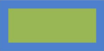|

The sample image and sample code are as follows:

```xml
<svg width="200" height="200" xmlns="http://www.w3.org/2000/svg">
    <!-- Rectangle -->
    <rect x="10" y="10" width="180" height="80" stroke="gray" stroke-width='16' fill="orange"/>
</svg>
```

```ts
@Entry
@Component

struct Index {
  @State select: boolean = true
  @State effect:ImageFit = ImageFit.Contain
  build() {
    Row() {
      Column() {
        Image($rawfile('image111.svg'))
          .width(220)
          .height(220)
          .colorFilter(
            [ 0.6, 0,   0,   0, 0,
              0.2, 0.8, 0,   0, 0,
              0.2, 0.2, 1.2, 0, 0,
              0,   0,   0,   1, 0 ]
          )
          .supportSvg2(true)
      }
      .width('100%')
    }
    .height('100%')
  }
}
```

### Updated fillColor Effect Scope

When the **fill** attribute of an element in the SVG image source is set to **none**, the [fillColor](./ts-basic-components-image.md#fillcolor20) attribute of the **Image** component will no longer apply color filling to that element.

>**NOTE**
>
>The final display of SVG images is influenced by the **Image** component's **objectFit** value. All examples in this document use **'objectFit(ImageFit.Contain)'** to ensure complete and correct rendering. Configure **objectFit** appropriately based on actual display requirements.

| Before Enhancement                                               | After Enhancement                                               |
| :------------------------------------------------------------: | :------------------------------------------------------------: |
| **fillColor** applied to the element with **fill="none"**<br> 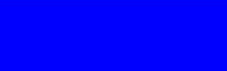 | **fillColor** not applied to the element with **fill="none"**<br>  |

The sample image and sample code are as follows:
```xml
<svg width="200" height="200" xmlns="http://www.w3.org/2000/svg">
  <!-- Rectangle -->
  <rect x="10" y="10" width="180" height="80" fill="none"/>
</svg>
```
```ts
@Entry
@Component

struct Index {
  @State select: boolean = true
  @State effect:ImageFit = ImageFit.Contain
  build() {
    Row() {
      Column() {
        Image($rawfile('image11.svg'))
          .width(220)
          .height(220)
          .fillColor('blue')
          .supportSvg2(true)
      }
      .width('100%')
    }
    .height('100%')
  }
}

```

## Extended Affine Transformation Capabilities

The [transform](./ts-universal-attributes-transformation.md#transform) attribute now supports the following: configurable global pivot points, local rotation centers, matrix transformation modes, invalid value verification, affine transformations in clipping paths, and combined transformation scenarios.

### Configurable Global Transformation Center

SVG supports the capability of parsing the [transform-origin](../arkui-js/js-components-common-animation.md) attribute to configure the global center point. The following table describes the effect before and after the enhancement.

>**NOTE**
>
>The final display of SVG images is influenced by the **Image** component's '[objectFit](./ts-basic-components-image.md#objectfit)' value. All examples in this document use **'objectFit(ImageFit.Contain)'** to ensure complete and correct rendering. Configure **objectFit** appropriately based on actual display requirements.

|                           SVG Scenario                           |                        Before Enhancement                        |                        After Enhancement                        |
| :----------------------------------------------------------: | :----------------------------------------------------------: | :----------------------------------------------------------: |
|        Basic SVG graphics with the transform functionality and **transform-origin** attribute       | The (0,0) coordinate in the upper left corner of the SVG viewport served as the transformation center.| The (x, y) coordinate offset specified by **transform-origin** is used as the transformation center.|
| **transform** attribute configured with the rotate functionality and **transform-origin**<br>Example: 'transform="rotate(30)" transform-origin="150 150"' (global center in the lower right corner)|  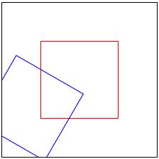  |  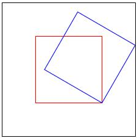   |
| **transform** attribute configured with the scale functionality and **transform-origin**<br>Example: 'transform="scale(0.77)" transform-origin="150 150"' (global center in the lower right corner)|  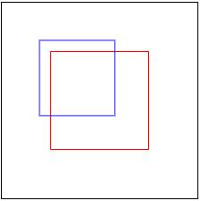   |   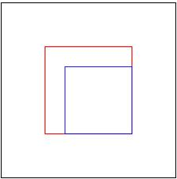   |
| **transform** attribute configured with **skewX** and **transform-origin**<br>Example: 'transform="skewX(30)" transform-origin="150 150"' (global center in the lower right corner)|  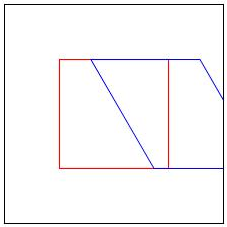   |   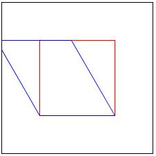   |
| **transform** attribute configured with **skewY** and **transform-origin**<br>Example: 'transform="skewY(30)" transform-origin="150 150"' (global center in the lower right corner)|  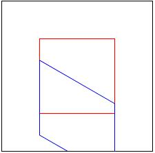   |   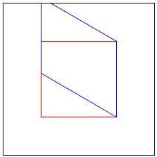   |
| **transform** attribute configured with the translate functionality and **transform-origin**<br>Example: 'transform="translate(30,30)" transform-origin="150 150"' (global center in the lower right corner)| 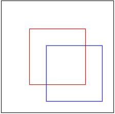 | 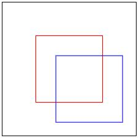 |
| **transform** attribute calling multiple functions in chain mode with the **transform-origin** attribute configured<br>Example: transform='"translate(10,10) rotate(10) scale(0.5) skewX(10)" transform-origin="150 150"' (global center in the lower right corner)|   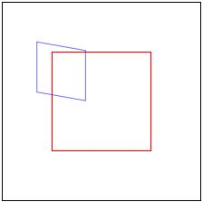   |   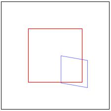    |

### Local Center Point for rotate

SVG now supports local center point specification in the **rotate** function, for example, **rotate(30, -10, -10)**, where **-10, -10** defines the local rotation center. The following table compares the rendering effects before and after configuring the local center point for **rotate**.

>**NOTE**
>
>The final display of SVG images is influenced by the **Image** component's **objectFit** value. All examples in this document use **'objectFit(ImageFit.Contain)'** to ensure complete and correct rendering. Configure **objectFit** appropriately based on actual display requirements.

| SVG Scenario                                                        | Before Enhancement                                               | After Enhancement                                               |
| :------------------------------------------------------------: | :------------------------------------------------------------: | :------------------------------------------------------------: |
| Basic SVG graphic with both local center point (**rotate**) and **transform-origin** configured<br>Example: 'transform="rotate(30, -10, -10)" transform-origin="150 150"'| Rotation uses only the coordinates (x, y) specified by the last two parameters of the **rotate** function as the transformation center.<br> 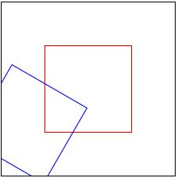 | Rotation uses the combined offset of the sum of the global **transform-origin** coordinates (x, y) and the local center point coordinates as the transformation center.<br> 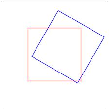 |

### Matrix Transformation Support

SVG supports the matrix transformations via the **transform** attribute using the matrix function. This enables complex linear transformations combining translation, rotation, scaling, and skewing operations. In the matrix(a, b, c, d, e, f) function, the parameters are as follows: **a** controls scaling in the X direction, **b** controls skewing in the X direction, **c** controls skewing in the Y direction, **d** controls scaling in the Y direction, **e** controls translation in the X direction, and **f** controls translation in the Y direction.

>**NOTE**
>
>The final display of SVG images is influenced by the **Image** component's **objectFit** value. All examples in this document use **'objectFit(ImageFit.Contain)'** to ensure complete and correct rendering. Configure **objectFit** appropriately based on actual display requirements.

| SVG Scenario                                                        | Before Enhancement                                               | After Enhancement                                               |
| :------------------------------------------------------------: | :------------------------------------------------------------: | :------------------------------------------------------------: |
| Matrix transformation with **transform-origin** configured<br>Example: 'transform="matrix(0.812,0.278,0.139,0.763,5.000,5.000" transform-origin="150 150"') (global center in the lower right corner)|  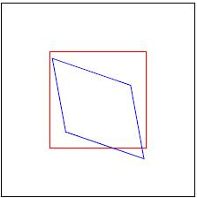  |  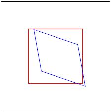   |

### Invalid Value Verification

SVG now properly handles invalid **transform** attribute values. The following table describes how invalid parameter values or incorrect parameter counts are handled.

>**NOTE**
>
>The final display of SVG images is influenced by the **Image** component's **objectFit** value. All examples in this document use **'objectFit(ImageFit.Contain)'** to ensure complete and correct rendering. Configure **objectFit** appropriately based on actual display requirements.

| SVG Scenario                                                        | Before Enhancement                                               | After Enhancement                                               |
| :------------------------------------------------------------: | :------------------------------------------------------------: | :------------------------------------------------------------: |
| Invalid transform value, for example, invalid parameter value in the **rotate** function, 'transform="rotate(30deg)"'| The first parameter value (30) is used as the rotation angle.<br> 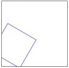 | No rotation is performed.<br>  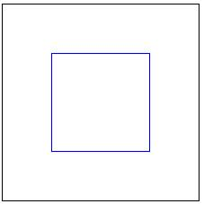 |
| Invalid local center point parameters, for example, invalid local center point parameter in the **rotate** function, 'transform="rotate(30,abc,abc)"'| The coordinate (0,0) in the upper left corner of the SVG viewport is used as the transformation center point, and the image is rotated by 30 degrees.<br>  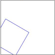 | No rotation is performed.<br>  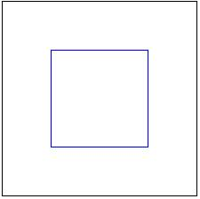 |
| Incorrect parameter count, for example, incorrect parameter count in the **scale** function, 'transform="scale(0.5, 0.5, 0.5)"'| The first two valid parameters (0.5,0.5) are used as the scale factor along the x-axis and y-axis.<br>  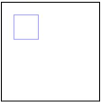 | No transformation is performed.<br>  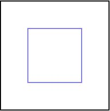 |
| Invalid parameter in chained functions, for example, 'transform="rotate(30) skewX(abc) scale (0.5, 0.5)"'| Only valid transformation functions **rotate** and **scale** are applied. The invalid transformation function **skewX** is not applied.<br>  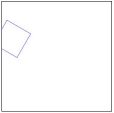 | No transformations are applied.<br>  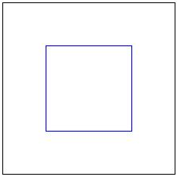 |

### Affine Transformations in Clipping Paths

Affine transformations are now supported within clipping paths with **clip-path**.

>**NOTE**
>
>The final display of SVG images is influenced by the **Image** component's **objectFit** value. All examples in this document use **'objectFit(ImageFit.Contain)'** to ensure complete and correct rendering. Configure **objectFit** appropriately based on actual display requirements.

```xml
<svg width="300" height="300" xmlns="http://www.w3.org/2000/svg">
  <!-- Define a clipPath with ID "circleClip" using objectBoundingBox units. -->
  <defs>
    <clipPath id="circleClip" clipPathUnits="objectBoundingBox">
      <!-- The circle is centered on the object, with a radius of 0.5, which clips the object into a circle that covers its entire area. -->
      <circle cx="50" cy="50" r="40" transform="translate(50 50)" />
    </clipPath>
  </defs>

  <!-- Apply clipPath to a rectangle. -->
  <rect x="10" y="10" width="250" height="250" fill="blue"
        clip-path="url(#circleClip)" />
</svg>
```

| Before Enhancement                                               | After Enhancement                                               |
| :------------------------------------------------------------: | :------------------------------------------------------------: |
| 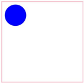 |  |

### Affine Transformations in Combined Scenarios

Affine transformations are now supported in complex scenarios involving multiple elements.

>**NOTE**
>
>The final display of SVG images is influenced by the **Image** component's **objectFit** value. All examples in this document use **'objectFit(ImageFit.Contain)'** to ensure complete and correct rendering. Configure **objectFit** appropriately based on actual display requirements.

The transform operation is applied within a **\<use>** element that references an object in the same **\<mask>** element.

```xml
<svg width="300" height="300" xmlns="http://www.w3.org/2000/svg" xmlns:xlink="http://www.w3.org/1999/xlink">
  <defs>
    <mask id="mask1"  width="1" height="1" maskContentUnits="objectBoundingBox">
      <use xlink:href="#rect1" transform="translate(0.6, 0.000000) scale(0.5 0.5)" />
      <rect id="rect1" x="0" y="0" width="0.5" height="0.5" fill="red"  />
    </mask>
  </defs>
  <rect x="0" y="0" width="300" height="100" fill="red"  mask="url(#mask1)" />
  <rect x="0" y="0" width="300" height="100" fill="none"  stroke="black" stroke-width="2" />
</svg> 
```

| Before Enhancement                                               | After Enhancement                                               |
| :------------------------------------------------------------: | :------------------------------------------------------------: |
|  | 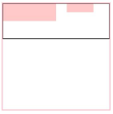 |

The transform operation is applied within a **\<g>** element without scaling.

```xml
<svg width="300" height="300" xmlns="http://www.w3.org/2000/svg" xmlns:xlink="http://www.w3.org/1999/xlink">
  <defs>
    <mask id="mask1"  width="1" height="1" maskContentUnits="objectBoundingBox">
        <g transform="translate(0.6, 0.000000)">
      <rect id="rect1" x="0" y="0" width="0.5" height="0.5"  fill="red"  />
      </g>
    </mask>
  </defs>
  <rect x="0" y="0" width="300" height="100" fill="red"  mask="url(#mask1)" />
  <rect x="0" y="0" width="300" height="100" fill="none"  stroke="black" stroke-width="2" />
</svg> 
```

| Before Enhancement                                               | After Enhancement                                               |
| :------------------------------------------------------------: | :------------------------------------------------------------: |
| 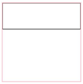 | 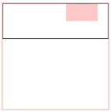 |

## Extended SVG Parsing Capabilities

[viewBox](./ts-image-svg2-capabilities.md#configurable-alignment-and-scaling-rules-for-viewbox) The attribute supports the customization of alignment and scaling rules. The cropping path unit, gradient unit, mask unit, and mask content unit can be parsed. Parsing of pattern units, pattern content units, filter units, and primitive units.

### Configurable Alignment and Scaling Rules for viewBox

The **viewBox** attribute controls SVG dynamic stretching, with the **preserveAspectRatio** parameter governing content alignment and scaling rules.

>**NOTE**
>
>The final display of SVG images is influenced by the **Image** component's **objectFit** value. All examples in this document use **'objectFit(ImageFit.Contain)'** to ensure complete and correct rendering. Configure **objectFit** appropriately based on actual display requirements.

Example with **preserveAspectRatio** set to **"none"**:

```xml
<svg width="200" height="100" viewBox="0 0 100 100" preserveAspectRatio="none" xmlns="http://www.w3.org/2000/svg">
  <circle cx="50" cy="20" r="20" fill="red"/>
  <line x1="0" y1="0" x2="0" y2="500" stroke="black" stroke-width="2" /> <!-- x-axis -->
  <line x1="0" y1="0" x2="500" y2="0" stroke="black" stroke-width="2" /> <!-- y-axis -->
</svg>
```

| Value| Before Enhancement                                               | After Enhancement                                               |
| ------ | ------------------------------------------------------------ | ------------------------------------------------------------ |
| none   | Uniform scaling based on the minimum aspect ratio<br>The midpoint **X** value of the SVG element's **viewBox** is aligned with the midpoint **X** value of the viewport.<br>The midpoint **Y** value of the SVG element's **viewBox** is aligned with the midpoint **Y** value of the viewport.<br> | Graphic content scaled to completely match view rectangle boundaries<br><br><br>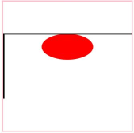 |

Example with **preserveAspectRatio** set to **&lt;align&gt; [&lt;meetOrSlice&gt;]**:

```xml
<svg width="200" height="100" viewBox="0 0 100 100" preserveAspectRatio="xMinYMin meet" xmlns="http://www.w3.org/2000/svg">
  <circle cx="50" cy="20" r="20" fill="red"/>
  <line x1="0" y1="0" x2="0" y2="500" stroke="black" stroke-width="2" /> <!-- x-axis -->
  <line x1="0" y1="0" x2="500" y2="0" stroke="black" stroke-width="2" /> <!-- y-axis -->
</svg>
```

| Value        | Before Enhancement                                               | After Enhancement                                               |
| -------------- | ------------------------------------------------------------ | ------------------------------------------------------------ |
| xMinYMin meet  | Uniform scaling based on the minimum aspect ratio<br>The midpoint **X** value of the SVG element's **viewBox** is aligned with the midpoint **X** value of the viewport.<br>The midpoint **Y** value of the SVG element's **viewBox** is aligned with the midpoint **Y** value of the viewport.<br> | Uniform scaling based on the minimum aspect ratio<br>The minimum **X** value of the SVG element's **viewBox** is aligned with the minimum **X** value of the viewport.<br>The minimum **Y** value of the SVG element's **viewBox** is aligned with the minimum **Y** value of the viewport.<br> |
| xMaxYMin meet  | Uniform scaling based on the minimum aspect ratio<br>The midpoint **X** value of the SVG element's **viewBox** is aligned with the midpoint **X** value of the viewport.<br>The midpoint **Y** value of the SVG element's **viewBox** is aligned with the midpoint **Y** value of the viewport.<br> | Uniform scaling based on the minimum aspect ratio<br>The minimum **X** value of the SVG element's **viewBox** plus the element width is aligned with the maximum **X** value of the viewport.<br>The minimum **Y** value of the SVG element's **viewBox** is aligned with the minimum **Y** value of the viewport.<br> |
| xMinYMid meet  | Uniform scaling based on the minimum aspect ratio<br>The midpoint **X** value of the SVG element's **viewBox** is aligned with the midpoint **X** value of the viewport.<br>The midpoint **Y** value of the SVG element's **viewBox** is aligned with the midpoint **Y** value of the viewport.<br>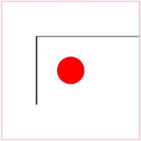 | Uniform scaling based on the minimum aspect ratio<br>The minimum **X** value of the SVG element's **viewBox** is aligned with the minimum **X** value of the viewport.<br>The midpoint **Y** value of the SVG element's **viewBox** is aligned with the midpoint **Y** value of the viewport.<br>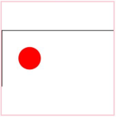 |
| xMaxYMid meet  | Uniform scaling based on the minimum aspect ratio<br>The midpoint **X** value of the SVG element's **viewBox** is aligned with the midpoint **X** value of the viewport.<br>The midpoint **Y** value of the SVG element's **viewBox** is aligned with the midpoint **Y** value of the viewport.<br> | Uniform scaling based on the minimum aspect ratio<br>The minimum **X** value of the SVG element's **viewBox** plus the element width is aligned with the maximum **X** value of the viewport.<br>The midpoint **Y** value of the SVG element's **viewBox** is aligned with the midpoint **Y** value of the viewport.<br> |
| xMinYMax meet  | Uniform scaling based on the minimum aspect ratio<br>The midpoint **X** value of the SVG element's **viewBox** is aligned with the midpoint **X** value of the viewport.<br>The midpoint **Y** value of the SVG element's **viewBox** is aligned with the midpoint **Y** value of the viewport.<br> | Uniform scaling based on the minimum aspect ratio<br>The minimum **X** value of the SVG element's **viewBox** is aligned with the minimum **X** value of the viewport.<br>The minimum **Y** value of the SVG element's **viewBox** plus the element height is aligned with the maximum **Y** value of the viewport.<br>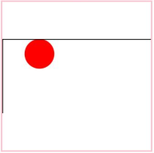 |
| xMaxYMax meet  | Uniform scaling based on the minimum aspect ratio<br>The midpoint **X** value of the SVG element's **viewBox** is aligned with the midpoint **X** value of the viewport.<br>The midpoint **Y** value of the SVG element's **viewBox** is aligned with the midpoint **Y** value of the viewport.<br> | Uniform scaling based on the minimum aspect ratio<br>The minimum **X** value of the SVG element's **viewBox** plus the element width is aligned with the maximum **X** value of the viewport.<br>The minimum **Y** value of the SVG element's **viewBox** plus the element height is aligned with the maximum **Y** value of the viewport.<br>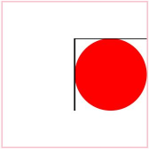 |
| xMinYMin slice | Uniform scaling based on the minimum aspect ratio<br>The midpoint **X** value of the SVG element's **viewBox** is aligned with the midpoint **X** value of the viewport.<br>The midpoint **Y** value of the SVG element's **viewBox** is aligned with the midpoint **Y** value of the viewport.<br> | Uniform scaling based on the maximum aspect ratio<br>The minimum **X** value of the SVG element's **viewBox** is aligned with the minimum **X** value of the viewport.<br>The minimum **Y** value of the SVG element's **viewBox** is aligned with the minimum **Y** value of the viewport.<br> |
| xMidYMin slice | Uniform scaling based on the minimum aspect ratio<br>The midpoint **X** value of the SVG element's **viewBox** is aligned with the midpoint **X** value of the viewport.<br>The midpoint **Y** value of the SVG element's **viewBox** is aligned with the midpoint **Y** value of the viewport.<br>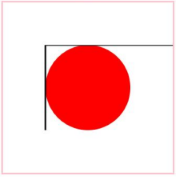 | Uniform scaling based on the maximum aspect ratio<br>The midpoint **X** value of the SVG element's **viewBox** is aligned with the midpoint **X** value of the viewport.<br>The minimum **Y** value of the SVG element's **viewBox** is aligned with the minimum **Y** value of the viewport.<br> |
| xMaxYMin slice | Uniform scaling based on the minimum aspect ratio<br>The midpoint **X** value of the SVG element's **viewBox** is aligned with the midpoint **X** value of the viewport.<br>The midpoint **Y** value of the SVG element's **viewBox** is aligned with the midpoint **Y** value of the viewport.<br> | Uniform scaling based on the maximum aspect ratio<br>The minimum **X** value of the SVG element's **viewBox** plus the element width is aligned with the maximum **X** value of the viewport.<br>The minimum **Y** value of the SVG element's **viewBox** is aligned with the minimum **Y** value of the viewport.<br>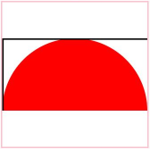 |
| xMinYMid slice | Uniform scaling based on the minimum aspect ratio<br>The midpoint **X** value of the SVG element's **viewBox** is aligned with the midpoint **X** value of the viewport.<br>The midpoint **Y** value of the SVG element's **viewBox** is aligned with the midpoint **Y** value of the viewport.<br> | Uniform scaling based on the maximum aspect ratio<br>The minimum **X** value of the SVG element's **viewBox** is aligned with the minimum **X** value of the viewport.<br>The midpoint **Y** value of the SVG element's **viewBox** is aligned with the midpoint **Y** value of the viewport.<br> |
| xMidYMid slice | Uniform scaling based on the minimum aspect ratio<br>The midpoint **X** value of the SVG element's **viewBox** is aligned with the midpoint **X** value of the viewport.<br>The midpoint **Y** value of the SVG element's **viewBox** is aligned with the midpoint **Y** value of the viewport.<br> | Uniform scaling based on the maximum aspect ratio<br>The midpoint **X** value of the SVG element's **viewBox** is aligned with the midpoint **X** value of the viewport.<br>The midpoint **Y** value of the SVG element's **viewBox** is aligned with the midpoint **Y** value of the viewport.<br>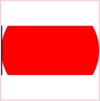 |
| xMaxYMid slice | Uniform scaling based on the minimum aspect ratio<br>The midpoint **X** value of the SVG element's **viewBox** is aligned with the midpoint **X** value of the viewport.<br>The midpoint **Y** value of the SVG element's **viewBox** is aligned with the midpoint **Y** value of the viewport.<br> | Uniform scaling based on the maximum aspect ratio<br>The minimum **X** value of the SVG element's **viewBox** plus the element width is aligned with the maximum **X** value of the viewport.<br>The midpoint **Y** value of the SVG element's **viewBox** is aligned with the midpoint **Y** value of the viewport.<br> |
| xMinYMax slice | Uniform scaling based on the minimum aspect ratio<br>The midpoint **X** value of the SVG element's **viewBox** is aligned with the midpoint **X** value of the viewport.<br>The midpoint **Y** value of the SVG element's **viewBox** is aligned with the midpoint **Y** value of the viewport.<br>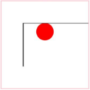 | Uniform scaling based on the maximum aspect ratio<br>The minimum **X** value of the SVG element's **viewBox** is aligned with the minimum **X** value of the viewport.<br>The minimum **Y** value of the SVG element's **viewBox** plus the element height is aligned with the maximum **Y** value of the viewport.<br>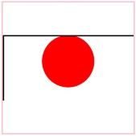 |
| xMidYMax slice | Uniform scaling based on the minimum aspect ratio<br>The midpoint **X** value of the SVG element's **viewBox** is aligned with the midpoint **X** value of the viewport.<br>The midpoint **Y** value of the SVG element's **viewBox** is aligned with the midpoint **Y** value of the viewport.<br> | Uniform scaling based on the maximum aspect ratio<br>The midpoint **X** value of the SVG element's **viewBox** is aligned with the midpoint **X** value of the viewport.<br>The minimum **Y** value of the SVG element's **viewBox** plus the element height is aligned with the maximum **Y** value of the viewport.<br>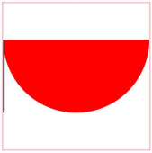 |
| xMaxYMax slice | Uniform scaling based on the minimum aspect ratio<br>The midpoint **X** value of the SVG element's **viewBox** is aligned with the midpoint **X** value of the viewport.<br>The midpoint **Y** value of the SVG element's **viewBox** is aligned with the midpoint **Y** value of the viewport.<br> | Uniform scaling based on the maximum aspect ratio<br>The minimum **X** value of the SVG element's **viewBox** plus the element width is aligned with the maximum **X** value of the viewport.<br>The minimum **Y** value of the SVG element's **viewBox** plus the element height is aligned with the maximum **Y** value of the viewport.<br> |

### Clipping Path Unit Parsing

Supported the parsing of the clip path unit value [clipPathUnits](./ts-image-svg2-capabilities.md#impact-of-enhanced-svg-tag-parsing-on-elements-and-attributes). Added the processing of the scenario where clipPathUnits is objectBoundingBox (the border of the applied element is used as the reference coordinate system).

>**NOTE**
>
>The final display of SVG images is influenced by the **Image** component's **objectFit** value. All examples in this document use **'objectFit(ImageFit.Contain)'** to ensure complete and correct rendering. Configure **objectFit** appropriately based on actual display requirements.

In the example below, when the clipping path unit is set to **objectBoundingBox**, the rectangular clipping path is positioned relative to the upper left corner of the element to which it is applied. The x and y coordinates are interpreted as fractions of the element's bounding box width and height, respectively. Similarly, the width and height values are multiplied by the bounding box width and height to determine the actual clipping size.

```xml
<svg width="200" height="200" xmlns="http://www.w3.org/2000/svg">
  <defs>
    <clipPath id="clip1" clipPathUnits="objectBoundingBox">
      <rect x="0.2" y="0.2" width="0.7" height="0.6" />
    </clipPath>
  </defs>
  <rect x="10" y="10" width="100" height="100" fill="blue" clip-path="url(#clip1)" />
</svg>
```

| Before Enhancement                                          | After Enhancement                                         |
| ------------------------------------------------------- | ------------------------------------------------------ |
| 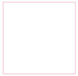 | 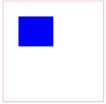 |

### Gradient Unit Parsing

The gradient unit value [gradientUnits](./ts-image-svg2-capabilities.md#impact-of-enhanced-svg-tag-parsing-on-elements-and-attributes) can be parsed. The processing in the scenario where gradientUnits is objectBoundingBox (the border of the applied element is used as the reference coordinate system) is added.

>**NOTE**
>
>The final display of SVG images is influenced by the **Image** component's **objectFit** value. All examples in this document use **'objectFit(ImageFit.Contain)'** to ensure complete and correct rendering. Configure **objectFit** appropriately based on actual display requirements.

This example illustrates a linear gradient defined with absolute coordinates from (10, 10) to (180, 180) within a rectangle.

```xml
 <svg width="200" height="200" xmlns="http://www.w3.org/2000/svg">
  <defs>
    <linearGradient id="grad1" x1="10" y1="10" x2="180" y2="180"  gradientUnits="userSpaceOnUse">
      <stop offset="0%" style="stop-color:rgb(255,0,0);stop-opacity:1" />
      <stop offset="100%" style="stop-color:rgb(0,0,255);stop-opacity:1" />
    </linearGradient>
  </defs>
  <rect x="10" y="10" width="180" height="180" fill="url(#grad1)" />
</svg>
```

| Before Enhancement                                               | After Enhancement                                              |
| ------------------------------------------------------------ | ----------------------------------------------------------- |
| 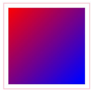 | 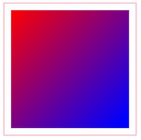 |

This example illustrates a radial gradient originating from the absolute coordinate center (100, 90) with a radius of 90.

```xml
<svg width="200" height="200" xmlns="http://www.w3.org/2000/svg">
  <defs>
     <radialGradient id="grad2" cx="100" cy="100" r="90" gradientUnits="userSpaceOnUse">
      <stop offset="0%" style="stop-color:rgb(255,0,0);stop-opacity:1" />
      <stop offset="100%" style="stop-color:rgb(0,0,255);stop-opacity:1" />
    </radialGradient>
  </defs>
  <circle cx="100" cy="100" r="90" fill="url(#grad2)" />
</svg>
```

| Before Enhancement                                               | After Enhancement                                               |
| ------------------------------------------------------------ | ------------------------------------------------------------ |
| 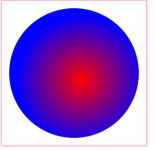 | 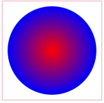 |

### Mask Unit and Mask Content Unit Parsing

The mask unit [maskUnits](./ts-image-svg2-capabilities.md#impact-of-enhanced-svg-tag-parsing-on-elements-and-attributes) and mask content unit [maskContentUnits](./ts-image-svg2-capabilities.md#impact-of-enhanced-svg-tag-parsing-on-elements-and-attributes) can be parsed, added the processing for the scenario where maskContentUnits and maskUnits are set to objectBoundingBox (the border of the applied element is used as the reference coordinate system).

>**NOTE**
>
>The final display of SVG images is influenced by the **Image** component's **objectFit** value. All examples in this document use **'objectFit(ImageFit.Contain)'** to ensure complete and correct rendering. Configure **objectFit** appropriately based on actual display requirements.

This example demonstrates a five-pointed star mask defined within absolute coordinates from (10, 10) to (200, 200). The mask content is positioned relative to the upper left corner of the target rectangle, with horizontal dimensions multiplied by the graphic's bounding box width and vertical dimensions multiplied by the bounding box height.

```xml
<svg width="220" height="220" xmlns="http://www.w3.org/2000/svg">
  <defs>
    <mask id="mask1" maskUnits="userSpaceOnUse" x="10" y="10" width="200" height="200" clip-rule="evenodd" maskContentUnits="objectBoundingBox">
        <path d="M 0.5,0.05 L 0.2,0.99 L 0.95,0.39 L 0.05,0.39 L 0.8,0.99 Z" fill="blue" fill-rule="nonzero"/>
    </mask>
  </defs>
  <rect x="10" y="10" width="200" height="200" fill="red" mask="url(#mask1)" />
</svg>
```

| Before Enhancement                                      | After Enhancement                                     |
| --------------------------------------------------- | -------------------------------------------------- |
| 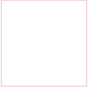 |  |

### Pattern Unit and Pattern Content Unit Parsing

Support parsing of the [patternUnits](./ts-image-svg2-capabilities.md#impact-of-enhanced-svg-tag-parsing-on-elements-and-attributes) and [patternContentUnits](./ts-image-svg2-capabilities.md#impact-of-enhanced-svg-tag-parsing-on-elements-and-attributes). Added handling for the scenario where patternUnits and patternContentUnits are set to objectBoundingBox (a coordinate system based on the bounding box of the applied element).

>**NOTE**
>
>The final display of SVG images is influenced by the **Image** component's **objectFit** value. All examples in this document use **'objectFit(ImageFit.Contain)'** to ensure complete and correct rendering. Configure **objectFit** appropriately based on actual display requirements.

In this example, the source pattern's position and size are defined in absolute coordinates, while the pattern content's position and size are relative to the pattern itself. The horizontal coordinates are multiplied by the bounding box width, and the vertical coordinates are multiplied by the bounding box height.

```xml
<svg width="220" height="220" xmlns="http://www.w3.org/2000/svg">
  <defs>
    <pattern id="pattern1" patternUnits="userSpaceOnUse" x="10" y="10" width="100" height="100" patternContentUnits="objectBoundingBox" >
      <rect x="0" y="0" width="0.25" height="0.25" fill="red" opacity="0.5" />
      <rect x="0.25" y="0.25" width="0.25" height="0.25" fill="blue" opacity="0.5" />
    </pattern>
  </defs>
  <rect x="10" y="10" width="200" height="200"  stroke="red" stroke-width="2" fill="url(#pattern1)"/>
</svg>
```

| Before Enhancement                                         | After Enhancement                                        |
| ------------------------------------------------------ | ----------------------------------------------------- |
|  |  |

### Filter Unit and Primitive Unit Parsing

Support parsing of the filter unit [filterUnits](./ts-image-svg2-capabilities.md#impact-of-enhanced-svg-tag-parsing-on-elements-and-attributes) and primitive unit [primitiveUnits](./ts-image-svg2-capabilities.md#impact-of-enhanced-svg-tag-parsing-on-elements-and-attributes). Added handling for the scenario where filterUnits and primitiveUnits are set to objectBoundingBox (a coordinate system based on the bounding box of the applied element). Currently, the following primitives are supported: **feFlood**, **feOffset**, **feGaussianBlur**, **feBlood**, **feColorMatrix**, and **feComposite**.

>**NOTE**
>
>The final display of SVG images is influenced by the **Image** component's **objectFit** value. All examples in this document use **'objectFit(ImageFit.Contain)'** to ensure complete and correct rendering. Configure **objectFit** appropriately based on actual display requirements.

Graph source example: When the primitive value is objectBoundingBox, the fuzzy standard deviation X of feGaussianBlur and the stdDeviation value of the Y axis need to be multiplied by the width and height of the bounding box of the applied filter. The x- and y- coordinates of filter primitive subregions are multiplied by the bounding box width and height relative to the upper left corner of the graphic, while the width and height parameters of filter primitive subregions are multiplied by the bounding box width and height respectively.

```xml
 <svg width="400" height="400" xmlns="http://www.w3.org/2000/svg"> 
 <defs>
   <filter id="blend" primitiveUnits="objectBoundingBox">
     <feGaussianBlur in="SourceGraphic" stdDeviation="0.1, 0.1" x="25%" y="25%" width="50%" height="50%" />
   </filter>
 </defs>
 
 <g fill="none" stroke="blue" stroke-width="4">
    <rect width="200" height="200" fill="none"/>
    <line x2="200" y2="200"  stroke="blue" stroke-width="4" />
    <line x1="200" y2="200"  stroke="blue" stroke-width="4"/>
 </g>
 <circle fill="green" filter="url(#blend)" cx="100" cy="100" r="90"/>
 </svg>
```

| Before Enhancement                                               | After Enhancement                                               |
| ------------------------------------------------------------ | ------------------------------------------------------------ |
|  |  |


## Enhanced Display Effects

The opacity attribute of the **\<g>** (group) element takes effect for all nested child elements in the group. In addition, the following features are enhanced: processing for the **clip-path** rule in **\<g>** tags, tiling effects and offset value processing for pattern elements, and translation and scaling effects for linear and radial gradients. The default behavior for abnormal mask and filter parameters is updated.

### Group Element Opacity

The **opacity** attribute applied to a **\<g>** (group) element now affects all nested child elements within the group hierarchy.

>**NOTE**
>
>The final display of SVG images is influenced by the **Image** component's **objectFit** value. All examples in this document use **'objectFit(ImageFit.Contain)'** to ensure complete and correct rendering. Configure **objectFit** appropriately based on actual display requirements.

The example source image contains two layers of nested group elements, with the semicircle created by the clipping path rendered at 40% opacity (0.4).

```xml
<svg  width="200" height="200" viewBox = "0 0 200 200" xmlns="http://www.w3.org/2000/svg">
  <defs>
    <clipPath id="myClip" clipPathUnits="userSpaceOnUse">
      <rect x="25" y="0" width="60" height="60" />
    </clipPath>
  </defs>
  <g opacity="0.4" clip-path="url(#myClip)"  fill="red"  > 
    <g >
    <circle cx="25" cy="25" r="25"  />
    </g>
  </g>
</svg>
```

| Before Enhancement                                             | After Enhancement                                            |
| ---------------------------------------------------------- | --------------------------------------------------------- |
|  |  |

### Clipping Path Rule Processing in Group Elements

The processing of **clip-path** clipping rules within **\<g>** elements has been enhanced.

>**NOTE**
>
>The final display of SVG images is influenced by the **Image** component's **objectFit** value. All examples in this document use **'objectFit(ImageFit.Contain)'** to ensure complete and correct rendering. Configure **objectFit** appropriately based on actual display requirements.

The source cropping path of the example image is referenced in the g label. The default cropping path rule is "nonzero," and the filling rule in the path label is "evenodd." The actual filling rule in the left image is "evenodd," and the filling rule in the right image is the default rule of the cropping path, that is, nonzero.

```xml
<svg width="200" height="200" xmlns="http://www.w3.org/2000/svg">
  <!-- Define the clipping path of the five-pointed star.- -->
  <defs>
    <clipPath id="heartClipPath" >
   <path d="M 100,10 L 40,198 L 190,78 L 10,78 L 160,198 Z" fill-rule="evenodd" /> 
    </clipPath>
  </defs>

  <!-- Apply the clipping path to the rectangle. -->
  <g opacity="0.4" clip-path="url(#heartClipPath)" >
  <rect x="0" y="0" width="200" height="200" fill="red"  />
  </g>
</svg>
```

| Before Enhancement                                               | After Enhancement                                               |
| ------------------------------------------------------------ | ------------------------------------------------------------ |
|  |  |

### Pattern Tiling Enhancement

[pattern](./ts-image-svg2-capabilities.md#impact-of-enhanced-svg-tag-parsing-on-elements-and-attributes) Patterns can be tiled repeatedly.

>**NOTE**
>
>The final display of SVG images is influenced by the **Image** component's **objectFit** value. All examples in this document use **'objectFit(ImageFit.Contain)'** to ensure complete and correct rendering. Configure **objectFit** appropriately based on actual display requirements.

Example:

```xml
  <svg width="210" height="210" xmlns="http://www.w3.org/2000/svg">
  <defs>
    <pattern id="pattern1"  x="0" y="0" width="0.5" height="0.5"  >
      <rect x="0" y="0" width="50" height="50" fill="red" />
      <rect x="50" y="50" width="50" height="50" fill="blue" />
    </pattern>
  </defs>
  <rect x="10" y="10" width="200" height="200" fill="url(#pattern1)" />
</svg>
```

| Before Enhancement                                               | After Enhancement                                               |
| ------------------------------------------------------------ | ------------------------------------------------------------ |
| No tiling<br>  | Proper tiling<br>  |

### Pattern Offset Handling

When pattern **x** and **y** parameters are non-zero, the entire pattern is now displayed instead of only the translated portion.

>**NOTE**
>
>The final display of SVG images is influenced by the **Image** component's **objectFit** value. All examples in this document use **'objectFit(ImageFit.Contain)'** to ensure complete and correct rendering. Configure **objectFit** appropriately based on actual display requirements.

```xml
<svg width="40" height="40" viewBox="0 0 40 40" fill="none" xmlns="http://www.w3.org/2000/svg" xmlns:xlink="http://www.w3.org/1999/xlink">
  <rect width="40" height="40" fill="url(#pattern0_0_37)"/>
  <defs>
    <pattern id="pattern0_0_37" patternContentUnits="objectBoundingBox" x="0.5" width="1" height="1">
      <use xlink:href="#image0_0_37" transform="scale(0.00833333)"/>
    </pattern>
    <image id="image0_0_37" width="120" height="120" xlink:href="data:image/png;base64,iVBORw0KGgoAAAANSUhEUgAAAHgAAAB4CAYAAAA5ZDbSAAAACXBIWXMAACE4AAAhOAFFljFgAAABZWlDQ1BEaXNwbGF5IFAzAAB4nHWQvUvDUBTFT6tS0DqIDh0cMolD1NIKdnFoKxRFMFQFq1OafgltfCQpUnETVyn4H1jBWXCwiFRwcXAQRAcR3Zw6KbhoeN6XVNoi3sfl/Ticc7lcwBtQGSv2AijplpFMxKS11Lrke4OHnlOqZrKooiwK/v276/PR9d5PiFlNu3YQ2U9cl84ul3aeAlN//V3Vn8maGv3f1EGNGRbgkYmVbYsJ3iUeMWgp4qrgvMvHgtMunzuelWSc+JZY0gpqhrhJLKc79HwHl4plrbWD2N6f1VeXxRzqUcxhEyYYilBRgQQF4X/8044/ji1yV2BQLo8CLMpESRETssTz0KFhEjJxCEHqkLhz634PrfvJbW3vFZhtcM4v2tpCAzidoZPV29p4BBgaAG7qTDVUR+qh9uZywPsJMJgChu8os2HmwiF3e38M6Hvh/GMM8B0CdpXzryPO7RqFn4Er/QfBIQM2AAAHoklEQVR4Ae2dT2wUVRjAv5kFW5RkV1uFxNhuYmIbTbrQgx7AlR7kYihcPGhsXALcbMQEgocm0AQPhoMkcqvETXowkQu2t3oobOGgB2B7oiZqiyER0pLdBKRN2B3fN8uQZXb+bLfzZt/7+v0S2jLbbZv9zfvee99731sDAkjN5lKPE5CzADIGQBos8a9GGph2sGh/NOzPt4STIlTgyupQftHvCYbXxc7ZXNpKwI9C6D5glMcyIG9WYNxLtOm+0DGX+7Jqwk2Wqw+GJaKscNZRyB13P/ac4M653GmownnRrFPA6EZKNMrvXkCHdTwL0dhyUS4w+mPAV2vZ/Pnal1DrczEsc8slQ8mowm7sk+0QXU3AaZZLipQ9SBYY9ojZhL+BIce2KrxsQoJHy1TBHIZpWbALGJKIbjdjio8ZYEgiMpBpsy79yFDDQsEMaVBwGhiqcAumDgsmDgsmDgsmDgsmDgsmDgsmDgsmDgsmDgsmDgsmDgsmDgsmDgsmzhYgRG9nN2S2vwE9Hd2Q2vKifW1pbRmWVpehUFqAzYj2glHkF69/CCM79tqCg5j89xpM3r+2qWQbHVexeFBPxnoPCrn7n7XWZimUbsOxPy7aLZs6WgrGlnrp7VEY2N4DG+Hs0mXx7xegjHYhGuXODJwKDcfNMNZ7yP7sJxl/D0aH4sM7MP3gBkwt3wTdSGw5vOsMaEKUch2yqX77c6Hc2C8vra7AiZ6PxMCtBz5+9T27ny8/+Q/mH/0DuqDVNGnirSORynXAlpxN9jdcL5Rv2/21A/7uib6j8LPoHmT8HTLQRjC2Hqe1yWCi74jnda/wPdw9GHkkkYU2gnHELBOUNbJjT8N1bMUlEZa9vh8HeqqjheBm5rhR/R4vpldueF7HUbzsG2+jaCF4uGs3xAF2ARmPqReOov1oZR4eJ1oIfl9i3+smm+xruDZX9s98OZk0VVFeML6AcbaQgZcaW7BXH1yPX2hXAeUFD4jFgzhJbm28mcJSmjg+UDVM83Khi1SiNVGqTplYcEQkuQUz7YAFE4cFE4cFE4cFE0d5weUnj4FpHeUFh2WRomb+UWPeuZk5bjnmv7NZlBeMWaQ4JXtlrXo7uwKfg39f0IJEO9GiD56r21Uhm6LHdhyv/HQ9uGasKloIvhrTC1jbIN/4uz5IBq9mTS/fAFXRQvD0Sjy7GQs+kSJse26hrO5Gei0E+7WsqJm8f73hGm4ACBpkYbWEyhvotZkHT967DjLxu4m89mnVc/aO2hvntRGM+6JkjqaxysGLA12Dvs9RvfUi2ghGud9IKjNBSV4RIpvq8w3P+BzVWy+iVary+7szMC9hvunXesd6Dnlex5tt//y3WhSvaZeLPrpwMdJQbZeUerRebLl+G+0xkuhSmaidYEwlnvzzJ4gClHTyL++fhWUyXuANgZFEF7RcTZq8d23DZZ8oF8OsVzQIKpOZeqBuUsMLbZcLsd/cyNwYW6533rlb+WqF9aD1evCFFkMlLgxM+aQXL4VUDg6/4j9tUhGtBRdbrNP1G4njokLY7siRnXthVOFKBjdaC251s7nX5nYEB3B9v5+EYwvB53ece/NTabXKUaO14JHX9kArYLF30M2Bg7gw0diSF949Z9cJY0JEVbQ6wqEeDKcT/UehFTrNrbBjazJ0lQpb9IW7v9pHOeCig9dNUasr3mvfNLUzuVZAJbQ7Zcep5ouibNOZKjWbtECROMIOCs12ClOM8GUvjjSLNoKjFOtmvQek6SRaecEyxbrBefXZO5ebFo3JkLGeg4Fnh7RbtLKC4xTrhpJo5QS3U6yb9UpBwbhBIKggPG7RyghWSayb9Upx0p1hoqPIqYfRdsH4YmBm6DPxYqh8mAmyXtHDXYMiKfJJ6J4uPBhVFm0T3MxdrirrEd3M8YsyD0WNXTCeuTEqwrCOYt00KzpMMi5Z9ovMmYw9Z7EJxnQeboHJxngkUlw0IxozbzOZU77d0LGFH6QMvKTnop27d2bga5JyEeeQUsxN+22zraU9ZwJ/hgykCsa79rfBcbJi3Tii/bb7YF477mpJaYLtwzrfGVV+ZCwDXGnC0bMblHsh5v1c0gSH5WqpgwPJjEdVol92rPhITvmpFMHOEtpmZ2Rnc8cTY2p0WtLbBUh5z4ZscnP0uWFg2csJjy2+OOJ2ui58e4ApieWnUgSHVcRvFvy6KBxsxQWfskMcFkwcKYLjnuupigqvgxTB8w/1eV8hmahwdocUwTgVoP6WcWGoUj8sdbEBR5EHunZvumzW0tqK3XpVCNFav/soEw6PoonDgonDgonDgonDgonDgonDgonDgonDgonDgonDgonDgonDgonDgomDgheBocoit2DimGBwCyaLcGsaFiwBQxMLiqZlwC1gSGJU4Za5VoE8MFS5YsJQviRi9RVgSGEYkF8dytdG0UYFDlsAJWBIYLuswDh+bQtG04lq7QKjP6LvHUen+PWzefDjofx5gyVrjyUcrgmXzv8N9zdsm80dr5hwWjyQAkYbMCwbLrmI4fXNnbO5dNWEM+LBz4FRHgMHyWIc5YTl5x4LeiKKFp/2WSbsEj8kY1mQfvpQGph2sIgfjFr2cdGqQHEbQL6EMyEf/ge9rhOytvtnwQAAAABJRU5ErkJggg=="/>
  </defs>
</svg>
```

| Before Enhancement                                           | After Enhancement                                          |
| :--------------------------------------------------------: | :-------------------------------------------------------: |
|  |  |

### Linear Gradient

[linearGradient](./ts-image-svg2-capabilities.md#impact-of-enhanced-svg-tag-parsing-on-elements-and-attributes) Linear gradient supports translation and scaling.

>**NOTE**
>
>The final display of SVG images is influenced by the **Image** component's **objectFit** value. All examples in this document use **'objectFit(ImageFit.Contain)'** to ensure complete and correct rendering. Configure **objectFit** appropriately based on actual display requirements.

```xml
<svg xmlns="http://www.w3.org/2000/svg" version="1.1">
    <defs>
        <linearGradient id="grad1" x1="50%" y1="0%" x2="0%" y2="50%">
            <stop offset="0%" style="stop-color:rgb(255,255,0);stop-opacity:1" />
            <stop offset="100%" style="stop-color:rgb(255,0,0);stop-opacity:1" />
        </linearGradient>
    </defs>
    <rect x="115" y="15" width="170" height="110" fill="url(#grad1)" />
    <line x1="200" y1="15" x2="115" y2="70" stroke="black" />
</svg>
```

| Before Enhancement                                               | After Enhancement                                               |
| ------------------------------------------------------------ | ------------------------------------------------------------ |
|  |  |

### Radial Gradient

[RadialGradient](./ts-image-svg2-capabilities.md#impact-of-enhanced-svg-tag-parsing-on-elements-and-attributes) Radial gradient supports translation and scaling.

>**NOTE**
>
>The final display of SVG images is influenced by the **Image** component's **objectFit** value. All examples in this document use **'objectFit(ImageFit.Contain)'** to ensure complete and correct rendering. Configure **objectFit** appropriately based on actual display requirements.

```xml
<svg xmlns="http://www.w3.org/2000/svg" version="1.1">
    <defs>
        <radialGradient id="grad1" cx = "50%" cy="50%" r= "50%" fx="40%" fy="40%"  >
            <stop offset="0%" style="stop-color:rgb(255,255,255);
      stop-opacity:0" />
            <stop offset="100%" style="stop-color:rgb(0,0,255);stop-opacity:1" />
        </radialGradient>
    </defs>
    <rect x="10" y="10" width="100" height="80" fill="url(#grad1)" />
</svg>
```

| Before Enhancement                                               | After Enhancement                                               |
| ------------------------------------------------------------ | ------------------------------------------------------------ |
|  |  |

### Default Mask Behavior for Invalid Parameters

[mask](./ts-image-svg2-capabilities.md#impact-of-enhanced-svg-tag-parsing-on-elements-and-attributes) The x, y, width, and height parameters of the mask can be numbers, percentages, and decimals. When the parameter is assigned an error type: The value is changed from 0 to the default value {-10%, -10%, 120%, 120%}.

>**NOTE**
>
>The final display of SVG images is influenced by the **Image** component's **objectFit** value. All examples in this document use **'objectFit(ImageFit.Contain)'** to ensure complete and correct rendering. Configure **objectFit** appropriately based on actual display requirements.

```xml
<svg width="200" height="200" xmlns="http://www.w3.org/2000/svg">
  <defs>
    <mask id="mask1" x="0%" y="0%" width="100" height="100" maskUnits="userSpaceOnUse" maskContentUnits="userSpaceOnUse">
      <circle cx="50" cy="50" r="50" fill="red" />
    </mask>
  </defs>
  <rect x="0" y="0" width="200" height="200" fill="blue" mask="url(#mask1)"/>
</svg>

```

| Before Enhancement                                            | After Enhancement                                           |
| :---------------------------------------------------------: | :--------------------------------------------------------: |
|  |  |

### Default Filter Behavior for Invalid Parameters

[filter](./ts-image-svg2-capabilities.md#impact-of-enhanced-svg-tag-parsing-on-elements-and-attributes) The x, y, width, and height parameters of the filter can be numbers, percentages, and decimals. When an error type is assigned to a parameter: The value is changed from 0 to the default value {-10%, -10%, 120%, 120%}.

>**NOTE**
>
>The final display of SVG images is influenced by the **Image** component's **objectFit** value. All examples in this document use **'objectFit(ImageFit.Contain)'** to ensure complete and correct rendering. Configure **objectFit** appropriately based on actual display requirements.

```xml
<svg viewBox="0 0 300 300" xmlns="http://www.w3.org/2000/svg" width="300" height="300">
  <defs>
    <filter id="blurMe" x="0%" y="0%" width="100%" height="100%">
      <feColorMatrix in="SourceGraphic" type = "hueRotate" values="180"/>
    </filter>
  </defs>
  <circle cx="60" cy="60" r="50" fill="blue" filter="url(#blurMe)"/>
</svg>
```

| Before Enhancement                                              | After Enhancement                                             |
| :-----------------------------------------------------------: | :----------------------------------------------------------: |
|  |  |
