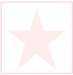
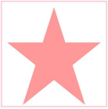
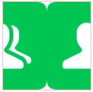

# SVG Parsing Capability
<!--Kit: ArkUI-->
<!--Subsystem: ArkUI-->
<!--Owner: @liyujie43-->
<!--Designer: @weixin_52725220-->
<!--Tester: @xiong0104-->
<!--Adviser: @HelloCrease-->

From API version 21, when the [supportSvg2](./ts-basic-components-image.md#supportsvg221) attribute of the Image component is set to true, the new parsing capability is enabled, which involves the following aspects:

- Improved usability: The default parsing format of the SVG image source color is changed from #ARGB to #RGBA, which complies with the SVG standard. The referenced URL type is strictly verified. The [colorFilter](./ts-basic-components-image.md#colorfilter9) attribute of the Image component takes effect for the entire SVG image source. The [fillColor](./ts-basic-components-image.md#fillcolor20) attribute of the Image component does not fill the color for elements with fill = 'none' in the SVG image source.

- Extended affine transformation capability: The global center point can be configured. The local center point of rotate is supported. The matrix transformation mode is supported. Invalid values can be verified. Affine transformation is supported in the clipping path. Affine transformation is supported in the combination scenario.

- Extended parsing capability: The viewBox attribute supports the configuration of alignment and scaling rules. The parsing of the clipping path unit, gradient unit, mask unit, mask content unit, pattern unit, pattern content unit, filter unit, and primitive unit is supported.

- Extended display effect: The opacity attribute of the g element in a group takes effect for multiple layers of subelements in the group. The processing of the clip-path clipping path rule in the g tag is added. The tiling effect and offset value processing are added for the pattern. The translation and scaling effects are added for the linear gradient and radial gradient. The default effect changes when the mask and filter parameters are abnormal.

## Improved SVG usability

The color parsing format is changed, the IRI type is strictly verified, and the effective scope of the [colorFilter](./ts-basic-components-image.md#colorfilter9) and [fillColor](./ts-basic-components-image.md#fillcolor20) attributes of the Image component is adjusted.

### Changing the Color Parsing Format

When the SVG source of the Image component uses a hexadecimal color, the default color parsing format is changed from #ARGB to #RGBA that complies with the SVG standard. The involved SVG attributes include fill, stroke, stopColor, and stop-color.

>**NOTE**
>
>The final display effect of the SVG image is affected by the value of objectFit of the Image component. To ensure that the SVG image is completely and correctly displayed, 'objectFit(ImageFit.Contain)' is configured for all example images in this document. You need to correctly configure objectFit based on the actual display effect.

When the SVG source attribute is set to a color in 8-digit hexadecimal format, the following figure shows the source and effect.

```xml
<svg width="200" height="200" xmlns="http://www.w3.org/2000/svg">
        <rect x="10" y="10" width="180" height="80" fill="#ff000030" />
</svg>
```

| Before                                               | After                                               |
| :------------------------------------------------------------: | :------------------------------------------------------------: |
| The system parses and displays the 8-digit hexadecimal color in #ARGB format.<br>For example, the display effect of the rectangle with fill="#ff000030" is as follows:<br> !Before (figures/8hex_color_before.PNG)| The system parses and displays the 8-digit hexadecimal color in #RGBA format.<br>For example, the display effect of the rectangle with fill="#ff000030" is as follows:<br>|

When the SVG source attribute is set to a color in 7-digit hexadecimal format, the following figure shows the source and effect.

```xml
<svg width="200" height="200" xmlns="http://www.w3.org/2000/svg">
        <rect x="10" y="10" width="180" height="80" fill="#BB88990" />
</svg>
```

| Before                                               | After                                               |
| :------------------------------------------------------------: | :------------------------------------------------------------: |
| The system parses and displays the 7-digit hexadecimal color as the #ARGB format.<br>For example, the display effect of the rectangle with fill="#BB88990" is as follows.<br> | The system parses and displays the 7-digit hexadecimal color as the default black color.<br>For example, the display effect of the rectangle with fill="#BB88990" is as follows.<br> |

When the SVG image source attribute is set to a 4-digit hexadecimal color, the example image source and effect are as follows.

```xml
<svg width="200" height="200" xmlns="http://www.w3.org/2000/svg">
        <rect x="10" y="10" width="180" height="80" fill="#8888" />
</svg>
```

| Before                                               | After                                               |
| :------------------------------------------------------------: | :------------------------------------------------------------: |
| The system parses and displays the 4-digit hexadecimal color as the #ARGB format.<br>For example, the display effect of the rectangle with fill="#8888" is as follows.<br> | The system parses and displays the 4-digit hexadecimal color as the #RGBA format.<br>For example, the display effect of the rectangle with fill="#8888" (fully transparent) is as follows.<br> |

### Strict Verification of the IRI Type

The URL type referenced by the filter, clip-path, and mask is strictly verified to avoid reference type mismatch.

>**NOTE**
>
>The final display effect of the SVG image is affected by the value of objectFit of the Image component. To ensure that the SVG image is completely and correctly displayed, 'objectFit(ImageFit.Contain)' is configured for all example images in this document. You need to correctly configure objectFit based on the actual display effect.

| Before                                            | After                                    |
| :---------------------------------------------------------: | :-------------------------------------------------: |
| The URL type referenced by the filter, clip-path, and mask does not match, resulting in incorrect display effect.| When the URL type referenced by the filter, clip-path, and mask does not match, the corresponding effect is not displayed.<br> For example, the mask, clippath, filter, pattern, and gradient tags have their own IDs. When the filter, clip-path, and mask attributes are bound to the IDs of other types of tags, the corresponding effect does not take effect. The effect takes effect only when the mask attribute is bound to the mask tag ID, the clip-path attribute is bound to the clipPath tag ID, and the filter attribute is bound to the filter tag ID.|

The following figure shows the source image. If the URL type does not match, the effect does not take effect.
```xml
<svg width="200" height="100" xmlns="http://www.w3.org/2000/svg">
  <!-- Define a mask. -->
  <defs>
    <clipPath id="myClipPath">
      <circle cx="50" cy="50" r="40"/>
    </clipPath>
    <mask id="myMask">
      <rect x="0" y="0" width="100" height="100" fill="red"/>
    </mask>
  </defs>

  <!-- Use the mask. -->
  <rect x="10" y="10" width="180" height="80" fill="blue" mask="url(#myClipPath)"/>
</svg>
```

### Adjusting the Effect Scope of colorFilter

The [colorFilter](./ts-basic-components-image.md#colorfilter9) attribute of the Image component takes effect on the entire SVG image source instead of only the stroke border.

>**NOTE**
>
>The final display effect of the SVG image is affected by the value of objectFit of the Image component. To ensure that the SVG image is completely and correctly displayed, 'objectFit(ImageFit.Contain)' is configured for all example images in this document. You need to correctly configure objectFit based on the actual display effect.

| Original image source                                               | Before                                               | After                                               |
| :------------------------------------------------------------: | :------------------------------------------------------------: | :------------------------------------------------------------: |
| | The colorFilter attribute of the Image component takes effect only on the stroke border of the image source.<br> | The colorFilter attribute of the Image component takes effect on the entire SVG image source.<br> |

The following figure shows the source image and demo.

```xml
<svg width="200" height="200" xmlns="http://www.w3.org/2000/svg">
    <!--Rectangle-->
    <rect x="10" y="10" width="180" height="80" stroke="gray" stroke-width='16' fill="orange"/>
</svg>
```

```ts
@Entry
@Component

struct Index {
  @State select: boolean = true
  @State effect:ImageFit = ImageFit.Contain
  build() {
    Row() {
      Column() {
        Image($rawfile('image111.svg'))
          .width(220)
          .height(220)
          .colorFilter(
            [ 0.6, 0, 0, 0, 0,
              0.2, 0.8, 0, 0, 0,
              0.2, 0.2, 1.2, 0, 0,
              0,   0,   0,   1, 0 ]
          )
          .supportSvg2(true)
      }
      .width('100%')
    }
    .height('100%')
  }
}
```

### Adjusting the Effective Range of fillColor

When the fill attribute of an element in the SVG image source is none, the [fillColor](./ts-basic-components-image.md#fillcolor20) attribute of the Image component changes from a fill color to no fill color.

>**NOTE**
>
>The final display effect of the SVG image is affected by the value of objectFit of the Image component. To ensure that the SVG image is completely and correctly displayed, 'objectFit(ImageFit.Contain)' is configured for all example images in this document. You need to correctly configure objectFit based on the actual display effect.

| Before                                               | After                                               |
| :------------------------------------------------------------: | :------------------------------------------------------------: |
| The fillColor attribute of the Image component still fills the color for elements whose fill is none in the SVG image source.<br> !Before(figures/fill_none_before.PNG)| The fillColor attribute of the Image component does not fill the color for elements whose fill is none in the SVG image source.<br> !After(figures/fill_none_after.PNG)|

The following figure shows the example image source and demo.
```xml
<svg width="200" height="200" xmlns="http://www.w3.org/2000/svg">
  <!--Rectangle-->
  <rect x="10" y="10" width="180" height="80" stroke="blue" stroke-width='2' fill="none"/>
</svg>
```
```ts
@Entry
@Component

struct Index {
  @State select: boolean = true
  @State effect:ImageFit = ImageFit.Contain
  build() {
    Row() {
      Column() {
        Image($rawfile('image11.svg'))
          .width(220)
          .height(220)
          .fillColor('blue')
          .supportSvg2(true)
      }
      .width('100%')
    }
    .height('100%')
  }
}

```

## Extended Affine Transformation Capabilities

The transform attribute supports the configuration of the global center point for transformation, the local center point for rotation, and the matrix transformation mode. It also supports invalid value verification and affine transformation in the clipping path. In addition, affine transformation is supported in the combination scenario.

### Configuring the Global Center Point for Transformation

SVG supports the transform-origin attribute to configure the global center point. The following table describes the effect before and after the extension.

>**NOTE**
>
>The final display effect of an SVG image is affected by the value of objectFit of the Image component. To ensure that the SVG image is completely and correctly displayed, 'objectFit(ImageFit.Contain)' is configured for all example images in this document. You need to correctly configure objectFit based on the actual display effect.

|                           SVG scenario                           |                        Before Extension                        |                        After Extension                        |
| :----------------------------------------------------------: | :----------------------------------------------------------: | :----------------------------------------------------------: |
|        Configure the transform function and the transform-origin attribute for basic SVG graphics.       | The (0,0) coordinate point in the upper left corner of the SVG viewport is used as the center point for affine transformation.| The coordinate offset (x, y) specified by the transform-origin attribute is used as the center point for affine transformation.|
| Set the rotate function for the transform attribute and configure the transform-origin attribute.<br>The global center point is the lower right corner of the graphic element, for example, 'transform="rotate(30)" transform-origin="150 150"'.|    |     |
| The transform attribute is used to set the scale function, and the transform-origin attribute is configured.<br>The global center point is the lower right corner of the graphic element, for example, 'transform="scale(0.77)" transform-origin="150 150"'.|     |      |
| The transform attribute is used to set the skewX function, and the transform-origin attribute is configured.<br>The global center point is the lower right corner of the graphic element, for example, 'transform="skewX(30)" transform-origin="150 150"'.|     |      |
| The transform attribute is used to set the skewY function, and the transform-origin attribute is configured.<br>The global center point is the lower right corner of the graphic element, for example, 'transform="skewY(30)" transform-origin="150 150"'.|     |      |
| The transform attribute is used to set the translate function, and the transform-origin attribute is configured.<br>The global center point is the lower right corner of the graphic element, for example, 'transform="translate(30,30)" transform-origin="150 150"'.|  |  |
| The transform attribute is used to call multiple functions in chain mode, and the transform-origin attribute is configured.<br>The global center point is the lower right corner of the graphic element, for example, transform='"translate(10,10) rotate(10) scale(0.5) skewX(10)" transform-origin="150 150"'.|      |       |

### Partial Center Point Configuration for rotate

SVG supports the partial center point configuration for rotate. For example, in rotate(30, -10, -10), 30 indicates the rotation angle, and the last two parameters -10 and -10 indicate the coordinates of the partial center point. The following table describes the effect comparison before and after the partial center point configuration for rotate.

>**NOTE**
>
>The final display effect of the SVG image is affected by the value of objectFit of the Image component. To ensure that the SVG image is completely and correctly displayed, 'objectFit(ImageFit.Contain)' is configured for all example images in this document. You need to correctly configure objectFit based on the actual display effect.

| SVG                                                        | Before Extension                                               | After Extension                                               |
| :------------------------------------------------------------: | :------------------------------------------------------------: | :------------------------------------------------------------: |
| Two attributes are configured for the basic SVG graphic:<br>Partial center point and transform-origin, for example, transform="rotate(30, -10, -10)" transform-origin="150 150".| Rotates the graphic based on the coordinates (x, y) specified by the last two parameters of the rotate function as the transformation center point.<br>  | Rotates the graphic based on the sum of the coordinate offset (x, y) specified by the transform-origin attribute of the global center point and the coordinate offset of the partial center point as the transformation center point.<br>  |

### Matrix (matrix) Conversion

SVG supports the matrix conversion capability of the transform attribute. matrix allows complex linear transformations on elements, including translation, rotation, scaling, and skewing, for example, matrix(a, b, c, d, e, f). The functions of each field are as follows: a: controls the scaling of the element in the x direction. b: controls the skewing of the element in the x direction. c: controls the skewing of the element in the y direction. d: controls the scaling of the element in the y direction. e: controls the translation of the element in the x direction. f: controls the translation of the element in the y direction.

>**NOTE**
>
>The final display effect of an SVG image is affected by the value of objectFit of the Image component. To ensure that the SVG image is completely and correctly displayed, 'objectFit(ImageFit.Contain)' is configured for all example images in this document. You need to correctly configure objectFit based on the actual display effect.

| SVG                                                        | Before                                               | After                                               |
| :------------------------------------------------------------: | :------------------------------------------------------------: | :------------------------------------------------------------: |
| Set the transform attribute to matrix and set the transform-origin attribute.<br>The global center point is the lower right corner of the graphic element, for example, transform="matrix(0.812,0.278,0.139,0.763,5.000,5.000" transform-origin="150 150").|    |     |

### Invalid Value Verification

SVG supports the verification of invalid values of the transform attribute. If the value of the transform attribute is invalid or the number of parameters is invalid, the parameters are processed according to the following table.

>**NOTE**
>
>The final display effect of an SVG image is affected by the value of objectFit of the Image component. To ensure that the SVG image is completely and correctly displayed, 'objectFit(ImageFit.Contain)' is configured for all example images in this document. You need to correctly configure objectFit based on the actual display effect.

| SVG                                                        | Before                                               | After                                               |
| :------------------------------------------------------------: | :------------------------------------------------------------: | :------------------------------------------------------------: |
| If the value of the transform attribute is invalid, for example, the angle parameter of the rotate function is invalid: 'transform="rotate(30deg)"'.| The value (30) parsed from the first parameter is used as the rotation angle.<br>  | No rotation is performed.<br>   |
| If the value of the transform attribute is invalid, for example, the local center point parameter of the rotate function is invalid: 'transform="rotate(30,abc,abc)"'.| The coordinate (0,0) in the upper left corner of the SVG viewport is used as the transformation center point, and the image is rotated by 30 degrees.<br>   | No rotation is performed.<br>   |
| If the number of parameters of the transformation function is invalid, for example, the number of parameters of the scale function is invalid: 'transform="scale(0.5, 0.5, 0.5)"',| the first two valid parameters are used as the scaling ratios of the x-axis and y-axis (0.5,0.5).<br>   | No transformation is performed.<br>   |
| When multiple transformation functions are called in chain mode, if the parameter of a function is invalid, for example, 'transform="rotate(30) skewX(abc) scale(0.5, 0.5)"',| the invalid transformation function skewX is not processed, and the valid transformation functions rotate and scale are processed.<br>   | None of the transformation functions is processed.<br>   |

### Affine Transformation in the Clip Path

The transform affine transformation operation in the clip-path is supported.

>**NOTE**
>
>The final display effect of the SVG image is affected by the value of the objectFit parameter of the Image component. To ensure that the SVG image is completely and correctly displayed, 'objectFit(ImageFit.Contain)' is configured for all example images in this document. You need to correctly configure the objectFit parameter based on the actual display effect.

```xml
<svg width="300" height="300" xmlns="http://www.w3.org/2000/svg">
  <!--Define a clipPath whose ID is circleClip and use the objectBoundingBox unit.-->
  <defs>
    <clipPath id="circleClip" clipPathUnits="objectBoundingBox">
      <!--The center of the circle is in the center of the object, and the radius is 0.5, that is, the circle covers the entire object.-->
      <circle cx="50" cy="50" r="40" transform="translate(50 50)" />
    </clipPath>
  </defs>

  <!--Apply clipPath to a rectangle.-->
  <rect x="10" y="10" width="250" height="250" fill="blue"
        clip-path="url(#circleClip)" />
</svg>
```

| Before extension                                               | After extension                                               |
| :------------------------------------------------------------: | :------------------------------------------------------------: |
|  |  |

### Affine Transformation in Combination Scenarios

Affine transformation is supported in combination scenarios of multiple elements.

>**NOTE**
>
>The final display effect of an SVG image is affected by the value of objectFit of the Image component. To ensure that the SVG image is completely and correctly displayed, 'objectFit(ImageFit.Contain)' is configured for the example images in this document. You need to correctly configure objectFit based on the actual display effect.

The transform operation is in use, and the use object is also in the same mask element.

```xml
<svg width="300" height="300" xmlns="http://www.w3.org/2000/svg" xmlns:xlink="http://www.w3.org/1999/xlink">
  <defs>
    <mask id="mask1"  width="1" height="1" maskContentUnits="objectBoundingBox">
	  <use xlink:href="#rect1" transform="translate(0.6, 0.000000) scale(0.5 0.5)" />
      <rect id="rect1" x="0" y="0" width="0.5" height="0.5" fill="red"  />
    </mask>
  </defs>
  <rect x="0" y="0" width="300" height="100" fill="red"  mask="url(#mask1)" />
  <rect x="0" y="0" width="300" height="100" fill="none"  stroke="black" stroke-width="2" />
</svg> 
```

| Before                                               | After                                               |
| :------------------------------------------------------------: | :------------------------------------------------------------: |
|  |  |

The transform operation is in the g tag and does not contain the scale operation.

```xml
<svg width="300" height="300" xmlns="http://www.w3.org/2000/svg" xmlns:xlink="http://www.w3.org/1999/xlink">
  <defs>
    <mask id="mask1"  width="1" height="1" maskContentUnits="objectBoundingBox">
    	<g transform="translate(0.6, 0.000000)">
      <rect id="rect1" x="0" y="0" width="0.5" height="0.5"  fill="red"  />
      </g>
    </mask>
  </defs>
  <rect x="0" y="0" width="300" height="100" fill="red"  mask="url(#mask1)" />
  <rect x="0" y="0" width="300" height="100" fill="none"  stroke="black" stroke-width="2" />
</svg> 
```

| Before                                               | After                                               |
| :------------------------------------------------------------: | :------------------------------------------------------------: |
|  |  |

## SVG parsing capability extension

The viewBox attribute supports configurable alignment and scaling rules. The following units can be parsed: clip-path, linearGradient, radialGradient, mask, pattern, filter, and primitive.

### The viewBox attribute supports configurable alignment and scaling rules.

The viewBox attribute is used to control the dynamic stretching effect of SVG. The preserveAspectRatio parameter can be used to control the alignment and scaling rules of the content area.

>**NOTE**
>
>The final display effect of the SVG image is affected by the value of objectFit of the Image component. To ensure that the SVG image is completely and correctly displayed, 'objectFit(ImageFit.Contain)' is configured for all example images in this document. You need to correctly configure objectFit based on the actual display effect.

If the SVG image contains the preserveAspectRatio attribute and the value is none, the example image source and behavior changes are as follows:

```xml
<svg width="200" height="100" viewBox="0 0 100 100" preserveAspectRatio="none" xmlns="http://www.w3.org/2000/svg">
  <circle cx="50" cy="20" r="20" fill="red"/>
  <line x1="0" y1="0" x2="0" y2="500" stroke="black" stroke-width="2" /> <!-- x-axis -->
  <line x1="0" y1="0" x2="500" y2="0" stroke="black" stroke-width="2" /> <!-- y-axis -->
</svg>
```

| Value| Before Extension                                               | After Extension                                               |
| ------ | ------------------------------------------------------------ | ------------------------------------------------------------ |
| none   | The SVG image is uniformly scaled based on the minimum value of the aspect ratio.<br>The midpoint value of X in the viewBox attribute of the SVG element is aligned with the midpoint value of X in the view.<br>The midpoint value of Y in the viewBox attribute of the SVG element is aligned with the midpoint value of Y in the view.<br> | The graphic content of the element is scaled so that the boundary of the element completely matches the view rectangle.<br><br><br> |

If the SVG file contains the preserveAspectRatio attribute and the value is \<align> [\<meetOrSlice>], the source image, alignment mode, and zoom ratio are changed as follows:

```xml
<svg width="200" height="100" viewBox="0 0 100 100" preserveAspectRatio="xMinYMin meet" xmlns="http://www.w3.org/2000/svg">
  <circle cx="50" cy="20" r="20" fill="red"/>
  <line x1="0" y1="0" x2="0" y2="500" stroke="black" stroke-width="2" /> <!-- x axis
  <line x1="0" y1="0" x2="500" y2="0" stroke="black" stroke-width="2" /> <!-- y axis
</svg>
```

| Value        | Before Extension                                               | After Extension                                               |
| -------------- | ------------------------------------------------------------ | ------------------------------------------------------------ |
| xMinYMin meet  | Zoom in or out based on the minimum aspect ratio.<br>Align the midpoint of the X value of the viewBox attribute of the SVG element with the midpoint of the X value of the view.<br>Align the midpoint of the Y value of the viewBox attribute of the SVG element with the midpoint of the Y value of the view.<br> | Zoom in or out based on the minimum aspect ratio.<br>Align the minimum value of the X value of the viewBox attribute of the SVG element with the minimum value of the X value of the view.<br>Align the minimum value of the Y value of the viewBox attribute of the SVG element with the minimum value of the Y value of the view.<br> |
| xMaxYMin meet  | Zoom in or out based on the minimum aspect ratio.<br>Align the midpoint of the X value of the viewBox attribute of the SVG element with the midpoint of the X value of the view.<br>Align the midpoint of the Y value of the viewBox attribute of the SVG element with the midpoint of the Y value of the view.<br> | Zoom in or out based on the minimum aspect ratio.<br>Align the minimum value of the X value of the viewBox attribute of the SVG element plus the element width with the maximum value of the X value of the view.<br>Align the minimum value of the Y value of the viewBox attribute of the SVG element with the minimum value of the Y value of the view.<br> |
| xMinYMid meet  | Scales the SVG element proportionally with the minimum width or height.<br>Aligns the midpoint of the X value of the viewBox attribute of the SVG element with the midpoint of the X value of the view.<br>Aligns the midpoint of the Y value of the viewBox attribute of the SVG element with the midpoint of the Y value of the view.<br> | Scales the SVG element proportionally with the minimum width or height.<br>Aligns the minimum X value of the viewBox attribute of the SVG element with the minimum X value of the view.<br>Aligns the midpoint of the Y value of the viewBox attribute of the SVG element with the midpoint of the Y value of the view.<br> |
| xMaxYMid meet  | Scales the SVG element proportionally with the minimum width or height.<br>Aligns the midpoint of the X value of the viewBox attribute of the SVG element with the midpoint of the X value of the view.<br>Aligns the midpoint of the Y value of the viewBox attribute of the SVG element with the midpoint of the Y value of the view.<br> | Scales the SVG element proportionally with the minimum width or height.<br>Aligns the minimum X value plus the width of the viewBox attribute of the SVG element with the maximum X value of the view.<br>Aligns the midpoint of the Y value of the viewBox attribute of the SVG element with the midpoint of the Y value of the view.<br> |
| xMinYMax meet  | Scales the SVG element proportionally with the minimum width or height.<br>Aligns the midpoint of the X value of the viewBox attribute of the SVG element with the midpoint of the X value of the view.<br>Aligns the midpoint of the Y value of the viewBox attribute of the SVG element with the midpoint of the Y value of the view.<br> | Scales the SVG element proportionally with the minimum width or height.<br>Aligns the minimum X value of the viewBox attribute of the SVG element with the minimum X value of the view.<br>Aligns the minimum Y value plus the height of the viewBox attribute of the SVG element with the maximum Y value of the view.<br> |
| xMaxYMax meet  | Scales the SVG element proportionally with the minimum width or height.<br>Aligns the midpoint of the X value of the viewBox attribute of the SVG element with the midpoint of the X value of the view.<br>Aligns the midpoint of the Y value of the viewBox attribute of the SVG element with the midpoint of the Y value of the view.<br> | Scales the SVG element uniformly by the minimum aspect ratio.<br>Aligns the minimum X value of the viewBox attribute of the SVG element with the maximum X value of the view, and<br>aligns the minimum Y value of the viewBox attribute of the SVG element with the maximum Y value of the view.<br> |
| xMinYMin slice | Scales the SVG element uniformly by the minimum aspect ratio.<br>Aligns the middle X value of the viewBox attribute of the SVG element with the middle X value of the view, and<br>aligns the middle Y value of the viewBox attribute of the SVG element with the middle Y value of the view.<br> | Scales the SVG element uniformly by the maximum aspect ratio.<br>Aligns the minimum X value of the viewBox attribute of the SVG element with the minimum X value of the view, and<br>aligns the minimum Y value of the viewBox attribute of the SVG element with the minimum Y value of the view.<br> |
| xMidYMin slice | Scales the SVG element uniformly by the minimum aspect ratio.<br>Aligns the middle X value of the viewBox attribute of the SVG element with the middle X value of the view, and<br>aligns the middle Y value of the viewBox attribute of the SVG element with the middle Y value of the view.<br> | Scales the SVG element uniformly by the maximum aspect ratio.<br>Aligns the middle X value of the viewBox attribute of the SVG element with the middle X value of the view, and<br>aligns the minimum Y value of the viewBox attribute of the SVG element with the minimum Y value of the view.<br> |
| xMaxYMin slice | Scales the SVG element uniformly by the minimum aspect ratio.<br>Aligns the middle X value of the viewBox attribute of the SVG element with the middle X value of the view, and<br>aligns the middle Y value of the viewBox attribute of the SVG element with the middle Y value of the view.<br> | Scales the SVG element uniformly by the maximum aspect ratio.<br>Aligns the minimum X value of the viewBox attribute of the SVG element with the maximum X value of the view, and<br>aligns the minimum Y value of the viewBox attribute of the SVG element with the minimum Y value of the view.<br> |
| xMinYMid slice | Scales the SVG element uniformly by the minimum aspect ratio.<br>The midpoint value of X in the viewBox attribute of the SVG element is aligned with the midpoint value of X in the view.<br>The midpoint value of Y in the viewBox attribute of the SVG element is aligned with the midpoint value of Y in the view.<br> | Scale up or down according to the maximum aspect ratio.<br>The minimum value of X in the viewBox attribute of the SVG element is aligned with the minimum value of X in the view.<br>The midpoint value of Y in the viewBox attribute of the SVG element is aligned with the midpoint value of Y in the view.<br> |
| xMidYMid slice | Scale up or down according to the minimum aspect ratio.<br>The midpoint value of X in the viewBox attribute of the SVG element is aligned with the midpoint value of X in the view.<br>The midpoint value of Y in the viewBox attribute of the SVG element is aligned with the midpoint value of Y in the view.<br> | Scale up or down according to the maximum aspect ratio.<br>The midpoint value of X in the viewBox attribute of the SVG element is aligned with the midpoint value of X in the view.<br>The midpoint value of Y in the viewBox attribute of the SVG element is aligned with the midpoint value of Y in the view.<br> |
| xMaxYMid slice | Scale up or down according to the minimum aspect ratio.<br>The midpoint value of X in the viewBox attribute of the SVG element is aligned with the midpoint value of X in the view.<br>The midpoint value of Y in the viewBox attribute of the SVG element is aligned with the midpoint value of Y in the view.<br> | Scale up or down according to the maximum aspect ratio.<br>The minimum value of X in the viewBox attribute of the SVG element plus the element width is aligned with the maximum value of X in the view.<br>The midpoint value of Y in the viewBox attribute of the SVG element is aligned with the midpoint value of Y in the view.<br> |
| xMinYMax slice | Scale up or down according to the minimum aspect ratio.<br>The midpoint value of X in the viewBox attribute of the SVG element is aligned with the midpoint value of X in the view.<br>The midpoint value of Y in the viewBox attribute of the SVG element is aligned with the midpoint value of Y in the view.<br> | Scale up or down according to the maximum aspect ratio.<br>The minimum value of X in the viewBox attribute of the SVG element is aligned with the minimum value of X in the view.<br>Aligns the minimum value of Y in the viewBox attribute of the SVG element with the maximum value of Y in the view.<br> |
| xMidYMax slice | Resizes the SVG element based on the minimum aspect ratio.<br>Aligns the midpoint value of X in the viewBox attribute of the SVG element with the midpoint value of X in the view.<br>Aligns the midpoint value of Y in the viewBox attribute of the SVG element with the midpoint value of Y in the view.<br> | Resizes the SVG element based on the maximum aspect ratio.<br>Aligns the midpoint value of X in the viewBox attribute of the SVG element with the midpoint value of X in the view.<br>Aligns the minimum value of Y in the viewBox attribute of the SVG element with the maximum value of Y in the view.<br> |
| xMaxYMax slice | Resizes the SVG element based on the minimum aspect ratio.<br>Aligns the midpoint value of X in the viewBox attribute of the SVG element with the midpoint value of X in the view.<br>Aligns the midpoint value of Y in the viewBox attribute of the SVG element with the midpoint value of Y in the view.<br> | Resizes the SVG element based on the maximum aspect ratio.<br>Aligns the minimum value of X in the viewBox attribute of the SVG element with the maximum value of X in the view.<br>Aligns the minimum value of Y in the viewBox attribute of the SVG element with the maximum value of Y in the view.<br> |

### Parsing of the clipPathUnits Unit

The clipPathUnits unit value of the clip path unit can be parsed. The scenario where clipPathUnits is set to objectBoundingBox (coordinate system based on the border of the applied element) is added.

>**NOTE**
>
>The final display effect of the SVG image is affected by the objectFit parameter of the Image component. To ensure that the SVG image is completely and correctly displayed, 'objectFit(ImageFit.Contain)' is configured for all example images in this document. You need to correctly set the objectFit parameter based on the actual display effect.

In the following figure, when the clip path unit is objectBoundingBox, the rectangular clip path is located at the upper left corner of the rectangle applied to the clip path. The x and y coordinates are multiplied by the width and height of the bounding box. The width is multiplied by the width of the bounding box, and the height is multiplied by the height of the bounding box.

```xml
<svg width="200" height="200" xmlns="http://www.w3.org/2000/svg">
  <defs>
    <clipPath id="clip1" clipPathUnits="objectBoundingBox">
      <rect x="0.2" y="0.2" width="0.7" height="0.6" />
    </clipPath>
  </defs>
  <rect x="10" y="10" width="100" height="100" fill="blue" clip-path="url(#clip1)" />
</svg>
```

| Before                                          | After                                         |
| ------------------------------------------------------- | ------------------------------------------------------ |
|  |  |

### Parsing of gradientUnits

Parsing of gradientUnits is supported. Processing of gradientUnits objectBoundingBox (coordinate system based on the bounding box of the applied element) is added.

>**NOTE**
>
>The final display effect of an SVG image is affected by the value of objectFit of the Image component. To ensure that the SVG image is completely and correctly displayed, 'objectFit(ImageFit.Contain)' is configured for all the example images in this document. You need to correctly configure objectFit based on the actual display effect.

The figure shows a linear gradient from the absolute coordinates (10, 10) to (180, 180) in a rectangle.

```xml
 <svg width="200" height="200" xmlns="http://www.w3.org/2000/svg">
  <defs>
    <linearGradient id="grad1" x1="10" y1="10" x2="180" y2="180"  gradientUnits="userSpaceOnUse">
      <stop offset="0%" style="stop-color:rgb(255,0,0);stop-opacity:1" />
      <stop offset="100%" style="stop-color:rgb(0,0,255);stop-opacity:1" />
    </linearGradient>
  </defs>
  <rect x="10" y="10" width="180" height="180" fill="url(#grad1)" />
</svg>
```

| Before                                               | After                                              |
| ------------------------------------------------------------ | ----------------------------------------------------------- |
|  |  |

The figure shows a radial gradient starting from the absolute coordinate center (100, 90) with a radius of 90.

```xml
<svg width="200" height="200" xmlns="http://www.w3.org/2000/svg">
  <defs>
     <radialGradient id="grad2" cx="100" cy="100" r="90" gradientUnits="userSpaceOnUse">
      <stop offset="0%" style="stop-color:rgb(255,0,0);stop-opacity:1" />
      <stop offset="100%" style="stop-color:rgb(0,0,255);stop-opacity:1" />
    </radialGradient>
  </defs>
  <circle cx="100" cy="100" r="90" fill="url(#grad2)" />
</svg>
```

| Before                                               | After                                               |
| ------------------------------------------------------------ | ------------------------------------------------------------ |
|  |  |

### Parsing of maskUnits and maskContentUnits

maskUnits and maskContentUnits can be parsed. maskContentUnits and maskUnits are processed as objectBoundingBox (coordinate system based on the border of the applied element).

>**NOTE**
>
>The final display effect of an SVG image is affected by the value of objectFit of the Image component. To ensure that the SVG image is completely and correctly displayed, 'objectFit(ImageFit.Contain)' is configured for all example images in this document. You need to correctly configure objectFit based on the actual display effect.

The figure shows that the mask range of a five-pointed star is from the absolute coordinates (10, 10) to (200, 200). The mask content is relative to the upper left corner of the application rectangle. The horizontal size is multiplied by the width of the graphic bounding box, and the vertical size is multiplied by the height of the graphic bounding box.

```xml
<svg width="220" height="220" xmlns="http://www.w3.org/2000/svg">
  <defs>
    <mask id="mask1" maskUnits="userSpaceOnUse" x="10" y="10" width="200" height="200" clip-rule="evenodd" maskContentUnits="objectBoundingBox">
		<path d="M 0.5,0.05 L 0.2,0.99 L 0.95,0.39 L 0.05,0.39 L 0.8,0.99 Z" fill="blue" fill-rule="nonzero"/>
    </mask>
  </defs>
  <rect x="10" y="10" width="200" height="200" fill="red" mask="url(#mask1)" />
</svg>
```

| Before extension                                      | After extension                                     |
| --------------------------------------------------- | -------------------------------------------------- |
|  |  |

### Parsing of pattern units and pattern content units

Pattern units patternUnits and pattern content units patternContentUnits can be parsed. The processing of patternUnits and patternContentUnits is added as objectBoundingBox (coordinate system based on the border of the applied element).

>**NOTE**
>
>The final display effect of an SVG image is affected by the value of objectFit of the Image component. To ensure that the SVG image is completely and correctly displayed, 'objectFit(ImageFit.Contain)' is configured for all example images in this document. You need to correctly configure objectFit based on the actual display effect.

The unit position and size of the source pattern in the example image are in absolute coordinates. The pattern content position and size are relative to the pattern. The horizontal axis is multiplied by the width of the bounding box, and the vertical axis is multiplied by the height of the bounding box.

```xml
<svg width="220" height="220" xmlns="http://www.w3.org/2000/svg">
  <defs>
    <pattern id="pattern1" patternUnits="userSpaceOnUse" x="10" y="10" width="100" height="100" patternContentUnits="objectBoundingBox" >
      <rect x="0" y="0" width="0.25" height="0.25" fill="red" opacity="0.5" />
      <rect x="0.25" y="0.25" width="0.25" height="0.25" fill="blue" opacity="0.5" />
    </pattern>
  </defs>
  <rect x="10" y="10" width="200" height="200"  stroke="red" stroke-width="2" fill="url(#pattern1)"/>
</svg>
```

| Before extension                                         | After extension                                        |
| ------------------------------------------------------ | ----------------------------------------------------- |
|  |  |

### Filter Unit and Primitive Unit Parsing

filterUnits and primitiveUnits of filter units and primitive units can be parsed. filterUnits and primitiveUnits are processed as objectBoundingBox (coordinate system based on the border of the applied element). Currently, the following primitives are supported: feFlood, feOffset, feGaussianBlur, feBlood, feColorMatrix, and feComposite.

>**NOTE**
>
>The final display effect of the SVG image is affected by the objectFit parameter of the Image component. To ensure that the SVG image is completely and correctly displayed, objectFit (ImageFit.Contain) is configured for all test case images in this document, you need to correctly set the objectFit parameter based on the actual display effect.

Graph source example: When the primitive value is objectBoundingBox, the fuzzy standard deviation X of feGaussianBlur and the stdDeviation value of the Y axis need to be multiplied.
Width and height of the bounding box of the filter. The x and y coordinates of the filter primitive subregion are multiplied by the width and height of the bounding box relative to the upper left corner of the graph, and the width and height parameters of the filter primitive subregion are multiplied by the width and height of the bounding box.

```xml
 <svg width="400" height="400" xmlns="http://www.w3.org/2000/svg"> 
 <defs>
   <filter id="blend" primitiveUnits="objectBoundingBox">
     <feGaussianBlur in="SourceGraphic" stdDeviation="0.1, 0.1" x="25%" y="25%" width="50%" height="50%" />
   </filter>
 </defs>
 
 <g fill="none" stroke="blue" stroke-width="4">
    <rect width="200" height="200" fill="none"/>
    <line x2="200" y2="200"  stroke="blue" stroke-width="4" />
    <line x1="200" y2="200"  stroke="blue" stroke-width="4"/>
 </g>
 <circle fill="green" filter="url(#blend)" cx="100" cy="100" r="90"/>
 </svg>
```

| Before expansion                                               | After expansion                                               |
| ------------------------------------------------------------ | ------------------------------------------------------------ |
|  |  |


## Extended Display Effects

The opacity attribute of the g element takes effect on multiple layers of subelements in the group. The clip-path attribute is added to process the clipping path rule in the g element. The pattern attribute is added to process the tiling effect and offset value. The linear gradient and radial gradient attributes are added to process the translation and scaling effects. The default effect is changed when the mask and filter parameters are abnormal.

### Opacity in the Group Tag

The opacity attribute of the g element takes effect on multiple layers of subelements in the group.

>**NOTE**
>
>The final display effect of the SVG image is affected by the value of objectFit of the Image component. To ensure that the SVG image is completely and correctly displayed, 'objectFit(ImageFit.Contain)' is configured for all example images in this document. You need to correctly configure objectFit based on the actual display effect.

The source image in the example contains two layers of nested group tags, and the transparency of the semicircle cut by the clipping path is 0.4.

```xml
<svg  width="200" height="200" viewBox = "0 0 200 200" xmlns="http://www.w3.org/2000/svg">
  <defs>
    <clipPath id="myClip" clipPathUnits="userSpaceOnUse">
      <rect x="25" y="0" width="60" height="60" />
    </clipPath>
  </defs>
  <g opacity="0.4" clip-path="url(#myClip)"  fill="red"  > 
    <g >
    <circle cx="25" cy="25" r="25"  />
    </g>
  </g>
</svg>
```

| Before extension                                             | After extension                                            |
| ---------------------------------------------------------- | --------------------------------------------------------- |
|  |  |

### Reference to the Clipping Path Rule in the Group Tag

The clip-path attribute is added to process the clipping path rule in the g element.

>**NOTE**
>
>The final display effect of an SVG image is affected by the value of objectFit of the Image component. To ensure that the SVG image is completely and correctly displayed, 'objectFit(ImageFit.Contain)' is configured for all example images in this document. You need to correctly set objectFit based on the actual display effect.

The source image is cropped according to the path in the g tag. The default cropping path rule is nonezero, and the filling rule in the path tag is evenodd.
The filling rule of the left image is evenodd, and that of the right image is nonezero, which is the default cropping path rule.

```xml
<svg width="200" height="200" xmlns="http://www.w3.org/2000/svg">
  <!--Define the cropping path of the five-pointed star.-->
  <defs>
    <clipPath id="heartClipPath" >
   <path d="M 100,10 L 40,198 L 190,78 L 10,78 L 160,198 Z" fill-rule="evenodd" /> 
    </clipPath>
  </defs>

  <!--Apply the cropping path to the rectangle.-->
  <g opacity="0.4" clip-path="url(#heartClipPath)" >
  <rect x="0" y="0" width="200" height="200" fill="red"  />
  </g>
</svg>
```

| Before extension                                               | After extension                                               |
| ------------------------------------------------------------ | ------------------------------------------------------------ |
|  |  |

### Pattern

The pattern supports the repeated tiling effect.

>**NOTE**
>
>The final display effect of an SVG image is affected by the value of objectFit of the Image component. To ensure that the SVG image is completely and correctly displayed, 'objectFit(ImageFit.Contain)' is configured for all example images in this document. You need to correctly set objectFit based on the actual display effect.

The following figure shows the source image.

```xml
  <svg width="210" height="210" xmlns="http://www.w3.org/2000/svg">
  <defs>
    <pattern id="pattern1"  x="0" y="0" width="0.5" height="0.5"  >
      <rect x="0" y="0" width="50" height="50" fill="red" />
      <rect x="50" y="50" width="50" height="50" fill="blue" />
    </pattern>
  </defs>
  <rect x="10" y="10" width="200" height="200" fill="url(#pattern1)" />
</svg>
```

| Before                                               | After                                               |
| ------------------------------------------------------------ | ------------------------------------------------------------ |
| The pattern cannot be tiled repeatedly.<br> !Before (figures/pattern_tile_before.PNG)| The pattern can be tiled repeatedly.<br> |

### Pattern offset

When the x and y parameters of the pattern are not set to 0, the entire pattern is displayed, instead of only the part that is translated.

>**NOTE**
>
>The final display effect of the SVG image is affected by the value of objectFit of the Image component. To ensure that the SVG image is completely and correctly displayed, 'objectFit(ImageFit.Contain)' is configured for the example images in this document. You need to correctly set objectFit based on the actual display effect.

```xml
<svg width="40" height="40" viewBox="0 0 40 40" fill="none" xmlns="http://www.w3.org/2000/svg" xmlns:xlink="http://www.w3.org/1999/xlink">
  <rect width="40" height="40" fill="url(#pattern0_0_37)"/>
  <defs>
    <pattern id="pattern0_0_37" patternContentUnits="objectBoundingBox" x="0.5" width="1" height="1">
      <use xlink:href="#image0_0_37" transform="scale(0.00833333)"/>
    </pattern>
    <image id="image0_0_37" width="120" height="120" xlink:href="data:image/png;base64,iVBORw0KGgoAAAANSUhEUgAAAHgAAAB4CAYAAAA5ZDbSAAAACXBIWXMAACE4AAAhOAFFljFgAAABZWlDQ1BEaXNwbGF5IFAzAAB4nHWQvUvDUBTFT6tS0DqIDh0cMolD1NIKdnFoKxRFMFQFq1OafgltfCQpUnETVyn4H1jBWXCwiFRwcXAQRAcR3Zw6KbhoeN6XVNoi3sfl/Ticc7lcwBtQGSv2AijplpFMxKS11Lrke4OHnlOqZrKooiwK/v276/PR9d5PiFlNu3YQ2U9cl84ul3aeAlN//V3Vn8maGv3f1EGNGRbgkYmVbYsJ3iUeMWgp4qrgvMvHgtMunzuelWSc+JZY0gpqhrhJLKc79HwHl4plrbWD2N6f1VeXxRzqUcxhEyYYilBRgQQF4X/8044/ji1yV2BQLo8CLMpESRETssTz0KFhEjJxCEHqkLhz634PrfvJbW3vFZhtcM4v2tpCAzidoZPV29p4BBgaAG7qTDVUR+qh9uZywPsJMJgChu8os2HmwiF3e38M6Hvh/GMM8B0CdpXzryPO7RqFn4Er/QfBIQM2AAAHoklEQVR4Ae2dT2wUVRjAv5kFW5RkV1uFxNhuYmIbTbrQgx7AlR7kYihcPGhsXALcbMQEgocm0AQPhoMkcqvETXowkQu2t3oobOGgB2B7oiZqiyER0pLdBKRN2B3fN8uQZXb+bLfzZt/7+v0S2jLbbZv9zfvee99731sDAkjN5lKPE5CzADIGQBos8a9GGph2sGh/NOzPt4STIlTgyupQftHvCYbXxc7ZXNpKwI9C6D5glMcyIG9WYNxLtOm+0DGX+7Jqwk2Wqw+GJaKscNZRyB13P/ac4M653GmownnRrFPA6EZKNMrvXkCHdTwL0dhyUS4w+mPAV2vZ/Pnal1DrczEsc8slQ8mowm7sk+0QXU3AaZZLipQ9SBYY9ojZhL+BIce2KrxsQoJHy1TBHIZpWbALGJKIbjdjio8ZYEgiMpBpsy79yFDDQsEMaVBwGhiqcAumDgsmDgsmDgsmDgsmDgsmDgsmDgsmDgsmDgsmDgsmDgsmDgsmDgsmzhYgRG9nN2S2vwE9Hd2Q2vKifW1pbRmWVpehUFqAzYj2glHkF69/CCM79tqCg5j89xpM3r+2qWQbHVexeFBPxnoPCrn7n7XWZimUbsOxPy7aLZs6WgrGlnrp7VEY2N4DG+Hs0mXx7xegjHYhGuXODJwKDcfNMNZ7yP7sJxl/D0aH4sM7MP3gBkwt3wTdSGw5vOsMaEKUch2yqX77c6Hc2C8vra7AiZ6PxMCtBz5+9T27ny8/+Q/mH/0DuqDVNGnirSORynXAlpxN9jdcL5Rv2/21A/7uib6j8LPoHmT8HTLQRjC2Hqe1yWCi74jnda/wPdw9GHkkkYU2gnHELBOUNbJjT8N1bMUlEZa9vh8HeqqjheBm5rhR/R4vpldueF7HUbzsG2+jaCF4uGs3xAF2ARmPqReOov1oZR4eJ1oIfl9i3+smm+xruDZX9s98OZk0VVFeML6AcbaQgZcaW7BXH1yPX2hXAeUFD4jFgzhJbm28mcJSmjg+UDVM83Khi1SiNVGqTplYcEQkuQUz7YAFE4cFE4cFE4cFE0d5weUnj4FpHeUFh2WRomb+UWPeuZk5bjnmv7NZlBeMWaQ4JXtlrXo7uwKfg39f0IJEO9GiD56r21Uhm6LHdhyv/HQ9uGasKloIvhrTC1jbIN/4uz5IBq9mTS/fAFXRQvD0Sjy7GQs+kSJse26hrO5Gei0E+7WsqJm8f73hGm4ACBpkYbWEyhvotZkHT967DjLxu4m89mnVc/aO2hvntRGM+6JkjqaxysGLA12Dvs9RvfUi2ghGud9IKjNBSV4RIpvq8w3P+BzVWy+iVary+7szMC9hvunXesd6Dnlex5tt//y3WhSvaZeLPrpwMdJQbZeUerRebLl+G+0xkuhSmaidYEwlnvzzJ4gClHTyL++fhWUyXuANgZFEF7RcTZq8d23DZZ8oF8OsVzQIKpOZeqBuUsMLbZcLsd/cyNwYW6533rlb+WqF9aD1evCFFkMlLgxM+aQXL4VUDg6/4j9tUhGtBRdbrNP1G4njokLY7siRnXthVOFKBjdaC251s7nX5nYEB3B9v5+EYwvB53ece/NTabXKUaO14JHX9kArYLF30M2Bg7gw0diSF949Z9cJY0JEVbQ6wqEeDKcT/UehFTrNrbBjazJ0lQpb9IW7v9pHOeCig9dNUasr3mvfNLUzuVZAJbQ7Zcep5ouibNOZKjWbtECROMIOCs12ClOM8GUvjjSLNoKjFOtmvQek6SRaecEyxbrBefXZO5ebFo3JkLGeg4Fnh7RbtLKC4xTrhpJo5QS3U6yb9UpBwbhBIKggPG7RyghWSayb9Upx0p1hoqPIqYfRdsH4YmBm6DPxYqh8mAmyXtHDXYMiKfJJ6J4uPBhVFm0T3MxdrirrEd3M8YsyD0WNXTCeuTEqwrCOYt00KzpMMi5Z9ovMmYw9Z7EJxnQeboHJxngkUlw0IxozbzOZU77d0LGFH6QMvKTnop27d2bga5JyEeeQUsxN+22zraU9ZwJ/hgykCsa79rfBcbJi3Tii/bb7YF477mpJaYLtwzrfGVV+ZCwDXGnC0bMblHsh5v1c0gSH5WqpgwPJjEdVol92rPhITvmpFMHOEtpmZ2Rnc8cTY2p0WtLbBUh5z4ZscnP0uWFg2csJjy2+OOJ2ui58e4ApieWnUgSHVcRvFvy6KBxsxQWfskMcFkwcKYLjnuupigqvgxTB8w/1eV8hmahwdocUwTgVoP6WcWGoUj8sdbEBR5EHunZvumzW0tqK3XpVCNFav/soEw6PoonDgonDgonDgonDgonDgonDgonDgonDgonDgonDgonDgonDgonDgomDgheBocoit2DimGBwCyaLcGsaFiwBQxMLiqZlwC1gSGJU4Za5VoE8MFS5YsJQviRi9RVgSGEYkF8dytdG0UYFDlsAJWBIYLuswDh+bQtG04lq7QKjP6LvHUen+PWzefDjofx5gyVrjyUcrgmXzv8N9zdsm80dr5hwWjyQAkYbMCwbLrmI4fXNnbO5dNWEM+LBz4FRHgMHyWIc5YTl5x4LeiKKFp/2WSbsEj8kY1mQfvpQGph2sIgfjFr2cdGqQHEbQL6EMyEf/ge9rhOytvtnwQAAAABJRU5ErkJggg=="/>
  </defs>
</svg>
```

| Before                                           | After                                          |
| :--------------------------------------------------------: | :-------------------------------------------------------: |
|  |  |

### Linear gradient

The linear gradient can be translated and scaled.

>**NOTE**
>
>The final display effect of the SVG image is affected by the value of objectFit of the Image component. To ensure that the SVG image is completely and correctly displayed, 'objectFit(ImageFit.Contain)' is configured for the example images in this document. You need to correctly configure objectFit based on the actual display effect.

```xml
<svg xmlns="http://www.w3.org/2000/svg" version="1.1">
    <defs>
        <linearGradient id="grad1" x1="50%" y1="0%" x2="0%" y2="50%">
            <stop offset="0%" style="stop-color:rgb(255,255,0);stop-opacity:1" />
            <stop offset="100%" style="stop-color:rgb(255,0,0);stop-opacity:1" />
        </linearGradient>
    </defs>
    <rect x="115" y="15" width="170" height="110" fill="url(#grad1)" />
    <line x1="200" y1="15" x2="115" y2="70" stroke="black" />
</svg>
```

| Before                                               | After                                               |
| ------------------------------------------------------------ | ------------------------------------------------------------ |
|  |  |

### Radial gradient

The radial gradient can be translated and scaled.

>**NOTE**
>
>The final display effect of an SVG image is affected by the value of objectFit of the Image component. To ensure that the SVG image is completely and correctly displayed, 'objectFit(ImageFit.Contain)' is configured for all example images in this document. You need to correctly configure objectFit based on the actual display effect.

```xml
<svg xmlns="http://www.w3.org/2000/svg" version="1.1">
    <defs>
        <radialGradient id="grad1" cx = "50%" cy="50%" r= "50%" fx="40%" fy="40%"  >
            <stop offset="0%" style="stop-color:rgb(255,255,255);
      stop-opacity:0" />
            <stop offset="100%" style="stop-color:rgb(0,0,255);stop-opacity:1" />
        </radialGradient>
    </defs>
    <rect x="10" y="10" width="100" height="80" fill="url(#grad1)" />
</svg>
```

| Before extension                                               | After extension                                               |
| ------------------------------------------------------------ | ------------------------------------------------------------ |
|  |  |

### Default effect change when the mask parameter is abnormal

The x, y, width, and height parameters of the mask can be numbers, percentages, or decimals. If the parameter is set to an incorrect type, the parameter value changes from 0 to the default value {-10%, -10%, 120%, 120%}.

>**NOTE**
>
>The final display effect of an SVG image is affected by the value of objectFit of the Image component. To ensure that the SVG image is completely and correctly displayed, 'objectFit(ImageFit.Contain)' is configured for all example images in this document. You need to correctly configure objectFit based on the actual display effect.

```xml
<svg width="200" height="200" xmlns="http://www.w3.org/2000/svg">
  <defs>
    <mask id="mask1" x="0%" y="0%" width="100" height="100" maskUnits="userSpaceOnUse" maskContentUnits="userSpaceOnUse">
      <circle cx="50" cy="50" r="50" fill="red" />
    </mask>
  </defs>
  <rect x="0" y="0" width="200" height="200" fill="blue" mask="url(#mask1)"/>
</svg>

```

| Before                                            | After                                           |
| :---------------------------------------------------------: | :--------------------------------------------------------: |
|  |  |

### Default effect when the filter parameter is abnormal

The x, y, width, and height parameters of the filter can be numbers, percentages, or decimals. If the parameter type is incorrect, the parameter value changes from 0 to the default value {-10%, -10%, 120%, 120%}.

>**NOTE**
>
>The final display effect of the SVG image is affected by the value of objectFit of the Image component. To ensure that the SVG image is completely and correctly displayed, 'objectFit(ImageFit.Contain)' is configured for all example images in this document. You need to correctly configure objectFit based on the actual display effect.

```xml
<svg viewBox="0 0 300 300" xmlns="http://www.w3.org/2000/svg" width="300" height="300">
  <defs>
    <filter id="blurMe" x="0%" y="0%" width="100%" height="100%">
      <feColorMatrix in="SourceGraphic" type = "hueRotate" values="180"/>
    </filter>
  </defs>
  <circle cx="60" cy="60" r="50" fill="blue" filter="url(#blurMe)"/>
</svg>
```

| Before                                              | After                                             |
| :-----------------------------------------------------------: | :----------------------------------------------------------: |
|  |  |
