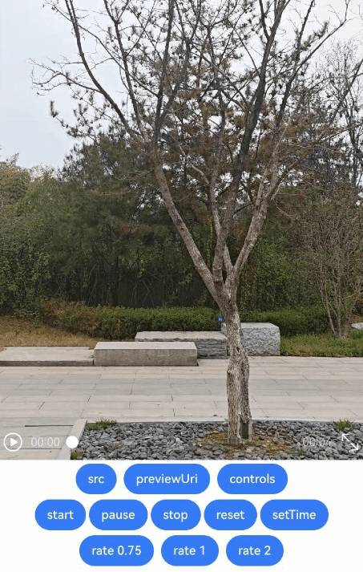
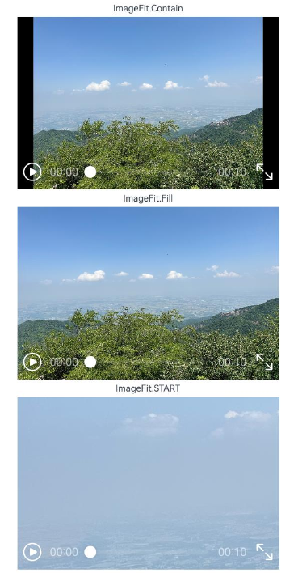
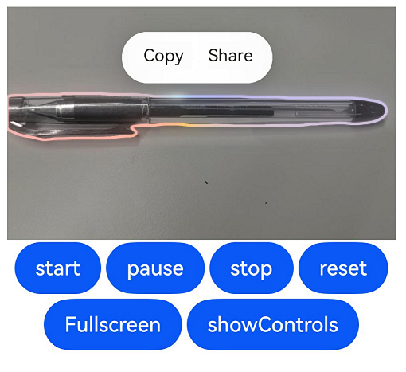

# Video
<!--Kit: ArkUI-->
<!--Subsystem: ArkUI-->
<!--Owner: @qianpinyi-->
<!--Designer: @fenglinbailu-->
<!--Tester: @liuli0427-->
<!--Adviser: @Brilliantry_Rui-->
<!-- md-trans-meta sourceCommit=48422a8cba8102090ab3a5b055a79ff6f52ce339 translatedAt=2026-08-28T01:44:03.625Z pushedAt=2026-09-01T08:14:36.081Z -->

The **Video** component is used to play a video and control its playback state. It supports playback, pause, progress control, playback speed, full-screen switching, and other functions.

> **NOTE**
>
> This component is supported since API version 7. Updates will be marked with a superscript to indicate their earliest API version.<br>
> The **Video** component provides only simple video playback and cannot support complex video playback control scenarios. For complex development scenarios, you are advised to use the [AVPlayer](../../apis-media-kit/arkts-apis-media-AVPlayer.md) playback control API and the [XComponent](ts-basic-components-xcomponent.md) component.<br>
> When the **Video** component uses [expandSafeArea](./ts-universal-attributes-expand-safe-area.md#expandsafearea) to expand the safe area, the video display content area of the component cannot be expanded.

## Required Permissions

To use online videos, you must apply for the ohos.permission.INTERNET permission. For details about how to apply for a permission, see [Declaring Permissions](../../../security/AccessToken/declare-permissions.md).


## Child Components

Not supported


## APIs

### Video

Video(value: VideoOptions)

**Atomic service API**: This API can be used in atomic services since API version 11.

**System capability**: SystemCapability.ArkUI.ArkUI.Full

**Parameters**

| Name| Type| Mandatory| Description|
| -------- | -------- | -------- | -------- |
| value | [VideoOptions](#videooptions) | Yes| Video information.|

##  VideoOptions

Defines the options of the **Video** component.

**System capability**: SystemCapability.ArkUI.ArkUI.Full

<!--Table: 20%; 20%; 8%; 8%; 44%-->
| Name      | Type   | Read-Only| Optional| Description                        |
| ------------------- | ------------------------------------------------------------ | ---- | ---- | ------------------------------------------------------------ |
| src                 | string \| [Resource](ts-types.md#resource)                            | No   | Yes | Data source of the video, which supports local videos and network videos.<br>The Resource format can access resource files across packages or modules and is commonly used to access local videos.<br>- Only resources in the rawfile directory are supported, that is, video files referenced through \$rawfile.<br>The string format can be used to load network videos and local videos, and is commonly used to load network videos.<br>- Network video URLs are supported. For details about the formats supported by network video URLs, see [Formats Supported by Streaming Media](../../../media/media/streaming-media-playback-development-guide.md#formats-supported-by-streaming-media).<br>- Strings with the file:// path prefix are supported, that is, the app sandbox URI (see [uriOrPath](../../apis-core-file-kit/js-apis-file-fileuri.md#constructor10)): **file://\<bundleName>/\<sandboxPath>**. It is used to read resources in the app sandbox path. Ensure that the files in the directory package path have read permission.<br>Default value: empty string<br>Abnormal value: processed as the default value.<br>**NOTE**<br>The supported video formats are mp4, mkv, and TS.<br>**Atomic service API:** This API can be used in atomic services since API version 11. |
| currentProgressRate | number&nbsp;\|&nbsp;string&nbsp;\|&nbsp;[PlaybackSpeed<sup>8+</sup>](#playbackspeed8) | No   | Yes | Video playback speed.<br>**NOTE**<br>The number format supports only the following values: 0.75, 1.0, 1.25, 1.75, and 2.0. Since API version 22, the values 0.5, 1.5, 3, 0.25, and 0.125 are also supported. Since API version 26.0.0, the supported value range is [0.125, 8].<br>The string format supports the string forms of the number values: "0.75", "1.0", "1.25", "1.75", and "2.0". Since API version 22, the values "0.5", "1.5", "3", "0.25", and "0.125" are also supported.<br>Other values, such as "abc" or "1.5+1.5", are processed as abnormal values.<br>Default value: **1.0 \| PlaybackSpeed.Speed_Forward_1_00_X**<br>Abnormal value: processed as the default value.<br>**Atomic service API:** This API can be used in atomic services since API version 11. |
| previewUri          | string&nbsp;\| [PixelMap](../../apis-image-kit/arkts-apis-image-PixelMap.md)&nbsp;\|&nbsp;[Resource](ts-types.md#resource)  | No  | Yes  | Path of the preview image displayed before the video is played.<br>The string format can be used to load local images and network images.<br>- Network image URLs are supported.<br>- Relative paths are supported for referencing local images, for example, **previewUri: "common/test.jpg"**. When a relative path is used to reference a local image, cross-package or cross-module calls are not supported.<br>- Strings with the file:// path prefix are supported, that is, the app sandbox URI (see [uriOrPath](../../apis-core-file-kit/js-apis-file-fileuri.md#constructor10)): **file://\<bundleName>/\<sandboxPath>**. It is used to read resources in the app sandbox path. Ensure that the files in the directory package path have read permission.<br>The Resource format can access resource files across packages or modules.<br>- Resources in the rawfile directory are supported, that is, images referenced through **\$rawfile**.<br>- Images in system resources or app resources referenced through **\$r** are supported.<br>Default value: empty string<br>Abnormal value: processed as the default value.<br>**Atomic service API:** This API can be used in atomic services since API version 11.                 |
| controller          | [VideoController](#videocontroller)                          | No | Yes   | Video controller, which can control the playback state of the video. When **controllerAsync** is set, the **controller** parameter does not take effect.<br>Default value: no video controller is set.<br>**Atomic service API:** This API can be used in atomic services since API version 11.                     |
| controllerAsync          | [VideoControllerAsync](#videocontrollerasync)                          | No | Yes   | Asynchronous video controller, which can control the playback state of the video and obtain the return result through a promise. When **controllerAsync** is set, **controller** is ignored.<br>Default value: empty<br>**Since:** 26.0.0<br>**Atomic service API:** This API can be used in atomic services since API version 26.0.0.<br>**Model restriction:** This API can be used only in the stage model. |
| imageAIOptions<sup>12+</sup>  | [ImageAIOptions](ts-image-common.md#imageaioptions12) | No | Yes   | Image AI analysis options, which can configure the analysis type or bind an analysis controller. After configuration, the image AI analysis function is enabled, and the analysis process can be controlled through the analysis controller. Pass this parameter when the AI analysis function is required. If it is not passed, the AI analysis function is disabled by default.<br>**Atomic service API:** This API can be used in atomic services since API version 12.<br>**Model restriction:** This API can be used only in the stage model. |
| posterOptions<sup>18+</sup>  | [PosterOptions](#posteroptions18) | No | Yes   | First-frame display options for video playback, which can control whether the video supports first-frame display. Pass this parameter when the first-frame display function needs to be enabled. If it is not passed, first-frame display is disabled by default.<br>**Atomic service API:** This API can be used in atomic services since API version 18.<br>**Model restriction:** This API can be used only in the stage model. |

## PlaybackSpeed<sup>8+</sup>

Enumerates video playback speed options.

**System capability**: SystemCapability.ArkUI.ArkUI.Full

| Name                 | Value        | Description          |
| -------------------- | ---------- | -------------- |
| Speed_Forward_0_75_X | 0.75 | 0.75x playback speed.<br> **Atomic service API:** This API can be used in atomic services since API version 11. |
| Speed_Forward_1_00_X | 1 | 1x playback speed.   <br> **Atomic service API:** This API can be used in atomic services since API version 11. |
| Speed_Forward_1_25_X | 1.25 | 1.25x playback speed.<br> **Atomic service API:** This API can be used in atomic services since API version 11. |
| Speed_Forward_1_75_X | 1.75 | 1.75x playback speed.<br> **Atomic service API:** This API can be used in atomic services since API version 11. |
| Speed_Forward_2_00_X | 2 | 2x playback speed.   <br> **Atomic service API:** This API can be used in atomic services since API version 11. |
| SPEED_FORWARD_0_50_X<sup>22+</sup> | 0.5 | 0.5x playback speed. <br> **Atomic service API:** This API can be used in atomic services since API version 22.<br>**Model restriction:** This API can be used only in the stage model. |
| SPEED_FORWARD_1_50_X<sup>22+</sup> | 1.5 | 1.5x playback speed. <br> **Atomic service API:** This API can be used in atomic services since API version 22.<br>**Model restriction:** This API can be used only in the stage model. |
| SPEED_FORWARD_3_00_X<sup>22+</sup> | 3 | 3x playback speed.   <br> **Atomic service API:** This API can be used in atomic services since API version 22.<br>**Model restriction:** This API can be used only in the stage model. |
| SPEED_FORWARD_0_25_X<sup>22+</sup> | 0.25 | 0.25x playback speed.<br> **Atomic service API:** This API can be used in atomic services since API version 22.<br>**Model restriction:** This API can be used only in the stage model. |
| SPEED_FORWARD_0_125_X<sup>22+</sup> | 0.125 | 0.125x playback speed.<br> **Atomic service API:** This API can be used in atomic services since API version 22.<br>**Model restriction:** This API can be used only in the stage model.|

## Attributes

In addition to the [universal attributes](ts-component-general-attributes.md), the following attributes are supported.

### muted

muted(value: boolean)

Sets whether to mute the video. This attribute can be dynamically set using [attributeModifier](ts-universal-attributes-attribute-modifier.md#attributemodifier).

**Atomic service API**: This API can be used in atomic services since API version 11.

**System capability**: SystemCapability.ArkUI.ArkUI.Full

**Parameters**

| Name| Type   | Mandatory| Description                        |
| ------ | ------- | ---- | ---------------------------- |
| value  | boolean | Yes   | Whether the video is muted.<br>The value **true** means to enable muting, and **false** means to disable muting.<br>Default value: **false** |

> **NOTE**
>
> When not muted, the **Video** component acquires audio focus when playback starts. To play without acquiring audio focus, mute the component before starting playback.

### autoPlay

autoPlay(value: boolean)

Sets whether to enable autoplay. This attribute can be dynamically set using [attributeModifier](ts-universal-attributes-attribute-modifier.md#attributemodifier).


**Atomic service API**: This API can be used in atomic services since API version 11.

**System capability**: SystemCapability.ArkUI.ArkUI.Full

**Parameters**

| Name| Type   | Mandatory| Description                            |
| ------ | ------- | ---- | -------------------------------- |
| value  | boolean | Yes   | Whether to enable autoplay.<br>The value **true** means to enable autoplay, and **false** means to disable autoplay.<br>Default value: **false** |

### controls

controls(value: boolean)

Sets whether to display the video playback control bar. This attribute can be dynamically set using [attributeModifier](ts-universal-attributes-attribute-modifier.md#attributemodifier).


**Atomic service API**: This API can be used in atomic services since API version 11.

**System capability**: SystemCapability.ArkUI.ArkUI.Full

**Parameters**

| Name| Type   | Mandatory| Description                                           |
| ------ | ------- | ---- | ----------------------------------------------- |
| value  | boolean | Yes   | Whether to display the control bar for video playback.<br>**true**: the control bar is displayed; **false**: the control bar is not displayed.<br>Default value: **true**<br>**Note:** To use the [enableAnalyzer](#enableanalyzer12) function for AI analysis, set this parameter to **false** and use a custom control bar. |

> **NOTE**
>
> The style of the control bar built into the **Video** component cannot be customized. To customize the control bar, set the **controls** attribute to **false** and implement the style or functions of the control bar by yourself. For details, see <!--RP1-->[Video Playback](https://gitcode.com/openharmony/applications_app_samples/tree/master/code/BasicFeature/Media/VideoPlay)<!--RP1End-->.

### objectFit

objectFit(value: ImageFit)

Sets the fill mode for the video content. This attribute can be dynamically set using [attributeModifier](ts-universal-attributes-attribute-modifier.md#attributemodifier).


**Atomic service API**: This API can be used in atomic services since API version 11.

**System capability**: SystemCapability.ArkUI.ArkUI.Full

**Parameters**

| Name| Type                                     | Mandatory| Description                            |
| ------ | ----------------------------------------- | ---- | -------------------------------- |
| value  | [ImageFit](ts-appendix-enums.md#imagefit) | Yes   | Video fill mode.<br>Default value: **ImageFit.Cover**<br>Restriction: The enum value **MATRIX** in the **ImageFit** type is not supported. If it is set, the effect is the same as that of **ImageFit.Cover**.<br>Abnormal value: If an abnormal value such as **undefined** or **null**, or a value outside the [ImageFit](ts-appendix-enums.md#imagefit) enum range is set, the effect is the same as that of **ImageFit.Cover**.|

### loop

loop(value: boolean)

Sets whether to loop the video. This attribute can be dynamically set using [attributeModifier](ts-universal-attributes-attribute-modifier.md#attributemodifier).


**Atomic service API**: This API can be used in atomic services since API version 11.

**System capability**: SystemCapability.ArkUI.ArkUI.Full

**Parameters**

| Name| Type   | Mandatory| Description                                    |
| ------ | ------- | ---- | ---------------------------------------- |
| value  | boolean | Yes   | Whether to loop a single video.<br>The value **true** means to enable loop playback, and **false** means to disable loop playback.<br>Default value: **false** |

### enableAnalyzer<sup>12+</sup>

enableAnalyzer(enable: boolean)

Sets whether to enable the AI image analyzer, which supports subject recognition, text recognition, and object lookup. This attribute can be dynamically set using [attributeModifier](ts-universal-attributes-attribute-modifier.md#attributemodifier).

After this feature is enabled, the video automatically enters an analysis state to process the current frame when playback is paused, and exits the analysis state when playback is resumed.

This attribute cannot be used together with the [overlay](ts-universal-attributes-overlay.md#overlay) attribute. If both are set, the [CustomBuilder](ts-types.md#custombuilder8) attribute in [overlay](ts-universal-attributes-overlay.md#overlay) becomes invalid.

>**NOTE**
>
> This API can be called within [attributeModifier](ts-universal-attributes-attribute-modifier.md#attributemodifier) since API version 20.

**Atomic service API**: This API can be used in atomic services since API version 12.

**Model restriction**: This API can be used only in the stage model.

**System capability**: SystemCapability.ArkUI.ArkUI.Full

**Parameters**

| Name| Type| Mandatory| Description|
| -------- | -------- | -------- | -------- |
| enable | boolean | Yes | Whether to enable the AI analysis function.<br>**true**: enables the AI analysis function; **false**: disables the AI analysis function.<br>Default value: **false**<br>**Note:**<br>This attribute cannot be used together with [overlay](ts-universal-attributes-overlay.md#overlay). When both are set, the [CustomBuilder](ts-types.md#custombuilder8) attribute in [overlay](ts-universal-attributes-overlay.md#overlay) does not take effect. |

> **NOTE**
>
> This feature is available only when the custom control bar is used (that is, when the [controls](#controls) attribute is set to **false**).
> This feature depends on device capabilities.

### analyzerConfig<sup>12+</sup>

analyzerConfig(config: ImageAnalyzerConfig)

Sets the AI image analysis types, including subject recognition, text recognition, and object lookup. This attribute can be dynamically set using [attributeModifier](ts-universal-attributes-attribute-modifier.md#attributemodifier).

>**NOTE**
>
> This API can be called within [attributeModifier](ts-universal-attributes-attribute-modifier.md#attributemodifier) since API version 20.

**Atomic service API**: This API can be used in atomic services since API version 12.

**Model restriction**: This API can be used only in the stage model.

**System capability**: SystemCapability.ArkUI.ArkUI.Full

**Parameters**

| Name| Type| Mandatory| Description|
| -------- | -------- | -------- | -------- |
| config | [ImageAnalyzerConfig](ts-image-common.md#imageanalyzerconfig12) | Yes| AI image analysis types.|

### enableShortcutKey<sup>15+</sup>

enableShortcutKey(enabled: boolean)

Sets whether the component responds to keyboard shortcuts when it has focus. This attribute can be dynamically set using [attributeModifier](ts-universal-attributes-attribute-modifier.md#attributemodifier).

Currently, the component can respond to the following keys when it is in focus: spacebar for playing or pausing the video, up or down arrow key for adjusting the video volume, and left or right arrow key for fast forwarding or rewinding the video.

**Atomic service API**: This API can be used in atomic services since API version 15.

**Model restriction**: This API can be used only in the stage model.

**System capability**: SystemCapability.ArkUI.ArkUI.Full

**Parameters**

| Name | Type   | Mandatory| Description                                  |
| ------- | ------- | ---- | -------------------------------------- |
| enabled | boolean | Yes   | Whether to enable shortcut key response.<br>The value **true** means to enable shortcut key response, and **false** means to disable it.<br>Default value: **false**<br>**NOTE**<br>When **enabled** is set to **false** and **controls** is set to **true**, you can still use the left and right arrow keys to fast-forward or rewind the progress bar. |

## Events

In addition to the [universal events](ts-component-general-events.md), the following events are supported.

### onStart

onStart(event:&nbsp;VoidCallback)

Triggered when playback starts. This attribute supports dynamic setting through [attributeModifier](ts-universal-attributes-attribute-modifier.md#attributemodifier).

**Atomic service API**: This API can be used in atomic services since API version 11.

**System capability**: SystemCapability.ArkUI.ArkUI.Full

**Parameters**

| Name| Type                                          | Mandatory| Description                                |
| ------ | --------------------------------------------- | ---- | ----------------------------------- |
| event  | [VoidCallback](ts-types.md#voidcallback12)    | Yes   | Callback triggered when video playback starts.        |

### onPause

onPause(event:&nbsp;VoidCallback)

Triggered when video playback is paused. Dynamic property modification using [attributeModifier](ts-universal-attributes-attribute-modifier.md#attributemodifier) is supported.

**Atomic service API**: This API can be used in atomic services since API version 11.

**System capability**: SystemCapability.ArkUI.ArkUI.Full

**Parameters**

| Name| Type                                          | Mandatory| Description                                |
| ------ | --------------------------------------------- | ---- | ----------------------------------- |
| event  | [VoidCallback](ts-types.md#voidcallback12)    | Yes  | Callback invoked when video playback is paused.       |

### onFinish

onFinish(event:&nbsp;VoidCallback)

Triggered when video playback is finished. Dynamic property modification using [attributeModifier](ts-universal-attributes-attribute-modifier.md#attributemodifier) is supported.

**Atomic service API**: This API can be used in atomic services since API version 11.

**System capability**: SystemCapability.ArkUI.ArkUI.Full

**Parameters**

| Name| Type                                          | Mandatory| Description                                |
| ------ | --------------------------------------------- | ---- | ----------------------------------- |
| event  | [VoidCallback](ts-types.md#voidcallback12)    | Yes  | Callback invoked when video playback is finished.       |

### onError

onError(event: VoidCallback | import('../api/@ohos.base').ErrorCallback)

Triggered when video playback fails. Dynamic property modification using [attributeModifier](ts-universal-attributes-attribute-modifier.md#attributemodifier) is supported.

>**NOTE**
>
> This API can be called within [attributeModifier](ts-universal-attributes-attribute-modifier.md#attributemodifier) since API version 20.

**Atomic service API**: This API can be used in atomic services since API version 11.

**System capability**: SystemCapability.ArkUI.ArkUI.Full

**Parameters**

| Name| Type                                          | Mandatory| Description                                |
| ------ | --------------------------------------------- | ---- | ----------------------------------- |
| event  | [VoidCallback](ts-types.md#voidcallback12) \| import('../api/@ohos.base').[ErrorCallback](../../apis-basic-services-kit/js-apis-base.md#errorcallback)<sup>20+</sup> | Yes   | Callback invoked when video playback fails. The callback of the [ErrorCallback](../../apis-basic-services-kit/js-apis-base.md#errorcallback) type is used to receive exception information. For details about the error codes returned by the callback, see [Video Component Error Codes](../errorcode-video.md) and [Media Error Codes](../../apis-media-kit/errorcode-media.md).|

### onStop<sup>12+</sup>

onStop(event: Callback&lt;void&gt;)

Triggered when the video playback is stopped (after **stop()** is called). Dynamic property modification using [attributeModifier](ts-universal-attributes-attribute-modifier.md#attributemodifier) is supported.

**Atomic service API**: This API can be used in atomic services since API version 12.

**Model restriction**: This API can be used only in the stage model.

**System capability**: SystemCapability.ArkUI.ArkUI.Full

**Parameters**

| Name  | Type  | Mandatory| Description                      |
| -------- | ------ | ---- | -------------------------- |
| event | [Callback](ts-types.md#callback12)\<void> | Yes | Callback invoked when video playback stops. |

### onPrepared

onPrepared(callback: Callback\<PreparedInfo>)

Triggered when video preparation is complete. Dynamic property modification using [attributeModifier](ts-universal-attributes-attribute-modifier.md#attributemodifier) is supported.

**Atomic service API**: This API can be used in atomic services since API version 11.

**System capability**: SystemCapability.ArkUI.ArkUI.Full

**Parameters**

| Name  | Type  | Mandatory| Description                      |
| -------- | ------ | ---- | -------------------------- |
| callback | [Callback](ts-types.md#callback12)\<[PreparedInfo](#preparedinfo18)> | Yes | Callback invoked when video preparation is complete. |

### onSeeking

onSeeking(callback: Callback\<PlaybackInfo>)

Triggered to report the time information while seeking is in progress (the progress bar is being dragged). Dynamic property modification using [attributeModifier](ts-universal-attributes-attribute-modifier.md#attributemodifier) is supported.

**Atomic service API**: This API can be used in atomic services since API version 11.

**System capability**: SystemCapability.ArkUI.ArkUI.Full

**Parameters**

| Name| Type  | Mandatory| Description                          |
| ------ | ------ | ---- | ------------------------------ |
| callback   | [Callback](ts-types.md#callback12)\<[PlaybackInfo](#playbackinfo18)> | Yes   | Callback invoked when the progress bar is operated. |

### onSeeked

onSeeked(callback: Callback\<PlaybackInfo>)

Triggered to report the time information while seeking is completed. Dynamic property modification using [attributeModifier](ts-universal-attributes-attribute-modifier.md#attributemodifier) is supported.

**Atomic service API**: This API can be used in atomic services since API version 11.

**System capability**: SystemCapability.ArkUI.ArkUI.Full

**Parameters**

| Name| Type  | Mandatory| Description                          |
| ------ | ------ | ---- | ------------------------------ |
| callback   | [Callback](ts-types.md#callback12)\<[PlaybackInfo](#playbackinfo18)> | Yes   | Callback invoked when the operation progress bar is completed. |

### onUpdate

onUpdate(callback: Callback\<PlaybackInfo>)

Triggered when playback progress changes. Dynamic property modification using [attributeModifier](ts-universal-attributes-attribute-modifier.md#attributemodifier) is supported.

**Atomic service API**: This API can be used in atomic services since API version 11.

**System capability**: SystemCapability.ArkUI.ArkUI.Full

**Parameters**

| Name| Type  | Mandatory| Description                          |
| ------ | ------ | ---- | ------------------------------ |
| callback   | [Callback](ts-types.md#callback12)\<[PlaybackInfo](#playbackinfo18)> | Yes   | Callback invoked when the playback progress changes. |

### onFullscreenChange

onFullscreenChange(callback: Callback\<FullscreenInfo>)

Triggered when video playback is switched between full-screen mode and non-full-screen mode. Dynamic property modification using [attributeModifier](ts-universal-attributes-attribute-modifier.md#attributemodifier) is supported.

**Atomic service API**: This API can be used in atomic services since API version 11.

**System capability**: SystemCapability.ArkUI.ArkUI.Full

**Parameters**

| Name    | Type   | Mandatory| Description                                                 |
| ---------- | ------- | ---- | ----------------------------------------------------- |
| callback | [Callback](ts-types.md#callback12)\<[FullscreenInfo](#fullscreeninfo18)> | Yes | Callback invoked when switching between full-screen playback and non-full-screen playback states. |

## FullscreenInfo<sup>18+</sup>

Describes whether the video is in full-screen playback mode.

> **NOTE**
>
> To standardize anonymous object definitions, the element definitions here have been revised in API version 18. While historical version information is preserved for anonymous objects, there may be cases where the outer element's @since version number is higher than inner elements'. This does not affect interface usability.

**Atomic service API**: This API can be used in atomic services since API version 18.

**Model restriction**: This API can be used only in the stage model.

**System capability**: SystemCapability.ArkUI.ArkUI.Full

| Name      | Type   | Read-Only| Optional| Description                        |
| ----------- | ------- | ---- | ----  | ---------------------------- |
| fullscreen<sup>10+</sup>  | boolean | No | No  | Whether the current video enters full-screen playback.<br>The value **true** indicates that the video enters full-screen playback, and **false** indicates the opposite.<br>Default value: **false**<br>**Atomic service API:** This API can be used in atomic services since API version 11.  |

## PreparedInfo<sup>18+</sup>

Describes the duration of the video.

> **NOTE**
>
> To standardize anonymous object definitions, the element definitions here have been revised in API version 18. While historical version information is preserved for anonymous objects, there may be cases where the outer element's @since version number is higher than inner elements'. This does not affect interface usability.

**Atomic service API**: This API can be used in atomic services since API version 18.

**Model restriction**: This API can be used only in the stage model.

**System capability**: SystemCapability.ArkUI.ArkUI.Full

| Name      | Type   | Read-Only| Optional| Description                        |
| ----------- | ------- | ---- | ----  | ---------------------------- |
| duration<sup>10+</sup> | number  | No | No  | Duration of the current video.<br>Unit: s<br>Value range: [0,+∞)<br>**Atomic service API:** This API can be used in atomic services since API version 11. |

## PlaybackInfo<sup>18+</sup>

Describes the current progress of video playback.

> **NOTE**
>
> To standardize anonymous object definitions, the element definitions here have been revised in API version 18. While the initial version information of historical anonymous objects is preserved, there may be cases where the outer element's @since version number is higher than inner element's. This does not affect interface usability.

**Atomic service API**: This API can be used in atomic services since API version 18.

**Model restriction**: This API can be used only in the stage model.

**System capability**: SystemCapability.ArkUI.ArkUI.Full

| Name      | Type   | Read-Only| Optional| Description                        |
| ----------- | ------- | ---- | ---- | ---------------------------- |
| time<sup>10+</sup> | number  | No | No  | Playback progress of the current video.<br>Unit: s<br>Value range: [0, +∞)<br>**Atomic service API:** This API can be used in atomic services since API version 11. |

## PosterOptions<sup>18+</sup>

Defines display options for the first frame of the video.

**Model restriction**: This API can be used only in the stage model.

**System capability**: SystemCapability.ArkUI.ArkUI.Full

| Name      | Type   | Read-Only| Optional| Description                        |
| ----------- | ------- | ---- | ---- | ---------------------------- |
| showFirstFrame   | boolean | No | Yes | Whether to configure first-frame display for the current video. When first-frame display is enabled, the previewUri field in the [VideoOptions object](#videooptions) does not take effect.<br>**true**: enables first-frame display; **false**: disables first-frame display.<br>Default value: **false**<br>**Atomic service API:** This API can be used in atomic services since API version 18.      |
| contentTransitionEffect<sup>21+</sup>   | [ContentTransitionEffect](ts-image-common.md#contenttransitioneffect21) | No | Yes | Transition effect when the preview image content of the current video changes. This field does not take effect when **showFirstFrame** is set to true (that is, first-frame display is enabled) or when no valid **previewUri** is configured in the [VideoOptions object](#videooptions).<br>Default value: **ContentTransitionEffect.IDENTITY**<br>When set to **undefined** or **null**, the value is **ContentTransitionEffect.IDENTITY**.<br>**Atomic service API:** This API can be used in atomic services since API version 21.      |

## VideoController

A **VideoController** object can control one or more **Video** components.

**Atomic service API**: This API can be used in atomic services since API version 11.

**System capability**: SystemCapability.ArkUI.ArkUI.Full

### Objects to Import

```ts
let controller: VideoController = new VideoController();
```

### constructor

constructor()

A constructor used to create a **VideoController** object.

**Atomic service API**: This API can be used in atomic services since API version 11.

**System capability**: SystemCapability.ArkUI.ArkUI.Full

### start

start()

Starts playback.

**Atomic service API**: This API can be used in atomic services since API version 11.

**System capability**: SystemCapability.ArkUI.ArkUI.Full


### pause

pause()

Pauses playback. The current frame is then displayed, and playback will be resumed from this paused position.

**Atomic service API**: This API can be used in atomic services since API version 11.

**System capability**: SystemCapability.ArkUI.ArkUI.Full


### stop

stop()

Stops playback. The current frame is then displayed, and playback will restart from the very beginning.

**Atomic service API**: This API can be used in atomic services since API version 11.

**System capability**: SystemCapability.ArkUI.ArkUI.Full


### reset<sup>12+</sup>

reset(): void

Resets the video player. The current frame is displayed, and playback starts from the beginning when it is played again.

**Atomic service API**: This API can be used in atomic services since API version 12.

**Model restriction**: This API can be used only in the stage model.

**System capability**: SystemCapability.ArkUI.ArkUI.Full


### setCurrentTime

setCurrentTime(value: number)

Sets the video playback position.

> **NOTE**
>
> To start playback from a specific time point in the video, disable autoplay, and seek to the target position before playing after the video is prepared.

**Atomic service API**: This API can be used in atomic services since API version 11.

**System capability**: SystemCapability.ArkUI.ArkUI.Full

**Parameters**

| Name  | Type  | Mandatory  | Description          |
| ----- | ------ | ---- | -------------- |
| value | number | Yes | Video playback progress position.<br>Value range: [0, [duration](#preparedinfo18)]<br>If the **value** is greater than **duration**, the progress jumps to the end; if the **value** is less than 0, no progress jump is performed.<br>Unit: s<br>Since API version 8, the video seek mode can be set. For details, see [setCurrentTime<sup>8+</sup>](#setcurrenttime8). |


### requestFullscreen

requestFullscreen(value: boolean)

Requests full-screen playback.

**Atomic service API**: This API can be used in atomic services since API version 11.

**System capability**: SystemCapability.ArkUI.ArkUI.Full

**Parameters**

| Name| Type| Mandatory| Description                        |
| ------ | -------- | ---- | -------------------------------- |
| value  | boolean  | Yes   | Whether to play in full-screen mode (fill the app window).<br>The value **true** requests full-screen playback, and **false** does not request full-screen playback.<br>Default value: **false** |


> **NOTE**
>
>  The built-in full-screen feature of the **Video** component only sets the video content to full screen and displays the default controller. It does not support displaying a custom title or controller. If additional functionality is required, implement custom full-screen features.

### exitFullscreen

exitFullscreen()

Exits full-screen mode.

**Atomic service API**: This API can be used in atomic services since API version 11.

**System capability**: SystemCapability.ArkUI.ArkUI.Full


### setCurrentTime<sup>8+</sup>

setCurrentTime(value: number, seekMode: SeekMode)

Sets the video playback position with the specified seek mode.

> **NOTE**
>
> To start playback from a specific time point in the video, disable autoplay, and seek to the target position before playing after the video is prepared.

**Atomic service API**: This API can be used in atomic services since API version 11.

**System capability**: SystemCapability.ArkUI.ArkUI.Full

**Parameters**

| Name | Type | Mandatory | Description |
| -------- | -------- | ---- | -------------- |
| value | number | Yes | Video playback position.<br>Value range: [0, [duration](#preparedinfo18)]<br>If **value** is greater than **duration**, the progress jumps to the end. If **value** is less than 0, no progress jump is performed.<br>Unit: s |
| seekMode | [SeekMode](#seekmode8) | Yes | Seek mode.<br>Abnormal values **undefined**, **null**, **NaN**, and **Infinity** are processed as **PreviousKeyframe**. |


## VideoControllerAsync

**VideoControllerAsync** is the asynchronous version of **VideoController**. It can obtain the results of some playback control commands through a promise. It does not support controlling multiple **Video** components at the same time.

> **NOTE**
>
> **VideoControllerAsync** provides the execution results of commands. Compared with **VideoController**, playback control commands such as [start](#start-1), [pause](#pause-1), [stop](#stop-1), and [reset](#reset) are executed asynchronously. They return immediately after the request without blocking the current thread, and the execution results can be processed through the **then** and **catch** methods of the promise.

**Since**: 26.0.0

**Atomic service API:** This API can be used in atomic services since API version 26.0.0.

**Model restriction**: This API can be used only in the stage model.

**System capability**: SystemCapability.ArkUI.ArkUI.Full

### Objects to Import

```ts
let controllerAsync: VideoControllerAsync = new VideoControllerAsync();
```

### constructor

constructor()

Constructor of **VideoControllerAsync**.

**Since**: 26.0.0

**Atomic service API:** This API can be used in atomic services since API version 26.0.0.

**Model restriction**: This API can be used only in the stage model.

**System capability**: SystemCapability.ArkUI.ArkUI.Full

### start

start(): Promise\<void\>

Starts video playback. This API uses a promise to return the result.

Calling **start()** before the video is prepared (before the [onPrepared](#onprepared) callback is received) will fail.

**Since**: 26.0.0

**Atomic service API:** This API can be used in atomic services since API version 26.0.0.

**Model restriction**: This API can be used only in the stage model.

**System capability**: SystemCapability.ArkUI.ArkUI.Full

**Return value**

| Type | Description |
| ------ | ----- |
| Promise\<void\> | Promise that returns no value. |

### pause

pause(): Promise\<void\>

Pauses video playback. The current frame is displayed, and playback resumes from the current position when it is played again. This API uses a promise to return the result.

This method can be called only in the playing state. Calling **pause()** in other states will fail.

**Since**: 26.0.0

**Atomic service API:** This API can be used in atomic services since API version 26.0.0.

**Model restriction**: This API can be used only in the stage model.

**System capability**: SystemCapability.ArkUI.ArkUI.Full

**Return value**

| Type | Description |
| ------ | ----- |
| Promise\<void\> | Promise that returns no value. |

### stop

stop(): Promise\<void\>

Stops video playback. The current frame is displayed, and playback starts from the beginning when it is played again. This API uses a promise to return the result.

**Since**: 26.0.0

**Atomic service API:** This API can be used in atomic services since API version 26.0.0.

**Model restriction**: This API can be used only in the stage model.

**System capability**: SystemCapability.ArkUI.ArkUI.Full

**Return value**

| Type | Description |
| ------ | ----- |
| Promise\<void\> | Promise that returns no value. |

### reset

reset(): Promise\<void\>

Resets the video player. The current frame is displayed, and playback starts from the beginning when it is played again. This API uses a promise to return the result.

**Since**: 26.0.0

**Atomic service API:** This API can be used in atomic services since API version 26.0.0.

**Model restriction**: This API can be used only in the stage model.

**System capability**: SystemCapability.ArkUI.ArkUI.Full

**Return value**

| Type | Description |
| ------ | ----- |
| Promise\<void\> | Promise that returns no value. |

### requestFullscreen

requestFullscreen(value: boolean)

Requests full-screen playback. If this API is not called, full-screen playback is not requested by default.

> **NOTE**
>
> The full-screen function built into the **Video** component only sets the video content to full screen and displays the default controller. It cannot display a custom title or controller. To implement other functions, you need to implement the full-screen function by yourself.

**Since**: 26.0.0

**Atomic service API:** This API can be used in atomic services since API version 26.0.0.

**Model restriction**: This API can be used only in the stage model.

**System capability**: SystemCapability.ArkUI.ArkUI.Full

**Parameters**

| Name | Type | Mandatory | Description |
| ------ | -------- | ---- | -------------------------------- |
| value | boolean | Yes | Whether to play in full screen (fill the app window).<br>**true**: request full-screen playback; **false**: do not request full-screen playback. |

### exitFullscreen

exitFullscreen()

Exits full-screen playback.

**Since**: 26.0.0

**Atomic service API:** This API can be used in atomic services since API version 26.0.0.

**Model restriction**: This API can be used only in the stage model.

**System capability**: SystemCapability.ArkUI.ArkUI.Full

### setCurrentTime

setCurrentTime(value: number, seekMode?: SeekMode)

Sets the playback position of the video, with an optional seek mode.

> **NOTE**
>
> To start playback from a specific time point in the video, disable autoplay, and seek to the target position before playing after the video is prepared.

**Since**: 26.0.0

**Atomic service API:** This API can be used in atomic services since API version 26.0.0.

**Model restriction**: This API can be used only in the stage model.

**System capability**: SystemCapability.ArkUI.ArkUI.Full

**Parameters**

| Name     | Type    | Mandatory  | Description          |
| -------- | -------- | ---- | -------------- |
| value    | number   | Yes    | Video playback progress position.<br>Value range: [0, [duration](#preparedinfo18)]<br>If the **value** is greater than **duration**, the progress jumps to the end. If the **value** is less than 0, the progress does not jump.<br>Unit: s |
| seekMode | [SeekMode](#seekmode8) | No    | Seek mode.<br>Abnormal values **undefined**, **null**, **NaN**, and **Infinity** are processed as **PreviousKeyframe**.<br>Default value: **PreviousKeyframe** |

## SeekMode<sup>8+</sup>

Enumerates video seek modes.

**Atomic service API**: This API can be used in atomic services since API version 11.

**System capability**: SystemCapability.ArkUI.ArkUI.Full

| Name | Value | Description |
| ---------------- |--| ---------------------------- |
| PreviousKeyframe |0| Seeks to the nearest keyframe before the current playback position. |
| NextKeyframe |1| Seeks to the nearest keyframe after the current playback position. |
| ClosestKeyframe |2| Seeks to the keyframe closest to the current playback position. |
| Accurate |3| Seeks precisely to the specified time point, regardless of whether it is a keyframe. This mode is highly accurate but may require decoding more frames. |

## Example

### Example 1: Implementing Basic Video Playback Features

The basic usage includes: control bar, preview image, autoplay, playback speed, keyboard shortcut response (since API version 15, you can set the component to respond to keyboard shortcuts through [enableShortcutKey](#enableshortcutkey15)), controller (start playback, pause playback, stop playback, reset the video player, seek, etc.), first-frame display (since API version 18, you can set the first-frame display options of video playback through [posterOptions](#posteroptions18). Since API version 21, **posterOptions** supports setting the transition animation effect when the preview image content of the current video changes through the **contentTransitionEffect** parameter of [PosterOptions](#posteroptions18).), and some state callback methods.

```ts
// xxx.ets
@Entry
@Component
struct VideoCreateComponent {
  // Replace $rawfile('video1.mp4') and $r('app.media.poster1') with the resource files you use.
  @State videoSrc: Resource = $rawfile('video1.mp4');
  @State previewUri: Resource = $r('app.media.poster1');
  @State curRate: PlaybackSpeed = PlaybackSpeed.Speed_Forward_1_00_X;
  @State isAutoPlay: boolean = false;
  @State showControls: boolean = true;
  @State isShortcutKeyEnabled: boolean = false;
  @State showFirstFrame: boolean = false;
  controller: VideoController = new VideoController();

  build() {
    Column() {
      Video({
        src: this.videoSrc,
        previewUri: this.previewUri, // Set the preview image.
        currentProgressRate: this.curRate, // Set the playback speed.
        controller: this.controller,
        posterOptions: {
          showFirstFrame: this.showFirstFrame,
          contentTransitionEffect: ContentTransitionEffect.OPACITY
        } // Disable first-frame display, and set the fade-in/fade-out animation of the preview image.
      })
        .width('100%')
        .height(600)
        .autoPlay(this.isAutoPlay)
        .controls(this.showControls)
        .enableShortcutKey(this.isShortcutKeyEnabled)
        .onStart(() => {
          console.info('onStart');
        })
        .onPause(() => {
          console.info('onPause');
        })
        .onFinish(() => {
          console.info('onFinish');
        })
        .onError(() => {
          console.error('onError');
        })
        .onStop(() => {
          console.info('onStop');
        })
        .onPrepared((e?: DurationObject) => {
          if (e != undefined) {
            console.info(`onPrepared is ${e.duration}`);
          }
        })
        .onSeeking((e?: TimeObject) => {
          if (e != undefined) {
            console.info(`onSeeking is ${e.time}`);
          }
        })
        .onSeeked((e?: TimeObject) => {
          if (e != undefined) {
            console.info(`onSeeked is ${e.time}`);
          }
        })
        .onUpdate((e?: TimeObject) => {
          if (e != undefined) {
            console.info(`onUpdate is ${e.time}`);
          }
        })
        .onFullscreenChange((e?: FullscreenObject) => {
          if (e != undefined) {
            console.info(`onFullscreenChange is ${e.fullscreen}`);
          }
        })

      Row() {
        // Replace $rawfile('video2.mp4') and $r('app.media.poster2') with the resource files you use.
        Button('src').onClick(() => {
          this.videoSrc = $rawfile('video2.mp4'); // Switch the video source.
        }).margin(5)
        Button('previewUri').onClick(() => {
          this.previewUri = $r('app.media.poster2'); // Switch the preview image.
        }).margin(5)
        Button('controls').onClick(() => {
          this.showControls = !this.showControls; // Specify whether to show the control bar.
        }).margin(5)
      }

      Row() {
        Button('start').onClick(() => {
          this.controller.start(); // Start playback.
        }).margin(2)
        Button('pause').onClick(() => {
          this.controller.pause(); // Pause playback.
        }).margin(2)
        Button('stop').onClick(() => {
          this.controller.stop(); // Stop playback.
        }).margin(2)
        Button('reset').onClick(() => {
          this.controller.reset(); // Reset the video player.
        }).margin(2)
        Button('setTime').onClick(() => {
          this.controller.setCurrentTime(10, SeekMode.Accurate); // Seek to the 10s position of the video.
        }).margin(2)
      }

      Row() {
        Button('rate 0.75').onClick(() => {
          this.curRate = PlaybackSpeed.Speed_Forward_0_75_X; // Play the video at the 0.75x speed.
        }).margin(5)
        Button('rate 1').onClick(() => {
          this.curRate = PlaybackSpeed.Speed_Forward_1_00_X; // Play the video at the 1x speed.
        }).margin(5)
        Button('rate 2').onClick(() => {
          this.curRate = PlaybackSpeed.Speed_Forward_2_00_X; // Play the video at the 2x speed.
        }).margin(5)
      }
    }
  }
}

interface DurationObject {
  duration: number;
}

interface TimeObject {
  time: number;
}

interface FullscreenObject {
  fullscreen: boolean;
}
```



### Example 2: Enabling AI Image Analyzer

This example shows how to use the **enableAnalyzer** attribute to enable AI image analyzer.

```ts
// xxx.ets
@Entry
@Component
struct ImageAnalyzerExample {
  // Replace $rawfile('video1.mp4') and $r('app.media.poster1') with the resource files you use.
  @State videoSrc: Resource = $rawfile('video1.mp4');
  @State previewUri: Resource = $r('app.media.poster1');
  controller: VideoController = new VideoController();
  config: ImageAnalyzerConfig = {
    types: [ImageAnalyzerType.SUBJECT, ImageAnalyzerType.TEXT]
  }
  private aiController: ImageAnalyzerController = new ImageAnalyzerController();
  private options: ImageAIOptions = {
    types: [ImageAnalyzerType.SUBJECT, ImageAnalyzerType.TEXT],
    aiController: this.aiController
  }

  build() {
    Column() {
      Video({
        src: this.videoSrc,
        previewUri: this.previewUri,
        controller: this.controller,
        imageAIOptions: this.options // Set the AI image analysis options.
      })
        .width('100%')
        .height(600)
        .controls(false)
        .enableAnalyzer(true)
        .analyzerConfig(this.config)
        .onStart(() => {
          console.info('onStart');
        })
        .onPause(() => {
          console.info('onPause');
        })

      Row() {
        Button('start').onClick(() => {
          this.controller.start(); // Start playback.
        }).margin(5)
        Button('pause').onClick(() => {
          this.controller.pause(); // Pause playback.
        }).margin(5)
        Button('getTypes').onClick(() => {
          this.aiController.getImageAnalyzerSupportTypes();
        }).margin(5)
      }
    }
  }
}
```

### Example 3: Playing a Dragged-in Video

This example demonstrates how to enable the **Video** component to play a video that is dragged into it.

```ts
// xxx.ets
import { unifiedDataChannel, uniformTypeDescriptor } from '@kit.ArkData';

@Entry
@Component
struct Index {
  // Replace $rawfile('video1.mp4') with the video resource file you use.
  @State videoSrc: Resource | string = $rawfile('video1.mp4');
  private controller: VideoController = new VideoController();

  build() {
    Column() {
      Video({
        src: this.videoSrc,
        controller: this.controller
      })
        .width('100%')
        .height(600)
        .onPrepared(() => {
          // Execute the controller's start method in the onPrepared callback to ensure the video starts playing immediately after the source is changed.
          this.controller.start();
        })
        .onDrop((e: DragEvent) => {
          // Handle the drop event when a video is dragged into the component.
          // The DragEvent contains the information about the dragged-in video source. After the information is obtained, assign a value to the state variable videoSrc to change the video source of the video.
          let record = e.getData().getRecords()[0];
          if (record.getType() == uniformTypeDescriptor.UniformDataType.VIDEO) {
            let videoInfo = record as unifiedDataChannel.Video;
            this.videoSrc = videoInfo.videoUri;
          }
        })
    }
  }
}
```
### Example 4: Setting the Video Fill Mode

This example shows how to set the video fill mode using the **objectFit** attribute.

```ts
// xxx.ets
@Entry
@Component
struct VideoObject {
  // Replace $rawfile('rabbit.mp4') and $r('app.media.tree') with the resource files you use.
  @State videoSrc: Resource = $rawfile('rabbit.mp4');
  @State previewUri: Resource = $r('app.media.tree');
  @State showControls: boolean = true;
  controller: VideoController = new VideoController();

  build() {
    Column() {
      Text('ImageFit.Contain').fontSize(12)
      Video({
        src: this.videoSrc,
        previewUri: this.previewUri,
        controller: this.controller
      })
        .width(350)
        .height(230)
        .controls(this.showControls)
        .objectFit(ImageFit.Contain) // Set the video fill mode to ImageFit.Contain.
        .margin(5)

      Text('ImageFit.Fill').fontSize(12)
      Video({
        src: this.videoSrc,
        previewUri: this.previewUri,
        controller: this.controller
      })
        .width(350)
        .height(230)
        .controls(this.showControls)
        .objectFit(ImageFit.Fill) // Set the video fill mode to ImageFit.Fill.
        .margin(5)

      Text('ImageFit.START').fontSize(12)
      Video({
        src: this.videoSrc,
        previewUri: this.previewUri,
        controller: this.controller
      })
        .width(350)
        .height(230)
        .controls(this.showControls)
        .objectFit(ImageFit.START) // Set the video fill mode to ImageFit.START.
        .margin(5)
    }.width('100%').alignItems(HorizontalAlign.Center)
  }
}
```


### Example 5: Handling Errors with onError

This example uses an invalid video resource path to demonstrate how the **Video** component can obtain error codes through the [onError](#onerror) event, available since API version 20.

```ts
// xxx.ets
@Entry
@Component
struct VideoErrorComponent {
  @State videoSrc: string = "video.mp4"; // Enter an invalid video resource path.
  @State isAutoPlay: boolean = false;
  @State showControls: boolean = true;
  controller: VideoController = new VideoController();
  @State errorMessage: string = '';

  build() {
    Column() {
      Video({
        src: this.videoSrc,
        controller: this.controller,
      })
        .width(200)
        .height(120)
        .margin(5)
        .autoPlay(this.isAutoPlay)
        .controls(this.showControls)
        .onError((err) => {
          // Obtain the error code through the onError event, where code indicates the error code, and message indicates the error message.
          console.error(`code is ${err.code}, message is ${err.message}`);
          this.errorMessage = `code is ${err.code}, message is ${err.message}`;
        })
      // Pass in an invalid video resource path. Expected result: "code is 103602, message is Not a valid source."
      Text(this.errorMessage)
    }
    .width('100%')
    .height('100%')
    .backgroundColor('rgb(213,213,213)')
  }
}
```


### Example 6: Dynamically Setting Attributes and Methods of the Video Component Using attributeModifier

The following example demonstrates how to use **attributeModifier** to dynamically set the **enableAnalyzer** and **analyzerConfig** attributes and the **onStart**, **onPause**, **onFinish**, **onError**, **onStop**, **onPrepared**, **onSeeking**, **onSeeked**, **onUpdate**, and **onFullscreenChange** methods of the **Video** component.

```ts
// xxx.ets
class MyVideoModifier implements AttributeModifier<VideoAttribute> {
  applyNormalAttribute(instance: VideoAttribute): void {
    // Enable the AI image analyzer, which can be triggered by a long press.
    instance.enableAnalyzer(true);
    let config: ImageAnalyzerConfig = {
      types: [ImageAnalyzerType.SUBJECT, ImageAnalyzerType.TEXT]
    }
    instance.analyzerConfig(config);
    instance.onStart(() => {
      console.info('video: onStart');
    })
    instance.onPause(() => {
      console.info('video: onPause');
    })
    instance.onFinish(() => {
      console.info('video: onFinish');
    })
    instance.onError((err) => {
      console.error(`video: onError is code = ${err.code}, message = ${err.message}`);
    })
    instance.onStop(() => {
      console.info('video: onStop');
    })
    instance.onPrepared((e?: DurationObject) => {
      if (e != undefined) {
        console.info(`video: onPrepared is ${e.duration}`);
      }
    })
    instance.onSeeking((e?: TimeObject) => {
      if (e != undefined) {
        console.info(`video: onSeeking is ${e.time}`);
      }
    })
    instance.onSeeked((e?: TimeObject) => {
      if (e != undefined) {
        console.info(`video: onSeeked is ${e.time}`);
      }
    })
    instance.onUpdate((e?: TimeObject) => {
      if (e != undefined) {
        console.info(`video: onUpdate is ${e.time}`);
      }
    })
    instance.onFullscreenChange((e?: FullscreenObject) => {
      if (e != undefined) {
        console.info(`video: onFullscreenChange is ${e.fullscreen}`);
      }
    })
  }
}

@Entry
@Component
struct VideoModifierDemo {
  // Replace $rawfile('video.mp4') with the video resource file you use.
  @State videoSrc: Resource = $rawfile('video.mp4');
  @State curRate: PlaybackSpeed = PlaybackSpeed.Speed_Forward_1_00_X;
  @State isAutoPlay: boolean = false;
  @State showControls: boolean = false;
  controller: VideoController = new VideoController();
  @State modifier: MyVideoModifier = new MyVideoModifier();

  build() {
    Column() {
      Video({
        src: this.videoSrc,
        currentProgressRate: this.curRate, // Set the playback speed.
        controller: this.controller
      })
        .width(300)
        .height(180)
        .autoPlay(this.isAutoPlay)
        .controls(this.showControls)
        .attributeModifier(this.modifier)
      Row() {
        Button('start').onClick(() => {
          this.controller.start(); // Start playback.
        }).margin(2)
        Button('pause').onClick(() => {
          this.controller.pause(); // Pause playback.
        }).margin(2)
        Button('stop').onClick(() => {
          this.controller.stop(); // Stop playback.
        }).margin(2)
        Button('reset').onClick(() => {
          this.controller.reset(); // Reset the video player.
        }).margin(2)
      }

      Row() {
        Button('Fullscreen').onClick(() => {
          this.controller.requestFullscreen(true); // Enable full-screen mode.
        }).margin(2)
        Button('showControls').onClick(() => {
          this.showControls = !this.showControls; // Specify whether to show the control bar.
        }).margin(2)
      }
    }
  }
}

interface DurationObject {
  duration: number;
}

interface TimeObject {
  time: number;
}

interface FullscreenObject {
  fullscreen: boolean;
}
```



### Example 7: Using VideoControllerAsync

This example demonstrates the usage of the [start](#start-1), [pause](#pause-1), [stop](#stop-1), and [reset](#reset) APIs of **VideoControllerAsync**, and obtains the command execution status through promise-based asynchronous callbacks.

Since API version 26.0.0, the **VideoControllerAsync** controller and the [start](#start-1), [pause](#pause-1), [stop](#stop-1), and [reset](#reset) APIs are added.

```ts
import { BusinessError } from '@kit.BasicServicesKit';

@Entry
@Component
struct VideoControllerAsyncExample {
  @State videoSrc: Resource = $rawfile('video1.mp4');// Replace with the video resource file required by the developer.
  controller: VideoControllerAsync = new VideoControllerAsync();

  build() {
    Column() {
      Video({
        src: this.videoSrc,
        controllerAsync: this.controller,
      })
        .width('100%')
        .height(600)
        .onStart(() => {
          console.info('onStart');
        })
        .onPause(() => {
          console.info('onPause');
        })
        .onFinish(() => {
          console.info('onFinish');
        })
        .onError(() => {
          console.error('onError');
        })
        .onStop(() => {
          console.info('onStop');
        })
        .onPrepared((e?: PreparedInfo) => {
          if (e != undefined) {
            console.info(`onPrepared is ${e.duration}`);
          }
        })
        .onSeeking((e?: PlaybackInfo) => {
          if (e != undefined) {
            console.info(`onSeeking is ${e.time}`);
          }
        })
        .onSeeked((e?: PlaybackInfo) => {
          if (e != undefined) {
            console.info(`onSeeked is ${e.time}`);
          }
        })
        .onUpdate((e?: PlaybackInfo) => {
          if (e != undefined) {
            console.info(`onUpdate is ${e.time}`);
          }
        })
        .onFullscreenChange((e?: FullscreenInfo) => {
          if (e != undefined) {
            console.info(`onFullscreenChange is ${e.fullscreen}`);
          }
        })

      Row() {
        Button('start').onClick(() => {
          this.controller.start() // Start playback. Returns a Promise<void>.
            .then(() => { // You can use then to wait for successful execution.
              console.info('start success')
            })
            .catch((err: BusinessError) => { // Use catch to handle the failure scenario.
              console.info(`start failed: ${err.message}`)
            })
        }).margin(2)
        Button('pause').onClick(() => {
          this.controller.pause() // Pause playback.
            .then(() => {
              console.info('pause success')
            })
            .catch((err: BusinessError) => {
              console.info(`pause failed: ${err.message}`)
            })
        }).margin(2)
        Button('stop').onClick(() => {
          this.controller.stop() // Stop playback.
            .then(() => {
              console.info('stop success')
            })
            .catch((err: BusinessError) => {
              console.info(`stop failed: ${err.message}`)
            })
        }).margin(2)
        Button('reset').onClick(() => {
          this.controller.reset() // Reset the video player.
            .then(() => {
              console.info('reset success')
            })
            .catch((err: BusinessError) => {
              console.info(`reset failed: ${err.message}`)
            })
        }).margin(2)
      }
    }
  }
}
```