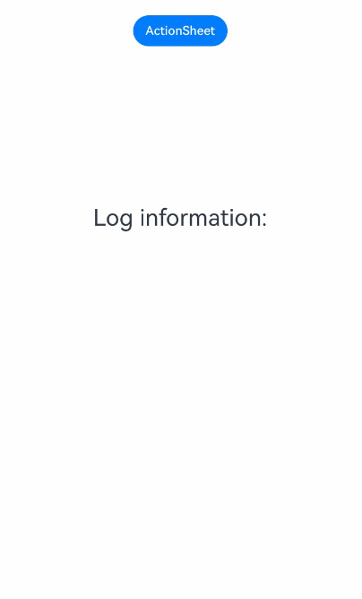
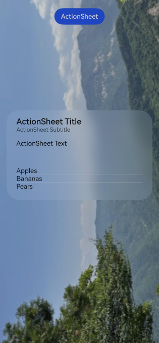
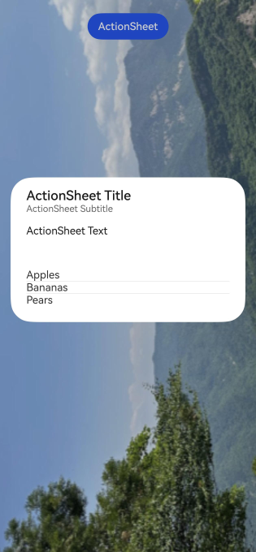

# Action Sheet (ActionSheet)
<!--Kit: ArkUI-->
<!--Subsystem: ArkUI-->
<!--Owner: @houguobiao-->
<!--Designer: @houguobiao-->
<!--Tester: @lxl007-->
<!--Adviser: @HelloCrease-->

An action sheet is a dialog box that displays actions a user can take.

>  **NOTE**
>
>  The initial APIs of this module are supported since API version 8. Updates will be marked with a superscript to indicate their earliest API version.
>
> The functionality of this module depends on UI context. This means that the APIs of this module cannot be used where [the UI context is unclear](../../../ui/arkts-global-interface.md). For details, see [UIContext](../arkts-apis-uicontext-uicontext.md).

## ActionSheetOptions

ActionSheet options.

**System capability**: SystemCapability.ArkUI.ArkUI.Full

| Name     | Type                   | Read-Only| Optional| Description                         |
| ---------- | -------------------------- | ------- | ----------------------------- | ----------------------------- |
| title      | string \| [Resource](ts-types.md#resource) | No   | No   |  Title of the dialog box.<br>If the text is too long to display, it is truncated with an ellipsis (...).<br>**Atomic service API**: This API can be used in atomic services since API version 11.|
| subtitle<sup>10+</sup> | [ResourceStr](ts-types.md#resourcestr) | No| Yes| Subtitle of the dialog box.<br>If the text is too long to display, it is truncated with an ellipsis (...).<br>**Atomic service API**: This API can be used in atomic services since API version 11.|
| message    | string \| [Resource](ts-types.md#resource) | No   | No   | Content of the dialog box.<br>If the text is too long to display, a scrollbar is displayed.<br>**Atomic service API**: This API can be used in atomic services since API version 11. |
| autoCancel | boolean                           | No    | Yes   | Whether to close the dialog box when the overlay is clicked.<br>Default value: **true**<br>The value **true** means to close the dialog box when the overlay is clicked, and **false** means the opposite.<br>**Atomic service API**: This API can be used in atomic services since API version 11.|
| confirm    | [ActionSheetButtonOptions](#actionsheetbuttonoptions18) | No | Yes| Information about the confirm button. When the dialog box has focus and the **Tab** key is not pressed for sequential focus navigation, the button responds to the **Enter** key by default. In the case of multiple dialog boxes, the button can automatically obtain the focus and respond continuously. The default response to the **Enter** key does not work when **defaultFocus** is set to **true**.<br>**Atomic service API**: This API can be used in atomic services since API version 11.|
| cancel     | [VoidCallback](ts-types.md#voidcallback12) | No    | Yes   | Callback invoked when the dialog box is closed after the overlay is clicked.<br>**Atomic service API**: This API can be used in atomic services since API version 11. |
| alignment  | [DialogAlignment](ts-methods-alert-dialog-box.md#dialogalignment) | No    | Yes   |  Alignment mode of the dialog box in the vertical direction.<br>Default value: **DialogAlignment.Bottom**<br>**Atomic service API**: This API can be used in atomic services since API version 11.<br>**NOTE**<br>If showInSubWindow is set to true in the UIExtension, the dialog box is aligned based on the host window of the UIExtension.|
| offset     | [ActionSheetOffset](#actionsheetoffset18) | No     | Yes    | Offset of the dialog box relative to the alignment position.<br>Default value:<br>1. When alignment is set to **Top**, **TopStart**, or **TopEnd**: {dx: 0,dy: "40vp"}<br>2. When **alignment** is set to any other value: {dx: 0,dy: "-40vp"}<br>**Atomic service API**: This API can be used in atomic services since API version 11.|
| sheets     | Array&lt;[SheetInfo](#sheetinfo)&gt; | No     | No     | Options in the dialog box. Each option supports the image, text, and callback.<br>**Atomic service API**: This API can be used in atomic services since API version 11.|
| maskRect<sup>10+</sup> | [Rectangle](ts-methods-alert-dialog-box.md#rectangle8) | No    | Yes  | Mask area of the dialog box. Events outside the mask area are transparently transmitted, and events within the mask area are not.<br>Default value: **{ x: 0, y: 0, width: '100%', height: '100%' }**<br>**NOTE**<br>**maskRect** does not take effect when **showInSubWindow** is set to **true**.<br>**Atomic service API**: This API can be used in atomic services since API version 11.|
| showInSubWindow<sup>11+</sup> | boolean | No| Yes| Whether to show the dialog box in a subwindow when the dialog box needs to be displayed outside the main window. **true**: The dialog box is shown in a subwindow.<br>Default value: **false**<br>**NOTE**<br>A dialog box whose **showInSubWindow** attribute is **true** cannot trigger the display of another dialog box whose **showInSubWindow** attribute is also **true**.<br>**Atomic service API**: This API can be used in atomic services since API version 12.|
| isModal<sup>11+</sup> | boolean | No| Yes| Whether the dialog box is a modal. A modal dialog box has a mask applied, while a non-modal dialog box does not. **false**: The dialog box is not a modal.<br>Default value: **true**<br>**Atomic service API**: This API can be used in atomic services since API version 12.|
| backgroundColor<sup>11+</sup> | [ResourceColor](ts-types.md#resourcecolor)  | No| Yes| Background color of the dialog box.<br>Default value: **Color.Transparent**<br>**NOTE**<br>The background color will be visually combined with the blur effect when both properties are set. If the resulting effect does not match your design requirements, you can disable the blur effect entirely by explicitly setting the **backgroundBlurStyle** property to **BlurStyle.NONE**.<br>**Atomic service API**: This API can be used in atomic services since API version 12.|
| backgroundBlurStyle<sup>11+</sup> | [BlurStyle](ts-universal-attributes-background.md#blurstyle9) | No| Yes| Background blur style of the dialog box.<br>Default value: **BlurStyle.COMPONENT_ULTRA_THICK**<br>**NOTE**<br>Setting this parameter to **BlurStyle.NONE** disables the background blur. When **backgroundBlurStyle** is set to a value other than **NONE**, do not set **backgroundColor**. If you do, the color display may not produce the expected visual effect.<br>**Atomic service API**: This API can be used in atomic services since API version 12.|
| backgroundBlurStyleOptions<sup>19+</sup> | [BackgroundBlurStyleOptions](ts-universal-attributes-background.md#backgroundblurstyleoptions10)| No| Yes| Options for customizing the background blur style. For details about the default value, see **BackgroundBlurStyleOptions**.<br>**Atomic service API**: This API can be used in atomic services since API version 19.|
| backgroundEffect<sup>19+</sup> | [BackgroundEffectOptions](ts-universal-attributes-background.md#backgroundeffectoptions11) | No| Yes| Options for customizing the background effect. For details about the default value, see **BackgroundEffectOptions**.<br>**Atomic service API**: This API can be used in atomic services since API version 19.|
| onWillDismiss<sup>12+</sup> | Callback<[DismissDialogAction](#dismissdialogaction12)> | No| Yes| Callback for interactive closure of the dialog box.<br>**NOTE**<br>1. If this callback is registered, the dialog box will not be dismissed immediately after the user touches the mask or the Back button, presses the Esc key, or swipes left or right on the screen. The **reason** parameter in the callback is used to determine whether the dialog box can be closed. The reason returned by the component does not support the value **CLOSE_BUTTON**.<br>2. In the **onWillDismiss** callback, another **onWillDismiss** callback is not allowed.<br>**Atomic service API**: This API can be used in atomic services since API version 12.|
| cornerRadius<sup>12+</sup> | [Dimension](ts-types.md#dimension10) \| [BorderRadiuses](ts-types.md#borderradiuses9)  \|  [LocalizedBorderRadiuses](ts-types.md#localizedborderradiuses12) | No| Yes| Corner radius of the background.<br>You can set the radius for each of the four corners individually.<br>Default value: **{ topLeft: '32vp', topRight: '32vp', bottomLeft: '32vp', bottomRight: '32vp' }**<br> The corner radius is subject to the component size, with the maximum value being half of the component width or height. If the value is negative, the default value is used.<br> When set to a percentage, the value defines the radius as a percentage of the parent component's width or height.<br>**NOTE**<br>When **cornerRadius** is of type LocalizedBorderRadiuses, the layout order can be dynamically adjusted based on the user's language settings.<br>**Atomic service API**: This API can be used in atomic services since API version 12.|
| borderWidth<sup>12+</sup> | [Dimension](ts-types.md#dimension10) \| [EdgeWidths](ts-types.md#edgewidths9) \| [LocalizedEdgeWidths](ts-types.md#localizededgewidths12) | No| Yes| Border width of the dialog box.<br>You can set the width for all four sides or set separate widths for individual sides.<br>Default value: **0**<br> When set to a percentage, the value defines the border width as a percentage of the parent dialog box's width.<br>If the left and right borders are greater than its width, or the top and bottom borders are greater than its height, the dialog box may not display as expected.<br>**NOTE**<br>When **borderWidth** is of type LocalizedEdgeWidths, the layout order can be dynamically adjusted based on the user's language settings.<br>**Atomic service API**: This API can be used in atomic services since API version 12.|
| borderColor<sup>12+</sup> | [ResourceColor](ts-types.md#resourcecolor) \| [EdgeColors](ts-types.md#edgecolors9) \| [LocalizedEdgeColors](ts-types.md#localizededgecolors12) | No| Yes| Border color of the dialog box.<br>Default value: **Color.Black**<br> **borderColor** must be used with **borderWidth** in pairs.<br>**NOTE**<br>When **borderColor** is of type LocalizedEdgeColors, the layout order can be dynamically adjusted based on the user's language settings.<br>**Atomic service API**: This API can be used in atomic services since API version 12.|
| borderStyle<sup>12+</sup> | [BorderStyle](ts-appendix-enums.md#borderstyle) \| [EdgeStyles](ts-types.md#edgestyles9)  | No| Yes| Border style of the dialog box.<br>Default value: **BorderStyle.Solid**<br> **borderStyle** must be used with **borderWidth** in pairs.<br>**Atomic service API**: This API can be used in atomic services since API version 12.|
| width<sup>12+</sup> | [Dimension](ts-types.md#dimension10)   | No| Yes| Width of the dialog box.<br>**NOTE**<br>- Default maximum width of the dialog box: 400 vp<br>- When this parameter is set to a percentage, the reference width of the dialog box is the width of the window where the dialog box is located. You can decrease or increase the width as needed.<br>**Atomic service API**: This API can be used in atomic services since API version 12.|
| height<sup>12+</sup> | [Dimension](ts-types.md#dimension10)   | No| Yes| Height of the dialog box.<br>**NOTE**<br>- Default maximum height of the dialog box: 0.9 x (Window height – Safe area)<br>- When this parameter is set to a percentage, the reference height of the dialog box is the height of the window where the dialog box is located minus the safe area. You can decrease or increase the height as needed.<br>**Atomic service API**: This API can be used in atomic services since API version 12.|
| shadow<sup>12+</sup> | [ShadowOptions](ts-universal-attributes-image-effect.md#shadowoptions) \| [ShadowStyle](ts-universal-attributes-image-effect.md#shadowstyle10)   | No| Yes| Shadow of the dialog box.<br> Default value on 2-in-1 devices: **ShadowStyle.OUTER_FLOATING_MD** when the dialog box is focused and **ShadowStyle.OUTER_FLOATING_SM** otherwise On other devices, the dialog box has no shadow by default.<br>**Atomic service API**: This API can be used in atomic services since API version 12.|
| transition<sup>12+</sup> | [TransitionEffect](ts-transition-animation-component.md#transitioneffect10) | No| Yes| Transition effect for the entrance and exit of the dialog box.<br>**NOTE**<br>1. If this parameter is not set, the default effect is used.<br>2. Touching the Back button during the entrance animation pauses the entrance animation and starts the exit animation. The final effect is one obtained after the curves of the entrance and exit animations are combined.<br>3. Touching the Back button during the exit animation does not affect the animation playback. Touching the Back button again closes the application.<br>**Atomic service API**: This API can be used in atomic services since API version 12.|
| enableHoverMode<sup>14+</sup>     | boolean | No  | Yes | Whether to respond to the hover state. The value true indicates that the hover state is responded to.<br>Default value: **false**, meaning not to enable the hover mode.<br>**Atomic service API**: This API can be used in atomic services since API version 14.|
| hoverModeArea<sup>14+</sup>       | [HoverModeAreaType](ts-universal-attributes-sheet-transition.md#hovermodeareatype14) | No  | Yes | Display area of the dialog box in hover mode.<br>Default value: **HoverModeAreaType.BOTTOM_SCREEN**<br>**Atomic service API**: This API can be used in atomic services since API version 14.|
| onWillAppear<sup>19+</sup> | Callback&lt;void&gt; | No| Yes| Event callback when the dialog box is about to appear.<br>**NOTE**<br>1. The normal timing sequence is as follows: onWillAppear > onDidAppear > onWillDisappear > onDidDisappear.<br>2. You can set the callback event for changing the dialog box display effect in **onWillAppear**. The settings take effect next time the dialog box appears.<br>**Atomic service API**: This API can be used in atomic services since API version 19.|
| onDidAppear<sup>19+</sup> | Callback&lt;void&gt; | No| Yes| Event callback when the dialog box appears.<br>**NOTE**<br>1. The normal timing sequence is as follows: onWillAppear > onDidAppear > onWillDisappear > onDidDisappear.<br>2. You can set the callback event for changing the dialog box display effect in **onDidAppear**. The settings take effect next time the dialog box appears.<br>3. When a dialog box is dismissed immediately after being shown, **onWillDisappear** may be triggered before **onDidAppear**.<br>4. If the dialog box is dismissed before its entrance animation is finished, the animation will be interrupted, and **onDidAppear** will not be triggered.<br>**Atomic service API**: This API can be used in atomic services since API version 19.|
| onWillDisappear<sup>19+</sup> | Callback&lt;void&gt; | No| Yes| Event callback when the dialog box is about to disappear.<br>**NOTE**<br>The normal sequence is as follows: onWillAppear >> onDidAppear >> onWillDisappear >> onDidDisappear.<br> **Atomic service API**: This API can be used in atomic services since API version 19.|
| onDidDisappear<sup>19+</sup> | Callback&lt;void&gt; | No| Yes| Event callback when the dialog box disappears.<br>**NOTE**<br>The normal sequence is as follows: onWillAppear >> onDidAppear >> onWillDisappear >> onDidDisappear.<br>**Atomic service API**: This API can be used in atomic services since API version 19.|
| levelMode<sup>15+</sup>       | [LevelMode](#levelmode15) | No  | Yes | Display level of the dialog box.<br>**NOTE**<br>- Default value: LevelMode.OVERLAY<br>- This parameter takes effect only when showInSubWindow is set to false.<br>**Atomic service API**: This API can be used in atomic services since API version 15.|
| levelUniqueId<sup>15+</sup>       | number | No  | Yes | [Unique ID](../js-apis-arkui-frameNode.md#getuniqueid12) of the node under the display level for the page-level dialog box.<br>Value range: a number no less than 0<br>**NOTE**<br>- This parameter takes effect only when **levelMode** is set to **LevelMode.EMBEDDED**.<br>**Atomic service API**: This API can be used in atomic services since API version 15.|
| immersiveMode<sup>15+</sup>       | [ImmersiveMode](#immersivemode15) | No  | Yes | Overlay effect for the page-level dialog box.<br>**NOTE**<br>- Default value: **ImmersiveMode.DEFAULT**<br>- This parameter takes effect only when **levelMode** is set to **LevelMode.EMBEDDED**.<br>**Atomic service API**: This API can be used in atomic services since API version 15.|
| levelOrder<sup>18+</sup>       | [LevelOrder](../js-apis-promptAction.md#levelorder18) | No  | Yes | Display order of the dialog box.<br>**NOTE**<br>- Default value: **LevelOrder.clamp(0)**<br>- Dynamic updating is not supported.<br>**Atomic service API**: This API can be used in atomic services since API version 18.|

## SheetInfo

Option content in the pop-up. You can set the text, icon, and callback for each option.

**Atomic service API**: This API can be used in atomic services since API version 11.

**System capability**: SystemCapability.ArkUI.ArkUI.Full

| Name| Type                                                    | Read-Only| Optional| Description        |
| ------ | ------------------------------------------------------------ | ---- | ----------------- | ----------------- |
| title  | string \| [Resource](ts-types.md#resource) | No | No | Sheet text.<br>If the text is too long to display, a scrollbar is displayed.|
| icon   | string \| [Resource](ts-types.md#resource) | No  | Yes | Sheet icon. By default, no icon is displayed.<br>The string type can be used to load local images and, more frequently, online images. The value can be a relative path to a local image, for example, **Image("common/test.jpg")**.|
| action | [VoidCallback](ts-types.md#voidcallback12) | No | No | Callback when the sheet is selected.|

## LevelMode<sup>15+</sup>

type LevelMode = LevelMode

Defines the display level for the dialog box.

**Atomic service API**: This API can be used in atomic services since API version 15.

**System capability**: SystemCapability.ArkUI.ArkUI.Full

| Type                                                       | Description                |
| ----------------------------------------------------------- | -------------------- |
| [LevelMode](../js-apis-promptAction.md#levelmode15) | Display level of the dialog box.|

## ImmersiveMode<sup>15+</sup>

type ImmersiveMode = ImmersiveMode

Defines the overlay effect for the dialog box.

**Atomic service API**: This API can be used in atomic services since API version 15.

**System capability**: SystemCapability.ArkUI.ArkUI.Full

| Type                                                        | Description                      |
| ------------------------------------------------------------ | -------------------------- |
| [ImmersiveMode](../js-apis-promptAction.md#immersivemode15) | Overlay effect for the page-level dialog box.|

## DismissDialogAction<sup>12+</sup>

Provides information about the action to dismiss the dialog box.

**Atomic service API**: This API can be used in atomic services since API version 12.

**System capability**: SystemCapability.ArkUI.ArkUI.Full

### Properties

| Name   | Type                                                        | Read-Only| Optional| Description                                                        |
| ------- | ------------------------------------------------------------ | ---- | ---- | ------------------------------------------------------------ |
| dismiss | Callback&lt;void&gt;                                         | No  | No  | Callback for dismissing the dialog box. This API is called only when the dialog box needs to be exited.|
| reason  | [DismissReason](ts-universal-attributes-popup.md#dismissreason12) | No  | No  | Reason why the dialog box cannot be dismissed. You must specify whether to close the dialog box for each of the listed actions.|

## ActionSheetButtonOptions<sup>18+</sup>

Button style in the dialog box.

> **NOTE**
>
> To standardize anonymous object definitions, the element definitions here have been revised in API version 18. While historical version information is preserved for anonymous objects, there may be cases where the outer element's @since version number is higher than inner elements'. This does not affect interface usability.

**Atomic service API**: This API can be used in atomic services since API version 18.

**System capability**: SystemCapability.ArkUI.ArkUI.Full

| Name        | Type   | Read-Only| Optional| Description|
| ------------ | ------- | ---- | ---- | ---- |
| enabled<sup>10+</sup> | boolean | No  | Yes | Whether to respond when the button is clicked. The value **true** means to respond when the button is clicked, and **false** means the opposite.<br>Default value: **true**<br>**Atomic service API**: This API can be used in atomic services since API version 11.|
| defaultFocus<sup>10+</sup> | boolean | No  | Yes | Whether the button is the default focus. The value **true** means that the button is the default focus, and **false** means the opposite.<br>Default value: **false**<br>**Atomic service API**: This API can be used in atomic services since API version 11.|
| style<sup>10+</sup> | [DialogButtonStyle](ts-appendix-enums.md#dialogbuttonstyle10) | No | Yes| Button style.<br>Default value: **DialogButtonStyle.DEFAULT**<br>**Atomic service API**: This API can be used in atomic services since API version 11.|
| value<sup>8+</sup> |  string \| [Resource](ts-types.md#resource) |   No |   No | Button text.<br>If the text is too long to display, it is truncated with an ellipsis (...).<br>**Atomic service API**: This API can be used in atomic services since API version 11.|
| action<sup>8+</sup> | [VoidCallback](ts-types.md#voidcallback12)      |   No  |   No  | Callback invoked when the button is selected.<br>**Atomic service API**: This API can be used in atomic services since API version 11.|

## ActionSheetOffset<sup>18+</sup>

Alignment mode of the pop-up window.

**Atomic service API**: This API can be used in atomic services since API version 18.

**System capability**: SystemCapability.ArkUI.ArkUI.Full

| Name| Type                                                        | Read-Only| Optional| Description                                                        |
| ---- | ------------------------------------------------------------ | ---- | ---- | ------------------------------------------------------------ |
| dx   | number \| string \| [Resource](ts-types.md#resource) | No  | No  | Offset of the action sheet along the x-axis relative to the alignment position.<br>String type. Specify the length unit explicitly, for example, **'10px'**, or provide the length in percentage, for example, **'100%'**.<br>**NOTE**<br>If the unit is not specified, the default unit vp is used, in which case '10' is equivalent to 10 vp.|
| dy   | number \| string \| [Resource](ts-types.md#resource) | No  | No  | Offset of the action sheet along the y-axis relative to the alignment position.<br>String type. Specify the length unit explicitly, for example, **'10px'**, or provide the length in percentage, for example, **'100%'**.<br>**NOTE**<br>If the unit is not specified, the default unit vp is used, in which case '10' is equivalent to 10 vp.|

## ActionSheet

### show<sup>(deprecated)</sup>

static show(value: ActionSheetOptions)

Shows an action sheet in the given settings.

> **NOTE**
> 
> This API has been deprecated since API version 18. You are advised to use [showActionSheet](../arkts-apis-uicontext-uicontext.md#showactionsheet) in [UIContext](../arkts-apis-uicontext-uicontext.md).
>
> Since API version 10, you can use [showActionSheet](../arkts-apis-uicontext-uicontext.md#showactionsheet) in [UIContext](../arkts-apis-uicontext-uicontext.md) to specify the UI execution context.

**Atomic service API**: This API can be used in atomic services since API version 11.

**System capability**: SystemCapability.ArkUI.ArkUI.Full

**Parameters**

| Name| Type                                             | Mandatory| Description                    |
| ------ | ------------------------------------------------- | ---- | ------------------------ |
| value  | [ActionSheetOptions](#actionsheetoptions) | Yes  | Parameters of the action sheet.|

## Example

> **NOTE**
> 
> Using ActionSheet directly may cause the instance to be unclear. You are advised to use getUIContext() to obtain the [UIContext](../arkts-apis-uicontext-uicontext.md) instance and use [showActionSheet](../arkts-apis-uicontext-uicontext.md#showactionsheet) to call ActionSheet.show() of the bound instance.

### Example 1: Displaying an Action Sheet

This example demonstrates how to display an action sheet when a button is touched.

```ts
// xxx.ets
@Entry
@Component
struct ActionSheetExample {
  build() {
    Flex({ direction: FlexDirection.Column, alignItems: ItemAlign.Center, justifyContent: FlexAlign.Center }) {
      Button('Click to Show ActionSheet')
        .onClick(() => {
          this.getUIContext().showActionSheet({
            title: 'ActionSheet title',
            subtitle: 'ActionSheet subtitle',
            message: 'message',
            autoCancel: true,
            confirm: {
              defaultFocus: true,
              value: 'Confirm button',
              action: () => {
                console.info('Get ActionSheet handled');
              }
            },
            cancel: () => {
              console.info('ActionSheet canceled');
            },
            onWillDismiss: (dismissDialogAction: DismissDialogAction) => {
              console.info(`reason= ${dismissDialogAction.reason}`);
              console.info('ActionSheet onWillDismiss');
              if (dismissDialogAction.reason === DismissReason.PRESS_BACK) {
                dismissDialogAction.dismiss();
              }
              if (dismissDialogAction.reason === DismissReason.TOUCH_OUTSIDE) {
                dismissDialogAction.dismiss();
              }
            },
            alignment: DialogAlignment.Bottom,
            offset: { dx: 0, dy: -10 },
            sheets: [
              {
                title: 'apples',
                action: () => {
                  console.info('apples');
                }
              },
              {
                title: 'bananas',
                action: () => {
                  console.info('bananas');
                }
              },
              {
                title: 'pears',
                action: () => {
                  console.info('pears');
                }
              }
            ]
          })
        })
    }.width('100%')
    .height('100%')
  }
}
```


### Example 2: Opening an Action Sheet Outside the Main Window

This example demonstrates how to configure an action sheet to display outside the main window on a 2-in-1 device by setting **showInSubWindow** to **true**.

```ts
// xxx.ets
@Entry
@Component
struct ActionSheetExample {
  build() {
    Flex({ direction: FlexDirection.Column, alignItems: ItemAlign.Center, justifyContent: FlexAlign.Center }) {
      Button('Click to Show ActionSheet')
        .onClick(() => {
          this.getUIContext().showActionSheet({
            title: 'ActionSheet title',
            subtitle: 'ActionSheet subtitle',
            message: 'message',
            autoCancel: true,
            showInSubWindow: true,
            isModal: true,
            confirm: {
              defaultFocus: true,
              value: 'Confirm button',
              action: () => {
                console.info('Get ActionSheet handled');
              }
            },
            cancel: () => {
              console.info('ActionSheet canceled');
            },
            onWillDismiss: (dismissDialogAction: DismissDialogAction) => {
              console.info(`reason= ${dismissDialogAction.reason}`);
              console.info('ActionSheet onWillDismiss');
              if (dismissDialogAction.reason === DismissReason.PRESS_BACK) {
                dismissDialogAction.dismiss();
              }
              if (dismissDialogAction.reason === DismissReason.TOUCH_OUTSIDE) {
                dismissDialogAction.dismiss();
              }
            },
            alignment: DialogAlignment.Center,
            offset: { dx: 0, dy: -10 },
            sheets: [
              {
                title: 'apples',
                action: () => {
                  console.info('apples');
                }
              },
              {
                title: 'bananas',
                action: () => {
                  console.info('bananas');
                }
              },
              {
                title: 'pears',
                action: () => {
                  console.info('pears');
                }
              }
            ]
          })
        })
    }.width('100%')
    .height('100%')
  }
}
```


### Example 3: Setting the Action Sheet Animation

This example illustrates how to use the **transition** API to create custom animation effects for the dialog box's appearance and disappearance.

```ts
// xxx.ets
@Entry
@Component
struct ActionSheetExample {
  build() {
    Column({ space: 5 }) {
      Button('ActionSheet Set Duration')
        .onClick(() => {
          this.getUIContext().showActionSheet({
            title: 'ActionSheet 1',
            message: 'Set Animation Duration open 3 second, close 100 ms',
            autoCancel: true,
            alignment: DialogAlignment.Top,
            transition: TransitionEffect.asymmetric(TransitionEffect.OPACITY
              .animation({ duration: 3000, curve: Curve.Sharp })
              .combine(TransitionEffect.scale({ x: 1.5, y: 1.5 }).animation({ duration: 3000, curve: Curve.Sharp })),
              TransitionEffect.OPACITY.animation({ duration: 100, curve: Curve.Smooth })
                .combine(TransitionEffect.scale({ x: 0.5, y: 0.5 }).animation({ duration: 100, curve: Curve.Smooth }))),
            offset: { dx: 0, dy: -20 },
            confirm: {
              value: 'button',
              action: () => {
                console.info('Button-clicking callback');
              }
            },
            cancel: () => {
              console.info('Closed callbacks');
            },
            sheets: [
              {
                title: 'apples',
                action: () => {
                  console.info('apples');
                }
              },
              {
                title: 'bananas',
                action: () => {
                  console.info('bananas');
                }
              },
              {
                title: 'pears',
                action: () => {
                  console.info('pears');
                }
              }
            ]
          })
        }).backgroundColor(0x317aff).height("88px")
    }.width('100%').margin({ top: 5 })
  }
}
```


### Example 4: Setting the Action Sheet Style

This example defines the style of ActionSheet, such as the width, height, background color, and shadow.

```ts
// xxx.ets
@Entry
@Component
struct ActionSheetExample {
  build() {
    Flex({ direction: FlexDirection.Column, alignItems: ItemAlign.Center }) {
      Button('Click to Show ActionSheet')
        .onClick(() => {
          this.getUIContext().showActionSheet({
            title: 'ActionSheet title',
            subtitle: 'ActionSheet subtitle',
            message: 'message',
            autoCancel: true,
            width: 300,
            height: 350,
            cornerRadius: 20,
            borderWidth: 1,
            borderStyle: BorderStyle.Solid, //The borderStyle attribute must be used together with the borderWidth attribute.
            borderColor: Color.Blue, // borderColor must be used with borderWidth in pairs.
            backgroundColor: Color.White,
            shadow: ({
              radius: 20,
              color: Color.Grey,
              offsetX: 50,
              offsetY: 0
            }),
            confirm: {
              defaultFocus: true,
              value: 'Confirm button',
              action: () => {
                console.info('Get ActionSheet handled');
              }
            },
            cancel: () => {
              console.info('ActionSheet canceled');
            },
            onWillDismiss: (dismissDialogAction: DismissDialogAction) => {
              console.info(`reason= ${dismissDialogAction.reason}`);
              console.info('ActionSheet onWillDismiss');
              if (dismissDialogAction.reason === DismissReason.PRESS_BACK) {
                dismissDialogAction.dismiss();
              }
              if (dismissDialogAction.reason === DismissReason.TOUCH_OUTSIDE) {
                dismissDialogAction.dismiss();
              }
            },
            alignment: DialogAlignment.Bottom,
            offset: { dx: 0, dy: -10 },
            sheets: [
              {
                title: 'apples',
                action: () => {
                  console.info('apples');
                }
              },
              {
                title: 'bananas',
                action: () => {
                  console.info('bananas');
                }
              },
              {
                title: 'pears',
                action: () => {
                  console.info('pears');
                }
              }
            ]
          })
        })
    }.width('100%')
  }
}
```


### Example 5: Configuring an Action Sheet in the Hover State

<!--RP1-->This example shows how to set the dialog layout area in the hover state.<!--RP1End-->

```ts
// xxx.ets
@Entry
@Component
struct ActionSheetExample {
  build() {
    Flex({ direction: FlexDirection.Column, alignItems: ItemAlign.Center, justifyContent: FlexAlign.Center }) {
      Button('Click to Show ActionSheet')
        .onClick(() => {
          this.getUIContext().showActionSheet({
            title: 'ActionSheet title',
            subtitle: 'ActionSheet subtitle',
            message: 'message',
            autoCancel: true,
            confirm: {
              defaultFocus: true,
              value: 'Confirm button',
              action: () => {
                console.info('Get ActionSheet handled');
              }
            },
            cancel: () => {
              console.info('ActionSheet canceled');
            },
            onWillDismiss: (dismissDialogAction: DismissDialogAction) => {
              console.info(`reason= ${dismissDialogAction.reason}`);
              console.info('ActionSheet onWillDismiss');
              if (dismissDialogAction.reason === DismissReason.PRESS_BACK) {
                dismissDialogAction.dismiss();
              }
              if (dismissDialogAction.reason === DismissReason.TOUCH_OUTSIDE) {
                dismissDialogAction.dismiss();
              }
            },
            alignment: DialogAlignment.Bottom,
            offset: { dx: 0, dy: -10 },
            enableHoverMode: true,
            hoverModeArea: HoverModeAreaType.TOP_SCREEN,
            sheets: [
              {
                title: 'apples',
                action: () => {
                  console.info('apples');
                }
              },
              {
                title: 'bananas',
                action: () => {
                  console.info('bananas');
                }
              },
              {
                title: 'pears',
                action: () => {
                  console.info('pears');
                }
              }
            ]
          })
        })
    }.width('100%')
    .height('100%')
  }
}
```

<!--RP2--><!--RP2End-->

### Example 6: Using Dialog Box Lifecycle APIs

This example demonstrates how to use the APIs provided to control the dialog box lifecycle.

```ts
// xxx.ets
@Entry
@Component
struct Example1 {
  @State log: string = 'Log information:';
  flag: boolean = false;

  build() {
    Column({ space: 5 }) {
      Button('ActionSheet')
        .onClick(() => {
          this.getUIContext().showActionSheet({
            title: 'ActionSheet',
            message: 'message',
            autoCancel: true,
            alignment: DialogAlignment.Bottom,
            offset: { dx: 0, dy: -20 },
            confirm: {
              value: 'button',
              action: () => {
                console.info('ActionSheet Button-clicking callback');
              }
            },
            cancel: () => {
              console.info('ActionSheet Closed callbacks');
            },
            sheets: [
              {
                title: 'apples',
                action: () => {
                  console.info('ActionSheet apples')
                }
              },
              {
                title: 'bananas',
                action: () => {
                  console.info('ActionSheet bananas')
                }
              },
              {
                title: 'pears',
                action: () => {
                  console.info('ActionSheet pears')
                }
              }
            ],
            onDidAppear: () => {
              this.log += '# onDidAppear';
              console.info('ActionSheet,is onDidAppear!');
            },
            onDidDisappear: () => {
              this.log += '# onDidDisappear';
              console.info('ActionSheet,is onDidDisappear!');
            },
            onWillAppear: () => {
              this.log = 'Log information:onWillAppear';
              console.info('ActionSheet,is onWillAppear!');
            },
            onWillDisappear: () => {
              this.log += '# onWillDisappear';
              console.info('ActionSheet,is onWillDisappear!');
            }
          })
        })
      Text(this.log).fontSize(30).margin({ top: 200 })
    }.width('100%').margin({ top: 5 })
  }
}
```



### Example 7: Customizing the Background Blur Effect

In API version 19 or later, you can customize the background blur effect by configuring [backgroundBlurStyleOptions](#actionsheetoptions).

```ts
@Entry
@Component
struct ActionSheetExample {
  build() {
    Stack({ alignContent: Alignment.Top }) {
      Image($r('app.media.bg'))
      Column() {
        Button("ActionSheet")
          .margin(20)
          .onClick(() => {
            this.getUIContext().showActionSheet({
              title: 'ActionSheet Title',
              subtitle: 'ActionSheet Subtitle',
              message: 'ActionSheet Text',
              sheets: [
                {
                  title: 'Apples',
                  action: () => {
                    console.info('apples');
                  }
                },
                {
                  title: 'Bananas',
                  action: () => {
                    console.info('bananas');
                  }
                },
                {
                  title: 'Pears',
                  action: () => {
                    console.info('pears');
                  }
                }
              ],
              alignment: DialogAlignment.Center,
              backgroundColor: undefined,
              backgroundBlurStyle: BlurStyle.Thin,
              backgroundBlurStyleOptions: {
                colorMode: ThemeColorMode.LIGHT,
                adaptiveColor: AdaptiveColor.AVERAGE,
                scale: 1,
                blurOptions: { grayscale: [20, 20] },
              },
            });
          })
      }.width('100%')
    }
  }
}
```



### Example 8: Customizing the Background Effect

In API version 19 or later, you can customize background effects by configuring [backgroundEffect](#actionsheetoptions).

```ts
@Entry
@Component
struct ActionSheetExample {
  build() {
    Stack({ alignContent: Alignment.Top }) {
      Image($r('app.media.bg'))
      Column() {
        Button("ActionSheet")
          .margin(20)
          .onClick(() => {
            this.getUIContext().showActionSheet({
              title: 'ActionSheet Title',
              subtitle: 'ActionSheet Subtitle',
              message: 'ActionSheet Text',
              sheets: [
                {
                  title: 'Apples',
                  action: () => {
                    console.info('apples');
                  }
                },
                {
                  title: 'Bananas',
                  action: () => {
                    console.info('bananas');
                  }
                },
                {
                  title: 'Pears',
                  action: () => {
                    console.info('pears');
                  }
                }
              ],
              alignment: DialogAlignment.Center,
              backgroundColor: undefined,
              backgroundBlurStyle: BlurStyle.Thin,
              backgroundEffect: {
                radius: 60,
                saturation: 0,
                brightness: 1,
                color: Color.White,
                blurOptions: { grayscale: [20, 20] }
              },
            });
          })
      }.width('100%')
    }
  }
}
```

