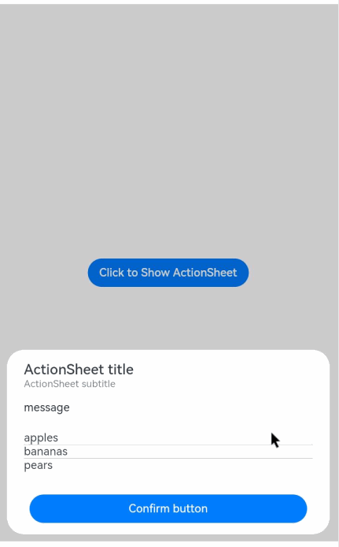
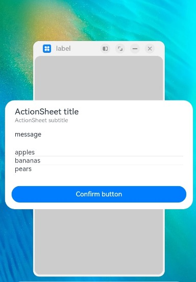
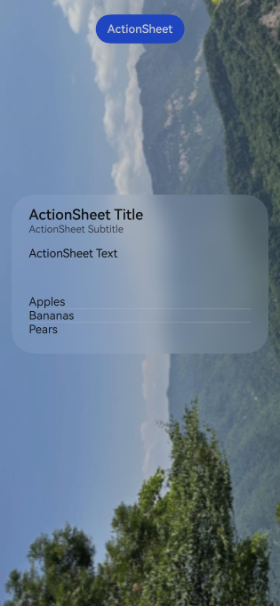
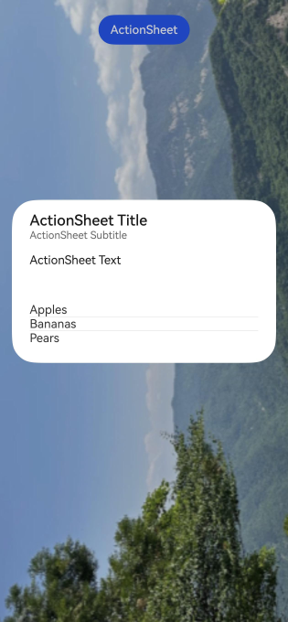
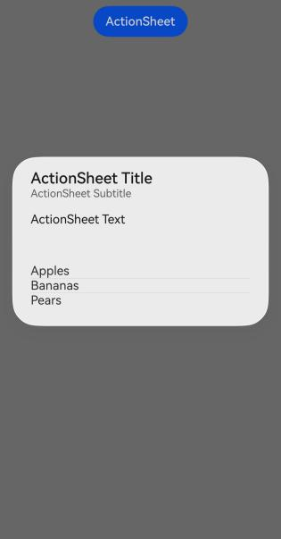

# Action Sheet (ActionSheet)

<!--Kit: ArkUI-->
<!--Subsystem: ArkUI-->
<!--Owner: @houguobiao-->
<!--Designer: @houguobiao-->
<!--Tester: @lxl007-->
<!--Adviser: @Brilliantry_Rui-->
<!-- md-trans-meta sourceCommit=d0654055576ab02270c2677e50b67065ca2d2e7e translatedAt=2026-08-24T06:57:11.438Z pushedAt=2026-08-25T07:34:43.989Z -->

A dialog box component used to display list selection items.

>  **NOTE**
>
>  The initial APIs of this module are supported since API version 8. Updates will be marked with a superscript to indicate their earliest API version.
>
> The functionality of this module depends on UI context. This means that the APIs of this module cannot be used where [the UI context is ambiguous](../../../ui/arkts-global-interface.md#ambiguous-ui-context). For details, see [UIContext](../arkts-apis-uicontext-uicontext.md).

## ActionSheetOptions

Provides **ActionSheet** configuration options.

**System capability**: SystemCapability.ArkUI.ArkUI.Full

<!--Table: 20%; 20%; 8%; 8%; 44%-->

| Name      | Type                    | Read-Only | Optional | Description                          |
| ---------- | -------------------------- | ------- | ----------------------------- | ----------------------------- |
| title      | string&nbsp;\|&nbsp;[Resource](ts-types.md#resource) | No    | No    |  Dialog box title.<br/>When the text is too long to be displayed, an ellipsis is used to replace the part that is not displayed.<br>**Atomic service API:** This API can be used in atomic services since API version 11. |
| subtitle<sup>10+</sup> | [ResourceStr](ts-types.md#resourcestr) | No | Yes | Dialog box subtitle.<br/>When the text is too long to be displayed, an ellipsis is used to replace the part that is not displayed.<br>**Atomic service API:** This API can be used in atomic services since API version 11.<br/>**Model restriction:** This API can be used only in the stage model. |
| message    | string&nbsp;\|&nbsp;[Resource](ts-types.md#resource) | No    | No    | Dialog box content.<br/>When the text is too long, a scroll bar is triggered.<br>**Atomic service API:** This API can be used in atomic services since API version 11.  |
| autoCancel | boolean                           | No     | Yes    | Whether to close the dialog box when the mask is tapped.<br>Default value: **true**<br>When the value is **true**, tapping the mask closes the dialog box; when the value is **false**, tapping the mask does not close the dialog box. <br>**Atomic service API:** This API can be used in atomic services since API version 11.|
| confirm    | [ActionSheetButtonOptions](#actionsheetbuttonoptions18) | No  | Yes | Enabling status, default focus, button style, text content, and click callback of the confirm button.<br>**Atomic service API:** This API can be used in atomic services since API version 11. |
| cancel     | [VoidCallback](ts-types.md#voidcallback12) | No     | Yes    | Callback invoked when the dialog box is closed by tapping the mask.  <br>**Atomic service API:** This API can be used in atomic services since API version 11.  |
| alignment  | [DialogAlignment](ts-methods-alert-dialog-box.md#dialogalignment) | No     | Yes    |  Alignment mode of the dialog box in the vertical direction.<br>Default value: **DialogAlignment.Bottom**  <br>**Atomic service API:** This API can be used in atomic services since API version 11.<br/>**NOTE**<br/>If **showInSubWindow** is set to true in **UIExtension**, the dialog box is aligned based on the host window of **UIExtension**.|
| offset     | [ActionSheetOffset](#actionsheetoffset18) | No      | Yes     | Offset of the dialog box relative to the position of **alignment**.<br/>Default value:<br/>1. When **alignment** is set to **Top**, **TopStart**, or **TopEnd**, the default value is **{dx:&nbsp;0,dy:&nbsp;"40vp"}**. <br/>2. When **alignment** is set to **Center**, **CenterStart**, **CenterEnd**, **Bottom**, **BottomStart**, **BottomEnd**, or **Default**, the default value is **{dx:&nbsp;0,dy:&nbsp;"-40vp"}**. <br>**Atomic service API:** This API can be used in atomic services since API version 11.|
| sheets     | Array&lt;[SheetInfo](#sheetinfo)&gt; | No      | No      | Option content. Each option supports setting an image, text, and a callback for selection. <br>**Atomic service API:** This API can be used in atomic services since API version 11.|
| maskRect<sup>10+</sup> | [Rectangle](ts-methods-alert-dialog-box.md#rectangle8) | No     | Yes   | Mask area of the dialog box. Events within the mask area are not passed through, while events outside the mask area are passed through.<br/>Default value: **{ x: 0, y: 0, width: '100%', height: '100%' }** <br/>**NOTE**<br/>When **showInSubWindow** is **true**, **maskRect** does not take effect.<br/>**Atomic service API:** This API can be used in atomic services since API version 11.<br/>**Model restriction:** This API can be used only in the stage model. |
| showInSubWindow<sup>11+</sup> | boolean | No | Yes | Whether to display the dialog box in a subwindow when it needs to be displayed outside the main window. The value **true** indicates that the dialog box is displayed in a subwindow.<br/>Default value: **false**, which means the dialog box is displayed within the app instead of in an independent subwindow.<br/>**NOTE**<br/>A dialog box with **showInSubWindow** set to **true** cannot trigger the display of another dialog box with **showInSubWindow** set to **true**.<br/>**Atomic service API:** This API can be used in atomic services since API version 12.<br/>**Model restriction:** This API can be used only in the stage model. |
| isModal<sup>11+</sup> | boolean | No | Yes | Whether the dialog box is a modal window. A modal window has a mask, while a non-modal window does not. When the value is **false**, the dialog box is a non-modal window without a mask.<br/>Default value: **true**, which means the dialog box has a mask.<br/>**Atomic service API:** This API can be used in atomic services since API version 12.<br/>**Model restriction:** This API can be used only in the stage model. |
| backgroundColor<sup>11+</sup> | [ResourceColor](ts-types.md#resourcecolor)  | No | Yes | Background color of the dialog box.<br/>Default value: **Color.Transparent**<br/>**NOTE**<br/>**backgroundColor** is superimposed with the blur attribute **backgroundBlurStyle** to produce an effect. If the effect does not meet expectations, set **backgroundBlurStyle** to **BlurStyle.NONE** to cancel the blur. When **backgroundBlurStyle** is set to a value other than NONE, do not set **backgroundColor**; otherwise, the color display will not meet expectations.<br/>**Atomic service API:** This API can be used in atomic services since API version 12.<br/>**Model restriction:** This API can be used only in the stage model. |
| backgroundBlurStyle<sup>11+</sup> | [BlurStyle](ts-universal-attributes-background.md#blurstyle9) | No | Yes | Blur material of the dialog box background.<br/>Default value: **BlurStyle.NONE** since API version 26.0.0, and **BlurStyle.COMPONENT_ULTRA_THICK** before API version 26.0.0.<br/>**NOTE**<br/>Set this attribute to **BlurStyle.NONE** to disable background blur. When **backgroundBlurStyle** is set to a value other than NONE, do not set **backgroundColor**; otherwise, the color display will not meet expectations.<br/>**Atomic service API:** This API can be used in atomic services since API version 12.<br/>**Model restriction:** This API can be used only in the stage model. |
| backgroundBlurStyleOptions<sup>19+</sup> | [BackgroundBlurStyleOptions](ts-universal-attributes-background.md#backgroundblurstyleoptions10) | No | Yes | Background blur effect. For the default value, see the **BackgroundBlurStyleOptions** type description.<br />**Atomic service API:** This API can be used in atomic services since API version 19.<br/>**Model restriction:** This API can be used only in the stage model. |
| backgroundEffect<sup>19+</sup> | [BackgroundEffectOptions](ts-universal-attributes-background.md#backgroundeffectoptions11) | No | Yes | Background effect parameters. For the default value, see the **BackgroundEffectOptions** type description.<br />**Atomic service API:** This API can be used in atomic services since API version 19.<br/>**Model restriction:** This API can be used only in the stage model. |
| onWillDismiss<sup>12+</sup> | Callback<[DismissDialogAction](#dismissdialogaction12)> | No | Yes | Interactive dismiss callback.<br/>**NOTE**<br/>1. When the user performs interactive operations such as tapping the mask to close, swiping (left/right), pressing the three-key back button, or pressing ESC on the keyboard, if this callback is registered, the dialog box will not be closed immediately. In the callback, you can obtain the operation type that blocks the dialog box closure through reason, and determine whether the dialog box can be closed based on the reason. To close the dialog box, call the **dismiss** method of [DismissDialogAction](#dismissdialogaction12) in the callback. The reason returned by the current component does not support the **CLOSE_BUTTON** enum value.<br/>2. In the **onWillDismiss** callback, **onWillDismiss** interception cannot be performed again.<br/>**Atomic service API:** This API can be used in atomic services since API version 12.<br/>**Model restriction:** This API can be used only in the stage model. |
| cornerRadius<sup>12+</sup> | [Dimension](ts-types.md#dimension10)&nbsp;\|&nbsp;[BorderRadiuses](ts-types.md#borderradiuses9) &nbsp;\|&nbsp; [LocalizedBorderRadiuses](ts-types.md#localizedborderradiuses12) | No | Yes | Corner radius of the dialog box background.<br />The radius of the four corners can be set separately.<br />Default value: **{ topLeft: '32vp', topRight: '32vp', bottomLeft: '32vp', bottomRight: '32vp' }**<br /> The corner radius is limited by the component size, and the maximum value is half of the component width or height. If the value is negative, the default value is used. <br /> Percentage parameter: the corner radius of the dialog box is set as a percentage of the width and height of the parent dialog box.<br/>**NOTE**<br/>When the **cornerRadius** attribute type is **LocalizedBorderRadiuses**, the layout order can be changed based on the language habit.<br/>**Atomic service API:** This API can be used in atomic services since API version 12.<br/>**Model restriction:** This API can be used only in the stage model. |
| borderWidth<sup>12+</sup> | [Dimension](ts-types.md#dimension10)&nbsp;\|&nbsp;[EdgeWidths](ts-types.md#edgewidths9)&nbsp;\|&nbsp;[LocalizedEdgeWidths](ts-types.md#localizededgewidths12) | No | Yes | Border width of the dialog box background.<br />The width of the four borders can be set separately.<br />Default value: **0**<br /> Percentage parameter: the border width of the dialog box is set as a percentage of the width of the parent dialog box.<br />When the left and right borders of the dialog box are greater than the dialog box width, or the top and bottom borders are greater than the dialog box height, the display may not meet expectations.<br/>**NOTE**<br/>When the **borderWidth** attribute type is **LocalizedEdgeWidths**, the layout order can be changed based on the language habit.<br/>**Atomic service API:** This API can be used in atomic services since API version 12.<br/>**Model restriction:** This API can be used only in the stage model. |
| borderColor<sup>12+</sup> | [ResourceColor](ts-types.md#resourcecolor)&nbsp;\|&nbsp;[EdgeColors](ts-types.md#edgecolors9)&nbsp;\|&nbsp;[LocalizedEdgeColors](ts-types.md#localizededgecolors12) | No | Yes | Border color of the dialog box background.<br/>Default value: **Color.Black**<br/> If the **borderColor** attribute is used, it must be used together with the **borderWidth** attribute.<br/>**NOTE**<br/>When the **borderColor** attribute type is **LocalizedEdgeColors**, the layout order can be changed based on the language habit.<br/>**Atomic service API:** This API can be used in atomic services since API version 12.<br/>**Model restriction:** This API can be used only in the stage model. |
| borderStyle<sup>12+</sup> | [BorderStyle](ts-appendix-enums.md#borderstyle)&nbsp;\|&nbsp;[EdgeStyles](ts-types.md#edgestyles9)  | No | Yes | Border style of the dialog box background.<br/>Default value: **BorderStyle.Solid**.<br/> If the **borderStyle** attribute is used, it must be used together with the **borderWidth** attribute.<br/>**Atomic service API:** This API can be used in atomic services since API version 12.<br/>**Model restriction:** This API can be used only in the stage model. |
| width<sup>12+</sup> | [Dimension](ts-types.md#dimension10)   | No | Yes | Width of the dialog box background.<br />**NOTE**<br/>- Default maximum width of the dialog box: **400vp**.<br />- Percentage parameter: the reference width of the dialog box is the width of the window where it is located, and the width can be adjusted smaller or larger based on this.<br/>**Atomic service API:** This API can be used in atomic services since API version 12.<br/>**Model restriction:** This API can be used only in the stage model. |
| height<sup>12+</sup> | [Dimension](ts-types.md#dimension10)   | No | Yes | Height of the dialog box background.<br />**NOTE**<br />- Default maximum height of the dialog box: 0.9 × (window height - safe area).<br />- Percentage parameter: the reference height of the dialog box is (window height - safe area), and the height can be adjusted smaller or larger based on this.<br/>**Atomic service API:** This API can be used in atomic services since API version 12.<br/>**Model restriction:** This API can be used only in the stage model. |
| shadow<sup>12+</sup> | [ShadowOptions](ts-universal-attributes-image-effect.md#shadowoptions)&nbsp;\|&nbsp;[ShadowStyle](ts-universal-attributes-image-effect.md#shadowstyle10)   | No | Yes | Shadow of the dialog box background. <br /> On 2-in-1 devices, in the default scenario, the shadow value when the dialog box is focused is **ShadowStyle.OUTER_FLOATING_MD**, and when it loses focus, it is **ShadowStyle.OUTER_FLOATING_SM**. Other devices have no shadow by default.<br/>**Atomic service API:** This API can be used in atomic services since API version 12.<br/>**Model restriction:** This API can be used only in the stage model. |
| transition<sup>12+</sup> | [TransitionEffect](ts-transition-animation-component.md#transitioneffect10) | No | Yes | Transition effect for the display and exit of the dialog box.<br/>**NOTE**<br/>1. If this attribute is not set, the default display/exit animation is used.<br/>2. If the back key is pressed during the display animation, the display animation is interrupted and the exit animation is executed. The animation effect is the result of superimposing the curves of the display animation and the exit animation.<br/>3. If the back key is pressed during the exit animation, the exit animation is not interrupted and continues to execute. Pressing the back key again exits the app. <br/>**Atomic service API:** This API can be used in atomic services since API version 12.<br/>**Model restriction:** This API can be used only in the stage model. |
| enableHoverMode<sup>14+</sup>     | boolean | No   | Yes  | Whether to respond to the hover state. The value **true** indicates that the hover state is responded to.<br />Default value: **false**, which means no response by default.<br />**NOTE**<br />On PCs/2-in-1 devices, the dialog box is displayed in the upper half of the screen by default. When **enableHoverMode** is set to **true**, it can be displayed in the lower half of the screen by setting the **hoverModeArea** parameter. On other devices, when **enableHoverMode** is set to **true**, the dialog box is displayed in the lower half of the screen by default, and can be displayed in the upper half of the screen by setting the **hoverModeArea** parameter.<br/>**Atomic service API:** This API can be used in atomic services since API version 14.<br/>**Model restriction:** This API can be used only in the stage model. |
| hoverModeArea<sup>14+</sup>       | [HoverModeAreaType](ts-universal-attributes-sheet-transition.md#hovermodeareatype14) | No   | Yes  | Default display area of the dialog box in the hover state.<br/>**NOTE** <br/>This attribute must be used together with the **enableHoverMode** attribute.<br/>Default value: **HoverModeAreaType.BOTTOM_SCREEN**.<br/>**Atomic service API:** This API can be used in atomic services since API version 14.<br/>**Model restriction:** This API can be used only in the stage model. |
| onWillAppear<sup>19+</sup> | Callback&lt;void&gt; | No | Yes | Event callback before the dialog box display animation.<br />**NOTE**<br />1. The normal sequence is: **onWillAppear** >> **onDidAppear** >> **onWillDisappear** >> **onDidDisappear**.<br />2. Callback events that change the dialog box display effect set in **onWillAppear** take effect the second time the dialog box is displayed. <br/>**Atomic service API:** This API can be used in atomic services since API version 19.<br/>**Model restriction:** This API can be used only in the stage model. |
| onDidAppear<sup>19+</sup> | Callback&lt;void&gt; | No | Yes | Event callback after the dialog box is displayed.<br />**NOTE**<br />1. The normal sequence is: **onWillAppear** >> **onDidAppear** >> **onWillDisappear** >> **onDidDisappear**.<br />2. Callback events that change the dialog box display effect set in **onDidAppear** take effect the second time the dialog box is displayed.<br />3. When the dialog box is quickly displayed and closed, **onWillDisappear** takes effect before **onDidAppear**.<br/>4. If the dialog box is completely closed before the entrance animation is completed, the animation is interrupted and **onDidAppear** is not triggered.<br/>**Atomic service API:** This API can be used in atomic services since API version 19.<br/>**Model restriction:** This API can be used only in the stage model. |
| onWillDisappear<sup>19+</sup> | Callback&lt;void&gt; | No | Yes | Event callback before the dialog box exit animation.<br />**NOTE**<br />1. The normal sequence is: **onWillAppear** >> **onDidAppear** >> **onWillDisappear** >> **onDidDisappear**.<br />2. When the dialog box is quickly displayed and closed, **onWillDisappear** may take effect before **onDidAppear**.<br/>**Atomic service API:** This API can be used in atomic services since API version 19.<br/>**Model restriction:** This API can be used only in the stage model. |
| **onDidDisappear**<sup>19+</sup> | Callback&lt;void&gt; | No | Yes | Event callback after the dialog box disappears.<br />**NOTE**<br />The normal sequence is: **onWillAppear** >> **onDidAppear** >> **onWillDisappear** >> **onDidDisappear**.<br/>**Atomic service API:** This API can be used in atomic services since API version 19.<br/>**Model restriction:** This API can be used only in the stage model. |
| levelMode<sup>15+</sup>       | [LevelMode](#levelmode15) | No   | Yes  | Display level of the dialog box.<br />**NOTE**<br />- Default value: **LevelMode.OVERLAY** <br />- This attribute takes effect only when **showInSubWindow** is set to false.<br />- When set to **LevelMode.EMBEDDED**, the level of the page-level dialog box can be set through **levelUniqueId**, and the mask effect of the dialog box within the page can be set through **immersiveMode**.<br/>**Atomic service API:** This API can be used in atomic services since API version 15.<br/>**Model restriction:** This API can be used only in the stage model. |
| levelUniqueId<sup>15+</sup>       | number | No   | Yes  | [getUniqueId](../js-apis-arkui-frameNode.md#getuniqueid12) of the level where the page-level dialog box needs to be displayed.<br/>Value range: a number greater than or equal to 0.<br />**NOTE**<br />- This attribute takes effect only when **levelMode** is set to **LevelMode.EMBEDDED**.<br/>**Atomic service API:** This API can be used in atomic services since API version 15.<br/>**Model restriction:** This API can be used only in the stage model. |
| immersiveMode<sup>15+</sup>       | [ImmersiveMode](#immersivemode15) | No   | Yes  | Mask effect of the dialog box within the page.<br />**NOTE**<br />- Default value: **ImmersiveMode.DEFAULT** <br />- This attribute takes effect only when **levelMode** is set to **LevelMode.EMBEDDED**.<br/>**Atomic service API:** This API can be used in atomic services since API version 15.<br/>**Model restriction:** This API can be used only in the stage model. |
| levelOrder<sup>18+</sup>       | [LevelOrder](../js-apis-promptAction.md#levelorder18) | No   | Yes  | Display order of the dialog box.<br />**NOTE**<br />- Default value: **LevelOrder.clamp(0)** <br />- Dynamic refresh of the order is not supported.<br/>**Atomic service API:** This API can be used in atomic services since API version 18.<br/>**Model restriction:** This API can be used only in the stage model. |
| systemMaterial  | [SystemUiMaterial](ts-universal-attributes-image-effect.md#systemuimaterial) | No | Yes | System material of the dialog box.<br/>**NOTE**<br/>- Default value: an [ImmersiveMaterial](../arkts-apis-uimaterial.md#immersivematerial) object whose style in [ImmersiveOptions](../arkts-apis-uimaterial.md#immersiveoptions) is **ImmersiveStyle.ULTRA_THICK**. When set to **undefined**, the default value is used.<br/>- Different materials have different effects. This API affects the background color [backgroundColor](ts-universal-attributes-background.md#backgroundcolor), background blur [backgroundBlurStyle](ts-universal-attributes-background.md#backgroundblurstyle9), background effect [backgroundEffect](ts-universal-attributes-background.md#backgroundeffect11), border color [borderColor](ts-universal-attributes-border.md#bordercolor), border width [borderWidth](ts-universal-attributes-border.md#borderwidth), and shadow [shadow](ts-universal-attributes-image-effect.md#shadow). When the system material is set, the preceding APIs do not take effect.<br/>**Since:** 26.0.0<br/>**Model restriction:** This API can be used only in the stage model.<br/>**Atomic service API:** This API can be used in atomic services since API version 26.0.0.|

## SheetInfo

Defines the option content in the dialog box. You can configure the text, icon, and callback for each option.

**Atomic service API**: This API can be used in atomic services since API version 11.

**System capability**: SystemCapability.ArkUI.ArkUI.Full

| Name| Type                                                    | Read-Only| Optional| Description        |
| ------ | ------------------------------------------------------------ | ---- | ----------------- | ----------------- |
| title  | string&nbsp;\|&nbsp;[Resource](ts-types.md#resource) | No | No | Sheet text.<br>If the text is too long to display, a scrollbar is displayed.|
| icon   | string&nbsp;\|&nbsp;[Resource](ts-types.md#resource) | No  | Yes | Sheet icon. By default, no icon is displayed.<br>The string type can be used to load local images and, more frequently, online images. The value can be a relative path to a local image, for example, **Image("common/test.jpg")**.|
| action | [VoidCallback](ts-types.md#voidcallback12) | No | No | Callback when the sheet is selected.|

## LevelMode<sup>15+</sup>

type LevelMode = import('../api/@ohos.promptAction').LevelMode

Defines the display level mode for the dialog box.

**Atomic service API**: This API can be used in atomic services since API version 15.

**Model restriction**: This API can be used only in the stage model.

**System capability**: SystemCapability.ArkUI.ArkUI.Full

| Type                                                       | Description                |
| ----------------------------------------------------------- | -------------------- |
| import('../api/@ohos.promptAction').[LevelMode](../js-apis-promptAction.md#levelmode15) | Display level of the dialog box. |

## ImmersiveMode<sup>15+</sup>

type ImmersiveMode = import('../api/@ohos.promptAction').ImmersiveMode

Defines the overlay effect for the dialog box.

**Atomic service API**: This API can be used in atomic services since API version 15.

**Model restriction**: This API can be used only in the stage model.

**System capability**: SystemCapability.ArkUI.ArkUI.Full

| Type                                                        | Description                      |
| ------------------------------------------------------------ | -------------------------- |
| import('../api/@ohos.promptAction').[ImmersiveMode](../js-apis-promptAction.md#immersivemode15) | Mask effect of the dialog box in the settings page. |

## DismissDialogAction<sup>12+</sup>

Defines the information about the dialog box dismissal.

**Atomic service API**: This API can be used in atomic services since API version 12.

**Model restriction**: This API can be used only in the stage model.

**System capability**: SystemCapability.ArkUI.ArkUI.Full

### Properties

| Name   | Type                                                        | Read-Only| Optional| Description                                                        |
| ------- | ------------------------------------------------------------ | ---- | ---- | ------------------------------------------------------------ |
| dismiss | Callback&lt;void&gt;                                         | No   | No   | Callback for the dialog box dismiss event. The developer calls it when the dialog box needs to be closed. If the dialog box does not need to be closed, it is not called, and the dialog box remains open. |
| reason  | [DismissReason](ts-universal-attributes-popup.md#dismissreason12) | No   | No   | Type of the operation that triggers closing of the dialog box. The developer can determine the user's closing operation based on **reason** and decide whether to call **dismiss** to close the dialog box. |

## ActionSheetButtonOptions<sup>18+</sup>

Provides button style configuration for the dialog box.

> **NOTE**
>
> To standardize anonymous object definitions, the element definitions here have been revised in API version 18. While historical version information is preserved for anonymous objects, there may be cases where the outer element's @since version number is higher than inner elements'. This does not affect interface usability.

**Atomic service API**: This API can be used in atomic services since API version 18.

**Model restriction**: This API can be used only in the stage model.

**System capability**: SystemCapability.ArkUI.ArkUI.Full

| Name        | Type   | Read-Only| Optional| Description|
| ------------ | ------- | ---- | ---- | ---- |
| enabled<sup>10+</sup> | boolean | No  | Yes | Whether to respond when the button is clicked. The value **true** means to respond when the button is clicked, and **false** means the opposite.<br>Default value: **true**<br>**Atomic service API**: This API can be used in atomic services since API version 11.|
| defaultFocus<sup>10+</sup> | boolean | No   | Yes  | Whether the button is the default focus. The value **true** indicates that the button is the default focus, and **false** indicates the opposite. When the dialog box gains focus and no focus traversal is performed using the Tab key, this button responds to the Enter key by default. In the case of multiple dialog boxes, the button can automatically gain focus and respond continuously. The default Enter key response capability does not take effect when defaultFocus is true.<br/>Default value: false<br/>**Atomic service API:** This API can be used in atomic services since API version 11. |
| style<sup>10+</sup> | [DialogButtonStyle](ts-appendix-enums.md#dialogbuttonstyle10) | No | Yes| Button style.<br>Default value: **DialogButtonStyle.DEFAULT**<br>**Atomic service API**: This API can be used in atomic services since API version 11.|
| value<sup>8+</sup> |  string&nbsp;\|&nbsp;[Resource](ts-types.md#resource) |   No |   No | Button text.<br>If the text is too long to display, it is truncated with an ellipsis (...).<br>**Atomic service API**: This API can be used in atomic services since API version 11.|
| action<sup>8+</sup> | [VoidCallback](ts-types.md#voidcallback12)      |   No  |   No  | Callback invoked when the button is selected.<br>**Atomic service API**: This API can be used in atomic services since API version 11.|

## ActionSheetOffset<sup>18+</sup>

Defines the offset of the dialog box relative to the position of **alignment**.

**Atomic service API**: This API can be used in atomic services since API version 18.

**Model restriction**: This API can be used only in the stage model.

**System capability**: SystemCapability.ArkUI.ArkUI.Full

| Name| Type                                                        | Read-Only| Optional| Description                                                        |
| ---- | ------------------------------------------------------------ | ---- | ---- | ------------------------------------------------------------ |
| dx   | number&nbsp;\|&nbsp;string&nbsp;\|&nbsp;[Resource](ts-types.md#resource) | No   | No   | Offset of the dialog box relative to the alignment position on the x-axis.<br/>A pixel unit can be specified, for example, '10px', or a percentage string can be set, for example, '100%'.<br/>**NOTE**<br/>When no pixel unit is specified, the default unit is vp. For example, '10' is equivalent to '10vp'. |
| dy   | number&nbsp;\|&nbsp;string&nbsp;\|&nbsp;[Resource](ts-types.md#resource) | No   | No   | Offset of the dialog box relative to the alignment position on the y-axis.<br/>A pixel unit can be specified, for example, '10px', or a percentage string can be set, for example, '100%'.<br/>**NOTE**<br/>When no pixel unit is specified, the default unit is vp. For example, '10' is equivalent to '10vp'. |

## ActionSheet

### show<sup>(deprecated)</sup>

static show(value: ActionSheetOptions)

Shows an action sheet in the given settings.

> **NOTE**
> 
> This API is supported since API version 8 and deprecated since API version 18. You are advised to use [showActionSheet](../arkts-apis-uicontext-uicontext.md#showactionsheet) instead. **showActionSheet** can be called only after a [UIContext](../arkts-apis-uicontext-uicontext.md) instance is obtained.
>
> Since API version 10, you can use [showActionSheet](../arkts-apis-uicontext-uicontext.md#showactionsheet) in [UIContext](../arkts-apis-uicontext-uicontext.md) to specify the UI execution context.

**Atomic service API**: This API can be used in atomic services since API version 11.

**System capability**: SystemCapability.ArkUI.ArkUI.Full

**Parameters**

| Name| Type                                             | Mandatory| Description                    |
| ------ | ------------------------------------------------- | ---- | ------------------------ |
| value  | [ActionSheetOptions](#actionsheetoptions) | Yes  | Parameters of the action sheet.|

## Example

> **NOTE**
> 
> Directly using **ActionSheet** can lead to instance ambiguity. To avoid this, obtain the [UIContext](../arkts-apis-uicontext-uicontext.md) object using the **getUIContext()** API and then use [showActionSheet](../arkts-apis-uicontext-uicontext.md#showactionsheet) to invoke the **ActionSheet.show()** method of the bound instance.

### Example 1: Displaying an Action Sheet

This example demonstrates how to display an action sheet when a button is touched.

```ts
// xxx.ets
@Entry
@Component
struct ActionSheetExample {
  build() {
    Flex({ direction: FlexDirection.Column, alignItems: ItemAlign.Center, justifyContent: FlexAlign.Center }) {
      Button('Click to Show ActionSheet')
        .onClick(() => {
          this.getUIContext().showActionSheet({
            title: 'ActionSheet title',
            subtitle: 'ActionSheet subtitle',
            message: 'message',
            autoCancel: true,
            confirm: {
              defaultFocus: true,
              value: 'Confirm button',
              action: () => {
                console.info('Get ActionSheet handled');
              }
            },
            cancel: () => {
              console.info('ActionSheet canceled');
            },
            onWillDismiss: (dismissDialogAction: DismissDialogAction) => {
              console.info(`reason= ${dismissDialogAction.reason}`);
              console.info('ActionSheet onWillDismiss');
              if (dismissDialogAction.reason === DismissReason.PRESS_BACK) {
                dismissDialogAction.dismiss();
              }
              if (dismissDialogAction.reason === DismissReason.TOUCH_OUTSIDE) {
                dismissDialogAction.dismiss();
              }
            },
            alignment: DialogAlignment.Bottom,
            offset: { dx: 0, dy: -10 },
            sheets: [
              {
                title: 'apples',
                action: () => {
                  console.info('apples');
                }
              },
              {
                title: 'bananas',
                action: () => {
                  console.info('bananas');
                }
              },
              {
                title: 'pears',
                action: () => {
                  console.info('pears');
                }
              }
            ]
          })
        })
    }.width('100%')
    .height('100%')
  }
}
```



### Example 2: Opening a Dialog Box Outside the Main Window

This example demonstrates how to configure a dialog box to display outside the main window on a 2-in-1 device by setting [showInSubWindow](#actionsheetoptions) to **true**.

```ts
// xxx.ets
@Entry
@Component
struct ActionSheetExample {
  build() {
    Flex({ direction: FlexDirection.Column, alignItems: ItemAlign.Center, justifyContent: FlexAlign.Center }) {
      Button('Click to Show ActionSheet')
        .onClick(() => {
          this.getUIContext().showActionSheet({
            title: 'ActionSheet title',
            subtitle: 'ActionSheet subtitle',
            message: 'message',
            autoCancel: true,
            showInSubWindow: true,
            isModal: true,
            confirm: {
              defaultFocus: true,
              value: 'Confirm button',
              action: () => {
                console.info('Get ActionSheet handled');
              }
            },
            cancel: () => {
              console.info('ActionSheet canceled');
            },
            onWillDismiss: (dismissDialogAction: DismissDialogAction) => {
              console.info(`reason= ${dismissDialogAction.reason}`);
              console.info('ActionSheet onWillDismiss');
              if (dismissDialogAction.reason === DismissReason.PRESS_BACK) {
                dismissDialogAction.dismiss();
              }
              if (dismissDialogAction.reason === DismissReason.TOUCH_OUTSIDE) {
                dismissDialogAction.dismiss();
              }
            },
            alignment: DialogAlignment.Center,
            offset: { dx: 0, dy: -10 },
            sheets: [
              {
                title: 'apples',
                action: () => {
                  console.info('apples');
                }
              },
              {
                title: 'bananas',
                action: () => {
                  console.info('bananas');
                }
              },
              {
                title: 'pears',
                action: () => {
                  console.info('pears');
                }
              }
            ]
          })
        })
    }.width('100%')
    .height('100%')
  }
}
```



### Example 3: Setting the Dialog Box Animation

This example illustrates how to use the [transition](#actionsheetoptions) API to create custom animation effects for the dialog box's appearance and disappearance.

```ts
// xxx.ets
@Entry
@Component
struct ActionSheetExample {
  build() {
    Column({ space: 5 }) {
      Button('ActionSheet Set Duration')
        .onClick(() => {
          this.getUIContext().showActionSheet({
            title: 'ActionSheet 1',
            message: 'Set Animation Duration open 3 second, close 100 ms',
            autoCancel: true,
            alignment: DialogAlignment.Top,
            transition: TransitionEffect.asymmetric(TransitionEffect.OPACITY
              .animation({ duration: 3000, curve: Curve.Sharp })
              .combine(TransitionEffect.scale({ x: 1.5, y: 1.5 }).animation({ duration: 3000, curve: Curve.Sharp })),
              TransitionEffect.OPACITY.animation({ duration: 100, curve: Curve.Smooth })
                .combine(TransitionEffect.scale({ x: 0.5, y: 0.5 }).animation({ duration: 100, curve: Curve.Smooth }))),
            offset: { dx: 0, dy: -20 },
            confirm: {
              value: 'button',
              action: () => {
                console.info('Button-clicking callback');
              }
            },
            cancel: () => {
              console.info('Closed callbacks');
            },
            sheets: [
              {
                title: 'apples',
                action: () => {
                  console.info('apples');
                }
              },
              {
                title: 'bananas',
                action: () => {
                  console.info('bananas');
                }
              },
              {
                title: 'pears',
                action: () => {
                  console.info('pears');
                }
              }
            ]
          })
        }).backgroundColor(0x317aff).height('88px')
    }.width('100%').margin({ top: 5 })
  }
}
```


### Example 4: Setting the Dialog Box Style

This example demonstrates how to set styles of a dialog box, including the width, height, background color, and shadow.

```ts
// xxx.ets
@Entry
@Component
struct ActionSheetExample {
  build() {
    Flex({ direction: FlexDirection.Column, alignItems: ItemAlign.Center }) {
      Button('Click to Show ActionSheet')
        .onClick(() => {
          this.getUIContext().showActionSheet({
            title: 'ActionSheet title',
            subtitle: 'ActionSheet subtitle',
            message: 'message',
            autoCancel: true,
            width: 300,
            height: 350,
            cornerRadius: 20,
            borderWidth: 1,
            borderStyle: BorderStyle.Solid, // Set the border style.
            borderColor: Color.Blue, // Set the border color.
            backgroundColor: Color.White,
            shadow: ({
              radius: 20,
              color: Color.Grey,
              offsetX: 50,
              offsetY: 0
            }),
            confirm: {
              defaultFocus: true,
              value: 'Confirm button',
              action: () => {
                console.info('Get ActionSheet handled');
              }
            },
            cancel: () => {
              console.info('ActionSheet canceled');
            },
            onWillDismiss: (dismissDialogAction: DismissDialogAction) => {
              console.info(`reason= ${dismissDialogAction.reason}`);
              console.info('ActionSheet onWillDismiss');
              if (dismissDialogAction.reason === DismissReason.PRESS_BACK) {
                dismissDialogAction.dismiss();
              }
              if (dismissDialogAction.reason === DismissReason.TOUCH_OUTSIDE) {
                dismissDialogAction.dismiss();
              }
            },
            alignment: DialogAlignment.Bottom,
            offset: { dx: 0, dy: -10 },
            sheets: [
              {
                title: 'apples',
                action: () => {
                  console.info('apples');
                }
              },
              {
                title: 'bananas',
                action: () => {
                  console.info('bananas');
                }
              },
              {
                title: 'pears',
                action: () => {
                  console.info('pears');
                }
              }
            ]
          })
        })
    }.width('100%')
  }
}
```


### Example 5: Configuring a Dialog Box in the Hover State

<!--RP1-->This example demonstrates the effect of setting the dialog box layout area in the hover state.<!--RP1End-->

```ts
// xxx.ets
@Entry
@Component
struct ActionSheetExample {
  build() {
    Flex({ direction: FlexDirection.Column, alignItems: ItemAlign.Center, justifyContent: FlexAlign.Center }) {
      Button('Click to Show ActionSheet')
        .onClick(() => {
          this.getUIContext().showActionSheet({
            title: 'ActionSheet title',
            subtitle: 'ActionSheet subtitle',
            message: 'message',
            autoCancel: true,
            confirm: {
              defaultFocus: true,
              value: 'Confirm button',
              action: () => {
                console.info('Get ActionSheet handled');
              }
            },
            cancel: () => {
              console.info('ActionSheet canceled');
            },
            onWillDismiss: (dismissDialogAction: DismissDialogAction) => {
              console.info(`reason= ${dismissDialogAction.reason}`);
              console.info('ActionSheet onWillDismiss');
              if (dismissDialogAction.reason === DismissReason.PRESS_BACK) {
                dismissDialogAction.dismiss();
              }
              if (dismissDialogAction.reason === DismissReason.TOUCH_OUTSIDE) {
                dismissDialogAction.dismiss();
              }
            },
            alignment: DialogAlignment.Bottom,
            offset: { dx: 0, dy: -10 },
            enableHoverMode: true,
            hoverModeArea: HoverModeAreaType.TOP_SCREEN,
            sheets: [
              {
                title: 'apples',
                action: () => {
                  console.info('apples');
                }
              },
              {
                title: 'bananas',
                action: () => {
                  console.info('bananas');
                }
              },
              {
                title: 'pears',
                action: () => {
                  console.info('pears');
                }
              }
            ]
          })
        })
    }.width('100%')
    .height('100%')
  }
}
```

<!--RP2--><!--RP2End-->

### Example 6: Using Dialog Box Lifecycle Callbacks

This example demonstrates how to configure the lifecycle callbacks for the dialog box.

The **onDidAppear**, **onDidDisappear**, **onWillAppear**, and **onWillDisappear** properties are supported in [ActionSheetOptions](#actionsheetoptions) since API version 19.

```ts
// xxx.ets
@Entry
@Component
struct Example1 {
  @State log: string = 'Log information:';

  build() {
    Column({ space: 5 }) {
      Button('ActionSheet')
        .onClick(() => {
          this.getUIContext().showActionSheet({
            title: 'ActionSheet',
            message: 'message',
            autoCancel: true,
            alignment: DialogAlignment.Bottom,
            offset: { dx: 0, dy: -20 },
            confirm: {
              value: 'button',
              action: () => {
                console.info('ActionSheet Button-clicking callback');
              }
            },
            cancel: () => {
              console.info('ActionSheet Closed callbacks');
            },
            sheets: [
              {
                title: 'apples',
                action: () => {
                  console.info('ActionSheet apples')
                }
              },
              {
                title: 'bananas',
                action: () => {
                  console.info('ActionSheet bananas')
                }
              },
              {
                title: 'pears',
                action: () => {
                  console.info('ActionSheet pears')
                }
              }
            ],
            onDidAppear: () => {
              this.log += '# onDidAppear';
              console.info('ActionSheet,is onDidAppear!');
            },
            onDidDisappear: () => {
              this.log += '# onDidDisappear';
              console.info('ActionSheet,is onDidDisappear!');
            },
            onWillAppear: () => {
              this.log = 'Log information:onWillAppear';
              console.info('ActionSheet,is onWillAppear!');
            },
            onWillDisappear: () => {
              this.log += '# onWillDisappear';
              console.info('ActionSheet,is onWillDisappear!');
            }
          })
        })
      Text(this.log).fontSize(30).margin({ top: 200 })
    }.width('100%').margin({ top: 5 })
  }
}
```


### Example 7: Customizing the Background Blur Effect

This example demonstrates how to customize the background blur effect by configuring [backgroundBlurStyleOptions](#actionsheetoptions).

The **backgroundBlurStyleOptions** property is supported in [ActionSheetOptions](#actionsheetoptions) since API version 19.

```ts
@Entry
@Component
struct ActionSheetExample {
  build() {
    Stack({ alignContent: Alignment.Top }) {
      Image($r('app.media.bg'))
      Column() {
        Button("ActionSheet")
          .margin(20)
          .onClick(() => {
            this.getUIContext().showActionSheet({
              title: 'ActionSheet Title',
              subtitle: 'ActionSheet Subtitle',
              message: 'ActionSheet Text',
              sheets: [
                {
                  title: 'Apples',
                  action: () => {
                    console.info('apples');
                  }
                },
                {
                  title: 'Bananas',
                  action: () => {
                    console.info('bananas');
                  }
                },
                {
                  title: 'Pears',
                  action: () => {
                    console.info('pears');
                  }
                }
              ],
              alignment: DialogAlignment.Center,
              backgroundColor: undefined,
              backgroundBlurStyle: BlurStyle.Thin,
              backgroundBlurStyleOptions: {
                colorMode: ThemeColorMode.LIGHT,
                adaptiveColor: AdaptiveColor.AVERAGE,
                scale: 1,
                blurOptions: { grayscale: [20, 20] },
              },
            });
          })
      }.width('100%')
    }
  }
}
```



### Example 8: Customizing the Background Effect

This example demonstrates how to customize the background effect by configuring [backgroundEffect](#actionsheetoptions).

The **backgroundEffect** property is supported in [ActionSheetOptions](#actionsheetoptions) since API version 19.

```ts
@Entry
@Component
struct ActionSheetExample {
  build() {
    Stack({ alignContent: Alignment.Top }) {
      Image($r('app.media.bg'))
      Column() {
        Button("ActionSheet")
          .margin(20)
          .onClick(() => {
            this.getUIContext().showActionSheet({
              title: 'ActionSheet Title',
              subtitle: 'ActionSheet Subtitle',
              message: 'ActionSheet Text',
              sheets: [
                {
                  title: 'Apples',
                  action: () => {
                    console.info('apples');
                  }
                },
                {
                  title: 'Bananas',
                  action: () => {
                    console.info('bananas');
                  }
                },
                {
                  title: 'Pears',
                  action: () => {
                    console.info('pears');
                  }
                }
              ],
              alignment: DialogAlignment.Center,
              backgroundColor: undefined,
              backgroundBlurStyle: BlurStyle.Thin,
              backgroundEffect: {
                radius: 60,
                saturation: 0,
                brightness: 1,
                color: Color.White,
                blurOptions: { grayscale: [20, 20] }
              },
            });
          })
      }.width('100%')
    }
  }
}
```



### Example 9: Setting the System Material of the Dialog Box

This example implements the system material effect by configuring the systemMaterial attribute in [ActionSheetOptions](#actionsheetoptions).

Since API version 26.0.0, the systemMaterial attribute has been added to [ActionSheetOptions](#actionsheetoptions).

```ts
import { uiMaterial } from '@kit.ArkUI';

@Entry
@Component
struct ActionSheetExample {
  build() {
    Stack({ alignContent: Alignment.Top }) {
      Column() {
        Button("ActionSheet")
          .margin(20)
          .onClick(() => {
            this.getUIContext().showActionSheet({
              title: 'ActionSheet Title',
              subtitle: 'ActionSheet Subtitle',
              message: 'ActionSheet Text',
              sheets: [
                {
                  title: 'Apples',
                  action: () => {
                    console.info('apples');
                  }
                },
                {
                  title: 'Bananas',
                  action: () => {
                    console.info('bananas');
                  }
                },
                {
                  title: 'Pears',
                  action: () => {
                    console.info('pears');
                  }
                }
              ],
              alignment: DialogAlignment.Center,
              systemMaterial: new uiMaterial.ImmersiveMaterial({ style: uiMaterial.ImmersiveStyle.ULTRA_THICK })
            });
          })
      }
      .height('100%')
      .width('100%')
      .backgroundColor(Color.Gray)
    }
  }
}
```

