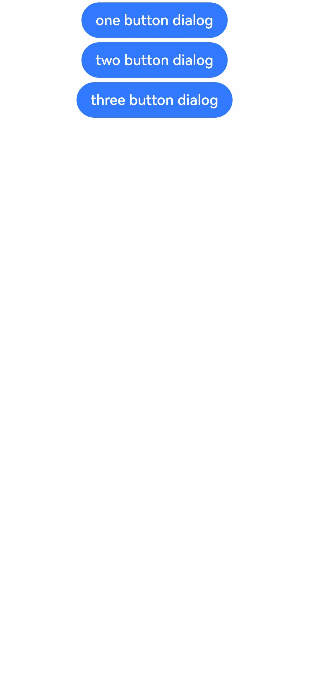
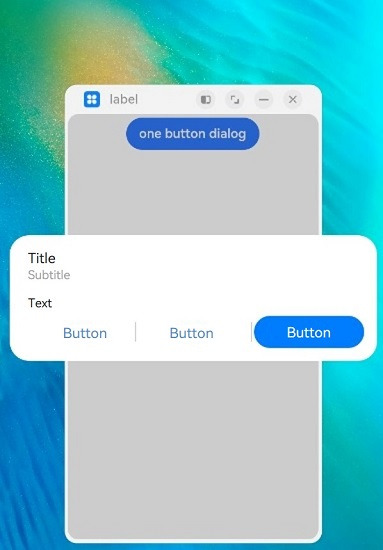
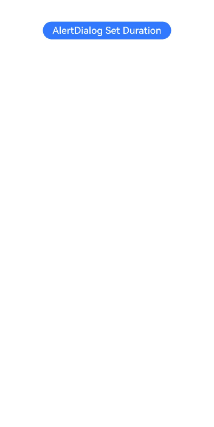
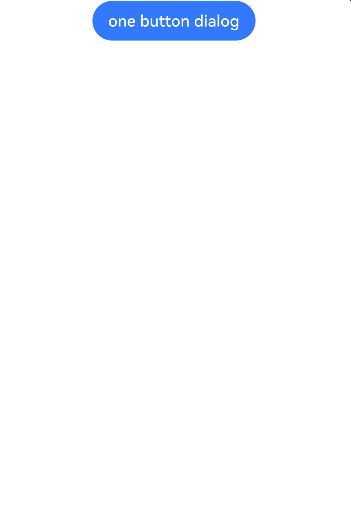
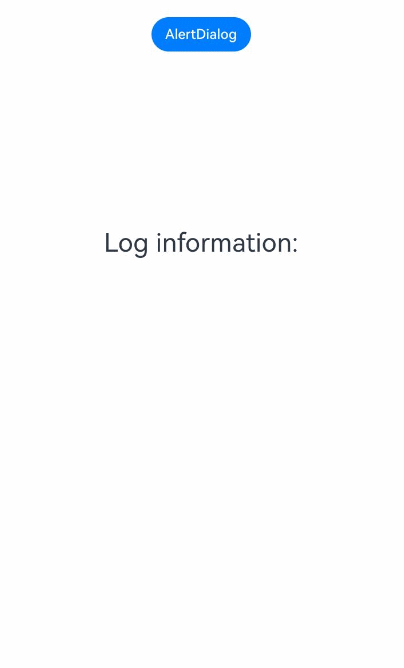
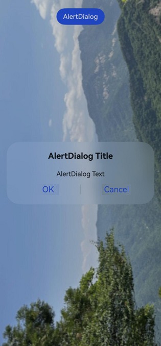
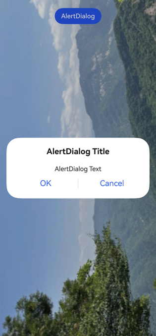

# Alert Dialog Box (AlertDialog)

<!--Kit: ArkUI-->
<!--Subsystem: ArkUI-->
<!--Owner: @houguobiao-->
<!--Designer: @houguobiao-->
<!--Tester: @lxl007-->
<!--Adviser: @Brilliantry_Rui-->
<!-- md-trans-meta sourceCommit=c48e99653addcebc1ddb3fe176c39e9f27289a83 translatedAt=2026-08-24T06:57:05.333Z pushedAt=2026-08-25T07:34:46.486Z -->

You can set the text content and response callback for an alert dialog box.

>  **NOTE**
>
> The initial APIs of this module are supported since API version 7. Updates will be marked with a superscript to indicate their earliest API version.
>
> The functionality of this module depends on UI context. This means that the APIs of this module cannot be used where [the UI context is ambiguous](../../../ui/arkts-global-interface.md#ambiguous-ui-context). For details, see [UIContext](../arkts-apis-uicontext-uicontext.md).

## AlertDialogParam

Enumerates the alert dialog box styles.

**System capability**: SystemCapability.ArkUI.ArkUI.Full

| Name                             | Type                                                        | Read-Only| Optional| Description                                                       |
| --------------------------------- | ------------------------------------------------------------ | ---- | ------------------------------------------------------------ | ------------------------------------------------------------ |
| title                             | [ResourceStr](ts-types.md#resourcestr)                       | No   | Yes  | Dialog title.<br/>Default value: no title is displayed when it is not set.<br/>Before API version 20, the dialog title is left-aligned.<br/>Since API version 20, the dialog title is center-aligned. <br>**Atomic service API:** This API can be used in atomic services since API version 11.   |
| subtitle<sup>10+</sup>            | [ResourceStr](ts-types.md#resourcestr)                       | No   | Yes  | Dialog subtitle.<br/>Default value: no subtitle is displayed when it is not set.<br/>Before API version 20, the dialog subtitle is left-aligned.<br/>Since API version 20, the dialog subtitle is center-aligned.<br>**Atomic service API:** This API can be used in atomic services since API version 11.<br/>**Model restriction:** This API can be used only in the stage model. |
| message                           | [ResourceStr](ts-types.md#resourcestr)                       | No | No | Content of the dialog box.<br>Prior to API version 20: The content of the dialog box is left-aligned.<br>API version 20 and later: The content of the dialog box is center-aligned.<br>**Atomic service API**: This API can be used in atomic services since API version 11.                                                |
| autoCancel                        | boolean                                                      | No   | Yes  | Whether to close the dialog box when the mask is tapped. The value **true** means to close the dialog box, and **false** means not to close it.<br/>Default value: **true**<br>**Atomic service API:** This API can be used in atomic services since API version 11. |
| cancel                            | [VoidCallback](ts-types.md#voidcallback12) | No   | Yes  | Callback invoked when the dialog box is closed by tapping the mask.<br>**Atomic service API:** This API can be used in atomic services since API version 11.                               |
| alignment                         | [DialogAlignment](#dialogalignment)                  | No  | Yes | Alignment mode of the dialog box in the vertical direction.<br>Default value: **DialogAlignment.Default**<br>**Atomic service API**: This API can be used in atomic services since API version 11.<br>**NOTE**<br>If **showInSubWindow** is set to **true** in **UIExtension**, the dialog box is aligned with the host window based on **UIExtension**.|
| offset                            | [Offset](ts-types.md#offset)                                 | No   | Yes  | Offset of the dialog box relative to the alignment position. dx indicates the horizontal offset, where a positive value means offset to the right and a negative value means offset to the left; dy indicates the vertical offset, where a positive value means offset downward and a negative value means offset upward.<br/>Default value: **{&nbsp;dx:&nbsp;0&nbsp;,&nbsp;dy:&nbsp;0&nbsp;}**<br/>Unit: vp<br>**Atomic service API:** This API can be used in atomic services since API version 11. |
| gridCount                         | number                                                       | No   | Yes  | Number of grid columns occupied by the dialog box container width. The grid count is a relative unit of the dialog box width. A larger value means a wider dialog box.<br/>Default value: **4** <br>Value range: an integer greater than or equal to 0.<br/>**Atomic service API:** This API can be used in atomic services since API version 11.                    |
| maskRect<sup>10+</sup>            | [Rectangle](#rectangle8)                             | No   | Yes  | Dialog mask area. Events within the mask area are not passed through, and events outside the mask area are passed through.<br/>Default value: **{ x: 0, y: 0, width: '100%', height: '100%' }** <br/>**NOTE**<br/>When **showInSubWindow** is **true**, **maskRect** does not take effect.<br/>**Atomic service API:** This API can be used in atomic services since API version 11.<br/>**Model restriction:** This API can be used only in the stage model. |
| showInSubWindow<sup>11+</sup>     | boolean                                                      | No   | Yes  | Whether to display the dialog box in a subwindow when it needs to be displayed outside the main window. The value **true** means to display the dialog box in a subwindow.<br/>Default value: **false**, the dialog box is displayed within the app instead of in an independent subwindow.<br/>**Note:** A dialog box with **showInSubWindow** set to **true** cannot trigger the display of another dialog box with **showInSubWindow** set to **true**.<br/>**Atomic service API:** This API can be used in atomic services since API version 12.<br/>**Model restriction:** This API can be used only in the stage model. |
| isModal<sup>11+</sup>             | boolean                                                      | No   | Yes  | Whether the dialog box is a modal window. A modal window has a mask, while a non-modal window does not. When the value is **true**, the dialog box is a modal window with a mask. When the value is **false**, the dialog box is a non-modal window without a mask.<br/>Default value: **true**, in which case the dialog box has a mask.<br/>**Atomic service API:** This API can be used in atomic services since API version 12.<br/>**Model restriction:** This API can be used only in the stage model. |
| backgroundColor<sup>11+</sup>     | [ResourceColor](ts-types.md#resourcecolor)                   | No   | Yes  | Dialog backdrop color.<br/>Default value: **Color.Transparent**<br/>**NOTE**<br/>**backgroundColor** is superimposed with the blur attribute **backgroundBlurStyle** to produce an effect. If the result does not meet expectations, set **backgroundBlurStyle** to **BlurStyle.NONE** to cancel the blur. When the system material **systemMaterial** is set, **backgroundColor** does not take effect.<br/>**Atomic service API:** This API can be used in atomic services since API version 12.<br/>**Model restriction:** This API can be used only in the stage model. |
| backgroundBlurStyle<sup>11+</sup> | [BlurStyle](ts-universal-attributes-background.md#blurstyle9)                 | No   | Yes  | Dialog backdrop blur material.<br/>Default value: **BlurStyle.NONE** since API version 26.0.0, and **BlurStyle.COMPONENT_ULTRA_THICK** before API version 26.0.0.<br/>**NOTE**<br/>Set this attribute to **BlurStyle.NONE** to disable background blur. When **backgroundBlurStyle** is set to a value other than **NONE**, do not set **backgroundColor**; otherwise, the color display will not meet expectations. When the system material **systemMaterial** is set, **backgroundBlurStyle** does not take effect.<br/>**Atomic service API:** This API can be used in atomic services since API version 12.<br/>**Model restriction:** This API can be used only in the stage model. |
| backgroundBlurStyleOptions<sup>19+</sup> | [BackgroundBlurStyleOptions](ts-universal-attributes-background.md#backgroundblurstyleoptions10) | No | Yes |  Dialog backdrop blur effect. For the default value, see the **BackgroundBlurStyleOptions** type description.<br />**Atomic service API:** This API can be used in atomic services since API version 19.<br/>**Model restriction:** This API can be used only in the stage model. |
| backgroundEffect<sup>19+</sup> | [BackgroundEffectOptions](ts-universal-attributes-background.md#backgroundeffectoptions11) | No | Yes |  Dialog backdrop effect parameter. When the system material **systemMaterial** is set, **backgroundEffect** does not take effect. For the default value, see the **BackgroundEffectOptions** type description.<br />**Atomic service API:** This API can be used in atomic services since API version 19.<br/>**Model restriction:** This API can be used only in the stage model. |
| onWillDismiss<sup>12+</sup>       | Callback<[DismissDialogAction](#dismissdialogaction12)> | No   | Yes  | Interactive close callback. When the user performs interactive close operations such as tapping the mask, swiping (left/right), pressing the three-key back button, or pressing the keyboard ESC key, if this callback is registered, the dialog box is not closed immediately.<br/>**NOTE**<br/>1. In the callback, the operation type that blocks the dialog box from closing can be obtained through reason, so that whether the dialog box can be closed can be determined based on the reason. A typical scenario is that when there is unsaved form data in the dialog box, the closure is intercepted and the user is prompted to save. The reason returned by the current component does not support the **CLOSE_BUTTON** enum value.<br/>2. In the **onWillDismiss** callback, **onWillDismiss** interception cannot be performed again. <br/>**Atomic service API:** This API can be used in atomic services since API version 12.<br/>**Model restriction:** This API can be used only in the stage model. |
| cornerRadius<sup>12+</sup>        | &nbsp;[Dimension](ts-types.md#dimension10)&nbsp;\|&nbsp;[BorderRadiuses](ts-types.md#borderradiuses9)&nbsp;\|&nbsp;[LocalizedBorderRadiuses](ts-types.md#localizedborderradiuses12) | No   | Yes  | Corner radius of the backdrop.<br />The radius of the four corners can be set separately.<br />Default value: **{ topLeft: '32vp', topRight: '32vp', bottomLeft: '32vp', bottomRight: '32vp' }**<br /> The corner radius is limited by the component size. The maximum value is half of the component width or height. If the value is negative, the default value is used. <br /> Percentage parameter: the corner radius of the dialog box is set as a percentage of the width and height of the parent dialog box.<br/>**NOTE**<br/>When the **cornerRadius** attribute type is **LocalizedBorderRadiuses**, the layout order can be changed according to the language habit.<br/>**Atomic service API:** This API can be used in atomic services since API version 12.<br/>**Model restriction:** This API can be used only in the stage model. |
| transition<sup>12+</sup>          | [TransitionEffect](ts-transition-animation-component.md#transitioneffect10) | No   | Yes  | Transition effect for the display and exit of the dialog box.<br/>**NOTE**<br/> 1. If this attribute is not set, the default display/exit animation is used.<br/> 2. If the back key is pressed during the display animation, the display animation is interrupted and the exit animation is executed. The animation effect is the result of superimposing the curves of the display animation and the exit animation.<br/> 3. If the back key is pressed during the exit animation, the exit animation is not interrupted and continues to execute. Pressing the back key again exits the app.                               <br/>**Atomic service API:** This API can be used in atomic services since API version 12.<br/>**Model restriction:** This API can be used only in the stage model. |
| width<sup>12+</sup>               | [Dimension](ts-types.md#dimension10) | No   | Yes | Width of the dialog box backdrop.<br />**NOTE**<br>- Default maximum dialog width: **400vp**.<br />- Percentage parameter: the reference width of the dialog box is the width of the window where it is located, and the width is adjusted smaller or larger based on this.<br/>**Atomic service API:** This API can be used in atomic services since API version 12.<br/>**Model restriction:** This API can be used only in the stage model. |
| height<sup>12+</sup>              | [Dimension](ts-types.md#dimension10)                         | No   | Yes  | Height of the dialog box backdrop.<br />**NOTE**<br />- Default maximum dialog height: 0.9 × (window height - safe area).<br />- Percentage parameter: the reference height of the dialog box is (window height - safe area), and the height is adjusted smaller or larger based on this.<br/>**Atomic service API:** This API can be used in atomic services since API version 12.<br/>**Model restriction:** This API can be used only in the stage model. |
| borderWidth<sup>12+</sup>         | [Dimension](ts-types.md#dimension10)&nbsp;\|&nbsp;[EdgeWidths](ts-types.md#edgewidths9)&nbsp;\|&nbsp;[LocalizedEdgeWidths](ts-types.md#localizededgewidths12) | No   | Yes  |Width of the four borders separately. When the system material **systemMaterial** is set, **borderWidth** does not take effect.<br />Default value: **0**<br /> Percentage parameter: the border width of the dialog box is set as a percentage of the width of the dialog box backdrop itself.<br />When the left and right borders of the dialog box are greater than the dialog box width, and the top and bottom borders are greater than the dialog box height, the display may not meet expectations.<br/>**NOTE**<br/>When the **borderWidth** attribute type is **LocalizedEdgeWidths**, the layout order can be changed according to the language habit.<br/>**Atomic service API:** This API can be used in atomic services since API version 12.<br/>**Model restriction:** This API can be used only in the stage model. |
| borderColor<sup>12+</sup>         | [ResourceColor](ts-types.md#resourcecolor)&nbsp;\|&nbsp;[EdgeColors](ts-types.md#edgecolors9)&nbsp;\|&nbsp;[LocalizedEdgeColors](ts-types.md#localizededgecolors12) | No   | Yes  | Border color of the dialog box backdrop. When the system material **systemMaterial** is set, **borderColor** does not take effect.<br/>Default value: **Color.Black**<br/> If the **borderColor** attribute is used, it must be used together with the **borderWidth** attribute.<br/>**NOTE**<br/>When the **borderColor** attribute type is **LocalizedEdgeColors**, the layout order can be changed according to the language habit.<br/>**Atomic service API:** This API can be used in atomic services since API version 12.<br/>**Model restriction:** This API can be used only in the stage model. |
| borderStyle<sup>12+</sup>         | [BorderStyle](ts-appendix-enums.md#borderstyle)&nbsp;\|&nbsp;[EdgeStyles](ts-types.md#edgestyles9) | No   | Yes  | Border style of the dialog box backdrop.<br/>Default value: **BorderStyle.Solid**<br/>If the **borderStyle** attribute is used, it must be used together with the **borderWidth** attribute. <br/>**Atomic service API:** This API can be used in atomic services since API version 12.<br/>**Model restriction:** This API can be used only in the stage model. |
| shadow<sup>12+</sup>              | [ShadowOptions](ts-universal-attributes-image-effect.md#shadowoptions)&nbsp;\|&nbsp;[ShadowStyle](ts-universal-attributes-image-effect.md#shadowstyle10) | No   | Yes  | Shadow of the dialog box backdrop.<br /> When the device is a 2-in-1 device, in the default scenario, the focused shadow value is **ShadowStyle.OUTER_FLOATING_MD**, and the unfocused shadow value is **ShadowStyle.OUTER_FLOATING_SM**. Other devices have no shadow by default.<br/>**Atomic service API:** This API can be used in atomic services since API version 12.<br/>**Model restriction:** This API can be used only in the stage model. |
| textStyle<sup>12+</sup>              | [TextStyle](#textstyle12) | No   | Yes  | Text style of the dialog box message content. <br/>**Atomic service API:** This API can be used in atomic services since API version 12.<br/>**Model restriction:** This API can be used only in the stage model. |
| enableHoverMode<sup>14+</sup>     | boolean | No   | Yes  | Whether to respond to the hover state. When the value is **true**, the hover state is responded to; when the value is **false**, the hover state is not responded to.<br />Default value: **false**, no response by default.<br />**NOTE**<br />On PCs/2-in-1 devices, the dialog box is displayed in the upper half of the screen by default. When **enableHoverMode** is set to **true**, it can be displayed in the lower half of the screen by setting the **hoverModeArea** parameter. On other devices, when **enableHoverMode** is set to **true**, the dialog box is displayed in the lower half of the screen by default, and it can be displayed in the upper half of the screen by setting the **hoverModeArea** parameter.<br/>**Atomic service API:** This API can be used in atomic services since API version 14.<br/>**Model restriction:** This API can be used only in the stage model. |
| hoverModeArea<sup>14+</sup>       | [HoverModeAreaType](ts-universal-attributes-sheet-transition.md#hovermodeareatype14) | No   | Yes  | Default display area of the dialog box in the hover state.<br />Default value: **HoverModeAreaType.BOTTOM_SCREEN**.<br />**Note:** This parameter takes effect only when **enableHoverMode** is set to **true**.<br/>**Atomic service API:** This API can be used in atomic services since API version 14.<br/>**Model restriction:** This API can be used only in the stage model. |
| onWillAppear<sup>19+</sup> | Callback&lt;void&gt; | No | Yes | Event callback before the dialog box display animation.<br />**NOTE**<br />1. The normal timing is: **onWillAppear** >> **onDidAppear** >> **onWillDisappear** >> **onDidDisappear**.<br />2. A callback event that changes the display effect of the dialog box set in **onWillAppear** takes effect on the second display. <br/>**Atomic service API:** This API can be used in atomic services since API version 19.<br/>**Model restriction:** This API can be used only in the stage model. |
| onDidAppear<sup>19+</sup> | Callback&lt;void&gt; | No | Yes | Event callback after the dialog box is displayed.<br />**NOTE**<br />1. The normal timing is: **onWillAppear** >> **onDidAppear** >> **onWillDisappear** >> **onDidDisappear**.<br />2. A callback event that changes the display effect of the dialog box set in **onDidAppear** takes effect on the second display.<br />3. When the dialog box is closed by quickly tapping to display it, **onWillDisappear** takes effect before **onDidAppear**.<br/>4. If the dialog box is completely closed before the entrance animation is completed, the animation is interrupted and **onDidAppear** is not triggered.<br/>**Atomic service API:** This API can be used in atomic services since API version 19.<br/>**Model restriction:** This API can be used only in the stage model. |
| onWillDisappear<sup>19+</sup> | Callback&lt;void&gt; | No | Yes | Event callback before the dialog box exit animation.<br />**NOTE**<br />The normal timing is: **onWillAppear** >> **onDidAppear** >> **onWillDisappear** >> **onDidDisappear**.<br /> **Atomic service API:** This API can be used in atomic services since API version 19.<br/>**Model restriction:** This API can be used only in the stage model. |
| **onDidDisappear**<sup>19+</sup> | Callback&lt;void&gt; | No | Yes | Event callback after the dialog box disappears.<br />**NOTE**<br />The normal timing is: **onWillAppear** >> **onDidAppear** >> **onWillDisappear** >> **onDidDisappear**.<br/>**Atomic service API:** This API can be used in atomic services since API version 19.<br/>**Model restriction:** This API can be used only in the stage model. |
| levelMode<sup>15+</sup>       | [LevelMode](../js-apis-promptAction.md#levelmode15) | No   | Yes  | Display level of the dialog box.<br />**NOTE**<br />- Default value: **LevelMode.OVERLAY**.<br />- Takes effect only when the **showInSubWindow** attribute is set to false.<br/>**Atomic service API:** This API can be used in atomic services since API version 15.<br/>**Model restriction:** This API can be used only in the stage model. |
| levelUniqueId<sup>15+</sup>       | number | No   | Yes  | [getUniqueId](../js-apis-arkui-frameNode.md#getuniqueid12) of the level where the page-level dialog box needs to be displayed. Takes effect only when the **levelMode** attribute is set to **LevelMode.EMBEDDED**.<br/>Value range: a number greater than or equal to 0.<br/>**Atomic service API:** This API can be used in atomic services since API version 15.<br/>**Model restriction:** This API can be used only in the stage model. |
| immersiveMode<sup>15+</sup>       | [ImmersiveMode](../js-apis-promptAction.md#immersivemode15) | No   | Yes  | Mask effect of the in-page dialog box.<br />**NOTE**<br />- Default value: **ImmersiveMode.DEFAULT** <br />- Takes effect only when the **levelMode** attribute is set to **LevelMode.EMBEDDED**.<br/>**Atomic service API:** This API can be used in atomic services since API version 15.<br/>**Model restriction:** This API can be used only in the stage model. |
| levelOrder<sup>18+</sup>       | [LevelOrder](#levelorder18) | No   | Yes  | Display order of the dialog box.<br />**NOTE**<br />- Default value: **LevelOrder.clamp(0)** <br />- Dynamic refresh of the order is not supported.<br/>**Atomic service API:** This API can be used in atomic services since API version 18.<br/>**Model restriction:** This API can be used only in the stage model. |
| systemMaterial  | [SystemUiMaterial](ts-universal-attributes-image-effect.md#systemuimaterial) | No | Yes | System material of the dialog box.<br/>**NOTE**<br/>- Default value: the [ImmersiveMaterial](../arkts-apis-uimaterial.md#immersivematerial) object whose [ImmersiveOptions](../arkts-apis-uimaterial.md#immersiveoptions) style is **ImmersiveStyle.ULTRA_THICK**. When set to **undefined**, it is consistent with the default value.<br/>- Different materials have different effects. This API affects the background color [backgroundColor](ts-universal-attributes-background.md#backgroundcolor), background blur [backgroundBlurStyle](ts-universal-attributes-background.md#backgroundblurstyle9), background effect [backgroundEffect](ts-universal-attributes-background.md#backgroundeffect11), border color [borderColor](ts-universal-attributes-border.md#bordercolor), border width [borderWidth](ts-universal-attributes-border.md#borderwidth), and shadow [shadow](ts-universal-attributes-image-effect.md#shadow). When the system material is set, the preceding APIs do not take effect.<br/>**Since:** 26.0.0<br/>**Model restriction:** This API can be used only in the stage model.<br/>**Atomic service API:** This API can be used in atomic services since API version 26.0.0.|

## LevelOrder<sup>18+</sup>

type LevelOrder = import('../api/@ohos.promptAction').LevelOrder

Defines the display order of the dialog box.

**Atomic service API**: This API can be used in atomic services since API version 18.

**Model restriction**: This API can be used only in the stage model.

**System capability**: SystemCapability.ArkUI.ArkUI.Full

| Type                                                 | Description                |
| ----------------------------------------------------- | -------------------- |
| import('../api/@ohos.promptAction').[LevelOrder](../js-apis-promptAction.md#levelorder18) | Display order of the dialog box. |

## AlertDialogParamWithConfirm

Inherited from [AlertDialogParam](#alertdialogparam).

**Atomic service API**: This API can be used in atomic services since API version 11.

**System capability**: SystemCapability.ArkUI.ArkUI.Full

| Name      | Type    | Read-Only  | Optional  | Description        |
| ---------- | ---------------- | ---------- | ------------------------------- | ------------------------------- |
| confirm    | [AlertDialogButtonBaseOptions](#alertdialogbuttonbaseoptions18) | No   | Yes  | Enabled state, default focus, button style, text content, text color, button background color, and click callback of the confirm button. When the dialog box has focus and no Tab key focus traversal has been performed, this button responds to the Enter key by default. In the case of multiple dialog boxes, it can automatically obtain focus and respond continuously. The default **Enter** key response capability does not take effect when **defaultFocus** is **true**. |

Priorities of the **confirm** parameters: **fontColor** and **backgroundColor** > **style** > **defaultFocus**

| backgroundColor | fontColor | style                       | defaultFocus | Effect    |
| --------------- | --------- | --------------------------- | ------------ | -------- |
| Green           | Red     | -                           | -            | Red text on green background|
| Green           | -         | DialogButtonStyle.HIGHLIGHT | -            | White text on green background|
| Green           | -         | DialogButtonStyle.DEFAULT   | -            | Blue text on green background|
| Green           | -         | -                           | TRUE         | White text on green background|
| Green           | -         | -                           | FALSE/-      | Blue text on green background|
| -               | Red     | DialogButtonStyle.HIGHLIGHT | -            | Red text on blue background|
| -               | Red     | DialogButtonStyle.DEFAULT   | -            | Red text on white background|
| -               | Red     | -                           | TRUE         | Red text on blue background|
| -               | Red     | -                           | FALSE/-      | Red text on white background|
| -               | -         | DialogButtonStyle.HIGHLIGHT | -            | White text on blue background|
| -               | -         | DialogButtonStyle.DEFAULT   | -            | Blue text on white background|
| -               | -         | -                           | TRUE         | White text on blue background|
| -               | -         | -                           | FALSE/-      | Blue text on white background|

## AlertDialogParamWithButtons

Inherited from [AlertDialogParam](#alertdialogparam).

**Atomic service API**: This API can be used in atomic services since API version 11.

**System capability**: SystemCapability.ArkUI.ArkUI.Full

| Name            | Type               | Read-Only  | Optional  | Description                    |
| --------------- | ---------------------- | ------------ | --------------------- | --------------------- |
| primaryButton   | [AlertDialogButtonBaseOptions](#alertdialogbuttonbaseoptions18) | No | No | Enabled state, default focus, button style, text content, text color, button background color, and click callback of the primary button. When the dialog box gains focus and no Tab key navigation is performed, this button responds to the Enter key by default, and multiple dialog boxes can automatically gain focus and respond continuously. The default **Enter** key response capability does not take effect when **defaultFocus** is true. For details about how to use it, see [Example 7](#example-7-customizing-the-background-blur-effect). |
| secondaryButton | [AlertDialogButtonBaseOptions](#alertdialogbuttonbaseoptions18) | No | No | Enabled state, default focus, button style, text content, text color, button background color, and click callback of the secondary button. |

## AlertDialogParamWithOptions<sup>10+</sup>

Inherited from [AlertDialogParam](#alertdialogparam).

**Atomic service API**: This API can be used in atomic services since API version 11.

**Model restriction**: This API can be used only in the stage model.

**System capability**: SystemCapability.ArkUI.ArkUI.Full

| Name            | Type               | Read-Only  | Optional  | Description                   |
| --------------- | ---------------------- | ------------ | --------------------- | --------------------- |
| buttons       | Array&lt;[AlertDialogButtonOptions](#alertdialogbuttonoptions10)&gt;                 | No| No| Buttons in the dialog box.|
|buttonDirection      | [DialogButtonDirection](#dialogbuttondirection10)| No  | Yes | Button layout direction, which defaults to **DialogButtonDirection.AUTO**. It is recommended to use the Auto mode when there are more than three buttons. In Auto mode, when there are more than two buttons, the layout switches to vertical, which usually displays more buttons. In non-Auto mode, more than three buttons may not be fully displayed, and buttons beyond the display range are truncated.|

## AlertDialogButtonOptions<sup>10+</sup>

Inherits from [AlertDialogButtonBaseOptions](#alertdialogbuttonbaseoptions18).

**Model restriction**: This API can be used only in the stage model.

**System capability**: SystemCapability.ArkUI.ArkUI.Full

| Name                 | Type   | Read-Only| Optional| Description                                                        |
| --------------------- | ------- | ---- | ---- | ------------------------------------------------------------ |
| primary<sup>12+</sup> | boolean | No  | Yes  | Whether the button responds to the **Enter** key by default when the dialog box has focus and no focus traversal is performed using the Tab key. When there are multiple buttons, only one button can have this field set to **true**; otherwise, none of the buttons respond. Multiple dialog boxes can automatically obtain focus and respond consecutively. This field does not take effect when **defaultFocus** is **true**. The value **true** indicates that the button responds to the Enter key by default, and **false** indicates that the button does not respond to the **Enter** key by default.<br/>Default value: **false** <br/>**Atomic service API:** This API can be used in atomic services since API version 12. |

## AlertDialogButtonBaseOptions<sup>18+</sup>

Defines the button style of the alert dialog box.

> **NOTE**
>
> To standardize anonymous object definitions, the element definitions here have been revised in API version 18. While historical version information is preserved for anonymous objects, there may be cases where the outer element's @since version number is higher than inner elements'. This does not affect interface usability.

**Atomic service API**: This API can be used in atomic services since API version 18.

**Model restriction**: This API can be used only in the stage model.

**System capability**: SystemCapability.ArkUI.ArkUI.Full

| Name            | Type               | Read-Only  | Optional  | Description                   |
| ------------------| ---------------------- | ------------ | --------------------- | --------------------- |
| enabled<sup>10+</sup> | boolean | No     | Yes    | Whether the button responds to a tap. The default value is **true**.<br/>The value **true** means the button can respond, and **false** means the button cannot respond.<br/>**Atomic service API:** This API can be used in atomic services since API version 11. |
| defaultFocus<sup>10+</sup> | boolean | No     | Yes    | Whether the button is the default focus. The default value is **false**.<br/>The value **true** means the button is the default focus, and **false** means the button is not the default focus.<br/>**Atomic service API:** This API can be used in atomic services since API version 11. |
| style<sup>10+</sup> | [DialogButtonStyle](ts-appendix-enums.md#dialogbuttonstyle10) | No     | Yes    | Button style. The default value is **DialogButtonStyle.DEFAULT**.<br/>**Atomic service API:** This API can be used in atomic services since API version 11. |
| value<sup>10+</sup> | [ResourceStr](ts-types.md#resourcestr) | No    | No    | Text content of the button. If the value is null, the button is not displayed.<br/>**Atomic service API:** This API can be used in atomic services since API version 11. |
| fontColor<sup>10+</sup> | [ResourceColor](ts-types.md#resourcecolor) | No     | Yes    | Text color of the button.<br/>**Atomic service API:** This API can be used in atomic services since API version 11. |
| backgroundColor<sup>10+</sup> | [ResourceColor](ts-types.md#resourcecolor) | No     | Yes    | Button background color.<br/>**Atomic service API:** This API can be used in atomic services since API version 11. |
| action<sup>10+</sup> | [VoidCallback](ts-types.md#voidcallback12) | No    | No    | Callback invoked when the button is selected.<br/>**Atomic service API:** This API can be used in atomic services since API version 11. |

## DialogButtonDirection<sup>10+</sup>

Defines the layout direction of the buttons in the alert dialog box.

**Atomic service API**: This API can be used in atomic services since API version 11.

**Model restriction**: This API can be used only in the stage model.

**System capability**: SystemCapability.ArkUI.ArkUI.Full

| Name                      | Value                     | Description   |
| -------------------------- | --------- | --------- |
| AUTO                      | 0                     | Buttons are laid out horizontally when there are two or fewer buttons and vertically otherwise.|
| HORIZONTAL                      | 1                     | Buttons are laid out horizontally.|
| VERTICAL                      | 2                     | Buttons are laid out vertically.|

## DialogAlignment

Enumerates the alignment modes of the alert dialog boxes.

**Atomic service API**: This API can be used in atomic services since API version 11.

**System capability**: SystemCapability.ArkUI.ArkUI.Full

| Name                    | Value  | Description          |
| ------------------------ | ---- | -------------- |
| Top                      | 0    | Vertical top alignment.|
| Center                   | 1    | Vertical center alignment.|
| Bottom                   | 2    | Vertical bottom alignment.|
| Default                  | 3    | Default alignment.    |
| TopStart<sup>8+</sup>    | 4    | Top left alignment.    |
| TopEnd<sup>8+</sup>      | 5    | Top right alignment.    |
| CenterStart<sup>8+</sup> | 6    | Center left alignment.    |
| CenterEnd<sup>8+</sup>   | 7    | Center right alignment.    |
| BottomStart<sup>8+</sup> | 8    | Bottom left alignment.    |
| BottomEnd<sup>8+</sup>   | 9    | Bottom right alignment.    |

## Rectangle<sup>8+</sup>

The **Rectangle** type is used to represent a mask area of a dialog box.

**Widget capability**: This API can be used in ArkTS widgets since API version 9.

**Atomic service API**: This API can be used in atomic services since API version 11.

**System capability**: SystemCapability.ArkUI.ArkUI.Full

| Name    | Type                          | Read-Only| Optional| Description                              |
|--------|------------------------------|----|-----------------------------------|-----------------------------------|
| x      | [Length](ts-types.md#length) | No  | Yes | x-axis coordinate of the dialog mask area relative to the upper left corner of the window.<br/>Default value: **0vp** |
| y      | [Length](ts-types.md#length) | No  | Yes | y-axis coordinate of the dialog mask area relative to the upper left corner of the window.<br/>Default value: **0vp** |
| width  | [Length](ts-types.md#length) | No  | Yes | Width of the dialog mask area.<br/>Default value: **'100%'**        |
| height | [Length](ts-types.md#length) | No  | Yes | Height of the dialog mask area.<br/>Default value: **'100%'**        |

>  **NOTE**
>
>  x and y can be set to positive or negative percentage values. When x is set to '100%', the mask area is offset to the right by the width of the window itself. When x is set to '-100%', the mask area is offset to the left by the width of the window itself. When y is set to '100%', the mask area is offset downward by the height of the window itself. When y is set to '-100%', the mask area is offset upward by the height of the window itself.
>
>  width and height can only be set to positive values and support percentages. If a negative value is set, the value is reset to the default value.
>
>  The percentage is calculated relative to the width and height of the window itself.

## DismissDialogAction<sup>12+</sup>

Provides information about the action to dismiss the dialog box.

**Atomic service API**: This API can be used in atomic services since API version 12.

**Model restriction**: This API can be used only in the stage model.

**System capability**: SystemCapability.ArkUI.ArkUI.Full

### Attributes

| Name   | Type                                                        | Read-Only| Optional| Description                                                        |
| ------- | ------------------------------------------------------------ | ---- | ---- | ------------------------------------------------------------ |
| dismiss | Callback&lt;void&gt; | No | No | Callback invoked when the dialog box is closed. Calling this method allows the dialog box to be closed; not calling this method prevents the dialog box from being closed. The developer can determine based on the reason and call **dismiss()** to close the dialog box if needed, or not call it to intercept the closure. |
| reason | [DismissReason](ts-universal-attributes-popup.md#dismissreason12) | No | No | Type of the operation that triggers the interception of the dialog box closure. The developer can determine whether to call **dismiss()** to allow the dialog box to be closed based on the value of reason. |

## TextStyle<sup>12+</sup>

Text style of the message in the dialog box, including the text truncation mode.

**Atomic service API**: This API can be used in atomic services since API version 12.

**Model restriction**: This API can be used only in the stage model.

**System capability**: SystemCapability.ArkUI.ArkUI.Full

| Name    | Type                          | Read-Only| Optional| Description                               |
|--------|------------------------------|----|-----------------------------------|-----------------------------------|
| wordBreak      | [WordBreak](ts-appendix-enums.md#wordbreak11) | No | Yes| Word break rule.<br>Default value: **WordBreak.BREAK_ALL**|

## AlertDialog

### show<sup>(deprecated)</sup>

static show(value: AlertDialogParamWithConfirm | AlertDialogParamWithButtons | AlertDialogParamWithOptions)

Shows an alert dialog box.

> **NOTE**
> 
> This API is supported since API version 7 and deprecated since API version 18. You are advised to use [showAlertDialog](../arkts-apis-uicontext-uicontext.md#showalertdialog) instead. **showAlertDialog** can be called only after a [UIContext](../arkts-apis-uicontext-uicontext.md) instance is obtained.
>
> Since API version 10, you can use the [showAlertDialog](../arkts-apis-uicontext-uicontext.md#showalertdialog) API in [UIContext](../arkts-apis-uicontext-uicontext.md), which ensures that the alert dialog box is shown in the intended UI instance.

**Atomic service API**: This API can be used in atomic services since API version 11.

**System capability**: SystemCapability.ArkUI.ArkUI.Full

**Parameters**

| Name  | Type | Mandatory| Description|
| ---- | --------------- | -------- | -------- |
| value | [AlertDialogParamWithConfirm](#alertdialogparamwithconfirm)&nbsp;\|&nbsp;[AlertDialogParamWithButtons](#alertdialogparamwithbuttons)&nbsp;\|&nbsp;[AlertDialogParamWithOptions](#alertdialogparamwithoptions10)<sup>10+</sup> | Yes | Defines and displays the **AlertDialog** component. **AlertDialogParamWithConfirm** is used for a dialog box with only one confirm button; **AlertDialogParamWithButtons** is used for a dialog box with two buttons (a primary button and a secondary button); **AlertDialogParamWithOptions** is used for a dialog box with multiple custom buttons. |

## Example

> **NOTE**
> 
> Directly using **AlertDialog** can lead to the issue of [ambiguous UI context](../../../ui/arkts-global-interface.md#ambiguous-ui-context). To avoid this, obtain the [UIContext](../arkts-apis-uicontext-uicontext.md) object using the **getUIContext()** API and then call **AlertDialog.show()** bound to the instance using the [showAlertDialog](../arkts-apis-uicontext-uicontext.md#showalertdialog) API.

### Example 1: Displaying Dialog Boxes with Different Numbers of Buttons

This example uses [AlertDialogParamWithConfirm](#alertdialogparamwithconfirm), [AlertDialogParamWithButtons](#alertdialogparamwithbuttons), and [AlertDialogParamWithOptions](#alertdialogparamwithoptions10) to display dialog boxes with one, two, and three buttons, respectively.

```ts
// xxx.ets
@Entry
@Component
struct AlertDialogExample {
  build() {
    Column({ space: 5 }) {
      Button('one button dialog')
        .onClick(() => {
          this.getUIContext().showAlertDialog(
            {
              title: 'title',
              message: 'text',
              autoCancel: true,
              alignment: DialogAlignment.Bottom,
              offset: { dx: 0, dy: -20 },
              gridCount: 3,
              confirm: {
                value: 'button',
                action: () => {
                  console.info('Button-clicking callback');
                }
              },
              cancel: () => {
                console.info('Closed callbacks');
              },
              onWillDismiss: (dismissDialogAction: DismissDialogAction) => {
                console.info(`reason= ${dismissDialogAction.reason}`);
                console.info('AlertDialog onWillDismiss');
                if (dismissDialogAction.reason === DismissReason.PRESS_BACK) {
                  dismissDialogAction.dismiss();
                }
                if (dismissDialogAction.reason === DismissReason.TOUCH_OUTSIDE) {
                  dismissDialogAction.dismiss();
                }
              }
            }
          )
        })
        .backgroundColor(0x317aff)
      Button('two button dialog')
        .onClick(() => {
          this.getUIContext().showAlertDialog(
            {
              title: 'title',
              subtitle: 'subtitle',
              message: 'text',
              autoCancel: true,
              alignment: DialogAlignment.Bottom,
              gridCount: 4,
              offset: { dx: 0, dy: -20 },
              primaryButton: {
                value: 'cancel',
                action: () => {
                  console.info('Callback when the first button is clicked');
                }
              },
              secondaryButton: {
                enabled: true,
                defaultFocus: true,
                style: DialogButtonStyle.HIGHLIGHT,
                value: 'ok',
                action: () => {
                  console.info('Callback when the second button is clicked');
                }
              },
              cancel: () => {
                console.info('Closed callbacks');
              },
              onWillDismiss: (dismissDialogAction: DismissDialogAction) => {
                console.info(`reason= ${dismissDialogAction.reason}`);
                console.info('AlertDialog onWillDismiss');
                if (dismissDialogAction.reason === DismissReason.PRESS_BACK) {
                  dismissDialogAction.dismiss();
                }
                if (dismissDialogAction.reason === DismissReason.TOUCH_OUTSIDE) {
                  dismissDialogAction.dismiss();
                }
              }
            }
          )
        }).backgroundColor(0x317aff)
      Button('three button dialog')
        .onClick(() => {
          this.getUIContext().showAlertDialog(
            {
              title: 'title',
              subtitle: 'subtitle',
              message: 'text',
              autoCancel: true,
              alignment: DialogAlignment.Bottom,
              gridCount: 4,
              offset: { dx: 0, dy: -20 },
              buttonDirection: DialogButtonDirection.HORIZONTAL,
              buttons: [
                {
                  value: 'Button',
                  action: () => {
                    console.info('Callback when button1 is clicked');
                  }
                },
                {
                  value: 'Button',
                  action: () => {
                    console.info('Callback when button2 is clicked');
                  }
                },
                {
                  value: 'Button',
                  enabled: true,
                  defaultFocus: true,
                  style: DialogButtonStyle.HIGHLIGHT,
                  action: () => {
                    console.info('Callback when button3 is clicked');
                  }
                },
              ],
              cancel: () => {
                console.info('Closed callbacks');
              },
              onWillDismiss: (dismissDialogAction: DismissDialogAction) => {
                console.info(`reason= ${dismissDialogAction.reason}`);
                console.info('AlertDialog onWillDismiss');
                if (dismissDialogAction.reason === DismissReason.PRESS_BACK) {
                  dismissDialogAction.dismiss();
                }
                if (dismissDialogAction.reason === DismissReason.TOUCH_OUTSIDE) {
                  dismissDialogAction.dismiss();
                }
              }
            }
          )
        }).backgroundColor(0x317aff)
    }.width('100%').margin({ top: 5 })
  }
}
```



### Example 2: Opening a Dialog Box Outside the Main Window

This example demonstrates how to configure a dialog box to display outside the main window on a 2-in-1 device by setting **showInSubWindow** in [AlertDialogParam](#alertdialogparam) to **true**.

```ts
// xxx.ets
@Entry
@Component
struct AlertDialogExample {
  build() {
    Column({ space: 5 }) {
      Button('one button dialog')
        .onClick(() => {
          this.getUIContext().showAlertDialog(
            {
              title: 'title',
              subtitle: 'subtitle',
              message: 'text',
              autoCancel: true,
              alignment: DialogAlignment.Center,
              gridCount: 4,
              showInSubWindow: true,
              isModal: true,
              offset: { dx: 0, dy: -20 },
              buttonDirection: DialogButtonDirection.HORIZONTAL,
              buttons: [
                {
                  value: 'Button',
                  action: () => {
                    console.info('Callback when button1 is clicked');
                  }
                },
                {
                  value: 'Button',
                  action: () => {
                    console.info('Callback when button2 is clicked');
                  }
                },
                {
                  value: 'Button',
                  enabled: true,
                  defaultFocus: true,
                  style: DialogButtonStyle.HIGHLIGHT,
                  action: () => {
                    console.info('Callback when button3 is clicked');
                  }
                },
              ],
              cancel: () => {
                console.info('Closed callbacks');
              },
              onWillDismiss: (dismissDialogAction: DismissDialogAction) => {
                console.info(`reason= ${dismissDialogAction.reason}`);
                console.info('AlertDialog onWillDismiss');
                if (dismissDialogAction.reason === DismissReason.PRESS_BACK) {
                  dismissDialogAction.dismiss();
                }
                if (dismissDialogAction.reason === DismissReason.TOUCH_OUTSIDE) {
                  dismissDialogAction.dismiss();
                }
              }
            })
        })
    }.width('100%').margin({ top: 5 })
  }
}
```



### Example 3: Setting the Dialog Box Animation

This example demonstrates how to use the **transition** attribute in [AlertDialogParam](#alertdialogparam) to create animation effects for the dialog box's appearance and disappearance.

```ts
// xxx.ets
@Entry
@Component
struct AlertDialogExample {
  build() {
    Column({ space: 5 }) {
      Button('AlertDialog Set Duration')
        .onClick(() => {
          this.getUIContext().showAlertDialog(
            {
              title: 'AlertDialog 1',
              message: 'Set Animation Duration open 3 second, close 100ms',
              autoCancel: true,
              alignment: DialogAlignment.Top,
              offset: { dx: 0, dy: -20 },
              gridCount: 3,
              transition: TransitionEffect.asymmetric(TransitionEffect.OPACITY
                .animation({ duration: 3000, curve: Curve.Sharp })
                .combine(TransitionEffect.scale({ x: 1.5, y: 1.5 }).animation({ duration: 3000, curve: Curve.Sharp })),
                TransitionEffect.OPACITY.animation({ duration: 100, curve: Curve.Smooth })
                  .combine(TransitionEffect.scale({ x: 0.5, y: 0.5 })
                    .animation({ duration: 100, curve: Curve.Smooth }))),
              confirm: {
                value: 'button',
                action: () => {
                  console.info('Button-clicking callback');
                }
              },
              cancel: () => {
                console.info('Closed callbacks');
              }
            }
          )
        })
        .backgroundColor(0x317aff).height('88px')
    }.width('100%').margin({ top: 5 })
  }
}
```



### Example 4: Setting the Dialog Box Style

This example demonstrates how to set styles of an alert dialog box, including the width, height, background color, and shadow.

```ts
// xxx.ets
@Entry
@Component
struct AlertDialogExample {
  build() {
    Column({ space: 5 }) {
      Button('one button dialog')
        .onClick(() => {
          this.getUIContext().showAlertDialog(
            {
              title: 'title',
              message: 'text',
              autoCancel: true,
              alignment: DialogAlignment.Center,
              offset: { dx: 0, dy: -20 },
              gridCount: 3,
              width: 300,
              height: 200,
              cornerRadius: 20,
              borderWidth: 1,
              borderStyle: BorderStyle.Dashed, // borderStyle must be used with borderWidth in pairs.
              borderColor: Color.Blue, // borderColor must be used with borderWidth in pairs.
              backgroundColor: Color.White,
              shadow: ({
                radius: 20,
                color: Color.Grey,
                offsetX: 50,
                offsetY: 0
              }),
              textStyle: { wordBreak: WordBreak.BREAK_ALL },
              confirm: {
                value: 'button',
                action: () => {
                  console.info('Button-clicking callback');
                }
              },
              cancel: () => {
                console.info('Closed callbacks');
              },
              onWillDismiss: (dismissDialogAction: DismissDialogAction) => {
                console.info(`reason= ${dismissDialogAction.reason}`);
                console.info('AlertDialog onWillDismiss');
                if (dismissDialogAction.reason === DismissReason.PRESS_BACK) {
                  dismissDialogAction.dismiss();
                }
                if (dismissDialogAction.reason === DismissReason.TOUCH_OUTSIDE) {
                  dismissDialogAction.dismiss();
                }
              }
            }
          )
        })
        .backgroundColor(0x317aff)
    }.width('100%').margin({ top: 5 })
  }
}
```



### Example 5: Configuring a Dialog Box in the Hover State

<!--RP1-->This example demonstrates how to set the layout area of a dialog box when the device is in semi-folded mode.<!--RP1End-->

```ts
// xxx.ets
@Entry
@Component
struct AlertDialogExample {
  build() {
    Column({ space: 5 }) {
      Button('one button dialog')
        .onClick(() => {
          this.getUIContext().showAlertDialog(
            {
              title: 'title',
              message: 'text',
              autoCancel: true,
              alignment: DialogAlignment.Bottom,
              gridCount: 3,
              confirm: {
                value: 'button',
                action: () => {
                  console.info('Button-clicking callback');
                }
              },
              cancel: () => {
                console.info('Closed callbacks');
              },
              onWillDismiss: (dismissDialogAction: DismissDialogAction) => {
                console.info(`reason= ${dismissDialogAction.reason}`);
                console.info('AlertDialog onWillDismiss');
                if (dismissDialogAction.reason === DismissReason.PRESS_BACK) {
                  dismissDialogAction.dismiss();
                }
                if (dismissDialogAction.reason === DismissReason.TOUCH_OUTSIDE) {
                  dismissDialogAction.dismiss();
                }
              },
              enableHoverMode: true,
              hoverModeArea: HoverModeAreaType.TOP_SCREEN
            }
          )
        })
        .backgroundColor(0x317aff)
    }.width('100%').margin({ top: 5 })
  }
}
```

<!--RP2--><!--RP2End-->

### Example 6: Using Dialog Box Lifecycle Callbacks

This example demonstrates the usage of dialog box lifecycle callbacks.

```ts
// xxx.ets
@Entry
@Component
struct AlertDialogLifecycleExample {
  @State log: string = 'Log information:';

  build() {
    Column({ space: 5 }) {
      Button('AlertDialog')
        .onClick(() => {
          this.getUIContext().showAlertDialog({
            title: 'AlertDialog',
            message: 'message',
            autoCancel: true,
            alignment: DialogAlignment.Bottom,
            offset: { dx: 0, dy: -20 },
            confirm: {
              value: 'button',
              action: () => {
                console.info('AlertDialog Button-clicking callback');
              }
            },
            cancel: () => {
              console.info('Closed callbacks');
            },
            onDidAppear: () => {
              this.log += '# onDidAppear';
              console.info('AlertDialog,is onDidAppear!');
            },
            onDidDisappear: () => {
              this.log += '# onDidDisappear';
              console.info('AlertDialog,is onDidDisappear!');
            },
            onWillAppear: () => {
              this.log = 'Log information:onWillAppear';
              console.info('AlertDialog,is onWillAppear!');
            },
            onWillDisappear: () => {
              this.log += '# onWillDisappear';
              console.info('AlertDialog,is onWillDisappear!');
            }
          })
        })
      Text(this.log).fontSize(30).margin({ top: 200 })
    }.width('100%').margin({ top: 5 })
  }
}
```



### Example 7: Customizing the Background Blur Effect

This example demonstrates how to customize the background blur effect by setting **backgroundBlurStyleOptions** in [AlertDialogParam](#alertdialogparam).

The **backgroundBlurStyleOptions** attribute is added to **AlertDialogParam** since API version 19.

```ts
@Entry
@Component
struct AlertDialogExample {
  build() {
    Stack({ alignContent: Alignment.Top }) {
      // Replace $r('app.media.bg') with the image resource file you use.
      Image($r('app.media.bg'))
      Column() {
        Button("AlertDialog")
          .margin(20)
          .onClick(() => {
            this.getUIContext().showAlertDialog({
              title: 'AlertDialog Title',
              message: 'AlertDialog Text',
              primaryButton: {
                value: 'OK',
                action: () => {
                  console.info('primaryButton');
                }
              },
              secondaryButton: {
                value: 'Cancel',
                action: () => {
                  console.info('secondaryButton');
                }
              },
              backgroundColor: undefined,
              backgroundBlurStyle: BlurStyle.Thin,
              backgroundBlurStyleOptions: {
                colorMode: ThemeColorMode.LIGHT,
                adaptiveColor: AdaptiveColor.AVERAGE,
                scale: 1,
                blurOptions: { grayscale: [20, 20] },
              },
            });
          })
      }.width('100%')
    }
  }
}
```



### Example 8: Customizing the Background Effect

This example demonstrates how to customize the background effect by setting **backgroundEffect** in [AlertDialogParam](#alertdialogparam).

The **backgroundEffect** attribute is added to **AlertDialogParam** since API version 19.

```ts
@Entry
@Component
struct AlertDialogExample {
  build() {
    Stack({ alignContent: Alignment.Top }) {
      // Replace $r('app.media.bg') with the image resource file you use.
      Image($r('app.media.bg'))
      Column() {
        Button("AlertDialog")
          .margin(20)
          .onClick(() => {
            this.getUIContext().showAlertDialog({
              title: 'AlertDialog Title',
              message: 'AlertDialog Text',
              primaryButton: {
                value: 'OK',
                action: () => {
                  console.info('primaryButton');
                }
              },
              secondaryButton: {
                value: 'Cancel',
                action: () => {
                  console.info('secondaryButton');
                }
              },
              backgroundColor: undefined,
              backgroundBlurStyle: BlurStyle.Thin,
              backgroundEffect: {
                radius: 60,
                saturation: 0,
                brightness: 1,
                color: Color.White,
                blurOptions: { grayscale: [20, 20] }
              },
            });
          })
      }.width('100%')
    }
  }
}
```



### Example 9: Setting the System Material of the Dialog Box

This example implements the system material effect by configuring the **systemMaterial** attribute in [AlertDialogParam](#alertdialogparam).

Since API version 26.0.0, the **systemMaterial** attribute is added to **AlertDialogParam**.

```ts
import { uiMaterial } from '@kit.ArkUI';

@Entry
@Component
struct AlertDialogExample {
  build() {
    Stack({ alignContent: Alignment.Top }) {
      Column() {
        Button("AlertDialog")
          .margin(20)
          .onClick(() => {
            this.getUIContext().showAlertDialog({
              title: 'AlertDialog Title',
              message: 'AlertDialog Text',
              primaryButton: {
                value: 'OK',
                action: () => {
                  console.info('primaryButton');
                }
              },
              secondaryButton: {
                value: 'Cancel',
                action: () => {
                  console.info('secondaryButton');
                }
              },
              systemMaterial: new uiMaterial.ImmersiveMaterial({ style: uiMaterial.ImmersiveStyle.ULTRA_THICK })
            });
          })
      }
      .height('100%')
      .width('100%')
      .backgroundColor(Color.Gray)
    }
  }
}
```

<!--Del--> <!--DelEnd-->