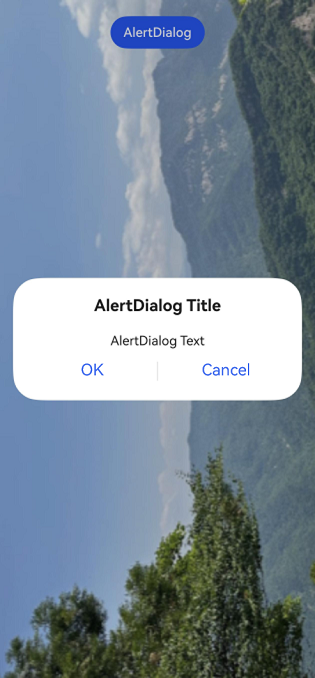

# Alert Dialog Box (AlertDialog)
<!--Kit: ArkUI-->
<!--Subsystem: ArkUI-->
<!--Owner: @houguobiao-->
<!--Designer: @houguobiao-->
<!--Tester: @lxl007-->
<!--Adviser: @Brilliantry_Rui-->

You can set the text content and response callback for an alert dialog box.

>  **NOTE**
>
> The initial APIs of this module are supported since API version 7. Updates will be marked with a superscript to indicate their earliest API version.
>
> The functionality of this module depends on UI context. This means that the APIs of this module cannot be used where [the UI context is unclear](../../../ui/arkts-global-interface.md). For details, see [UIContext](../arkts-apis-uicontext-uicontext.md).

## AlertDialogParam

Enumerates the alert dialog box styles.

**System capability**: SystemCapability.ArkUI.ArkUI.Full

| Name                             | Type                                                        | Read-only| Optional| Description                                                       |
| --------------------------------- | ------------------------------------------------------------ | ---- | ------------------------------------------------------------ | ------------------------------------------------------------ |
| title                             | [ResourceStr](ts-types.md#resourcestr)                       | No  | Yes | Title of the dialog box.<br>Prior to API version 20: The title of the dialog box is left-aligned.<br>API version 20 and later: The title of the dialog box is center-aligned.<br>**Atomic service API**: This API can be used in atomic services since API version 11.  |
| subtitle<sup>10+</sup>            | [ResourceStr](ts-types.md#resourcestr)                       | No  | Yes | Subtitle of the dialog box.<br>Prior to API version 20: The subtitle of the dialog box is left-aligned.<br>API version 20 and later: The subtitle of the dialog box is center-aligned.<br>**Atomic service API**: This API can be used in atomic services since API version 11.                                                |
| message                           | [ResourceStr](ts-types.md#resourcestr)                       | No | No | Content of the dialog box.<br>Prior to API version 20: The content of the dialog box is left-aligned.<br>API version 20 and later: The content of the dialog box is center-aligned.<br>**Atomic service API**: This API can be used in atomic services since API version 11.                                                |
| autoCancel                        | boolean                                                      | No  | Yes | Whether to dismiss the dialog box when the mask is touched. The value **true** means to dismiss the dialog box when the mask is touched, and **false** means the opposite.<br>Default value: **true**.<br>**Atomic service API**: This API can be used in atomic services since API version 11.|
| cancel                            | [VoidCallback](ts-types.md#voidcallback12) | No  | Yes | Callback invoked when the dialog box is closed after the overlay is clicked.<br>**Atomic service API**: This API can be used in atomic services since API version 11.                              |
| alignment                         | [DialogAlignment](#dialogalignment)                  | No  | Yes | Alignment mode of the dialog box in the vertical direction.<br>Default value: **DialogAlignment.Default**<br>**Atomic service API**: This API can be used in atomic services since API version 11.<br>**NOTE**<br>If **showInSubWindow** is set to **true** in **UIExtension**, the dialog box is aligned with the host window based on **UIExtension**.|
| offset                            | [Offset](ts-types.md#offset)                                 | No  | Yes | Offset of the dialog box based on the **alignment** settings.<br>Default value: **{ dx: 0 , dy: 0 }**<br>**Atomic service API**: This API can be used in atomic services since API version 11.|
| gridCount                         | number                                                       | No  | Yes | Number of grid columns occupied by the width of the dialog box.<br>Default value: **4**<br>Value range: an integer no less than 0<br>**Atomic service API**: This API can be used in atomic services since API version 11.                   |
| maskRect<sup>10+</sup>            | [Rectangle](#rectangle8)                             | No  | Yes | Mask area of the dialog box. Events outside the mask area are transparently transmitted, and events within the mask area are not.<br>Default value: **{ x: 0, y: 0, width: '100%', height: '100%' }**<br>**NOTE**<br>**maskRect** does not take effect when **showInSubWindow** is set to **true**.<br>**Atomic service API**: This API can be used in atomic services since API version 11.|
| showInSubWindow<sup>11+</sup>     | boolean                                                      | No  | Yes | Whether to show the dialog box in a subwindow when the dialog box needs to be displayed outside the main window. <br>**true**: The dialog box is shown in a subwindow.<br>Default value: **false**, meaning the dialog box is displayed within the application, not in a separate subwindow<br>**NOTE**<br>A dialog box whose **showInSubWindow** attribute is **true** cannot trigger the display of another dialog box whose **showInSubWindow** attribute is also **true**.<br>**Atomic service API**: This API can be used in atomic services since API version 12.|
| isModal<sup>11+</sup>             | boolean                                                      | No  | Yes | Whether the dialog box is a modal. A modal dialog box has a mask applied, while a non-modal dialog box does not. **false**: The dialog box is not a modal.<br>Default value: **true**.<br>**Atomic service API**: This API can be used in atomic services since API version 12.|
| backgroundColor<sup>11+</sup>     | [ResourceColor](ts-types.md#resourcecolor)                   | No  | Yes | Background color of the dialog box.<br>Default value: **Color.Transparent**<br>**NOTE**<br>The background color will be visually combined with the blur effect when both properties are set. If the resulting effect does not match your design requirements, you can disable the blur effect entirely by explicitly setting the **backgroundBlurStyle** property to **BlurStyle.NONE**.<br>**Atomic service API**: This API can be used in atomic services since API version 12.|
| backgroundBlurStyle<sup>11+</sup> | [BlurStyle](ts-universal-attributes-background.md#blurstyle9)                 | No  | Yes | Background blur style of the dialog box.<br>Default value: **BlurStyle.COMPONENT_ULTRA_THICK**<br>**NOTE**<br>Setting this parameter to **BlurStyle.NONE** disables the background blur. When **backgroundBlurStyle** is set to a value other than **NONE**, do not set **backgroundColor**. If you do, the color display may not produce the expected visual effect.<br>**Atomic service API**: This API can be used in atomic services since API version 12.|
| backgroundBlurStyleOptions<sup>19+</sup> | [BackgroundBlurStyleOptions](ts-universal-attributes-background.md#backgroundblurstyleoptions10)| No| Yes| Options for customizing the background blur style. For details about the default value, see **BackgroundBlurStyleOptions**.<br>**Atomic service API**: This API can be used in atomic services since API version 19.|
| backgroundEffect<sup>19+</sup> | [BackgroundEffectOptions](ts-universal-attributes-background.md#backgroundeffectoptions11) | No| Yes| Options for customizing the background effect. For details about the default value, see **BackgroundEffectOptions**.<br>**Atomic service API**: This API can be used in atomic services since API version 19.|
| onWillDismiss<sup>12+</sup>       | Callback<[DismissDialogAction](#dismissdialogaction12)> | No  | Yes | Callback for interactive dismissal of the dialog box.<br>**NOTE**<br>1. If this callback is registered, the dialog box will not be dismissed immediately after the user touches the mask or the Back button, presses the Esc key, or swipes left or right on the screen. The **reason** parameter in the callback is used to determine whether the dialog box can be dismissed. The reason returned by the component does not support the value **CLOSE_BUTTON**.<br>2. In the **onWillDismiss** callback, another **onWillDismiss** callback is not allowed.<br>**Atomic service API**: This API can be used in atomic services since API version 12.|
| cornerRadius<sup>12+</sup>        |  [Dimension](ts-types.md#dimension10) \| [BorderRadiuses](ts-types.md#borderradiuses9) \| [LocalizedBorderRadiuses](ts-types.md#localizedborderradiuses12) | No  | Yes | Corner radius of the background.<br>You can set separate radii for the four corners.<br>Default value: **{ topLeft: '32vp', topRight: '32vp', bottomLeft: '32vp', bottomRight: '32vp' }**<br> The radius of the rounded corners is subject to the component size. Its maximum value is half of the component width or height. If the value is negative, the default value is used.<br> When set to a percentage, the value defines the radius as a percentage of the parent component's width or height.<br>**NOTE**<br>When **cornerRadius** is of type LocalizedBorderRadiuses, the layout order can be dynamically adjusted based on the user's language settings.<br>**Atomic service API**: This API can be used in atomic services since API version 12.|
| transition<sup>12+</sup>          | [TransitionEffect](ts-transition-animation-component.md#transitioneffect10) | No  | Yes | Transition effect for the appearance and disappearance of the dialog box.<br>**NOTE**<br> 1. If this parameter is not set, the default effect is used.<br> 2. Touching the Back button during the appearance animation pauses the appearance animation and starts the disappearance animation. The final effect is one obtained after the curves of the appearance and disappearance animations are combined.<br> 3. Touching the Back button during the exit animation does not affect the animation playback. Touching the Back button again closes the application.<br>**Atomic service API**: This API can be used in atomic services since API version 12.|
| width<sup>12+</sup>               | [Dimension](ts-types.md#dimension10) | No  | Yes| Width of the dialog box.<br>**NOTE**<br>- Default maximum width of the dialog box: 400 vp<br>- When this parameter is set to a percentage, the reference width of the dialog box is the width of the window where the dialog box is located. You can decrease or increase the width as needed.<br>**Atomic service API**: This API can be used in atomic services since API version 12.|
| height<sup>12+</sup>              | [Dimension](ts-types.md#dimension10)                         | No  | Yes | Height of the dialog box.<br>**NOTE**<br>- Default maximum height of the dialog box: 0.9 x (Window height – Safe area)<br>- When this parameter is set to a percentage, the reference height of the dialog box is the height of the window where the dialog box is located minus the safe area. You can decrease or increase the height as needed.<br>**Atomic service API**: This API can be used in atomic services since API version 12.|
| borderWidth<sup>12+</sup>         | [Dimension](ts-types.md#dimension10) \| [EdgeWidths](ts-types.md#edgewidths9) \| [LocalizedEdgeWidths](ts-types.md#localizededgewidths12) | No  | Yes |You can set the width for all four sides or set separate widths for individual sides.<br>Default value: **0**.<br> When set to a percentage, the value defines the border width as a percentage of the parent dialog box's width.<br>If the left and right borders are greater than its width, or the top and bottom borders are greater than its height, the dialog box may not display as expected.<br>**NOTE**<br>When **borderWidth** is of type LocalizedEdgeWidths, the layout order can be dynamically adjusted based on the user's language settings.<br>**Atomic service API**: This API can be used in atomic services since API version 12.|
| borderColor<sup>12+</sup>         | [ResourceColor](ts-types.md#resourcecolor) \| [EdgeColors](ts-types.md#edgecolors9) \| [LocalizedEdgeColors](ts-types.md#localizededgecolors12) | No  | Yes | Border color of the dialog box.<br>Default value: **Color.Black**<br> **borderColor** must be used with **borderWidth** in pairs.<br>**NOTE**<br>When **borderColor** is of type LocalizedEdgeColors, the layout order can be dynamically adjusted based on the user's language settings.<br>**Atomic service API**: This API can be used in atomic services since API version 12.|
| borderStyle<sup>12+</sup>         | [BorderStyle](ts-appendix-enums.md#borderstyle) \| [EdgeStyles](ts-types.md#edgestyles9) | No  | Yes | Border style of the dialog box.<br>Default value: **BorderStyle.Solid**.<br>**borderStyle** must be used with **borderWidth** in pairs.<br>**Atomic service API**: This API can be used in atomic services since API version 12.|
| shadow<sup>12+</sup>              | [ShadowOptions](ts-universal-attributes-image-effect.md#shadowoptions) \| [ShadowStyle](ts-universal-attributes-image-effect.md#shadowstyle10) | No  | Yes | Shadow of the dialog box.<br> Default value on 2-in-1 devices: **ShadowStyle.OUTER_FLOATING_MD** when the dialog box is focused and **ShadowStyle.OUTER_FLOATING_SM** otherwise On other devices, the dialog box has no shadow by default.<br>**Atomic service API**: This API can be used in atomic services since API version 12.|
| textStyle<sup>12+</sup>              | [TextStyle](#textstyle12) | No  | Yes | Text style of the message in the dialog box.<br>**Atomic service API**: This API can be used in atomic services since API version 12.|
| enableHoverMode<sup>14+</sup>     | boolean | No  | Yes | Whether to respond when the device is in semi-folded mode. The value **true** means to respond when the device is in semi-folded mode.<br>Default value: **false**, meaning not to respond when the device is in semi-folded mode.<br>**Atomic service API**: This API can be used in atomic services since API version 14.|
| hoverModeArea<sup>14+</sup>       | [HoverModeAreaType](ts-universal-attributes-sheet-transition.md#hovermodeareatype14) | No  | Yes | Display area of the dialog box in the hover state.<br>Default value: **HoverModeAreaType.BOTTOM_SCREEN**<br>**Atomic service API**: This API can be used in atomic services since API version 14.|
| onWillAppear<sup>19+</sup> | Callback&lt;void&gt; | No| Yes| Event callback when the dialog box is about to appear.<br>**NOTE**<br>1. The normal timing sequence is as follows: onWillAppear > onDidAppear > onWillDisappear > onDidDisappear.<br>2. You can set the callback event for changing the dialog box display effect in **onWillAppear**. The settings take effect next time the dialog box appears.<br>**Atomic service API**: This API can be used in atomic services since API version 19.|
| onDidAppear<sup>19+</sup> | Callback&lt;void&gt; | No| Yes| Event callback after the dialog box appears.<br>**NOTE**<br>1. The normal timing sequence is as follows: onWillAppear > onDidAppear > onWillDisappear > onDidDisappear.<br>2. You can set the callback event for changing the dialog box display effect in **onDidAppear**. The settings take effect next time the dialog box appears.<br>3. When a dialog box is dismissed immediately after being shown, **onWillDisappear** may be triggered before **onDidAppear**.<br>4. If the dialog box is dismissed before its entrance animation is finished, the animation will be interrupted, and **onDidAppear** will not be triggered.<br>**Atomic service API**: This API can be used in atomic services since API version 19.|
| onWillDisappear<sup>19+</sup> | Callback&lt;void&gt; | No| Yes| Event callback when the dialog box is about to disappear.<br>**NOTE**<br>The normal timing sequence is as follows: onWillAppear > onDidAppear > onWillDisappear > onDidDisappear.<br> **Atomic service API**: This API can be used in atomic services since API version 19.|
| onDidDisappear<sup>19+</sup> | Callback&lt;void&gt; | No| Yes| Event callback after the dialog box disappears.<br>**NOTE**<br>The normal timing sequence is as follows: onWillAppear > onDidAppear > onWillDisappear > onDidDisappear.<br>**Atomic service API**: This API can be used in atomic services since API version 19.|
| levelMode<sup>15+</sup>       | [LevelMode](../js-apis-promptAction.md#levelmode15) | No  | Yes | Display level of the dialog box.<br>**NOTE**<br>- Default value: **LevelMode.OVERLAY**<br>- This parameter takes effect only when **showInSubWindow** is set to **false**.<br>**Atomic service API**: This API can be used in atomic services since API version 15.|
| levelUniqueId<sup>15+</sup>       | number | No  | Yes | [Unique ID](../js-apis-arkui-frameNode.md#getuniqueid12) of the node that the page-level prompt needs to display. This parameter takes effect only when **levelMode** is set to **LevelMode.EMBEDDED**.<br>Value range: a number no less than 0<br>**Atomic service API**: This API can be used in atomic services since API version 15.|
| immersiveMode<sup>15+</sup>       | [ImmersiveMode](../js-apis-promptAction.md#immersivemode15) | No  | Yes | Overlay effect for the page-level dialog box.<br>**NOTE**<br>- Default value: **ImmersiveMode.DEFAULT**<br>- This parameter takes effect only when **levelMode** is set to **LevelMode.EMBEDDED**.<br>**Atomic service API**: This API can be used in atomic services since API version 15.|
| levelOrder<sup>18+</sup>       | [LevelOrder](#levelorder18) | No  | Yes | Display order of the dialog box.<br>**NOTE**<br>- Default value: **LevelOrder.clamp(0)**<br>- Dynamic updating is not supported.<br>**Atomic service API**: This API can be used in atomic services since API version 18.|

## LevelOrder<sup>18+</sup>

type LevelOrder = LevelOrder

Defines the display order of the dialog box.

**Atomic service API**: This API can be used in atomic services since API version 18.

**System capability**: SystemCapability.ArkUI.ArkUI.Full

| Type                                                 | Description                |
| ----------------------------------------------------- | -------------------- |
| [LevelOrder](../js-apis-promptAction.md#levelorder18) | Display order of the dialog box.|

## AlertDialogParamWithConfirm

Inherited from [AlertDialogParam](#alertdialogparam).

**Atomic service API**: This API can be used in atomic services since API version 11.

**System capability**: SystemCapability.ArkUI.ArkUI.Full

| Name      | Type    | Read-only  | Optional  | Description        |
| ---------- | ---------------- | ---------- | ------------------------------- | ------------------------------- |
| confirm    | [AlertDialogButtonBaseOptions](#alertdialogbuttonbaseoptions18) | No  | Yes | Information about the confirm button. When the dialog box has focus and the **Tab** key is not pressed for sequential focus navigation, the button responds to the **Enter** key by default. Multiple dialog boxes can automatically gain focus and respond to user interactions in a sequential manner. The default response to the **Enter** key does not work when **defaultFocus** is set to **true**.|

Priorities of the **confirm** parameters: **fontColor** and **backgroundColor** > **style** > **defaultFocus**

| backgroundColor | fontColor | style                       | defaultFocus | Effect    |
| --------------- | --------- | --------------------------- | ------------ | -------- |
| Green           | Red     | -                           | -            | Red text on green background|
| Green           | -         | DialogButtonStyle.HIGHLIGHT | -            | White text on green background|
| Green           | -         | DialogButtonStyle.DEFAULT   | -            | Blue text on green background|
| Green           | -         | -                           | TRUE         | White text on green background|
| Green           | -         | -                           | FALSE/-      | Blue text on green background|
| -               | Red     | DialogButtonStyle.HIGHLIGHT | -            | Red text on blue background|
| -               | Red     | DialogButtonStyle.DEFAULT   | -            | Red text on white background|
| -               | Red     | -                           | TRUE         | Red text on blue background|
| -               | Red     | -                           | FALSE/-      | Red text on white background|
| -               | -         | DialogButtonStyle.HIGHLIGHT | -            | White text on blue background|
| -               | -         | DialogButtonStyle.DEFAULT   | -            | Blue text on white background|
| -               | -         | -                           | TRUE         | White text on blue background|
| -               | -         | -                           | FALSE/-      | Blue text on white background|

## AlertDialogParamWithButtons

Inherited from [AlertDialogParam](#alertdialogparam).

**Atomic service API**: This API can be used in atomic services since API version 11.

**System capability**: SystemCapability.ArkUI.ArkUI.Full

| Name            | Type               | Read-only  | Optional  | Description                    |
| --------------- | ---------------------- | ------------ | --------------------- | --------------------- |
| primaryButton   | [AlertDialogButtonBaseOptions](#alertdialogbuttonbaseoptions18) | No| No| Information about the confirm button. When the dialog box has focus and focus has not been shifted using the **Tab** key, the button responds to the **Enter** key by default, and multiple dialog boxes can gain focus consecutively to respond automatically. The default response to the **Enter** key does not work when **defaultFocus** is set to **true**.|
| secondaryButton | [AlertDialogButtonBaseOptions](#alertdialogbuttonbaseoptions18) | No| No| Information about the confirm button.|

## AlertDialogParamWithOptions<sup>10+</sup>

Inherited from [AlertDialogParam](#alertdialogparam).

**Atomic service API**: This API can be used in atomic services since API version 11.

**System capability**: SystemCapability.ArkUI.ArkUI.Full

| Name            | Type               | Read-only  | Optional  | Description                   |
| --------------- | ---------------------- | ------------ | --------------------- | --------------------- |
| buttons       | Array&lt;[AlertDialogButtonOptions](#alertdialogbuttonoptions10)&gt;                 | No| No| Buttons in the dialog box.|
|buttonDirection      | [DialogButtonDirection](#dialogbuttondirection10)| No | Yes| Button layout direction. The default value is **DialogButtonDirection.AUTO**. You are advised to use the auto mode for three or more buttons. (Vertical layout is automatically used for more than two buttons, typically accommodating more buttons.) In non-auto mode, buttons beyond the third are truncated when exceeding the display area.|

## AlertDialogButtonOptions<sup>10+</sup>

Inherits from [AlertDialogButtonBaseOptions](#alertdialogbuttonbaseoptions18).

**System capability**: SystemCapability.ArkUI.ArkUI.Full

| Name                 | Type   | Read-only| Optional| Description                                                        |
| --------------------- | ------- | ---- | ---- | ------------------------------------------------------------ |
| primary<sup>12+</sup> | boolean | No  | Yes  | Whether the button responds to the **Enter** key by default when the dialog box has focus and the **Tab** key is not pressed for sequential focus navigation. If there are multiple buttons, set this parameter to **true** for only one button. Otherwise, no button will respond. Multiple dialog boxes can automatically gain focus and respond to user interactions in a sequential manner. This parameter does not take effect when **defaultFocus** is set to **true**. **true**: The button responds to the **Enter** key by default. **false**: The button responds to the **Enter** key by default.<br>Default value: **false**.<br>**Atomic service API**: This API can be used in atomic services since API version 12.|

## AlertDialogButtonBaseOptions<sup>18+</sup>

Defines the button style of the alert dialog box.

> **NOTE**
>
> To standardize anonymous object definitions, the element definitions here have been revised in API version 18. While historical version information is preserved for anonymous objects, there may be cases where the outer element's @since version number is higher than inner elements'. This does not affect interface usability.

**Atomic service API**: This API can be used in atomic services since API version 18.

**System capability**: SystemCapability.ArkUI.ArkUI.Full

| Name            | Type               | Read-only  | Optional  | Description                   |
| ------------------| ---------------------- | ------------ | --------------------- | --------------------- |
| enabled<sup>10+</sup> | boolean | No    | Yes   | Whether to respond when the button is clicked.<br>Default value: **true**<br>**true**: Respond when the button is clicked. <br>**false**: Do not respond when the button is clicked.<br>**Atomic service API**: This API can be used in atomic services since API version 11.|
| defaultFocus<sup>10+</sup> | boolean | No    | Yes   | Whether the button is the default focus. Default value: **false**. **true**: The button is the default focus. **false**: The button is not the default focus.<br>**Atomic service API**: This API can be used in atomic services since API version 11.|
| style<sup>10+</sup> | [DialogButtonStyle](ts-appendix-enums.md#dialogbuttonstyle10) | No    | Yes   | Style of the button.<br>Default value: **DialogButtonStyle.DEFAULT**<br>**Atomic service API**: This API can be used in atomic services since API version 11.|
| value<sup>10+</sup> | [ResourceStr](ts-types.md#resourcestr) | No   | No   | Text of the button. If the value is null, the button is not displayed. <br>**Atomic service API**: This API can be used in atomic services since API version 11.|
| fontColor<sup>10+</sup> | [ResourceColor](ts-types.md#resourcecolor) | No    | Yes   | Font color of the button.<br>**Atomic service API**: This API can be used in atomic services since API version 11.|
| backgroundColor<sup>10+</sup> | [ResourceColor](ts-types.md#resourcecolor) | No    | Yes   | Background color of the button.<br>**Atomic service API**: This API can be used in atomic services since API version 11.|
| action<sup>10+</sup> | [VoidCallback](ts-types.md#voidcallback12) | No   | No   | Callback upon button clicking.<br>**Atomic service API**: This API can be used in atomic services since API version 11.|

## DialogButtonDirection<sup>10+</sup>

Alignment mode of the button in the alert dialog box.

**Atomic service API**: This API can be used in atomic services since API version 11.

**System capability**: SystemCapability.ArkUI.ArkUI.Full

| Name                      | Value                     | Description   |
| -------------------------- | --------- | --------- |
| AUTO                      | 0                     | Buttons are laid out horizontally when there are two or fewer buttons and vertically otherwise.|
| HORIZONTAL                      | 1                     | Buttons are laid out horizontally.|
| VERTICAL                      | 2                     | Buttons are laid out vertically.|

## DialogAlignment

Enumerates alignment modes of alert dialog boxes.

**Atomic service API**: This API can be used in atomic services since API version 11.

**System capability**: SystemCapability.ArkUI.ArkUI.Full

| Name                    | Description          |
| ------------------------ | -------------- |
| Top                      | Vertical top alignment.|
| Center                   | Vertical center alignment.|
| Bottom                   | Vertical bottom alignment.|
| Default                  | Default alignment.    |
| TopStart<sup>8+</sup>    | Top left alignment.    |
| TopEnd<sup>8+</sup>      | Top right alignment.    |
| CenterStart<sup>8+</sup> | Center left alignment.    |
| CenterEnd<sup>8+</sup>   | Center right alignment.    |
| BottomStart<sup>8+</sup> | Bottom left alignment.    |
| BottomEnd<sup>8+</sup>   | Bottom right alignment.    |

## Rectangle<sup>8+</sup>

The **Rectangle** type is used to represent a mask area of a dialog box.

**Widget capability**: This API can be used in ArkTS widgets since API version 9.

**Atomic service API**: This API can be used in atomic services since API version 11.

**System capability**: SystemCapability.ArkUI.ArkUI.Full

| Name    | Type                          | Read-only| Optional| Description                              |
|--------|------------------------------|----|-----------------------------------|-----------------------------------|
| x      | [Length](ts-types.md#length) | No | Yes| X coordinate of the mask area of the dialog box relative to the upper left corner of the window.<br>Default value: **0vp**|
| y      | [Length](ts-types.md#length) | No | Yes| Y coordinate of the mask area of the dialog box relative to the upper left corner of the window.<br>Default value: **0vp**|
| width  | [Length](ts-types.md#length) | No | Yes| Width of the mask area of the dialog box.<br>Default value: **'100%'**       |
| height | [Length](ts-types.md#length) | No | Yes| Height of the mask area of the dialog box.<br>Default value: **'100%'**       |

>  **NOTE**
>
>  **x** and **y** can be set to a positive or negative percentage value. When **x** is set to **'100%'**, the mask area is moved rightward by the window width. When **x** is set to **'-100%'**, the mask area is moved leftward by the window width. When **y** is set to **'100%'**, the mask area is moved downward by the window height. When **y** is set to **'-100%'**, the mask area is moved upward by the window height.
>
>  **width** and **height** can be set in percentage and can only be set to positive values. If they are set to negative values, the default values are used instead.
>
>  The percentage is calculated based on the width and height of the window.

## DismissDialogAction<sup>12+</sup>

Provides information about the action to dismiss the dialog box.

**Atomic service API**: This API can be used in atomic services since API version 12.

**System capability**: SystemCapability.ArkUI.ArkUI.Full

### Attributes

| Name   | Type                                                        | Read-only| Optional| Description                                                        |
| ------- | ------------------------------------------------------------ | ---- | ---- | ------------------------------------------------------------ |
| dismiss | Callback&lt;void&gt;                                         | No  | No  | Callback for dismissing the dialog box. This API is called only when the dialog box needs to be exited.|
| reason  | [DismissReason](ts-universal-attributes-popup.md#dismissreason12) | No  | No  | Reason why the dialog box cannot be dismissed. You must specify whether to close the dialog box for each of the listed actions.|

## TextStyle<sup>12+</sup>

Describes the word break rule of the message in the dialog box.

**Atomic service API**: This API can be used in atomic services since API version 12.

**System capability**: SystemCapability.ArkUI.ArkUI.Full

| Name    | Type                          | Read-only| Optional| Description                               |
|--------|------------------------------|----|-----------------------------------|-----------------------------------|
| wordBreak      | [WordBreak](ts-appendix-enums.md#wordbreak11) | No | Yes| Word break rule.<br>Default value: **WordBreak.BREAK_ALL**|

## AlertDialog

### show<sup>(deprecated)</sup>

static show(value: AlertDialogParamWithConfirm | AlertDialogParamWithButtons | AlertDialogParamWithOptions)

Shows an alert dialog box.

> **NOTE**
> 
> This API is deprecated since API version 18. You are advised to use [showAlertDialog](../arkts-apis-uicontext-uicontext.md#showalertdialog) in [UIContext](../arkts-apis-uicontext-uicontext.md) instead.
>
> Since API version 10, you can use the [showAlertDialog](../arkts-apis-uicontext-uicontext.md#showalertdialog) API in [UIContext](../arkts-apis-uicontext-uicontext.md), which ensures that the alert dialog box is shown in the intended UI instance.

**Atomic service API**: This API can be used in atomic services since API version 11.

**System capability**: SystemCapability.ArkUI.ArkUI.Full

**Parameters**

| Name  | Type | Mandatory| Description|
| ---- | --------------- | -------- | -------- |
| value | [AlertDialogParamWithConfirm](#alertdialogparamwithconfirm) \| [AlertDialogParamWithButtons](#alertdialogparamwithbuttons) \| [AlertDialogParamWithOptions](#alertdialogparamwithoptions10)<sup>10+</sup> | Yes| Options of the alert dialog box.|

## Example

> **NOTE**
> 
> Directly using **AlertDialog** can lead to the issue of [ambiguous UI context](../../../ui/arkts-global-interface.md). To avoid this, obtain the [UIContext](../arkts-apis-uicontext-uicontext.md) object using the **getUIContext()** API and then call the [showAlertDialog](../arkts-apis-uicontext-uicontext.md#showalertdialog) API through this object.

### Example 1: Displaying Dialog Boxes with Different Numbers of Buttons

This example demonstrates how to display dialog boxes with one, two, and three buttons.

```ts
// xxx.ets
@Entry
@Component
struct AlertDialogExample {
  build() {
    Column({ space: 5 }) {
      Button('one button dialog')
        .onClick(() => {
          this.getUIContext().showAlertDialog(
            {
              title: 'title',
              message: 'text',
              autoCancel: true,
              alignment: DialogAlignment.Bottom,
              offset: { dx: 0, dy: -20 },
              gridCount: 3,
              confirm: {
                value: 'button',
                action: () => {
                  console.info('Button-clicking callback');
                }
              },
              cancel: () => {
                console.info('Closed callbacks');
              },
              onWillDismiss: (dismissDialogAction: DismissDialogAction) => {
                console.info(`reason= ${dismissDialogAction.reason}`);
                console.info('AlertDialog onWillDismiss');
                if (dismissDialogAction.reason === DismissReason.PRESS_BACK) {
                  dismissDialogAction.dismiss();
                }
                if (dismissDialogAction.reason === DismissReason.TOUCH_OUTSIDE) {
                  dismissDialogAction.dismiss();
                }
              }
            }
          )
        })
        .backgroundColor(0x317aff)
      Button('two button dialog')
        .onClick(() => {
          this.getUIContext().showAlertDialog(
            {
              title: 'title',
              subtitle: 'subtitle',
              message: 'text',
              autoCancel: true,
              alignment: DialogAlignment.Bottom,
              gridCount: 4,
              offset: { dx: 0, dy: -20 },
              primaryButton: {
                value: 'cancel',
                action: () => {
                  console.info('Callback when the first button is clicked');
                }
              },
              secondaryButton: {
                enabled: true,
                defaultFocus: true,
                style: DialogButtonStyle.HIGHLIGHT,
                value: 'ok',
                action: () => {
                  console.info('Callback when the second button is clicked');
                }
              },
              cancel: () => {
                console.info('Closed callbacks');
              },
              onWillDismiss: (dismissDialogAction: DismissDialogAction) => {
                console.info(`reason= ${dismissDialogAction.reason}`);
                console.info('AlertDialog onWillDismiss');
                if (dismissDialogAction.reason === DismissReason.PRESS_BACK) {
                  dismissDialogAction.dismiss();
                }
                if (dismissDialogAction.reason === DismissReason.TOUCH_OUTSIDE) {
                  dismissDialogAction.dismiss();
                }
              }
            }
          )
        }).backgroundColor(0x317aff)
      Button('three button dialog')
        .onClick(() => {
          this.getUIContext().showAlertDialog(
            {
              title: 'title',
              subtitle: 'subtitle',
              message: 'text',
              autoCancel: true,
              alignment: DialogAlignment.Bottom,
              gridCount: 4,
              offset: { dx: 0, dy: -20 },
              buttonDirection: DialogButtonDirection.HORIZONTAL,
              buttons: [
                {
                  value: 'Button',
                  action: () => {
                    console.info('Callback when button1 is clicked');
                  }
                },
                {
                  value: 'Button',
                  action: () => {
                    console.info('Callback when button2 is clicked');
                  }
                },
                {
                  value: 'Button',
                  enabled: true,
                  defaultFocus: true,
                  style: DialogButtonStyle.HIGHLIGHT,
                  action: () => {
                    console.info('Callback when button3 is clicked');
                  }
                },
              ],
              cancel: () => {
                console.info('Closed callbacks');
              },
              onWillDismiss: (dismissDialogAction: DismissDialogAction) => {
                console.info(`reason= ${dismissDialogAction.reason}`);
                console.info('AlertDialog onWillDismiss');
                if (dismissDialogAction.reason === DismissReason.PRESS_BACK) {
                  dismissDialogAction.dismiss();
                }
                if (dismissDialogAction.reason === DismissReason.TOUCH_OUTSIDE) {
                  dismissDialogAction.dismiss();
                }
              }
            }
          )
        }).backgroundColor(0x317aff)
    }.width('100%').margin({ top: 5 })
  }
}
```


### Example 2: Opening a Dialog Box Outside the Main Window

This example demonstrates how to configure an action sheet to display outside the main window on a 2-in-1 device by setting **showInSubWindow** to **true**.

```ts
// xxx.ets
@Entry
@Component
struct AlertDialogExample {
  build() {
    Column({ space: 5 }) {
      Button('one button dialog')
        .onClick(() => {
          this.getUIContext().showAlertDialog(
            {
              title: 'title',
              subtitle: 'subtitle',
              message: 'text',
              autoCancel: true,
              alignment: DialogAlignment.Center,
              gridCount: 4,
              showInSubWindow: true,
              isModal: true,
              offset: { dx: 0, dy: -20 },
              buttonDirection: DialogButtonDirection.HORIZONTAL,
              buttons: [
                {
                  value: 'Button',
                  action: () => {
                    console.info('Callback when button1 is clicked');
                  }
                },
                {
                  value: 'Button',
                  action: () => {
                    console.info('Callback when button2 is clicked');
                  }
                },
                {
                  value: 'Button',
                  enabled: true,
                  defaultFocus: true,
                  style: DialogButtonStyle.HIGHLIGHT,
                  action: () => {
                    console.info('Callback when button3 is clicked');
                  }
                },
              ],
              cancel: () => {
                console.info('Closed callbacks');
              },
              onWillDismiss: (dismissDialogAction: DismissDialogAction) => {
                console.info(`reason= ${dismissDialogAction.reason}`);
                console.info('AlertDialog onWillDismiss');
                if (dismissDialogAction.reason === DismissReason.PRESS_BACK) {
                  dismissDialogAction.dismiss();
                }
                if (dismissDialogAction.reason === DismissReason.TOUCH_OUTSIDE) {
                  dismissDialogAction.dismiss();
                }
              }
            })
        })
    }.width('100%').margin({ top: 5 })
  }
}
```


### Example 3: Setting the Dialog Box Animation

This example illustrates how to use the **transition** API to create custom animation effects for the dialog box's appearance and disappearance.

```ts
// xxx.ets
@Entry
@Component
struct AlertDialogExample {
  build() {
    Column({ space: 5 }) {
      Button('AlertDialog Set Duration')
        .onClick(() => {
          this.getUIContext().showAlertDialog(
            {
              title: 'AlertDialog 1',
              message: 'Set Animation Duration open 3 second, close 100ms',
              autoCancel: true,
              alignment: DialogAlignment.Top,
              offset: { dx: 0, dy: -20 },
              gridCount: 3,
              transition: TransitionEffect.asymmetric(TransitionEffect.OPACITY
                .animation({ duration: 3000, curve: Curve.Sharp })
                .combine(TransitionEffect.scale({ x: 1.5, y: 1.5 }).animation({ duration: 3000, curve: Curve.Sharp })),
                TransitionEffect.OPACITY.animation({ duration: 100, curve: Curve.Smooth })
                  .combine(TransitionEffect.scale({ x: 0.5, y: 0.5 })
                    .animation({ duration: 100, curve: Curve.Smooth }))),
              confirm: {
                value: 'button',
                action: () => {
                  console.info('Button-clicking callback');
                }
              },
              cancel: () => {
                console.info('Closed callbacks');
              }
            }
          )
        })
        .backgroundColor(0x317aff).height('88px')
    }.width('100%').margin({ top: 5 })
  }
}
```


### Example 4: Setting the Dialog Box Style

This example demonstrates how to set styles of an alert dialog box, including the width, height, background color, and shadow.

```ts
// xxx.ets
@Entry
@Component
struct AlertDialogExample {
  build() {
    Column({ space: 5 }) {
      Button('one button dialog')
        .onClick(() => {
          this.getUIContext().showAlertDialog(
            {
              title: 'title',
              message: 'text',
              autoCancel: true,
              alignment: DialogAlignment.Center,
              offset: { dx: 0, dy: -20 },
              gridCount: 3,
              width: 300,
              height: 200,
              cornerRadius: 20,
              borderWidth: 1,
              borderStyle: BorderStyle.Dashed, // borderStyle must be used with borderWidth in pairs.
              borderColor: Color.Blue, // borderColor must be used with borderWidth in pairs.
              backgroundColor: Color.White,
              shadow: ({
                radius: 20,
                color: Color.Grey,
                offsetX: 50,
                offsetY: 0
              }),
              textStyle: { wordBreak: WordBreak.BREAK_ALL },
              confirm: {
                value: 'button',
                action: () => {
                  console.info('Button-clicking callback');
                }
              },
              cancel: () => {
                console.info('Closed callbacks');
              },
              onWillDismiss: (dismissDialogAction: DismissDialogAction) => {
                console.info(`reason= ${dismissDialogAction.reason}`);
                console.info('AlertDialog onWillDismiss');
                if (dismissDialogAction.reason === DismissReason.PRESS_BACK) {
                  dismissDialogAction.dismiss();
                }
                if (dismissDialogAction.reason === DismissReason.TOUCH_OUTSIDE) {
                  dismissDialogAction.dismiss();
                }
              }
            }
          )
        })
        .backgroundColor(0x317aff)
    }.width('100%').margin({ top: 5 })
  }
}
```


### Example 5: Configuring a Dialog Box in the Hover State

<!--RP1-->This example demonstrates how to set the layout area of a dialog box when the device is in semi-folded mode.<!--RP1End-->

```ts
// xxx.ets
@Entry
@Component
struct AlertDialogExample {
  build() {
    Column({ space: 5 }) {
      Button('one button dialog')
        .onClick(() => {
          this.getUIContext().showAlertDialog(
            {
              title: 'title',
              message: 'text',
              autoCancel: true,
              alignment: DialogAlignment.Bottom,
              gridCount: 3,
              confirm: {
                value: 'button',
                action: () => {
                  console.info('Button-clicking callback');
                }
              },
              cancel: () => {
                console.info('Closed callbacks');
              },
              onWillDismiss: (dismissDialogAction: DismissDialogAction) => {
                console.info(`reason= ${dismissDialogAction.reason}`);
                console.info('AlertDialog onWillDismiss');
                if (dismissDialogAction.reason === DismissReason.PRESS_BACK) {
                  dismissDialogAction.dismiss();
                }
                if (dismissDialogAction.reason === DismissReason.TOUCH_OUTSIDE) {
                  dismissDialogAction.dismiss();
                }
              },
              enableHoverMode: true,
              hoverModeArea: HoverModeAreaType.TOP_SCREEN
            }
          )
        })
        .backgroundColor(0x317aff)
    }.width('100%').margin({ top: 5 })
  }
}
```

<!--RP2--><!--RP2End-->

### Example 6: Using Dialog Box Lifecycle Callbacks

This example demonstrates the usage of dialog box lifecycle callbacks.

```ts
// xxx.ets
@Entry
@Component
struct Example2 {
  @State log: string = 'Log information:';

  build() {
    Column({ space: 5 }) {
      Button('AlertDialog')
        .onClick(() => {
          this.getUIContext().showAlertDialog({
            title: 'AlertDialog',
            message: 'message',
            autoCancel: true,
            alignment: DialogAlignment.Bottom,
            offset: { dx: 0, dy: -20 },
            confirm: {
              value: 'button',
              action: () => {
                console.info('AlertDialog Button-clicking callback');
              }
            },
            cancel: () => {
              console.info('Closed callbacks');
            },
            onDidAppear: () => {
              this.log += '# onDidAppear';
              console.info('AlertDialog,is onDidAppear!');
            },
            onDidDisappear: () => {
              this.log += '# onDidDisappear';
              console.info('AlertDialog,is onDidDisappear!');
            },
            onWillAppear: () => {
              this.log = 'Log information:onWillAppear';
              console.info('AlertDialog,is onWillAppear!');
            },
            onWillDisappear: () => {
              this.log += '# onWillDisappear';
              console.info('AlertDialog,is onWillDisappear!');
            }
          })
        })
      Text(this.log).fontSize(30).margin({ top: 200 })
    }.width('100%').margin({ top: 5 })
  }
}
```


### Example 7: Customizing the Background Blur Effect

This example demonstrates how to customize the background blur effect by configuring [backgroundBlurStyleOptions](#alertdialogparam). This functionality is supported since API version 19.

```ts
@Entry
@Component
struct AlertDialogExample {
  build() {
    Stack({ alignContent: Alignment.Top }) {
      // Replace $r('app.media.bg') with the image resource file you use.
      Image($r('app.media.bg'))
      Column() {
        Button("AlertDialog")
          .margin(20)
          .onClick(() => {
            this.getUIContext().showAlertDialog({
              title: 'AlertDialog Title',
              message: 'AlertDialog Text',
              primaryButton: {
                value: 'OK',
                action: () => {
                  console.info('primaryButton');
                }
              },
              secondaryButton: {
                value: 'Cancel',
                action: () => {
                  console.info('secondaryButton');
                }
              },
              backgroundColor: undefined,
              backgroundBlurStyle: BlurStyle.Thin,
              backgroundBlurStyleOptions: {
                colorMode: ThemeColorMode.LIGHT,
                adaptiveColor: AdaptiveColor.AVERAGE,
                scale: 1,
                blurOptions: { grayscale: [20, 20] },
              },
            });
          })
      }.width('100%')
    }
  }
}
```


### Example 8: Customizing the Background Effect

This example demonstrates how to customize the background effect by configuring [backgroundEffect](#alertdialogparam). This functionality is supported since API version 19.

```ts
@Entry
@Component
struct AlertDialogExample {
  build() {
    Stack({ alignContent: Alignment.Top }) {
      // Replace $r('app.media.bg') with the image resource file you use.
      Image($r('app.media.bg'))
      Column() {
        Button("AlertDialog")
          .margin(20)
          .onClick(() => {
            this.getUIContext().showAlertDialog({
              title: 'AlertDialog Title',
              message: 'AlertDialog Text',
              primaryButton: {
                value: 'OK',
                action: () => {
                  console.info('primaryButton');
                }
              },
              secondaryButton: {
                value: 'Cancel',
                action: () => {
                  console.info('secondaryButton');
                }
              },
              backgroundColor: undefined,
              backgroundBlurStyle: BlurStyle.Thin,
              backgroundEffect: {
                radius: 60,
                saturation: 0,
                brightness: 1,
                color: Color.White,
                blurOptions: { grayscale: [20, 20] }
              },
            });
          })
      }.width('100%')
    }
  }
}
```


