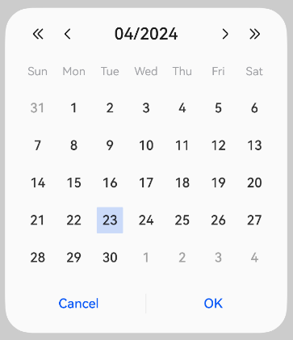

# Calendar Picker Dialog Box (CalendarPickerDialog)
<!--Kit: ArkUI-->
<!--Subsystem: ArkUI-->
<!--Owner: @luoying_ace_admin-->
<!--Designer: @weixin_52725220-->
<!--Tester: @xiong0104-->
<!--Adviser: @Brilliantry_Rui-->
<!-- md-trans-meta sourceCommit=9970006b63f1cf75a6caa0b3b5184fbee5a0f063 translatedAt=2026-08-28T01:41:41.547Z pushedAt=2026-09-01T07:28:52.521Z -->

Tapping a date opens a calendar picker dialog, where you can select a date. It is suitable for scenarios requiring date selection within an app, such as schedule management, booking systems, and form filling.

> **NOTE**
>
> - This component is supported since API version 10. Updates will be marked with a superscript to indicate their earliest API version.
>
> - The functionality of this module depends on the UI execution context. It cannot be used where the [UI context is not clear](../../../ui/arkts-global-interface.md#ambiguous-ui-context). For details, see [UIContext](../arkts-apis-uicontext-uicontext.md).
>
> - This module does not support hot updates for the light/dark color mode. To switch between the light and dark color modes, reopen the dialog box.

## CalendarPickerDialog

### show

static show(options?: CalendarDialogOptions): void

Displays a calendar picker dialog box for the user to select a date.

**Atomic service API**: This API can be used in atomic services since API version 11.

**Model restriction**: This API can be used only in the stage model.

**System capability**: SystemCapability.ArkUI.ArkUI.Full

**Device behavior differences**: On wearables, calling this API results in a runtime exception indicating that the API is undefined. On other devices, the API works correctly.

**Parameters**

| Name | Type                                                   | Mandatory| Description                      |
| ------- | ------------------------------------------------------- | ---- | -------------------------- |
| options | [CalendarDialogOptions](#calendardialogoptions) | No | Parameters for configuring the calendar picker dialog box. If this parameter is not set, the dialog box cannot be displayed. |

## CalendarDialogOptions

Defines the configuration options of the calendar picker dialog box.

Inherits from [CalendarOptions](ts-basic-components-calendarpicker.md#calendaroptions).

**Model restriction**: This API can be used only in the stage model.

**System capability**: SystemCapability.ArkUI.ArkUI.Full

**Device behavior differences**: On wearables, calling this API results in a runtime exception indicating that the API is undefined. On other devices, the API works correctly.

<!--Table: 20%; 20%; 8%; 8%; 44%-->
| Name      | Type                                           | Read-Only| Optional| Description                                                       |
| ---------- | ----------------------------------------------- | ---- | ------------------------------------------------------------ | ------------------------------------------------------------ |
| onAccept   | [Callback](ts-types.md#callback12)\<Date> | No  | Yes  | Callback invoked when the **OK** button in the dialog box is tapped.<br>The parameter of the callback indicates the selected date.<br>**Atomic service API:** This API can be used in atomic services since API version 11. |
| onCancel   | [VoidCallback](ts-types.md#voidcallback12) | No  | Yes  | Callback invoked when the **Cancel** button in the dialog box is tapped.<br>**Atomic service API:** This API can be used in atomic services since API version 11.                         |
| onChange   | [Callback](ts-types.md#callback12)\<Date> | No  | Yes  | Callback invoked when the selected date in the dialog box changes.<br>The parameter of the callback indicates the selected date.<br>**Atomic service API:** This API can be used in atomic services since API version 11. |
| backgroundColor<sup>11+</sup> | [ResourceColor](ts-types.md#resourcecolor)  | No | Yes | Background color of the dialog box.<br>Default value: **Color.Transparent**<br>**NOTE**<br>When **backgroundColor** is set to a non-transparent color, **backgroundBlurStyle** must be set to **BlurStyle.NONE**. Otherwise, the displayed background color will not meet the expected effect.<br>**Atomic service API:** This API can be used in atomic services since API version 12. |
| backgroundBlurStyle<sup>11+</sup> | [BlurStyle](ts-universal-attributes-background.md#blurstyle9) | No | Yes | Background blur material of the dialog box.<br>Default value: **BlurStyle.COMPONENT_ULTRA_THICK**<br>**NOTE**<br>Set this parameter to **BlurStyle.NONE** to disable the background blur. When **backgroundBlurStyle** is set to a value other than NONE, do not set **backgroundColor**. Otherwise, the displayed background color will not meet the expected effect. When **backgroundEffect** is set, it overrides the effect of this attribute.<br>**Atomic service API:** This API can be used in atomic services since API version 12. |
| backgroundBlurStyleOptions<sup>19+</sup> | [BackgroundBlurStyleOptions](ts-universal-attributes-background.md#backgroundblurstyleoptions10) | No | Yes | Background blur effect parameters, used to customize the display style of the dialog box background blur. It supports configuring attributes such as the color mode, adaptive color, and scale ratio to achieve different background blur visual effects. For the default value, see the **BackgroundBlurStyleOptions** type description.<br>**NOTE**<br>When not set, the default effect of **backgroundBlurStyle (BlurStyle.COMPONENT_ULTRA_THICK)** is used.<br>**Atomic service API:** This API can be used in atomic services since API version 19. |
| backgroundEffect<sup>19+</sup> | [BackgroundEffectOptions](ts-universal-attributes-background.md#backgroundeffectoptions11) | No | Yes | Background effect parameters, used to customize the display effect of the dialog box background. It supports configuring attributes such as the blur radius, saturation, brightness, and color to achieve different background visual effects. For the default value, see the **BackgroundEffectOptions** type description.<br>**NOTE**<br>When not set, this parameter does not take effect, and the dialog box background blur effect is determined by **backgroundBlurStyle**. When set, it overrides the effect of **backgroundBlurStyle**. Since API version 26.0.0, after **systemMaterial** is set, neither **backgroundEffect** nor **backgroundBlurStyle** takes effect.<br>**Atomic service API:** This API can be used in atomic services since API version 19. |
| acceptButtonStyle<sup>12+</sup> | [PickerDialogButtonStyle](ts-picker-common.md#pickerdialogbuttonstyle12) | No | Yes | Display style, importance, role, background color, corner radius, text color, font size, font weight, font style, font list, and whether the button responds to the Enter key by default for the confirm button.<br>**NOTE**<br>1. At most one of **acceptButtonStyle** and **cancelButtonStyle** can have the **primary** field set to **true**. If both are set to **true**, neither takes effect.<br>2. The button height is 40 vp by default and does not change in the care mode - large font scenario. Even if the button style is set to the rounded rectangle [ROUNDED_RECTANGLE](ts-basic-components-button.md#buttontype), in the care mode - large font scenario the button is still displayed as a capsule button [Capsule](ts-basic-components-button.md#buttontype).<br>**Atomic service API:** This API can be used in atomic services since API version 12.|
| cancelButtonStyle<sup>12+</sup> | [PickerDialogButtonStyle](ts-picker-common.md#pickerdialogbuttonstyle12) | No | Yes | Display style, importance, role, background color, corner radius, text color, font size, font weight, font style, font list, and whether the button responds to the Enter key by default for the cancel button.<br>**NOTE**<br>1. At most one of **acceptButtonStyle** and **cancelButtonStyle** can have the **primary** field set to **true**. If both are set to **true**, neither takes effect.<br>2. The button height is 40 vp by default and does not change in the care mode - large font scenario. Even if the button style is set to the rounded rectangle [ROUNDED_RECTANGLE](ts-basic-components-button.md#buttontype), in the care mode - large font scenario the button is still displayed as a capsule button [Capsule](ts-basic-components-button.md#buttontype).<br>**Atomic service API:** This API can be used in atomic services since API version 12.|
| onDidAppear<sup>12+</sup> | [VoidCallback](ts-types.md#voidcallback12) | No | Yes | Event callback after the dialog box is shown.<br>**NOTE**<br>1. The normal timing sequence is: **onWillAppear** >> **onDidAppear** >> (onAccept/onCancel/onChange) >> **onWillDisappear** >> **onDidDisappear**.<br>2. Callback events that change the display effect set in **onDidAppear** take effect when **show** is called again.<br>3. When the dialog box is rapidly and consecutively triggered to pop up and close, **onWillDisappear** may take effect before **onDidAppear**.<br>4. When the dialog box is closed before its entrance animation is complete, this callback is not triggered.<br>**Selection guidance:**<br>- **onWillAppear**: suitable for preparing data and resetting the state before the dialog box is displayed.<br>- **onDidAppear**: suitable for performing animations, initiating network requests, and setting focus after the dialog box is fully displayed, that is, operations that require the dialog box to be visible.<br>- **onWillDisappear**: suitable for saving data, cleaning up resources, and canceling network requests before the dialog box disappears.<br>- **onDidDisappear**: suitable for performing cleanup, resetting the state, and restoring other UI after the dialog box fully disappears.<br>**Atomic service API:** This API can be used in atomic services since API version 12. |
| onDidDisappear<sup>12+</sup> | [VoidCallback](ts-types.md#voidcallback12) | No | Yes | Event callback after the dialog box disappears.<br>**NOTE**<br>1. The normal timing sequence is: **onWillAppear** >> **onDidAppear** >> (onAccept/onCancel/onChange) >> **onWillDisappear** >> **onDidDisappear**.<br>**Atomic service API:** This API can be used in atomic services since API version 12. |
| onWillAppear<sup>12+</sup> | [VoidCallback](ts-types.md#voidcallback12) | No | Yes | Event callback before the dialog box display animation.<br>**NOTE**<br>1. The normal timing sequence is: **onWillAppear** >> **onDidAppear** >> (onAccept/onCancel/onChange) >> **onWillDisappear** >> **onDidDisappear**.<br>2. Callback events that change the dialog box display effect set in **onWillAppear** take effect when the dialog box is shown again.<br>**Atomic service API:** This API can be used in atomic services since API version 12.|
| onWillDisappear<sup>12+</sup> | [VoidCallback](ts-types.md#voidcallback12) | No | Yes | Event callback before the dialog box exit animation.<br>**NOTE**<br>1. The normal timing sequence is: **onWillAppear** >> **onDidAppear** >> (**onAccept**/**onCancel**/**onChange**) >> **onWillDisappear** >> **onDidDisappear**.<br>2. When the dialog box is rapidly and consecutively triggered to pop up and close, **onWillDisappear** may take effect before **onDidAppear**.<br>**Atomic service API:** This API can be used in atomic services since API version 12.|
| shadow<sup>12+</sup>              | [ShadowOptions](ts-universal-attributes-image-effect.md#shadowoptions) \| [ShadowStyle](ts-universal-attributes-image-effect.md#shadowstyle10) | No  | Yes  | Shadow of the dialog box background.<br>On 2-in-1 devices, in the default scenario, the focused shadow value is **ShadowStyle.OUTER_FLOATING_MD**, and the unfocused shadow value is **ShadowStyle.OUTER_FLOATING_SM**.<br>**Atomic service API:** This API can be used in atomic services since API version 12.|
| enableHoverMode<sup>14+</sup>     | boolean | No  | Yes  | Whether the dialog box responds to the hover mode. This parameter applies to devices that support the hover mode, such as foldable devices.<br>- **true**: The dialog box responds to the hover mode. In the hover mode of foldable devices, the layout area is adaptively adjusted to provide a better multitasking experience.<br>- **false**: The dialog box does not respond to the hover mode, and the default layout is retained in the hover mode.<br>Default value: **false**<br>**Atomic service API:** This API can be used in atomic services since API version 14.|
| hoverModeArea<sup>14+</sup>       | [HoverModeAreaType](ts-universal-attributes-sheet-transition.md#hovermodeareatype14) | No  | Yes  | Default display area of the dialog box in the hover mode. This parameter takes effect only when **enableHoverMode** is **true**. Different area values correspond to different layout positions of the dialog box in the hover mode of foldable devices (for example, **BOTTOM_SCREEN** indicates that the dialog box is displayed in the lower half of the screen, and **TOP_SCREEN** indicates that the dialog box is displayed in the upper half of the screen).<br>Default value: **HoverModeAreaType.BOTTOM_SCREEN**<br>**Atomic service API:** This API can be used in atomic services since API version 14.|
| markToday<sup>19+</sup>       | boolean | No  | Yes  | Whether the current system date remains highlighted in the calendar picker dialog box.<br>- **true**: The current system date remains highlighted in the calendar picker dialog box.<br>- **false**: The current system date is not highlighted in the calendar picker dialog box.<br>Default value: **false**<br>**Atomic service API:** This API can be used in atomic services since API version 19. |
| systemMaterial | [SystemUiMaterial](ts-universal-attributes-image-effect.md#systemuimaterial) | No | Yes | System material of the dialog box.<br>**NOTE**<br>- Default value: the [ImmersiveMaterial](../arkts-apis-uimaterial.md#immersivematerial) object whose [ImmersiveOptions](../arkts-apis-uimaterial.md#immersiveoptions) style is **ImmersiveStyle.ULTRA_THICK**. When set to **undefined**, it is consistent with the default value.<br>- Different materials have different visual effects, including differences in background transparency, blur degree, and shadow style. This API affects the background color [backgroundColor](ts-universal-attributes-background.md#backgroundcolor), background blur [backgroundBlurStyle](ts-universal-attributes-background.md#backgroundblurstyle9), background effect [backgroundEffect](ts-universal-attributes-background.md#backgroundeffect11), border color [borderColor](ts-universal-attributes-border.md#bordercolor), border width [borderWidth](ts-universal-attributes-border.md#borderwidth), and shadow [shadow](ts-universal-attributes-image-effect.md#shadow). When the system material is set, the preceding APIs do not take effect.<br>**Since:** 26.0.0<br>**Model restriction:** This API can be used only in the stage model.<br>**Atomic service API:** This API can be used in atomic services since API version 26.0.0.|

> **NOTE**
>
> When the application window is resized, the width of the dialog box is continuously compressed. If the window width is reduced below a certain threshold, the content of the dialog box may not be fully visible. To ensure that the content of the **CalendarPickerDialog** component is fully displayed, the minimum window width required is 386 vp.

## Example

### Example 1: Setting the Background

This example demonstrates how to set the calendar picker dialog box's background using **backgroundColor**, **backgroundBlurStyle**, and **shadow** in [CalendarDialogOptions](#calendardialogoptions).

```ts
// xxx.ets
@Entry
@Component
struct CalendarPickerDialogExample {
  private selectedDate: Date = new Date('2024-03-24');

  build() {
    Column() {
      Button('Show CalendarPicker Dialog')
        .margin(20)
        .onClick(() => {
          console.info('CalendarDialog.show');
          CalendarPickerDialog.show({
            selected: this.selectedDate,
            backgroundColor: Color.Gray,
            backgroundBlurStyle: BlurStyle.NONE,
            shadow: ShadowStyle.OUTER_FLOATING_SM,
            onAccept: (value) => {
              // Callback invoked when the OK button in the dialog box is clicked. value indicates the selected date.
              this.selectedDate = value;
              console.info('calendar onAccept:' + JSON.stringify(value));
            },
            onCancel: () => {
              // Callback invoked when the cancel button in the dialog box is clicked.
              console.info('calendar onCancel');
            },
            onChange: (value) => {
              // Callback invoked when the selection in the picker changes the selected date. value indicates the selected date.
              console.info('calendar onChange:' + JSON.stringify(value));
            },
            onDidAppear: () => {
              console.info('calendar onDidAppear');
            },
            onDidDisappear: () => {
              console.info('calendar onDidDisappear');
            },
            onWillAppear: () => {
              console.info('calendar onWillAppear');
            },
            onWillDisappear: () => {
              console.info('calendar onWillDisappear');
            }
          });
        })
    }.width('100%')
  }
}
```


### Example 2: Customizing the Button Style

This example shows how to customize the calendar picker dialog box's buttons by configuring **acceptButtonStyle** and **cancelButtonStyle** in [CalendarDialogOptions](#calendardialogoptions). This functionality is supported since API version 12.

```ts
// xxx.ets
@Entry
@Component
struct CalendarPickerDialogExample {
  private selectedDate: Date = new Date();

  build() {
    Column() {
      Button('Show CalendarPicker Dialog')
        .margin(20)
        .onClick(() => {
          console.info('CalendarDialog.show');
          CalendarPickerDialog.show({
            selected: this.selectedDate,
            acceptButtonStyle: {
              type: ButtonType.Normal,
              style: ButtonStyleMode.NORMAL,
              role: ButtonRole.NORMAL,
              fontColor: 'rgb(81, 81, 216)',
              fontSize: '26fp',
              fontWeight: FontWeight.Bolder,
              fontStyle: FontStyle.Normal,
              fontFamily: 'sans-serif',
              backgroundColor: '#A6ACAF',
              borderRadius: 20
            },
            cancelButtonStyle: {
              type: ButtonType.Normal,
              style: ButtonStyleMode.NORMAL,
              role: ButtonRole.NORMAL,
              fontColor: Color.Blue,
              fontSize: '16fp',
              fontWeight: FontWeight.Normal,
              fontStyle: FontStyle.Italic,
              fontFamily: 'sans-serif',
              backgroundColor: '#50182431',
              borderRadius: 10
            },
            onAccept: (value) => {
              this.selectedDate = value;
              console.info('calendar onAccept:' + JSON.stringify(value));
            }
          });
        })
    }.width('100%')
  }
}
```


### Example 3: Configuring a Dialog Box in the Hover State

This example demonstrates how to set the layout area of a dialog box when the device is in semi-folded mode. This functionality is supported since API version 14.

```ts
@Entry
@Component
struct CalendarPickerDialogExample {
  private selectedDate: Date = new Date('2024-04-23');

  build() {
    Column() {
      Button('Show CalendarPicker Dialog')
        .margin(20)
        .onClick(() => {
          console.info('CalendarDialog.show');
          CalendarPickerDialog.show({
            selected: this.selectedDate,
            onAccept: (value) => {
              console.info('calendar onAccept:' + JSON.stringify(value));
            },
            onCancel: () => {
              console.info('calendar onCancel');
            },
            onChange: (value) => {
              console.info('calendar onChange:' + JSON.stringify(value));
            },
            onDidAppear: () => {
              console.info('calendar onDidAppear');
            },
            onDidDisappear: () => {
              console.info('calendar onDidDisappear');
            },
            onWillAppear: () => {
              console.info('calendar onWillAppear');
            },
            onWillDisappear: () => {
              console.info('calendar onWillDisappear');
            },
            enableHoverMode: true,
            hoverModeArea: HoverModeAreaType.TOP_SCREEN,
          });
        })
    }.width('100%')
  }
}
```

<!--Del--> <!--DelEnd-->

### Example 4: Setting the Background Style for the Selected Date

This example demonstrates how to customize the background style of the selected date using **hintRadius** in [CalendarOptions](ts-basic-components-calendarpicker.md#calendaroptions). This functionality is supported since API version 10.

```ts
// xxx.ets
@Entry
@Component
struct CalendarPickerDialogExample {
  private selectedDate: Date = new Date('2024-04-23');

  build() {
    Column() {
      Button('Show CalendarPicker Dialog')
        .margin(20)
        .onClick(() => {
          console.info('CalendarDialog.show');
          CalendarPickerDialog.show({
            selected: this.selectedDate,
            hintRadius: 1,
            onAccept: (value) => {
              // Triggered when the "OK" button in the dialog box is tapped. The value indicates the selected date.
              this.selectedDate = value;
              console.info('calendar onAccept:' + JSON.stringify(value));
            }
          });
        })
    }.width('100%')
  }
}
```



### Example 5: Setting Start and End Dates

This example demonstrates how to set the start and end dates for the calendar picker dialog box using **start** and **end** in [CalendarOptions](ts-basic-components-calendarpicker.md#calendaroptions). This functionality is supported since API version 18.

```ts
// xxx.ets
@Entry
@Component
struct CalendarPickerDialogExample {
  private selectedDate: Date = new Date('2025-01-01');
  private startDate: Date = new Date('2024-01-10');
  private endDate: Date = new Date('2025-01-10');

  build() {
    Column() {
      Text('Calendar date picker').fontSize(30)
      Button('Show CalendarPicker Dialog')
        .margin(20)
        .onClick(() => {
          console.info('CalendarDialog.show');
          CalendarPickerDialog.show({
            start: this.startDate,
            end: this.endDate,
            selected: this.selectedDate,
          });
        })
    }.width('100%').margin({ top: 350 })
  }
}  
```

<!--Del--> <!--DelEnd-->

### Example 6: Highlighting the Current Date and Configuring Disabled Date Ranges

This example demonstrates how to keep the current system date highlighted in the calendar picker dialog box using the **markToday** property in [CalendarDialogOptions](#calendardialogoptions) and set disabled date ranges using the **disabledDateRange** property in [CalendarOptions](ts-basic-components-calendarpicker.md#calendaroptions). This functionality is supported since API version 19.

```ts
// xxx.ets
@Entry
@Component
struct CalendarPickerDialogExample {
  private disabledDateRange: DateRange[] = [
    { start: new Date('2025-01-01'), end: new Date('2025-01-02') },
    { start: new Date('2025-01-09'), end: new Date('2025-01-10') },
    { start: new Date('2025-01-15'), end: new Date('2025-01-16') },
    { start: new Date('2025-01-19'), end: new Date('2025-01-19') },
    { start: new Date('2025-01-22'), end: new Date('2025-01-25') }
  ];

  build() {
    Column() {
      Button('Show CalendarPicker Dialog')
        .margin(20)
        .onClick(() => {
          console.info('CalendarDialog.show');
          CalendarPickerDialog.show({ markToday: true, disabledDateRange: this.disabledDateRange });
        })
    }.width('100%').margin({ top: 350 })
  }
}
```

<!--Del--> <!--DelEnd-->

### Example 7: Customizing the Background Blur Effect

This example demonstrates how to customize the background blur effect by configuring [backgroundBlurStyleOptions](#calendardialogoptions). This functionality is supported since API version 19.

```ts
@Entry
@Component
struct CalendarPickerDialogExample {
  private selectedDate: Date = new Date('2025-08-05');

  build() {
    Stack({ alignContent: Alignment.Top }) {
      // Replace $r('app.media.bg') with the image resource file you use.
      Image($r('app.media.bg'))
      Column() {
        Button('Show CalendarPicker Dialog')
          .margin(20)
          .onClick(() => {
            CalendarPickerDialog.show({
              selected: this.selectedDate,
              hintRadius: 1,
              backgroundColor: undefined,
              backgroundBlurStyle: BlurStyle.Thin,
              backgroundBlurStyleOptions: {
                colorMode: ThemeColorMode.LIGHT,
                adaptiveColor: AdaptiveColor.AVERAGE,
                scale: 1,
                blurOptions: { grayscale: [20, 20] },
              },
            });
          })
      }.width('100%')
    }
  }
}
```

<!--Del--> <!--DelEnd-->

### Example 8: Customizing the Background Effect

This example demonstrates how to customize the background effect by configuring [backgroundEffect](#calendardialogoptions). This functionality is supported since API version 19.

```ts
@Entry
@Component
struct CalendarPickerDialogExample {
  private selectedDate: Date = new Date('2025-08-05');

  build() {
    Stack({ alignContent: Alignment.Top }) {
      // Replace $r('app.media.bg') with the image resource file you use.
      Image($r('app.media.bg'))
      Column() {
        Button('Show CalendarPicker Dialog')
          .margin(20)
          .onClick(() => {
            CalendarPickerDialog.show({
              selected: this.selectedDate,
              hintRadius: 1,
              backgroundColor: undefined,
              backgroundBlurStyle: BlurStyle.Thin,
              backgroundEffect: {
                radius: 60,
                saturation: 0,
                brightness: 1,
                color: Color.White,
                blurOptions: { grayscale: [20, 20] }
              },
            });
          })
      }.width('100%')
    }
  }
}
```

<!--Del--> <!--DelEnd-->

### Example 9: Setting the System Material

This example implements the system material effect by configuring [systemMaterial](#calendardialogoptions).

Since API version 26.0.0, the **systemMaterial** attribute has been added to **CalendarDialogOptions**.

```ts
import { uiMaterial } from '@kit.ArkUI';

@Entry
@Component
struct CalendarPickerDialogExample {
  private selectedDate: Date = new Date('2025-08-05');

  build() {
    Stack({ alignContent: Alignment.Top }) {
      Column() {
        Button('Show CalendarPicker Dialog')
          .margin(20)
          .onClick(() => {
            CalendarPickerDialog.show({
              selected: this.selectedDate,
              systemMaterial: new uiMaterial.ImmersiveMaterial({ style: uiMaterial.ImmersiveStyle.ULTRA_THICK })
            });
          })
      }.width('100%')
    }
  }
}
```

<!--Del--> <!--DelEnd-->