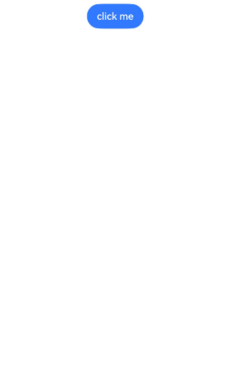
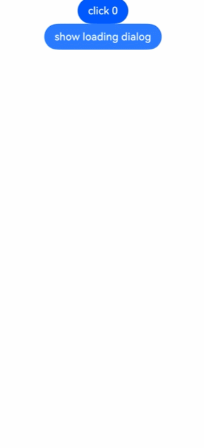
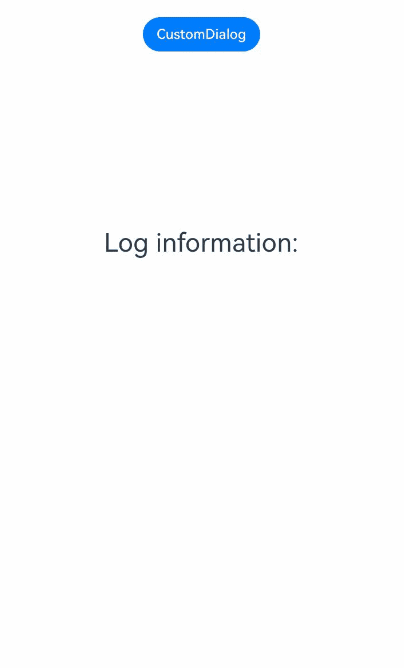
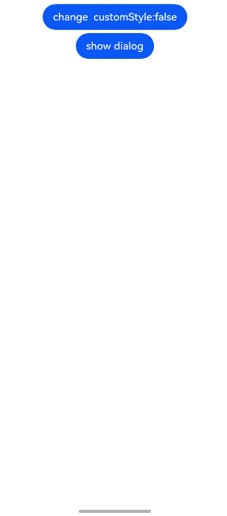
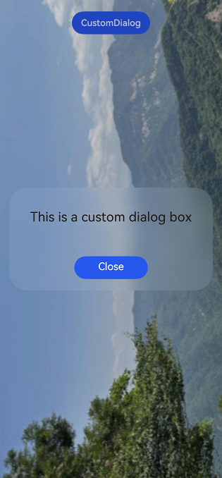
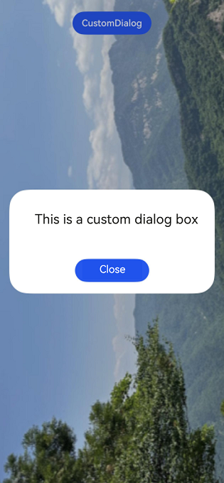
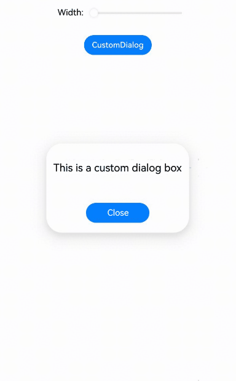

# Custom Dialog Box (CustomDialog)
<!--Kit: ArkUI-->
<!--Subsystem: ArkUI-->
<!--Owner: @houguobiao-->
<!--Designer: @houguobiao-->
<!--Tester: @lxl007-->
<!--Adviser: @HelloCrease-->

A custom dialog box is a dialog box you customize by using APIs of the **CustomDialogController** class. When using the dialog box component, you are advised to use the custom dialog box to customize the dialog box style and content.

> **NOTE**
>
> The initial APIs of this module are supported since API version 7. Updates will be marked with a superscript to indicate their earliest API version.

## CustomDialogController

Controller of the custom dialog box.

**Atomic service API**: This API can be used in atomic services since API version 11.

**System capability**: SystemCapability.ArkUI.ArkUI.Full

### Objects to Import

```ts
dialogController : CustomDialogController | null = new CustomDialogController(CustomDialogControllerOptions)
```
> **NOTE**
>
> - CustomDialogController is valid only when it is used as a member variable of @CustomDialog and @Component struct and is defined inside @Component struct. For details, see the following example.
>
> - If you want to pass multiple controllers to CustomDialog to open another or other CustomDialogs in CustomDialog, you need to place the controller that points to itself at the end of all controllers. For details, see [Example 1: Opening Nested Dialog Boxes](#example-1-opening-nested-dialog-boxes).

### constructor

constructor(value: CustomDialogControllerOptions)

Constructor for a custom dialog box.

> **NOTE**
>
> All parameters of the custom dialog box cannot be dynamically refreshed. However, you can set customStyle to true, and set attributes such as [background color](ts-universal-attributes-background.md#backgroundcolor), [background blur](ts-universal-attributes-background.md#backgroundblurstyle9), and [width and height](ts-universal-attributes-size.md) on the custom component to implement dynamic refresh through the state variable bound to the attribute.
>
> If CustomDialogController is used as a global variable to implement global custom dialog boxes, the previous dialog box cannot be closed by setting controller to a new value. You are advised to close the dialog box before setting controller to a new value.
>
> When a custom dialog box is opened in a custom dialog box, you are advised not to directly close the custom dialog box.

**Atomic service API**: This API can be used in atomic services since API version 11.

**System capability**: SystemCapability.ArkUI.ArkUI.Full

**Parameters**

| Name| Type                                                        | Mandatory| Description                  |
| ------ | ------------------------------------------------------------ | ---- | ---------------------- |
| value  | [CustomDialogControllerOptions](#customdialogcontrolleroptions) | Yes  | Parameters of the custom dialog box.|

### open

open()

Opens the content of the custom dialog box. This API can be called multiple times. If the dialog box is displayed in a subwindow, no new subwindow is allowed.

>  **NOTE**
>
>  CustomDialog with showInSubwindow set to true is not supported in the input method window. For details, see the restrictions of the input method framework [createPanel](../../apis-ime-kit/js-apis-inputmethodengine.md#createpanel10-1).

**Atomic service API**: This API can be used in atomic services since API version 11.

**System capability**: SystemCapability.ArkUI.ArkUI.Full


### close

close()

**Atomic service API**: This API can be used in atomic services since API version 11.

**System capability**: SystemCapability.ArkUI.ArkUI.Full


Closes the custom dialog box. If the dialog box is closed, this API does not take effect.

### getState<sup>20+</sup>

getState(): PromptActionCommonState

Obtains the state of the custom dialog box.

**Atomic service API**: This API can be used in atomic services since API version 20.

**System capability**: SystemCapability.ArkUI.ArkUI.Full

**Return value**

| Type| Description|
| -------- | -------- |
| [PromptActionCommonState](#promptactioncommonstate20) | State of the custom dialog box.|

## PromptActionCommonState<sup>20+</sup>

type PromptActionCommonState = promptAction.CommonState

Enumerates states of the custom dialog box.

**Atomic service API**: This API can be used in atomic services since API version 20.

**System capability**: SystemCapability.ArkUI.ArkUI.Full

| Type| Description|
| -------- | -------- |
| [promptAction.CommonState](../js-apis-promptAction.md#commonstate20)| State of the custom dialog box.|

## CustomDialogControllerOptions

Style of a custom dialog box.

**System capability**: SystemCapability.ArkUI.ArkUI.Full

| Name                          | Type                                    | Read-Only| Optional| Description                                    |
| ----------------------------- | ---------------------------------------- | ---- | ---------------------------------------- | ---------------------------------------- |
| builder                       | [CustomDialog](../../../ui/arkts-common-components-custom-dialog.md) | No  | No  | Builder of the custom dialog box content.<br>**NOTE**<br>If the builder uses a callback function as an input parameter, note the binding of this. For example, builder: custombuilder({ callback : ()=> {...}}).<br>If data changes need to be listened in the builder, you can use @Link or @Consume. Other methods, such as @Prop and @ObjectLink, are not applicable to this scenario.<br>**Atomic service API**: This API can be used in atomic services since API version 11.|
| cancel                        | () =&gt; void                  | No   | Yes  | Callback invoked when the dialog box is closed after the Back button or mask is touched or the Esc key is pressed.<br>**Atomic service API**: This API can be used in atomic services since API version 11.|
| autoCancel                    | boolean                                  | No   | Yes  | Whether to close the dialog box when the mask is touched. The value **true** means to close the dialog box when the mask is touched, and **false** means the opposite.<br>Default value: **true**<br>**Atomic service API**: This API can be used in atomic services since API version 11.|
| alignment                     | [DialogAlignment](ts-methods-alert-dialog-box.md#dialogalignment) | No   | Yes  | Alignment mode of the dialog box in the vertical direction.<br>Default value: **DialogAlignment.Default**<br>**Atomic service API**: This API can be used in atomic services since API version 11.|
| offset                        | [Offset](ts-types.md#offset)             | No   | Yes  | Offset of the dialog box relative to the alignment position.<br>Default value: **{dx: 0, dy: 0}**<br>**Atomic service API**: This API can be used in atomic services since API version 11.|
| customStyle                   | boolean                                  | No   | Yes  | Whether to use a custom style for the dialog box. If the value is true, the pop-up window container style cannot be customized. If the value is false, the pop-up window style can be customized.<br>When this parameter is set to **false** (default value):<br>1. The rounded corner is 32 vp.<br>2. If the width and height of the pop-up window are not set, the width of the pop-up window container is automatically adapted based on the grid system. and its height to the child components.<br>3. Set the width and height of the pop-up window. The width of the pop-up window container cannot exceed the maximum width in the default style (100% width is set for a customized node), and the height of the pop-up window container cannot exceed the maximum height in the default style (100% height is set for a customized node).<br>4. Affected by the security zone, the area displayed in the pop-up window excludes the security zone.<br>When this parameter is set to **true**:<br>1. The rounded corner is 0, and the background color of the pop-up window is transparent.<br>2. The pop-up window width, height, border width, border style, border color, and shadow width cannot be set.<br>3. The pop-up window is displayed on the screen.<br>**Atomic service API**: This API can be used in atomic services since API version 11.|
| gridCount<sup>8+</sup>        | number                                   | No   | Yes  | Number of [grid columns](../../../ui/arkts-layout-development-grid-layout.md) occupied by the dialog box.<br>The default value is subject to the window size, and the maximum value is the maximum number of columns supported by the system. If this parameter is set to an invalid value, the default value is used.<br>Value range: an integer no less than 0<br>**Atomic service API**: This API can be used in atomic services since API version 11.|
| maskColor<sup>10+</sup>       | [ResourceColor](ts-types.md#resourcecolor) | No   | Yes  | Custom mask color.<br>Default value: 0x33000000<br>**Atomic service API**: This API can be used in atomic services since API version 11.             |
| maskRect<sup>10+</sup>        | [Rectangle](ts-methods-alert-dialog-box.md#rectangle8) | No    | Yes   | Mask area of the dialog box. Events outside the mask area are transparently transmitted, and events within the mask area are not.<br>Default value: **{ x: 0, y: 0, width: '100%', height: '100%' }**<br>**NOTE**<br>**maskRect** does not take effect when **showInSubWindow** is set to **true**.<br>**Atomic service API**: This API can be used in atomic services since API version 11.|
| openAnimation<sup>10+</sup>   | [AnimateParam](ts-explicit-animation.md#animateparam) | No   | Yes  | Parameters for defining the open animation of the dialog box.<br>**NOTE**<br>**tempo**: The default value is **1**; a value less than or equal to 0 is handled as the default value.<br>**iterations**: The default value is **1**, indicating that the animation is played once; any other value is handled as the default value.<br>**playMode**: The default value is **PlayMode.Normal**; any other value is handled as the default value.<br>**Atomic service API**: This API can be used in atomic services since API version 11.|
| closeAnimation<sup>10+</sup>  | [AnimateParam](ts-explicit-animation.md#animateparam) | No   | Yes  | Parameters for defining the close animation of the dialog box.<br>**NOTE**<br>**tempo**: The default value is **1**; a value less than or equal to 0 is handled as the default value.<br>**iterations**: The default value is **1**, indicating that the animation is played once; any other value is handled as the default value.<br>**playMode**: The default value is **PlayMode.Normal**; any other value is handled as the default value.<br>For page transition, you are advised to use the default close animation.<br>**Atomic service API**: This API can be used in atomic services since API version 11.|
| showInSubWindow<sup>10+</sup> | boolean                                  | No   | Yes  | Whether to show the dialog box in a subwindow when the dialog box needs to be displayed outside the main window. **true**: The dialog box is shown in a subwindow.<br>Default value: **false**<br>**NOTE**<br>A dialog box whose **showInSubWindow** attribute is **true** cannot trigger the display of another dialog box whose **showInSubWindow** attribute is also **true**. You are advised not to use the CalendarPicker, CalendarPickerDialog, DatePickerDialog, TextPickerDialog, TimePickerDialog, or Toast component in a dialog box whose showInSubWindow is set to true. The dialog box may affect the behavior of the preceding components.<br>**Atomic service API**: This API can be used in atomic services since API version 11.|
| backgroundColor<sup>10+</sup> | [ResourceColor](ts-types.md#resourcecolor)      | No  | Yes | Background color of the dialog box.<br>Default value: **Color.Transparent**<br>**NOTE**<br>If the content builder also has the background color set, the background color set here will be overridden by the background color of the content builder.<br>The background color will be visually combined with the blur effect when both properties are set. If the resulting effect does not match your design requirements, you can disable the blur effect entirely by explicitly setting the **backgroundBlurStyle** property to **BlurStyle.NONE**.<br>**Atomic service API**: This API can be used in atomic services since API version 11.|
| cornerRadius<sup>10+</sup>    | [Dimension](ts-types.md#dimension10) \| [BorderRadiuses](ts-types.md#borderradiuses9) | No  | Yes | Radius of the rounded corners of the background.<br>You can set separate radiuses for the four rounded corners.<br>Default value: **{ topLeft: '32vp', topRight: '32vp', bottomLeft: '32vp', bottomRight: '32vp' }**<br>**NOTE**<br>This attribute must be used together with the [borderRadius](ts-universal-attributes-border.md#borderradius) attribute.<br>**Atomic service API**: This API can be used in atomic services since API version 11.|
| isModal<sup>11+</sup> | boolean | No| Yes| Whether the dialog box is a modal, which has a mask applied and does not allow for interaction with other components around the menu. <br>**true**: The dialog box is a modal. <br>**false**: The dialog box is not a modal.<br>Default value: **true**<br>**Atomic service API**: This API can be used in atomic services since API version 12.|
| onWillDismiss<sup>12+</sup> | Callback<[DismissDialogAction](#dismissdialogaction12)> | No| Yes| Callback for interactive closure of the dialog box.<br>**NOTE**<br>1. If this callback is registered, the dialog box will not be dismissed immediately after the user touches the mask or the Back button, presses the Esc key, or swipes left or right on the screen. The **reason** parameter in the callback is used to determine whether the dialog box can be closed. The reason returned by the component does not support the value **CLOSE_BUTTON**.<br>2. In the **onWillDismiss** callback, another **onWillDismiss** callback is not allowed.<br>**Atomic service API**: This API can be used in atomic services since API version 12.|
| borderWidth<sup>12+</sup> | [Dimension](ts-types.md#dimension10) \| [EdgeWidths](ts-types.md#edgewidths9)  | No| Yes| Border width of the dialog box.<br>You can set the width for all four sides or set separate widths for individual sides.<br>Default value: **0**<br> When set to a percentage, the value defines the border width as a percentage of the parent dialog box's width.<br>If the left and right borders are greater than its width, or the top and bottom borders are greater than its height, the dialog box may not display as expected.<br>**Atomic service API**: This API can be used in atomic services since API version 12.|
| borderColor<sup>12+</sup> | [ResourceColor](ts-types.md#resourcecolor) \| [EdgeColors](ts-types.md#edgecolors9)  | No| Yes| Border color of the dialog box.<br>Default value: **Color.Black**<br>**borderColor** must be used with **borderWidth** in pairs.<br>**Atomic service API**: This API can be used in atomic services since API version 12.|
| borderStyle<sup>12+</sup> | [BorderStyle](ts-appendix-enums.md#borderstyle) \| [EdgeStyles](ts-types.md#edgestyles9)  | No| Yes| Border style of the dialog box.<br>Default value: **BorderStyle.Solid**<br>**borderStyle** must be used with **borderWidth** in pairs.<br>**Atomic service API**: This API can be used in atomic services since API version 12.|
| width<sup>12+</sup> | [Dimension](ts-types.md#dimension10) | No  | Yes | Width of the dialog box.<br>**NOTE**<br>- Default maximum width of the dialog box: 400 vp<br>- When this parameter is set to a percentage, the reference width of the dialog box is the width of the window where the dialog box is located. You can decrease or increase the width as needed.<br>**Atomic service API**: This API can be used in atomic services since API version 12.|
| height<sup>12+</sup> | [Dimension](ts-types.md#dimension10)   | No| Yes| Height of the dialog box.<br>**NOTE**<br>- Default maximum height of the dialog box: 0.9 x (Window height – Safe area)<br>- When this parameter is set to a percentage, the reference height of the dialog box is the height of the window where the dialog box is located minus the safe area. You can decrease or increase the height as needed.<br>**Atomic service API**: This API can be used in atomic services since API version 12.|
| shadow<sup>12+</sup> | [ShadowOptions](ts-universal-attributes-image-effect.md#shadowoptions) \| [ShadowStyle](ts-universal-attributes-image-effect.md#shadowstyle10)   | No| Yes| Shadow of the dialog box.<br> Default value on 2-in-1 devices: **ShadowStyle.OUTER_FLOATING_MD** when the dialog box is focused and **ShadowStyle.OUTER_FLOATING_SM** otherwise On other devices, the dialog box has no shadow by default.<br>**Atomic service API**: This API can be used in atomic services since API version 12.|
| backgroundBlurStyle<sup>12+</sup> | [BlurStyle](ts-universal-attributes-background.md#blurstyle9)                 | No  | Yes | Background blur style of the dialog box.<br>Default value: **BlurStyle.COMPONENT_ULTRA_THICK**<br>**NOTE**<br>Setting this parameter to **BlurStyle.NONE** disables the background blur. When **backgroundBlurStyle** is set to a value other than **NONE**, do not set **backgroundColor**. If you do, the color display may not produce the expected visual effect.<br>**Atomic service API**: This API can be used in atomic services since API version 12.|
| backgroundBlurStyleOptions<sup>19+</sup> | [BackgroundBlurStyleOptions](ts-universal-attributes-background.md#backgroundblurstyleoptions10)| No| Yes| Options for customizing the background blur style. For details about the default value, see **BackgroundBlurStyleOptions**.<br>**Atomic service API**: This API can be used in atomic services since API version 19.|
| backgroundEffect<sup>19+</sup> | [BackgroundEffectOptions](ts-universal-attributes-background.md#backgroundeffectoptions11) | No| Yes| Options for customizing the background effect. For details about the default value, see **BackgroundEffectOptions**.<br>**Atomic service API**: This API can be used in atomic services since API version 19.|
| keyboardAvoidMode<sup>12+</sup> | [KeyboardAvoidMode](ts-universal-attributes-popup.md#keyboardavoidmode12) | No| Yes| How the dialog box avoids the soft keyboard when it is brought up.<br>Default value: **KeyboardAvoidMode.DEFAULT**<br>**Atomic service API**: This API can be used in atomic services since API version 12.|
| enableHoverMode<sup>14+</sup>     | boolean | No  | Yes | Whether to respond when the device is in semi-folded mode. The value **true** means to respond when the device is in semi-folded mode.<br>Default value: **false**, meaning not to enable the hover state.<br>**Atomic service API**: This API can be used in atomic services since API version 14.|
| hoverModeArea<sup>14+</sup>       | [HoverModeAreaType](ts-universal-attributes-sheet-transition.md#hovermodeareatype14) | No  | Yes | Display area of the dialog box in the hover state.<br>Default value: **HoverModeAreaType.BOTTOM_SCREEN**<br>**Atomic service API**: This API can be used in atomic services since API version 14.|
| onWillAppear<sup>19+</sup> | Callback&lt;void&gt; | No| Yes| Event callback when the dialog box is about to appear.<br>**NOTE**<br>1. The normal timing sequence is as follows: onWillAppear > onDidAppear > onWillDisappear > onDidDisappear.<br>2. You can set the callback event for changing the dialog box display effect in **onWillAppear**. The settings take effect next time the dialog box appears.<br>**Atomic service API**: This API can be used in atomic services since API version 19.|
| onDidAppear<sup>19+</sup> | Callback&lt;void&gt; | No| Yes| Event callback when the dialog box appears.<br>**NOTE**<br>1. The normal timing sequence is as follows: onWillAppear > onDidAppear > onWillDisappear > onDidDisappear.<br>2. You can set the callback event for changing the dialog box display effect in **onDidAppear**. The settings take effect next time the dialog box appears.<br>3. When a dialog box is dismissed immediately after being shown, **onWillDisappear** may be triggered before **onDidAppear**.<br>4. If the dialog box is dismissed before its entrance animation is finished, the animation will be interrupted, and **onDidAppear** will not be triggered.<br>**Atomic service API**: This API can be used in atomic services since API version 19.|
| onWillDisappear<sup>19+</sup> | Callback&lt;void&gt; | No| Yes| Event callback when the dialog box is about to disappear.<br>**NOTE**<br>1. The normal timing sequence is as follows: onWillAppear > onDidAppear > onWillDisappear > onDidDisappear.<br> **Atomic service API**: This API can be used in atomic services since API version 19.|
| onDidDisappear<sup>19+</sup> | Callback&lt;void&gt; | No| Yes| Event callback when the dialog box disappears.<br>**NOTE**<br>1. The normal timing sequence is as follows: onWillAppear > onDidAppear > onWillDisappear > onDidDisappear.<br>**Atomic service API**: This API can be used in atomic services since API version 19.|
| keyboardAvoidDistance<sup>15+</sup>       | [LengthMetrics](../js-apis-arkui-graphics.md#lengthmetrics12) | No  | Yes | Distance between the dialog box and the keyboard after keyboard avoidance is applied.<br>**NOTE**<br>- Default value: **16vp**<br>- Default unit: vp<br>- This parameter takes effect only when **keyboardAvoidMode** is set to **DEFAULT**.<br>**Atomic service API**: This API can be used in atomic services since API version 15.|
| levelMode<sup>15+</sup>       | [LevelMode](../js-apis-promptAction.md#levelmode15) | No  | Yes | Display level of the dialog box.<br>**NOTE**<br>- Default value: **LevelMode.OVERLAY.**<br>- This parameter takes effect only when **showInSubWindow** is set to **false**.<br>**Atomic service API**: This API can be used in atomic services since API version 15.|
| levelUniqueId<sup>15+</sup>       | number | No  | Yes | [Unique ID](../js-apis-arkui-frameNode.md#getuniqueid12) of the node under the display level for the page-level dialog box.<br>Value range: a number no less than 0<br>**NOTE**<br>- This parameter takes effect only when **levelMode** is set to **LevelMode.EMBEDDED**.<br>**Atomic service API**: This API can be used in atomic services since API version 15.|
| immersiveMode<sup>15+</sup>       | [ImmersiveMode](../js-apis-promptAction.md#immersivemode15) | No  | Yes | Overlay effect for the page-level dialog box.<br>**NOTE**<br>- Default value: **ImmersiveMode.DEFAULT**<br>- This parameter takes effect only when **levelMode** is set to **LevelMode.EMBEDDED**.<br>**Atomic service API**: This API can be used in atomic services since API version 15.|
| levelOrder<sup>18+</sup>       | [LevelOrder](../js-apis-promptAction.md#levelorder18) | No  | Yes | Display order of the dialog box.<br>**NOTE**<br>- Default value: **LevelOrder.clamp(0)**<br>- Dynamic updating is not supported.<br>**Atomic service API**: This API can be used in atomic services since API version 18.|
| focusable<sup>19+</sup>       | boolean | No  | Yes | Whether the dialog box can gain focus. <br>**true**: The dialog box can gain focus.<br>**false**: The dialog box cannot gain focus.<br>Default value: **true**<br>**NOTE**<br>Only dialog boxes that are displayed on top of the current window can gain focus.<br>**Atomic service API**: This API can be used in atomic services since API version 19.|

> **NOTE**
>
> - Pressing the Back or ESC key closes the dialog box.
> - If the dialog box reaches its maximum allowable height on the screen when avoiding the soft keyboard, it reduces its height to fit.
>   It should be noted that this height adjustment is applied to the outermost container. If a child component within this container has been assigned a larger fixed height, since the container does not clip its content by default, parts of the dialog box may still be displayed off-screen.
> - Use the custom dialog box to contain simple alert messages only. Do not use it as a page. When the dialog box avoids the soft keyboard, there is a 16 vp safe spacing between the two.
> - To achieve a good visual experience, the pop-up window has a default animation for display and closing. The animation duration may vary depending on the device.
>   Note: During the animation playback, the page does not respond to touch, sliding, or tap operations. You can set duration of openAnimation and closeAnimation to 0 to disable the default animation effect of the pop-up window.
> - In ArkUI, dialog boxes do not close automatically when you switch pages unless you manually call **close**. To enable a dialog box to be dismissed during page navigation, consider using the [navigation page displayed in dialog mode](../../../ui/arkts-navigation-navigation.md#page-display-mode) or [page-level dialog box](../../../ui/arkts-embedded-dialog.md).

## DismissDialogAction<sup>12+</sup>

Provides information about the action to dismiss the dialog box.

**Atomic service API**: This API can be used in atomic services since API version 12.

**System capability**: SystemCapability.ArkUI.ArkUI.Full

### Properties

| Name   | Type                                                        | Read-Only| Optional| Description                                                        |
| ------- | ------------------------------------------------------------ | ---- | ---- | ------------------------------------------------------------ |
| dismiss | Callback&lt;void&gt;                                         | No  | No  | Callback for dismissing the dialog box. This API is called only when the dialog box needs to be exited.|
| reason  | [DismissReason](ts-universal-attributes-popup.md#dismissreason12) | No  | No  | Reason why the dialog box cannot be dismissed. You must specify whether to close the dialog box for each of the listed actions.|

## Example

### Example 1: Opening Nested Dialog Boxes

This example demonstrates how to open one or more custom dialog boxes within another custom dialog box.

```ts
// xxx.ets
@CustomDialog
struct CustomDialogExampleTwo {
  controllerTwo?: CustomDialogController;
  build() {
    Column() {
      Text('I'm the second dialog box')
        .fontSize(30)
        .height(100)
      Button('Close Second Dialog Box')
        .onClick(() => {
          if (this.controllerTwo != undefined) {
            this.controllerTwo.close();
          }
        })
        .margin(20)
    }
  }
}
@CustomDialog
@Component
struct CustomDialogExample {
  @Link textValue: string;
  @Link inputValue: string;
  dialogControllerTwo: CustomDialogController | null = new CustomDialogController({
    builder: CustomDialogExampleTwo(),
    alignment: DialogAlignment.Bottom,
    onWillDismiss:(dismissDialogAction: DismissDialogAction)=> {
      console.info(`reason= ${dismissDialogAction.reason}`);
      console.info('dialog onWillDismiss');
      if (dismissDialogAction.reason == DismissReason.PRESS_BACK) {
        dismissDialogAction.dismiss();
      }
      if (dismissDialogAction.reason == DismissReason.TOUCH_OUTSIDE) {
        dismissDialogAction.dismiss();
      }
    },
    offset: { dx: 0, dy: -25 } })
  controller?: CustomDialogController;
  // You can pass in multiple other controllers in the CustomDialog to open one or more other CustomDialogs in the CustomDialog. In this case, you must place the controller pointing to the self behind all controllers.
  cancel: () => void = () => {
  }
  confirm: () => void = () => {
  }

  build() {
    Column() {
      Text('Change text').fontSize(20).margin({ top: 10, bottom: 10 })
      TextInput({ placeholder: '', text: this.textValue }).height(60).width('90%')
        .onChange((value: string) => {
          this.textValue = value;
        })
      Text('Are you sure you want to change the text?').fontSize(16).margin({ bottom: 10 })
      Flex({ justifyContent: FlexAlign.SpaceAround }) {
        Button('No')
          .onClick(() => {
            if (this.controller != undefined) {
              this.controller.close();
              this.cancel();
            }
          }).backgroundColor(0xffffff).fontColor(Color.Black)
        Button('OK')
          .onClick(() => {
            if (this.controller != undefined) {
              this.inputValue = this.textValue;
              this.controller.close();
              this.confirm();
            }
          }).backgroundColor(0xffffff).fontColor(Color.Red)
      }.margin({ bottom: 10 })

      Button('Open Second Dialog Box')
        .onClick(() => {
          if (this.dialogControllerTwo != null) {
            this.dialogControllerTwo.open();
          }
        })
        .margin(20)
    }.borderRadius(10)
    // When using the border or cornerRadius attribute, use it together with the borderRadius attribute.
  }
}
@Entry
@Component
struct CustomDialogUser {
  @State textValue: string = ''
  @State inputValue: string = 'click me'
  dialogController: CustomDialogController | null = new CustomDialogController({
    builder: CustomDialogExample({
      cancel: ()=> { this.onCancel(); },
      confirm: ()=> { this.onAccept(); },
      textValue: this.textValue,
      inputValue: this.inputValue
    }),
    cancel: this.exitApp,
    autoCancel: true,
    onWillDismiss:(dismissDialogAction: DismissDialogAction)=> {
      console.info(`reason= ${dismissDialogAction.reason}`);
      console.info('dialog onWillDismiss');
      if (dismissDialogAction.reason == DismissReason.PRESS_BACK) {
        dismissDialogAction.dismiss();
      }
      if (dismissDialogAction.reason == DismissReason.TOUCH_OUTSIDE) {
        dismissDialogAction.dismiss();
      }
    },
    alignment: DialogAlignment.Bottom,
    offset: { dx: 0, dy: -20 },
    gridCount: 4,
    customStyle: false,
    cornerRadius: 10,
  })

  // Set dialogController to null when the custom component is about to be destroyed.
  aboutToDisappear() {
    this.dialogController = null; // Set dialogController to null.
  }

  onCancel() {
    console.info('Callback when the first button is clicked');
  }

  onAccept() {
    console.info('Callback when the second button is clicked');
  }

  exitApp() {
    console.info('Click the callback in the blank area');
  }
  build() {
    Column() {
      Button(this.inputValue)
        .onClick(() => {
          if (this.dialogController != null) {
            this.dialogController.open();
          }
        }).backgroundColor(0x317aff)
    }.width('100%').margin({ top: 5 })
  }
}
```


### Example 2: Opening a Dialog Box Outside the Main Window

This example demonstrates how to configure a dialog box to display outside the main window on a 2-in-1 device by setting **showInSubWindow** to **true**.

```ts
// xxx.ets
@CustomDialog
struct CustomDialogExample {
  controller?: CustomDialogController;
  cancel: () => void = () => {
  }
  confirm: () => void = () => {
  }
  build() {
    Column() {
      Text('Dialog box outside the main window')
        .fontSize(30)
        .height(100)
      Button('Close')
        .onClick(() => {
          if (this.controller != undefined) {
            this.controller.close();
          }
        })
        .margin(20)
    }
  }
}
@Entry
@Component
struct CustomDialogUser {
  dialogController: CustomDialogController | null = new CustomDialogController({
    builder: CustomDialogExample({
      cancel: ()=> { this.onCancel(); },
      confirm: ()=> { this.onAccept(); }
    }),
    cancel: this.existApp,
    autoCancel: true,
    onWillDismiss:(dismissDialogAction: DismissDialogAction)=> {
      console.info(`reason= ${dismissDialogAction.reason}`);
      console.info('dialog onWillDismiss');
      if (dismissDialogAction.reason == DismissReason.PRESS_BACK) {
        dismissDialogAction.dismiss();
      }
      if (dismissDialogAction.reason == DismissReason.TOUCH_OUTSIDE) {
        dismissDialogAction.dismiss();
      }
    },
    alignment: DialogAlignment.Center,
    offset: { dx: 0, dy: -20 },
    gridCount: 4,
    showInSubWindow: true,
    isModal: true,
    customStyle: false,
    cornerRadius: 10,
    focusable: true
  })
  // Set dialogController to null when the custom component is about to be destroyed.
  aboutToDisappear() {
    this.dialogController = null; // Set dialogController to null.
  }

  onCancel() {
    console.info('Callback when the first button is clicked');
  }

  onAccept() {
    console.info('Callback when the second button is clicked');
  }

  existApp() {
    console.info('Click the callback in the blank area');
  }

  build() {
    Column() {
      Button('Click Me')
        .onClick(() => {
          if (this.dialogController != null) {
            this.dialogController.open();
          }
        }).backgroundColor(0x317aff)
    }.width('100%').margin({ top: 5 })
  }
}
```


### Example 3: Setting the Dialog Box Style
This example demonstrates how to set styles of a custom dialog box, including the width, height, background color, and shadow.
```ts
// xxx.ets
@CustomDialog
struct CustomDialogExample {
  controller?: CustomDialogController;
  cancel: () => void = () => {
  }
  confirm: () => void = () => {
  }
  build() {
    Column() {
      Text('This is a custom dialog box')
        .fontSize(30)
        .height(100)
      Button('Close')
        .onClick(() => {
          if (this.controller != undefined) {
            this.controller.close();
          }
        })
        .margin(20)
    }
  }
}
@Entry
@Component
struct CustomDialogUser {
  dialogController: CustomDialogController | null = new CustomDialogController({
    builder: CustomDialogExample({
      cancel: ()=> { this.onCancel(); },
      confirm: ()=> { this.onAccept(); }
    }),
    cancel: this.existApp,
    autoCancel: true,
    onWillDismiss:(dismissDialogAction: DismissDialogAction)=> {
      console.info(`reason= ${dismissDialogAction.reason}`);
      console.info('dialog onWillDismiss')
      if (dismissDialogAction.reason == DismissReason.PRESS_BACK) {
        dismissDialogAction.dismiss();
      }
      if (dismissDialogAction.reason == DismissReason.TOUCH_OUTSIDE) {
        dismissDialogAction.dismiss();
      }
    },
    alignment: DialogAlignment.Center,
    offset: { dx: 0, dy: -20 },
    customStyle: false,
    cornerRadius: 20,
    width: 300,
    height: 200,
    borderWidth: 1,
    borderStyle: BorderStyle.Dashed,// borderStyle must be used with borderWidth in pairs.
    borderColor: Color.Blue,// borderColor must be used with borderWidth in pairs.
    backgroundColor: Color.White,
    shadow: ({ radius: 20, color: Color.Grey, offsetX: 50, offsetY: 0}),
  })
  // Set dialogController to null when the custom component is about to be destroyed.
  aboutToDisappear() {
    this.dialogController = null; // Set dialogController to null.
  }

  onCancel() {
    console.info('Callback when the first button is clicked');
  }

  onAccept() {
    console.info('Callback when the second button is clicked');
  }

  existApp() {
    console.info('Click the callback in the blank area');
  }

  build() {
    Column() {
      Button('Click Me')
        .onClick(() => {
          if (this.dialogController != null) {
            this.dialogController.open();
          }
        }).backgroundColor(0x317aff)
    }.width('100%').margin({ top: 5 })
  }
}
```


### Example 4: Configuring a Dialog Box in the Hover State

<!--RP1-->This example demonstrates how to set the layout area of a dialog box when the device is in semi-folded mode.<!--RP1End-->

```ts
@CustomDialog
@Component
struct CustomDialogExample {
  @Link textValue: string;
  @Link inputValue: string;
  controller?: CustomDialogController;

  build() {
    Column() {
      Text('Change text').fontSize(20).margin({ top: 10, bottom: 10 })
      TextInput({ placeholder: '', text: this.textValue }).height(60).width('90%')
        .onChange((value: string) => {
          this.textValue = value;
        })
      Text('Are you sure you want to change the text?').fontSize(16).margin({ bottom: 10 })
      Flex({ justifyContent: FlexAlign.SpaceAround }) {
        Button('No')
          .onClick(() => {
            if (this.controller != undefined) {
              this.controller.close();
            }
          }).backgroundColor(0xffffff).fontColor(Color.Black)
        Button('OK')
          .onClick(() => {
            if (this.controller != undefined) {
              this.inputValue = this.textValue;
              this.controller.close();
            }
          }).backgroundColor(0xffffff).fontColor(Color.Red)
      }.margin({ bottom: 10 })
    }.borderRadius(10)
    // When using the border or cornerRadius attribute, use it together with the borderRadius attribute.
  }
}
@Entry
@Component
struct CustomDialogUser {
  @State textValue: string = '';
  @State inputValue: string = 'click me';
  dialogController: CustomDialogController | null = new CustomDialogController({
    builder: CustomDialogExample({
      textValue: this.textValue,
      inputValue: this.inputValue
    }),
    cancel: this.exitApp,
    autoCancel: true,
    onWillDismiss: (dismissDialogAction: DismissDialogAction)=> {
      console.info(`reason= ${dismissDialogAction.reason}`);
      console.info('dialog onWillDismiss');
      if (dismissDialogAction.reason == DismissReason.PRESS_BACK) {
        dismissDialogAction.dismiss();
      }
      if (dismissDialogAction.reason == DismissReason.TOUCH_OUTSIDE) {
        dismissDialogAction.dismiss();
      }
    },
    alignment: DialogAlignment.Bottom,
    offset: { dx: 0, dy: -20 },
    gridCount: 4,
    customStyle: false,
    cornerRadius: 10,
    enableHoverMode: true,
    hoverModeArea: HoverModeAreaType.TOP_SCREEN
  })

  // Set dialogController to null when the custom component is about to be destroyed.
  aboutToDisappear() {
    this.dialogController = null; // Set dialogController to null.
  }

  exitApp() {
    console.info('Click the callback in the blank area');
  }

  build() {
    Column() {
      Button(this.inputValue)
        .onClick(() => {
          if (this.dialogController != null) {
            this.dialogController.open();
          }
        }).backgroundColor(0x317aff)
    }.width('100%').margin({ top: 5 })
  }
}
```

<!--RP2--><!--RP2End-->

### Example 5: Obtaining the Dialog Box Status

This example shows how to call getState in CustomDialogController to obtain the current status of the dialog box.

```ts
// xxx.ets
@CustomDialog
struct CustomDialogExample {
  controller?: CustomDialogController

  build() {
    Column() {
      Button("Click me to query the dialog box status: using the controller of the custom component")
        .onClick(() => {
          if (this.getDialogController() != undefined) {
            console.info('state:' + this.getDialogController().getState())
          } else {
            console.info('state: no exist')
          }
        }).margin(20)
      Button('Click me to query the dialog box status: using CustomDialogController')
        .onClick(() => {
          console.info('state:' + this.controller?.getState())
        }).margin(20)
      Button('Close')
        .onClick(() => {
          if (this.getDialogController() != undefined) {
            this.getDialogController().close()
          }
        }).margin(20)
      
    }
  }
}

@Entry
@Component
struct CustomDialogUser {
  @State bg: ResourceColor = Color.Green
  dialogController: CustomDialogController | null = new CustomDialogController({
    builder: CustomDialogExample({
    }),
    autoCancel: false
  })

  build() {
    Column() {
      Button('Click Me')
        .onClick(() => {
          if (this.dialogController != null) {
            this.dialogController.open()
          }
        }).backgroundColor(0x317aff)
    }.width('100%').margin({ top: 5 })
    .backgroundColor(this.bg)
  }
}
```

### Example 6: Using @Link and @Consume to Listen to Data Changes

This example uses @Link and @Consume to implement bidirectional binding between the page and the data in the dialog box.

```ts
@CustomDialog
@Component
struct CustomDialogExample {
  @Link textValue: string;
  @Consume inputValue: string;
  controller?: CustomDialogController;

  cancel: () => void = () => {
  }
  confirm: () => void = () => {
  }

  build() {
    Column() {
      Text('Change text').fontSize(20).margin({ top: 10, bottom: 10 })
      TextInput({ placeholder: '', text: this.textValue }).height(60).width('90%')
        .onChange((value: string) => {
          this.textValue = value;
        })
      Text('Are you sure you want to change the text?').fontSize(16).margin({ bottom: 10 })
      Flex({ justifyContent: FlexAlign.SpaceAround }) {
        Button('No')
          .onClick(() => {
            if (this.controller != undefined) {
              this.controller.close();
              this.cancel();
            }
          }).backgroundColor(0xffffff).fontColor(Color.Black)
        Button('OK')
          .onClick(() => {
            if (this.controller != undefined) {
              this.inputValue = this.textValue;
              this.controller.close();
              this.confirm();
            }
          }).backgroundColor(0xffffff).fontColor(Color.Red)
      }.margin({ bottom: 10 })
    }.borderRadius(10)
  }
}
@Entry
@Component
struct CustomDialogUser {
  @State textValue: string = ''
  @Provide inputValue: string = 'click me'
  dialogController: CustomDialogController | null = new CustomDialogController({
    builder: CustomDialogExample({
      cancel: ()=> { this.onCancel(); },
      confirm: ()=> { this.onAccept(); },
      textValue: this.textValue
    }),
    cancel: this.exitApp,
    autoCancel: true,
    onWillDismiss:(dismissDialogAction: DismissDialogAction)=> {
      if (dismissDialogAction.reason == DismissReason.PRESS_BACK) {
        dismissDialogAction.dismiss();
      }
      if (dismissDialogAction.reason == DismissReason.TOUCH_OUTSIDE) {
        dismissDialogAction.dismiss();
      }
    },
    alignment: DialogAlignment.Center,
    offset: { dx: 0, dy: -20 },
    gridCount: 4,
    customStyle: false,
    cornerRadius: 10,
  })

  // Set dialogController to null when the custom component is about to be destroyed.
  aboutToDisappear() {
    this.dialogController = null; // Set dialogController to null.
  }

  onCancel() {
    console.info('Callback when the first button is clicked');
  }

  onAccept() {
    console.info('Callback when the second button is clicked');
  }

  exitApp() {
    console.info('Click the callback in the blank area');
  }
  build() {
    Column() {
      Button(this.inputValue)
        .onClick(() => {
          if (this.dialogController != null) {
            this.dialogController.open();
          }
        }).backgroundColor(0x317aff)
    }.width('100%').margin({ top: 5 })
  }
}
```


### Example 7: Custom Dialog Box with Loading

This example uses maskColor, maskRect, and LoadingProgress to implement a dialog with loading and display the event transparent transmission effect of the area outside maskRect.

```ts
import window from '@ohos.window';

@CustomDialog
@Component
struct LoadingDialogExample {
  controller?: CustomDialogController;
  cancel: () => void = () => {
  }
  confirm: () => void = () => {
  }

  build() {
    Column() {
      LoadingProgress().color(Color.Blue).layoutWeight(1)
    }.borderRadius(10).width(100).height(100)
  }
}

@Entry
@Component
struct CustomDialogUser {
  @State number: number = 0;
  dialogController: CustomDialogController | null = null;

  // Set dialogController to null when the custom component is about to be destroyed.
  aboutToDisappear() {
    this.dialogController = null; // Set dialogController to null.
  }

  onCancel() {
    console.info('Callback when the first button is clicked');
  }

  onAccept() {
    console.info('Callback when the second button is clicked');
  }

  exitApp() {
    console.info('Click the callback in the blank area');
  }

  build() {
    Column() {
      Button("click " + this.number).onClick(() => {
        this.number++;
      })
      Button("show loading dialog").onClick(() => {
        // Obtain a Window object.
        let windowClass = window.getLastWindow(this.getUIContext().getHostContext());
        windowClass.then(window => {
          // Obtain the window information and set maskRect.
          let properties = window.getWindowProperties();
          let maskRect = {
            x: this.getUIContext().px2vp(properties.windowRect.left + 150),
            y: this.getUIContext().px2vp(properties.windowRect.top + 350),
            width: this.getUIContext().px2vp(properties.windowRect.width - 300),
            height: this.getUIContext().px2vp(properties.windowRect.height - 700)
          } as Rectangle
          if (this.dialogController == null) {
            this.dialogController = new CustomDialogController({
              builder: LoadingDialogExample({
                cancel: () => {
                  this.onCancel();
                },
                confirm: () => {
                  this.onAccept();
                },
              }),
              cancel: this.exitApp,
              maskRect: maskRect,
              autoCancel: false,
              maskColor: "#33AA0000",
              showInSubWindow: false,
              backgroundBlurStyle: BlurStyle.NONE,
              onWillDismiss: (dismissDialogAction: DismissDialogAction) => {
                if (dismissDialogAction.reason == DismissReason.PRESS_BACK) {
                  dismissDialogAction.dismiss();
                }
                if (dismissDialogAction.reason == DismissReason.TOUCH_OUTSIDE) {
                  dismissDialogAction.dismiss();
                }
              },
              alignment: DialogAlignment.Center,
              customStyle: false,
              cornerRadius: 10,
              openAnimation: { duration: 0, tempo: 0 },
              closeAnimation: { duration: 0, tempo: 0 }
            })
          }
          this.dialogController.close();
          this.dialogController.open();
        })
      }).backgroundColor(0x317aff)
    }.width('100%').margin({ top: 5 })
  }
}
```


### Example 8: Not Using keyboardAvoidDistance to Adjust the Distance Between the Dialog Box and the Soft Keyboard

In this example, the bottom margin of the layout is adjusted by listening to the keyboard change, achieving the same effect as using keyboardAvoidDistance to adjust the distance between the dialog box and the soft keyboard.

```ts
import window from '@ohos.window';

@CustomDialog
@Component
struct CustomDialogExample {
  @Link textValue: string;
  @Link inputValue: string;
  @Link isKeyboardShow: boolean
  @Link navigationBarHeight: number
  controller?: CustomDialogController;
  cancel: () => void = () => {
  }
  confirm: () => void = () => {
  }

  build() {
    Column() {
      Text('Change text').fontSize(20).margin({ top: 10, bottom: 10 })
      TextInput({ placeholder: '', text: this.textValue }).height(60).width('90%')
        .onChange((value: string) => {
          this.textValue = value;
        })
      Text('Are you sure you want to change the text?').fontSize(16).margin({ bottom: 10 })
      Flex({ justifyContent: FlexAlign.SpaceAround }) {
        Button('No')
          .onClick(() => {
            if (this.controller != undefined) {
              this.controller.close();
              this.cancel();
            }
          }).backgroundColor(0xffffff).fontColor(Color.Black)
        Button('OK')
          .onClick(() => {
            if (this.controller != undefined) {
              this.inputValue = this.textValue;
              this.controller.close();
              this.confirm();
            }
          }).backgroundColor(0xffffff).fontColor(Color.Red)
      }.margin({ bottom: 10 })
    }.borderRadius(10)
    .margin({
      // Adjust the spacing (the spacing between the keyboard and the pop-up window is 16 vp) by using the keyboard visibility.
      bottom: this.isKeyboardShow ? -16 : this.navigationBarHeight
    }).backgroundColor(Color.White)
  }
}

@Entry
@Component
struct CustomDialogUser {
  @State textValue: string = ''
  @State inputValue: string = 'click me'
  @State isKeyboardShow: boolean = false
  @State navigationBarHeight: number = 0
  windowClass: window.Window | null = null
  dialogController: CustomDialogController | null = new CustomDialogController({
    builder: CustomDialogExample({
      cancel: () => {
        this.onCancel();
      },
      confirm: () => {
        this.onAccept();
      },
      textValue: this.textValue,
      inputValue: this.inputValue,
      isKeyboardShow: this.isKeyboardShow,
      navigationBarHeight: this.navigationBarHeight
    }),
    cancel: this.exitApp,
    autoCancel: true,
    onWillDismiss: (dismissDialogAction: DismissDialogAction) => {
      if (dismissDialogAction.reason == DismissReason.PRESS_BACK) {
        dismissDialogAction.dismiss();
      }
      if (dismissDialogAction.reason == DismissReason.TOUCH_OUTSIDE) {
        dismissDialogAction.dismiss();
      }
    },
    alignment: DialogAlignment.Bottom,
    customStyle: true,
    cornerRadius: 10,
  })

  aboutToAppear(): void {
    let windowClass = window.getLastWindow(this.getUIContext().getHostContext());
    windowClass.then(win => {
      this.windowClass = win;
      // Obtain the height of the bottom navigation bar.
      let navigationArea = this.windowClass?.getWindowAvoidArea(window.AvoidAreaType.TYPE_NAVIGATION_INDICATOR);
      this.navigationBarHeight = navigationArea.bottomRect.height;
      this.windowClass?.on('avoidAreaChange', (data) => {
        if (data.type == window.AvoidAreaType.TYPE_KEYBOARD) {
          this.isKeyboardShow = data.area.bottomRect.height > 0;
        }
      })
    });
  }

  // Set dialogController to null when the custom component is about to be destroyed.
  aboutToDisappear() {
    this.dialogController = null; // Set dialogController to null.
    this.windowClass?.off('avoidAreaChange')
  }

  onCancel() {
    console.info('Callback when the first button is clicked');
  }

  onAccept() {
    console.info('Callback when the second button is clicked');
  }

  exitApp() {
    console.info('Click the callback in the blank area');
  }

  build() {
    Column() {
      Button(this.inputValue)
        .onClick(() => {
          if (this.dialogController != null) {
            this.dialogController.open();
          }
        }).backgroundColor(0x317aff)
    }.width('100%').margin({ top: 5 })
  }
}
```


### Example 9: Managing the Dialog Box Lifecycle

This example demonstrates how to use the APIs provided to control the pop-up lifecycle.

```ts
// xxx.ets
@CustomDialog
struct CustomDialogExample1 {
  controller?: CustomDialogController
  cancel: () => void = () => {
  }
  confirm: () => void = () => {
  }
  build() {
    Column() {
      Text('Allow access to the camera?')
        .fontSize(30)
        .height(100)
      Button('Close')
        .onClick(() => {
          if (this.controller != undefined) {
            this.controller.close();
          }
        })
        .margin(20)
    }
  }
}

@Entry
@Component
struct Example3 {
  @State log: string = 'Log information:';
  dialogController: CustomDialogController | null = new CustomDialogController({
    builder: CustomDialogExample1({
      cancel: ()=> { this.onCancel(); },
      confirm: ()=> { this.onAccept(); }
    }),
    cancel: this.existApp,
    autoCancel: true,
    alignment: DialogAlignment.Bottom,
    onWillDismiss:(dismissDialogAction: DismissDialogAction)=> {
      console.info(`reason= ${dismissDialogAction.reason}`);
      console.info('dialog onWillDismiss');
      if (dismissDialogAction.reason == DismissReason.PRESS_BACK) {
        dismissDialogAction.dismiss();
      }
      if (dismissDialogAction.reason == DismissReason.TOUCH_OUTSIDE) {
        dismissDialogAction.dismiss();
      }
    },
    onDidAppear: () => {
      this.log += '# onDidAppear';
      console.info('CustomDialog,is onDidAppear!');
    },
    onDidDisappear: () => {
      this.log += '# onDidDisappear';
      console.info('CustomDialog,is onDidDisappear!');
    },
    onWillAppear: () => {
      this.log = 'Log information:onWillAppear';
      console.info('CustomDialog,is onWillAppear!');
    },
    onWillDisappear: () => {
      this.log += '# onWillDisappear';
      console.info('CustomDialog,is onWillDisappear!');
    },
    offset: { dx: 0, dy: -20 },
    customStyle: false,
  })
  onCancel() {
    console.info('CustomDialog Callback when the first button is clicked');
  }

  onAccept() {
    console.info('CustomDialog Callback when the second button is clicked');
  }

  existApp() {
    console.info('CustomDialog Click the callback in the blank area');
  }
  build() {
    Column({ space: 5 }) {
      Button('CustomDialog')
        .onClick(() => {
          this.dialogController?.open();
        })
      Text(this.log).fontSize(30).margin({ top: 200 })
    }.width('100%').margin({ top: 5 })
  }
}
```



### Example 10: Dialog Boxes in Different customStyle Values

This example demonstrates the effect of dialog box content and safe area in different customStyle values when the alignment mode is DialogAlignment.Bottom.

```ts
@CustomDialog
@Component
struct CustomStyleDialogExample {
  controller?: CustomDialogController;
  cancel: () => void = () => {
  }
  confirm: () => void = () => {
  }

  build() {
    Column().borderRadius(10).width(110).height(110).backgroundColor("#2787d9")
  }
}

@Entry
@Component
struct CustomDialogUser {
  @State customStyle: boolean = false;
  dialogController: CustomDialogController | null = null;

  // Set dialogController to null when the custom component is about to be destroyed.
  aboutToDisappear() {
    this.dialogController = null; // Set dialogController to null.
  }

  onCancel() {
    console.info('Callback when the first button is clicked');
  }

  onAccept() {
    console.info('Callback when the second button is clicked');
  }

  exitApp() {
    console.info('Click the callback in the blank area');
  }

  build() {
    Column() {
      Button('change  customStyle:' + this.customStyle).onClick(() => {
        this.customStyle = !this.customStyle;
      })
      Button('show dialog').onClick(() => {
        if (this.dialogController != null) {
          this.dialogController.close();
        }
        this.dialogController = new CustomDialogController({
          builder: CustomStyleDialogExample({
            cancel: () => {
              this.onCancel();
            },
            confirm: () => {
              this.onAccept();
            },
          }),
          cancel: this.exitApp,
          autoCancel: true,
          showInSubWindow: false,
          onWillDismiss: (dismissDialogAction: DismissDialogAction) => {
            if (dismissDialogAction.reason == DismissReason.PRESS_BACK) {
              dismissDialogAction.dismiss();
            }
            if (dismissDialogAction.reason == DismissReason.TOUCH_OUTSIDE) {
              dismissDialogAction.dismiss();
            }
          },
          alignment: DialogAlignment.Bottom,
          customStyle: this.customStyle,
          cornerRadius: 10,
          openAnimation: { duration: 0, tempo: 0 },
          closeAnimation: { duration: 0, tempo: 0 }
        })
        this.dialogController.open();
      }).margin({ top: 5 })
    }.width('100%').margin({ top: 5 })
  }
}
```


### Example 11: Customizing the Background Blur Effect

From API version 19, you can customize the background blur effect by configuring [backgroundBlurStyleOptions](#customdialogcontrolleroptions).

```ts
@CustomDialog
struct CustomDialogExample {
  controller?: CustomDialogController;

  build() {
    Column() {
      Text('This is a custom dialog box')
        .fontSize(30)
        .height(100)
      Button('Close')
        .onClick(() => {
          if (this.controller != undefined) {
            this.controller.close();
          }
        })
        .margin(20)
    }
  }
}

@Entry
@Component
struct CustomDialogUser {
  dialogController: CustomDialogController | null = new CustomDialogController({
    builder: CustomDialogExample(),
    backgroundColor: undefined,
    backgroundBlurStyle: BlurStyle.Thin,
    backgroundBlurStyleOptions: {
      colorMode: ThemeColorMode.LIGHT,
      adaptiveColor: AdaptiveColor.AVERAGE,
      scale: 1,
      blurOptions: { grayscale: [20, 20] },
    },
  })

  build() {
    Stack({ alignContent: Alignment.Top }) {
      // Replace $r('app.media.bg') with the image resource file you use.
      Image($r('app.media.bg'))
      Column() {
        Button('CustomDialog')
          .margin(20)
          .onClick(() => {
            if (this.dialogController != null) {
              this.dialogController.open();
            }
          })
      }.width('100%')
    }
  }
}
```



### Example 12: Customizing the Background Effect

From API version 19, you can customize the background effect by configuring [backgroundEffect](#customdialogcontrolleroptions).

```ts
@CustomDialog
struct CustomDialogExample {
  controller?: CustomDialogController;

  build() {
    Column() {
      Text('This is a custom dialog box')
        .fontSize(30)
        .height(100)
      Button('Close')
        .onClick(() => {
          if (this.controller != undefined) {
            this.controller.close();
          }
        })
        .margin(20)
    }
  }
}

@Entry
@Component
struct CustomDialogUser {
  dialogController: CustomDialogController | null = new CustomDialogController({
    builder: CustomDialogExample(),
    backgroundColor: undefined,
    backgroundBlurStyle: BlurStyle.Thin,
    backgroundEffect: {
      radius: 60,
      saturation: 0,
      brightness: 1,
      color: Color.White,
      blurOptions: { grayscale: [20, 20] }
    },
  })

  build() {
    Stack({ alignContent: Alignment.Top }) {
      // Replace $r('app.media.bg') with the image resource file you use.
      Image($r('app.media.bg'))
      Column() {
        Button('CustomDialog')
          .margin(20)
          .onClick(() => {
            if (this.dialogController != null) {
              this.dialogController.open();
            }
          })
      }.width('100%')
    }
  }
}
```



### Example 13: Customizing the Dynamic Width of a Dialog Box

This example demonstrates dynamically changing the width of a custom dialog box by synchronizing the width of the custom component with the state variable.

```ts
@CustomDialog
struct CustomDialogExample {
  controller?: CustomDialogController;
  @Link currentWidth: number;

  build() {
    Column() {
      Text('This is a custom dialog box')
        .fontSize(30)
        .height(100)
      Button('Close')
        .onClick(() => {
          if (this.controller != undefined) {
            this.controller.close();
          }
        })
        .margin(20)
    }
    .borderRadius(32)
    .backgroundColor(Color.White)
    .shadow(ShadowStyle.OUTER_DEFAULT_SM)
    .width(this.currentWidth + "%")
  }
}

@Entry
@Component
struct CustomDialogUser {
  @State currentWidth: number = 0
  dialogController: CustomDialogController | null = new CustomDialogController({
    builder: CustomDialogExample({ currentWidth: this.currentWidth }),
    customStyle: true,
    isModal: false,
  })

  build() {
    Column() {

      Row() {
        Text("Width:")
          .height(50)
        Slider({ min: 60, max: 100, step: 5 })
          .showTips(true, this.currentWidth + '%')
          .onChange((value: number, mode: SliderChangeMode) => {
            this.currentWidth = value;
          }).width(200)
      }

      Button('CustomDialog')
        .margin(20)
        .onClick(() => {
          if (this.dialogController != null) {
            this.dialogController.open();
          }
        })
    }.width('100%')
  }
}
```


