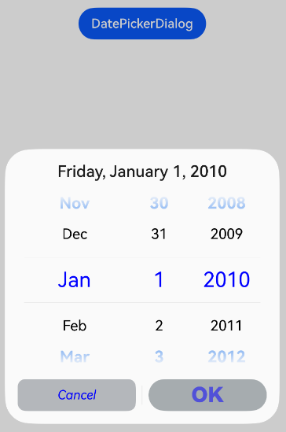
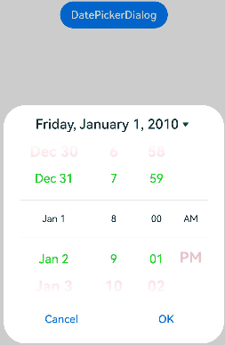
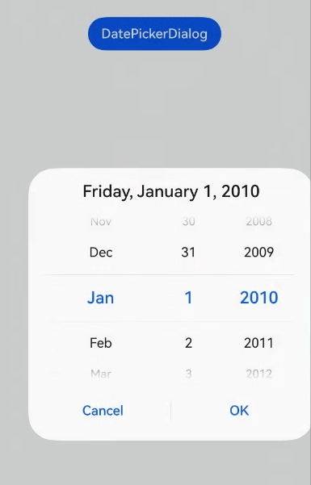
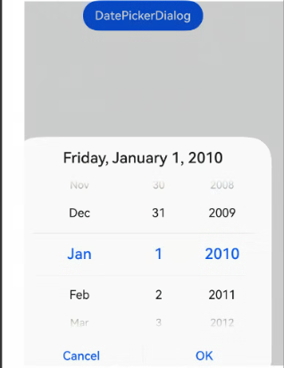
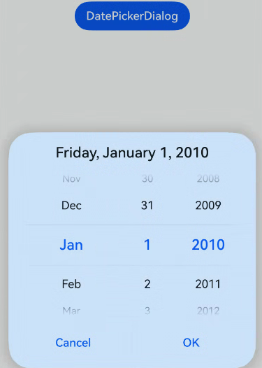
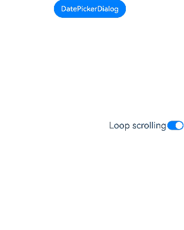
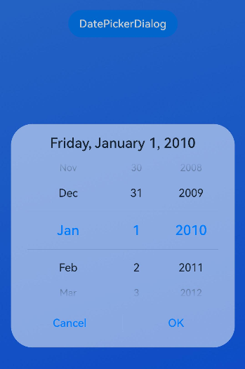
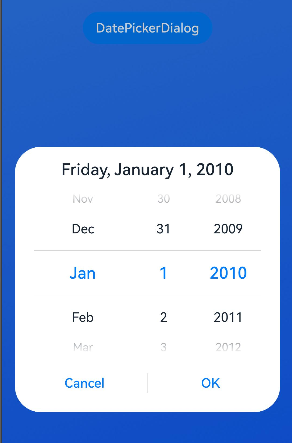

# Date Picker Dialog Box (DatePickerDialog)

<!--Kit: ArkUI-->
<!--Subsystem: ArkUI-->
<!--Owner: @luoying_ace_admin-->
<!--Designer: @weixin_52725220-->
<!--Tester: @xiong0104-->
<!--Adviser: @Brilliantry_Rui-->
<!-- md-trans-meta sourceCommit=9970006b63f1cf75a6caa0b3b5184fbee5a0f063 translatedAt=2026-08-24T06:55:41.398Z pushedAt=2026-08-25T07:34:48.434Z -->

Creates a date picker based on the specified date range and displays it in a dialog box. This component is suitable for scenarios where users need to quickly select a date, such as schedule arrangement, activity arrangement, and birthday setting. Using this component simplifies the development process, provides a unified date selection user experience, and supports multiple customization options to meet different requirements.

>  **NOTE**
>
> - This component is supported since API version 8. Updates will be marked with a superscript to indicate their earliest API version.
>
> - The functionality of this module depends on the UI execution context and cannot be used where the [UI context is not clear](../../../ui/arkts-global-interface.md#ambiguous-ui-context). For details, see [UIContext](../arkts-apis-uicontext-uicontext.md).
>
> - This module does not support hot updates for the light/dark color mode. To switch between the light and dark color modes, reopen the dialog box.
>
> - The maximum number of displayed rows differs between landscape and portrait modes. In portrait mode, the default is 5 rows. In landscape mode, it depends on the system configuration, and the default is 3 rows when no configuration is available. You can view the specific configuration value by referencing the following resource: **$r('sys.float.ohos_id_picker_show_count_landscape')**.

## DatePickerDialog

### show<sup>(deprecated)</sup>

static show(options?: DatePickerDialogOptions)

Shows a date picker dialog box.

> **NOTE**
> 
>  This API is supported since API version 8 and deprecated since API version 18. You are advised to use [showDatePickerDialog](../arkts-apis-uicontext-uicontext.md#showdatepickerdialog) instead. **showDatePickerDialog** can be called only after a [UIContext](../arkts-apis-uicontext-uicontext.md) instance is obtained.
>
> Since API version 10, you can use the [showDatePickerDialog](../arkts-apis-uicontext-uicontext.md#showdatepickerdialog) API in [UIContext](../arkts-apis-uicontext-uicontext.md), which ensures that the date picker dialog box is shown in the intended UI instance.

**Atomic service API**: This API can be used in atomic services since API version 11.

**System capability**: SystemCapability.ArkUI.ArkUI.Full

**Device behavior differences**: On wearables, calling this API results in a runtime exception indicating that the API is undefined. On other devices, the API works correctly.

**Parameters**

| Name | Type                                                       | Mandatory| Description                      |
| ------- | ----------------------------------------------------------- | ---- | -------------------------- |
| options | [DatePickerDialogOptions](#datepickerdialogoptions) | No | Parameters for configuring the date picker dialog box. If this parameter is not set, the dialog box is not displayed. |

## DatePickerDialogOptions

Defines the configuration options of the date picker dialog box.

Inherited from [DatePickerOptions](ts-basic-components-datepicker.md#datepickeroptions).

**System capability**: SystemCapability.ArkUI.ArkUI.Full

**Device behavior differences**: On wearables, calling this API results in a runtime exception indicating that the API is undefined. On other devices, the API works correctly.

<!--Table: 20%; 20%; 8%; 8%; 44%-->

| Name| Type| Read-Only| Optional| Description|
| -------- | -------- | -------- | -------- | -------- |
| lunar | boolean | No | Yes | Whether the date is displayed in the lunar calendar.<br>- **true**: displayed in the lunar calendar.<br>- **false**: not displayed in the lunar calendar.<br>Default value: **false**<br>**NOTE**<br>This attribute takes effect only in the Simplified Chinese and Traditional Chinese language environments. In other language environments, setting this attribute has no effect.<br>**Atomic service API:** This API can be used in atomic services since API version 11. |
| showTime<sup>10+</sup> | boolean | No | Yes | Whether to display the time picker in the dialog box.<br>- **true**: display the time picker.<br>- **false**: do not display the time picker.<br>Default value: **false**<br>**NOTE**<br>1. When **showTime** is true, tapping the title date of the dialog box switches between the "date picker" and "date picker + time picker" pages.<br>2. When **showTime** is **true**, the mode parameter does not take effect, and the date-only page always displays the year, month, and day columns.<br>**Model restriction:** This API can be used only in the stage model.<br>**Atomic service API:** This API can be used in atomic services since API version 11. |
| useMilitaryTime<sup>10+</sup> | boolean | No | Yes | Whether the time picker displayed in the dialog box uses the 24-hour format. This parameter takes effect only when **showTime** is **true**.<br>- true: display the 24-hour format.<br>- false: display the 12-hour format.<br>Default value: **false**<br>**NOTE**<br>When the displayed time picker uses the 12-hour format, the AM and PM indicators do not switch automatically based on the hour.<br>**Model restriction:** This API can be used only in the stage model.<br>**Atomic service API:** This API can be used in atomic services since API version 11. |
| lunarSwitch<sup>10+</sup> | boolean | No | Yes | Whether to display the switch for switching to the lunar calendar.<br>- **true**: display the switch for switching to the lunar calendar.<br>- **false**: do not display the switch for switching to the lunar calendar.<br>Default value: **false**<br>**NOTE**<br>After the switch is turned on, it takes effect only in the Simplified Chinese and Traditional Chinese environments. In other language environments, the lunar calendar does not take effect. Therefore, it is recommended that the switch not be displayed in other language environments.<br>**Model restriction:** This API can be used only in the stage model.<br>**Atomic service API:** This API can be used in atomic services since API version 11. |
| lunarSwitchStyle<sup>14+</sup> | [LunarSwitchStyle](#lunarswitchstyle14) | No | Yes | Color style of the lunar calendar switch. This parameter takes effect only when **lunarSwitch** is **true**.<br>Default value: **{<br>selectedColor: `$r('sys.color.ohos_id_color_text_primary_actived')`,<br>unselectedColor: `$r('sys.color.ohos_id_color_switch_outline_off')`,<br>strokeColor: Color.White<br>}**<br>**Model restriction:** This API can be used only in the stage model.<br>**Atomic service API:** This API can be used in atomic services since API version 14. |
| disappearTextStyle<sup>10+</sup> | [PickerTextStyle](ts-picker-common.md#pickertextstyle) | No | Yes | The text color, font size, and font weight of the edge items (the second item above or below the selected item).<br>Default value:<br>**{<br>color: '#ff182431',<br>font: {<br>size: '14fp', <br>weight: FontWeight.Regular<br>}<br>}**<br>**Model restriction:** This API can be used only in the stage model.<br>**Atomic service API:** This API can be used in atomic services since API version 11. |
| textStyle<sup>10+</sup> | [PickerTextStyle](ts-picker-common.md#pickertextstyle) | No | Yes | Text color, font size, and font weight of the candidate items (the first item above or below the selected item).<br>Default value:<br>**{<br>color: '#ff182431',<br>font: {<br>size: '16fp', <br>weight: FontWeight.Regular<br>}<br>}**<br>**Model restriction:** This API can be used only in the stage model.<br>**Atomic service API:** This API can be used in atomic services since API version 11. |
| selectedTextStyle<sup>10+</sup> | [PickerTextStyle](ts-picker-common.md#pickertextstyle) | No | Yes | Text color, font size, and font weight of the selected item.<br>Default value:<br>**{<br>color: '#ff007dff',<br>font: {<br>size: '20fp', <br>weight: FontWeight.Medium<br>}<br>}** <br>**Model restriction:** This API can be used only in the stage model.<br>**Atomic service API:** This API can be used in atomic services since API version 11. |
| acceptButtonStyle<sup>12+</sup> | [PickerDialogButtonStyle](ts-picker-common.md#pickerdialogbuttonstyle12) | No | Yes | Display style, importance, role, background color, corner radius, text color, font size, font weight, font style, font list, and whether the button responds to the Enter key by default for the confirm button. Pass this parameter when you need to customize the appearance or behavior of the confirm button. If not passed, the system default button style is used.<br>**NOTE**<br>1. At most one of **acceptButtonStyle** and **cancelButtonStyle** can have the **primary** field set to **true**. If both are set to **true**, the **primary** field does not take effect and remains at the default value **false**.<br>2. The button height is 40 vp by default and does not change in the care mode - large font scenario. Even if the button style is set to the rounded rectangle [ROUNDED_RECTANGLE](ts-basic-components-button.md#buttontype), the button is still displayed as a capsule button [Capsule](ts-basic-components-button.md#buttontype).<br>**Model restriction:** This API can be used only in the stage model.<br>**Atomic service API:** This API can be used in atomic services since API version 12. |
| cancelButtonStyle<sup>12+</sup> | [PickerDialogButtonStyle](ts-picker-common.md#pickerdialogbuttonstyle12) | No | Yes | Display style, importance, role, background color, corner radius, text color, font size, font weight, font style, font list, and whether the button responds to the Enter key by default for the cancel button. Pass this parameter when you need to customize the appearance or behavior of the cancel button. If not passed, the system default button style is used.<br>**NOTE**<br>1. At most one of **acceptButtonStyle** and **cancelButtonStyle** can have the **primary** field set to **true**. If both are set to **true**, the **primary** field does not take effect and remains at the default value **false**.<br>2. The button height is 40 vp by default and does not change in the care mode - large font scenario. Even if the button style is set to the rounded rectangle [ROUNDED_RECTANGLE](ts-basic-components-button.md#buttontype), the button is still displayed as a capsule button [Capsule](ts-basic-components-button.md#buttontype).<br>**Model restriction:** This API can be used only in the stage model.<br>**Atomic service API:** This API can be used in atomic services since API version 12. |
| alignment<sup>10+</sup>  | [DialogAlignment](ts-methods-alert-dialog-box.md#dialogalignment) | No  | Yes  | Alignment of the dialog box in the vertical direction.<br>Default value: **DialogAlignment.Default**<br>**Model restriction:** This API can be used only in the stage model.<br>**Atomic service API:** This API can be used in atomic services since API version 11. |
| offset<sup>10+</sup>     | [Offset](ts-types.md#offset) | No    | Yes    | Offset of the dialog box relative to the position specified by alignment. Set this parameter when you need to fine-tune the position of the dialog box (for example, to achieve precise position control together with alignment). If not set, the dialog box is displayed at the position aligned by alignment.<br>Default value: **{ dx: 0 , dy: 0 }**<br>**Model restriction:** This API can be used only in the stage model.<br>**Atomic service API:** This API can be used in atomic services since API version 11. |
| maskRect<sup>10+</sup>| [Rectangle](ts-methods-alert-dialog-box.md#rectangle8) | No    | Yes    | Mask area of the dialog box. Events within the mask area are not passed through, while events outside the mask area are passed through.<br>Default value: **{ x: 0, y: 0, width: '100%', height: '100%' }**<br>**Model restriction:** This API can be used only in the stage model.<br>**Atomic service API:** This API can be used in atomic services since API version 11. |
| onAccept<sup>(deprecated)</sup> | (value: [DatePickerResult](ts-basic-components-datepicker.md#datepickerresult)) => void | No | Yes | Triggered when the "OK" button in the dialog box is tapped. The callback parameter value is the currently selected date, including the year, month, and day.<br>**NOTE**<br>Supported since API version 8 and deprecated since API version 10. Use **onDateAccept** instead. |
| onCancel | [VoidCallback](ts-types.md#voidcallback12) | No | Yes | Triggered when the "Cancel" button in the dialog box is tapped. Callback signature: () => void, with no parameters and no return value.<br>**Atomic service API:** This API can be used in atomic services since API version 11. |
| onChange<sup>(deprecated)</sup> | (value: [DatePickerResult](ts-basic-components-datepicker.md#datepickerresult)) => void | No | Yes | Triggered when the current selected item changes as the sliding picker in the dialog box is swiped. The callback parameter value is the currently selected date, including the year, month, and day.<br>**NOTE**<br>Supported since API version 8 and deprecated since API version 10. Use onDateChange instead. |
| onDateAccept<sup>10+</sup> | [Callback](ts-types.md#callback12)\<Date> | No | Yes | Triggered when the "OK" button in the dialog box is tapped. Callback signature: **(value: Date) => void**, where **value** is the date selected by the user, including the year, month, and day. When **showTime** is true, it also includes the hour and minute. Developers can save the date selected by the user or execute subsequent business logic in this callback.<br>**NOTE**<br>When **showTime** is set to **true**, the hour and minute in **value** are those selected by the picker. Otherwise, the hour and minute in **value** are those of the system time.<br>**Model restriction:** This API can be used only in the stage model.<br>**Atomic service API:** This API can be used in atomic services since API version 11. |
| onDateChange<sup>10+</sup> | [Callback](ts-types.md#callback12)\<Date> | No | Yes | Triggered when the current selected item changes as the date in the dialog box is swiped. Callback signature: **(value: Date) => void**, where **value** is the currently selected date, including the year, month, and day. When **showTime** is **true**, it also includes the hour and minute. This callback is triggered in real time while the user swipes the picker, which differs from **onDateAccept**, which is triggered only after the OK button is tapped.<br>**NOTE**<br>When **showTime** is set to **true**, the hour and minute in value are those selected by the picker. Otherwise, the hour and minute in value are those of the system time.<br>**Model restriction:** This API can be used only in the stage model.<br>**Atomic service API:** This API can be used in atomic services since API version 11. |
| backgroundColor<sup>11+</sup> | [ResourceColor](ts-types.md#resourcecolor)  | No | Yes | Background color of the dialog box.<br>Default value: **Color.Transparent**<br>**NOTE**<br>When **backgroundColor** is set to a non-transparent color, **backgroundBlurStyle** must be set to **BlurStyle.NONE**. Otherwise, the displayed color will not meet the expected effect.<br>**Model restriction:** This API can be used only in the stage model.<br>**Atomic service API:** This API can be used in atomic services since API version 12. |
| backgroundBlurStyle<sup>11+</sup> | [BlurStyle](ts-universal-attributes-background.md#blurstyle9) | No | Yes | Background blur material of the dialog box.<br>Default value: **BlurStyle.COMPONENT_ULTRA_THICK**<br>**NOTE**<br>Set this parameter to **BlurStyle.NONE** to disable the background blur. When **backgroundBlurStyle** is set to a value other than NONE, do not set **backgroundColor**. Otherwise, the displayed color will not meet the expected effect.<br>**Model restriction:** This API can be used only in the stage model.<br>**Atomic service API:** This API can be used in atomic services since API version 12. |
| backgroundBlurStyleOptions<sup>19+</sup> | [BackgroundBlurStyleOptions](ts-universal-attributes-background.md#backgroundblurstyleoptions10) | No | Yes | Background blur effect parameters, used to customize the display style of the dialog box background blur. It supports configuring attributes such as the color mode, adaptive color, and scale ratio to achieve different background blur visual effects. For the default value, see the **BackgroundBlurStyleOptions** type description.<br>**NOTE**<br>When not set, the default effect of **backgroundBlurStyle (BlurStyle.COMPONENT_ULTRA_THICK)** is used.<br>**Model restriction:** This API can be used only in the stage model.<br>**Atomic service API:** This API can be used in atomic services since API version 19. |
| backgroundEffect<sup>19+</sup> | [BackgroundEffectOptions](ts-universal-attributes-background.md#backgroundeffectoptions11) | No | Yes | Background effect parameters, used to customize the display effect of the dialog box background. It supports configuring attributes such as the blur radius, saturation, brightness, and color to achieve different background visual effects. For the default value, see the **BackgroundEffectOptions** type description.<br>**NOTE**<br>When not set, this parameter does not take effect, and the dialog box background blur effect is determined by **backgroundBlurStyle**. When set, it overrides the effect of **backgroundBlurStyle**. Since API version 26.0.0, after **systemMaterial** is set, neither **backgroundEffect** nor **backgroundBlurStyle** takes effect.<br>**Model restriction:** This API can be used only in the stage model.<br>**Atomic service API:** This API can be used in atomic services since API version 19. |
| onDidAppear<sup>12+</sup> | [VoidCallback](ts-types.md#voidcallback12) | No | Yes | Event callback after the dialog box is displayed.<br>**NOTE**<br>1. The normal timing sequence is: **onWillAppear** >> **onDidAppear** >> (**onDateAccept**/**onCancel**/**onDateChange**) >> **onWillDisappear** >> **onDidDisappear**.<br>2. Callback events that change the display effect of the dialog box set in **onDidAppear** take effect the next time **showDatePickerDialog** is called.<br>3. When the dialog box is rapidly and consecutively triggered to pop up and close, **onWillDisappear** may take effect before **onDidAppear**.<br>4. When the dialog box is closed before its entrance animation is complete, this callback is not triggered.<br>**Model restriction:** This API can be used only in the stage model.<br>**Atomic service API:** This API can be used in atomic services since API version 12. |
| onDidDisappear<sup>12+</sup> | [VoidCallback](ts-types.md#voidcallback12) | No | Yes | Event callback after the dialog box disappears.<br>**NOTE**<br>1. The normal timing sequence is: **onWillAppear** >> **onDidAppear** >> (onDateAccept/onCancel/onDateChange) >> **onWillDisappear** >> **onDidDisappear**.<br>2. When the dialog box is rapidly and consecutively triggered to pop up and close, **onWillDisappear** may take effect before **onDidAppear**.<br>3. When the dialog box is closed before its entrance animation is complete, this callback is not triggered.<br>**Model restriction:** This API can be used only in the stage model.<br>**Atomic service API:** This API can be used in atomic services since API version 12. |
| onWillAppear<sup>12+</sup> | [VoidCallback](ts-types.md#voidcallback12) | No | Yes | Event callback before the dialog box display animation.<br>**NOTE**<br>1. The normal timing sequence is: **onWillAppear** >> **onDidAppear** >> (onDateAccept/onCancel/onDateChange) >> **onWillDisappear** >> **onDidDisappear**.<br>2. Callback events that change the display effect of the dialog box set in **onWillAppear** take effect the next time **showDatePickerDialog** is called.<br>3. When the dialog box is rapidly and consecutively triggered to pop up and close, **onWillDisappear** may take effect before **onDidAppear**.<br>4. When the dialog box is closed before its entrance animation is complete, **onDidAppear** and subsequent callbacks are not triggered.<br>**Model restriction:** This API can be used only in the stage model.<br>**Atomic service API:** This API can be used in atomic services since API version 12. |
| onWillDisappear<sup>12+</sup> | [VoidCallback](ts-types.md#voidcallback12) | No | Yes | Event callback before the dialog box exit animation.<br>**NOTE**<br>1. The normal timing sequence is: **onWillAppear** >> **onDidAppear** >> (onDateAccept/onCancel/onDateChange) >> **onWillDisappear** >> **onDidDisappear**.<br>2. When the dialog box is rapidly and consecutively triggered to pop up and close, **onWillDisappear** may take effect before **onDidAppear**.<br>3. When the dialog box is closed before its entrance animation is complete, this callback is not triggered.<br>**Model restriction:** This API can be used only in the stage model.<br>**Atomic service API:** This API can be used in atomic services since API version 12. |
| shadow<sup>12+</sup> | [ShadowOptions](ts-universal-attributes-image-effect.md#shadowoptions) \| [ShadowStyle](ts-universal-attributes-image-effect.md#shadowstyle10) | No | Yes | Shadow of the dialog box background.<br>On 2-in-1 devices, in the default scenario, the focused shadow value is **ShadowStyle.OUTER_FLOATING_MD**, and the unfocused shadow value is **ShadowStyle.OUTER_FLOATING_SM**. Other devices have no shadow by default.<br>**Model restriction:** This API can be used only in the stage model.<br>**Atomic service API:** This API can be used in atomic services since API version 12. |
| dateTimeOptions<sup>12+</sup> | [DateTimeOptions](../../apis-localization-kit/js-apis-intl.md#datetimeoptionsdeprecated) | No | Yes | Whether the hour and minute are displayed with a leading zero. Currently, only the hour and minute parameters are supported, and this parameter takes effect only when **showTime** is **true**.<br>Default value:<br>**hour**: The default value is "2-digit" in the 24-hour format. Sets whether the hour is displayed as two digits. If the actual value is less than 10, a leading zero is added and displayed, that is, "0X". The default value is "numeric" in the 12-hour format, that is, no leading zero. The optional values are "numeric" or "2-digit". If another value is passed, the default value is used.<br>**minute**: The default value is "2-digit". Sets whether the minute is displayed as two digits. If the actual value is less than 10, a leading zero is added and displayed, that is, "0X". The optional values are "numeric" or "2-digit". If another value is passed, the default value is used.<br>**Model restriction:** This API can be used only in the stage model.<br>**Atomic service API:** This API can be used in atomic services since API version 12. |
| enableHoverMode<sup>14+</sup>     | boolean | No  | Yes  | Whether to respond to the hover state. The hover state refers to the interaction mode when devices such as foldable devices are in the hover folded state, rather than mouse hover.<br>- true: respond to the hover state.<br>- **false**: do not respond to the hover state.<br>Default value: **false**<br>**Model restriction:** This API can be used only in the stage model.<br>**Atomic service API:** This API can be used in atomic services since API version 14. |
| hoverModeArea<sup>14+</sup>       | [HoverModeAreaType](ts-universal-attributes-sheet-transition.md#hovermodeareatype14) | No  | Yes  | Default display area of the dialog box in the hover state. This parameter takes effect only when **enableHoverMode** is **true**.<br>Default value: **HoverModeAreaType.BOTTOM_SCREEN**<br>**Model restriction:** This API can be used only in the stage model.<br>**Atomic service API:** This API can be used in atomic services since API version 14. |
| enableHapticFeedback<sup>18+</sup> | boolean | No  | Yes  | Whether to enable touch feedback.<br>- **true**: enable touch feedback (select this when you need to provide operation feedback to users).<br>- **false**: disable touch feedback (select this when touch feedback is not needed or the device does not support it).<br>Default value: **true**<br>**Model restriction:** This API can be used only in the stage model.<br>**Atomic service API:** This API can be used in atomic services since API version 18.<br>**NOTE**<br>1. After this parameter is set to **true**, whether it takes effect depends on whether the system hardware supports it.<br>2. To enable touch feedback, configure the **requestPermissions** field in the "module" of the **src/main/module.json5** file of the project to enable the vibration permission. The configuration is as follows:<br>"requestPermissions": [{"name": "ohos.permission.VIBRATE"}] |
| canLoop<sup>20+</sup> | boolean | No | Yes | Whether cyclic scrolling is supported.<br>- **true**: cyclic scrolling is supported. The year is linked and incremented or decremented as the month scrolls cyclically, and the month is linked and incremented or decremented as the day scrolls cyclically.<br>- **false**: cyclic scrolling is not supported. When the year, month, or day reaches the top or bottom of its column, it can no longer be scrolled, and the year, month, and day can no longer be linked and incremented or decremented.<br>Default value: **true**<br>**Model restriction:** This API can be used only in the stage model.<br>**Atomic service API:** This API can be used in atomic services since API version 20. |
| systemMaterial | [SystemUiMaterial](ts-universal-attributes-image-effect.md#systemuimaterial) | No | Yes | System material of the dialog box.<br>**NOTE**<br>- The default value is an **ImmersiveMaterial** object whose style of **ImmersiveOptions** is **ImmersiveStyle.ULTRA_THICK**. When set to **undefined**, it is consistent with the default value. Different materials have different effects. For details about **ImmersiveMaterial**, see the [SystemUiMaterial](ts-universal-attributes-image-effect.md#systemuimaterial) type definition.<br>- This interface affects the background color [backgroundColor](ts-universal-attributes-background.md#backgroundcolor), background blur [backgroundBlurStyle](ts-universal-attributes-background.md#backgroundblurstyle9), background blur effect [backgroundBlurStyleOptions](ts-universal-attributes-background.md#backgroundblurstyleoptions10), background effect [backgroundEffect](ts-universal-attributes-background.md#backgroundeffect11), border color [borderColor](ts-universal-attributes-border.md#bordercolor), border width [borderWidth](ts-universal-attributes-border.md#borderwidth), and shadow [shadow](ts-universal-attributes-image-effect.md#shadow). When the system material is set, the preceding interfaces do not take effect.<br>**Since:** 26.0.0<br>**Model restriction:** This API can be used only in the stage model.<br>**Atomic service API:** This API can be used in atomic services since API version 26.0.0. |

## LunarSwitchStyle<sup>14+</sup>

Defines the style of the lunar calendar switch in the **DatePickerDialog** component.

**Atomic service API**: This API can be used in atomic services since API version 14.

**Model restriction**: This API can be used only in the stage model.

**System capability**: SystemCapability.ArkUI.ArkUI.Full

**Device behavior differences**: On wearables, calling this API results in a runtime exception indicating that the API is undefined. On other devices, the API works correctly.

|  Name | Type                | Read-Only| Optional| Description      |
| ------ |-------------------|-----|----------|----------|
| selectedColor| [ResourceColor](ts-types.md#resourcecolor) | No  | Yes  | Background color of the switch when it is on.<br>Default value: **$r('sys.color.ohos_id_color_text_primary_actived')** |
| unselectedColor | [ResourceColor](ts-types.md#resourcecolor) | No  | Yes  | Border color of the switch when it is off.<br>Default value: **$r('sys.color.ohos_id_color_switch_outline_off')** |
| strokeColor     | [ResourceColor](ts-types.md#resourcecolor) | No  | Yes  | Color of the inner icon of the switch.<br>Default value: **Color.White** |

## Example

>  **NOTE**
>
> For clarity in UI execution context, you are advised to use the [showDatePickerDialog](../arkts-apis-uicontext-uicontext.md#showdatepickerdialog) API in [UIContext](../arkts-apis-uicontext-uicontext.md).

### Example 1: Setting the Display Time

This example demonstrates how to set the display time using **showTime**, **useMilitaryTime**, and **dateTimeOptions**.

```ts
// xxx.ets
@Entry
@Component
struct DatePickerDialogExample {
  selectedDate: Date = new Date('2010-01-01');

  build() {
    Column() {
      Button('DatePickerDialog')
        .margin(20)
        .onClick(() => {
          this.getUIContext().showDatePickerDialog({
            start: new Date('2000-01-01'),
            end: new Date('2100-12-31'),
            selected: this.selectedDate,
            showTime: true,
            useMilitaryTime: false,
            dateTimeOptions: { hour: 'numeric', minute: '2-digit' },
            onDateAccept: (value: Date) => {
              // Save the date settings when the OK button is touched. In this way, when the date picker dialog box is displayed again, the selected date is the date last confirmed.
              this.selectedDate = value;
              console.info('DatePickerDialog:onDateAccept()' + value.toString());
            },
            onCancel: () => {
              console.info('DatePickerDialog:onCancel()');
            },
            onDateChange: (value: Date) => {
              console.info('DatePickerDialog:onDateChange()' + value.toString());
            },
            onDidAppear: () => {
              console.info('DatePickerDialog:onDidAppear()');
            },
            onDidDisappear: () => {
              console.info('DatePickerDialog:onDidDisappear()');
            },
            onWillAppear: () => {
              console.info('DatePickerDialog:onWillAppear()');
            },
            onWillDisappear: () => {
              console.info('DatePickerDialog:onWillDisappear()');
            }
          })
        })
    }.width('100%')
  }
}
```


### Example 2: Customizing the Style

In this example, **disappearTextStyle**, **textStyle**, **selectedTextStyle**, **acceptButtonStyle**, and **cancelButtonStyle** are configured to customize the text and button style.

```ts
// xxx.ets
@Entry
@Component
struct DatePickerDialogExample {
  selectedDate: Date = new Date('2010-01-01');

  build() {
    Column() {
      Button('DatePickerDialog')
        .margin(20)
        .onClick(() => {
          this.getUIContext().showDatePickerDialog({
            start: new Date('2000-01-01'),
            end: new Date('2100-12-31'),
            selected: this.selectedDate,
            disappearTextStyle: { color: '#297bec', font: { size: '20fp', weight: FontWeight.Bold } },
            textStyle: { color: Color.Black, font: { size: '18fp', weight: FontWeight.Normal } },
            selectedTextStyle: { color: Color.Blue, font: { size: '26fp', weight: FontWeight.Regular } },
            acceptButtonStyle: {
              type: ButtonType.Normal,
              style: ButtonStyleMode.NORMAL,
              role: ButtonRole.NORMAL,
              fontColor: 'rgb(81, 81, 216)',
              fontSize: '26fp',
              fontWeight: FontWeight.Bolder,
              fontStyle: FontStyle.Normal,
              fontFamily: 'sans-serif',
              backgroundColor: '#A6ACAF',
              borderRadius: 20
            },
            cancelButtonStyle: {
              type: ButtonType.Normal,
              style: ButtonStyleMode.NORMAL,
              role: ButtonRole.NORMAL,
              fontColor: Color.Blue,
              fontSize: '16fp',
              fontWeight: FontWeight.Normal,
              fontStyle: FontStyle.Italic,
              fontFamily: 'sans-serif',
              backgroundColor: '#50182431',
              borderRadius: 10
            },
            onDateAccept: (value: Date) => {
              // Save the date settings when the OK button is touched. In this way, when the date picker dialog box is displayed again, the selected date is the date last confirmed.
              this.selectedDate = value;
              console.info('DatePickerDialog:onDateAccept()' + value.toString());
            },
            onCancel: () => {
              console.info('DatePickerDialog:onCancel()');
            },
            onDateChange: (value: Date) => {
              console.info('DatePickerDialog:onDateChange()' + value.toString());
            },
            onDidAppear: () => {
              console.info('DatePickerDialog:onDidAppear()');
            },
            onDidDisappear: () => {
              console.info('DatePickerDialog:onDidDisappear()');
            },
            onWillAppear: () => {
              console.info('DatePickerDialog:onWillAppear()');
            },
            onWillDisappear: () => {
              console.info('DatePickerDialog:onWillDisappear()');
            }
          });
        })
    }.width('100%')
  }
}
```



> **NOTE**
>
> To implement a fully customized date picker dialog box, create a [custom dialog box](ts-methods-custom-dialog-box.md) and then implement the [DatePicker](ts-basic-components-datepicker.md) component.

### Example 3: Configuring a Dialog Box in the Hover State

This example demonstrates how to set the layout area of a dialog box when the device is in semi-folded mode.

```ts
@Entry
@Component
struct DatePickerDialogExample {
  selectedDate: Date = new Date('2010-01-01');

  build() {
    Column() {
      Button('DatePickerDialog')
        .margin(20)
        .onClick(() => {
          this.getUIContext().showDatePickerDialog({
            start: new Date('2000-01-01'),
            end: new Date('2100-12-31'),
            selected: this.selectedDate,
            showTime: true,
            useMilitaryTime: false,
            disappearTextStyle: { color: Color.Pink, font: { size: '22fp', weight: FontWeight.Bold }},
            textStyle: { color: '#ff00ff00', font: { size: '18fp', weight: FontWeight.Normal }},
            selectedTextStyle: { color: '#ff182431', font: { size: '14fp', weight: FontWeight.Regular }},
            onDateAccept: (value: Date) => {
              // Save the date settings when the OK button is touched. In this way, when the date picker dialog box is displayed again, the selected date is the date last confirmed.
              this.selectedDate = value;
              console.info('DatePickerDialog:onDateAccept()' + value.toString());
            },
            onCancel: () => {
              console.info('DatePickerDialog:onCancel()');
            },
            onDateChange: (value: Date) => {
              console.info('DatePickerDialog:onDateChange()' + value.toString());
            },
            onDidAppear: () => {
              console.info('DatePickerDialog:onDidAppear()');
            },
            onDidDisappear: () => {
              console.info('DatePickerDialog:onDidDisappear()');
            },
            onWillAppear: () => {
              console.info('DatePickerDialog:onWillAppear()');
            },
            onWillDisappear: () => {
              console.info('DatePickerDialog:onWillDisappear()');
            },
            enableHoverMode: true,
            hoverModeArea: HoverModeAreaType.TOP_SCREEN
          });
        })
    }.width('100%')
  }
}
```



### Example 4: Setting the Dialog Box Position

This example demonstrates how to set the position of a dialog box using **alignment** and **offset**.

```ts
// xxx.ets
@Entry
@Component
struct DatePickerDialogExample {
  selectedDate: Date = new Date('2010-01-01');

  build() {
    Column() {
      Button('DatePickerDialog')
        .margin(20)
        .onClick(() => {
          this.getUIContext().showDatePickerDialog({
            start: new Date('2000-01-01'),
            end: new Date('2100-12-31'),
            selected: this.selectedDate,
            alignment: DialogAlignment.Center,
            offset: { dx: 20, dy: 0 },
            onDateAccept: (value: Date) => {
              // Save the date settings when the OK button is touched. In this way, when the date picker dialog box is displayed again, the selected date is the date last confirmed.
              this.selectedDate = value;
              console.info('DatePickerDialog:onDateAccept()' + value.toString());
            }
          });
        })
    }.width('100%')
  }
}
```



### Example 5: Setting the Mask Area

This example demonstrates how to set the mask area using **maskRect**.

```ts
// xxx.ets
@Entry
@Component
struct DatePickerDialogExample {
  selectedDate: Date = new Date('2010-01-01');

  build() {
    Column() {
      Button('DatePickerDialog')
        .margin(20)
        .onClick(() => {
          this.getUIContext().showDatePickerDialog({
            start: new Date('2000-01-01'),
            end: new Date('2100-12-31'),
            selected: this.selectedDate,
            maskRect: {
              x: 30,
              y: 60,
              width: '100%',
              height: '60%'
            },
            onDateAccept: (value: Date) => {
              // Save the date settings when the OK button is touched. In this way, when the date picker dialog box is displayed again, the selected date is the date last confirmed.
              this.selectedDate = value;
              console.info('DatePickerDialog:onDateAccept()' + value.toString());
            }
          });
        })
    }.width('100%')
  }
}
```



### Example 6: Setting the Background

This example demonstrates how to set the dialog box background using **backgroundColor**, **backgroundBlurStyle**, and **shadow**.

```ts
// xxx.ets
@Entry
@Component
struct DatePickerDialogExample {
  selectedDate: Date = new Date('2010-01-01');

  build() {
    Column() {
      Button('DatePickerDialog')
        .margin(20)
        .onClick(() => {
          this.getUIContext().showDatePickerDialog({
            start: new Date('2000-01-01'),
            end: new Date('2100-12-31'),
            selected: this.selectedDate,
            backgroundColor: 'rgb(204, 226, 251)',
            backgroundBlurStyle: BlurStyle.NONE,
            shadow: ShadowStyle.OUTER_FLOATING_SM,
            onDateAccept: (value: Date) => {
              // Save the date settings when the OK button is touched. In this way, when the date picker dialog box is displayed again, the selected date is the date last confirmed.
              this.selectedDate = value;
              console.info('DatePickerDialog:onDateAccept()' + value.toString());
            }
          });
        })
    }.width('100%')
  }
}
```



### Example 7: Switching Between Gregorian and Lunar Calendars

This example demonstrates how to set the date picker dialog box to display either the Gregorian (solar) calendar or the lunar calendar using **lunar** and **lunarSwitch**.

```ts
// xxx.ets
@Entry
@Component
struct DatePickerDialogExample {
  selectedDate: Date = new Date('2010-11-09');

  build() {
    Column() {
      Button('DatePickerDialog')
        .margin(20)
        .onClick(() => {
          this.getUIContext().showDatePickerDialog({
            start: new Date('2000-01-01'),
            end: new Date('2100-12-31'),
            selected: this.selectedDate,
            lunar: false,
            onDateAccept: (value: Date) => {
              // Save the date settings when the OK button is touched. In this way, when the date picker dialog box is displayed again, the selected date is the date last confirmed.
              this.selectedDate = value;
              console.info('DatePickerDialog:onDateAccept()' + value.toString());
            }
          });
        })

      Button('Lunar DatePickerDialog')
        .margin(20)
        .onClick(() => {
          this.getUIContext().showDatePickerDialog({
            start: new Date('2000-01-01'),
            end: new Date('2100-12-31'),
            selected: this.selectedDate,
            lunar: true,
            lunarSwitch: true,
            onDateAccept: (value: Date) => {
              this.selectedDate = value;
              console.info('DatePickerDialog:onDateAccept()' + value.toString());
            }
          });
        })
    }.width('100%')
  }
}
```


### Example 8: Setting Display of Month and Day Columns

This example demonstrates how to configure the **mode** parameter to display only the month and day columns in the date picker dialog box.

```ts
// xxx.ets
@Entry
@Component
struct DatePickerDialogExample {
  selectedDate: Date = new Date('2010-10-13');

  build() {
    Column() {
      Button('DatePickerDialog')
        .margin(20)
        .onClick(() => {
          this.getUIContext().showDatePickerDialog({
            start: new Date('2000-01-01'),
            end: new Date('2100-12-31'),
            selected: this.selectedDate,
            mode: DatePickerMode.MONTH_AND_DAY,
            onDateAccept: (value: Date) => {
              // Save the date settings when the OK button is touched. In this way, when the date picker dialog box is displayed again, the selected date is the date last confirmed.
              this.selectedDate = value;
              console.info('DatePickerDialog:onDateAccept()' + value.toString());
            }
          });
        })
    }.width('100%')
  }
}
```


### Example 9: Setting Cyclic Scrolling

This example demonstrates how to set whether to enable cyclic scrolling using **canLoop**, available since API version 20.

```ts
// xxx.ets
@Entry
@Component
struct DatePickerDialogExample {
  @State isLoop: boolean = true;
  selectedDate: Date = new Date('2009-12-31');

  build() {
    Column() {
      Button('DatePickerDialog')
        .margin(20)
        .onClick(() => {
          this.getUIContext().showDatePickerDialog({
            start: new Date('2000-01-01'),
            end: new Date('2100-12-31'),
            selected: this.selectedDate,
            canLoop: this.isLoop,
            onDateAccept: (value: Date) => {
              // Save the date settings when the OK button is touched. In this way, when the date picker dialog box is displayed again, the selected date is the date last confirmed.
              this.selectedDate = value;
              console.info('DatePickerDialog:onDateAccept()' + value.toString());
            }
          });
        })

      Row() {
        Text ('Loop scrolling').fontSize(20)
        Toggle({ type: ToggleType.Switch, isOn: true })
          .onChange((isOn: boolean) => {
            this.isLoop = isOn;
          })
      }.position({ x: '60%', y: '40%' })
    }.width('100%')
  }
}
```



### Example 10: Customizing the Background Blur Effect

This example demonstrates how to customize the background blur effect by configuring [backgroundBlurStyleOptions](#datepickerdialogoptions), available since API version 19.

```ts
@Entry
@Component
struct DatePickerDialogExample {
  selectedDate: Date = new Date('2010-01-01');

  build() {
    Stack({ alignContent: Alignment.Top }) {
      // Replace $r('app.media.bg') with the image resource file required by the developer.
      Image($r('app.media.bg'))
      Column() {
        Button('DatePickerDialog')
          .margin(20)
          .onClick(() => {
            this.getUIContext().showDatePickerDialog({
              start: new Date('2000-01-01'),
              end: new Date('2100-12-31'),
              selected: this.selectedDate,
              backgroundColor: undefined,
              backgroundBlurStyle: BlurStyle.Thin,
              backgroundBlurStyleOptions: {
                colorMode: ThemeColorMode.LIGHT,
                adaptiveColor: AdaptiveColor.AVERAGE,
                scale: 1,
                blurOptions: { grayscale: [20, 20] },
              },
            });
          })
      }.width('100%')
    }
  }
}
```



### Example 11: Customizing the Background Effect

This example demonstrates how to customize the background effect by configuring [backgroundEffect](#datepickerdialogoptions). This functionality is supported since API version 19.

```ts
@Entry
@Component
struct DatePickerDialogExample {
  selectedDate: Date = new Date('2010-01-01');

  build() {
    Stack({ alignContent: Alignment.Top }) {
      // Replace $r('app.media.bg') with the image resource file you use.
      Image($r('app.media.bg'))
      Column() {
        Button('DatePickerDialog')
          .margin(20)
          .onClick(() => {
            this.getUIContext().showDatePickerDialog({
              start: new Date('2000-01-01'),
              end: new Date('2100-12-31'),
              selected: this.selectedDate,
              backgroundColor: undefined,
              backgroundBlurStyle: BlurStyle.Thin,
              backgroundEffect: {
                radius: 60,
                saturation: 0,
                brightness: 1,
                color: Color.White,
                blurOptions: { grayscale: [20, 20] }
              },
            });
          })
      }.width('100%')
    }
  }
}
```



### Example 12: Setting the System Material

This example implements the system material effect by configuring [systemMaterial](#datepickerdialogoptions).

Since API version 26.0.0, the **systemMaterial** attribute has been added to **DatePickerDialogOptions**.

```ts
import { uiMaterial } from '@kit.ArkUI';

@Entry
@Component
struct DatePickerDialogExample {
  selectedDate: Date = new Date('2010-01-01');

  build() {
    Stack({ alignContent: Alignment.Top }) {
      Column() {
        Button('DatePickerDialog')
          .margin(20)
          .onClick(() => {
            this.getUIContext().showDatePickerDialog({
              selected: this.selectedDate,
              systemMaterial: new uiMaterial.ImmersiveMaterial({ style: uiMaterial.ImmersiveStyle.ULTRA_THICK })
            });
          })
      }.width('100%')
    }
  }
}
```


<!--Del--> <!--DelEnd-->

