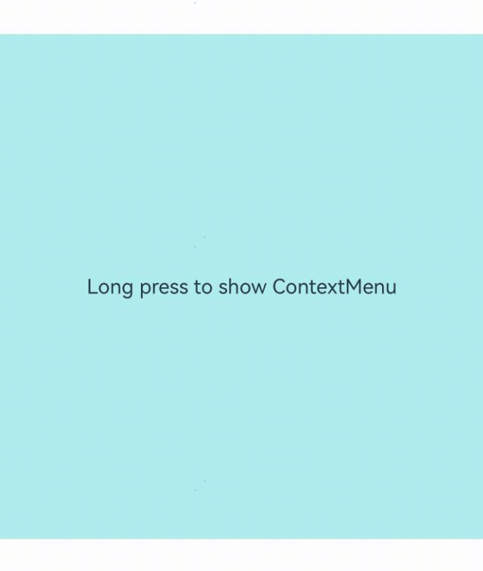

# ContextMenu
<!--Kit: ArkUI-->
<!--Subsystem: ArkUI-->
<!--Owner: @Armstrong15-->
<!--Designer: @zhanghaibo0-->
<!--Tester: @lxl007-->
<!--Adviser: @Brilliantry_Rui-->

The menu bound to a component through [bindContextMenu](./ts-universal-attributes-menu.md#bindcontextmenu12) on a page can be closed as needed.

>  **NOTE**
>
> The initial APIs of this module are supported since API version 8. Updates will be marked with a superscript to indicate their earliest API version.

## ContextMenu.close<sup>(deprecated)</sup>

static close()

Closes the menu bound to this component through [bindContextMenu](./ts-universal-attributes-menu.md#bindcontextmenu12) on a page.

>  **NOTE**
>
> This API is deprecated since API version 18. You are advised to use [getContextMenuController](../arkts-apis-uicontext-uicontext.md#getcontextmenucontroller12) in [UIContext](../arkts-apis-uicontext-uicontext.md) to obtain the [ContextMenuController](../arkts-apis-uicontext-contextmenucontroller.md) instance and then use this instance to call the [close](../arkts-apis-uicontext-contextmenucontroller.md#close12) API.
>
> Since API version 12, you can use the [getContextMenuController](../arkts-apis-uicontext-contextmenucontroller.md) API in [UIContext](../arkts-apis-uicontext-uicontext.md) to specify the UI execution context.

**Atomic service API**: This API can be used in atomic services since API version 11.

**System capability**: SystemCapability.ArkUI.ArkUI.Full

## Example

This example demonstrates how to call the **ContextMenu.close** API to close a context menu that is bound to a component using **bindContextMenu**.

>  **NOTE**
>
> For clarity in UI execution context, you are advised to use the [getContextMenuController](../arkts-apis-uicontext-contextmenucontroller.md) API in [UIContext](../arkts-apis-uicontext-uicontext.md).

<!--deprecated_code_no_check-->

```ts
// xxx.ets
@Entry
@Component
struct Index {
  @Builder MenuBuilder() {
    Flex({ direction: FlexDirection.Column, alignItems: ItemAlign.Center, justifyContent: FlexAlign.Center }) {
      Button('ContextMenu1')
      Divider().strokeWidth(2).margin(5).color(Color.Black)
      Button('ContextMenu2')
      Divider().strokeWidth(2).margin(5).color(Color.Black)
      Button('ContextMenu3')
    }
    .width(200)
    .height(160)
  }

  build() {
    Flex({ direction: FlexDirection.Column, alignItems: ItemAlign.Center, justifyContent: FlexAlign.Center }) {
      Column() {
        Text('Long press to show ContextMenu')
          .fontSize(20)
          .width('100%')
          .height(500)
          .backgroundColor(0xAFEEEE)
          .textAlign(TextAlign.Center)
      }
      .bindContextMenu(this.MenuBuilder, ResponseType.LongPress)
      .onDragStart(()=>{
        // Close the menu when the component is dragged.
        ContextMenu.close() // You are advised to use this.getUIContext().getContextMenuController().close().
      })
    }
    .width('100%')
    .height('100%')
  }
}
```


