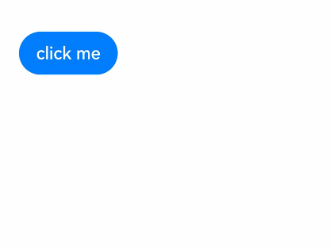

# Motion Path Animation (motionPath)
<!--Kit: ArkUI-->
<!--Subsystem: ArkUI-->
<!--Owner: @hehongyang3-->
<!--Designer: @hehongyang3-->
<!--Tester: @lxl007-->
<!--Adviser: @Brilliantry_Rui-->
<!-- md-trans-meta sourceCommit=39ca26def5c22dc659f3dc0b76ef62a29421e77a translatedAt=2026-09-01T11:36:00.555Z pushedAt=2026-09-02T11:24:36.020Z -->

Sets the motion path for the path animation of a component.

>  **NOTE**
>
> The initial APIs of this module are supported since API version 7. Updates will be marked with a superscript to indicate their earliest API version.

## motionPath
motionPath(value: MotionPathOptions): T

Sets the motion path for the path animation of a component.

**Atomic service API**: This API can be used in atomic services since API version 11.

**System capability**: SystemCapability.ArkUI.ArkUI.Full

**Parameters**

| Name   | Type                               | Mandatory| Description                                   |
| ----- | --------------------------------- | ---- | ------------------------------------- |
| value | [MotionPathOptions](#motionpathoptions) | Yes | Motion path for the component to perform path animation. |

**Return value**

| Type| Description|
| -------- | -------- |
| T | Current component, used for chained calls. |

## MotionPathOptions

Defines the motion path parameter options for path animation.

**Atomic service API**: This API can be used in atomic services since API version 11.

**System capability**: SystemCapability.ArkUI.ArkUI.Full

| Name| Type| Read-Only| Optional| Description|
| -------- | -------- | ---- | ---- | -------- |
| path | string | No | No | Motion path of the translation animation, using the [SVG path](ts-drawing-components-path.md#svg-path-syntax). In path, start and end can be used to replace the start point and end point, for example, **'Mstart.x&nbsp;start.y&nbsp;L50&nbsp;50&nbsp;Lend.x&nbsp;end.y&nbsp;Z'**. For details, see [Path Drawing](../../../ui/ui-js-components-svg-path.md).<br>When set to an empty string, it is equivalent to not setting the path animation. When a string that does not comply with the SVG path specification is passed in, the path animation does not take effect. |
| from | number | No | Yes | Start position ratio of the motion path.<br>Default value: **0.0**<br>Value range: [0.0, 1.0]<br>When the value is set to less than 0.0 or greater than 1.0, the default value **0.0** is used.<br>The processed value of **from** constrains the value of **to**, which must satisfy **to** >= the processed value of **from**. When **from** equals **to** (whether set by the developer or corrected because it is out of range), the component does not move along the path. |
| to | number | No | Yes | End position ratio of the motion path.<br>Value principle: the value indicates the ratio position on the path, where 0.0 is the start point of the path, 1.0 is the end point of the path, and an intermediate value is the corresponding ratio position on the path.<br>Default value: **1.0**<br>Value range: [0.0, 1.0]<br>When the value is set to less than 0.0 or greater than 1.0, the default value 1.0 is used, and the value must satisfy **to** >= the **from** value after abnormal value processing. When the processed **to** value is less than the **from** value after abnormal value processing, the **to** value is corrected to be equal to the **from** value after abnormal value processing, that is, **to** is corrected upward to be the same as **from**. When **from** equals **to** (whether set by the developer or corrected because it is out of range), the component does not move along the path. |
| rotatable | boolean | No | Yes | Whether to rotate along the path. The value **true** means that the component automatically rotates along the motion direction (the rotation angle is determined by the tangent direction of the path), and **false** means that the component does not rotate along the path.<br>Default value: **false** |


## Example

This example demonstrates how to set the motion path for the translation animation of a component. This method only configures the motion path parameters. To produce an actual translation animation effect, it must be used together with animation trigger methods such as **animateTo** and changes in component attribute states. Setting **motionPath** alone does not trigger an animation.

```ts
// xxx.ets
@Entry
@Component
struct MotionPathExample {
  @State toggle: boolean = true;

  build() {
    Column() {
      Button('click me').margin(50)
        .motionPath({
          path: 'Mstart.x start.y L300 200 L300 500 Lend.x end.y',
          from: 0.0,
          to: 1.0,
          rotatable: true
        }) // Set the motion path: from the start point through (300,200) and (300,500) to the end point.
        .onClick(() => {
          this.getUIContext()?.animateTo({ duration: 4000, curve: Curve.Linear }, () => {
            this.toggle = !this.toggle; // Change the component's position using this.toggle.
          });
        })
    }.width('100%').height('100%').alignItems(this.toggle ? HorizontalAlign.Start : HorizontalAlign.Center)
  }
}
```


