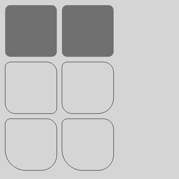

# OffscreenCanvasRenderingContext2D
<!--Kit: ArkUI-->
<!--Subsystem: ArkUI-->
<!--Owner: @sd-wu-->
<!--Designer: @sunbees-->
<!--Tester: @liuli0427-->
<!--Adviser: @Brilliantry_Rui-->

**OffscreenCanvasRenderingContext2D** allows you to perform offscreen drawing on a canvas. Offscreen drawing refers to drawing the content to be drawn in the buffer, converting the content to an image, and drawing the image to the canvas at a time. Because offscreen drawing uses the CPU for rendering, it can be slower than GPU-accelerated drawing. If the drawing speed is a critical concern, avoid using offscreen drawing.

>  **NOTE**
>
>  This component is supported since API version 8. Updates will be marked with a superscript to indicate their earliest API version.
>
>  OffscreenCanvasRenderingContext2D cannot be used in ServiceExtensionAbility. You are advised to use the [Drawing module](../../apis-arkgraphics2d/arkts-apis-graphics-drawing.md) for offscreen drawing in ServiceExtensionAbility.
>
>  The [beginPath](#beginpath), [moveTo](#moveto), [lineTo](#lineto), [closePath](#closepath), [bezierCurveTo](#beziercurveto), [quadraticCurveTo](#quadraticcurveto), [arc](#arc), [arcTo](#arcto), [ellipse](#ellipse), [rect](#rect), and [roundRect](#roundrect20) APIs can take effect only on the paths in OffscreenCanvasRenderingContext2D and cannot take effect on the paths set in [CanvasRenderingContext2D](./ts-canvasrenderingcontext2d.md) and [Path2D](./ts-components-canvas-path2d.md).

## Constructor

### constructor

constructor(width: number, height: number, settings?: RenderingContextSettings)

Creates an offscreen canvas object. You can configure the canvas width, canvas height, and parameters of the OffscreenCanvasRenderingContext2D object.

**Widget capability**: This API can be used in ArkTS widgets since API version 9.

**Atomic service API**: This API can be used in atomic services since API version 11.

**System capability**: SystemCapability.ArkUI.ArkUI.Full

**Parameters**

| Name     | Type     | Mandatory  | Description|
| -------- | ---------------------------------------- | ---- | ------------------------------ |
| width    | number                                   | Yes   | Width of the offscreen canvas. The default unit is vp.<br>NaN and Infinity are considered as invalid values.|
| height   | number                                   | Yes   | Height of the offscreen canvas. The default unit is vp.<br>NaN and Infinity are considered as invalid values.|
| settings | [RenderingContextSettings](ts-canvasrenderingcontext2d.md#renderingcontextsettings) | No   | Settings of the **OffscreenCanvasRenderingContext2D** object.<br>If the value is undefined, the default value of [RenderingContextSettings](ts-canvasrenderingcontext2d.md#renderingcontextsettings) is used.<br>Default value: **null**.|

### constructor<sup>12+<sup>

constructor(width: number, height: number, settings?: RenderingContextSettings, unit?: LengthMetricsUnit)

Constructs an offscreen canvas object. You can configure the canvas width, height, parameters of the OffscreenCanvasRenderingContext2D object, and unit mode.

**Widget capability**: This API can be used in ArkTS widgets since API version 12.

**Atomic service API**: This API can be used in atomic services since API version 12.

**System capability**: SystemCapability.ArkUI.ArkUI.Full

**Parameters**

| Name     | Type     | Mandatory  | Description|
| -------- | ---------------------------------------- | ---- | ------------------------------ |
| width    | number                                   | Yes   | Width of the offscreen canvas. The default unit is vp.<br>NaN and Infinity are considered as invalid values.|
| height   | number                                   | Yes   | Height of the offscreen canvas. The default unit is vp.<br>NaN and Infinity are considered as invalid values.|
| settings | [RenderingContextSettings](ts-canvasrenderingcontext2d.md#renderingcontextsettings) | No   | Settings of the **OffscreenCanvasRenderingContext2D** object.<br>If the value is undefined, the default value of [RenderingContextSettings](ts-canvasrenderingcontext2d.md#renderingcontextsettings) is used.<br>Default value: **null**.|
| unit | [LengthMetricsUnit](../js-apis-arkui-graphics.md#lengthmetricsunit12) | No| Unit mode of the OffscreenCanvasRenderingContext2D object. The unit mode cannot be dynamically changed after being configured. The configuration method is the same as that of [CanvasRenderingContext2D](ts-canvasrenderingcontext2d.md).<br>Invalid values **undefined**, **NaN** and **Infinity** are treated as the default value.<br>Default value: DEFAULT|

## Attributes           

> **NOTE**
> For **fillStyle**, **shadowColor**, and **strokeStyle**, the value format of the string type is 'rgb(255, 255, 255)', 'rgba(255, 255, 255, 1.0)', '\#FFFFFF'.

### fillStyle

Sets the fill color of the drawing. This attribute is read-only. You can set its value through an assignment statement, but cannot obtain its current value through a read operation. If you attempt to read the value, undefined is returned.

**Widget capability**: This API can be used in ArkTS widgets since API version 9.

**Atomic service API**: This API can be used in atomic services since API version 11.

**System capability**: SystemCapability.ArkUI.ArkUI.Full

| Type| Read Only| Optional| Description|
| ------ | ---------- | -------------- | ---------------------------------------- |
| string&nbsp;\|number<sup>10+</sup>&nbsp;\|[CanvasGradient](ts-components-canvas-canvasgradient.md)&nbsp;\|&nbsp;[CanvasPattern](ts-components-canvas-canvaspattern.md) | No| No| <br>- When the type is string, this attribute indicates the color of the fill area. For details about the color format, see the description for the string type in [ResourceColor](ts-types.md#resourcecolor).<br>- When the type is number, this attribute indicates the color of the fill area. Fully transparent colors are not supported. For details about the color format, see the description for the number type in [ResourceColor](ts-types.md#resourcecolor).<br>- When the type is **CanvasGradient**, this attribute indicates a gradient object, which is created using the **[createLinearGradient](#createlineargradient)** API.<br>- When the type is **CanvasPattern**, this attribute indicates a pattern, which is created using the **[createPattern](#createpattern)** API.<br>Default value: '#000000' (black)<br>Invalid values **NaN** and **Infinity** are treated as the default value.<br>|

```ts
// xxx.ets
@Entry
@Component
struct FillStyleExample {
  private settings: RenderingContextSettings = new RenderingContextSettings(true);
  private context: CanvasRenderingContext2D = new CanvasRenderingContext2D(this.settings);
  private offCanvas: OffscreenCanvas = new OffscreenCanvas(600, 600);

  build() {
    Flex({ direction: FlexDirection.Column, alignItems: ItemAlign.Center, justifyContent: FlexAlign.Center }) {
      Canvas(this.context)
        .width('100%')
        .height('100%')
        .backgroundColor('#ffff00')
        .onReady(() =>{
          let offContext = this.offCanvas.getContext("2d", this.settings)
          // Use string to set the fillStyle attribute.
          offContext.fillStyle = '#0000ff'
          offContext.fillRect(20, 20, 150, 100)
          let image = this.offCanvas.transferToImageBitmap()
          this.context.transferFromImageBitmap(image)
        })
    }
    .width('100%')
    .height('100%')
  }
}
```


```ts
// xxx.ets
@Entry
@Component
struct FillStyleExample {
  private settings: RenderingContextSettings = new RenderingContextSettings(true);
  private context: CanvasRenderingContext2D = new CanvasRenderingContext2D(this.settings);
  private offCanvas: OffscreenCanvas = new OffscreenCanvas(600, 600);

  build() {
    Flex({ direction: FlexDirection.Column, alignItems: ItemAlign.Center, justifyContent: FlexAlign.Center }) {
      Canvas(this.context)
        .width('100%')
        .height('100%')
        .backgroundColor('#ffff00')
        .onReady(() =>{
          let offContext = this.offCanvas.getContext("2d", this.settings)
          // Use number to set the fillStyle property.
          offContext.fillStyle = 0x0000FF
          offContext.fillRect(20, 20, 150, 100)
          let image = this.offCanvas.transferToImageBitmap()
          this.context.transferFromImageBitmap(image)
        })
    }
    .width('100%')
    .height('100%')
  }
}
```


### lineWidth

Sets the width of the drawing line. This attribute is read-only. You can set its value through an assignment statement, but cannot obtain its current value through a read operation. If you attempt to read the value, undefined is returned.

**Widget capability**: This API can be used in ArkTS widgets since API version 9.

**Atomic service API**: This API can be used in atomic services since API version 11.

**System capability**: SystemCapability.ArkUI.ArkUI.Full

| Type| Read Only| Optional| Description|
| ------ | ---------- | -------------- | ---------------------------------------- |
| number | No| No| Default value: **1** (px)<br>Default unit: vp<br>The value of lineWidth cannot be 0 or a negative number. If the value is 0, a negative number, or NaN, the default value is used. If the value is Infinity, the APIs related to the lineWidth attribute cannot be drawn.|

```ts
// xxx.ets
@Entry
@Component
struct LineWidthExample {
  private settings: RenderingContextSettings = new RenderingContextSettings(true);
  private context: CanvasRenderingContext2D = new CanvasRenderingContext2D(this.settings);
  private offCanvas: OffscreenCanvas = new OffscreenCanvas(600, 600);

  build() {
    Flex({ direction: FlexDirection.Column, alignItems: ItemAlign.Center, justifyContent: FlexAlign.Center }) {
      Canvas(this.context)
        .width('100%')
        .height('100%')
        .backgroundColor('#ffff00')
        .onReady(() =>{
          let offContext = this.offCanvas.getContext("2d", this.settings)
          // Set the lineWidth attribute.
          offContext.lineWidth = 5
          offContext.strokeRect(25, 25, 85, 105)
          let image = this.offCanvas.transferToImageBitmap()
          this.context.transferFromImageBitmap(image)
      })
    }
    .width('100%')
    .height('100%')
  }
}
```


### strokeStyle

Sets the line color. This attribute is read-only. You can set its value using an assignment statement, but cannot obtain its current value through a read operation. If you attempt to read the value, undefined is returned.

**Widget capability**: This API can be used in ArkTS widgets since API version 9.

**Atomic service API**: This API can be used in atomic services since API version 11.

**System capability**: SystemCapability.ArkUI.ArkUI.Full

| Type| Read Only| Optional| Description|
| ------ | ---------- | -------------- | ---------------------------------------- |
| string&nbsp;\|number<sup>10+</sup>&nbsp;\|[CanvasGradient](ts-components-canvas-canvasgradient.md)&nbsp;\|&nbsp;[CanvasPattern](ts-components-canvas-canvaspattern.md) | No| No| <br>- When the type is string, this attribute indicates the stroke color. For details about the color format, see the description for the string type in [ResourceColor](ts-types.md#resourcecolor).<br>- When the type is number, this attribute indicates the stroke color. Fully transparent colors are not supported. For details about the color format, see the description for the number type in [ResourceColor](ts-types.md#resourcecolor).<br>- When the type is **CanvasGradient**, this attribute indicates a gradient object, which is created using the **[createLinearGradient](#createlineargradient)** API.<br>- When the type is **CanvasPattern**, this attribute indicates a pattern, which is created using the **[createPattern](#createpattern)** API.<br>Default value: '#000000' (black)<br>Invalid values **NaN** and **Infinity** are treated as the default value.<br>|

```ts
// xxx.ets
@Entry
@Component
struct StrokeStyleExample {
  private settings: RenderingContextSettings = new RenderingContextSettings(true);
  private context: CanvasRenderingContext2D = new CanvasRenderingContext2D(this.settings);
  private offCanvas: OffscreenCanvas = new OffscreenCanvas(600, 600);

  build() {
    Flex({ direction: FlexDirection.Column, alignItems: ItemAlign.Center, justifyContent: FlexAlign.Center }) {
      Canvas(this.context)
        .width('100%')
        .height('100%')
        .backgroundColor('#ffff00')
        .onReady(() =>{
          let offContext = this.offCanvas.getContext("2d", this.settings)
          offContext.lineWidth = 10
          // Use a string to set the strokeStyle attribute.
          offContext.strokeStyle = '#0000ff'
          offContext.strokeRect(25, 25, 155, 105)
          let image = this.offCanvas.transferToImageBitmap()
          this.context.transferFromImageBitmap(image)
        })
    }
    .width('100%')
    .height('100%')
  }
}
```


```ts
// xxx.ets
@Entry
@Component
struct StrokeStyleExample {
  private settings: RenderingContextSettings = new RenderingContextSettings(true);
  private context: CanvasRenderingContext2D = new CanvasRenderingContext2D(this.settings);
  private offCanvas: OffscreenCanvas = new OffscreenCanvas(600, 600);

  build() {
    Flex({ direction: FlexDirection.Column, alignItems: ItemAlign.Center, justifyContent: FlexAlign.Center }) {
      Canvas(this.context)
        .width('100%')
        .height('100%')
        .backgroundColor('#ffff00')
        .onReady(() =>{
          let offContext = this.offCanvas.getContext("2d", this.settings)
          offContext.lineWidth = 10
          // Use a number to set the strokeStyle attribute.
          offContext.strokeStyle = 0x0000ff
          offContext.strokeRect(25, 25, 155, 105)
          let image = this.offCanvas.transferToImageBitmap()
          this.context.transferFromImageBitmap(image)
        })
    }
    .width('100%')
    .height('100%')
  }
}
```


### lineCap

Sets the style of the line endpoint. This attribute is read-only. You can set its value using an assignment statement, but cannot obtain its current value through a read operation. If you attempt to read the value, undefined is returned.

**Widget capability**: This API can be used in ArkTS widgets since API version 9.

**Atomic service API**: This API can be used in atomic services since API version 11.

**System capability**: SystemCapability.ArkUI.ArkUI.Full

| Type| Read Only| Optional| Description|
| ------ | ---------- | -------------- | ---------------------------------------- |
| [CanvasLineCap](ts-canvasrenderingcontext2d.md#canvaslinecap) | No| No| Default value: **'butt'**|

```ts
// xxx.ets
@Entry
@Component
struct LineCapExample {
  private settings: RenderingContextSettings = new RenderingContextSettings(true);
  private context: CanvasRenderingContext2D = new CanvasRenderingContext2D(this.settings);
  private offCanvas: OffscreenCanvas = new OffscreenCanvas(600, 600);

  build() {
    Flex({ direction: FlexDirection.Column, alignItems: ItemAlign.Center, justifyContent: FlexAlign.Center }) {
      Canvas(this.context)
        .width('100%')
        .height('100%')
        .backgroundColor('#ffff00')
        .onReady(() =>{
          let offContext = this.offCanvas.getContext("2d", this.settings)
          offContext.lineWidth = 8
          offContext.beginPath()
          // Set the lineCap attribute.
          offContext.lineCap = 'round'
          offContext.moveTo(30, 50)
          offContext.lineTo(220, 50)
          offContext.stroke()
          let image = this.offCanvas.transferToImageBitmap()
          this.context.transferFromImageBitmap(image)
        })
    }
    .width('100%')
    .height('100%')
  }
}
```


### lineJoin

Sets the style of the intersection point between line segments. This attribute is read-only. You can set its value using an assignment statement, but cannot obtain its current value through a read operation. If you attempt to read its current value, undefined is returned.

**Widget capability**: This API can be used in ArkTS widgets since API version 9.

**Atomic service API**: This API can be used in atomic services since API version 11.

**System capability**: SystemCapability.ArkUI.ArkUI.Full

| Type| Read Only| Optional| Description|
| ------ | ---------- | -------------- | ---------------------------------------- |
| [CanvasLineJoin](ts-canvasrenderingcontext2d.md#canvaslinejoin) | No| No| Default value: **'miter'**|

```ts
// xxx.ets
@Entry
@Component
struct LineJoinExample {
  private settings: RenderingContextSettings = new RenderingContextSettings(true);
  private context: CanvasRenderingContext2D = new CanvasRenderingContext2D(this.settings);
  private offCanvas: OffscreenCanvas = new OffscreenCanvas(600, 600);

  build() {
    Flex({ direction: FlexDirection.Column, alignItems: ItemAlign.Center, justifyContent: FlexAlign.Center }) {
      Canvas(this.context)
        .width('100%')
        .height('100%')
        .backgroundColor('#ffff00')
        .onReady(() =>{
          let offContext = this.offCanvas.getContext("2d", this.settings)
          offContext.beginPath()
          offContext.lineWidth = 8
          // Set the lineJoin attribute.
          offContext.lineJoin = 'miter'
          offContext.moveTo(30, 30)
          offContext.lineTo(120, 60)
          offContext.lineTo(30, 110)
          offContext.stroke()
          let image = this.offCanvas.transferToImageBitmap()
          this.context.transferFromImageBitmap(image)
      })
    }
    .width('100%')
    .height('100%')
  }
}
```


### miterLimit

Sets the miter limit, which specifies the distance between the inner and outer angles at the intersection of lines. This attribute takes effect only when lineJoin is set to miter. This attribute is a write-only attribute. You can assign a value to it using an assignment statement, but cannot obtain its current value through a read operation. If you attempt to read the value, undefined will be returned.

**Widget capability**: This API can be used in ArkTS widgets since API version 9.

**Atomic service API**: This API can be used in atomic services since API version 11.

**System capability**: SystemCapability.ArkUI.ArkUI.Full

| Type| Read Only| Optional| Description|
| ------ | ---------- | -------------- | ---------------------------------------- |
| number | No| No| Default value: **10** (px)<br>Unit: px<br>The value of miterLimit cannot be 0 or a negative number. If the value is 0, a negative number, or NaN, the default value is used. If the value is Infinity, the APIs related to the miterLimit attribute cannot be drawn.|

```ts
// xxx.ets
@Entry
@Component
struct MiterLimit {
  private settings: RenderingContextSettings = new RenderingContextSettings(true);
  private context: CanvasRenderingContext2D = new CanvasRenderingContext2D(this.settings);
  private offCanvas: OffscreenCanvas = new OffscreenCanvas(600, 600);
  
  build() {
    Flex({ direction: FlexDirection.Column, alignItems: ItemAlign.Center, justifyContent: FlexAlign.Center }) {
      Canvas(this.context)
        .width('100%')
        .height('100%')
        .backgroundColor('#ffff00')
        .onReady(() =>{
          let offContext = this.offCanvas.getContext("2d", this.settings)
          offContext.lineWidth = 8
          offContext.lineJoin = 'miter'
          // Set the miterLimit attribute.
          offContext.miterLimit = 3
          offContext.moveTo(30, 30)
          offContext.lineTo(60, 35)
          offContext.lineTo(30, 37)
          offContext.stroke()
          let image = this.offCanvas.transferToImageBitmap()
          this.context.transferFromImageBitmap(image)
      })
    }
    .width('100%')
    .height('100%')
  }
}
```


### font

Sets the font style for text drawing. This attribute is read-only. You can set its value using an assignment statement, but cannot obtain its current value through a read operation. If you attempt to read its current value, undefined is returned. Custom fonts registered in API version 20 and later are supported. (Custom fonts can be used only in the main thread and cannot be used in the worker thread. The previewer of DevEco Studio does not support the display of custom fonts.)

Syntax: ctx.font&nbsp;=&nbsp;'font-style&nbsp;font-weight&nbsp;font-size&nbsp;font-family'<br>- (Optional) **font-style**: font style. Available values are **normal** and **italic**.<br>- (Optional) **font-weight**: font weight. Available values are as follows: **normal**, **bold**, **bolder**, **lighter**, **100**, **200**, **300**, **400**, **500**, **600**, **700**, **800**, **900**.<br>- (Optional) **font-size**: font size and line height. The unit can be px or vp and must be specified.<br>- (Optional) **font-family**: font family. Available values are **sans-serif**, **serif**, and **monospace**.

**Widget capability**: This API can be used in ArkTS widgets since API version 9.

**Atomic service API**: This API can be used in atomic services since API version 11.

**System capability**: SystemCapability.ArkUI.ArkUI.Full

| Type| Read Only| Optional| Description|
| ------ | ---------- | -------------- | ---------------------------------------- |
| string | No| No| Default value: **'normal normal 14px sans-serif'**|

> **NOTE**
>
> You can register a custom font in either of the following ways: You can register a custom font by calling the asynchronous API this.uiContext.getFont().[registerFont](../arkts-apis-uicontext-font.md#registerfont) of ArkUI. However, if you call this API immediately after the registration, the custom font may not take effect. Alternatively, you can directly call the fontCollection.[loadFontSync](../../apis-arkgraphics2d/js-apis-graphics-text.md#loadfontsync) API of the font engine to register the custom font. When you directly call the font engine API to register a custom font, the fontCollection instance must be text.FontCollection.getGlobalInstance(), because the component loads fonts from this instance by default. If you use another instance, the custom font may not take effect.

```ts
import { text } from '@kit.ArkGraphics2D';

@Entry
@Component
struct FontDemo {
  private settings: RenderingContextSettings = new RenderingContextSettings(true);
  private context: CanvasRenderingContext2D = new CanvasRenderingContext2D(this.settings);
  private offCanvas: OffscreenCanvas = new OffscreenCanvas(600, 600);

  build() {
    Flex({ direction: FlexDirection.Column, alignItems: ItemAlign.Center, justifyContent: FlexAlign.Center }) {
      Canvas(this.context)
        .width('100%')
        .height('100%')
        .backgroundColor('rgb(213,213,213)')
        .onReady(() => {
          let offContext = this.offCanvas.getContext("2d", this.settings);
          // Normal font style, normal weight, font size of 30px, and font family of sans-serif
          offContext.font = 'normal normal 30px sans-serif'
          offContext.fillText("Hello px", 20, 60)
          // Italic style, bold, font size of 30 vp, and font family of monospace
          offContext.font = 'italic bold 30vp monospace'
          offContext.fillText("Hello vp", 20, 100)
          // Load the custom font file HarmonyOS_Sans_Thin_Italic.ttf in the rawfile directory.
          let fontCollection = text.FontCollection.getGlobalInstance();
          fontCollection.loadFontSync('HarmonyOS_Sans_Thin_Italic', $rawfile("HarmonyOS_Sans_Thin_Italic.ttf"))
          // Bold, font size of 30 vp, and font family of HarmonyOS_Sans_Thin_Italic
          offContext.font = "bold 30vp HarmonyOS_Sans_Thin_Italic"
          offContext.fillText("Hello customFont", 20, 140)
          let image = this.offCanvas.transferToImageBitmap();
          this.context.transferFromImageBitmap(image)
        })
    }
    .width('100%')
    .height('100%')
  }
}
```


### textAlign

Sets the text alignment mode during text drawing. This attribute is read-only. You can set its value using an assignment statement, but cannot obtain its current value through a read operation. If you attempt to read its current value, undefined is returned.

**Widget capability**: This API can be used in ArkTS widgets since API version 9.

**Atomic service API**: This API can be used in atomic services since API version 11.

**System capability**: SystemCapability.ArkUI.ArkUI.Full

| Type| Read Only| Optional| Description|
| ------ | ---------- | -------------- | ---------------------------------------- |
| [CanvasTextAlign](ts-canvasrenderingcontext2d.md#canvastextalign) | No| No| In the ltr layout mode, the value of start is the same as that of left. In the rtl layout mode, the value of start is the same as that of right.<br>Default value: 'left'|

```ts
// xxx.ets
@Entry
@Component
struct CanvasExample {
  private settings: RenderingContextSettings = new RenderingContextSettings(true);
  private context: CanvasRenderingContext2D = new CanvasRenderingContext2D(this.settings);
  private offCanvas: OffscreenCanvas = new OffscreenCanvas(600, 600);

  build() {
    Flex({ direction: FlexDirection.Column, alignItems: ItemAlign.Center, justifyContent: FlexAlign.Center }) {
      Canvas(this.context)
        .width('100%')
        .height('100%')
        .backgroundColor('rgb(213,213,213)')
        .onReady(() => {
          let offContext = this.offCanvas.getContext("2d", this.settings)
          offContext.strokeStyle = 'rgb(39,135,217)'
          offContext.moveTo(140, 10)
          offContext.lineTo(140, 160)
          offContext.stroke()

          offContext.font = '50px sans-serif'

          // Set the textAlign attribute to start.
          offContext.textAlign = 'start'
          offContext.fillText('textAlign=start', 140, 60)
          // Set the textAlign attribute to end.
          offContext.textAlign = 'end'
          offContext.fillText('textAlign=end', 140, 80)
          // Set the textAlign attribute to left.
          offContext.textAlign = 'left'
          offContext.fillText('textAlign=left', 140, 100)
          // Set the textAlign attribute to center.
          offContext.textAlign = 'center'
          offContext.fillText('textAlign=center', 140, 120)
          // Set the textAlign attribute to right.
          offContext.textAlign = 'right'
          offContext.fillText('textAlign=right', 140, 140)
          let image = this.offCanvas.transferToImageBitmap()
          this.context.transferFromImageBitmap(image)
        })
    }
    .width('100%')
    .height('100%')
  }
}
```


### textBaseline

Sets the horizontal alignment mode of text drawing. This attribute is read-only. You can set its value through an assignment statement, but cannot obtain its current value through a read operation. If you attempt to read its current value, undefined is returned.

**Widget capability**: This API can be used in ArkTS widgets since API version 9.

**Atomic service API**: This API can be used in atomic services since API version 11.

**System capability**: SystemCapability.ArkUI.ArkUI.Full

| Type| Read Only| Optional| Description|
| ------ | ---------- | -------------- | ---------------------------------------- |
| [CanvasTextBaseline](ts-canvasrenderingcontext2d.md#canvastextbaseline) | No| No| Default value: **'alphabetic'**|

```ts
// xxx.ets
@Entry
@Component
struct TextBaseline {
  private settings: RenderingContextSettings = new RenderingContextSettings(true);
  private context: CanvasRenderingContext2D = new CanvasRenderingContext2D(this.settings);
  private offCanvas: OffscreenCanvas = new OffscreenCanvas(600, 600);
  
  build() {
    Flex({ direction: FlexDirection.Column, alignItems: ItemAlign.Center, justifyContent: FlexAlign.Center }) {
      Canvas(this.context)
        .width('100%')
        .height('100%')
        .backgroundColor('rgb(213,213,213)')
        .onReady(() => {
          let offContext = this.offCanvas.getContext("2d", this.settings)
          offContext.strokeStyle = '#0000ff'
          offContext.moveTo(0, 120)
          offContext.lineTo(400, 120)
          offContext.stroke()

          offContext.font = '20px sans-serif'

          // Set the textBaseline attribute to top.
          offContext.textBaseline = 'top'
          offContext.fillText('Top', 10, 120)
          // Set the textBaseline attribute to bottom.
          offContext.textBaseline = 'bottom'
          offContext.fillText('Bottom', 55, 120)
          // Set the textBaseline attribute to middle.
          offContext.textBaseline = 'middle'
          offContext.fillText('Middle', 125, 120)
          // Set the textBaseline attribute to alphabetic.
          offContext.textBaseline = 'alphabetic'
          offContext.fillText('Alphabetic', 195, 120)
          // Set the textBaseline attribute to hanging.
          offContext.textBaseline = 'hanging'
          offContext.fillText('Hanging', 295, 120)
          let image = this.offCanvas.transferToImageBitmap()
          this.context.transferFromImageBitmap(image)
      })
    }
    .width('100%')
    .height('100%')
  }
}
```


### globalAlpha

Sets the opacity. This attribute is read-only. You can set its value through an assignment statement, but cannot obtain its current value through a read operation. If you attempt to read its current value, undefined is returned.

**Widget capability**: This API can be used in ArkTS widgets since API version 9.

**Atomic service API**: This API can be used in atomic services since API version 11.

**System capability**: SystemCapability.ArkUI.ArkUI.Full

| Type| Read Only| Optional| Description|
| ------ | ---------- | -------------- | ---------------------------------------- |
| number | No| No| The value ranges from 0.0 to 1.0. 0.0 indicates completely transparent, and 1.0 indicates completely opaque. If the given value is less than 0.0, the value 0.0 is used. If the given value is greater than 1.0, the value 1.0 is used.<br>In versions earlier than API version 18, if NaN or Infinity is set, the drawing method executed after this method cannot be drawn. In API version 18 and later versions, if NaN or Infinity is set, the current API does not take effect, and other drawing methods with valid parameters are drawn normally.<br>Default value: **1.0**.|

```ts
// xxx.ets
@Entry
@Component
struct GlobalAlpha {
  private settings: RenderingContextSettings = new RenderingContextSettings(true);
  private context: CanvasRenderingContext2D = new CanvasRenderingContext2D(this.settings);
  private offCanvas: OffscreenCanvas = new OffscreenCanvas(600, 600);
  
  build() {
    Flex({ direction: FlexDirection.Column, alignItems: ItemAlign.Center, justifyContent: FlexAlign.Center }) {
      Canvas(this.context)
        .width('100%')
        .height('100%')
        .backgroundColor('#ffff00')
        .onReady(() =>{
          let offContext = this.offCanvas.getContext("2d", this.settings)
          offContext.fillStyle = 'rgb(0,0,255)'
          offContext.fillRect(0, 0, 50, 50)
          // Set the globalAlpha attribute.
          offContext.globalAlpha = 0.4
          offContext.fillStyle = 'rgb(0,0,255)'
          offContext.fillRect(50, 50, 50, 50)
          let image = this.offCanvas.transferToImageBitmap()
          this.context.transferFromImageBitmap(image)
      })
    }
    .width('100%')
    .height('100%')
  }
}
```


### lineDashOffset

Sets the dashed line offset of the canvas. The value is of the float type. This attribute takes effect only when setLineDash is called. This attribute is a write-only attribute. You can assign a value to it, but cannot obtain its current value through a read operation. If you attempt to read the value, undefined will be returned.

**Widget capability**: This API can be used in ArkTS widgets since API version 9.

**Atomic service API**: This API can be used in atomic services since API version 11.

**System capability**: SystemCapability.ArkUI.ArkUI.Full

| Type| Read Only| Optional| Description|
| ------ | ---------- | -------------- | ---------------------------------------- |
| number | No| No| Default value: 0.0<br>Unit: vp.<br>Invalid values **NaN** and **Infinity** are treated as the default value.|

```ts
// xxx.ets
@Entry
@Component
struct LineDashOffset {
  private settings: RenderingContextSettings = new RenderingContextSettings(true);
  private context: CanvasRenderingContext2D = new CanvasRenderingContext2D(this.settings);
  private offCanvas: OffscreenCanvas = new OffscreenCanvas(600, 600);
  
  build() {
    Flex({ direction: FlexDirection.Column, alignItems: ItemAlign.Center, justifyContent: FlexAlign.Center }) {
      Canvas(this.context)
        .width('100%')
        .height('100%')
        .backgroundColor('#ffff00')
        .onReady(() =>{
          let offContext = this.offCanvas.getContext("2d", this.settings)
          offContext.arc(100, 75, 50, 0, 6.28)
          offContext.setLineDash([10,20])
          // Set the lineDashOffset attribute.
          offContext.lineDashOffset = 10.0
          offContext.stroke()
          let image = this.offCanvas.transferToImageBitmap()
          this.context.transferFromImageBitmap(image)
      })
    }
    .width('100%')
    .height('100%')
  }
}

```


### globalCompositeOperation

Sets the synthesis operation mode. This attribute is read-only. You can set its value through an assignment statement, but cannot obtain its current value through a read operation. If you attempt to read the value, undefined is returned.

**Widget capability**: This API can be used in ArkTS widgets since API version 9.

**Atomic service API**: This API can be used in atomic services since API version 11.

**System capability**: SystemCapability.ArkUI.ArkUI.Full

| Type| Read Only| Optional| Description|
| ------ | ---------- | -------------- | ---------------------------------------- |
| string | No| No| Available values are as follows: **'source-over'**, **'source-atop'**, **'source-in'**, **'source-out'**, **'destination-over'**, **'destination-atop'**, **'destination-in'**, **'destination-out'**, **'lighter'**, **'copy'**, and **'xor'**.<br>Default value: 'source-over'|

| Name              | Description                      |
| ---------------- | ------------------------ |
| source-over      | Displays the new drawing above the existing drawing. This attribute is used by default.  |
| source-atop      | Displays the new drawing on the top of the existing drawing.       |
| source-in        | Displays the new drawing inside the existing drawing.        |
| source-out       | Displays part of the new drawing that is outside of the existing drawing.       |
| destination-over | Displays the existing drawing above the new drawing.       |
| destination-atop | Displays the existing drawing on the top of the new drawing.       |
| destination-in   | Displays the existing drawing inside the new drawing.        |
| destination-out  | Displays the existing drawing outside the new drawing.        |
| lighter          | Displays both the new and existing drawing.         |
| copy             | Displays the new drawing and neglects the existing drawing.       |
| xor              | Combines the new drawing and existing drawing using the XOR operation.|

``` ts
// xxx.ets
@Entry
@Component
struct GlobalCompositeOperation {
  private settings: RenderingContextSettings = new RenderingContextSettings(true);
  private context1: CanvasRenderingContext2D = new CanvasRenderingContext2D(this.settings);
  private context2: CanvasRenderingContext2D = new CanvasRenderingContext2D(this.settings);
  private context3: CanvasRenderingContext2D = new CanvasRenderingContext2D(this.settings);
  private context4: CanvasRenderingContext2D = new CanvasRenderingContext2D(this.settings);
  private context5: CanvasRenderingContext2D = new CanvasRenderingContext2D(this.settings);
  private context6: CanvasRenderingContext2D = new CanvasRenderingContext2D(this.settings);

  build() {
    Column() {
      Row() {
        // 1. source-over: The new image is overlaid on the original image (default behavior).
        Canvas(this.context1)
          .width('45%')
          .borderWidth(1)
          .margin(5)
          .onReady(() => {
            let ctx1 = this.context1;
            let offContext = new OffscreenCanvasRenderingContext2D(ctx1.width, ctx1.height, this.settings);
            offContext.fillStyle = 'rgb(39,135,217)';
            offContext.fillRect(25, 25, 75, 75); // Original image
            offContext.globalCompositeOperation = 'source-over'; // Default value, which can be omitted.
            offContext.fillStyle = 'rgb(23,169,141)';
            offContext.fillRect(75, 75, 75, 75); // New image overlaying.
            let image = offContext.transferToImageBitmap();
            this.context1.transferFromImageBitmap(image);
          })
        // 2. destination-out: The new image erases the original image. (This is the core logic of the eraser.)
        Canvas(this.context2)
          .width('45%')
          .borderWidth(1)
          .margin(5)
          .onReady(() => {
            let ctx2 = this.context2;
            let offContext = new OffscreenCanvasRenderingContext2D(ctx2.width, ctx2.height, this.settings);
            // Draw the background first.
            offContext.fillStyle = 'rgb(39,135,217)';
            offContext.fillRect(0, 0, ctx2.width, ctx2.height);
            // Set the blending mode to erase.
            offContext.globalCompositeOperation = 'destination-out';
            // Draw a circle as the eraser.
            offContext.beginPath();
            offContext.arc(ctx2.width / 2, ctx2.height / 2, 60, 0, Math.PI * 2);
            offContext.fill(); // Erase the background of the circle.
            let image = offContext.transferToImageBitmap();
            this.context2.transferFromImageBitmap(image);
          })
      }
      .height('30%')

      Row() {
        // 3. source-in: Only the overlapping part between the new image and the original image is retained. (Clipping or masking)
        Canvas(this.context3)
          .width('45%')
          .borderWidth(1)
          .margin(5)
          .onReady(() => {
            let ctx3 = this.context3;
            let offContext = new OffscreenCanvasRenderingContext2D(ctx3.width, ctx3.height, this.settings);
            // Draw the original image (circle mask) first.
            offContext.beginPath();
            offContext.arc(ctx3.width / 2, ctx3.height / 2, 80, 0, Math.PI * 2);
            offContext.fillStyle = '#fff';
            offContext.fill();
            // Set the blending mode.
            offContext.globalCompositeOperation = 'source-in';
            // Draw a new shape (gradient rectangle).
            const gradient = offContext.createLinearGradient(0, 0, ctx3.width, ctx3.height);
            gradient.addColorStop(0, 'rgb(23,169,141)');
            gradient.addColorStop(1, 'rgb(39,135,217)');
            offContext.fillStyle = gradient;
            offContext.fillRect(0, 0, 200, 200); // Displaying gradient only in the circular area
            let image = offContext.transferToImageBitmap();
            this.context3.transferFromImageBitmap(image);
          })
        // 4. lighter: The new shape is overlaid with the original shape (the luminance is added, and the color filtering effect is achieved).
        Canvas(this.context4)
          .width('45%')
          .borderWidth(1)
          .margin(5)
          .onReady(() => {
            let ctx4 = this.context4;
            let offContext = new OffscreenCanvasRenderingContext2D(ctx4.width, ctx4.height, this.settings);
            // Original shape (a semitransparent red circle)
            offContext.beginPath();
            offContext.arc(70, 100, 50, 0, Math.PI * 2);
            offContext.fillStyle = 'rgba(234, 67, 53, 0.7)';
            offContext.fill();
            // Set the blending mode.
            offContext.globalCompositeOperation = 'lighter';
            // New shape (a semitransparent blue circle)
            offContext.beginPath();
            offContext.arc(110, 100, 50, 0, Math.PI * 2);
            offContext.fillStyle = 'rgba(66, 133, 244, 0.7)';
            offContext.fill(); // The overlapping area turns purple (luminance blending).
            let image = offContext.transferToImageBitmap();
            this.context4.transferFromImageBitmap(image);
          })
      }
      .height('30%')

      Row() {
        // 5. destination-atop: retains the overlapping part of the original and new graphics and removes other parts.
        Canvas(this.context5)
          .width('45%')
          .borderWidth(1)
          .margin(5)
          .onReady(() => {
            let ctx5 = this.context5;
            let offContext = new OffscreenCanvasRenderingContext2D(ctx5.width, ctx5.height, this.settings);
            // Original graphics (green rectangle)
            offContext.fillStyle = 'rgb(23,169,141)';
            offContext.fillRect(0, 0, ctx5.width, ctx5.height);
            // Set the blending mode.
            offContext.globalCompositeOperation = 'destination-atop';
            // New graphics (small circle)
            offContext.beginPath();
            offContext.arc(ctx5.width / 2, ctx5.height / 2, 60, 0, Math.PI * 2);
            offContext.fillStyle = '#000';
            offContext.fill(); // Only the overlapping part of the rectangle and circle is retained.
            let image = offContext.transferToImageBitmap();
            this.context5.transferFromImageBitmap(image);
          })
        // 6. Text mask (advanced usage of source-in)
        Canvas(this.context6)
          .width('45%')
          .borderWidth(1)
          .margin(5)
          .onReady(() => {
            let ctx6 = this.context6;
            let offContext = new OffscreenCanvasRenderingContext2D(ctx6.width, ctx6.height, this.settings);
            // Draw text first (as a mask).
            offContext.font = 'bold 40vp';
            offContext.textAlign = 'center';
            offContext.textBaseline = 'middle';
            offContext.fillText('CANVAS', ctx6.width / 2, ctx6.height / 2);
            // Set the blending mode.
            offContext.globalCompositeOperation = 'source-in';
            // Draw the gradient background (displayed only in the text area).
            let textGradient = offContext.createLinearGradient(50, 0, 300, 100);
            textGradient.addColorStop(0.0, 'rgb(39,135,217)');
            textGradient.addColorStop(0.5, 'rgb(255,238,240)');
            textGradient.addColorStop(1.0, 'rgb(23,169,141)');
            offContext.fillStyle = textGradient;
            offContext.fillRect(0, 0, 200, 200); // The gradient fills only the text area.
            let image = offContext.transferToImageBitmap();
            this.context6.transferFromImageBitmap(image);
          })
      }
      .height('30%')
    }
    .width('100%')
    .height('100%')
  }
}
```


### shadowBlur

Sets the blur level when a shadow is drawn. This attribute is read-only. You can set its value through an assignment statement, but cannot obtain its current value through a read operation. If you attempt to read the value, undefined is returned.

**Widget capability**: This API can be used in ArkTS widgets since API version 9.

**Atomic service API**: This API can be used in atomic services since API version 11.

**System capability**: SystemCapability.ArkUI.ArkUI.Full

| Type| Read Only| Optional| Description|
| ------ | ---------- | -------------- | ---------------------------------------- |
| number | No| No| A larger value indicates a more blurred effect. The value is of the float type. The value must be greater than or equal to 0.<br>Default value: 0.0<br>Unit: px<br>The value of shadowBlur cannot be a negative number. If the value is a negative number, NaN, or Infinity, the default value is used.|

```ts
// xxx.ets
@Entry
@Component
struct ShadowBlur {
  private settings: RenderingContextSettings = new RenderingContextSettings(true);
  private context: CanvasRenderingContext2D = new CanvasRenderingContext2D(this.settings);
  private offCanvas: OffscreenCanvas = new OffscreenCanvas(600, 600);
  
  build() {
    Flex({ direction: FlexDirection.Column, alignItems: ItemAlign.Center, justifyContent: FlexAlign.Center }) {
      Canvas(this.context)
        .width('100%')
        .height('100%')
        .backgroundColor('rgb(213,213,213)')
        .onReady(() =>{
          let offContext = this.offCanvas.getContext("2d", this.settings)
          // Set the shadowBlur property.
          offContext.shadowBlur = 30
          offContext.shadowColor = 'rgb(0,0,0)'
          offContext.fillStyle = 'rgb(39,135,217)'
          offContext.fillRect(20, 20, 100, 80)
          let image = this.offCanvas.transferToImageBitmap()
          this.context.transferFromImageBitmap(image)
      })
    }
    .width('100%')
    .height('100%')
  }
}
```


### shadowColor

Sets the shadow color when a shadow is drawn. This attribute is read-only. You can set its value through an assignment statement, but cannot obtain its current value through a read operation. If you attempt to read the value, undefined is returned.

**Widget capability**: This API can be used in ArkTS widgets since API version 9.

**Atomic service API**: This API can be used in atomic services since API version 11.

**System capability**: SystemCapability.ArkUI.ArkUI.Full

| Type| Read Only| Optional| Description|
| ------ | ---------- | -------------- | ---------------------------------------- |
| string | No| No| For details about the color notation, see the description of the string type in [ResourceColor](ts-types.md#resourcecolor).<br>Default value: transparent black|

```ts
// xxx.ets
@Entry
@Component
struct ShadowColor {
  private settings: RenderingContextSettings = new RenderingContextSettings(true);
  private context: CanvasRenderingContext2D = new CanvasRenderingContext2D(this.settings);
  private offCanvas: OffscreenCanvas = new OffscreenCanvas(600, 600);
  
  build() {
    Flex({ direction: FlexDirection.Column, alignItems: ItemAlign.Center, justifyContent: FlexAlign.Center }) {
      Canvas(this.context)
        .width('100%')
        .height('100%')
        .backgroundColor('rgb(213,213,213)')
        .onReady(() => {
          let offContext = this.offCanvas.getContext("2d", this.settings)
          offContext.shadowBlur = 30
          // Set the shadowColor attribute.
          offContext.shadowColor = 'rgb(255,192,0)'
          offContext.fillStyle = 'rgb(39,135,217)'
          offContext.fillRect(30, 30, 100, 100)
          let image = this.offCanvas.transferToImageBitmap()
          this.context.transferFromImageBitmap(image)
      })
    }
    .width('100%')
    .height('100%')
  }
}
```


### shadowOffsetX

Sets the horizontal offset between the shadow and the original object when a shadow is drawn. This attribute is read-only. You can set its value through an assignment statement, but cannot obtain its current value through a read operation. If you attempt to read the value, undefined is returned.

**Widget capability**: This API can be used in ArkTS widgets since API version 9.

**Atomic service API**: This API can be used in atomic services since API version 11.

**System capability**: SystemCapability.ArkUI.ArkUI.Full

| Type| Read Only| Optional| Description|
| ------ | ---------- | -------------- | ---------------------------------------- |
| number | No| No| Default value: 0.0<br>Default unit: vp<br>Invalid values **NaN** and **Infinity** are treated as the default value.|

```ts
// xxx.ets
@Entry
@Component
struct ShadowOffsetX {
  private settings: RenderingContextSettings = new RenderingContextSettings(true);
  private context: CanvasRenderingContext2D = new CanvasRenderingContext2D(this.settings);
  private offCanvas: OffscreenCanvas = new OffscreenCanvas(600, 600);
  
  build() {
    Flex({ direction: FlexDirection.Column, alignItems: ItemAlign.Center, justifyContent: FlexAlign.Center }) {
      Canvas(this.context)
        .width('100%')
        .height('100%')
        .backgroundColor('#ffff00')
        .onReady(() =>{
          let offContext = this.offCanvas.getContext("2d", this.settings)
          offContext.shadowBlur = 10
          // Set the shadowOffsetX attribute.
          offContext.shadowOffsetX = 20
          offContext.shadowColor = 'rgb(0,0,0)'
          offContext.fillStyle = 'rgb(255,0,0)'
          offContext.fillRect(20, 20, 100, 80)
          let image = this.offCanvas.transferToImageBitmap()
          this.context.transferFromImageBitmap(image)
      })
    }
    .width('100%')
    .height('100%')
  }
}
```


### shadowOffsetY

Sets the vertical offset between the shadow and the original object when a shadow is drawn. This attribute is read-only. You can set its value through an assignment statement, but cannot obtain its current value through a read operation. If you attempt to read the value, undefined is returned.

**Widget capability**: This API can be used in ArkTS widgets since API version 9.

**Atomic service API**: This API can be used in atomic services since API version 11.

**System capability**: SystemCapability.ArkUI.ArkUI.Full

| Type| Read Only| Optional| Description|
| ------ | ---------- | -------------- | ---------------------------------------- |
| number | No| No| Default value: 0.0<br>Default unit: vp<br>Invalid values **NaN** and **Infinity** are treated as the default value.|

```ts
// xxx.ets
@Entry
@Component
struct ShadowOffsetY {
  private settings: RenderingContextSettings = new RenderingContextSettings(true);
  private context: CanvasRenderingContext2D = new CanvasRenderingContext2D(this.settings);
  private offCanvas: OffscreenCanvas = new OffscreenCanvas(600, 600);

  build() {
    Flex({ direction: FlexDirection.Column, alignItems: ItemAlign.Center, justifyContent: FlexAlign.Center }) {
      Canvas(this.context)
        .width('100%')
        .height('100%')
        .backgroundColor('#ffff00')
        .onReady(() =>{
          let offContext = this.offCanvas.getContext("2d", this.settings)
          offContext.shadowBlur = 10
          // Set the shadowOffsetY attribute.
          offContext.shadowOffsetY = 20
          offContext.shadowColor = 'rgb(0,0,0)'
          offContext.fillStyle = 'rgb(255,0,0)'
          offContext.fillRect(30, 30, 100, 100)
          let image = this.offCanvas.transferToImageBitmap()
          this.context.transferFromImageBitmap(image)
      })
    }
    .width('100%')
    .height('100%')
  }
}
```


### imageSmoothingEnabled

Indicates whether to adjust the image smoothness when drawing an image. The value true indicates that the image smoothness is adjusted, and the value false indicates that the image smoothness is not adjusted. This attribute is read-only. You can set its value by using an assignment statement, but cannot obtain its current value by reading. If you attempt to read the value, undefined is returned.

**Widget capability**: This API can be used in ArkTS widgets since API version 9.

**Atomic service API**: This API can be used in atomic services since API version 11.

**System capability**: SystemCapability.ArkUI.ArkUI.Full

| Type| Read Only| Optional| Description|
| ------ | ---------- | -------------- | ---------------------------------------- |
| boolean | No| No| Default value: **true**.|

```ts
// xxx.ets
@Entry
@Component
struct ImageSmoothingEnabled {
  private settings: RenderingContextSettings = new RenderingContextSettings(true);
  private context: CanvasRenderingContext2D = new CanvasRenderingContext2D(this.settings);
  // Replace "common/images/icon.jpg" with the image resource file required by the developer.
  private img:ImageBitmap = new ImageBitmap("common/images/icon.jpg");
  private offCanvas: OffscreenCanvas = new OffscreenCanvas(600, 600);
  
  build() {
    Flex({ direction: FlexDirection.Column, alignItems: ItemAlign.Center, justifyContent: FlexAlign.Center }) {
      Canvas(this.context)
        .width('100%')
        .height('100%')
        .backgroundColor('#ffff00')
        .onReady(() =>{
          let offContext = this.offCanvas.getContext("2d", this.settings)
          // Set the imageSmoothingEnabled attribute.
          offContext.imageSmoothingEnabled = false
          offContext.drawImage(this.img,0,0,400,200)
          let image = this.offCanvas.transferToImageBitmap()
          this.context.transferFromImageBitmap(image)
      })
    }
    .width('100%')
    .height('100%')
  }
}
```


### imageSmoothingQuality

Sets the image smoothness when imageSmoothingEnabled is true. This attribute is read-only. You can set its value by using an assignment statement, but cannot obtain its current value by reading. If you attempt to read the value, undefined is returned.

**Widget capability**: This API can be used in ArkTS widgets since API version 9.

**Atomic service API**: This API can be used in atomic services since API version 11.

**System capability**: SystemCapability.ArkUI.ArkUI.Full

| Type| Read Only| Optional| Description|
| ------ | ---------- | -------------- | ---------------------------------------- |
| [ImageSmoothingQuality](ts-canvasrenderingcontext2d.md#imagesmoothingquality) | No| No| Default value: "low"|

```ts
  // xxx.ets
  @Entry
  @Component
  struct ImageSmoothingQualityDemoOff {
    private settings: RenderingContextSettings = new RenderingContextSettings(true);
    private context: CanvasRenderingContext2D = new CanvasRenderingContext2D(this.
settings);
    private offCanvas: OffscreenCanvas = new OffscreenCanvas(600, 600);
    // Replace "common/images/example.jpg" with the image resource file you use.
    private img:ImageBitmap = new ImageBitmap("common/images/example.jpg");

    build() {
      Flex({ direction: FlexDirection.Column, alignItems: ItemAlign.Center, 
justifyContent: FlexAlign.Center }) {
        Canvas(this.context)
          .width('100%')
          .height('100%')
          .backgroundColor('#ffff00')
          .onReady(() =>{
            let offContext = this.offCanvas.getContext("2d", this.settings)
            let offctx = offContext
            offctx.imageSmoothingEnabled = true
            // Set the imageSmoothingQuality attribute.
            offctx.imageSmoothingQuality = 'high'
            offctx.drawImage(this.img, 0, 0, 400, 200)

            let image = this.offCanvas.transferToImageBitmap()
            this.context.transferFromImageBitmap(image)
          })
      }
      .width('100%')
      .height('100%')
    }
  }
```


### direction

Sets the text direction used for drawing text. This attribute is read-only. You can set its value by using an assignment statement, but cannot obtain its current value by reading. If you attempt to read the value, undefined is returned.

**Widget capability**: This API can be used in ArkTS widgets since API version 9.

**Atomic service API**: This API can be used in atomic services since API version 11.

**System capability**: SystemCapability.ArkUI.ArkUI.Full

| Type| Read Only| Optional| Description|
| ------ | ---------- | -------------- | ---------------------------------------- |
| [CanvasDirection](ts-canvasrenderingcontext2d.md#canvasdirection) | No| No| Default value: "inherit"|

```ts
  // xxx.ets
  @Entry
  @Component
  struct DirectionDemoOff {
    private settings: RenderingContextSettings = new RenderingContextSettings(true);
    private context: CanvasRenderingContext2D = new CanvasRenderingContext2D(this.
settings);
    private offCanvas: OffscreenCanvas = new OffscreenCanvas(600, 600);

    build() {
      Flex({ direction: FlexDirection.Column, alignItems: ItemAlign.Center, 
justifyContent: FlexAlign.Center }) {
        Canvas(this.context)
          .width('100%')
          .height('100%')
          .backgroundColor('#ffff00')
          .onReady(() =>{
            let offContext = this.offCanvas.getContext("2d", this.settings)
            let offctx = offContext
            offctx.font = '48px serif';
            offctx.textAlign = 'start'
            offctx.fillText("Hi ltr!", 200, 50);

            // Set the direction attribute.
            offctx.direction = "rtl";
            offctx.fillText("Hi rtl!", 200, 100);

            let image = offctx.transferToImageBitmap()
            this.context.transferFromImageBitmap(image)
          })
      }
      .width('100%')
      .height('100%')
    }
  }
```


### filter

Sets the filter of an image. You can combine any number of filters. This attribute is read-only. You can set its value through an assignment statement, but cannot obtain its current value through a read operation. If you attempt to read the value, undefined is returned.

**Widget capability**: This API can be used in ArkTS widgets since API version 9.

**Atomic service API**: This API can be used in atomic services since API version 11.

**System capability**: SystemCapability.ArkUI.ArkUI.Full

| Type| Read Only| Optional| Description|
| ------ | ---------- | -------------- | ---------------------------------------- |
| string | No| No| Available values are as follows:<br>- **'none'**: no filter effect.<br>- 'blur(\<length>)': applies Gaussian blur to an image. The value must be greater than or equal to 0. The unit can be px, vp, or rem. The default value is blur(0px).<br>- 'brightness([\<number>\|\<percentage>])': applies a linear multiplication to the image to make it look brighter or darker. The value can be a number or percentage. It must be greater than or equal to 0. The default value is **brightness(1)**.<br>- 'contrast([\<number>\|\<percentage>])': adjusts the image contrast. The value can be a number or percentage. It must be greater than or equal to 0. The default value is **contrast(1)**.<br>- 'grayscale([\<number>\|\<percentage>])': converts the image to a grayscale image. The value can be a number or percentage. The value range is [0, 1]. The default value is **grayscale(0)**.<br>- 'hue-rotate(\<angle>)': applies hue rotation to an image. The value ranges from 0 to 360. The default value is hue-rotate(0deg).<br>- 'invert([\<number>\|\<percentage>])': inverts the input image. The value can be a number or percentage. The value range is [0, 1]. The default value is **invert (0)**.<br>- 'opacity([\<number>\|\<percentage>])': adjusts the transparency of the image. The value is a number or percentage, and the value range is [0, 1]. The default value is opacity(1).<br>- 'saturate([\<number>\|\<percentage>])': sets the saturation of the image. The value can be a number or percentage. It must be greater than or equal to 0. The default value is **saturate(1)**.<br>- 'sepia([\<number>\|\<percentage>])': converts the image to dark brown. The value can be a number or percentage. The value range is [0, 1]. The default value is **sepia(0)**.|

```ts
  // xxx.ets
  @Entry
  @Component
  struct FilterDemoOff {
    private settings: RenderingContextSettings = new RenderingContextSettings(true);
    private context: CanvasRenderingContext2D = new CanvasRenderingContext2D(this.settings);
    private offCanvas: OffscreenCanvas = new OffscreenCanvas(600, 600);
    // Replace "common/images/example.jpg" with the image resource file you use.
    private img: ImageBitmap = new ImageBitmap("common/images/example.jpg");

    build() {
      Flex({ direction: FlexDirection.Column, alignItems: ItemAlign.Center, justifyContent: FlexAlign.Center }) {
        Canvas(this.context)
          .width('100%')
          .height('100%')
          .onReady(() => {
            let offContext = this.offCanvas.getContext("2d", this.settings)
            let img = this.img

            offContext.drawImage(img, 0, 0, 100, 100);

            offContext.filter = 'grayscale(50%)';
            offContext.drawImage(img, 100, 0, 100, 100);

            offContext.filter = 'sepia(60%)';
            offContext.drawImage(img, 200, 0, 100, 100);

            offContext.filter = 'saturate(30%)';
            offContext.drawImage(img, 0, 100, 100, 100);

            offContext.filter = 'hue-rotate(90deg)';
            offContext.drawImage(img, 100, 100, 100, 100);

            offContext.filter = 'invert(100%)';
            offContext.drawImage(img, 200, 100, 100, 100);

            offContext.filter = 'opacity(25%)';
            offContext.drawImage(img, 0, 200, 100, 100);

            offContext.filter = 'brightness(0.4)';
            offContext.drawImage(img, 100, 200, 100, 100);

            offContext.filter = 'contrast(200%)';
            offContext.drawImage(img, 200, 200, 100, 100);

            offContext.filter = 'blur(5px)';
            offContext.drawImage(img, 0, 300, 100, 100);

            // Applying multiple filters
            offContext.filter = 'opacity(50%) contrast(200%) grayscale(50%)';
            offContext.drawImage(img, 100, 300, 100, 100);

            let image = this.offCanvas.transferToImageBitmap()
            this.context.transferFromImageBitmap(image)
          })
      }
      .width('100%')
      .height('100%')
    }
  }
```


### letterSpacing<sup>18+</sup>

Spacing between letters when text is drawn. This attribute is read-only. You can set its value through an assignment statement, but cannot obtain the current value through a read operation. If you attempt to read the value, undefined is returned.

**Atomic service API**: This API can be used in atomic services since API version 18.

**System capability**: SystemCapability.ArkUI.ArkUI.Full

| Type| Read Only| Optional| Description|
| ------ | ---------- | -------------- | ---------------------------------------- |
| string&nbsp;\| [LengthMetrics](../js-apis-arkui-graphics.md#lengthmetrics12) | No| No| Spacing between characters.<br>When the LengthMetrics type is used:<br>The spacing is set according to the specified unit.<br>The FP, PERCENT, and LPX units are not supported and will be treated as invalid values.<br>Negative and fractional values are supported. When set to a fraction, the spacing is not rounded.<br>When the string type is used:<br>Percentage values are not supported and will be treated as invalid.<br>Negative and fractional values are supported. When set to a fraction, the spacing is not rounded.<br>If no unit is specified (for example, **letterSpacing = '10'**) and **LengthMetricsUnit** is not set, the default unit is vp.<br>If **LengthMetricsUnit** is set to px, the default unit is px.<br>If the value of letterSpacing is specified with a unit (for example, letterSpacing='10vp'), the letter spacing is set based on the specified unit.<br>Default value: **0** (Invalid values are treated as the default value.)<br>Note: LengthMetrics is recommended for better performance.|

```ts
  // xxx.ets
  import { LengthMetrics, LengthUnit } from '@kit.ArkUI';

  @Entry
  @Component
  struct letterSpacingDemo {
    private settings: RenderingContextSettings = new RenderingContextSettings(true);
    private context: CanvasRenderingContext2D = new CanvasRenderingContext2D(this.settings);
    private offCanvas: OffscreenCanvas = new OffscreenCanvas(600, 600);

    build() {
      Flex({ direction: FlexDirection.Column, alignItems: ItemAlign.Center, justifyContent: FlexAlign.Center }) {
        Canvas(this.context)
          .width('100%')
          .height('100%')
          .backgroundColor('rgb(213,213,213)')
          .onReady(() => {
            let offContext = this.offCanvas.getContext("2d", this.settings)
            offContext.font = '30vp'
            // Use a string to set the direction attribute.
            offContext.letterSpacing = '10vp'
            offContext.fillText('hello world', 30, 50)
            // Use the LengthMetrics object to set the direction attribute.
            offContext.letterSpacing = new LengthMetrics(10, LengthUnit.VP)
            offContext.fillText('hello world', 30, 100)
            let image = this.offCanvas.transferToImageBitmap()
            this.context.transferFromImageBitmap(image)
          })
      }
      .width('100%')
      .height('100%')
    }
  }
```


## Methods


### fillRect

fillRect(x: number, y: number, w: number, h: number): void

Fills a rectangle on the canvas.

**Widget capability**: This API can be used in ArkTS widgets since API version 9.

**Atomic service API**: This API can be used in atomic services since API version 11.

**System capability**: SystemCapability.ArkUI.ArkUI.Full

 **Parameters**

| Name   | Type    | Mandatory  | Description           |
| ------ | ------ | ---- | ------------- |
| x      | number | Yes  | X coordinate of the upper left corner of the rectangle.<br>The abnormal values undefined, null, NaN, and Infinity are processed as invalid values and are not drawn.<br>Default unit: vp|
| y      | number | Yes  | Y coordinate of the upper left corner of the rectangle.<br>If the value is undefined, null, NaN, or Infinity, the value is invalid and not drawn.<br>Default unit: vp|
| w      | number | Yes  | Width of the rectangle.<br>If the value is undefined, null, NaN, or Infinity, the value is invalid and not drawn.<br>Default unit: vp|
| h      | number | Yes  | Height of the rectangle.<br>If the value is undefined, null, NaN, or Infinity, the value is invalid and not drawn.<br>Default unit: vp|

 **Example**

  ```ts
  // xxx.ets
  @Entry
  @Component
  struct FillRect {
    private settings: RenderingContextSettings = new RenderingContextSettings(true);
    private context: CanvasRenderingContext2D = new CanvasRenderingContext2D(this.settings);
    private offCanvas: OffscreenCanvas = new OffscreenCanvas(600, 600);
    
    build() {
      Flex({ direction: FlexDirection.Column, alignItems: ItemAlign.Center, justifyContent: FlexAlign.Center }) {
        Canvas(this.context)
          .width('100%')
          .height('100%')
          .backgroundColor('rgb(213,213,213)')
          .onReady(() =>{
            let offContext = this.offCanvas.getContext("2d", this.settings)
            offContext.fillRect(30,30,100,100)
            let image = this.offCanvas.transferToImageBitmap()
            this.context.transferFromImageBitmap(image)
         })
        }
      .width('100%')
      .height('100%')
    }
  }
  ```

  


### strokeRect

strokeRect(x: number, y: number, w: number, h: number): void

Draws an outlined rectangle on the canvas.

**Widget capability**: This API can be used in ArkTS widgets since API version 9.

**Atomic service API**: This API can be used in atomic services since API version 11.

**System capability**: SystemCapability.ArkUI.ArkUI.Full

 **Parameters**

| Name    | Type    | Mandatory  | Description          |
| ------ | ------ | ---- | ------------ |
| x      | number | Yes  | X coordinate of the upper left corner of the rectangle.<br>If the value is undefined, null, NaN, or Infinity, the value is invalid and the rectangle is not drawn.<br>Default unit: vp|
| y      | number | Yes  | Y coordinate of the upper left corner of the rectangle.<br>If the value is undefined, null, NaN, or Infinity, the value is invalid and the rectangle is not drawn.<br>Default unit: vp|
| width  | number | Yes  | Width of the rectangle.<br>If the value is undefined, null, NaN, or Infinity, the value is invalid and not drawn.<br>Default unit: vp|
| height | number | Yes  | Height of the rectangle.<br>If the value is undefined, null, NaN, or Infinity, the value is invalid and not drawn.<br>Default unit: vp|

 **Example**

  ```ts
  // xxx.ets
  @Entry
  @Component
  struct StrokeRect {
    private settings: RenderingContextSettings = new RenderingContextSettings(true);
    private context: CanvasRenderingContext2D = new CanvasRenderingContext2D(this.settings);
    private offCanvas: OffscreenCanvas = new OffscreenCanvas(600, 600);

    build() {
      Flex({ direction: FlexDirection.Column, alignItems: ItemAlign.Center, justifyContent: FlexAlign.Center }) {
        Canvas(this.context)
          .width('100%')
          .height('100%')
          .backgroundColor('#ffff00')
          .onReady(() =>{
            let offContext = this.offCanvas.getContext("2d", this.settings)
            offContext.strokeRect(30, 30, 200, 150)
            let image = this.offCanvas.transferToImageBitmap()
            this.context.transferFromImageBitmap(image)
        })
      }
      .width('100%')
      .height('100%')
    }
  }
  ```

  


### clearRect

clearRect(x: number, y: number, w: number, h: number): void

Clears the content in a rectangle on the canvas.

**Widget capability**: This API can be used in ArkTS widgets since API version 9.

**Atomic service API**: This API can be used in atomic services since API version 11.

**System capability**: SystemCapability.ArkUI.ArkUI.Full

 **Parameters**

| Name  | Type    | Mandatory  | Description           |
| ------ | ------ | ---- | ------------- |
| x      | number | Yes  | X coordinate of the upper left corner of the rectangle.<br>The abnormal values undefined, null, NaN, and Infinity are processed as invalid values and are not drawn.<br>Default unit: vp|
| y      | number | Yes  | Y coordinate of the upper left corner of the rectangle.<br>The abnormal values undefined, null, NaN, and Infinity are processed as invalid values and are not drawn.<br>Default unit: vp|
| width  | number | Yes  | Width of the rectangle.<br>If the value is undefined, null, NaN, or Infinity, the value is invalid and not drawn.<br>Default unit: vp|
| height | number | Yes  | Height of the rectangle.<br>If the value is undefined, null, NaN, or Infinity, the value is invalid and not drawn.<br>Default unit: vp|

 **Example**

  ```ts
  // xxx.ets
  @Entry
  @Component
  struct ClearRect {
    private settings: RenderingContextSettings = new RenderingContextSettings(true);
    private context: CanvasRenderingContext2D = new CanvasRenderingContext2D(this.settings);
    private offCanvas: OffscreenCanvas = new OffscreenCanvas(600, 600);

    build() {
      Flex({ direction: FlexDirection.Column, alignItems: ItemAlign.Center, justifyContent: FlexAlign.Center }) {
        Canvas(this.context)
          .width('100%')
          .height('100%')
          .backgroundColor('#ffff00')
          .onReady(() =>{
            let offContext = this.offCanvas.getContext("2d", this.settings)
            offContext.fillStyle = 'rgb(0,0,255)'
            offContext.fillRect(20,20,200,200)
            offContext.clearRect(30,30,150,100)
            let image = this.offCanvas.transferToImageBitmap()
            this.context.transferFromImageBitmap(image)
        })
      }
      .width('100%')
      .height('100%')
    }
  }
  ```

  


### fillText

fillText(text: string, x: number, y: number, maxWidth?: number): void

Draws filled text on the canvas.

**Widget capability**: This API can be used in ArkTS widgets since API version 9.

**Atomic service API**: This API can be used in atomic services since API version 11.

**System capability**: SystemCapability.ArkUI.ArkUI.Full

**Parameters**

| Name      | Type    | Mandatory  | Description             |
| -------- | ------ | ----  | --------------- |
| text     | string | Yes   | Text to draw.<br>If the value is undefined or null, the text is not drawn.|
| x        | number | Yes   | X coordinate of the start point for drawing text.<br>If the value is undefined, null, NaN, or Infinity, the text is not drawn.<br>Default unit: vp|
| y        | number | Yes   | Y coordinate of the start point for drawing text.<br>If the value is undefined, null, NaN, or Infinity, the text is not drawn.<br>Default unit: vp|
| maxWidth | number | No   | Maximum width allowed for the text.<br>If the value is null, the text is not drawn. If the value is undefined, NaN, or Infinity, the default value is used.<br>Default unit: vp<br>Default value: no width restriction|

 **Example**

  ```ts
  // xxx.ets
  @Entry
  @Component
  struct FillText {
    private settings: RenderingContextSettings = new RenderingContextSettings(true);
    private context: CanvasRenderingContext2D = new CanvasRenderingContext2D(this.settings);
    private offCanvas: OffscreenCanvas = new OffscreenCanvas(600, 600);

    build() {
      Flex({ direction: FlexDirection.Column, alignItems: ItemAlign.Center, justifyContent: FlexAlign.Center }) {
        Canvas(this.context)
          .width('100%')
          .height('100%')
          .backgroundColor('#ffff00')
          .onReady(() =>{
            let offContext = this.offCanvas.getContext("2d", this.settings)
            offContext.font = '30px sans-serif'
            offContext.fillText("Hello World!", 20, 100)
            let image = this.offCanvas.transferToImageBitmap()
            this.context.transferFromImageBitmap(image)
        })
      }
      .width('100%')
      .height('100%')
    }
  }
  ```

  


### strokeText

strokeText(text: string, x: number, y: number, maxWidth?: number): void

Draws a text stroke on the canvas.

**Widget capability**: This API can be used in ArkTS widgets since API version 9.

**Atomic service API**: This API can be used in atomic services since API version 11.

**System capability**: SystemCapability.ArkUI.ArkUI.Full

**Parameters**

| Name      | Type    | Mandatory  | Description      |
| -------- | ------ | ---- | --------------- |
| text     | string | Yes | Text to draw.<br>If the value is undefined or null, the text is not drawn.|
| x        | number | Yes | X coordinate of the start point for drawing text.<br>If the value is undefined, null, NaN, or Infinity, the text is not drawn.<br>Default unit: vp|
| y        | number | Yes | Y coordinate of the start point for drawing text.<br>If the value is undefined, null, NaN, or Infinity, the text is not drawn.<br>Default unit: vp|
| maxWidth | number | No | Maximum width of the text.<br>If the value is null, the text is not drawn. If the value is undefined, NaN, or Infinity, the default value is used.<br>Default unit: vp<br>Default value: no width restriction|

 **Example**

  ```ts
  // xxx.ets
  @Entry
  @Component
  struct StrokeText {
    private settings: RenderingContextSettings = new RenderingContextSettings(true);
    private context: CanvasRenderingContext2D = new CanvasRenderingContext2D(this.settings);
    private offCanvas: OffscreenCanvas = new OffscreenCanvas(600, 600);

    build() {
      Flex({ direction: FlexDirection.Column, alignItems: ItemAlign.Center, justifyContent: FlexAlign.Center }) {
        Canvas(this.context)
          .width('100%')
          .height('100%')
          .backgroundColor('#ffff00')
          .onReady(() =>{
            let offContext = this.offCanvas.getContext("2d", this.settings)
            offContext.font = '55px sans-serif'
            offContext.strokeText("Hello World!", 20, 60)
            let image = this.offCanvas.transferToImageBitmap()
            this.context.transferFromImageBitmap(image)
        })
      }
      .width('100%')
      .height('100%')
    }
  }
  ```

  


### measureText

measureText(text: string): TextMetrics

Returns a **TextMetrics** object used to obtain the width of specified text.

**Widget capability**: This API can be used in ArkTS widgets since API version 9.

**Atomic service API**: This API can be used in atomic services since API version 11.

**System capability**: SystemCapability.ArkUI.ArkUI.Full

 **Parameters**

| Name | Type    | Mandatory | Description        |
| ---- | ------ | ---- | ---------- |
| text | string | Yes | Text to be measured.|

 **Return value**

| Type         | Description                                      |
| ----------- | ---------------------------------------- |
| [TextMetrics](ts-canvasrenderingcontext2d.md#textmetrics) | **TextMetrics** object.<br>If the input value is undefined or null, the value is calculated as undefined or null.|

 **Example**

  ```ts
  // xxx.ets
  @Entry
  @Component
  struct MeasureText {
    private settings: RenderingContextSettings = new RenderingContextSettings(true);
    private context: CanvasRenderingContext2D = new CanvasRenderingContext2D(this.settings);
    private offCanvas: OffscreenCanvas = new OffscreenCanvas(600, 600);

    build() {
      Flex({ direction: FlexDirection.Column, alignItems: ItemAlign.Center, justifyContent: FlexAlign.Center }) {
        Canvas(this.context)
          .width('100%')
          .height('100%')
          .backgroundColor('rgb(213,213,213)')
          .onReady(() => {
            let offContext = this.offCanvas.getContext("2d", this.settings)
            offContext.font = '50px sans-serif'
            offContext.fillText("Hello World!", 20, 100)
            offContext.fillText("width:" + offContext.measureText("Hello World!").width, 20, 200)
            let image = this.offCanvas.transferToImageBitmap()
            this.context.transferFromImageBitmap(image)
        })
      }
      .width('100%')
      .height('100%')
    }
  }
  ```

  


### stroke

stroke(): void

Strokes (outlines) this path.

**Widget capability**: This API can be used in ArkTS widgets since API version 9.

**Atomic service API**: This API can be used in atomic services since API version 11.

**System capability**: SystemCapability.ArkUI.ArkUI.Full

**Example**

  ```ts
  // xxx.ets
  @Entry
  @Component
  struct Stroke {
    private settings: RenderingContextSettings = new RenderingContextSettings(true);
    private context: CanvasRenderingContext2D = new CanvasRenderingContext2D(this.settings);
    private offCanvas: OffscreenCanvas = new OffscreenCanvas(600, 600);

    build() {
      Flex({ direction: FlexDirection.Column, alignItems: ItemAlign.Center, justifyContent: FlexAlign.Center }) {
        Canvas(this.context)
          .width('100%')
          .height('100%')
          .backgroundColor('#ffff00')
          .onReady(() => {
            let offContext = this.offCanvas.getContext("2d", this.settings)
            offContext.moveTo(125, 25)
            offContext.lineTo(125, 105)
            offContext.lineTo(175, 105)
            offContext.lineTo(175, 25)
            offContext.strokeStyle = 'rgb(255,0,0)'
            offContext.stroke()
            let image = this.offCanvas.transferToImageBitmap()
            this.context.transferFromImageBitmap(image)
          })
      }
      .width('100%')
      .height('100%')
    }
  }
  ```

  

### stroke

stroke(path: Path2D): void

Strokes (outlines) a specified path.

**Widget capability**: This API can be used in ArkTS widgets since API version 9.

**Atomic service API**: This API can be used in atomic services since API version 11.

**System capability**: SystemCapability.ArkUI.ArkUI.Full

 **Parameters**

| Name  | Type                                      | Mandatory  | Description|
| ---- | ---------------------------------------- | ---- | ------------ |
| path | [Path2D](ts-components-canvas-path2d.md) | Yes   |  A **Path2D** path to draw.<br>The abnormal value undefined or null is processed as an invalid value and is not drawn.|

 **Example**

  ```ts
  // xxx.ets
  @Entry
  @Component
  struct Stroke {
    private settings: RenderingContextSettings = new RenderingContextSettings(true);
    private context: CanvasRenderingContext2D = new CanvasRenderingContext2D(this.settings);
    private offCanvas: OffscreenCanvas = new OffscreenCanvas(600, 600);
    private path2Da: Path2D = new Path2D();

    build() {
      Flex({ direction: FlexDirection.Column, alignItems: ItemAlign.Center, justifyContent: FlexAlign.Center }) {
        Canvas(this.context)
          .width('100%')
          .height('100%')
          .backgroundColor('#ffff00')
          .onReady(() => {
            let offContext = this.offCanvas.getContext("2d", this.settings)
            this.path2Da.moveTo(25, 25)
            this.path2Da.lineTo(25, 105)
            this.path2Da.lineTo(75, 105)
            this.path2Da.lineTo(75, 25)
            offContext.strokeStyle = 'rgb(0,0,255)'
            offContext.stroke(this.path2Da)
            let image = this.offCanvas.transferToImageBitmap()
            this.context.transferFromImageBitmap(image)
          })
      }
      .width('100%')
      .height('100%')
    }
  }
  ```

  


### beginPath

beginPath(): void

Creates a drawing path.

**Widget capability**: This API can be used in ArkTS widgets since API version 9.

**Atomic service API**: This API can be used in atomic services since API version 11.

**System capability**: SystemCapability.ArkUI.ArkUI.Full

 **Example**

  ```ts
  // xxx.ets
  @Entry
  @Component
  struct BeginPath {
    private settings: RenderingContextSettings = new RenderingContextSettings(true);
    private context: CanvasRenderingContext2D = new CanvasRenderingContext2D(this.settings);
    private offCanvas: OffscreenCanvas = new OffscreenCanvas(600, 600);

    build() {
      Flex({ direction: FlexDirection.Column, alignItems: ItemAlign.Center, justifyContent: FlexAlign.Center }) {
        Canvas(this.context)
          .width('100%')
          .height('100%')
          .backgroundColor('rgb(213,213,213)')
          .onReady(() => {
            let offContext = this.offCanvas.getContext("2d", this.settings)
            offContext.beginPath()
            offContext.lineWidth = 6
            offContext.strokeStyle = '#0000ff'
            offContext.moveTo(15, 80)
            offContext.lineTo(280, 160)
            offContext.stroke()
            let image = this.offCanvas.transferToImageBitmap()
            this.context.transferFromImageBitmap(image)
          })
      }
      .width('100%')
      .height('100%')
    }
  }
  ```

  


### moveTo

moveTo(x: number, y: number): void

Moves a drawing path to a target position on the canvas.

**Widget capability**: This API can be used in ArkTS widgets since API version 9.

**Atomic service API**: This API can be used in atomic services since API version 11.

**System capability**: SystemCapability.ArkUI.ArkUI.Full

 **Parameters**

| Name  | Type    | Mandatory  | Description       |
| ---- | ------ | ---- | --------- |
| x    | number | Yes   | X coordinate of the target position.<br>In versions earlier than API version 18, **NaN** or **Infinity** values prevent the entire path from rendering, and **null** or **undefined** values cause the current API to have no effect. Since API version 18, **NaN**, **Infinity**, **null**, or **undefined** values cause the current API to have no effect, and other path APIs with valid parameters continue to render correctly.<br>Default unit: vp|
| y    | number | Yes   | Y coordinate of the target position.<br>In versions earlier than API version 18, **NaN** or **Infinity** values prevent the entire path from rendering, and **null** or **undefined** values cause the current API to have no effect. Since API version 18, **NaN**, **Infinity**, **null**, or **undefined** values cause the current API to have no effect, and other path APIs with valid parameters continue to render correctly.<br>Default unit: vp|

> **NOTE**
>
> If the moveTo API is not called or invalid parameters are passed to the moveTo API before API version 18, the path starts from (0,0).
>
> If the moveTo API is not called or invalid parameters are passed to the moveTo API in API version 18 or later, the path starts from the start point of the lineTo, arcTo, bezierCurveTo, or quadraticCurveTo API that is called for the first time.

 **Example**

  ```ts
  // xxx.ets
  @Entry
  @Component
  struct MoveTo {
    private settings: RenderingContextSettings = new RenderingContextSettings(true);
    private context: CanvasRenderingContext2D = new CanvasRenderingContext2D(this.settings);
    private offCanvas: OffscreenCanvas = new OffscreenCanvas(600, 600);

    build() {
      Flex({ direction: FlexDirection.Column, alignItems: ItemAlign.Center, justifyContent: FlexAlign.Center }) {
        Canvas(this.context)
          .width('100%')
          .height('100%')
          .backgroundColor('#ffff00')
          .onReady(() =>{
            let offContext = this.offCanvas.getContext("2d", this.settings)
            offContext.beginPath()
            offContext.moveTo(10, 10)
            offContext.lineTo(280, 160)
            offContext.stroke()
            let image = this.offCanvas.transferToImageBitmap()
            this.context.transferFromImageBitmap(image)
          })
      }
      .width('100%')
      .height('100%')
    }
  }
  ```

  


### lineTo

lineTo(x: number, y: number): void

Connects the current point to a target position using a straight line.

**Widget capability**: This API can be used in ArkTS widgets since API version 9.

**Atomic service API**: This API can be used in atomic services since API version 11.

**System capability**: SystemCapability.ArkUI.ArkUI.Full

 **Parameters**

| Name  | Type    | Mandatory  | Description       |
| ---- | ------ | ----  | --------- |
| x    | number | Yes   | X coordinate of the target position.<br>In versions earlier than API version 18, **NaN** or **Infinity** values prevent the entire path from rendering, and **null** or **undefined** values cause the current API to have no effect. Since API version 18, **NaN**, **Infinity**, **null**, or **undefined** values cause the current API to have no effect, and other path APIs with valid parameters continue to render correctly.<br>Default unit: vp|
| y    | number | Yes   | Y coordinate of the target position.<br>In versions earlier than API version 18, **NaN** or **Infinity** values prevent the entire path from rendering, and **null** or **undefined** values cause the current API to have no effect. Since API version 18, **NaN**, **Infinity**, **null**, or **undefined** values cause the current API to have no effect, and other path APIs with valid parameters continue to render correctly.<br>Default unit: vp|

 **Example**

  ```ts
  // xxx.ets
  @Entry
  @Component
  struct LineTo {
    private settings: RenderingContextSettings = new RenderingContextSettings(true);
    private context: CanvasRenderingContext2D = new CanvasRenderingContext2D(this.settings);
    private offCanvas: OffscreenCanvas = new OffscreenCanvas(600, 600);

    build() {
      Flex({ direction: FlexDirection.Column, alignItems: ItemAlign.Center, justifyContent: FlexAlign.Center }) {
        Canvas(this.context)
          .width('100%')
          .height('100%')
          .backgroundColor('#ffff00')
          .onReady(() =>{
            let offContext = this.offCanvas.getContext("2d", this.settings)
            offContext.beginPath()
            offContext.moveTo(10, 10)
            offContext.lineTo(280, 160)
            offContext.stroke()
            let image = this.offCanvas.transferToImageBitmap()
            this.context.transferFromImageBitmap(image)
          })
      }
      .width('100%')
      .height('100%')
    }
  }
  ```

  


### closePath

closePath(): void

Draws a closed path.

**Widget capability**: This API can be used in ArkTS widgets since API version 9.

**Atomic service API**: This API can be used in atomic services since API version 11.

**System capability**: SystemCapability.ArkUI.ArkUI.Full

 **Example**

  ```ts
  // xxx.ets
  @Entry
  @Component
  struct ClosePath {
    private settings: RenderingContextSettings = new RenderingContextSettings(true);
    private context: CanvasRenderingContext2D = new CanvasRenderingContext2D(this.settings);
    private offCanvas: OffscreenCanvas = new OffscreenCanvas(600, 600);

    build() {
      Flex({ direction: FlexDirection.Column, alignItems: ItemAlign.Center, justifyContent: FlexAlign.Center }) {
        Canvas(this.context)
          .width('100%')
          .height('100%')
          .backgroundColor('#ffff00')
          .onReady(() =>{
              let offContext = this.offCanvas.getContext("2d", this.settings)
              offContext.beginPath()
              offContext.moveTo(30, 30)
              offContext.lineTo(110, 30)
              offContext.lineTo(70, 90)
              offContext.closePath()
              offContext.stroke()
              let image = this.offCanvas.transferToImageBitmap()
              this.context.transferFromImageBitmap(image)
          })
      }
      .width('100%')
      .height('100%')
    }
  }
  ```

  


### createPattern

createPattern(image: ImageBitmap, repetition: string | null): CanvasPattern | null

Creates a pattern for image filling based on a specified source image and repetition mode.

**Widget capability**: This API can be used in ArkTS widgets since API version 9.

**Atomic service API**: This API can be used in atomic services since API version 11.

**System capability**: SystemCapability.ArkUI.ArkUI.Full

**Parameters**

| Name| Type| Mandatory  | Description|
| ---------- | ---------------------------------------- | ---- | ---------------------------------------- |
| image      | [ImageBitmap](ts-components-canvas-imagebitmap.md) | Yes   | Source image. For details, see **ImageBitmap**.<br>The abnormal value undefined or null is processed as an invalid value.|
| repetition | string \| null  | Yes | Repetition mode.<br>**'repeat'**: The image is repeated along both the x-axis and y-axis.<br>**'repeat-x'**: The image is repeated along the x-axis.<br>**'repeat-y'**: The image is repeated along the y-axis.<br>**'no-repeat'**: The image is not repeated.<br>**'clamp'**: Coordinates outside the original bounds are clamped to the edge of the image.<br>'mirror': The image is repeatedly flipped along the x-axis and y-axis.<br>The abnormal value undefined or null is processed as an invalid value.|

**Return value**

| Type                                      | Description                     |
| ---------------------------------------- | ----------------------- |
| [CanvasPattern](ts-components-canvas-canvaspattern.md) \| null | Created pattern for image filling based on a specified source image and repetition mode.|

 **Example**

  ```ts
  // xxx.ets
  @Entry
  @Component
  struct CreatePattern {
    private settings: RenderingContextSettings = new RenderingContextSettings(true);
    private context: CanvasRenderingContext2D = new CanvasRenderingContext2D(this.settings);
    // Replace "common/images/example.jpg" with the image resource file you use.
    private img:ImageBitmap = new ImageBitmap("common/images/example.jpg");
    private offCanvas: OffscreenCanvas = new OffscreenCanvas(600, 600);

    build() {
      Flex({ direction: FlexDirection.Column, alignItems: ItemAlign.Center, justifyContent: FlexAlign.Center }) {
        Canvas(this.context)
          .width('100%')
          .height('100%')
          .backgroundColor('rgb(213,213,213)')
          .onReady(() => {
            let offContext = this.offCanvas.getContext("2d", this.settings)
            let pattern = offContext.createPattern(this.img, 'repeat')
            offContext.fillStyle = pattern as CanvasPattern
            offContext.fillRect(0, 0, 200, 200)
            let image = this.offCanvas.transferToImageBitmap()
            this.context.transferFromImageBitmap(image)
          })
      }
      .width('100%')
      .height('100%')
    }
  }
  ```

  


### bezierCurveTo

bezierCurveTo(cp1x: number, cp1y: number, cp2x: number, cp2y: number, x: number, y: number): void

Path for creating a cubic Bezier curve.

**Widget capability**: This API can be used in ArkTS widgets since API version 9.

**Atomic service API**: This API can be used in atomic services since API version 11.

**System capability**: SystemCapability.ArkUI.ArkUI.Full

 **Parameters**

| Name  | Type    | Mandatory | Description            |
| ---- | ------ | ---- | -------------- |
| cp1x | number | Yes | X coordinate of the first parameter of the bezier curve.<br>In versions earlier than API version 18, **NaN** or **Infinity** values prevent the entire path from rendering, and **null** or **undefined** values cause the current API to have no effect. Since API version 18, **NaN**, **Infinity**, **null**, or **undefined** values cause the current API to have no effect, and other path APIs with valid parameters continue to render correctly.<br>Default unit: vp|
| cp1y | number | Yes | Y coordinate of the first parameter of the bezier curve.<br>In versions earlier than API version 18, **NaN** or **Infinity** values prevent the entire path from rendering, and **null** or **undefined** values cause the current API to have no effect. Since API version 18, **NaN**, **Infinity**, **null**, or **undefined** values cause the current API to have no effect, and other path APIs with valid parameters continue to render correctly.<br>Default unit: vp|
| cp2x | number | Yes | X coordinate of the second parameter of the bezier curve.<br>In versions earlier than API version 18, **NaN** or **Infinity** values prevent the entire path from rendering, and **null** or **undefined** values cause the current API to have no effect. Since API version 18, **NaN**, **Infinity**, **null**, or **undefined** values cause the current API to have no effect, and other path APIs with valid parameters continue to render correctly.<br>Default unit: vp|
| cp2y | number | Yes | Y coordinate of the second parameter of the bezier curve.<br>In versions earlier than API version 18, **NaN** or **Infinity** values prevent the entire path from rendering, and **null** or **undefined** values cause the current API to have no effect. Since API version 18, **NaN**, **Infinity**, **null**, or **undefined** values cause the current API to have no effect, and other path APIs with valid parameters continue to render correctly.<br>Default unit: vp|
| x    | number | Yes | X coordinate of the end point on the bezier curve.<br>In versions earlier than API version 18, **NaN** or **Infinity** values prevent the entire path from rendering, and **null** or **undefined** values cause the current API to have no effect. Since API version 18, **NaN**, **Infinity**, **null**, or **undefined** values cause the current API to have no effect, and other path APIs with valid parameters continue to render correctly.<br>Default unit: vp|
| y    | number | Yes | Y coordinate of the end point on the bezier curve.<br>In versions earlier than API version 18, **NaN** or **Infinity** values prevent the entire path from rendering, and **null** or **undefined** values cause the current API to have no effect. Since API version 18, **NaN**, **Infinity**, **null**, or **undefined** values cause the current API to have no effect, and other path APIs with valid parameters continue to render correctly.<br>Default unit: vp|

**Example**

``` ts
// xxx.ets
import { Point } from '@kit.TestKit';

@Entry
@Component
struct BezierCurveTo {
  private settings: RenderingContextSettings = new RenderingContextSettings(true);
  private context: CanvasRenderingContext2D = new CanvasRenderingContext2D(this.settings);
  private offCanvas: OffscreenCanvas = new OffscreenCanvas(600, 600);
  private start: Point = { x: 50, y: 50 };
  private end: Point = { x: 250, y: 100 };
  private cp1: Point = { x: 200, y: 30 };
  private cp2: Point = { x: 130, y: 80 };

  build() {
    Flex({ direction: FlexDirection.Column, alignItems: ItemAlign.Center, justifyContent: FlexAlign.Center }) {
      Canvas(this.context)
        .width('100%')
        .height('100%')
        .backgroundColor('rgb(213,213,213)')
        .onReady(() => {
          let offContext = this.offCanvas.getContext("2d", this.settings)
          // Cubic Bezier curve
          offContext.beginPath();
          offContext.moveTo(this.start.x, this.start.y);
          offContext.bezierCurveTo(this.cp1.x, this.cp1.y, this.cp2.x, this.cp2.y, this.end.x, this.end.y);
          offContext.stroke();

          // Start point and end point.
          offContext.fillStyle = 'rgb(39,135,217)';
          offContext.beginPath();
          offContext.arc(this.start.x, this.start.y, 5, 0, 2 * Math.PI); // Start point
          offContext.arc(this.end.x, this.end.y, 5, 0, 2 * Math.PI); // End point
          offContext.fill();

          // Control points
          offContext.fillStyle = 'rgb(23,169,141)';
          offContext.beginPath();
          offContext.arc(this.cp1.x, this.cp1.y, 5, 0, 2 * Math.PI); // Control point 1
          offContext.arc(this.cp2.x, this.cp2.y, 5, 0, 2 * Math.PI); // Control point 2
          offContext.fill();
          let image = this.offCanvas.transferToImageBitmap();
          this.context.transferFromImageBitmap(image);
        })
    }
    .width('100%')
    .height('100%')
  }
}
```

  


### quadraticCurveTo

quadraticCurveTo(cpx: number, cpy: number, x: number, y: number): void

Creates a quadratic Bezier curve.

**Widget capability**: This API can be used in ArkTS widgets since API version 9.

**Atomic service API**: This API can be used in atomic services since API version 11.

**System capability**: SystemCapability.ArkUI.ArkUI.Full

 **Parameters**
 
| Name  | Type    | Mandatory | Description            |
| ---- | ------ | ---- | -------------- |
| cpx  | number | Yes  | X coordinate of the Bezier curve parameter.<br>In versions earlier than API version 18, **NaN** or **Infinity** values prevent the entire path from rendering, and **null** or **undefined** values cause the current API to have no effect. Since API version 18, **NaN**, **Infinity**, **null**, or **undefined** values cause the current API to have no effect, and other path APIs with valid parameters continue to render correctly.<br>Default unit: vp|
| cpy  | number | Yes  | Y coordinate of the Bezier curve parameter.<br>In versions earlier than API version 18, **NaN** or **Infinity** values prevent the entire path from rendering, and **null** or **undefined** values cause the current API to have no effect. Since API version 18, **NaN**, **Infinity**, **null**, or **undefined** values cause the current API to have no effect, and other path APIs with valid parameters continue to render correctly.<br>Default unit: vp|
| x    | number | Yes  | X coordinate of the end point on the bezier curve.<br>In versions earlier than API version 18, **NaN** or **Infinity** values prevent the entire path from rendering, and **null** or **undefined** values cause the current API to have no effect. Since API version 18, **NaN**, **Infinity**, **null**, or **undefined** values cause the current API to have no effect, and other path APIs with valid parameters continue to render correctly.<br>Default unit: vp|
| y    | number | Yes  | Y coordinate of the end point on the bezier curve.<br>In versions earlier than API version 18, **NaN** or **Infinity** values prevent the entire path from rendering, and **null** or **undefined** values cause the current API to have no effect. Since API version 18, **NaN**, **Infinity**, **null**, or **undefined** values cause the current API to have no effect, and other path APIs with valid parameters continue to render correctly.<br>Default unit: vp|

**Example**

``` ts
// xxx.ets
import { Point } from '@kit.TestKit';

@Entry
@Component
struct QuadraticCurveTo {
  private settings: RenderingContextSettings = new RenderingContextSettings(true);
  private context: CanvasRenderingContext2D = new CanvasRenderingContext2D(this.settings);
  private offCanvas: OffscreenCanvas = new OffscreenCanvas(600, 600);
  private start: Point = { x: 50, y: 20 };
  private end: Point = { x: 50, y: 100 };
  private cp: Point = { x: 230, y: 30 };

  build() {
    Flex({ direction: FlexDirection.Column, alignItems: ItemAlign.Center, justifyContent: FlexAlign.Center }) {
      Canvas(this.context)
        .width('100%')
        .height('100%')
        .backgroundColor('rgb(213,213,213)')
        .onReady(() => {
          let offContext = this.offCanvas.getContext("2d", this.settings);
          // Quadratic Bezier curve
          offContext.beginPath();
          offContext.moveTo(this.start.x, this.start.y);
          offContext.quadraticCurveTo(this.cp.x, this.cp.y, this.end.x, this.end.y);
          offContext.stroke();

          // Start point and end point
          offContext.fillStyle = 'rgb(39,135,217)';
          offContext.beginPath();
          offContext.arc(this.start.x, this.start.y, 5, 0, 2 * Math.PI); // Start point
          offContext.arc(this.end.x, this.end.y, 5, 0, 2 * Math.PI); // End point
          offContext.fill();

          // Control points
          offContext.fillStyle = 'rgb(23,169,141)';
          offContext.beginPath();
          offContext.arc(this.cp.x, this.cp.y, 5, 0, 2 * Math.PI);
          offContext.fill();

          let image = this.offCanvas.transferToImageBitmap();
          this.context.transferFromImageBitmap(image);
        })
    }
    .width('100%')
    .height('100%')
  }
}
```


### arc

arc(x: number, y: number, radius: number, startAngle: number, endAngle: number, counterclockwise?: boolean): void

Draws an arc on the canvas.

**Widget capability**: This API can be used in ArkTS widgets since API version 9.

**Atomic service API**: This API can be used in atomic services since API version 11.

**System capability**: SystemCapability.ArkUI.ArkUI.Full

 **Parameters**

| Name| Type     | Mandatory  | Description        |
| ---------------- | ------- | ---- | ---------- |
| x                | number  | Yes  | X coordinate of the center point of the arc.<br>In versions earlier than API version 18, **NaN** or **Infinity** values prevent the entire path from rendering, and **null** or **undefined** values cause the current API to have no effect. Since API version 18, **NaN**, **Infinity**, **null**, or **undefined** values cause the current API to have no effect, and other path APIs with valid parameters continue to render correctly.<br>Default unit: vp|
| y                | number  | Yes  | Y coordinate of the center point of the arc.<br>In versions earlier than API version 18, **NaN** or **Infinity** values prevent the entire path from rendering, and **null** or **undefined** values cause the current API to have no effect. Since API version 18, **NaN**, **Infinity**, **null**, or **undefined** values cause the current API to have no effect, and other path APIs with valid parameters continue to render correctly.<br>Default unit: vp|
| radius           | number  | Yes  | Radius of the arc.<br>In versions earlier than API version 18, **NaN** or **Infinity** values prevent the entire path from rendering, and **null** or **undefined** values cause the current API to have no effect. Since API version 18, **NaN**, **Infinity**, **null**, or **undefined** values cause the current API to have no effect, and other path APIs with valid parameters continue to render correctly.<br>Default unit: vp|
| startAngle       | number  | Yes  | Start radian of the arc.<br>In versions earlier than API version 18, **NaN** or **Infinity** values prevent the entire path from rendering, and **null** or **undefined** values cause the current API to have no effect. Since API version 18, **NaN**, **Infinity**, **null**, or **undefined** values cause the current API to have no effect, and other path APIs with valid parameters continue to render correctly.<br>Default unit: radian|
| endAngle         | number  | Yes  | End radian of the arc.<br>In versions earlier than API version 18, **NaN** or **Infinity** values prevent the entire path from rendering, and **null** or **undefined** values cause the current API to have no effect. Since API version 18, **NaN**, **Infinity**, **null**, or **undefined** values cause the current API to have no effect, and other path APIs with valid parameters continue to render correctly.<br>Default unit: radian|
| counterclockwise | boolean | No  | Whether to draw the arc counterclockwise.<br>**true**: Draw the arc counterclockwise.<br>**false**: Draw the arc clockwise.<br>The default value is false. If this parameter is set to null or undefined, the default value is used.|

 **Example**

  ```ts
  // xxx.ets
  @Entry
  @Component
  struct Arc {
    private settings: RenderingContextSettings = new RenderingContextSettings(true);
    private context: CanvasRenderingContext2D = new CanvasRenderingContext2D(this.settings);
    private offCanvas: OffscreenCanvas = new OffscreenCanvas(600, 600);

    build() {
      Flex({ direction: FlexDirection.Column, alignItems: ItemAlign.Center, justifyContent: FlexAlign.Center }) {
        Canvas(this.context)
          .width('100%')
          .height('100%')
          .backgroundColor('#ffff00')
          .onReady(() =>{
            let offContext = this.offCanvas.getContext("2d", this.settings)
            offContext.beginPath()
            offContext.arc(100, 75, 50, 0, 6.28)
            offContext.stroke()
            let image = this.offCanvas.transferToImageBitmap()
            this.context.transferFromImageBitmap(image)
          })
      }
      .width('100%')
      .height('100%')
    }
  }
  ```

  


### arcTo

arcTo(x1: number, y1: number, x2: number, y2: number, radius: number): void

Creates a circular arc using the given control points and radius.

**Widget capability**: This API can be used in ArkTS widgets since API version 9.

**Atomic service API**: This API can be used in atomic services since API version 11.

**System capability**: SystemCapability.ArkUI.ArkUI.Full

 **Parameters**

| Name   | Type    | Mandatory | Description        |
| ------ | ------ | ---- | --------------- |
| x1     | number | Yes | X coordinate of the first control point.<br>In versions earlier than API version 18, **NaN** or **Infinity** values prevent the entire path from rendering, and **null** or **undefined** values cause the current API to have no effect. Since API version 18, **NaN**, **Infinity**, **null**, or **undefined** values cause the current API to have no effect, and other path APIs with valid parameters continue to render correctly.<br>Default unit: vp|
| y1     | number | Yes | Y coordinate of the first control point.<br>In versions earlier than API version 18, **NaN** or **Infinity** values prevent the entire path from rendering, and **null** or **undefined** values cause the current API to have no effect. Since API version 18, **NaN**, **Infinity**, **null**, or **undefined** values cause the current API to have no effect, and other path APIs with valid parameters continue to render correctly.<br>Default unit: vp|
| x2     | number | Yes | X coordinate of the second control point.<br>In versions earlier than API version 18, **NaN** or **Infinity** values prevent the entire path from rendering, and **null** or **undefined** values cause the current API to have no effect. Since API version 18, **NaN**, **Infinity**, **null**, or **undefined** values cause the current API to have no effect, and other path APIs with valid parameters continue to render correctly.<br>Default unit: vp|
| y2     | number | Yes | Y coordinate of the second control point.<br>In versions earlier than API version 18, **NaN** or **Infinity** values prevent the entire path from rendering, and **null** or **undefined** values cause the current API to have no effect. Since API version 18, **NaN**, **Infinity**, **null**, or **undefined** values cause the current API to have no effect, and other path APIs with valid parameters continue to render correctly.<br>Default unit: vp|
| radius | number | Yes | Radius of the arc.<br>In versions earlier than API version 18, **NaN** or **Infinity** values prevent the entire path from rendering, and **null** or **undefined** values cause the current API to have no effect. Since API version 18, **NaN**, **Infinity**, **null**, or **undefined** values cause the current API to have no effect, and other path APIs with valid parameters continue to render correctly.<br>Default unit: vp|

 **Example**

  ```ts
  // xxx.ets
  @Entry
  @Component
  struct ArcTo {
    private settings: RenderingContextSettings = new RenderingContextSettings(true);
    private context: CanvasRenderingContext2D = new CanvasRenderingContext2D(this.settings);
    private offCanvas: OffscreenCanvas = new OffscreenCanvas(600, 600);

    build() {
      Flex({ direction: FlexDirection.Column, alignItems: ItemAlign.Center, justifyContent: FlexAlign.Center }) {
        Canvas(this.context)
          .width('100%')
          .height('100%')
          .backgroundColor('#ffff00')
          .onReady(() =>{
            let offContext = this.offCanvas.getContext("2d", this.settings)

            // Tangent
            offContext.beginPath()
            offContext.strokeStyle = '#808080'
            offContext.lineWidth = 1.5;
            offContext.moveTo(360, 20);
            offContext.lineTo(360, 170);
            offContext.lineTo(110, 170);
            offContext.stroke();

            // Arc
            offContext.beginPath()
            offContext.strokeStyle = '#000000'
            offContext.lineWidth = 3;
            offContext.moveTo(360, 20)
            offContext.arcTo(360, 170, 110, 170, 150)
            offContext.stroke()

            // Start point
            offContext.beginPath();
            offContext.fillStyle = '#00ff00';
            offContext.arc(360, 20, 4, 0, 2 * Math.PI);
            offContext.fill();

            // Control points
            offContext.beginPath();
            offContext.fillStyle = '#ff0000';
            offContext.arc(360, 170, 4, 0, 2 * Math.PI);
            offContext.arc(110, 170, 4, 0, 2 * Math.PI);
            offContext.fill();

            let image = this.offCanvas.transferToImageBitmap()
            this.context.transferFromImageBitmap(image)
          })
      }
      .width('100%')
      .height('100%')
    }
  }
  ```

  

  > In this example, the arc created by **arcTo()** is black, and the two tangents of the arc are gray. The control points are marked in red, and the start point is indicated in green.
  >
  > You can visualize two tangents: One tangent extends from the start point to the first control point, and the other tangent extends from the first control point to the second control point. The **arcTo()** API creates an arc between these two tangents, ensuring that the arc is tangent to both lines at the points of contact.


### ellipse

ellipse(x: number, y: number, radiusX: number, radiusY: number, rotation: number, startAngle: number, endAngle: number, counterclockwise?: boolean): void

Draws an ellipse in the specified rectangular region on the canvas.

**Widget capability**: This API can be used in ArkTS widgets since API version 9.

**Atomic service API**: This API can be used in atomic services since API version 11.

**System capability**: SystemCapability.ArkUI.ArkUI.Full

 **Parameters**

| Name             | Type     | Mandatory  | Description|
| ---------------- | ------- | ---- | ---------------------------------------- |
| x                | number  | Yes    | X coordinate of the ellipse center.<br>In versions earlier than API version 18, **NaN** or **Infinity** values prevent the entire path from rendering, and **null** or **undefined** values cause the current API to have no effect. Since API version 18, **NaN**, **Infinity**, **null**, or **undefined** values cause the current API to have no effect, and other path APIs with valid parameters continue to render correctly.<br>Default unit: vp|
| y                | number  | Yes    | Y coordinate of the ellipse center.<br>In versions earlier than API version 18, **NaN** or **Infinity** values prevent the entire path from rendering, and **null** or **undefined** values cause the current API to have no effect. Since API version 18, **NaN**, **Infinity**, **null**, or **undefined** values cause the current API to have no effect, and other path APIs with valid parameters continue to render correctly.<br>Default unit: vp|
| radiusX          | number  | Yes    | Radius of the ellipse on the x-axis.<br>In versions earlier than API version 18, **NaN** or **Infinity** values prevent the entire path from rendering, and **null** or **undefined** values cause the current API to have no effect. Since API version 18, **NaN**, **Infinity**, **null**, or **undefined** values cause the current API to have no effect, and other path APIs with valid parameters continue to render correctly.<br>Default unit: vp|
| radiusY          | number  | Yes    | Radius of the ellipse on the y-axis.<br>In versions earlier than API version 18, **NaN** or **Infinity** values prevent the entire path from rendering, and **null** or **undefined** values cause the current API to have no effect. Since API version 18, **NaN**, **Infinity**, **null**, or **undefined** values cause the current API to have no effect, and other path APIs with valid parameters continue to render correctly.<br>Default unit: vp|
| rotation         | number  | Yes    | Rotation angle of the ellipse.<br>In versions earlier than API version 18, **NaN** or **Infinity** values prevent the entire path from rendering, and **null** or **undefined** values cause the current API to have no effect. Since API version 18, **NaN**, **Infinity**, **null**, or **undefined** values cause the current API to have no effect, and other path APIs with valid parameters continue to render correctly.<br>Unit: radian|
| startAngle       | number  | Yes    | Angle of the start point for drawing the ellipse.<br>In versions earlier than API version 18, **NaN** or **Infinity** values prevent the entire path from rendering, and **null** or **undefined** values cause the current API to have no effect. Since API version 18, **NaN**, **Infinity**, **null**, or **undefined** values cause the current API to have no effect, and other path APIs with valid parameters continue to render correctly.<br>Unit: radian|
| endAngle         | number  | Yes    | Angle of the end point for drawing the ellipse.<br>In versions earlier than API version 18, **NaN** or **Infinity** values prevent the entire path from rendering, and **null** or **undefined** values cause the current API to have no effect. Since API version 18, **NaN**, **Infinity**, **null**, or **undefined** values cause the current API to have no effect, and other path APIs with valid parameters continue to render correctly.<br>Unit: radian|
| counterclockwise | boolean | No    | Whether to draw the ellipse counterclockwise.<br>true: Draw the ellipse in the counterclockwise direction.<br>false: Draw the ellipse in the clockwise direction.<br>Default value: false. If null or undefined is set, the default value is used.|

 **Example**

  ```ts
  // xxx.ets
  @Entry
  @Component
  struct CanvasExample {
    private settings: RenderingContextSettings = new RenderingContextSettings(true);
    private context: CanvasRenderingContext2D = new CanvasRenderingContext2D(this.settings);
    private offCanvas: OffscreenCanvas = new OffscreenCanvas(600, 600);
    build() {
      Flex({ direction: FlexDirection.Column, alignItems: ItemAlign.Center, justifyContent: FlexAlign.Center }) {
        Canvas(this.context)
          .width('100%')
          .height('100%')
          .backgroundColor('#ffff00')
          .onReady(() =>{
            let offContext = this.offCanvas.getContext("2d", this.settings)
            offContext.beginPath()
            offContext.ellipse(200, 200, 50, 100, Math.PI * 0.25, Math.PI * 0.5, Math.PI * 2, false)
            offContext.stroke()
            offContext.beginPath()
            offContext.ellipse(200, 300, 50, 100, Math.PI * 0.25, Math.PI * 0.5, Math.PI * 2, true)
            offContext.stroke()
            let image = this.offCanvas.transferToImageBitmap()
            this.context.transferFromImageBitmap(image)
          })
      }
      .width('100%')
      .height('100%')
    }
  }
  ```

  


### rect

rect(x: number, y: number, w: number, h: number): void

Creates a rectangle on the canvas.

**Widget capability**: This API can be used in ArkTS widgets since API version 9.

**Atomic service API**: This API can be used in atomic services since API version 11.

**System capability**: SystemCapability.ArkUI.ArkUI.Full

 **Parameters**

| Name | Type    | Mandatory| Description|
| ---- | ------ | ---- | ------------- |
| x    | number | Yes | X coordinate of the upper left corner of the rectangle.<br>In versions earlier than API version 18, **NaN** or **Infinity** values prevent the entire path from rendering, and **null** or **undefined** values cause the current API to have no effect. Since API version 18, **NaN**, **Infinity**, **null**, or **undefined** values cause the current API to have no effect, and other path APIs with valid parameters continue to render correctly.<br>Default unit: vp|
| y    | number | Yes | Y coordinate of the upper left corner of the rectangle.<br>In versions earlier than API version 18, **NaN** or **Infinity** values prevent the entire path from rendering, and **null** or **undefined** values cause the current API to have no effect. Since API version 18, **NaN**, **Infinity**, **null**, or **undefined** values cause the current API to have no effect, and other path APIs with valid parameters continue to render correctly.<br>Default unit: vp|
| w    | number | Yes | Width of the rectangle.<br>In versions earlier than API version 18, **NaN** or **Infinity** values prevent the entire path from rendering, and **null** or **undefined** values cause the current API to have no effect. Since API version 18, **NaN**, **Infinity**, **null**, or **undefined** values cause the current API to have no effect, and other path APIs with valid parameters continue to render correctly.<br>Default unit: vp|
| h    | number | Yes | Height of the rectangle.<br>In versions earlier than API version 18, **NaN** or **Infinity** values prevent the entire path from rendering, and **null** or **undefined** values cause the current API to have no effect. Since API version 18, **NaN**, **Infinity**, **null**, or **undefined** values cause the current API to have no effect, and other path APIs with valid parameters continue to render correctly.<br>Default unit: vp|

 **Example**

  ```ts
  // xxx.ets
  @Entry
  @Component
  struct CanvasExample {
    private settings: RenderingContextSettings = new RenderingContextSettings(true);
    private context: CanvasRenderingContext2D = new CanvasRenderingContext2D(this.settings);
    private offCanvas: OffscreenCanvas = new OffscreenCanvas(600, 600);

    build() {
      Flex({ direction: FlexDirection.Column, alignItems: ItemAlign.Center, justifyContent: FlexAlign.Center }) {
        Canvas(this.context)
          .width('100%')
          .height('100%')
          .backgroundColor('#ffff00')
          .onReady(() =>{
            let offContext = this.offCanvas.getContext("2d", this.settings)
            offContext.rect(20, 20, 100, 100) // Create a 100*100 rectangle at (20, 20)
            offContext.stroke()
            let image = this.offCanvas.transferToImageBitmap()
            this.context.transferFromImageBitmap(image)
          })
      }
      .width('100%')
      .height('100%')
    }
  }
  ```

  

### roundRect<sup>20+</sup>

roundRect(x: number, y: number, w: number, h: number, radii?: number | Array\<number>): void

Creates a rounded rectangle path. This method does not directly render content. To draw the rounded rectangle on the canvas, use the fill or stroke method.

**Widget capability**: This API can be used in ArkTS widgets since API version 20.

**Atomic service API**: This API can be used in atomic services since API version 20.

**System capability**: SystemCapability.ArkUI.ArkUI.Full

**Parameters**

| Name  | Type    | Mandatory  | Description           |
| ---- | ------ | ---- | ------------- |
| x    | number | Yes   | X coordinate of the upper left corner of the rectangle.<br>If the value is null, 0 is used. If the value is undefined, the value is invalid and the drawing is not performed.<br>To draw a complete rectangle, the value range is [0, Canvas width).<br>Default unit: vp|
| y    | number | Yes   | Y coordinate of the upper left corner of the rectangle.<br>If the value is null, 0 is used. If the value is undefined, the value is invalid and the drawing is not performed.<br>To draw a complete rectangle, the value range is [0, Canvas height).<br>Default unit: vp|
| w    | number | Yes   | Width of the rectangle. A negative value indicates that the rectangle is drawn from left to right.<br>If the value is null, 0 is used. If the value is undefined, the value is invalid and the drawing is not performed.<br>To draw a complete rectangle, the value range is [-x, Canvas width - x].<br>Default unit: vp|
| h    | number | Yes   | Height of the rectangle. A negative value indicates upward drawing.<br>If the value is null, it is processed as 0. If the value is undefined, it is processed as an invalid value and not drawn.<br>To draw a complete rectangle, the value range is [-y, Canvas height - y].<br>Default unit: vp|
| radii | number \| Array\<number> | No| Number or list of arc radii used for the rectangle corners.<br>If the parameter type is number, the arc radius of all rectangle corners is the number.<br>If the parameter type is Array\<number>, the number is 1 to 4.<br>1. [Arc radius of all rectangle corners]<br>2. [Arc radius of the upper left and lower right rectangle corners, and arc radius of the upper right and lower left rectangle corners]<br>3. [Arc radius of the upper left rectangle corner, arc radius of the upper right and lower left rectangle corners, and arc radius of the lower right rectangle corner]<br>4. [Arc radius of the upper left rectangle corner, arc radius of the upper right rectangle corner, arc radius of the lower right rectangle corner, and arc radius of the lower left rectangle corner]<br>If radii contains a negative number or the number of lists is not within [1,4], error code 103701 is reported.<br>Default value: 0. The default value is used for null and undefined.<br>If the arc radius exceeds the width and height of the rectangle, the arc radius is scaled proportionally to the width and height of the rectangle.<br>Default unit: vp|

**Error codes**

For details about the following error codes, see [Canvas Error Codes](../errorcode-canvas.md).

| ID| Error Message| Possible Causes|
| -------- | -------- | -------- |
| 103701   | Parameter error.| 1. The param radii is a list that has zero or more than four elements; 2. The param radii contains negative value. |

**Example**

The following example shows how to draw six rounded rectangles:

1. Create a rounded rectangle with the start point (10vp, 10vp), width and height of 100vp, and arc radius of 10vp for the four rectangle corners, and fill the rounded rectangle.

2. Create a rounded rectangle with the start point (120vp, 10vp), width and height of 100vp, and arc radius of 10vp for the four rectangle corners, and fill the rounded rectangle.

3. Create a rounded rectangle with the start point (10vp, 120vp), width and height of 100vp, arc radius of 10vp for the upper left and lower right rectangle corners, arc radius of 20vp for the upper right and lower left rectangle corners, and stroke the rounded rectangle.

4. Create a rounded rectangle with the start point (120vp, 120vp), width and height of 100vp, arc radius of 10vp for the upper left rectangle corner, arc radius of 20vp for the upper right and lower left rectangle corners, arc radius of 30vp for the lower right rectangle corner, and stroke the rounded rectangle.

5. Create a rounded rectangle with the start point (10 vp, 230 vp), width and height of 100 vp, and the radius of the upper-left, upper-right, lower-right, and lower-left rounded corners of 10 vp, 20 vp, 30 vp, and 40 vp, respectively. Then, outline the rounded rectangle.

6. Create a rounded rectangle with the start point (220 vp, 330 vp), width and height of -100 vp, and the radius of the upper-left, upper-right, lower-right, and lower-left rounded corners of 10 vp, 20 vp, 30 vp, and 40 vp, respectively. Then, outline the rounded rectangle.

  ```ts
  // xxx.ets
  import { BusinessError } from '@kit.BasicServicesKit';

  @Entry
  @Component
  struct CanvasExample {
    private settings: RenderingContextSettings = new RenderingContextSettings(true);
    private context: CanvasRenderingContext2D = new CanvasRenderingContext2D(this.settings);
    private offCanvas: OffscreenCanvas = new OffscreenCanvas(600, 600);

    build() {
      Flex({ direction: FlexDirection.Column, alignItems: ItemAlign.Center, justifyContent: FlexAlign.Center }) {
        Canvas(this.context)
          .width('100%')
          .height('100%')
          .backgroundColor('#D5D5D5')
          .onReady(() => {
            let offContext = this.offCanvas.getContext("2d", this.settings)
            try {
              offContext.fillStyle = '#707070'
              offContext.beginPath()
              //Create a rounded rectangle with the start point (10 vp, 10 vp), width and height of 100 vp, and the radius of the four rounded corners of 10 vp.
              offContext.roundRect(10, 10, 100, 100, 10)
              // Create a rounded rectangle with the start point (120 vp, 10 vp), width and height of 100 vp, and four rounded corners with the radius of 10 vp.
              offContext.roundRect(120, 10, 100, 100, [10])
              offContext.fill()
              offContext.beginPath()
              // Create a rounded rectangle with the start point (10 vp, 120 vp), width and height of 100 vp, the radius of the upper-left and lower-right rounded corners of 10 vp, and the radius of the upper-right and lower-left rounded corners of 20 vp.
              offContext.roundRect(10, 120, 100, 100, [10, 20])
              // Create a rounded rectangle with the start point (120 vp, 120 vp), width and height of 100 vp, the radius of the upper-left rounded corner of 10 vp, the radius of the upper-right and lower-left rounded corners of 20 vp, and the radius of the lower-right rounded corner of 30 vp.
              offContext.roundRect(120, 120, 100, 100, [10, 20, 30])
              // Create a rounded rectangle with the start point (10 vp, 230 vp), width and height of 100 vp, the radius of the upper-left rounded corner of 10 vp, the radius of the upper-right rounded corner of 20 vp, the radius of the lower-right rounded corner of 30 vp, and the radius of the lower-left rounded corner of 40 vp.
              offContext.roundRect(10, 230, 100, 100, [10, 20, 30, 40])
              // Create a rounded rectangle with the start point (220 vp, 330 vp), width and height of -100 vp, the radius of the upper-left rounded corner of 10 vp, the radius of the upper-right rounded corner of 20 vp, the radius of the lower-right rounded corner of 30 vp, and the radius of the lower-left rounded corner of 40 vp.
              offContext.roundRect(220, 330, -100, -100, [10, 20, 30, 40])
              offContext.stroke()
            } catch (error) {
              let e: BusinessError = error as BusinessError;
              console.error(`Failed to create roundRect. Code: ${e.code}, message: ${e.message}`);
            }
            // Create an ImageBitmap object on the image rendered closest to the offscreen canvas.
            let image = this.offCanvas.transferToImageBitmap()
            // Display the created ImageBitmap object on the canvas.
            this.context.transferFromImageBitmap(image)
          })
      }
      .width('100%')
      .height('100%')
    }
  }
  ```

  


### fill

fill(fillRule?: CanvasFillRule): void

Fills the current path.

**Widget capability**: This API can be used in ArkTS widgets since API version 9.

**Atomic service API**: This API can be used in atomic services since API version 11.

**System capability**: SystemCapability.ArkUI.ArkUI.Full

**Parameters**

| Name| Type| Mandatory  | Description|
| -------- | -------------- | ---- | ---------------------------------------- |
| fillRule | [CanvasFillRule](ts-canvasrenderingcontext2d.md#canvasfillrule) | No| Rule by which to determine whether a point is inside or outside the area to fill.<br>The options are "nonzero" and "evenodd".<br>The **undefined** and **null** values are treated as the default value.<br>Default value: "nonzero"|

  ```ts
  // xxx.ets
  @Entry
  @Component
  struct Fill {
    private settings: RenderingContextSettings = new RenderingContextSettings(true);
    private context: CanvasRenderingContext2D = new CanvasRenderingContext2D(this.settings);
    private offCanvas: OffscreenCanvas = new OffscreenCanvas(600, 600);

    build() {
      Flex({ direction: FlexDirection.Column, alignItems: ItemAlign.Center, justifyContent: FlexAlign.Center }) {
        Canvas(this.context)
          .width('100%')
          .height('100%')
          .backgroundColor('#ffff00')
          .onReady(() =>{
            let offContext = this.offCanvas.getContext("2d", this.settings)
            offContext.fillStyle = '#000000'
            offContext.rect(20, 20, 100, 100) // Create a 100*100 rectangle at (20, 20)
            offContext.fill()
            let image = this.offCanvas.transferToImageBitmap()
            this.context.transferFromImageBitmap(image)
          })
      }
      .width('100%')
      .height('100%')
    }
  }
  ```

  

### fill

fill(path: Path2D, fillRule?: CanvasFillRule): void

Fills a specified path.

**Widget capability**: This API can be used in ArkTS widgets since API version 9.

**Atomic service API**: This API can be used in atomic services since API version 11.

**System capability**: SystemCapability.ArkUI.ArkUI.Full

**Parameters**

| Name      | Type| Mandatory| Description|
| -------- | -------------- | ---- | ----------------- |
| path     | [Path2D](ts-components-canvas-path2d.md)         | Yes  | A **Path2D** path to fill.<br>If the value is undefined or null, the value is invalid.|
| fillRule | [CanvasFillRule](ts-canvasrenderingcontext2d.md#canvasfillrule) | No| Rule by which to determine whether a point is inside or outside the area to fill.<br>The options are "nonzero" and "evenodd".<br>The **undefined** and **null** values are treated as the default value.<br>Default value: "nonzero"|

**Example**  

```ts
// xxx.ets
@Entry
@Component
struct Fill {
  private settings: RenderingContextSettings = new RenderingContextSettings(true);
  private context: CanvasRenderingContext2D = new CanvasRenderingContext2D(this.settings);
  private offCanvas: OffscreenCanvas = new OffscreenCanvas(600, 600);

  build() {
    Flex({ direction: FlexDirection.Column, alignItems: ItemAlign.Center, justifyContent: FlexAlign.Center }) {
      Canvas(this.context)
        .width('100%')
        .height('100%')
        .backgroundColor('#ffff00')
        .onReady(() =>{
          let offContext = this.offCanvas.getContext("2d", this.settings)
          let region = new Path2D()
          region.moveTo(30, 90)
          region.lineTo(110, 20)
          region.lineTo(240, 130)
          region.lineTo(60, 130)
          region.lineTo(190, 20)
          region.lineTo(270, 90)
          region.closePath()
          // Fill path
          offContext.fillStyle = '#00ff00'
          offContext.fill(region, "evenodd")
          let image = this.offCanvas.transferToImageBitmap()
          this.context.transferFromImageBitmap(image)
        })
    }
    .width('100%')
    .height('100%')
  }
}
```

 

### clip

clip(fillRule?: CanvasFillRule): void

Sets the current path to a clipping path.

**Widget capability**: This API can be used in ArkTS widgets since API version 9.

**Atomic service API**: This API can be used in atomic services since API version 11.

**System capability**: SystemCapability.ArkUI.ArkUI.Full

**Parameters**

| Name| Type| Mandatory  | Description|
| -------- | -------------- | ---- | ---------------------------------------- |
| fillRule | [CanvasFillRule](ts-canvasrenderingcontext2d.md#canvasfillrule) | No| Rule by which to determine whether a point is inside or outside the area to clip.<br>The options are "nonzero" and "evenodd".<br>The **undefined** and **null** values are treated as the default value.<br>Default value: "nonzero"|

 **Example**

  ```ts
  // xxx.ets
  @Entry
  @Component
  struct Clip {
    private settings: RenderingContextSettings = new RenderingContextSettings(true);
    private context: CanvasRenderingContext2D = new CanvasRenderingContext2D(this.settings);
    private offCanvas: OffscreenCanvas = new OffscreenCanvas(600, 600);

    build() {
      Flex({ direction: FlexDirection.Column, alignItems: ItemAlign.Center, justifyContent: FlexAlign.Center }) {
        Canvas(this.context)
          .width('100%')
          .height('100%')
          .backgroundColor('#ffff00')
          .onReady(() =>{
            let offContext = this.offCanvas.getContext("2d", this.settings)
            offContext.rect(0, 0, 100, 200)
            offContext.stroke()
            offContext.clip()
            offContext.fillStyle = "rgb(255,0,0)"
            offContext.fillRect(0, 0, 200, 200)
            let image = this.offCanvas.transferToImageBitmap()
            this.context.transferFromImageBitmap(image)
          })
      }
      .width('100%')
      .height('100%')
    }
  }
  ```

  

### clip

clip(path: Path2D, fillRule?: CanvasFillRule): void

Sets a specified path as the clipping path.

**Widget capability**: This API can be used in ArkTS widgets since API version 9.

**Atomic service API**: This API can be used in atomic services since API version 11.

**System capability**: SystemCapability.ArkUI.ArkUI.Full

**Parameters**

| Name      | Type| Mandatory  | Description                                      |
| -------- | -------------- | ---- | ---------------------------------------- |
| path | [Path2D](ts-components-canvas-path2d.md) | Yes| A **Path2D** path to clip.<br>If the value is undefined or null, the value is invalid.|
| fillRule | [CanvasFillRule](ts-canvasrenderingcontext2d.md#canvasfillrule) | No| Rule by which to determine whether a point is inside or outside the area to clip.<br>The options are "nonzero" and "evenodd".<br>The **undefined** and **null** values are treated as the default value.<br>Default value: "nonzero"|

 **Example**

  ```ts
  // xxx.ets
  @Entry
  @Component
  struct Clip {
    private settings: RenderingContextSettings = new RenderingContextSettings(true);
    private context: CanvasRenderingContext2D = new CanvasRenderingContext2D(this.settings);
    private offCanvas: OffscreenCanvas = new OffscreenCanvas(600, 600);

    build() {
      Flex({ direction: FlexDirection.Column, alignItems: ItemAlign.Center, justifyContent: FlexAlign.Center }) {
        Canvas(this.context)
          .width('100%')
          .height('100%')
          .backgroundColor('#ffff00')
          .onReady(() =>{
            let offContext = this.offCanvas.getContext("2d", this.settings)
            let region = new Path2D()
            region.moveTo(30, 90)
            region.lineTo(110, 20)
            region.lineTo(240, 130)
            region.lineTo(60, 130)
            region.lineTo(190, 20)
            region.lineTo(270, 90)
            region.closePath()
            offContext.clip(region,"evenodd")
            offContext.fillStyle = "rgb(0,255,0)"
            offContext.fillRect(0, 0, 600, 600)
            let image = this.offCanvas.transferToImageBitmap()
            this.context.transferFromImageBitmap(image)
          })
      }
      .width('100%')
      .height('100%')
    }
  }
  ```

  


### reset<sup>12+</sup>

reset(): void

Resets this **OffscreenCanvasRenderingContext2D** object to its default state and clears the background buffer, drawing state stack, defined paths, and styles.

**Atomic service API**: This API can be used in atomic services since API version 12.

**System capability**: SystemCapability.ArkUI.ArkUI.Full

**Example**

  ```ts
  // xxx.ets
  @Entry
  @Component
  struct Reset {
    private settings: RenderingContextSettings = new RenderingContextSettings(true);
    private context: CanvasRenderingContext2D = new CanvasRenderingContext2D(this.settings);
    private offCanvas: OffscreenCanvas = new OffscreenCanvas(600, 600);

    build() {
      Flex({ direction: FlexDirection.Column, alignItems: ItemAlign.Center, justifyContent: FlexAlign.Center }) {
        Canvas(this.context)
          .width('100%')
          .height('100%')
          .backgroundColor('#ffff00')
          .onReady(() =>{
            let offContext = this.offCanvas.getContext("2d", this.settings)
            offContext.fillStyle = '#0000ff'
            offContext.fillRect(20, 20, 150, 100)
            offContext.reset()
            offContext.fillRect(20, 150, 150, 100)
            let image = this.offCanvas.transferToImageBitmap()
            this.context.transferFromImageBitmap(image)
          })
      }
      .width('100%')
      .height('100%')
    }
  }
  ```

  

### saveLayer<sup>12+</sup>

saveLayer(): void

Saves this layer.

**Atomic service API**: This API can be used in atomic services since API version 12.

**System capability**: SystemCapability.ArkUI.ArkUI.Full

**Example**

  ```ts
  // xxx.ets
  @Entry
  @Component
  struct saveLayer {
    private settings: RenderingContextSettings = new RenderingContextSettings(true);
    private context: CanvasRenderingContext2D = new CanvasRenderingContext2D(this.settings);
    private offCanvas: OffscreenCanvas = new OffscreenCanvas(600, 600);

    build() {
      Flex({ direction: FlexDirection.Column, alignItems: ItemAlign.Center, justifyContent: FlexAlign.Center }) {
        Canvas(this.context)
          .width('100%')
          .height('100%')
          .backgroundColor('#ffff00')
          .onReady(() => {
            let offContext = this.offCanvas.getContext("2d", this.settings)
            offContext.fillStyle = "#0000ff"
            offContext.fillRect(50,100,300,100)
            offContext.fillStyle = "#00ffff"
            offContext.fillRect(50,150,300,100)
            offContext.globalCompositeOperation = 'destination-over'
            offContext.saveLayer()
            offContext.globalCompositeOperation = 'source-over'
            offContext.fillStyle = "#ff0000"
            offContext.fillRect(100,50,100,300)
            offContext.fillStyle = "#00ff00"
            offContext.fillRect(150,50,100,300)
            offContext.restoreLayer()
            let image = this.offCanvas.transferToImageBitmap()
            this.context.transferFromImageBitmap(image)
          })
      }
      .width('100%')
      .height('100%')
    }
  }
  ```
  

### restoreLayer<sup>12+</sup>

restoreLayer(): void

Restores the image transformation and cropping state to the state before **saveLayer**, and then draws the layer onto the canvas. For the sample code, see the code for **saveLayer**.

**Atomic service API**: This API can be used in atomic services since API version 12.

**System capability**: SystemCapability.ArkUI.ArkUI.Full

### resetTransform
 
resetTransform(): void

Resets the current transform to the identity matrix.

**Widget capability**: This API can be used in ArkTS widgets since API version 9.

**Atomic service API**: This API can be used in atomic services since API version 11.

**System capability**: SystemCapability.ArkUI.ArkUI.Full

**Example**

  ```ts
  // xxx.ets
  @Entry
  @Component
  struct ResetTransform {
    private settings: RenderingContextSettings = new RenderingContextSettings(true);
    private context: CanvasRenderingContext2D = new CanvasRenderingContext2D(this.settings);
    private offCanvas: OffscreenCanvas = new OffscreenCanvas(600, 600);

    build() {
      Flex({ direction: FlexDirection.Column, alignItems: ItemAlign.Center, justifyContent: FlexAlign.Center }) {
        Canvas(this.context)
          .width('100%')
          .height('100%')
          .backgroundColor('#ffff00')
          .onReady(() => {
            let offContext = this.offCanvas.getContext("2d", this.settings)
            offContext.setTransform(1,0.5, -0.5, 1, 10, 10)
            offContext.fillStyle = 'rgb(0,0,255)'
            offContext.fillRect(0, 0, 100, 100)
            offContext.resetTransform()
            offContext.fillStyle = 'rgb(255,0,0)'
            offContext.fillRect(0, 0, 100, 100)
            let image = this.offCanvas.transferToImageBitmap()
            this.context.transferFromImageBitmap(image)
          })
      }
      .width('100%')
      .height('100%')
    }
  }
  ```
  

### rotate

rotate(angle: number): void

Rotates a canvas clockwise around its coordinate axes.

**Widget capability**: This API can be used in ArkTS widgets since API version 9.

**Atomic service API**: This API can be used in atomic services since API version 11.

**System capability**: SystemCapability.ArkUI.ArkUI.Full

 **Parameters**

| Name   | Type    | Mandatory  | Description|
| ----- | ------ | ---- | ---------------------------------------- |
| angle | number | Yes   | Clockwise rotation angle. You can convert degrees to radians using the following formula: degree * Math.PI/180.<br>In versions earlier than API version 18, if NaN or Infinity is set, the drawing method executed after this method cannot be drawn. If null or undefined is set, this method does not take effect. In API version 18 and later versions, if NaN, Infinity, null, or undefined is set, this method does not take effect. If other valid parameters are passed, the drawing method is normal.<br>Unit: radian|

 **Example**

  ```ts
  // xxx.ets
  @Entry
  @Component
  struct Rotate {
    private settings: RenderingContextSettings = new RenderingContextSettings(true);
    private context: CanvasRenderingContext2D = new CanvasRenderingContext2D(this.settings);
    private offCanvas: OffscreenCanvas = new OffscreenCanvas(600, 600);

    build() {
      Flex({ direction: FlexDirection.Column, alignItems: ItemAlign.Center, justifyContent: FlexAlign.Center }) {
        Canvas(this.context)
          .width('100%')
          .height('100%')
          .backgroundColor('#ffff00')
          .onReady(() =>{
            let offContext = this.offCanvas.getContext("2d", this.settings)
            offContext.rotate(45 * Math.PI / 180)
            offContext.fillRect(70, 20, 50, 50)
            let image = this.offCanvas.transferToImageBitmap()
            this.context.transferFromImageBitmap(image)
          })
      }
      .width('100%')
      .height('100%')
    }
  }
  ```

  


### scale

scale(x: number, y: number): void

Scales the canvas based on scale factors.

**Widget capability**: This API can be used in ArkTS widgets since API version 9.

**Atomic service API**: This API can be used in atomic services since API version 11.

**System capability**: SystemCapability.ArkUI.ArkUI.Full

 **Parameters**

| Name  | Type    | Mandatory  |  Description     |
| ---- | ------ | ---- | ----------- |
| x    | number | Yes | Horizontal scale factor.<br>In versions earlier than API version 18, when NaN or Infinity is set, the drawing method executed after this method cannot be used for drawing. When null or undefined is set, the current API does not take effect. In API version 18 or later, if NaN, Infinity, null, or undefined is set, the current API does not take effect. Other drawing methods with valid parameters are normal.|
| y    | number | Yes | Vertical scale factor.<br>In versions earlier than API version 18, when NaN or Infinity is set, the drawing method executed after this method cannot be used for drawing. When null or undefined is set, the current API does not take effect. In API version 18 or later, if NaN, Infinity, null, or undefined is set, the current API does not take effect. Other drawing methods with valid parameters are normal.|

 **Example**

  ```ts
  // xxx.ets
  @Entry
  @Component
  struct Scale {
    private settings: RenderingContextSettings = new RenderingContextSettings(true);
    private context: CanvasRenderingContext2D = new CanvasRenderingContext2D(this.settings);
    private offCanvas: OffscreenCanvas = new OffscreenCanvas(600, 600);

    build() {
      Flex({ direction: FlexDirection.Column, alignItems: ItemAlign.Center, justifyContent: FlexAlign.Center }) {
        Canvas(this.context)
          .width('100%')
          .height('100%')
          .backgroundColor('#ffff00')
          .onReady(() =>{
            let offContext = this.offCanvas.getContext("2d", this.settings)
            offContext.lineWidth = 3
            offContext.strokeRect(30, 30, 50, 50)
            offContext.scale(2, 2) // Scale to 200%
            offContext.strokeRect(30, 30, 50, 50)
            let image = this.offCanvas.transferToImageBitmap()
            this.context.transferFromImageBitmap(image)
          })
      }
      .width('100%')
      .height('100%')
    }
  }
  ```

  


### transform

transform(a: number, b: number, c: number, d: number, e: number, f: number): void

Defines a transformation matrix. To transform a graph, you only need to set parameters of the matrix. The coordinates of the graph are multiplied by the matrix values to obtain new coordinates of the transformed graph. You can use the matrix to implement multiple transform effects.

**Widget capability**: This API can be used in ArkTS widgets since API version 9.

**Atomic service API**: This API can be used in atomic services since API version 11.

**System capability**: SystemCapability.ArkUI.ArkUI.Full

> **NOTE**
>
> The coordinates of each point in the graph after transformation can be calculated using the following formula:
>
> The following formulas calculate the coordinates of a transformed graph. **x** and **y** represent the coordinates before transformation, and **x'** and **y'** represent the coordinates after transformation.
>
> - x' = a \* x + c \* y + e
>
> - y' = b \* x + d \* y + f

**Parameters**

| Name  | Type    | Mandatory| Description|
| ---- | ------ | ---- | -------------------- |
| a    | number | Yes   | scaleX: horizontal scaling value. A negative value is supported.<br>In versions earlier than API version 18, if NaN or Infinity is set, the drawing method executed after this method cannot be drawn. If null or undefined is set, this method does not take effect. In API version 18 and later versions, if NaN, Infinity, null, or undefined is set, this method does not take effect. If other valid parameters are passed, the drawing method is drawn normally.|
| b    | number | Yes   | skewY: vertical skewing value. A negative value is supported.<br>In versions earlier than API version 18, if NaN or Infinity is set, the drawing method executed after this method cannot be drawn. If null or undefined is set, this method does not take effect. In API version 18 and later versions, if NaN, Infinity, null, or undefined is set, this method does not take effect. If other valid parameters are passed, the drawing method is drawn normally. |
| c    | number | Yes   | skewX: horizontal skewing value. A negative value is supported.<br>In versions earlier than API version 18, if NaN or Infinity is set, the drawing method executed after this method cannot be drawn. If null or undefined is set, this method does not take effect. In API version 18 and later versions, if NaN, Infinity, null, or undefined is set, this method does not take effect. If other valid parameters are passed, the drawing method is drawn normally. |
| d    | number | Yes   | scaleY: vertical scaling value. A negative value is supported.<br>In versions earlier than API version 18, if NaN or Infinity is set, the drawing method executed after this method cannot be drawn. If null or undefined is set, this method does not take effect. In API version 18 and later versions, if NaN, Infinity, null, or undefined is set, this method does not take effect. If other valid parameters are passed, the drawing method is drawn normally.|
| e    | number | Yes   | translateX: horizontal translation value. A negative value is supported.<br>In versions earlier than API version 18, if NaN or Infinity is set, the drawing method executed after this method cannot be drawn. If null or undefined is set, this method does not take effect. In API version 18 and later versions, if NaN, Infinity, null, or undefined is set, this method does not take effect. If other valid parameters are passed, the drawing method is normal.<br>Default unit: vp|
| f    | number | Yes   | translateY: vertical movement value. A negative value is supported.<br>In versions earlier than API version 18, if NaN or Infinity is set, the drawing method executed after this method cannot be drawn. If null or undefined is set, this API does not take effect. In API version 18 and later versions, if NaN, Infinity, null, or undefined is set, this method does not take effect. If other valid parameters are passed, the drawing method is normal.<br>Default unit: vp|

 **Example**

  ```ts
  // xxx.ets
  @Entry
  @Component
  struct Transform {
    private settings: RenderingContextSettings = new RenderingContextSettings(true);
    private context: CanvasRenderingContext2D = new CanvasRenderingContext2D(this.settings);
    private offCanvas: OffscreenCanvas = new OffscreenCanvas(600, 600);

    build() {
      Flex({ direction: FlexDirection.Column, alignItems: ItemAlign.Center, justifyContent: FlexAlign.Center }) {
        Canvas(this.context)
          .width('100%')
          .height('100%')
          .backgroundColor('rgb(213,213,213)')
          .onReady(() => {
            let offContext = this.offCanvas.getContext("2d", this.settings)
            offContext.fillStyle = 'rgb(112,112,112)'
            offContext.fillRect(0, 0, 100, 100)
            offContext.transform(1, 0.5, -0.5, 1, 10, 10)
            offContext.fillStyle = 'rgb(0,74,175)'
            offContext.fillRect(0, 0, 100, 100)
            offContext.transform(1, 0.5, -0.5, 1, 10, 10)
            offContext.fillStyle = 'rgb(39,135,217)'
            offContext.fillRect(0, 0, 100, 100)
            let image = this.offCanvas.transferToImageBitmap()
            this.context.transferFromImageBitmap(image)
          })
      }
      .width('100%')
      .height('100%')
    }
  }
  ```

  


### setTransform

setTransform(a: number, b: number, c: number, d: number, e: number, f: number): void

Resets the existing transformation matrix and creates a new transformation matrix by using the same parameters as the **transform()** API.

**Widget capability**: This API can be used in ArkTS widgets since API version 9.

**Atomic service API**: This API can be used in atomic services since API version 11.

**System capability**: SystemCapability.ArkUI.ArkUI.Full

> **NOTE**
>
> The coordinates of each point in the graph after transformation can be calculated using the following formula:
>
> The following formulas calculate the coordinates of a transformed graph. **x** and **y** represent the coordinates before transformation, and **x'** and **y'** represent the coordinates after transformation.
>
> - x' = a \* x + c \* y + e
>
> - y' = b \* x + d \* y + f

**Parameters**

| Name  | Type    | Mandatory| Description|
| ---- | ------ | ---- | -------------------- |
| a    | number | Yes   | scaleX: horizontal scaling value. A negative value is supported.<br>In versions earlier than API version 18, if NaN or Infinity is set, the drawing method executed after this method cannot be drawn. If null or undefined is set, this method does not take effect. In API version 18 and later versions, if NaN, Infinity, null, or undefined is set, this method does not take effect. If other valid parameters are passed, the drawing method is drawn normally.|
| b    | number | Yes   | skewY: vertical skewing value. A negative value is supported.<br>In versions earlier than API version 18, if NaN or Infinity is set, the drawing method executed after this method cannot be drawn. If null or undefined is set, this method does not take effect. In API version 18 and later versions, if NaN, Infinity, null, or undefined is set, this method does not take effect. If other valid parameters are passed, the drawing method is drawn normally. |
| c    | number | Yes   | skewX: horizontal skewing value. A negative value is supported.<br>In versions earlier than API version 18, if NaN or Infinity is set, the drawing method executed after this method cannot be drawn. If null or undefined is set, this method does not take effect. In API version 18 and later versions, if NaN, Infinity, null, or undefined is set, this method does not take effect. If other valid parameters are passed, the drawing method is drawn normally. |
| d    | number | Yes   | scaleY: vertical scaling value. A negative value is supported.<br>In versions earlier than API version 18, if NaN or Infinity is set, the drawing method executed after this method cannot be drawn. If null or undefined is set, this method does not take effect. In API version 18 and later versions, if NaN, Infinity, null, or undefined is set, this method does not take effect. If other valid parameters are passed, the drawing method is drawn normally.|
| e    | number | Yes   | translateX: horizontal translation value. A negative value is supported.<br>In versions earlier than API version 18, if NaN or Infinity is set, the drawing method executed after this method cannot be drawn. If null or undefined is set, this method does not take effect. In API version 18 and later versions, if NaN, Infinity, null, or undefined is set, this method does not take effect. If other valid parameters are passed, the drawing method is normal.<br>Default unit: vp|
| f    | number | Yes   | translateY: vertical movement value. A negative value is supported.<br>In versions earlier than API version 18, if NaN or Infinity is set, the drawing method executed after this method cannot be drawn. If null or undefined is set, this API does not take effect. In API version 18 and later versions, if NaN, Infinity, null, or undefined is set, this method does not take effect. If other valid parameters are passed, the drawing method is normal.<br>Default unit: vp|

 **Example**

  ```ts
  // xxx.ets
  @Entry
  @Component
  struct SetTransform {
    private settings: RenderingContextSettings = new RenderingContextSettings(true);
    private context: CanvasRenderingContext2D = new CanvasRenderingContext2D(this.settings);
    private offCanvas: OffscreenCanvas = new OffscreenCanvas(600, 600);

    build() {
      Flex({ direction: FlexDirection.Column, alignItems: ItemAlign.Center, justifyContent: FlexAlign.Center }) {
        Canvas(this.context)
          .width('100%')
          .height('100%')
          .backgroundColor('#ffff00')
          .onReady(() =>{
            let offContext = this.offCanvas.getContext("2d", this.settings)
            offContext.fillStyle = 'rgb(255,0,0)'
            offContext.fillRect(0, 0, 100, 100)
            offContext.setTransform(1,0.5, -0.5, 1, 10, 10)
            offContext.fillStyle = 'rgb(0,0,255)'
            offContext.fillRect(0, 0, 100, 100)
            let image = this.offCanvas.transferToImageBitmap()
            this.context.transferFromImageBitmap(image)
          })
      }
      .width('100%')
      .height('100%')
    }
  }
  ```

  

### setTransform

setTransform(transform?: Matrix2D): void

Resets the current transformation and creates a new transformation matrix based on the specified **Matrix2D** object.

**Widget capability**: This API can be used in ArkTS widgets since API version 9.

**Atomic service API**: This API can be used in atomic services since API version 11.

**System capability**: SystemCapability.ArkUI.ArkUI.Full

**Parameters**

| Name      | Type| Mandatory  | Description   |
| --------- | ---------------------------------------- | ---- | ----- |
| transform | [Matrix2D](ts-components-canvas-matrix2d.md) | No| Transformation matrix.<br>The **undefined** and **null** values are treated as invalid.<br>Default value: **null**.|

**Example**
 ```ts
 // xxx.ets
  @Entry
  @Component
  struct TransFormDemo {
    private settings: RenderingContextSettings = new RenderingContextSettings(true);
    private context1: CanvasRenderingContext2D = new CanvasRenderingContext2D(this.settings);
    private offcontext1: OffscreenCanvasRenderingContext2D = new OffscreenCanvasRenderingContext2D(600, 200, this.settings);
    private context2: CanvasRenderingContext2D = new CanvasRenderingContext2D(this.settings);
    private offcontext2: OffscreenCanvasRenderingContext2D = new OffscreenCanvasRenderingContext2D(600, 200, this.settings);

    build() {
      Flex({ direction: FlexDirection.Column, alignItems: ItemAlign.Center, justifyContent: FlexAlign.Center }) {
        Text('context1');
        Canvas(this.context1)
          .width('230vp')
          .height('160vp')
          .backgroundColor('#ffff00')
          .onReady(() =>{
            this.offcontext1.fillRect(100, 20, 50, 50);
            this.offcontext1.setTransform(1, 0.5, -0.5, 1, 10, 10);
            this.offcontext1.fillRect(100, 20, 50, 50);
            let image = this.offcontext1.transferToImageBitmap();
            this.context1.transferFromImageBitmap(image);
          })
        Text('context2');
        Canvas(this.context2)
          .width('230vp')
          .height('160vp')
          .backgroundColor('#0ffff0')
          .onReady(() =>{
            this.offcontext2.fillRect(100, 20, 50, 50);
            let storedTransform = this.offcontext1.getTransform();
            this.offcontext2.setTransform(storedTransform);
            this.offcontext2.fillRect(100, 20, 50, 50);
            let image = this.offcontext2.transferToImageBitmap();
            this.context2.transferFromImageBitmap(image);
          })
      }
      .width('100%')
      .height('100%')
    }
  }
 ```
 

### getTransform

getTransform(): Matrix2D

Obtains the current transformation matrix being applied to the context.

**Widget capability**: This API can be used in ArkTS widgets since API version 9.

**Atomic service API**: This API can be used in atomic services since API version 11.

**System capability**: SystemCapability.ArkUI.ArkUI.Full

**Return value**

| Type                                      | Description   |
| ---------------------------------------- | ----- |
| [Matrix2D](ts-components-canvas-matrix2d.md) | Current transformation matrix applied to the context.|

**Example**

  ```ts
  // xxx.ets
  @Entry
  @Component
  struct TransFormDemo {
    private settings: RenderingContextSettings = new RenderingContextSettings(true);
    private context1: CanvasRenderingContext2D = new CanvasRenderingContext2D(this.settings);
    private offcontext1: OffscreenCanvasRenderingContext2D = new OffscreenCanvasRenderingContext2D(600, 100, this.settings);
    private context2: CanvasRenderingContext2D = new CanvasRenderingContext2D(this.settings);
    private offcontext2: OffscreenCanvasRenderingContext2D = new OffscreenCanvasRenderingContext2D(600, 100, this.settings);

    build() {
      Flex({ direction: FlexDirection.Column, alignItems: ItemAlign.Center, justifyContent: FlexAlign.Center }) {
        Text('context1');
        Canvas(this.context1)
          .width('230vp')
          .height('120vp')
          .backgroundColor('#ffff00')
          .onReady(() =>{
            this.offcontext1.fillRect(50, 50, 50, 50);
            this.offcontext1.setTransform(1.2, Math.PI/8, Math.PI/6, 0.5, 30, -25);
            this.offcontext1.fillRect(50, 50, 50, 50);
            let image = this.offcontext1.transferToImageBitmap();
            this.context1.transferFromImageBitmap(image);
          })
        Text('context2');
        Canvas(this.context2)
          .width('230vp')
          .height('120vp')
          .backgroundColor('#0ffff0')
          .onReady(() =>{
            this.offcontext2.fillRect(50, 50, 50, 50);
            let storedTransform = this.offcontext1.getTransform();
            console.info("Matrix [scaleX = " + storedTransform.scaleX + ", scaleY = " + storedTransform.scaleY +
            ", rotateX = " + storedTransform.rotateX + ", rotateY = " + storedTransform.rotateY +
            ", translateX = " + storedTransform.translateX + ", translateY = " + storedTransform.translateY + "]")
            this.offcontext2.setTransform(storedTransform);
            this.offcontext2.fillRect(50,50,50,50);
            let image = this.offcontext2.transferToImageBitmap();
            this.context2.transferFromImageBitmap(image);
          })
      }
      .width('100%')
      .height('100%')
    }
  }
  ```

  

### translate

translate(x: number, y: number): void

Moves the origin of the coordinate system.

**Widget capability**: This API can be used in ArkTS widgets since API version 9.

**Atomic service API**: This API can be used in atomic services since API version 11.

**System capability**: SystemCapability.ArkUI.ArkUI.Full

 **Parameters**

| Name  | Type    | Mandatory  | Description|
| ---- | ------ | ---- | -------- |
| x    | number | Yes | Distance to translate on the x-axis.<br>In versions earlier than API version 18, when NaN or Infinity is set, the drawing method executed after this method cannot be used for drawing. When null or undefined is set, the current API does not take effect. In API version 18 and later versions, if NaN, Infinity, null, or undefined is set, this method does not take effect. If other valid parameters are passed, the drawing method is normal.<br>Default unit: vp|
| y    | number | Yes | Sets the vertical translation amount.<br>In versions earlier than API version 18, when NaN or Infinity is set, the drawing method executed after this method cannot be used for drawing. When null or undefined is set, the current API does not take effect. In API version 18 and later versions, if NaN, Infinity, null, or undefined is set, this method does not take effect. If other valid parameters are passed, the drawing method is normal.<br>Default unit: vp|

 **Example**

  ```ts
  // xxx.ets
  @Entry
  @Component
  struct Translate {
    private settings: RenderingContextSettings = new RenderingContextSettings(true);
    private context: CanvasRenderingContext2D = new CanvasRenderingContext2D(this.settings);
    private offCanvas: OffscreenCanvas = new OffscreenCanvas(600, 600);

    build() {
      Flex({ direction: FlexDirection.Column, alignItems: ItemAlign.Center, justifyContent: FlexAlign.Center }) {
        Canvas(this.context)
          .width('100%')
          .height('100%')
          .backgroundColor('#ffff00')
          .onReady(() =>{
            let offContext = this.offCanvas.getContext("2d", this.settings)
            offContext.fillRect(10, 10, 50, 50)
            offContext.translate(70, 70)
            offContext.fillRect(10, 10, 50, 50)
            let image = this.offCanvas.transferToImageBitmap()
            this.context.transferFromImageBitmap(image)
          })
      }
      .width('100%')
      .height('100%')
    }
  }
  ```

  


### drawImage

drawImage(image: ImageBitmap | PixelMap, dx: number, dy: number): void

Draws an image on the canvas.

**Widget capability**: This API can be used in ArkTS widgets since API version 9, except that **PixelMap** objects are not supported.

**Atomic service API**: This API can be used in atomic services since API version 11.

**System capability**: SystemCapability.ArkUI.ArkUI.Full

 **Parameters**

| Name   | Type| Mandatory  | Description|
| ----- | ---------------------------------------- | ---- | ----------------------------- |
| image | [ImageBitmap](ts-components-canvas-imagebitmap.md) \| [PixelMap](../../apis-image-kit/arkts-apis-image-PixelMap.md) | Yes| Image resource. For details, see **ImageBitmap** or **PixelMap**.<br>Undefined or null values are considered as invalid values and are not drawn.|
| dx    | number | Yes | X coordinate of the upper left corner of the drawing area on the canvas.<br>Undefined or null values are considered as 0 values, and NaN and Infinity values are considered as invalid values and are not drawn.<br>Default unit: vp|
| dy    | number | Yes | Y coordinate of the upper left corner of the drawing area on the canvas.<br>Undefined or null values are considered as 0 values, and NaN and Infinity values are considered as invalid values and are not drawn.<br>Default unit: vp|

 **Example**

  ```ts
  // xxx.ets
  @Entry
  @Component
  struct DrawImage {
    private settings: RenderingContextSettings = new RenderingContextSettings(true);
    private context: CanvasRenderingContext2D = new CanvasRenderingContext2D(this.settings);
    // Replace "common/images/example.jpg" with the image resource file you use.
    private img: ImageBitmap = new ImageBitmap("common/images/example.jpg");
    private offCanvas: OffscreenCanvas = new OffscreenCanvas(600, 600);

    build() {
      Flex({ direction: FlexDirection.Column, alignItems: ItemAlign.Center, justifyContent: FlexAlign.Center }) {
        Canvas(this.context)
          .width('100%')
          .height('100%')
          .backgroundColor('#D5D5D5')
          .onReady(() => {
            let offContext = this.offCanvas.getContext("2d", this.settings)
            offContext.drawImage(this.img, 0, 0)
            let image = this.offCanvas.transferToImageBitmap()
            this.context.transferFromImageBitmap(image)
          })
      }
      .width('100%')
      .height('100%')
    }
  }
  ```

  

### drawImage

drawImage(image: ImageBitmap | PixelMap, dx: number, dy: number, dw: number, dh: number): void

Stretch or compress the image.

**Widget capability**: This API can be used in ArkTS widgets since API version 9, except that **PixelMap** objects are not supported.

**Atomic service API**: This API can be used in atomic services since API version 11.

**System capability**: SystemCapability.ArkUI.ArkUI.Full

 **Parameters**

| Name   | Type| Mandatory  | Description|
| ----- | ---------------------------------------- | ---- | ----------------------------- |
| image | [ImageBitmap](ts-components-canvas-imagebitmap.md) \| [PixelMap](../../apis-image-kit/arkts-apis-image-PixelMap.md) | Yes| Image resource. For details, see **ImageBitmap** or **PixelMap**.<br>Undefined or null values are considered as invalid values and are not drawn.|
| dx    | number | Yes | X coordinate of the upper left corner of the drawing area on the canvas.<br>Undefined or null values are considered as 0 values, and NaN and Infinity values are considered as invalid values and are not drawn.<br>Default unit: vp|
| dy    | number | Yes | Y coordinate of the upper left corner of the drawing area on the canvas.<br>Undefined or null values are considered as 0 values, and NaN and Infinity values are considered as invalid values and are not drawn.<br>Default unit: vp|
| dw    | number | Yes | Width of the drawing area.<br>Negative numbers, undefined values, and null values are processed as 0. NaN and Infinity values are processed as invalid values and are not drawn.<br>Default unit: vp|
| dh    | number | Yes | Height of the drawing area.<br>Negative numbers, undefined values, and null values are processed as 0. NaN and Infinity values are processed as invalid values and are not drawn.<br>Default unit: vp|

 **Example**

  ```ts
  // xxx.ets
  @Entry
  @Component
  struct DrawImage {
    private settings: RenderingContextSettings = new RenderingContextSettings(true);
    private context: CanvasRenderingContext2D = new CanvasRenderingContext2D(this.settings);
    // Replace "common/images/example.jpg" with the image resource file you use.
    private img: ImageBitmap = new ImageBitmap("common/images/example.jpg");
    private offCanvas: OffscreenCanvas = new OffscreenCanvas(600, 600);

    build() {
      Flex({ direction: FlexDirection.Column, alignItems: ItemAlign.Center, justifyContent: FlexAlign.Center }) {
        Canvas(this.context)
          .width('100%')
          .height('100%')
          .backgroundColor('#D5D5D5')
          .onReady(() => {
            let offContext = this.offCanvas.getContext("2d", this.settings)
            offContext.drawImage(this.img, 0, 0, 300, 300)
            let image = this.offCanvas.transferToImageBitmap()
            this.context.transferFromImageBitmap(image)
          })
      }
      .width('100%')
      .height('100%')
    }
  }
  ```

  

### drawImage

drawImage(image: ImageBitmap | PixelMap, sx: number, sy: number, sw: number, sh: number, dx: number, dy: number, dw: number, dh: number): void

Stretches or compresses a cropped image.

**Widget capability**: This API can be used in ArkTS widgets since API version 9, except that **PixelMap** objects are not supported.

**Atomic service API**: This API can be used in atomic services since API version 11.

**System capability**: SystemCapability.ArkUI.ArkUI.Full

 **Parameters**

| Name   | Type| Mandatory  | Description|
| ----- | ---------------------------------------- | ---- | ----------------------------- |
| image | [ImageBitmap](ts-components-canvas-imagebitmap.md) \| [PixelMap](../../apis-image-kit/arkts-apis-image-PixelMap.md) | Yes| Image resource. For details, see **ImageBitmap** or **PixelMap**.<br>If the value is undefined or null, the value is invalid and the image is not drawn.|
| sx    | number | Yes | X coordinate of the upper left corner of the rectangle used to crop the source image.<br>If the value is undefined or null, the value is 0; if the value is NaN or Infinity, the value is invalid and the image is not drawn.<br>If the image type is ImageBitmap, the default unit is vp.<br>If the image type is PixelMap, the default unit is px before API version 18 and vp in API version 18 and later.|
| sy    | number | Yes | Y coordinate of the upper left corner of the rectangle used to crop the source image.<br>If the value is undefined or null, the value is 0; if the value is NaN or Infinity, the value is invalid and the image is not drawn.<br>If the image type is ImageBitmap, the default unit is vp.<br>If the image type is PixelMap, the default unit is px before API version 18 and vp in API version 18 and later.|
| sw    | number | Yes | Target width by which the source image is cropped.<br>If the value is a negative number, undefined, or null, the value is 0; if the value is NaN or Infinity, the value is invalid and the image is not drawn.<br>If the image type is ImageBitmap, the default unit is vp.<br>If the image type is PixelMap, the default unit is px before API version 18 and vp in API version 18 and later.|
| sh    | number | Yes | Target height by which the source image is cropped.<br>If the value is a negative number, undefined, or null, the value is 0; if the value is NaN or Infinity, the value is invalid and the image is not drawn.<br>If the image type is ImageBitmap, the default unit is vp.<br>px before API version 18 and vp for API version 18 and later if the image type is PixelMap.|
| dx    | number | Yes | X coordinate of the upper left corner of the drawing area on the canvas.<br>Undefined or null values are considered as 0 values, and NaN and Infinity values are considered as invalid values and are not drawn.<br>Default unit: vp|
| dy    | number | Yes | Y coordinate of the upper left corner of the drawing area on the canvas.<br>Undefined or null values are considered as 0 values, and NaN and Infinity values are considered as invalid values and are not drawn.<br>Default unit: vp|
| dw    | number | Yes | Width of the drawing area.<br>Negative numbers, undefined values, and null values are processed as 0. NaN and Infinity values are processed as invalid values and are not drawn.<br>Default unit: vp|
| dh    | number | Yes | Height of the drawing area.<br>Negative numbers, undefined values, and null values are processed as 0. NaN and Infinity values are processed as invalid values and are not drawn.<br>Default unit: vp|

 **Example**

  ```ts
  // xxx.ets
  @Entry
  @Component
  struct DrawImage {
    private settings: RenderingContextSettings = new RenderingContextSettings(true);
    private context: CanvasRenderingContext2D = new CanvasRenderingContext2D(this.settings);
    // Replace "common/images/example.jpg" with the image resource file you use.
    private img: ImageBitmap = new ImageBitmap("common/images/example.jpg");
    private offCanvas: OffscreenCanvas = new OffscreenCanvas(600, 600);

    build() {
      Flex({ direction: FlexDirection.Column, alignItems: ItemAlign.Center, justifyContent: FlexAlign.Center }) {
        Canvas(this.context)
          .width('100%')
          .height('100%')
          .backgroundColor('#D5D5D5')
          .onReady(() => {
            let offContext = this.offCanvas.getContext("2d", this.settings)
            offContext.drawImage(this.img, 0, 0, 500, 500, 0, 0, 400, 300)
            let image = this.offCanvas.transferToImageBitmap()
            this.context.transferFromImageBitmap(image)
          })
      }
      .width('100%')
      .height('100%')
    }
  }
  ```

  

### createImageData

createImageData(sw: number, sh: number): ImageData

Creates an [ImageData](ts-components-canvas-imagedata.md) object with the same width and height of this **ImageData** object. This API involves time-consuming memory copy. Therefore, avoid frequent calls to it. The example is the same as that of **putImageData**.

**Widget capability**: This API can be used in ArkTS widgets since API version 9.

**Atomic service API**: This API can be used in atomic services since API version 11.

**System capability**: SystemCapability.ArkUI.ArkUI.Full

 **Parameters**

| Name  | Type    | Mandatory    | Description  |
| ---- | ------ | ---- | ------------- |
| sw   | number | Yes  | Width of the **ImageData** object.<br>If the value is undefined, null, NaN, or Infinity, the value is 0.<br>Default unit: vp|
| sh   | number | Yes  | Height of the **ImageData** object.<br>If the value is undefined, null, NaN, or Infinity, the value is 0.<br>Default unit: vp|

 **Return value**

| Type                                      | Description           |
| ---------------------------------------- | ------------- |
| [ImageData](ts-components-canvas-imagedata.md) | New ImageData object.|

### createImageData

createImageData(imageData: ImageData): ImageData

Creates an [ImageData](ts-components-canvas-imagedata.md) object by copying an existing **ImageData** object (without copying the image data). This API involves time-consuming memory copy. Therefore, avoid frequent calls to it. The example is the same as that of **putImageData**.

**Widget capability**: This API can be used in ArkTS widgets since API version 9.

 **Parameters**

| Name      | Type| Mandatory  | Description|
| --------- | ---------------------------------------- | ---- | ---------------- |
| imageData | [ImageData](ts-components-canvas-imagedata.md) | Yes | **ImageData** object to copy.<br>Abnormal values undefined and null are processed as ImageData whose width and height are 0.|

 **Return value**

| Type                                      | Description           |
| ---------------------------------------- | ------------- |
| [ImageData](ts-components-canvas-imagedata.md) | New ImageData object.|

### getPixelMap

getPixelMap(sx: number, sy: number, sw: number, sh: number): PixelMap

Creates a [PixelMap](../../apis-image-kit/arkts-apis-image-PixelMap.md) object based on the pixels in the specified area of the current canvas. This API involves memory copy and is time-consuming. Therefore, do not use this API frequently.

**Atomic service API**: This API can be used in atomic services since API version 11.

**System capability**: SystemCapability.ArkUI.ArkUI.Full

 **Parameters**

| Name  | Type    | Mandatory | Description           |
| ---- | ------ | ---- | --------------- |
| sx   | number | Yes | X coordinate of the upper left corner of the output area.<br>The abnormal values undefined, null, NaN, and Infinity are processed as 0.<br>Default unit: vp|
| sy   | number | Yes | Y coordinate of the upper left corner of the output area.<br>The abnormal values undefined, null, NaN, and Infinity are processed as 0.<br>Default unit: vp|
| sw   | number | Yes | Width of the output area.<br>The abnormal values undefined, null, NaN, and Infinity are processed as 0.<br>Default unit: vp|
| sh   | number | Yes | Height of the output area.<br>The abnormal values undefined, null, NaN, and Infinity are processed as 0.<br>Default unit: vp|

**Return value**

| Type                                      | Description          |
| ---------------------------------------- | ------------ |
| [PixelMap](../../apis-image-kit/arkts-apis-image-PixelMap.md) | **PixelMap** object.|

**Example**

> **NOTE**
>
> DevEco Studio Previewer does not support displaying content drawn using **setPixelMap**.

  ```ts
  // xxx.ets
  @Entry
  @Component
  struct GetPixelMap {
    private settings: RenderingContextSettings = new RenderingContextSettings(true);
    private context: CanvasRenderingContext2D = new CanvasRenderingContext2D(this.settings);
    // Replace "common/images/example.jpg" with the image resource file you use.
    private img: ImageBitmap = new ImageBitmap("common/images/example.jpg");
    private offCanvas: OffscreenCanvas = new OffscreenCanvas(600, 600);

    build() {
      Flex({ direction: FlexDirection.Column, alignItems: ItemAlign.Center, justifyContent: FlexAlign.Center }) {
        Canvas(this.context)
          .width('100%')
          .height('100%')
          .backgroundColor('#ffff00')
          .onReady(() => {
            let offContext = this.offCanvas.getContext("2d", this.settings)
            offContext.drawImage(this.img, 100, 100, 130, 130)
            let pixelmap = offContext.getPixelMap(150, 150, 130, 130)
            offContext.setPixelMap(pixelmap)
            let image = this.offCanvas.transferToImageBitmap()
            this.context.transferFromImageBitmap(image)
          })
      }
      .width('100%')
      .height('100%')
    }
  }
  ```

  

### setPixelMap

setPixelMap(value?: PixelMap): void

Draws the input [PixelMap](../../apis-image-kit/arkts-apis-image-PixelMap.md) object on the canvas. The example is the same as that of **getPixelMap**.

**Atomic service API**: This API can be used in atomic services since API version 11.

**System capability**: SystemCapability.ArkUI.ArkUI.Full

 **Parameters**

| Name  | Type    | Mandatory  | Description|
| ---- | ------ | ---- | --------------- |
|  value  | [PixelMap](../../apis-image-kit/arkts-apis-image-PixelMap.md) | No| PixelMap object that contains pixel values.<br>Abnormal values undefined and null are processed as invalid values and are not drawn.<br>Default value: **null**.|


### getImageData

getImageData(sx: number, sy: number, sw: number, sh: number): ImageData

Obtains the [ImageData](ts-components-canvas-imagedata.md) object created with the pixels within the specified area on the canvas. This API involves time-consuming memory copy. Therefore, avoid frequent calls to it.

**Widget capability**: This API can be used in ArkTS widgets since API version 9.

**Atomic service API**: This API can be used in atomic services since API version 11.

**System capability**: SystemCapability.ArkUI.ArkUI.Full

 **Parameters**

| Name  | Type    | Mandatory| Description     |
| ---- | ------ | ---- | --------------- |
| sx   | number | Yes| X coordinate of the upper left corner of the output area.<br>The abnormal values undefined, null, NaN, and Infinity are processed as 0.<br>Default unit: vp|
| sy   | number | Yes| Y coordinate of the upper left corner of the output area.<br>The abnormal values undefined, null, NaN, and Infinity are processed as 0.<br>Default unit: vp|
| sw   | number | Yes| Width of the output area.<br>The abnormal values undefined, null, NaN, and Infinity are processed as 0.<br>Default unit: vp|
| sh   | number | Yes| Height of the output area.<br>The abnormal values undefined, null, NaN, and Infinity are processed as 0.<br>Default unit: vp|

   **Return value**

| Type                                      | Description           |
| ---------------------------------------- | ------------- |
| [ImageData](ts-components-canvas-imagedata.md) | New ImageData object.|


**Example**

  ```ts
  // xxx.ets
  @Entry
  @Component
  struct GetImageData {
    private settings: RenderingContextSettings = new RenderingContextSettings(true);
    private context: CanvasRenderingContext2D = new CanvasRenderingContext2D(this.settings);
    private offCanvas: OffscreenCanvas = new OffscreenCanvas(600, 600);
    // Replace "/common/images/1234.png" with the image resource file you use.
    private img:ImageBitmap = new ImageBitmap("/common/images/1234.png");

    build() {
      Flex({ direction: FlexDirection.Column, alignItems: ItemAlign.Center, justifyContent: FlexAlign.Center }) {
        Canvas(this.context)
          .width('100%')
          .height('100%')
          .backgroundColor('#ffff00')
          .onReady(() =>{
            let offContext = this.offCanvas.getContext("2d", this.settings)
            offContext.drawImage(this.img,0,0,130,130)
            let imageData = offContext.getImageData(50,50,130,130)
            offContext.putImageData(imageData,150,150)
            let image = this.offCanvas.transferToImageBitmap()
            this.context.transferFromImageBitmap(image)
          })
      }
      .width('100%')
      .height('100%')
    }
  }
  ```

  


### putImageData

putImageData(imageData: ImageData, dx: number | string, dy: number | string): void

Puts an **[ImageData](ts-components-canvas-imagedata.md)** object onto a rectangular area on the canvas.

**Widget capability**: This API can be used in ArkTS widgets since API version 9.

**Atomic service API**: This API can be used in atomic services since API version 11.

**System capability**: SystemCapability.ArkUI.ArkUI.Full

 **Parameters**

| Name         | Type| Mandatory| Description|
| ----------- | ---------------------------------------- | ---- | ----------------------------- |
| imageData   | [ImageData](ts-components-canvas-imagedata.md) | Yes| **ImageData** object with pixels to put onto the canvas.<br>If the value is undefined or null, it is processed as an invalid value and is not drawn.|
| dx          | number&nbsp;\|&nbsp;string<sup>10+</sup> | Yes| X-axis offset of the rectangular area on the canvas.<br>If the value is undefined, null, NaN, or Infinity, it is processed as 0.<br>Default unit: vp|
| dy          | number&nbsp;\|&nbsp;string<sup>10+</sup> | Yes  | Y-axis offset of the rectangular area on the canvas.<br>Abnormal values undefined, null, NaN, and Infinity are processed as 0.<br>Default unit: vp|

 **Example**

  ```ts
  // xxx.ets
  @Entry
  @Component
  struct PutImageData {
    private settings: RenderingContextSettings = new RenderingContextSettings(true);
    private context: CanvasRenderingContext2D = new CanvasRenderingContext2D(this.settings);
    private offCanvas: OffscreenCanvas = new OffscreenCanvas(600, 600);

    build() {
      Flex({ direction: FlexDirection.Column, alignItems: ItemAlign.Center, justifyContent: FlexAlign.Center }) {
        Canvas(this.context)
          .width('100%')
          .height('100%')
          .backgroundColor('rgb(213,213,213)')
          .onReady(() => {
            let offContext = this.offCanvas.getContext("2d", this.settings)
            let imageDataNum = offContext.createImageData(100, 100)
            let imageData = offContext.createImageData(imageDataNum)
            for (let i = 0; i < imageData.data.length; i += 4) {
              imageData.data[i + 0] = 112
              imageData.data[i + 1] = 112
              imageData.data[i + 2] = 112
              imageData.data[i + 3] = 255
            }
            offContext.putImageData(imageData, 10, 10)
            let image = this.offCanvas.transferToImageBitmap()
            this.context.transferFromImageBitmap(image)
          })
      }
      .width('100%')
      .height('100%')
    }
  }
  ```

  

### putImageData

putImageData(imageData: ImageData, dx: number | string, dy: number | string, dirtyX: number | string, dirtyY: number | string, dirtyWidth?: number | string, dirtyHeight: number | string): void

Fills the new rectangular area with the [ImageData](ts-components-canvas-imagedata.md) data after cropping.

**Widget capability**: This API can be used in ArkTS widgets since API version 9.

**Atomic service API**: This API can be used in atomic services since API version 11.

**System capability**: SystemCapability.ArkUI.ArkUI.Full

 **Parameters**

| Name         | Type| Mandatory| Description|
| ----------- | ---------------------------------------- | ---- | ----------------------------- |
| imageData   | [ImageData](ts-components-canvas-imagedata.md) | Yes| **ImageData** object with pixels to put onto the canvas.<br>If the value is undefined or null, it is processed as an invalid value and is not drawn.|
| dx          | number&nbsp;\|&nbsp;string<sup>10+</sup> | Yes| X-axis offset of the rectangular area on the canvas.<br>If the value is undefined, null, NaN, or Infinity, it is processed as 0.<br>Default unit: vp|
| dy          | number&nbsp;\|&nbsp;string<sup>10+</sup> | Yes  | Y-axis offset of the rectangular area on the canvas.<br>Abnormal values undefined, null, NaN, and Infinity are processed as 0.<br>Default unit: vp|
| dirtyX      | number&nbsp;\|&nbsp;string<sup>10+</sup> | Yes | X-axis offset of the upper left corner of the rectangular area relative to that of the source image.<br>The abnormal values undefined, null, NaN, and Infinity are processed as 0.<br>Default unit: vp|
| dirtyY      | number&nbsp;\|&nbsp;string<sup>10+</sup> | Yes | Y-axis offset of the upper left corner of the rectangular area relative to that of the source image.<br>The abnormal values undefined, null, NaN, and Infinity are processed as 0.<br>Default unit: vp|
| dirtyWidth  | number&nbsp;\|&nbsp;string<sup>10+</sup> | Yes| Width of the rectangular area to crop the source image.<br>The abnormal values undefined, null, NaN, and Infinity are processed as 0.<br>Default unit: vp|
| dirtyHeight | number&nbsp;\|&nbsp;string<sup>10+</sup> | Yes| Height of the rectangular area to crop the source image.<br>The abnormal values undefined, null, NaN, and Infinity are processed as 0.<br>Default unit: vp|

 **Example**

  ```ts
  // xxx.ets
  @Entry
  @Component
  struct PutImageData {
    private settings: RenderingContextSettings = new RenderingContextSettings(true);
    private context: CanvasRenderingContext2D = new CanvasRenderingContext2D(this.settings);
    private offCanvas: OffscreenCanvas = new OffscreenCanvas(600, 600);

    build() {
      Flex({ direction: FlexDirection.Column, alignItems: ItemAlign.Center, justifyContent: FlexAlign.Center }) {
        Canvas(this.context)
          .width('100%')
          .height('100%')
          .backgroundColor('rgb(213,213,213)')
          .onReady(() => {
            let offContext = this.offCanvas.getContext("2d", this.settings)
            let imageDataNum = offContext.createImageData(100, 100)
            let imageData = offContext.createImageData(imageDataNum)
            for (let i = 0; i < imageData.data.length; i += 4) {
              imageData.data[i + 0] = 112
              imageData.data[i + 1] = 112
              imageData.data[i + 2] = 112
              imageData.data[i + 3] = 255
            }
            offContext.putImageData(imageData, 10, 10, 0, 0, 100, 50)
            let image = this.offCanvas.transferToImageBitmap()
            this.context.transferFromImageBitmap(image)
          })
      }
      .width('100%')
      .height('100%')
    }
  }
  ```

  

### setLineDash

setLineDash(segments: number[]): void

Sets the dash line style.

**Widget capability**: This API can be used in ArkTS widgets since API version 9.

**Atomic service API**: This API can be used in atomic services since API version 11.

**Parameters**

| Name     | Type  |  Mandatory | Description            |
| -------- | -------- | -------- | ------------------- |
| segments | number[] | Yes| An array of numbers that specify distances to alternately draw a line and a gap.<br>The **undefined** and **null** values are treated as invalid.<br>Default unit: vp|

**Example**

  ```ts
  // xxx.ets
  @Entry
  @Component
  struct SetLineDash {
    private settings: RenderingContextSettings = new RenderingContextSettings(true);
    private context: CanvasRenderingContext2D = new CanvasRenderingContext2D(this.settings);
    private offCanvas: OffscreenCanvas = new OffscreenCanvas(600, 600);

    build() {
      Flex({ direction: FlexDirection.Column, alignItems: ItemAlign.Center, justifyContent: FlexAlign.Center }) {
        Canvas(this.context)
          .width('100%')
          .height('100%')
          .backgroundColor('#D5D5D5')
          .onReady(() => {
            let offContext = this.offCanvas.getContext("2d", this.settings)
            offContext.arc(100, 75, 50, 0, 6.28)
            offContext.setLineDash([10, 20])
            offContext.stroke()
            let image = this.offCanvas.transferToImageBitmap()
            this.context.transferFromImageBitmap(image)
          })
      }
      .width('100%')
      .height('100%')
    }
  }
  ```
  


### getLineDash

getLineDash(): number[]

Obtains the dash line style.

**Widget capability**: This API can be used in ArkTS widgets since API version 9.

**Atomic service API**: This API can be used in atomic services since API version 11.

**Return value**

| Type      | Description                      |
| -------- | ------------------------ |
| number[] | Interval of alternate line segments and the length of spacing.<br>The **undefined** and **null** values are treated as invalid.<br>Default unit: vp|

**Example**

  ```ts
  // xxx.ets
  @Entry
  @Component
  struct OffscreenCanvasGetLineDash {
    @State message: string = 'Hello World';
    private settings: RenderingContextSettings = new RenderingContextSettings(true);
    private context: CanvasRenderingContext2D = new CanvasRenderingContext2D(this.settings);
    private offCanvas: OffscreenCanvas = new OffscreenCanvas(600, 600);

    build() {
      Row() {
        Column() {
          Text(this.message)
            .fontSize(50)
            .fontWeight(FontWeight.Bold)
          Canvas(this.context)
            .width('100%')
            .height('100%')
            .backgroundColor('#D5D5D5')
            .onReady(() => {
              let offContext = this.offCanvas.getContext("2d", this.settings)
              offContext.arc(100, 75, 50, 0, 6.28)
              offContext.setLineDash([10, 20])
              offContext.stroke()
              let res = offContext.getLineDash()
              this.message = JSON.stringify(res)
              let image = this.offCanvas.transferToImageBitmap()
              this.context.transferFromImageBitmap(image)
            })
        }
        .width('100%')
      }
      .height('100%')
    }
  }
  ```
 


### toDataURL

toDataURL(type?: string, quality?: any): string

Creates a data URL that contains a representation of an image. This API involves time-consuming memory copy. Therefore, avoid frequent calls to it.

**Widget capability**: This API can be used in ArkTS widgets since API version 9.

**Atomic service API**: This API can be used in atomic services since API version 11.

**System capability**: SystemCapability.ArkUI.ArkUI.Full

**Parameters**

| Name    | Type  | Mandatory  | Description                                      |
| ------- | ------ | ---- | ---------------------------------------- |
| type    | string | No | Image format.<br>The options are image/png, image/jpeg, and image/webp.<br>The **undefined** and **null** values are treated as the default value.<br>Default value: image/png|
| quality | any | No | Image quality, which ranges from 0 to 1, when the image format is **image/jpeg** or **image/webp**. If the set value is beyond the value range, the default value **0.92** is used.<br>For abnormal values undefined, null, NaN, and Infinity, the default values are used.<br>Default value: 0.92|

**Return value**

| Type    | Description       |
| ------ | --------- |
| string | Image URL.|

**Example**

  ```ts
  // xxx.ets
  @Entry
  @Component
  struct ToDataURL {
    private settings: RenderingContextSettings = new RenderingContextSettings(true);
    private context: CanvasRenderingContext2D = new CanvasRenderingContext2D(this.settings);
    private offCanvas: OffscreenCanvas = new OffscreenCanvas(100, 100);
    @State dataURL: string = "";

    build() {
      Flex({ direction: FlexDirection.Column, alignItems: ItemAlign.Center, justifyContent: FlexAlign.Center }) {
        Canvas(this.context)
          .width(100)
          .height(100)
          .onReady(() => {
            let offContext = this.offCanvas.getContext("2d", this.settings)
            offContext.fillRect(0,0,100,100)
            this.dataURL = offContext.toDataURL()
          })
        Text(this.dataURL)
      }
      .width('100%')
      .height('100%')
      .backgroundColor('#ffff00')
    }
  }
  ```


### transferToImageBitmap

transferToImageBitmap(): ImageBitmap

Creates an **ImageBitmap** object from the most recently rendered image of the offscreen canvas.

**Widget capability**: This API can be used in ArkTS widgets since API version 9.

**Atomic service API**: This API can be used in atomic services since API version 11.

**System capability**: SystemCapability.ArkUI.ArkUI.Full

**Return value**

| Type                                      | Description             |
| ---------------------------------------- | --------------- |
| [ImageBitmap](ts-components-canvas-imagebitmap.md) | Pixel data rendered on the offscreen canvas.|


 **Example**

  ```ts
  // xxx.ets
  @Entry
  @Component
  struct PutImageData {
    private settings: RenderingContextSettings = new RenderingContextSettings(true);
    private context: CanvasRenderingContext2D = new CanvasRenderingContext2D(this.settings);
    private offCanvas: OffscreenCanvas = new OffscreenCanvas(600, 600);

    build() {
      Flex({ direction: FlexDirection.Column, alignItems: ItemAlign.Center, justifyContent: FlexAlign.Center }) {
        Canvas(this.context)
          .width('100%')
          .height('100%')
          .backgroundColor('rgb(213,213,213)')
          .onReady(() => {
            let offContext = this.offCanvas.getContext("2d", this.settings)
            let imageData = offContext.createImageData(100, 100)
            for (let i = 0; i < imageData.data.length; i += 4) {
              imageData.data[i + 0] = 112
              imageData.data[i + 1] = 112
              imageData.data[i + 2] = 112
              imageData.data[i + 3] = 255
            }
            offContext.putImageData(imageData, 10, 10)
            let image = this.offCanvas.transferToImageBitmap()
            this.context.transferFromImageBitmap(image)
          })
      }
      .width('100%')
      .height('100%')
    }
  }
  ```
 

### restore

restore(): void

Restores the saved drawing context.

> **NOTE**
>
> When the number of calls to **restore()** does not exceed the number of calls to **save()**, this API pops the saved drawing state from the stack and restores the properties, clipping path, and transformation matrix of the **CanvasRenderingContext2D** object.<br>
> If the number of calls to **restore()** exceeds the number of calls to **save()**, this API does nothing.<br>
> If there is no saved state, this API does nothing.

**Widget capability**: This API can be used in ArkTS widgets since API version 9.

**Atomic service API**: This API can be used in atomic services since API version 11.

**System capability**: SystemCapability.ArkUI.ArkUI.Full

 **Example**

  ```ts
  // xxx.ets
  @Entry
  @Component
  struct CanvasExample {
    private settings: RenderingContextSettings = new RenderingContextSettings(true);
    private context: CanvasRenderingContext2D = new CanvasRenderingContext2D(this.settings);
    private offCanvas: OffscreenCanvas = new OffscreenCanvas(600, 600);
    
    build() {
      Flex({ direction: FlexDirection.Column, alignItems: ItemAlign.Center, justifyContent: FlexAlign.Center }) {
        Canvas(this.context)
          .width('100%')
          .height('100%')
          .backgroundColor('#ffff00')
          .onReady(() =>{
            let offContext = this.offCanvas.getContext("2d", this.settings)
            offContext.save() // save the default state
            offContext.fillStyle = "#00ff00"
            offContext.fillRect(20, 20, 100, 100)
            offContext.restore() // restore to the default state
            offContext.fillRect(150, 75, 100, 100)
            let image = this.offCanvas.transferToImageBitmap()
            this.context.transferFromImageBitmap(image)
          })
      }
      .width('100%')
      .height('100%')
    }
  }
  ```
 


### save

save(): void

Saves the current drawing context.

**Widget capability**: This API can be used in ArkTS widgets since API version 9.

**Atomic service API**: This API can be used in atomic services since API version 11.

**System capability**: SystemCapability.ArkUI.ArkUI.Full

 **Example**

  ```ts
  // xxx.ets
  @Entry
  @Component
  struct CanvasExample {
    private settings: RenderingContextSettings = new RenderingContextSettings(true);
    private context: CanvasRenderingContext2D = new CanvasRenderingContext2D(this.settings);
    private offCanvas: OffscreenCanvas = new OffscreenCanvas(600, 600);
    
    build() {
      Flex({ direction: FlexDirection.Column, alignItems: ItemAlign.Center, justifyContent: FlexAlign.Center }) {
        Canvas(this.context)
          .width('100%')
          .height('100%')
          .backgroundColor('#ffff00')
          .onReady(() =>{
            let offContext = this.offCanvas.getContext("2d", this.settings)
            offContext.save() // save the default state
            offContext.fillStyle = "#00ff00"
            offContext.fillRect(20, 20, 100, 100)
            offContext.restore() // restore to the default state
            offContext.fillRect(150, 75, 100, 100)
            let image = this.offCanvas.transferToImageBitmap()
            this.context.transferFromImageBitmap(image)
          })
      }
      .width('100%')
      .height('100%')
    }
  }
  ```
 


### createLinearGradient

createLinearGradient(x0: number, y0: number, x1: number, y1: number): CanvasGradient

Creates a linear gradient.

**Widget capability**: This API can be used in ArkTS widgets since API version 9.

**Atomic service API**: This API can be used in atomic services since API version 11.

**System capability**: SystemCapability.ArkUI.ArkUI.Full

 **Parameters**

| Name  | Type    | Mandatory | Description|
| ---- | ------ | ---- | -------- |
| x0   | number | Yes | X coordinate of the start point.<br>If the abnormal values are undefined and null, the interface returns undefined. NaN and Infinity are processed as invalid values.<br>Default unit: vp|
| y0   | number | Yes | Y coordinate of the start point.<br>If the abnormal values are undefined and null, the interface returns undefined. NaN and Infinity are processed as invalid values.<br>Default unit: vp|
| x1   | number | Yes | X coordinate of the end point.<br>If the abnormal values are undefined and null, the interface returns undefined. NaN and Infinity are processed as invalid values.<br>Default unit: vp|
| y1   | number | Yes | Y coordinate of the end point.<br>If the abnormal values are undefined and null, the interface returns undefined. NaN and Infinity are processed as invalid values.<br>Default unit: vp|

**Return value**

| Type    | Description       |
| ------ | --------- |
| [CanvasGradient](ts-components-canvas-canvasgradient.md) | New **CanvasGradient** object used to create a gradient on the offscreen canvas.|

 **Example**

  ```ts
  // xxx.ets
  @Entry
  @Component
  struct CreateLinearGradient {
    private settings: RenderingContextSettings = new RenderingContextSettings(true);
    private context: CanvasRenderingContext2D = new CanvasRenderingContext2D(this.settings);
    private offCanvas: OffscreenCanvas = new OffscreenCanvas(600, 600);
    
    build() {
      Flex({ direction: FlexDirection.Column, alignItems: ItemAlign.Center, justifyContent: FlexAlign.Center }) {
        Canvas(this.context)
          .width('100%')
          .height('100%')
          .backgroundColor('rgb(213,213,213)')
          .onReady(() =>{
            let offContext = this.offCanvas.getContext("2d", this.settings)
            let grad = offContext.createLinearGradient(50,0, 300,100)
            grad.addColorStop(0.0, 'rgb(39,135,217)')
            grad.addColorStop(0.5, 'rgb(255,238,240)')
            grad.addColorStop(1.0, 'rgb(23,169,141)')
            offContext.fillStyle = grad
            offContext.fillRect(0, 0, 400, 400)
            let image = this.offCanvas.transferToImageBitmap()
            this.context.transferFromImageBitmap(image)
          })
      }
      .width('100%')
      .height('100%')
    }
  }
  ```

  


### createRadialGradient

createRadialGradient(x0: number, y0: number, r0: number, x1: number, y1: number, r1: number): CanvasGradient

Creates a radial gradient.

**Widget capability**: This API can be used in ArkTS widgets since API version 9.

**Atomic service API**: This API can be used in atomic services since API version 11.

**System capability**: SystemCapability.ArkUI.ArkUI.Full

  **Parameters**

| Name  | Type    | Mandatory  | Description|
| ---- | ------ | ---- | ----------------- |
| x0   | number | Yes | X coordinate of the center of the start circle.<br>If the abnormal values are undefined and null, the interface returns undefined. NaN and Infinity are processed as invalid values.<br>Default unit: vp|
| y0   | number | Yes | Y coordinate of the center of the start circle.<br>If the abnormal values are undefined and null, the interface returns undefined. NaN and Infinity are processed as invalid values.<br>Default unit: vp|
| r0   | number | Yes | Radius of the start circle, which must be a non-negative finite number.<br>If the abnormal values are undefined and null, the interface returns undefined. NaN and Infinity are processed as invalid values.<br>Default unit: vp|
| x1   | number | Yes | X coordinate of the center of the end circle.<br>If the abnormal values are undefined and null, the interface returns undefined. NaN and Infinity are processed as invalid values.<br>Default unit: vp|
| y1   | number | Yes | Y coordinate of the center of the end circle.<br>If the abnormal values are undefined and null, the interface returns undefined. NaN and Infinity are processed as invalid values.<br>Default unit: vp|
| r1   | number | Yes | Radius of the end circle, which must be a non-negative finite number.<br>If the abnormal values are undefined and null, the interface returns undefined. NaN and Infinity are processed as invalid values.<br>Default unit: vp|

**Return value**

| Type    | Description       |
| ------ | --------- |
| [CanvasGradient](ts-components-canvas-canvasgradient.md) | New **CanvasGradient** object used to create a gradient on the offscreen canvas.|

  **Example** 

  ```ts
  // xxx.ets
  @Entry
  @Component
  struct CreateRadialGradient {
    private settings: RenderingContextSettings = new RenderingContextSettings(true);
    private context: CanvasRenderingContext2D = new CanvasRenderingContext2D(this.settings);
    private offCanvas: OffscreenCanvas = new OffscreenCanvas(600, 600);
    
    build() {
      Flex({ direction: FlexDirection.Column, alignItems: ItemAlign.Center, justifyContent: FlexAlign.Center }) {
        Canvas(this.context)
          .width('100%')
          .height('100%')
          .backgroundColor('rgb(213,213,213)')
          .onReady(() =>{
            let offContext = this.offCanvas.getContext("2d", this.settings)
            let grad = offContext.createRadialGradient(200,200,50, 200,200,200)
            grad.addColorStop(0.0, 'rgb(39,135,217)')
            grad.addColorStop(0.5, 'rgb(255,238,240)')
            grad.addColorStop(1.0, 'rgb(112,112,112)')
            offContext.fillStyle = grad
            offContext.fillRect(0, 0, 440, 440)
            let image = this.offCanvas.transferToImageBitmap()
            this.context.transferFromImageBitmap(image)
          })
      }
      .width('100%')
      .height('100%')
    }
  }
  ```

  

### createConicGradient<sup>10+</sup>

createConicGradient(startAngle: number, x: number, y: number): CanvasGradient

Creates a conic gradient.

**Atomic service API**: This API can be used in atomic services since API version 11.

**System capability**: SystemCapability.ArkUI.ArkUI.Full

**Parameters**

| Name| Type| Mandatory| Description|
| ---------- | ------ | ----  | ----------------------------------- |
| startAngle | number | Yes   | Angle at which the gradient starts. The angle measurement starts horizontally from the right side of the center and moves clockwise.<br>The abnormal values undefined and null are processed as 0, and NaN and Infinity are processed as invalid values.<br>Unit: radian|
| x          | number | Yes   | X coordinate of the center of the conic gradient.<br>The abnormal values undefined and null are processed as 0, and NaN and Infinity are processed as invalid values.<br>Default unit: vp|
| y          | number | Yes   | Y coordinate of the center of the conic gradient.<br>The abnormal values undefined and null are processed as 0, and NaN and Infinity are processed as invalid values.<br>Default unit: vp|

**Return value**

| Type    | Description       |
| ------ | --------- |
| [CanvasGradient](ts-components-canvas-canvasgradient.md) | New **CanvasGradient** object used to create a gradient on the offscreen canvas.|

**Example**

```ts
// xxx.ets
@Entry
@Component
struct OffscreenCanvasConicGradientPage {
  private settings: RenderingContextSettings = new RenderingContextSettings(true);
  private context: CanvasRenderingContext2D = new CanvasRenderingContext2D(this.settings);
  private offCanvas: OffscreenCanvas = new OffscreenCanvas(600, 600);

  build() {
    Flex({ direction: FlexDirection.Column, alignItems: ItemAlign.Center, justifyContent: FlexAlign.Center }) {
      Canvas(this.context)
        .width('100%')
        .height('100%')
        .backgroundColor('#ffffff')
        .onReady(() =>{
          let offContext = this.offCanvas.getContext("2d", this.settings)
          let grad = offContext.createConicGradient(0, 50, 80)
          grad.addColorStop(0.0, '#ff0000')
          grad.addColorStop(0.5, '#ffffff')
          grad.addColorStop(1.0, '#00ff00')
          offContext.fillStyle = grad
          offContext.fillRect(0, 30, 100, 100)
          let image = this.offCanvas.transferToImageBitmap()
          this.context.transferFromImageBitmap(image)
        })
    }
    .width('100%')
    .height('100%')
  }
}
```

  
