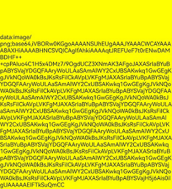

# OffscreenCanvasRenderingContext2D
<!--Kit: ArkUI-->
<!--Subsystem: ArkUI-->
<!--Owner: @camlostshi-->
<!--Designer: @fenglinbailu-->
<!--Tester: @liuli0427-->
<!--Adviser: @Brilliantry_Rui-->
<!-- md-trans-meta sourceCommit=07d05947a90cbd4c215e5174f7648fcf076bc9eb translatedAt=2026-09-01T11:35:56.732Z pushedAt=2026-09-02T11:24:38.005Z -->

Use **OffscreenCanvasRenderingContext2D** to draw shapes, images, and text offscreen onto a canvas. Offscreen drawing is a process where content to draw is first drawn into a buffer, then converted into an image, and finally drawn onto the canvas at once. Offscreen drawing uses the CPU for rendering, which is relatively slow. Therefore, avoid using offscreen drawing in scenarios that require high rendering speed.

>  **NOTE**
>
>  * The initial APIs of this module are supported since API version 8. Newly added APIs will be marked with a superscript to indicate their earliest API version.
>
>  * **OffscreenCanvasRenderingContext2D** cannot be used in **ServiceExtensionAbility**. In **ServiceExtensionAbility**, you are advised to use the [drawing module](../../apis-arkgraphics2d/arkts-apis-graphics-drawing.md) for offscreen drawing.
>
>  * The [beginPath](./ts-components-canvas-common-method.md#beginpath), [moveTo](./ts-components-canvas-common-method.md#moveto), [lineTo](./ts-components-canvas-common-method.md#lineto), [closePath](./ts-components-canvas-common-method.md#closepath), [bezierCurveTo](./ts-components-canvas-common-method.md#beziercurveto), [quadraticCurveTo](./ts-components-canvas-common-method.md#quadraticcurveto), [arc](./ts-components-canvas-common-method.md#arc), [arcTo](./ts-components-canvas-common-method.md#arcto), [ellipse](./ts-components-canvas-common-method.md#ellipse), [rect](./ts-components-canvas-common-method.md#rect), and [roundRect](./ts-components-canvas-common-method.md#roundrect20) APIs take effect only on the path in **OffscreenCanvasRenderingContext2D**, and cannot take effect on the path set in [CanvasRenderingContext2D](./ts-canvasrenderingcontext2d.md) and [Path2D](./ts-components-canvas-path2d.md) objects.
>
> * The [common canvas drawing methods](./ts-components-canvas-common-method.md) and [common canvas drawing properties](./ts-components-canvas-common-property.md) are supported.

## constructor

constructor(width: number, height: number, settings?: RenderingContextSettings)

Creates an offscreen canvas object. You can configure the canvas width, canvas height, and parameters of the **OffscreenCanvasRenderingContext2D** object.

**Widget capability**: This API can be used in ArkTS widgets since API version 9.

**Atomic service API**: This API can be used in atomic services since API version 11.

**System capability**: SystemCapability.ArkUI.ArkUI.Full

**Parameters**

| Name     | Type     | Mandatory  | Description|
| -------- | ---------------------------------------- | ---- | ------------------------------ |
| width    | number                                   | Yes   | Width of the offscreen canvas. The default unit is vp.<br>Invalid values **NaN** and **Infinity** are treated as invalid.|
| height   | number                                   | Yes   | Height of the offscreen canvas. The default unit is vp.<br>Invalid values **NaN** and **Infinity** are treated as invalid.|
| settings | [RenderingContextSettings](ts-canvasrenderingcontext2d.md#renderingcontextsettings) | No | Used to configure the parameters of the **OffscreenCanvasRenderingContext2D** object. Pass this parameter when advanced configurations such as antialiasing need to be enabled. See the description of the **RenderingContextSettings** API.<br>The exception value **undefined** is handled as the default value of [RenderingContextSettings](ts-canvasrenderingcontext2d.md#renderingcontextsettings).<br>Default value: **null** |

## constructor<sup>12+</sup>

constructor(width: number, height: number, settings?: RenderingContextSettings, unit?: LengthMetricsUnit)

Creates an offscreen canvas object. You can configure the canvas width, canvas height, and parameters and their unit of the **OffscreenCanvasRenderingContext2D** object.

**Widget capability**: This API can be used in ArkTS widgets since API version 12.

**Atomic service API**: This API can be used in atomic services since API version 12.

**Model restriction**: This API can be used only in the stage model.

**System capability**: SystemCapability.ArkUI.ArkUI.Full

**Parameters**

| Name      | Type      | Mandatory   | Description |
| -------- | ---------------------------------------- | ---- | ------------------------------ |
| width    | number                                   | Yes    | Width of the offscreen canvas, in vp by default.<br>The exception values NaN and Infinity are handled as invalid values. |
| height   | number                                   | Yes    | Height of the offscreen canvas, in vp by default.<br>The exception values NaN and Infinity are handled as invalid values. |
| settings | [RenderingContextSettings](ts-canvasrenderingcontext2d.md#renderingcontextsettings) | No    | Parameters used to configure the **OffscreenCanvasRenderingContext2D** object. Pass this parameter when advanced configurations such as antialiasing need to be enabled. For details, see the description of **RenderingContextSettings**.<br>The exception value **undefined** is handled as the default value of [RenderingContextSettings](ts-canvasrenderingcontext2d.md#renderingcontextsettings).<br>Default value: **null** |
| unit | [LengthMetricsUnit](../js-apis-arkui-graphics.md#lengthmetricsunit12) | No | Used to configure the unit mode of the **OffscreenCanvasRenderingContext2D** object. **DEFAULT** (default vp unit, suitable for most scenarios) and PX (px pixel unit, suitable for scenarios that require precise pixel control). Once configured, it cannot be changed dynamically. The configuration method is the same as that of [CanvasRenderingContext2D](ts-canvasrenderingcontext2d.md).<br>The exception values **undefined**, **NaN**, and **Infinity** are handled as default values.<br>Default value: **DEFAULT** |

## toDataURL

toDataURL(type?: string, quality?: any): string

Creates a Data URL that contains a representation of an image. This API involves time-consuming memory copy. Therefore, avoid frequent calls to it.

**Widget capability**: This API can be used in ArkTS widgets since API version 9.

**Atomic service API**: This API can be used in atomic services since API version 11.

**System capability**: SystemCapability.ArkUI.ArkUI.Full

**Parameters**

| Name    | Type  | Mandatory  | Description                                      |
| ------- | ------ | ---- | ---------------------------------------- |
| type    | string | No  | Used to specify the image format.<br>Optional values: "image/png", "image/jpeg", and "image/webp".<br>The exception values **undefined** and **null** are handled as the default value.<br>Default value: **image/png** |
| quality | any | No  | When the image format is image/jpeg or image/webp, selects the image quality in the range [0, 1]. If the value is out of range, the default value **0.92** is used.<br>The exception values **undefined**, **null**, **NaN**, and **Infinity** are handled as the default value.<br>Default value: **0.92** |

**Return value**

| Type    | Description       |
| ------ | --------- |
| string | Image URL.|

**Example**

  ```ts
  // xxx.ets
  @Entry
  @Component
  struct ToDataURL {
    private settings: RenderingContextSettings = new RenderingContextSettings(true);
    private context: CanvasRenderingContext2D = new CanvasRenderingContext2D(this.settings);
    private offCanvas: OffscreenCanvas = new OffscreenCanvas(100, 100);
    @State dataURL: string = "";

    build() {
      Flex({ direction: FlexDirection.Column, alignItems: ItemAlign.Center, justifyContent: FlexAlign.Center }) {
        Canvas(this.context)
          .width(100)
          .height(100)
          .onReady(() => {
            let offContext = this.offCanvas.getContext("2d", this.settings)
            offContext.fillRect(0, 0, 100, 100)
            this.dataURL = offContext.toDataURL()
          })
        Text(this.dataURL)
      }
      .width('100%')
      .height('100%')
      .backgroundColor('#ffff00')
    }
  }
  ```


## transferToImageBitmap

transferToImageBitmap(): ImageBitmap

Creates an **ImageBitmap** object from the most recently rendered image of the offscreen canvas.

**Widget capability**: This API can be used in ArkTS widgets since API version 9.

**Atomic service API**: This API can be used in atomic services since API version 11.

**System capability**: SystemCapability.ArkUI.ArkUI.Full

**Return value**

| Type                                      | Description             |
| ---------------------------------------- | --------------- |
| [ImageBitmap](ts-components-canvas-imagebitmap.md) | Pixel data rendered on the offscreen canvas.|


 **Example**

  ```ts
  // xxx.ets
  @Entry
  @Component
  struct PutImageData {
    private settings: RenderingContextSettings = new RenderingContextSettings(true);
    private context: CanvasRenderingContext2D = new CanvasRenderingContext2D(this.settings);
    private offCanvas: OffscreenCanvas = new OffscreenCanvas(600, 600);

    build() {
      Flex({ direction: FlexDirection.Column, alignItems: ItemAlign.Center, justifyContent: FlexAlign.Center }) {
        Canvas(this.context)
          .width('100%')
          .height('100%')
          .backgroundColor('rgb(213,213,213)')
          .onReady(() => {
            let offContext = this.offCanvas.getContext("2d", this.settings)
            let imageData = offContext.createImageData(100, 100)
            for (let i = 0; i < imageData.data.length; i += 4) {
              imageData.data[i + 0] = 112
              imageData.data[i + 1] = 112
              imageData.data[i + 2] = 112
              imageData.data[i + 3] = 255
            }
            offContext.putImageData(imageData, 10, 10)
            let image = this.offCanvas.transferToImageBitmap()
            this.context.transferFromImageBitmap(image)
          })
      }
      .width('100%')
      .height('100%')
    }
  }
  ```
 

