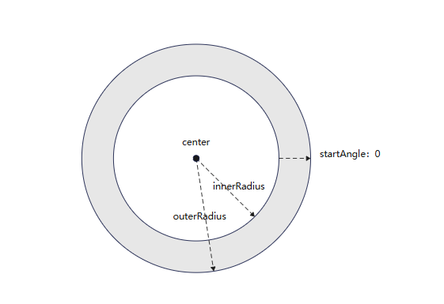
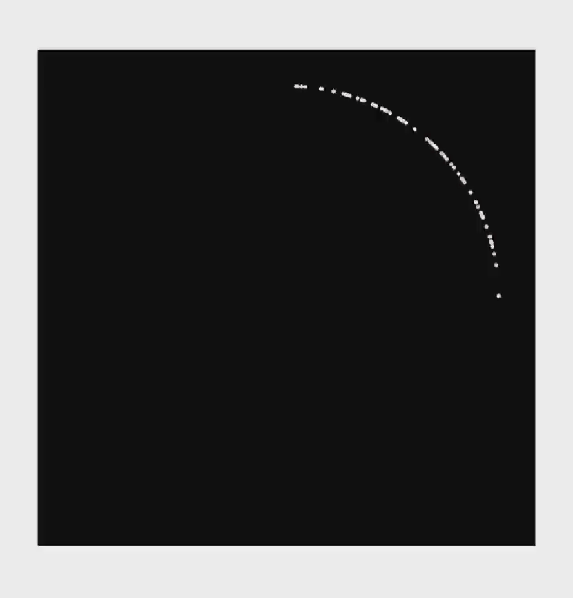

# Particle Animation (Particle)
<!--Kit: ArkUI-->
<!--Subsystem: ArkUI-->
<!--Owner: @CCFFWW-->
<!--Designer: @CCFFWW-->
<!--Tester: @lxl007-->
<!--Adviser: @Brilliantry_Rui-->

Particle animation is an animation composed of a multitude of particles randomly generated within a certain range. The particles can be points or images. By animating different aspects of the particles, such as color, opacity, scale, velocity, acceleration, and spin angle, you can create engaging and dynamic aesthetics. For example, you can create an impressive snowfall animation by animating the particles – snowflakes.

The component used for producing particle animations is **Particle**.


>  **NOTE**
>
> - This component is supported since API version 10. Updates will be marked with a superscript to indicate their earliest API version.
>
> - If the screen is turned off and then turned on again, or the application is switched to the background and then brought back to the foreground, the particle animation will automatically pause.


## Child Components

Not supported


## APIs

```typescript
interface ParticleInterface {
  <
    PARTICLE extends ParticleType,
    COLOR_UPDATER extends ParticleUpdater,
    OPACITY_UPDATER extends ParticleUpdater,
    SCALE_UPDATER extends ParticleUpdater,
    ACC_SPEED_UPDATER extends ParticleUpdater,
    ACC_ANGLE_UPDATER extends ParticleUpdater,
    SPIN_UPDATER extends ParticleUpdater
  >(particles: Particles<
      PARTICLE,
      COLOR_UPDATER,
      OPACITY_UPDATER,
      SCALE_UPDATER,
      ACC_SPEED_UPDATER,
      ACC_ANGLE_UPDATER,
      SPIN_UPDATER
    >): ParticleAttribute;
}
```

**Atomic service API**: This API can be used in atomic services since API version 11.

**System capability**: SystemCapability.ArkUI.ArkUI.Full

**Parameters**

| Name| Type| Read-Only| Optional| Description|
| -------- | -------- | ---- | ---- | -------- |
| particles | [Particles](#particles18)<<br>&nbsp;&nbsp;[PARTICLE](#particletype), <br>&nbsp;&nbsp;[COLOR_UPDATER](#particleupdater),<br>&nbsp;&nbsp;[OPACITY_UPDATER](#particleupdater),<br>&nbsp;&nbsp;[SCALE_UPDATER](#particleupdater),<br>&nbsp;&nbsp;[ACC_SPEED_UPDATER](#particleupdater),<br>&nbsp;&nbsp;[ACC_ANGLE_UPDATER](#particleupdater),<br>&nbsp;&nbsp;[SPIN_UPDATER](#particleupdater)<br>><br>| No| No| Particles. For details, see [Particles](#particles18).|

## Attributes

In addition to the [universal attributes](ts-component-general-attributes.md), the following attributes are supported.

### disturbanceFields<sup>12+</sup>

disturbanceFields(fields: Array&lt;DisturbanceFieldOptions&gt;)

Sets the disturbance fields.

**Atomic service API**: This API can be used in atomic services since API version 12.

**System capability**: SystemCapability.ArkUI.ArkUI.Full

**Parameters**

| Name| Type   | Mandatory| Description                        |
| ------ | ------- | ---- | ---------------------------- |
| fields  | Array<[DisturbanceFieldOptions](#disturbancefieldoptions12)> | Yes  | Array of disturbance fields.|

### emitter<sup>12+</sup>
emitter(value: Array&lt;EmitterProperty&gt;)

Sets the emitter parameters.

**Atomic service API**: This API can be used in atomic services since API version 12.

**System capability**: SystemCapability.ArkUI.ArkUI.Full

**Parameters**

| Name| Type   | Mandatory| Description                        |
| ------ | ------- | ---- | ---------------------------- |
| value  | Array<[EmitterProperty](#emitterproperty12)> | Yes  | Array of emitter parameters to set.|

### rippleFields<sup>22+</sup>
rippleFields(fields: Array&lt;RippleFieldOptions&gt;\|undefined)

Sets the particle wave field. The wave field applies a force that changes according to the waveform to particles within the affected range, producing an effect similar to the spreading of ripples.

**Atomic service API**: This API can be used in atomic services since API version 22.

**System capability**: SystemCapability.ArkUI.ArkUI.Full

**Parameters**

| Name| Type   | Mandatory| Description                        |
| ------ | ------- | ---- | ---------------------------- |
| fields  | Array<[RippleFieldOptions](#ripplefieldoptions22)>\|undefined | Yes  | Particle wave field array. You can set multiple particle wave fields in array form. If this parameter is set to undefined, no wave field is available.|

### velocityFields<sup>22+</sup>
velocityFields(fields: Array&lt;VelocityFieldOptions&gt;\|undefined)

Sets the particle velocity field. The velocity field applies a force to particles within the affected range, so that the particles move at the velocity specified by the velocity field in addition to their original velocity.

**Atomic service API**: This API can be used in atomic services since API version 22.

**System capability**: SystemCapability.ArkUI.ArkUI.Full

**Parameters**

| Name| Type   | Mandatory| Description                        |
| ------ | ------- | ---- | ---------------------------- |
| fields  | Array<[VelocityFieldOptions](#velocityfieldoptions22)>\|undefined | Yes  | Particle velocity field array. You can set multiple particle velocity fields in array form. If this parameter is set to undefined, there is no velocity field.|

## Events
The [universal events](ts-component-general-events.md) are supported.

## ParticleOptions

```typescript
interface ParticleOptions<
  PARTICLE extends ParticleType,
  COLOR_UPDATER extends ParticleUpdater,
  OPACITY_UPDATER extends ParticleUpdater,
  SCALE_UPDATER extends ParticleUpdater,
  ACC_SPEED_UPDATER extends ParticleUpdater,
  ACC_ANGLE_UPDATER extends ParticleUpdater,
  SPIN_UPDATER extends ParticleUpdater
> {
  emitter: EmitterOptions<PARTICLE>;
  color?: ParticleColorPropertyOptions<COLOR_UPDATER>;
  opacity?: ParticlePropertyOptions<number, OPACITY_UPDATER>;
  scale?: ParticlePropertyOptions<number, SCALE_UPDATER>;
  velocity?: VelocityOptions;
  acceleration?: AccelerationOptions<ACC_SPEED_UPDATER, ACC_ANGLE_UPDATER>;
  spin?: ParticlePropertyOptions<number, SPIN_UPDATER>;
}
```

Sets particle parameters.

**Atomic service API**: This API can be used in atomic services since API version 11.

**System capability**: SystemCapability.ArkUI.ArkUI.Full

| Name| Type| Read-Only| Optional| Description|
| -------- | -------- | ---- | ---- | -------- |
| emitter | [EmitterOptions](#emitteroptions)<[PARTICLE](#particletype)> | No| No| Particle emitter.|
| color | [ParticleColorPropertyOptions](#particlecolorpropertyoptions)<[COLOR_UPDATER](#particleupdater)> | No| Yes| Particle color.<br>**NOTE**<br>Default value: **{ range:[Color.White,Color.White] }.** Colors cannot be set for image particles.|
| opacity | [ParticlePropertyOptions](#particlepropertyoptions)\<number, [OPACITY_UPDATER](#particleupdater)> | No| Yes| Particle opacity.<br>Default value: **{ range:[1.0,1.0] }**|
| scale | [ParticlePropertyOptions](#particlepropertyoptions)\<number, [SCALE_UPDATER](#particleupdater)> | No| Yes| Particle scale.<br>Default value: **{ range:[1.0,1.0] }**|
| velocity | [VelocityOptions](#velocityoptions18) |No| Yes| Particle velocity.<br>**NOTE**<br>**speed** indicates the time rate at which the particle moves. **angle** indicates the direction (in angles) in which the particle moves, with the geometric center of the element as the coordinate origin and the horizontal direction as the x-axis. A positive number indicates clockwise rotation.<br>Default value: **{speed: [0.0,0.0],angle: [0.0,0.0] }**|
| acceleration | [AccelerationOptions](#accelerationoptions18)<[ACC_SPEED_UPDATER](#particleupdater), [ACC_ANGLE_UPDATER](#particleupdater)> | No| Yes| Particle acceleration.<br>**NOTE**<br>**speed** indicates the acceleration speed, and **angle** indicates the acceleration direction (in angles).<br>Default value: **{ speed:{range:[0.0,0.0]},angle:{range:[0.0,0.0]} }**|
| spin | [ParticlePropertyOptions](#particlepropertyoptions)<number, [SPIN_UPDATER](#particleupdater)> | No| Yes| Particle spin angle.<br>Default value: **{range:[0.0,0.0]}**<br>Direction: A positive number indicates clockwise spinning, and a negative number indicates anticlockwise spinning.|


## EmitterOptions

```typescript
interface EmitterOptions<PARTICLE extends ParticleType> {   
  particle: EmitterParticleOptions<PARTICLE>;
  emitRate?: number;
  shape?: ParticleEmitterShape;
  position?: ParticleTuple<Dimension, Dimension>;
  size?: ParticleTuple<Dimension, Dimension>;
  annulusRegion?: ParticleAnnulusRegion;
}
```

Particle emitter configuration.

**System capability**: SystemCapability.ArkUI.ArkUI.Full

| Name| Type| Read-Only| Optional| Description|
| -------- | -------- | ---- | ---- | -------- |
| particle | [EmitterParticleOptions](#emitterparticleoptions18)<[PARTICLE](#particletype)> | No| No| Particle configuration.<br>- **type**: particle type, which can be **IMAGE** or **POINT**.<br>- **config**: configuration of the particle type.<br>- The value type of **config** is subject to the value of **type**.<br>1. If the type is ParticleType.POINT, the config type is [PointParticleParameters](#pointparticleparameters).<br>2. If the type is ParticleType.IMAGE, the config type is [ImageParticleParameters](#imageparticleparameters).<br>- **count**: number of particles. The value is greater than or equal to -1. The value **-1** indicates that the number of particles is infinite.<br>- **lifetime**: lifetime of a single particle. The default value is **1000** (that is, 1000 ms, 1s). The value is greater than or equal to -1. The value **-1** indicates that the lifetime of the particle is infinite. If the value specified is less than **-1**, the default value is used.<br>Note: If you do not want the animation to keep playing, you are advised not to set the lifetime to –1, which may greatly affect the performance.<br>The **lifeTimeRange** parameter indicates the range of the particle lifetime. After this parameter is set, the lifetime of a particle is a random integer within the range of [lifetime – lifeTimeRange, lifetime + lifeTimeRange]. The default value of lifeTimeRange is 0. The value ranges from 0 to positive infinity. If it is set to a negative value, the default value is used.<br>**Atomic service API**: This API can be used in atomic services since API version 11.|
| emitRate | number | No| Yes| Emit rate (that is, the number of particles emitted per second).<br> Default value: **5**. If the value specified is less than 0, the default value is used.<br> The **emitRate** value can significantly impact performance when it exceeds 5000; you are advised to set it to be less than 5000.<br>**Atomic service API**: This API can be used in atomic services since API version 11.|
| shape | [ParticleEmitterShape](#particleemittershape) | No| Yes| Emitter shape.<br><br>Default value: ParticleEmitterShape.RECTANGLE<br>**Atomic service API**: This API can be used in atomic services since API version 11.|
| position | [ParticleTuple](#particletuple18)<[Dimension](ts-types.md#dimension10), [Dimension](ts-types.md#dimension10)> | No| Yes| Emitter position (distance from the upper left corner of the component). The first parameter indicates the relative offset along the x-axis, and the second parameter indicates the relative offset along the y-axis.<br>Default value: **[0.0, 0.0]**<br>**Atomic service API**: This API can be used in atomic services since API version 11.|
| size |  [ParticleTuple](#particletuple18)<[Dimension](ts-types.md#dimension10), [Dimension](ts-types.md#dimension10)>     |No| Yes| Size of the emit window. The first parameter indicates the emitter width, and the second parameter indicates the emitter height.<br>Default value: **['100%','100%']** (that is, the emission window occupies the entire Particle component.)<br>**Atomic service API**: This API can be used in atomic services since API version 11.|
| annulusRegion<sup>20+</sup>  | [ParticleAnnulusRegion](ts-particle-animation.md#particleannulusregion20)| No| Yes |Annulus emitter parameters. This parameter takes effect only when the emitter shape is annulus (that is, the shape parameter is ParticleEmitterShape.ANNULUS). For an annulus emitter, the shape information must be specified by the annulusRegion parameter, and the position and size parameters do not take effect.<br>**Atomic service API**: This API can be used in atomic services since API version 20.|

## ParticleConfigs

Sets particle configuration items.

**Atomic service API**: This API can be used in atomic services since API version 11.

**System capability**: SystemCapability.ArkUI.ArkUI.Full

| Name  | Type  | Read-Only| Optional| Description|
| -------- | -------- | ------ | -------- | -------- |
| [ParticleType.POINT]      | [PointParticleParameters](#pointparticleparameters) | No| No   | Point particle configuration.|
| [ParticleType.IMAGE]      | [ImageParticleParameters](#imageparticleparameters) | No| No   | Image particle configuration.|

## PointParticleParameters

Sets the radius of a particle.

**Atomic service API**: This API can be used in atomic services since API version 11.

**System capability**: SystemCapability.ArkUI.ArkUI.Full

| Name  | Type  | Read-Only| Optional| Description|
| -------- | ------- | ------- | -------- | -------- |
| radius      | [VP](ts-types.md#vp10)| No| No   | Particle radius.|

## ImageParticleParameters

Sets the image options.

**Atomic service API**: This API can be used in atomic services since API version 11.

**System capability**: SystemCapability.ArkUI.ArkUI.Full

| Name  | Type  | Read-Only| Optional| Description|
| -------- | ------- | ------- | -------- | -------- |
| src      | [ResourceStr](ts-types.md#resourcestr) | No| No   | Path to the image. Local and online sources are supported. For details about how to reference an image, see [Loading Image Resources](../../../ui/arkts-graphics-display.md#loading-image-resources).<br>SVG images are not supported.<br>If the value of src does not change, the cached resource is preferentially used. As a result, resources cannot be dynamically switched. If you want to dynamically switch resources, you are advised to switch to different src values.|
| size     | [ParticleTuple](#particletuple18)<[Dimension](ts-types.md#dimension10), [Dimension](ts-types.md#dimension10)> | No| No   | Image size.|
| objectFit| [ImageFit](ts-appendix-enums.md#imagefit)| No| Yes  | Image display mode.|

## ParticleColorPropertyOptions

```typescript
interface ParticleColorPropertyOptions<UPDATER extends ParticleUpdater> {
  range: ParticleTuple<ResourceColor, ResourceColor>; 
  distributionType?: DistributionType;
  updater?: ParticleColorUpdaterOptions<UPDATER>;
}
```

Sets the particle color attribute updater configuration.

**System capability**: SystemCapability.ArkUI.ArkUI.Full

| Name| Type| Read-Only| Optional| Description|
| -------- | -------- | ---- | ---- | -------- |
| range | [ParticleTuple](#particletuple18)<[ResourceColor](ts-types.md#resourcecolor), [ResourceColor](ts-types.md#resourcecolor)> | No| No| Initial color range of the particle. The initial color of particles generated by the particle emitter is randomly selected in this range.<br>Default value: range:[Color.White,Color.White]<br>**Atomic service API**: This API can be used in atomic services since API version 11.|
| distributionType<sup>12+<sup> | [DistributionType](#distributiontype12) | No| Yes| Type of random value distribution for the initial color of the particle. Both uniform distribution and normal (Gaussian) distribution are supported.<br>Default value: **DistributionType.UNIFORM**<br>**Atomic service API**: This API can be used in atomic services since API version 12.|
| updater | [ParticleColorUpdaterOptions](#particlecolorupdateroptions18)<[UPDATER](#particleupdater)> | No| Yes| How the color property is updated. The available options of **type** are as follows:<br>1. **ParticleUpdater.NONE**: The property does not change. In this case, the **config** type is [ParticleColorPropertyUpdaterConfigs](#particlecolorpropertyupdaterconfigs)[ParticleUpdater.NONE].<br>2. **ParticleUpdater.RANDOM**: The property changes randomly. In this case, the **config** type is [ParticleColorPropertyUpdaterConfigs](#particlecolorpropertyupdaterconfigs)[ParticleUpdater.RANDOM].<br>3. **ParticleUpdater.CURVE**: The property changes with the animation curve. In this case, the **config** type is [ParticleColorPropertyUpdaterConfigs](#particlecolorpropertyupdaterconfigs)[ParticleUpdater.CURVE].<br>The default value of **type** is **ParticleUpdater.NONE**.<br>**NOTE**<br>When **type** is set to **ParticleUpdater.RANDOM** or **ParticleUpdater.CURVE**, the color configuration in **updater** has higher priority than that in **range**. During the animation time period configured in **updater**, the color configuration from **updater** is used. Outside of the animation time period configured in **updater**, the color configuration from **range** is used.<br>**Atomic service API**: This API can be used in atomic services since API version 11.|


## ParticleColorPropertyUpdaterConfigs

Sets the configuration of the particle color attribute updater.

**Atomic service API**: This API can be used in atomic services since API version 11.

**System capability**: SystemCapability.ArkUI.ArkUI.Full

| Name| Type| Read-Only| Optional| Description|
| -------- | -------- | ---- | ---- | -------- |
|[ParticleUpdater.NONE]|void | No| No| The color does not change.|
| [ParticleUpdater.RANDOM] | [ParticleColorOptions](#particlecoloroptions18) | No| No| The color changes randomly, with the per-second change difference being a value randomly generated from the range. The target color is obtained by applying the change difference to the current color value of each of the R, G, B, A channels.  |
| [ParticleUpdater.CURVE]|Array<[ParticlePropertyAnimation](#particlepropertyanimation)\<[ResourceColor](ts-types.md#resourcecolor)\>> | No| No| The color changes with the animation curve. The array type indicates that multiple animation segments can be set for the current property, for example, 0–3000 ms, 3000–5000 ms, and 5000–8000 ms.|

## ParticlePropertyOptions
```typescript
interface ParticlePropertyOptions<TYPE, UPDATER extends ParticleUpdater> {
  range: ParticleTuple<TYPE, TYPE>;
  updater?: ParticleUpdaterOptions<TYPE, UPDATER>;
}
```

Sets particle attributes.

**Atomic service API**: This API can be used in atomic services since API version 11.

**System capability**: SystemCapability.ArkUI.ArkUI.Full

| Name| Type| Read-Only| Optional| Description|
| -------- | -------- | ---- | ---- | -------- |
| range | [ParticleTuple](#particletuple18)<[TYPE](#particleupdater), [TYPE](#particleupdater)> | No| No| Initial property value range of the particle. The initial property value of particles generated by the particle emitter is randomly selected in this range.<br>**NOTE**<br>If a property is set to an invalid value, the default value will be used. If the maximum value is less than the minimum value, the default range will be used. **TYPE** is number.<br>The default value varies by property:<br>1. **opacity** property: **range:[1.0,1.0]**; the value range is [0, 1]; the default value is **1.0**.<br>2. **scale** property: **range:[1.0,1.0]**; the value range is [0, 10000]; the default value is **1.0**.<br>3. **acceleration** speed property: **range:[0.0,0.0]**; the value range is [0, 10000]; the default value is **0.0**.<br>4. **acceleration** angle property: **range:[0.0,0.0]**; the value range is [-10000, 10000]; the default value is **0.0**.<br>5. **spin** speed property: **range:[0.0,0.0]**; the value range is [-10000, 10000]; the default value is **0.0**.|
| updater | [ParticleUpdaterOptions](#particleupdateroptions18)<[TYPE](#particleupdater), [UPDATER](#particleupdater)> | No| Yes| How the property is updated. The available options of **type** are as follows:<br>1. **ParticleUpdater.NONE**: The property does not change. In this case, the **config** type is [ParticlePropertyUpdaterConfigs](#particlepropertyupdaterconfigs)[ParticleUpdater.NONE].<br>2. **ParticleUpdater.RANDOM**: The property changes randomly. In this case, the **config** type is [ParticlePropertyUpdaterConfigs](#particlepropertyupdaterconfigs)[ParticleUpdater.RANDOM].<br>3. **ParticleUpdater.CURVE**: The property changes with the animation curve. In this case, the **config** type is [ParticlePropertyUpdaterConfigs](#particlepropertyupdaterconfigs)[ParticleUpdater.CURVE].<br>The default value of **type** is **ParticleUpdater.NONE**.|


## ParticlePropertyUpdaterConfigs
```typescript
interface ParticlePropertyUpdaterConfigs<T> {
    [ParticleUpdater.NONE]: void;
    [ParticleUpdater.RANDOM]: ParticleTuple<T, T>;
    [ParticleUpdater.CURVE]: Array<ParticlePropertyAnimation<T>>;
}
```

Sets the particle property updater configuration.

**Atomic service API**: This API can be used in atomic services since API version 11.

**System capability**: SystemCapability.ArkUI.ArkUI.Full

| Name| Type| Read-Only| Optional| Description|
| -------- | -------- | ---- | ---- | -------- |
| [ParticleUpdater.NONE]|void | No| No| The color does not change.|
| [ParticleUpdater.RANDOM] | [ParticleTuple](#particletuple18)<T, T> | No| No| The property changes randomly, with the per-second change difference being a value randomly generated from the range.<br>The target property value is obtained by applying the change difference to the current property value. For example, if the current property value is **0.2** and **config** is set to **[0.1,1.0]**, then:<br>1. When the random change difference is 0.5, the target property value is 0.2 + 0.5 = 0.7.<br>2. The change difference may also be a negative value. For example, if the current property value is **0.2** and **config** is set to **[-3.0,2.0]**, then when the random change difference is **-2.0**, the target property value is 0.2 - 2.0 = -1.8.<br>**NOTE**<br>**config** sets the value range of the change difference. While the change difference does not have a maximum or minimum value limit, the target property value does. Therefore, if the target property value is greater than the maximum property value, the maximum property value will be used instead; if the target property value is less than the minimum property value, the minimum property value will be used instead. **T** represents a number.<br>For example, if the value range of **opacity** is **[0.0, 1.0]**, then if the target property value is greater than 1.0, **1.0** will be used instead.|
|[ParticleUpdater.CURVE]|Array<[ParticlePropertyAnimation](#particlepropertyanimation)\<T\>> | No| No| The property changes with the animation curve. The array type indicates that multiple animation segments can be set for the current property, for example, 0-3000 ms, 3000-5000 ms, and 5000-8000 ms. **T** represents a number.|

## ParticlePropertyAnimation
```typescript
interface ParticlePropertyAnimation<T> {
  from: T;
  to: T;
  startMillis: number;
  endMillis: number;
  curve?: Curve | ICurve;
}
```

Lifecycle of a particle attribute.

**Atomic service API**: This API can be used in atomic services since API version 11.

**System capability**: SystemCapability.ArkUI.ArkUI.Full

| Name| Type| Read-Only| Optional| Description|
| -------- | ---- | ---- | -------- | -------- |
|from| T | No| No| Initial value of the property. If the value is invalid, the default value will be used.|
| to | T | No| No| Target value of the property. If the value is invalid, the default value will be used.|
|startMillis|number | No| No| Start time of the animation.<br>Unit: ms.<br>Value range: [0, +∞).|
|endMillis|number | No| No| End time of the animation.<br>Unit: ms.<br>Value range: [0, +∞).|
|curve|[Curve](ts-appendix-enums.md#curve)&nbsp;\|&nbsp;[ICurve](../js-apis-curve.md#icurve9)| No| Yes| Animation curve.<br>Default value: **Curve.Linear**|


## ParticleType

Particle type.

**Atomic service API**: This API can be used in atomic services since API version 11.

**System capability**: SystemCapability.ArkUI.ArkUI.Full

| Name |  Value | Description|
| -------- | -------- | -------- | 
| POINT | 'point' | Point particle.|
| IMAGE | 'image' | Image particle.|


## ParticleEmitterShape

Particle emitter shape.

**System capability**: SystemCapability.ArkUI.ArkUI.Full

| Name |  Value | Description|
| -------- | -------- | -------- | 
| RECTANGLE | 'rectangle' | Rectangle.<br> **Atomic service API**: This API can be used in atomic services since API version 11.|
| CIRCLE | 'circle' | Circle.<br> **Atomic service API**: This API can be used in atomic services since API version 11.|
| ELLIPSE | 'ellipse' | Ellipse.<br> **Atomic service API**: This API can be used in atomic services since API version 11.|
| ANNULUS<sup>20+</sup> | 'annulus' | Ring.<br> **Atomic service API**: This API can be used in atomic services since API version 20.|

## DistributionType<sup>12+<sup>

Random distribution of the initial color.

**Atomic service API**: This API can be used in atomic services since API version 12.

**System capability**: SystemCapability.ArkUI.ArkUI.Full

| Name |  Value | Description|
| -------- | -------- | -------- | 
| UNIFORM | 0 | The initial color random values are distributed uniformly.|
| GAUSSIAN | 1 | The initial color random values are distributed according to a Gaussian distribution.|

## ParticleUpdater

Particle change type.

**Atomic service API**: This API can be used in atomic services since API version 11.

**System capability**: SystemCapability.ArkUI.ArkUI.Full

| Name |  Value | Description|
| -------- | -------- | -------- | 
|NONE | 'none' | No change.|
|RANDOM | 'random' | Random change.|
|CURVE | 'curve' | Change with the animation curve.|

## DisturbanceFieldOptions<sup>12+</sup>

Sets the parameters of the disturbance field.

**Atomic service API**: This API can be used in atomic services since API version 12.

**System capability**: SystemCapability.ArkUI.ArkUI.Full

| Name| Type   | Read-Only| Optional| Description                        |
| ------ | ------- | ---- | ------- | --------------------- |
| strength  | number | No| Yes  |Field strength, which indicates the intensity of the repulsive force from the center outward. The default value is **0**. Positive values indicate a repulsive force directed outward, while negative values indicate an attractive force directed inward.<br>Value range: (-∞, +∞).|
| shape  |   [DisturbanceFieldShape](#disturbancefieldshape12) | No| Yes  | Shape of the field.<br>Default value: **DisturbanceFieldShape.RECT**|
| size  | [SizeT](../js-apis-arkui-graphics.md#sizett12)&lt;number&gt;| No| Yes |Size of the field.<br>Default value: {width:0, height:0}.<br>Value range of **width** and **height**: [0, +∞).|
| position  | [PositionT](../js-apis-arkui-graphics.md#positiont12)&lt;number&gt; | No| Yes  |Position of the field.<br>Default value: {x:0, y:0}.<br>Value range of **x** and **y**: (-∞, +∞).|
| feather  | number | No| Yes  |Feather value, which represents the degree of attenuation from the center of the field to its edges. The value is an integer ranging from 0 to 100. A value of 0 indicates that the field is rigid, and all particles within its range are repelled. The higher the feather value, the more gradual the field becomes, resulting in more particles close to the center point appearing within the field's range.<br>Default value: **0**.|
| noiseScale  | number | No| Yes  |Noise scale, used to control the overall size of the noise pattern. The value is greater than or equal to 0.<br>Default value: **1**.|
| noiseFrequency  | number | No| Yes  |Noise frequency. The higher the frequency, the finer the noise. The value is greater than or equal to 0.<br> Default value: **1**.|
| noiseAmplitude  | number | No| Yes  |Noise amplitude, which indicates the range of noise fluctuations. The greater the amplitude, the greater the difference between the noises. The value is greater than or equal to 0.<br> Default value: **1**.|

## DisturbanceFieldShape<sup>12+</sup>

Particle shape.

**Atomic service API**: This API can be used in atomic services since API version 12.

**System capability**: SystemCapability.ArkUI.ArkUI.Full

| Name   | Value   | Description  |
| --------| ---- | ------|
| RECT    | 0 | Rectangle.  |
| CIRCLE  | 1 | Circle.      |
| ELLIPSE | 2 | Ellipse.    |

## EmitterProperty<sup>12+</sup>

Sets the emitter attributes.

**System capability**: SystemCapability.ArkUI.ArkUI.Full

| Name| Type   | Read-Only| Optional| Description                        |
| ------ | ------- | ---- | ------- | --------------------- |
| index   | number | No| No  |Index of the emitter based on the index array of the emitters in the initialization parameters. The value is rounded to the nearest whole number. The default value **0** is used in case of exceptions.<br>**Atomic service API**: This API can be used in atomic services since API version 12.|
| emitRate  | number  | No| Yes  | Emit rate, that is, the number of particles emitted per second.<br>If no value is passed in, the current emit rate is retained. If a value less than 0 is passed in, the default value **5** is used. The **emitRate** value can significantly impact performance when it exceeds 5000; you are advised to set it to be less than 5000.<br>**Atomic service API**: This API can be used in atomic services since API version 12.|
| position  | [PositionT](../js-apis-arkui-graphics.md#positiont12)&lt;number&gt; | No| Yes |Array of emitter positions. Only the number type is supported.<br>If no value is passed in, the current emitter position is retained. Two valid values must be passed in; if either is an invalid value, **position** will not take effect.<br>Value range of **x** and **y**: (-∞, +∞).<br>**Atomic service API**: This API can be used in atomic services since API version 12.|
| size  | [SizeT](../js-apis-arkui-graphics.md#sizett12)&lt;number&gt;| No| Yes |Size of the emit window. Only the number type is supported.<br>If no value is passed in, the current emitter window size is retained. Two valid values greater than 0 must be passed in; if either is an invalid value, **size** will not take effect.<br>**Atomic service API**: This API can be used in atomic services since API version 12.|
| annulusRegion<sup>20+</sup>  | [ParticleAnnulusRegion](ts-particle-animation.md#particleannulusregion20)| No| Yes|Ring emitter parameters. The parameters take effect only when the emitter shape corresponding to index is ring.<br>**Atomic service API**: This API can be used in atomic services since API version 20.|

## ParticleTuple<sup>18+</sup>

```typescript
declare type ParticleTuple<T1, T2> = [T1, T2];
```

Defines the tuple type representing a pair of animation parameters.

**Atomic service API**: This API can be used in atomic services since API version 18.

**System capability**: SystemCapability.ArkUI.ArkUI.Full

| Type        | Description                                          |
| ----------- | ---------------------------------------------- |
| [T1, T2]    | A pair of animation parameters, which can be of any type.             |

## Particles<sup>18+</sup>

```typescript
interface Particles<
  PARTICLE extends ParticleType,
  COLOR_UPDATER extends ParticleUpdater,
  OPACITY_UPDATER extends ParticleUpdater,
  SCALE_UPDATER extends ParticleUpdater,
  ACC_SPEED_UPDATER extends ParticleUpdater,
  ACC_ANGLE_UPDATER extends ParticleUpdater,
  SPIN_UPDATER extends ParticleUpdater
> {
  particles: Array<
    ParticleOptions<
      PARTICLE,
      COLOR_UPDATER,
      OPACITY_UPDATER,
      SCALE_UPDATER,
      ACC_SPEED_UPDATER,
      ACC_ANGLE_UPDATER,
      SPIN_UPDATER
    >
  >;
}
```

An array of particle options,

> **NOTE**
>
> To standardize anonymous object definitions, the element definitions here have been revised in API version 18. While historical version information is preserved for anonymous objects, there may be cases where the outer element's @since version number is higher than inner elements'. This does not affect interface usability.

**Atomic service API**: This API can be used in atomic services since API version 18.

**System capability**: SystemCapability.ArkUI.ArkUI.Full

| Name   | Type                          | Read-Only| Optional| Description                                                                                                                    |
| ------ | ------------------------------ | ---- | ------------------------------------------ | ----------------------------------------------------------------------------- |
| particles<sup>10+</sup>  | Array<<br>&nbsp;&nbsp;ParticleOptions<<br>&nbsp;&nbsp;&nbsp;&nbsp;PARTICLE,<br>&nbsp;&nbsp;&nbsp;&nbsp;COLOR_UPDATER,<br>&nbsp;&nbsp;&nbsp;&nbsp;OPACITY_UPDATER,<br>&nbsp;&nbsp;&nbsp;&nbsp;SCALE_UPDATER,<br>&nbsp;&nbsp;&nbsp;&nbsp;ACC_SPEED_UPDATER,<br>&nbsp;&nbsp;&nbsp;&nbsp;ACC_ANGLE_UPDATER,<br>&nbsp;&nbsp;&nbsp;&nbsp;SPIN_UPDATER<br>&nbsp;&nbsp;><br>>  | No| No  | An array of particle options, each of which covers the emitter, color, opacity, scale, velocity, acceleration, and spin speed of particles. For details, see [ParticleOptions](#particleoptions).<br>**Atomic service API**: This API can be used in atomic services since API version 11.|

## VelocityOptions<sup>18+</sup>

Particle velocity.

> **NOTE**
>
> To standardize anonymous object definitions, the element definitions here have been revised in API version 18. While historical version information is preserved for anonymous objects, there may be cases where the outer element's @since version number is higher than inner elements'. This does not affect interface usability.

**Atomic service API**: This API can be used in atomic services since API version 18.

**System capability**: SystemCapability.ArkUI.ArkUI.Full

| Name   | Type                          | Read-Only| Optional| Description                                                                                                                    |
| ------ | ------------------------------ | ---- | ------------------------- | ---------------------------------------------------------------------------------------------- |
| speed<sup>10+</sup>  | [ParticleTuple](#particletuple18)<number, number>  | No| No  | Time rate at which the particle moves.<br>Default value: **{range:[0.0,0.0]}**<br>**Atomic service API**: This API can be used in atomic services since API version 11.                                                                         |
| angle<sup>10+</sup>  | [ParticleTuple](#particletuple18)<number, number>  | No| No  | Direction (in angles) in which the particle moves, with the geometric center of the element as the coordinate origin and the horizontal direction as the x-axis. A positive number indicates clockwise rotation.<br>Default value: **{range:[0.0,0.0]}**<br>**Atomic service API**: This API can be used in atomic services since API version 11.|

## AccelerationOptions<sup>18+</sup>

```typescript
declare interface AccelerationOptions<
  ACC_SPEED_UPDATER extends ParticleUpdater,
  ACC_ANGLE_UPDATER extends ParticleUpdater
> {
  speed?: ParticlePropertyOptions<number, ACC_SPEED_UPDATER>;
  angle?: ParticlePropertyOptions<number, ACC_ANGLE_UPDATER>;
}
```

Particle acceleration.

> **NOTE**
>
> To standardize anonymous object definitions, the element definitions here have been revised in API version 18. While historical version information is preserved for anonymous objects, there may be cases where the outer element's @since version number is higher than inner elements'. This does not affect interface usability.

**Atomic service API**: This API can be used in atomic services since API version 18.

**System capability**: SystemCapability.ArkUI.ArkUI.Full

| Name   | Type                                               | Read-Only| Optional| Description                                                      |
| ------ | --------------------------------------------------- | ---- | ----------- | ---------------------------------------------- |
| speed<sup>10+</sup>  | [ParticlePropertyOptions](#particlepropertyoptions)<number, [ACC_SPEED_UPDATER](#particleupdater)>  | No| Yes  | Acceleration speed.<br>Default value: **{range:[0.0,0.0]}**<br>**Atomic service API**: This API can be used in atomic services since API version 11.       |
| angle<sup>10+</sup>  | [ParticlePropertyOptions](#particlepropertyoptions)<number, [ACC_ANGLE_UPDATER](#particleupdater)>  | No| Yes  | Acceleration direction (in angles).<br>Default value: **{range:[0.0,0.0]}**<br>**Atomic service API**: This API can be used in atomic services since API version 11.|

## EmitterParticleOptions<sup>18+</sup>

```typescript
interface EmitterParticleOptions<PARTICLE extends ParticleType> {
  type: PARTICLE;
  config: ParticleConfigs[PARTICLE];
  count: number;
  lifetime?: number;
  lifetimeRange?: number;
}
```

Particle configuration.

> **NOTE**
>
> To standardize anonymous object definitions, the element definitions here have been revised in API version 18. While historical version information is preserved for anonymous objects, there may be cases where the outer element's @since version number is higher than inner elements'. This does not affect interface usability.

**Atomic service API**: This API can be used in atomic services since API version 18.

**System capability**: SystemCapability.ArkUI.ArkUI.Full

| Name   | Type                                               | Read-Only| Optional| Description                                                      |
| ------ | --------------------------------------------------- | ---- | ----------- | ---------------------------------------------- |
| type<sup>10+</sup>  | [PARTICLE](#particletype)  | No| No  | Particle type, which can be **IMAGE** or **POINT**.<br>**Atomic service API**: This API can be used in atomic services since API version 11.          |
| config<sup>10+</sup>  | [ParticleConfigs](#particleconfigs)[PARTICLE]  | No| No  | Configuration of the particle type.<br>The value type of **config** is subject to the value of **type**.<br>1. If the type is ParticleType.POINT, the config type is [PointParticleParameters](#pointparticleparameters).<br>2. If the type is ParticleType.IMAGE, the config type is [ImageParticleParameters](#imageparticleparameters).<br>**Atomic service API**: This API can be used in atomic services since API version 11.|
| count<sup>10+</sup>  | number  | No| No  | Number of particles. The value is greater than or equal to -1. The value **-1** indicates that the number of particles is infinite.<br>**Atomic service API**: This API can be used in atomic services since API version 11.|
| lifetime<sup>10+</sup>  | number  | No| Yes  | Lifetime of a single particle. The default value is **1000** (that is, 1000 ms, 1s). The value is greater than or equal to -1. The value **-1** indicates that the lifetime of the particle is infinite. If the value specified is less than **-1**, the default value is used.<br>Note: If you do not want the animation to keep playing, you are advised not to set the lifetime to –1, which may greatly affect the performance.<br>**Atomic service API**: This API can be used in atomic services since API version 11.|
| lifetimeRange<sup>12+</sup>  | number  | No| Yes  | Random integer within the range of [lifetime – lifetimeRange, lifetime + lifetimeRange]. After lifetimeRange is set, the particle lifecycle is a random integer within the range. The default value is 0. The value range is from 0 to positive infinity. If it is set to a negative value, the default value is used.<br>**Atomic service API**: This API can be used in atomic services since API version 12.|

## ParticleUpdaterOptions<sup>18+</sup>

```typescript
interface ParticleUpdaterOptions<TYPE, UPDATER extends ParticleUpdater> {
  type: UPDATER;
  config: ParticlePropertyUpdaterConfigs<TYPE>[UPDATER];
}
```

How the color property is updated.

> **NOTE**
>
> To standardize anonymous object definitions, the element definitions here have been revised in API version 18. While historical version information is preserved for anonymous objects, there may be cases where the outer element's @since version number is higher than inner elements'. This does not affect interface usability.

**Atomic service API**: This API can be used in atomic services since API version 18.

**System capability**: SystemCapability.ArkUI.ArkUI.Full

| Name   | Type                                               | Read-Only| Optional| Description                                                      |
| ------ | ----------------------------------- | ---------------- | ---- | --------------------------------------------------------- |
| type<sup>10+</sup>  | [UPDATER](#particleupdater)  | No| No  | Type of property updating.<br>The default value of **type** is **ParticleUpdater.NONE**.    **Atomic service API**: This API can be used in atomic services since API version 11.         |
| config<sup>10+</sup>  | [ParticlePropertyUpdaterConfigs](#particlepropertyupdaterconfigs)<[TYPE](#particleupdater)>[[UPDATER](#particleupdater)] | No| No  | How the property is updated. The available options of **type** are as follows:<br>1. **ParticleUpdater.NONE**: The property does not change. In this case, the **config** type is [ParticlePropertyUpdaterConfigs](#particlepropertyupdaterconfigs)[ParticleUpdater.NONE].<br>2. **ParticleUpdater.RANDOM**: The property changes randomly. In this case, the **config** type is [ParticlePropertyUpdaterConfigs](#particlepropertyupdaterconfigs)[ParticleUpdater.RANDOM].<br>3. **ParticleUpdater.CURVE**: The property changes with the animation curve. In this case, the **config** type is [ParticlePropertyUpdaterConfigs](#particlepropertyupdaterconfigs)[ParticleUpdater.CURVE]. **Atomic service API**: This API can be used in atomic services since API version 11.|

## ParticleColorUpdaterOptions<sup>18+</sup>

```typescript
interface ParticleColorUpdaterOptions<UPDATER extends ParticleUpdater> {
  type: UPDATER;
  config: ParticleColorPropertyUpdaterConfigs[UPDATER];
}
```

How the color property is updated.

> **NOTE**
>
> To standardize anonymous object definitions, the element definitions here have been revised in API version 18. While historical version information is preserved for anonymous objects, there may be cases where the outer element's @since version number is higher than inner elements'. This does not affect interface usability.

**Atomic service API**: This API can be used in atomic services since API version 18.

**System capability**: SystemCapability.ArkUI.ArkUI.Full

| Name   | Type                                               | Read-Only| Optional| Description                                                      |
| ------ | --------------------------------------------------- | ---- | ---------- | ----------------------------------------------- |
| type<sup>10+</sup>  | [UPDATER](#particleupdater)  | No| No  | Type of property updating.<br>The default value of **type** is **ParticleUpdater.NONE**.<br>**Atomic service API**: This API can be used in atomic services since API version 11.        |
| config<sup>10+</sup>  | [ParticleColorPropertyUpdaterConfigs](#particlecolorpropertyupdaterconfigs)[[UPDATER](#particleupdater)]  | No| No  | The available options of **type** are as follows:<br>1. **ParticleUpdater.NONE**: The property does not change. In this case, the **config** type is [ParticleColorPropertyUpdaterConfigs](#particlecolorpropertyupdaterconfigs)[ParticleUpdater.NONE].<br>2. **ParticleUpdater.RANDOM**: The property changes randomly. In this case, the **config** type is [ParticleColorPropertyUpdaterConfigs](#particlecolorpropertyupdaterconfigs)[ParticleUpdater.RANDOM].<br>3. **ParticleUpdater.CURVE**: The property changes with the animation curve. In this case, the **config** type is [ParticleColorPropertyUpdaterConfigs](#particlecolorpropertyupdaterconfigs)[ParticleUpdater.CURVE].<br>**NOTE**<br>When **type** is set to **ParticleUpdater.RANDOM** or **ParticleUpdater.CURVE**, the color configuration in **updater** has higher priority than that in **range**. During the animation period specified by updater, the color changes based on the color configuration in updater. Before the animation period specified by updater, the color changes based on the color configuration in range.<br>**Atomic service API**: This API can be used in atomic services since API version 11.|

## ParticleColorOptions<sup>18+</sup>

The color changes randomly, with the per-second change difference being a value randomly generated from the range. The target color is obtained by applying the change difference to the current color value of each of the R, G, B, A channels.  

> **NOTE**
>
> To standardize anonymous object definitions, the element definitions here have been revised in API version 18. While historical version information is preserved for anonymous objects, there may be cases where the outer element's @since version number is higher than inner elements'. This does not affect interface usability.

**Atomic service API**: This API can be used in atomic services since API version 18.

**System capability**: SystemCapability.ArkUI.ArkUI.Full

| Name | Type                          | Read-Only| Optional| Description                        |
| ---- | ----------------- | ------------- | ---- | --------------------------- |
| r<sup>10+</sup>    | [ParticleTuple](#particletuple18)<number, number>  | No| No  | Difference value for the red color channel.   **Atomic service API**: This API can be used in atomic services since API version 11.        |
| g<sup>10+</sup>    | [ParticleTuple](#particletuple18)<number, number>  | No| No  | Difference value for the green color channel.   **Atomic service API**: This API can be used in atomic services since API version 11.       |
| b<sup>10+</sup>    | [ParticleTuple](#particletuple18)<number, number>  | No| No  | Difference value for the blue color channel.   **Atomic service API**: This API can be used in atomic services since API version 11.       |
| a<sup>10+</sup>    | [ParticleTuple](#particletuple18)<number, number>  | No| No  | Difference value for the alpha (transparency) channel.   **Atomic service API**: This API can be used in atomic services since API version 11.       |

## ParticleAnnulusRegion<sup>20+</sup>

Configures the annular emitter area.

> **NOTE**
>
> - If the value of outerRadius or innerRadius is less than 0 or uses the percentage unit, the value is considered as 0.
>
> - If the value of outerRadius is less than that of innerRadius, the smaller value is used as the new inner radius and the larger value is used as the new outer radius.
>
> - If the value of endAngle is less than that of startAngle, the smaller value is used as the new start angle and the larger value is used as the new end angle.
>
> 


**Atomic service API**: This API can be used in atomic services since API version 20.

**System capability**: SystemCapability.ArkUI.ArkUI.Full

| Name  | Type  | Read-Only| Optional| Description|
| ------ | ------ | -- | -- | ---- |
| center      | [PositionT](../js-apis-arkui-graphics.md#positiont12)&lt;[LengthMetrics](../js-apis-arkui-graphics.md#lengthmetrics12)&gt; | No| Yes | Center coordinates of the ring. The upper left corner of the component is the origin of the coordinates. Default value: {x:LengthMetrics.percent(0.5),y:LengthMetrics.percent(0.5)}  |
| outerRadius      | [LengthMetrics](../js-apis-arkui-graphics.md#lengthmetrics12) | No| No  | Outer radius of the ring.  |
| innerRadius  | [LengthMetrics](../js-apis-arkui-graphics.md#lengthmetrics12) | No| No | Inner radius of the ring.  |
| startAngle | number | No| Yes  | Start angle of the ring.<br>Unit: kWh<br>Default value: **0**. |
| endAngle | number | No| Yes  | End angle of the ring.<br>Unit: kWh<br>Default value: **360** |

## Vector2T\<T><sup>22+</sup>

type Vector2T\<T> = Vector2T\<T>

Defines the Vector2T type. The Vector2T type contains two attribute values: x and y.

**Atomic service API**: This API can be used in atomic services since API version 22.

**System capability**: SystemCapability.ArkUI.ArkUI.Full

| Type                        | Description                               |
| ---------------------------- | ----------------------------------- |
| [Vector2T\<T>](../js-apis-arkui-graphics.md#vector2tt12) | Represents a vector of the T type that contains two values: x and y. x indicates the value in the x-axis direction of the vector. y indicates the value in the y-axis direction of the vector.<br>Unit: vp|


## FieldRegion<sup>22+</sup>

Defines the area information of the particle field.

**Atomic service API**: This API can be used in atomic services since API version 22.

**System capability**: SystemCapability.ArkUI.ArkUI.Full

**Model restriction**: This API can be used only in the stage model.

| Name  | Type  | Read-Only| Optional| Description|
| ------ | ------ | -- | -- | ---- |
| shape      | [DisturbanceFieldShape](#disturbancefieldshape12) | No| Yes | Shape of the particle field.<br>Default value: DisturbanceFieldShape.RECT |
| position      | [PositionT](../js-apis-arkui-graphics.md#positiont12)&lt;number&gt; | No| Yes| Center position of the particle field. The unit of coordinates is vp.<br>Default value: {x:0, y:0} |
| size  | [SizeT](../js-apis-arkui-graphics.md#sizett12)&lt;number&gt; | No| Yes | Size of the particle field. The unit of the value is vp.<br>Default value: {width:0, height:0}<br>The value can be:<br>width: [0, +∞)<br>height: [0, +∞)<br>If the width or height of the size is set to a negative value, the default value of width or height is used. |

## RippleFieldOptions<sup>22+</sup>

Parameter that describes the information about a particle disturbance field.

**Atomic service API**: This API can be used in atomic services since API version 22.

**System capability**: SystemCapability.ArkUI.ArkUI.Full

**Model restriction**: This API can be used only in the stage model.

| Name  | Type  | Read-Only| Optional| Description|
| ------ | ------ | -- | -- | ---- |
| amplitude      | number | No| Yes | Amplitude of the wave in the particle disturbance field. The greater the amplitude, the stronger the force of the disturbance field.<br>Value range: [0, +∞).<br>Default value: **0**.<br>If it is set to a negative value, the default value is used. |
| wavelength      | number | No| Yes| Wavelength of the wave in the particle disturbance field, that is, the distance of a wave period. The greater the wavelength, the slower the wave changes with the distance, and the less obvious the disturbance.<br>Value range: [0, +∞).<br>Default value: **0**.<br>If it is set to a negative value, the default value is used. |
| waveSpeed  | number | No| Yes | Wave speed in the particle disturbance field. The greater the wave speed, the faster the wave changes with time, and the more obvious the disturbance.<br>Value range: [0, +∞).<br>Default value: **0**.<br>If it is set to a negative value, the default value is used. |
| attenuation  | number | No| Yes | Attenuation coefficient of the wave in the particle disturbance field. The greater the attenuation coefficient, the faster the wave attenuates with time.<br>Value range: [0,1].<br>Default value: 0.0<br>If the value is not within the specified range, the default value is used. |
| center  | [PositionT](../js-apis-arkui-graphics.md#positiont12)&lt;number&gt; | No| Yes | Center position of the force generated by the disturbance field. The upper left corner of the component is the origin of coordinates. The unit of coordinates is vp.<br>Default value: {x:0, y:0}|
| region  | [FieldRegion](ts-particle-animation.md#fieldregion22) | No| Yes | Information about the area affected by the disturbance field, including the shape, size, and center position of the area.<br>Default value: {shape:DisturbanceFieldShape.RECT, position:{x:0, y:0}, size:{width:0, height:0}} |

## VelocityFieldOptions<sup>22+</sup>

Parameter used to describe the velocity field of particles.

**Atomic service API**: This API can be used in atomic services since API version 22.

**System capability**: SystemCapability.ArkUI.ArkUI.Full

| Name  | Type  | Read-Only| Optional| Description|
| ------ | ------ | -- | -- | ---- |
| velocity      | [Vector2T](#vector2tt22)\<number> | No| Yes | Velocity values in each direction of the velocity field. A particle can only obtain the velocity when it is within the velocity field. After the particle leaves the velocity field, it will not be affected by the velocity field and will not obtain the additional velocity.<br>Default value: {x:0, y:0} |
| region  | [FieldRegion](ts-particle-animation.md#fieldregion22) | No| Yes | Information about the area affected by the velocity field, including the shape, size, and center position of the area.<br>Default value: {shape:DisturbanceFieldShape.RECT, position:{x:0, y:0}, size:{width:0, height:0}} |

## Example

### Example 1: Initializing Particles with Circular Shapes

This example demonstrates the basic usage of particle animations by initializing particles with circular shapes.

<!-- @[particle_example](https://gitcode.com/openharmony/applications_app_samples/blob/master/code/DocsSample/ArkUISample/Animation/entry/src/main/ets/pages/particle/template1/Index.ets) -->

``` TypeScript
@Entry
@Component
struct ParticleExample {
  build() {
    Stack() {
      Text()
        .width(300).height(300).backgroundColor(Color.Black)
      Particle({
        particles: [
          {
            emitter: {
              particle: {
                type: ParticleType.POINT, // Particle type.
                config: {
                  radius: 10// Point radius.
                },
                count: 500, // Total number of particles.
                lifetime: 10000, // Particle lifetime, in ms.
                lifetimeRange: 100// Range of particle lifetime values, in ms.
              },
              emitRate: 10, // Number of particles emitted per second.
              position: [0, 0],
              shape: ParticleEmitterShape.RECTANGLE// Emitter shape.
            },
            color: {
              range: [Color.Red, Color.Yellow], // Initial color range.
              distributionType: DistributionType.GAUSSIAN, // Random distribution of initial color values.
              updater: {
                type: ParticleUpdater.CURVE, // Change with the animation curve.
                config: [
                  {
                    from: Color.White, // Initial value of the change.
                    to: Color.Pink, // Target value of the change.
                    startMillis: 0, // Start time.
                    endMillis: 3000, // End time.
                    curve: Curve.EaseIn// Animation curve.
                  },
                  {
                    from: Color.Pink,
                    to: Color.Orange,
                    startMillis: 3000,
                    endMillis: 5000,
                    curve: Curve.EaseIn
                  },
                  {
                    from: Color.Orange,
                    to: Color.Pink,
                    startMillis: 5000,
                    endMillis: 8000,
                    curve: Curve.EaseIn
                  },
                ]
              }
            },
            opacity: {
              range: [0.0, 1.0], // The initial value of particle opacity is randomly generated from the [0.0, 1.0] range.
              updater: {
                type: ParticleUpdater.CURVE,
                config: [
                  {
                    from: 0.0,
                    to: 1.0,
                    startMillis: 0,
                    endMillis: 3000,
                    curve: Curve.EaseIn
                  },
                  {
                    from: 1.0,
                    to: 0.0,
                    startMillis: 5000,
                    endMillis: 10000,
                    curve: Curve.EaseIn
                  }
                ]
              }
            },
            scale: {
              range: [0.0, 0.0],
              updater: {
                type: ParticleUpdater.CURVE,
                config: [
                  {
                    from: 0.0,
                    to: 0.5,
                    startMillis: 0,
                    endMillis: 3000,
                    curve: Curve.EaseIn
                  }
                ]
              }
            },
            acceleration: {
              // Acceleration. speed indicates the acceleration speed, and angle indicates the acceleration direction.
              speed: {
                range: [3, 9],
                updater: {
                  type: ParticleUpdater.RANDOM, // The speed changes randomly.
                  config: [1, 20]
                }
              },
              angle: {
                range: [90, 90]
              }
            }

          }
        ]
      }).width(300).height(300)
    }.width('100%').height('100%').align(Alignment.Center)
  }
}
```


### Example 2: Initializing Particles with Images

This example demonstrates the basic usage of particle animations by initializing particles with images.

```ts
@Entry
@Component
struct ParticleExample {
  @State
  myCount: number = 100
  flag: boolean = false;

  build() {
    Column() {
      Stack() {
        Particle({
          particles: [
            {
              emitter: {
                particle: {
                  type: ParticleType.IMAGE,
                  config: {
                    src: $r("app.media.book"),
                    size: [10, 10]
                  },
                  count: this.myCount,
                  lifetime: 10000,
                  lifetimeRange: 100
                },
                emitRate: 3,
                shape: ParticleEmitterShape.CIRCLE
              },
              color: {
                range: [Color.White, Color.White]
              },
              opacity: {
                range: [1.0, 1.0],
                updater: {
                  type: ParticleUpdater.CURVE,
                  config: [
                    {
                      from: 0,
                      to: 1.0,
                      startMillis: 0,
                      endMillis: 6000
                    },
                    {
                      from: 1.0,
                      to: 0,
                      startMillis: 6000,
                      endMillis: 10000
                    }
                  ]
                }
              },
              scale: {
                range: [0.1, 1.0],
                updater: {
                  type: ParticleUpdater.CURVE,
                  config: [
                    {
                      from: 0,
                      to: 1.5,
                      startMillis: 0,
                      endMillis: 8000,
                      curve: Curve.EaseIn
                    }

                  ]
                }
              },
              acceleration: {
                speed: {
                  range: [3, 9],
                  updater: {
                    type: ParticleUpdater.CURVE,
                    config: [
                      {
                        from: 10,
                        to: 20,
                        startMillis: 0,
                        endMillis: 3000,
                        curve: Curve.EaseIn
                      },
                      {
                        from: 10,
                        to: 2,
                        startMillis: 3000,
                        endMillis: 8000,
                        curve: Curve.EaseIn
                      }
                    ]
                  }
                },
                angle: {
                  range: [0, 180],
                  updater: {
                    type: ParticleUpdater.CURVE,
                    config: [{
                      from: 1,
                      to: 2,
                      startMillis: 0,
                      endMillis: 1000,
                      curve: Curve.EaseIn
                    },
                      {
                        from: 50,
                        to: -50,
                        startMillis: 1000,
                        endMillis: 3000,
                        curve: Curve.EaseIn
                      },
                      {
                        from: 3,
                        to: 5,
                        startMillis: 3000,
                        endMillis: 8000,
                        curve: Curve.EaseIn
                      }
                    ]
                  }
                }
              },
              spin: {
                range: [0.1, 1.0],
                updater: {
                  type: ParticleUpdater.CURVE,
                  config: [
                    {
                      from: 0,
                      to: 360,
                      startMillis: 0,
                      endMillis: 8000,
                      curve: Curve.EaseIn
                    }
                  ]
                }
              },
            }
            , {
            emitter: {
              particle: {
                type: ParticleType.IMAGE,
                config: {
                  src: $r('app.media.heart'),
                  size: [10, 10]
                },
                count: this.myCount,
                lifetime: 10000,
                lifetimeRange: 100
              },
              emitRate: 3,
              shape: ParticleEmitterShape.CIRCLE
            },
            color: {
              range: [Color.White, Color.White]
            },
            opacity: {
              range: [1.0, 1.0],
              updater: {
                type: ParticleUpdater.CURVE,
                config: [
                  {
                    from: 0,
                    to: 1.0,
                    startMillis: 0,
                    endMillis: 6000
                  },
                  {
                    from: 1.0,
                    to: 0,
                    startMillis: 6000,
                    endMillis: 10000
                  }
                ]
              }
            },
            scale: {
              range: [0.1, 1.0],
              updater: {
                type: ParticleUpdater.CURVE,
                config: [
                  {
                    from: 0,
                    to: 2.0,
                    startMillis: 0,
                    endMillis: 10000,
                    curve: Curve.EaseIn
                  }

                ]
              }
            },
            acceleration: {
              speed: {
                range: [3, 9],
                updater: {
                  type: ParticleUpdater.CURVE,
                  config: [
                    {
                      from: 10,
                      to: 20,
                      startMillis: 0,
                      endMillis: 3000,
                      curve: Curve.EaseIn
                    },
                    {
                      from: 10,
                      to: 2,
                      startMillis: 3000,
                      endMillis: 8000,
                      curve: Curve.EaseIn
                    }
                  ]
                }
              },
              angle: {
                range: [0, 180],
                updater: {
                  type: ParticleUpdater.CURVE,
                  config: [{
                    from: 1,
                    to: 2,
                    startMillis: 0,
                    endMillis: 1000,
                    curve: Curve.EaseIn
                  },
                    {
                      from: 50,
                      to: -50,
                      startMillis: 0,
                      endMillis: 3000,
                      curve: Curve.EaseIn
                    },
                    {
                      from: 3,
                      to: 5,
                      startMillis: 3000,
                      endMillis: 10000,
                      curve: Curve.EaseIn
                    }
                  ]
                }
              }
            },
            spin: {
              range: [0.1, 1.0],
              updater: {
                type: ParticleUpdater.CURVE,
                config: [
                  {
                    from: 0,
                    to: 360,
                    startMillis: 0,
                    endMillis: 10000,
                    curve: Curve.EaseIn
                  }
                ]
              }
            },
          }, {
            emitter: {
              particle: {
                type: ParticleType.IMAGE,
                config: {
                  src: $r('app.media.sun'),
                  size: [10, 10]
                },
                count: this.myCount,
                lifetime: 10000,
                lifetimeRange: 100
              },
              emitRate: 3,
              shape: ParticleEmitterShape.CIRCLE
            },
            color: {
              range: [Color.White, Color.White]
            },
            opacity: {
              range: [1.0, 1.0],
              updater: {
                type: ParticleUpdater.CURVE,
                config: [
                  {
                    from: 0,
                    to: 1.0,
                    startMillis: 0,
                    endMillis: 6000
                  },
                  {
                    from: 1.0,
                    to: 0,
                    startMillis: 6000,
                    endMillis: 10000
                  }
                ]
              }
            },
            scale: {
              range: [0.1, 1.0],
              updater: {
                type: ParticleUpdater.CURVE,
                config: [
                  {
                    from: 0,
                    to: 2.0,
                    startMillis: 0,
                    endMillis: 10000,
                    curve: Curve.EaseIn
                  }

                ]
              }
            },
            acceleration: {
              speed: {
                range: [3, 9],
                updater: {
                  type: ParticleUpdater.CURVE,
                  config: [
                    {
                      from: 10,
                      to: 20,
                      startMillis: 0,
                      endMillis: 3000,
                      curve: Curve.EaseIn
                    },
                    {
                      from: 10,
                      to: 2,
                      startMillis: 3000,
                      endMillis: 8000,
                      curve: Curve.EaseIn
                    }
                  ]
                }
              },
              angle: {
                range: [0, 180],
                updater: {
                  type: ParticleUpdater.CURVE,
                  config: [{
                    from: 1,
                    to: 2,
                    startMillis: 0,
                    endMillis: 1000,
                    curve: Curve.EaseIn
                  },
                    {
                      from: 50,
                      to: -50,
                      startMillis: 1000,
                      endMillis: 3000,
                      curve: Curve.EaseIn
                    },
                    {
                      from: 3,
                      to: 5,
                      startMillis: 3000,
                      endMillis: 8000,
                      curve: Curve.EaseIn
                    }
                  ]
                }
              }
            },
            spin: {
              range: [0.1, 1.0],
              updater: {
                type: ParticleUpdater.CURVE,
                config: [
                  {
                    from: 0,
                    to: 360,
                    startMillis: 0,
                    endMillis: 10000,
                    curve: Curve.EaseIn
                  }
                ]
              }
            },
          }
          ]
        }).width(300).height(300)

      }.width(500).height(500).align(Alignment.Center)
    }.width("100%").height("100%")

  }
}
```


### Example 3: Changing Motion Trajectories with the Particle Disturbance Field

This example demonstrates how to change the motion trajectories of particles by applying disturbances through the particle disturbance field.

<!-- @[particle_example3](https://gitcode.com/openharmony/applications_app_samples/blob/master/code/DocsSample/ArkUISample/Animation/entry/src/main/ets/pages/particle/template3/Index.ets) -->

``` TypeScript
@Entry
@Component
struct ParticleExample3 {
  build() {
    Stack() {
      Text()
        .width(300).height(300).backgroundColor(Color.Black)
      Particle({
        particles: [
          {
            emitter: {
              particle: {
                type: ParticleType.POINT, // Particle type.
                config: {
                  radius: 10// Point radius.
                },
                count: 500, // Total number of particles.
                lifetime: 10000// Particle lifetime, in ms.
              },
              emitRate: 10, // Number of particles emitted per second.
              position: [0, 0],
              shape: ParticleEmitterShape.RECTANGLE// Emitter shape.
            },
            color: {
              range: [Color.Red, Color.Yellow], // Initial color range.
              updater: {
                type: ParticleUpdater.CURVE, // Change with the animation curve.
                config: [
                  {
                    from: Color.White, // Initial value of the change.
                    to: Color.Pink, // Target value of the change.
                    startMillis: 0, // Start time.
                    endMillis: 3000, // End time.
                    curve: Curve.EaseIn// Animation curve.
                  },
                  {
                    from: Color.Pink,
                    to: Color.Orange,
                    startMillis: 3000,
                    endMillis: 5000,
                    curve: Curve.EaseIn
                  },
                  {
                    from: Color.Orange,
                    to: Color.Pink,
                    startMillis: 5000,
                    endMillis: 8000,
                    curve: Curve.EaseIn
                  },
                ]
              }
            },
            opacity: {
              range: [0.0, 1.0], // The initial value of particle opacity is randomly generated from the [0.0, 1.0] range.
              updater: {
                type: ParticleUpdater.CURVE,
                config: [
                  {
                    from: 0.0,
                    to: 1.0,
                    startMillis: 0,
                    endMillis: 3000,
                    curve: Curve.EaseIn
                  },
                  {
                    from: 1.0,
                    to: 0.0,
                    startMillis: 5000,
                    endMillis: 10000,
                    curve: Curve.EaseIn
                  }
                ]
              }
            },
            scale: {
              range: [0.0, 0.0],
              updater: {
                type: ParticleUpdater.CURVE,
                config: [
                  {
                    from: 0.0,
                    to: 0.5,
                    startMillis: 0,
                    endMillis: 3000,
                    curve: Curve.EaseIn
                  }
                ]
              }
            },
            acceleration: {
              // Acceleration. speed indicates the acceleration speed, and angle indicates the acceleration direction.
              speed: {
                range: [3, 9],
                updater: {
                  type: ParticleUpdater.RANDOM,
                  config: [1, 20]
                }
              },
              angle: {
                range: [90, 90]
              }
            }

          }
        ]
      }).width(300).height(300).disturbanceFields([{
        strength: 10,
        shape: DisturbanceFieldShape.RECT,
        size: { width: 100, height: 100 },
        position: { x: 100, y: 100 },
        feather: 15,
        noiseScale: 10,
        noiseFrequency: 15,
        noiseAmplitude: 5
      }])
    }.width('100%').height('100%').align(Alignment.Center)
  }
}
```


### Example 4: Adjusting the Emitter Position
This example demonstrates how to adjust the position of the particle emitter through **emitter()**.
<!-- @[particle_example4](https://gitcode.com/openharmony/applications_app_samples/blob/master/code/DocsSample/ArkUISample/Animation/entry/src/main/ets/pages/particle/template4/Index.ets) -->

``` TypeScript
@Entry
@Component
struct ParticleExample4 {
  @State emitterProperties: Array<EmitterProperty> = [
    {
      index: 0,
      emitRate: 100,
      position: { x: 60, y: 80 },
      size: { width: 200, height: 200 }
    }
  ];

  build() {
    Stack() {
      Text()
        .width(300).height(300).backgroundColor(Color.Black)
      Particle({
        particles: [
          {
            emitter: {
              particle: {
                type: ParticleType.POINT, // Particle type.
                config: {
                  radius: 5// Point radius.
                },
                count: 400, // Total number of particles.
                lifetime: -1// Particle lifetime. The value -1 indicates that the lifetime of the particle is infinite.
              },
              emitRate: 10, // Number of particles emitted per second.
              position: [0, 0], // Emitter position.
              shape: ParticleEmitterShape.CIRCLE// Emitter shape.
            },
            color: {
              range: [Color.Red, Color.Yellow], // Initial color range.
              updater: {
                type: ParticleUpdater.CURVE, // Change with the animation curve.
                config: [
                  {
                    from: Color.White,
                    to: Color.Pink,
                    startMillis: 0,
                    endMillis: 3000,
                    curve: Curve.EaseIn
                  },
                  {
                    from: Color.Pink,
                    to: Color.Orange,
                    startMillis: 3000,
                    endMillis: 5000,
                    curve: Curve.EaseIn
                  },
                  {
                    from: Color.Orange,
                    to: Color.Pink,
                    startMillis: 5000,
                    endMillis: 8000,
                    curve: Curve.EaseIn
                  },
                ]
              }
            },
          },
        ]
      })
        .width(300)
        .height(300)
        .emitter(this.emitterProperties)
    }.width('100%').height('100%').align(Alignment.Center)
  }
}
```


### Example 5: Creating a Ring Emitter
This example describes the basic usage of creating a ring emitter.
<!-- @[particle_example5](https://gitcode.com/openharmony/applications_app_samples/blob/master/code/DocsSample/ArkUISample/Animation/entry/src/main/ets/pages/particle/template5/Index.ets) -->

``` TypeScript
import { LengthMetrics } from '@kit.ArkUI';

@Entry
@Component
struct ParticleExample5 {
  build() {
    Stack() {
      Text()
        .width(300).height(300).backgroundColor(Color.Black)
      Particle({
        particles: [
          {
            emitter: {
              particle: {
                type: ParticleType.POINT, // Particle type.
                config: {
                  radius: 5 // Dot radius
                },
                count: 2000, // Total number of particles
                lifetime: 10000, // Particle lifetime, in ms.
                lifetimeRange: 100// Range of particle lifetime values, in ms.
              },
              emitRate: 100, // Number of particles emitted per second
              shape: ParticleEmitterShape.ANNULUS, // Ring emitter
              annulusRegion:{
                center:{x:LengthMetrics.percent(0.5),y:LengthMetrics.percent(0.5)}, // Coordinates of the center of the ring
                innerRadius:LengthMetrics.vp(100), // Outer radius of the ring
                outerRadius:LengthMetrics.vp(120), // Inner radius of the ring
                startAngle:0, // Start angle of the ring
                endAngle:360 // End angle of the ring
              }
            },
            color: {
              range: [Color.Pink, Color.White],
            },
            opacity: {
              range: [0.0, 1.0],
              updater: {
                type: ParticleUpdater.CURVE,
                config: [
                  {
                    from: 0.0,
                    to: 1.0,
                    startMillis: 0,
                    endMillis: 3000,
                    curve: Curve.EaseIn
                  },
                  {
                    from: 1.0,
                    to: 0.0,
                    startMillis: 5000,
                    endMillis: 10000,
                    curve: Curve.EaseIn
                  }
                ]
              }
            },
            scale: {
              range: [0.0, 0.0],
              updater: {
                type: ParticleUpdater.CURVE,
                config: [
                  {
                    from: 0.0,
                    to: 0.5,
                    startMillis: 0,
                    endMillis: 3000,
                    curve: Curve.EaseIn
                  }
                ]
              }
            },
          }
        ]
      }).width(300).height(300)
    }.width('100%').height('100%').align(Alignment.Center)
  }
}
```


### Example 6: Updating the Ring Emitter
This example describes the basic usage of updating the ring emitter of a particle animation.
<!-- @[particle_example6](https://gitcode.com/openharmony/applications_app_samples/blob/master/code/DocsSample/ArkUISample/Animation/entry/src/main/ets/pages/particle/template6/Index.ets) -->

``` TypeScript
import { LengthMetrics } from '@kit.ArkUI'

@Entry
@Component
struct ParticleExample6 {

  @State radius: number = 1;
  @State shape: ParticleEmitterShape = ParticleEmitterShape.ANNULUS;
  @State emitRate: number = 200;
  @State count: number = 2000;
  private timerID: number = -1;
  private centerX: LengthMetrics = LengthMetrics.percent(0.5);
  private centerY: LengthMetrics = LengthMetrics.percent(0.5);
  private inRadius: LengthMetrics = LengthMetrics.vp(120);
  private outRadius: LengthMetrics = LengthMetrics.vp(120);
  private startAngle: number = 0;
  private endAngle: number = 90;
  @State emitterProperties: Array<EmitterProperty> = [
    {
      index: 0,
      emitRate: 100,
      annulusRegion: {
        center:{x:this.centerX, y: this.centerY}, // Center coordinates of the ring
        outerRadius: this.outRadius, // Outer radius of the ring
        innerRadius: this.inRadius, // Inner radius of the ring
        startAngle: -90, // Start angle of the ring
        endAngle: 0 // End angle of the ring
      }
    }
  ]
  @State region: ParticleAnnulusRegion = {
    center:{x:this.centerX, y: this.centerY},
    outerRadius: this.outRadius,
    innerRadius: this.inRadius,
    startAngle: -90,
    endAngle: 0
  }

  aboutToDisappear(): void {
    // Clear the timer when the page is destroyed.
    if (this.timerID != -1) {
      clearInterval(this.timerID);
    }
  }

  build() {
    Column({ space: 10}) {
      Stack() {
        Text()
          .width(300).height(300).backgroundColor(Color.Black)

        Particle({
          particles: [
            {
              emitter: {
                particle: {
                  type: ParticleType.POINT, // Particle type.
                  config: {
                    radius: this.radius // Dot radius
                  },
                  count: this.count, // Total number of particles
                  lifetime: -1 // Particle lifecycle. The value -1 indicates that the particle lifecycle is infinite.
                },
                emitRate: this.emitRate, // Number of particles emitted per second
                shape: this.shape, // Shape of the emitter
                annulusRegion: this.region
              },
              color: {
                range: [Color.White, Color.Pink], // Initial color range
              },
            },
          ]
        }).width('100%')
          .height('100%')
          .emitter(this.emitterProperties)
          .onClick(()=>{
            // Clear the existing timer.
            if (this.timerID != -1) {
              clearInterval(this.timerID);
            }

            // Create a timer (update every second).
            this.timerID = setInterval(() => {
              this.emitterProperties = [
                {
                  index: 0,
                  emitRate: this.emitRate,
                  annulusRegion: {
                    center:{x:this.centerX, y: this.centerY},
                    outerRadius: this.outRadius,
                    innerRadius: this.inRadius,
                    startAngle: this.startAngle,
                    endAngle: this.endAngle
                  }
                }
              ];
              if (this.endAngle >= 270) {
                if (this.timerID != -1) {
                  clearInterval(this.timerID);
                }
                return;
              }
              // Update the angle value (30 degrees per second).
              this.startAngle += 30;
              this.endAngle += 30;
            }, 1000);

          })
      }
      .width('100%')
      .height('100%')
      .align(Alignment.Center)
    }
  }
}
```


### Example 7: Setting the Ripple Field and Velocity Field
Starting from API version 22, the ripple field and velocity field can be set for particles. This example shows how to use the rippleFields API to set the ripple field of particles to produce a ripple effect. The velocityFields API is used to set the velocity field of particles, so that the velocity specified by the velocity field is added to the original velocity of particles.
```ts
// xxx.ets
@Entry
@Component
struct ParticleExample {
  @State count: number = 1000
  @State particle: EmitterParticleOptions<ParticleType> = {
    type: ParticleType.POINT, // Particle type.
    config: {
      radius: 1 // Radius of the dot
    },
    count: this.count, // Total number of particles
    lifetime: 9000, //Particle lifetime, in ms
    lifetimeRange: 100 // Range of particle lifetime values, in ms.
  }
  build() {
    Column() {
      Text('Wave field')
        .fontSize(30)
        .fontWeight(FontWeight.Bold)
      Stack() {
        Text()
          .width(300).height(300).backgroundColor(Color.Black)
        Particle({
          particles: [
            {
              emitter: {
                particle: this.particle,
                emitRate: 10000, //Number of particles emitted per second
                position: [0, 0],
                shape: ParticleEmitterShape.RECTANGLE // Emitter shape.
              },
              color: {
                range: [Color.White, Color.White], // initial color range
              },
              scale: {
                range: [0.2, 1.5], //Initial size range
              },
              opacity : {
                range: [0.2, 0.8], //Initial transparency range
              }
            }
          ]
        }).width(300).height(300)
          .rippleFields([
            {
              amplitude: 120, //Amplitude of the wave field
              wavelength: 500, //Wavelength of the wave field
              waveSpeed: 220, //Wave speed of the wave field
              center: { x: 150, y: 150 }, //Center of the force field of the wave field
              attenuation: 0, //Attenuation coefficient of the wave field over time
              region: {
                //Affected area of the wave field.
                shape: DisturbanceFieldShape.RECT, // Shape of the disturbance field's affected area
                position: { x: 150, y: 150 }, // Center of the disturbance field's affected area
                size: { width: 300, height: 300 } // Size of the disturbance field's affected area
              }
            }
          ])
      }.width("100%").height(300).align(Alignment.Center)
      Text ('Velocity field')
        .fontSize(30)
        .fontWeight(FontWeight.Bold)
      Stack() {
        Text()
          .width(300).height(300).backgroundColor(Color.Black)
        Particle({
          particles: [
            {
              emitter: {
                particle: {
                  type: ParticleType.POINT, // Particle type.
                  config: {
                    radius: 2 // Radius of the dot
                  },
                  count: 1000, // Total number of particles
                  lifetime: 1000, // Particle lifetime, in ms
                  lifetimeRange: 0 // Particle lifetime range, in ms
                },
                emitRate: 120, // Number of particles emitted per second
                position: [0, 0],
                size: [300, 300],
                shape: ParticleEmitterShape.RECTANGLE // Emitter shape.
              },
              color: {
                range: [Color.White, Color.White], // initial color range
              },
              opacity: {
                range: [1.0, 1.0],
                updater: {
                  type: ParticleUpdater.CURVE, // Transparency changes by curve
                  config: [
                    {
                      from: 1.0,
                      to: 0.0,
                      startMillis: 0,
                      endMillis: 1000,
                      curve: Curve.EaseIn
                    }
                  ]
                }
              },
            }
          ]
        }).width(300).height(300)
          .margin({ top: 30 })
          .velocityFields([
            {
              velocity: { x: 100, y: 0 }, // Velocity of the velocity field
              region: {
                // Affected area of the velocity field
                shape: DisturbanceFieldShape.RECT, // Shape of the velocity field's affected area
                position: { x: 150, y: 150 }, // Center of the area affected by the velocity field
                size: { width: 200, height: 200 } // Size of the area affected by the velocity field.
              }
            }
          ])
      }.width("100%").height(300).align(Alignment.Center)
    }
  }
}
```

