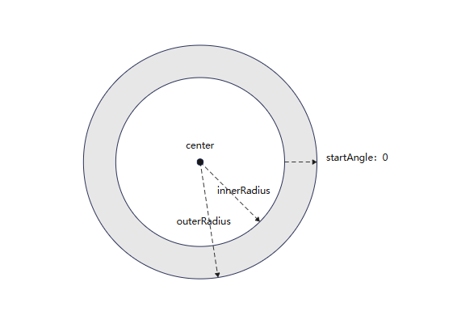
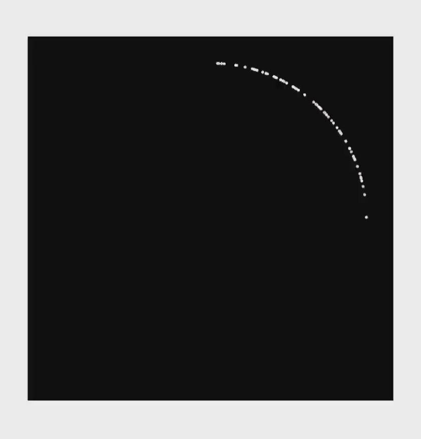

# Particle Animation (Particle)
<!--Kit: ArkUI-->
<!--Subsystem: ArkUI-->
<!--Owner: @hehongyang3-->
<!--Designer: @hehongyang3-->
<!--Tester: @lxl007-->
<!--Adviser: @Brilliantry_Rui-->
<!-- md-trans-meta sourceCommit=39ca26def5c22dc659f3dc0b76ef62a29421e77a translatedAt=2026-09-01T11:42:12.347Z pushedAt=2026-09-02T11:24:44.802Z -->

Particle animation is an animation composed of a multitude of particles randomly generated within a certain range. The particles can be points or images. By animating different aspects of the particles, such as color, opacity, scale, velocity, acceleration, and spin angle, you can create engaging and dynamic aesthetics. For example, you can create an impressive snowfall animation by animating the particles – snowflakes.

The component used for producing particle animations is **Particle**.


>  **NOTE**
>
> - This component is supported since API version 10. Newly added content in later versions is marked with a superscript to indicate the version in which it was introduced.
>
> - The APIs of this module can be used only in the stage model.
>
> - When the screen is turned off and then on again, or when the application is switched to the background and then brought back to the foreground, the particle animation is automatically paused.


## Child Components

Not supported


## APIs

```typescript
interface ParticleInterface {
  <
    PARTICLE extends ParticleType,
    COLOR_UPDATER extends ParticleUpdater,
    OPACITY_UPDATER extends ParticleUpdater,
    SCALE_UPDATER extends ParticleUpdater,
    ACC_SPEED_UPDATER extends ParticleUpdater,
    ACC_ANGLE_UPDATER extends ParticleUpdater,
    SPIN_UPDATER extends ParticleUpdater
  >(particles: Particles<
      PARTICLE,
      COLOR_UPDATER,
      OPACITY_UPDATER,
      SCALE_UPDATER,
      ACC_SPEED_UPDATER,
      ACC_ANGLE_UPDATER,
      SPIN_UPDATER
    >): ParticleAttribute;
}
```

**Atomic service API**: This API can be used in atomic services since API version 11.

**System capability**: SystemCapability.ArkUI.ArkUI.Full

**Parameters**

| Name| Type| Read-Only| Optional| Description|
| -------- | -------- | ---- | ---- | -------- |
| particles | [Particles](#particles18)<<br>&nbsp;&nbsp;[PARTICLE](#particletype), <br>&nbsp;&nbsp;COLOR_UPDATER,<br>&nbsp;&nbsp;OPACITY_UPDATER,<br>&nbsp;&nbsp;SCALE_UPDATER,<br>&nbsp;&nbsp;ACC_SPEED_UPDATER,<br>&nbsp;&nbsp;ACC_ANGLE_UPDATER,<br>&nbsp;&nbsp;SPIN_UPDATER<br>><br> | No | No | Collection of particle animations. For details, see [Particles](#particles18). |

## Attributes

In addition to the [universal attributes](ts-component-general-attributes.md), the following attributes are supported.

### disturbanceFields<sup>12+</sup>

disturbanceFields(fields: Array&lt;DisturbanceFieldOptions&gt;)

Sets the disturbance fields.

**Atomic service API**: This API can be used in atomic services since API version 12.

**System capability**: SystemCapability.ArkUI.ArkUI.Full

**Parameters**

| Name| Type   | Mandatory| Description                        |
| ------ | ------- | ---- | ---------------------------- |
| fields  | Array<[DisturbanceFieldOptions](#disturbancefieldoptions12)> | Yes   | Array of disturbance fields. Used to set the disturbance effect on the particle motion trajectory. By configuring multiple disturbance fields, repulsive or attractive forces can be applied to particles to change their motion trajectories. |

### emitter<sup>12+</sup>
emitter(value: Array&lt;EmitterProperty&gt;)

Supports dynamic update of emitter properties. Use the index in **EmitterProperty** to specify the emitter to update (based on the array index of the emitter in the initialization parameters), and dynamically update the emission rate, position, size, and annular area parameters of the emitter. You must first create a particle animation and configure the emitter through the **Particle** API, and then dynamically update the parameters of the corresponding emitter through the **emitter()** property. The **emitter()** property only updates the parameters of existing emitters and cannot add new emitters.

**Atomic service API**: This API can be used in atomic services since API version 12.

**System capability**: SystemCapability.ArkUI.ArkUI.Full

**Parameters**

| Name| Type   | Mandatory| Description                        |
| ------ | ------- | ---- | ---------------------------- |
| value  | Array<[EmitterProperty](#emitterproperty12)> | Yes   | Array of emitter parameters to be updated. |

### rippleFields<sup>22+</sup>
rippleFields(fields: Array&lt;RippleFieldOptions&gt;\|undefined)

Sets the particle ripple field. The ripple field applies a force that changes in a waveform manner to particles within its influence range, producing an effect similar to ripple diffusion.

**Atomic service API**: This API can be used in atomic services since API version 22.

**System capability**: SystemCapability.ArkUI.ArkUI.Full

**Parameters**

| Name | Type    | Mandatory | Description                         |
| ------ | ------- | ---- | ---------------------------- |
| fields  | Array<[RippleFieldOptions](#ripplefieldoptions22)>\|undefined | Yes  | Array of particle ripple fields. Multiple particle ripple fields can be set in the array form. When set to **undefined**, it indicates no ripple field. |

### velocityFields<sup>22+</sup>
velocityFields(fields: Array&lt;VelocityFieldOptions&gt;\|undefined)

Sets the particle velocity field. The velocity field applies a force to particles within its influence range, so that the velocity specified by the velocity field is superimposed on the original velocity of the particles.

**Atomic service API**: This API can be used in atomic services since API version 22.

**System capability**: SystemCapability.ArkUI.ArkUI.Full

**Parameters**

| Name | Type    | Mandatory | Description                         |
| ------ | ------- | ---- | ---------------------------- |
| fields  | Array<[VelocityFieldOptions](#velocityfieldoptions22)>\|undefined | Yes   | Array of particle velocity fields. Multiple particle velocity fields can be set in array form. When set to **undefined**, it indicates no velocity field. |

## Events
The [universal events](ts-component-general-events.md) are supported.

## ParticleOptions

```typescript
interface ParticleOptions<
  PARTICLE extends ParticleType,
  COLOR_UPDATER extends ParticleUpdater,
  OPACITY_UPDATER extends ParticleUpdater,
  SCALE_UPDATER extends ParticleUpdater,
  ACC_SPEED_UPDATER extends ParticleUpdater,
  ACC_ANGLE_UPDATER extends ParticleUpdater,
  SPIN_UPDATER extends ParticleUpdater
> {
  emitter: EmitterOptions<PARTICLE>;
  color?: ParticleColorPropertyOptions<COLOR_UPDATER>;
  opacity?: ParticlePropertyOptions<number, OPACITY_UPDATER>;
  scale?: ParticlePropertyOptions<number, SCALE_UPDATER>;
  velocity?: VelocityOptions;
  acceleration?: AccelerationOptions<ACC_SPEED_UPDATER, ACC_ANGLE_UPDATER>;
  spin?: ParticlePropertyOptions<number, SPIN_UPDATER>;
}
```

Sets particle parameters.

**Atomic service API**: This API can be used in atomic services since API version 11.

**System capability**: SystemCapability.ArkUI.ArkUI.Full

| Name| Type| Read-Only| Optional| Description|
| -------- | -------- | ---- | ---- | -------- |
| emitter | [EmitterOptions](#emitteroptions)<[PARTICLE](#particletype)> | No| No| Particle emitter configuration.|
| color | [ParticleColorPropertyOptions](#particlecolorpropertyoptions)<COLOR_UPDATER> | No | Yes | Particle color configuration.<br>**Note:**<br>Default value: **{ range:[Color.White,Color.White] }**. Image particles do not support setting the color.|
| opacity | [ParticlePropertyOptions](#particlepropertyoptions)\<number, OPACITY_UPDATER> | No | Yes | Particle opacity configuration.<br>Default value: **{ range:[1.0,1.0] }** |
| scale | [ParticlePropertyOptions](#particlepropertyoptions)\<number, SCALE_UPDATER> | No | Yes | Particle size configuration.<br>Default value: **{ range:[1.0,1.0] }** |
| velocity | [VelocityOptions](#velocityoptions18) |No | Yes | Particle velocity configuration.<br>**Note:**<br>**speed** indicates the velocity magnitude. **angle** indicates the direction of the velocity (unit: degree), with the geometric center of the element as the coordinate origin and the horizontal direction as the X-axis. A positive value indicates clockwise rotation angle.<br>Default value: **{ speed:[0.0,0.0],angle:[0.0,0.0] }** |
| acceleration | [AccelerationOptions](#accelerationoptions18)\<ACC_SPEED_UPDATER, ACC_ANGLE_UPDATER> | No | Yes | Particle acceleration configuration. <br>**Note:**<br>**speed** indicates the acceleration magnitude, and angle indicates the acceleration direction (unit: degree).<br>Default value: **{ speed:{range:[0.0,0.0]},angle:{range:[0.0,0.0]}** } |
| spin | [ParticlePropertyOptions](#particlepropertyoptions)\<number, SPIN_UPDATER> | No | Yes | Particle spin angle configuration, unit is degree (°). <br>Default value: **{range:[0.0,0.0]}**<br>Direction: a positive value indicates clockwise rotation, and a negative value indicates counterclockwise rotation. |


## EmitterOptions

```typescript
interface EmitterOptions<PARTICLE extends ParticleType> {   
  particle: EmitterParticleOptions<PARTICLE>;
  emitRate?: number;
  shape?: ParticleEmitterShape;
  position?: ParticleTuple<Dimension, Dimension>;
  size?: ParticleTuple<Dimension, Dimension>;
  annulusRegion?: ParticleAnnulusRegion;
}
```

Defines the configuration options of the particle emitter.

**System capability**: SystemCapability.ArkUI.ArkUI.Full

| Name| Type| Read-Only| Optional| Description|
| -------- | -------- | ---- | ---- | -------- |
| particle | [EmitterParticleOptions](#emitterparticleoptions18)<[PARTICLE](#particletype)> | No | No | Particle configuration.<br>-**type** indicates the particle type, which can be an image or a point.<br>-**config** indicates the configuration of the corresponding type.<br>-The **config** type is related to the **type** value:<br>1. If **type** is **ParticleType.POINT**, the **config** type is [PointParticleParameters](#pointparticleparameters).<br>2. If **type** is **ParticleType.IMAGE**, the **config** type is [ImageParticleParameters](#imageparticleparameters).<br>-**count** indicates the total number of emitted particles. The value of **count** must be greater than or equal to -1. When **count** is -1, the total number of particles is infinite.<br>-**lifetime** indicates the lifecycle of a single particle. The default value is **1000** (that is, 1000 ms, 1 s). The value of lifetime must be greater than or equal to -1. When **lifetime** is -1, the particle lifecycle is infinite. When **lifetime** is less than -1, the default value is used.<br>**Note:** If the animation does not need to play continuously, it is recommended not to set the lifecycle to -1, as this may cause significant performance impact.<br>**lifetimeRange** indicates the value range of the particle lifecycle. After **lifetimeRange** is set, the particle lifecycle is a random integer in [lifetime - lifetimeRange, lifetime + lifetimeRange]. The default value of **lifetimeRange** is **0**, and the value range is [0, +∞). When it is set to a negative value, the default value is used.<br>**Atomic service API:** Since API version 11, this API is supported in atomic services. |
| emitRate | number | No | Yes | Emission rate of the emitter (that is, the number of particles emitted per second). Default value: **5**. When the value is less than 0, the default value **5** is used. When **emitRate** exceeds 5000, performance is severely affected and the frame rate may drop significantly. It is recommended to set this parameter to a value less than 5000.<br>**Atomic service API:** Since API version 11, this API is supported in atomic services.|
| shape | [ParticleEmitterShape](#particleemittershape) | No | Yes | Shape of the emitter.<br>Default value: **ParticleEmitterShape.RECTANGLE**<br>**Atomic service API:** Since API version 11, this API is supported in atomic services. |
| position | [ParticleTuple](#particletuple18)<[Dimension](ts-types.md#dimension10), [Dimension](ts-types.md#dimension10)> | No | Yes | Emitter position (the position relative to the upper left corner of the component. The first parameter is the relative offset in the x direction, and the second parameter is the relative offset in the y direction.). When the emitter shape is annular (that is, **shape** is **ParticleEmitterShape.ANNULUS**), this property does not take effect, and the shape information must be specified through the **annulusRegion** parameter. <br>Default value: `[0.0, 0.0]`<br>**Atomic service API:** Since API version 11, this API is supported in atomic services.|
| size |  [ParticleTuple](#particletuple18)<[Dimension](ts-types.md#dimension10), [Dimension](ts-types.md#dimension10)>     |No | Yes | Size of the emitter. The first parameter is the emitter width, and the second parameter is the emitter height. When the emitter shape is annulus (that is, **shape** is **ParticleEmitterShape.ANNULUS**), this property does not take effect, and the shape information must be specified through the **annulusRegion** parameter.<br>Default value: `['100%','100%']` (that is, the emission window occupies the entire **Particle** component)<br>**Atomic service API:** Since API version 11, this API is supported in atomic services. |
| annulusRegion<sup>20+</sup>  | [ParticleAnnulusRegion](ts-particle-animation.md#particleannulusregion20)| No | Yes  |Ring emitter parameter. It takes effect only when the emitter shape is annulus (that is, the **shape** parameter is **ParticleEmitterShape.ANNULUS**). For a annulus emitter, the shape information must be specified through the **annulusRegion** parameter, and **position** and **size** do not take effect. When it is not set, the emitter does not use the annulus region parameter.<br>**Atomic service API:** Since API version 20, this API is supported in atomic services. |

## ParticleConfigs

Sets particle configuration items.

**Atomic service API**: This API can be used in atomic services since API version 11.

**System capability**: SystemCapability.ArkUI.ArkUI.Full

| Name  | Type  | Read-Only| Optional| Description|
| -------- | -------- | ------ | -------- | -------- |
| [ParticleType.POINT]      | [PointParticleParameters](#pointparticleparameters) | No| No   | Point particle configuration.|
| [ParticleType.IMAGE]      | [ImageParticleParameters](#imageparticleparameters) | No| No   | Image particle configuration.|

## PointParticleParameters

Sets the radius of a particle.

**Atomic service API**: This API can be used in atomic services since API version 11.

**System capability**: SystemCapability.ArkUI.ArkUI.Full

| Name  | Type  | Read-Only| Optional| Description|
| -------- | ------- | ------- | -------- | -------- |
| radius      | [VP](ts-types.md#vp10)| No | No    | Particle radius.<br>Default value: **0**. If the value is less than 0, the default value **0** is used.<br>Value range: [0, +∞) |

## ImageParticleParameters

Sets the image options.

**Atomic service API**: This API can be used in atomic services since API version 11.

**System capability**: SystemCapability.ArkUI.ArkUI.Full

| Name  | Type  | Read-Only| Optional| Description|
| -------- | ------- | ------- | -------- | -------- |
| src      | [ResourceStr](ts-types.md#resourcestr) | No | No    | Image path. Both local images and network images are supported. For details about how to reference images, see [Loading Image Resources](../../../ui/arkts-graphics-display.md#loading-image-resources).<br>The SVG image type is not supported yet.<br>When src remains unchanged, cached resources are used preferentially, and resources cannot be switched dynamically. To switch resources dynamically, you are advised to switch to a different src. |
| size     | [ParticleTuple](#particletuple18)<[Dimension](ts-types.md#dimension10), [Dimension](ts-types.md#dimension10)> | No | No    | Image size. The first parameter is the image width, and the second parameter is the image height.<br>Default value: [0, 0] |
| objectFit| [ImageFit](ts-appendix-enums.md#imagefit)| No | Yes   | Image display mode.<br>Default value: **ImageFit.Cover** |

## ParticleColorPropertyOptions

```typescript
interface ParticleColorPropertyOptions<UPDATER extends ParticleUpdater> {
  range: ParticleTuple<ResourceColor, ResourceColor>; 
  distributionType?: DistributionType;
  updater?: ParticleColorUpdaterOptions<UPDATER>;
}
```

Sets the particle color attribute updater configuration.

**System capability**: SystemCapability.ArkUI.ArkUI.Full

| Name| Type| Read-Only| Optional| Description|
| -------- | -------- | ---- | ---- | -------- |
| range | [ParticleTuple](#particletuple18)<[ResourceColor](ts-types.md#resourcecolor), [ResourceColor](ts-types.md#resourcecolor)> | No | No | Particle initial color range. The initial color of particles generated by the particle emitter is randomly selected from the **range**.<br>Default value: **range:[Color.White,Color.White]** <br>**Atomic service API:** Since API version 11, this API is supported in atomic services.|
| distributionType<sup>12+</sup> | [DistributionType](#distributiontype12) | No | Yes | Distribution type of the particle initial color random values. Allows you to select the distribution type for generating random color values, supporting uniform distribution or normal (Gaussian) distribution.<br>Default value: **DistributionType.UNIFORM**<br>**Atomic service API:** Since API version 12, this API is supported in atomic services. |
| updater | [ParticleColorUpdaterOptions](#particlecolorupdateroptions18)\<UPDATER> | No | Yes | Color property change configuration. The color property change type has three categories:<br>1. When **type** is **ParticleUpdater.NONE**, it indicates no change, and the **config** type is [ParticleColorPropertyUpdaterConfigs](#particlecolorpropertyupdaterconfigs)[ParticleUpdater.NONE]. <br>2. When **type** is **ParticleUpdater.RANDOM**, it indicates random uniform change, and the **config** type is [ParticleColorPropertyUpdaterConfigs](#particlecolorpropertyupdaterconfigs)[ParticleUpdater.RANDOM]. <br>3. When **type** is **ParticleUpdater.CURVE**, it indicates change along an animation curve, and the **config** type is [ParticleColorPropertyUpdaterConfigs](#particlecolorpropertyupdaterconfigs)[ParticleUpdater.CURVE].<br>Default value: **type** defaults to **ParticleUpdater.NONE**. <br>**NOTE**<br>When **type** is **ParticleUpdater.RANDOM** or **ParticleUpdater.CURVE**, the color configuration in **updater** takes precedence over the color configuration in **range**. Within the animation time period configured in **updater**, the color changes according to the color configuration in **updater**; outside the animation time period configured in **updater**, the color changes according to the color configuration in **range**.<br>**Atomic service API:** Since API version 11, this API is supported in atomic services. |


## ParticleColorPropertyUpdaterConfigs

Sets the configuration of the particle color attribute updater.

**Atomic service API**: This API can be used in atomic services since API version 11.

**System capability**: SystemCapability.ArkUI.ArkUI.Full

| Name| Type| Read-Only| Optional| Description|
| -------- | -------- | ---- | ---- | -------- |
|[ParticleUpdater.NONE]|void | No| No| The color does not change.|
| [ParticleUpdater.RANDOM] | [ParticleColorOptions](#particlecoloroptions18) | No | No | Indicates that when the change mode is random, a difference value is randomly generated for each particle within the change range. The r, g, b, and a color channels each use the difference value to overlay the current color value per second to generate the target color value, achieving the effect of random color change. |
| [ParticleUpdater.CURVE]|Array<[ParticlePropertyAnimation](#particlepropertyanimation)\<[ResourceColor](ts-types.md#resourcecolor)\>> | No | No | Indicates the configuration of color change when the change mode is curve. The array type indicates that the current property can be set with multiple animation segments, for example, **0ms-3000ms**, **3000ms-5000ms**, and **5000ms-8000ms** are set as separate animations. |

## ParticlePropertyOptions
```typescript
interface ParticlePropertyOptions<TYPE, UPDATER extends ParticleUpdater> {
  range: ParticleTuple<TYPE, TYPE>;
  updater?: ParticleUpdaterOptions<TYPE, UPDATER>;
}
```

Sets particle attributes.

**Atomic service API**: This API can be used in atomic services since API version 11.

**System capability**: SystemCapability.ArkUI.ArkUI.Full

<!--Table: 10%; auto; 10%; auto-->
| Name| Type| Read-Only| Optional| Description|
| -------- | -------- | ---- | ---- | -------- |
| range | [ParticleTuple](#particletuple18)<TYPE, TYPE> | No | No | Initial particle property value range. The property value of the particle generated by the particle emitter is randomly selected within the range.<br>**Note:**<br>For each property, invalid input uses the default value. When the maximum value is less than the minimum value, the default range is used. **TYPE** is number.<br>The default values of different properties are different:<br>1. **opacity**: range:[1.0,1.0], value range is [0, 1], default value is **1.0**.<br>2. **scale**: range:[1.0,1.0], value range is [0, 10000], default value is **1.0**.<br>3. **speed** of **acceleration**: range:[0.0,0.0], value range is [0, 10000], default value is **0.0**.<br>4. **angle** of **acceleration**: range:[0.0,0.0], value range is [-10000, 10000], default value is **0.0**.<br>5. **spin**: range:[0.0,0.0], value range is [-10000, 10000], default value is **0.0**.|
| updater | [ParticleUpdaterOptions](#particleupdateroptions18)<TYPE, UPDATER> | No | Yes | Property change configuration. The property change type has three categories:<br>1. When **type** is **ParticleUpdater.NONE**, it indicates no change, and the **config** type is [ParticlePropertyUpdaterConfigs](#particlepropertyupdaterconfigst)[ParticleUpdater.NONE].<br>2. When **type** is **ParticleUpdater.RANDOM**, it indicates that the change type is random change, and the **config** type is [ParticlePropertyUpdaterConfigs](#particlepropertyupdaterconfigst)[ParticleUpdater.RANDOM].<br>3. When **type** is **ParticleUpdater.CURVE**, it indicates that the change type is curve change, and the **config** type is [ParticlePropertyUpdaterConfigs](#particlepropertyupdaterconfigst)[ParticleUpdater.CURVE].<br>Default value: **type** defaults to **ParticleUpdater.NONE**. |


## ParticlePropertyUpdaterConfigs\<T>
```typescript
interface ParticlePropertyUpdaterConfigs<T> {
    [ParticleUpdater.NONE]: void;
    [ParticleUpdater.RANDOM]: ParticleTuple<T, T>;
    [ParticleUpdater.CURVE]: Array<ParticlePropertyAnimation<T>>;
}
```

Sets the particle property updater configuration.

**Atomic service API**: This API can be used in atomic services since API version 11.

**System capability**: SystemCapability.ArkUI.ArkUI.Full

| Name | Type | Read-Only | Optional | Description |
| -------- | -------- | ---- | ---- | -------- |
| [ParticleUpdater.NONE]|void | No | No | No change.|
| [ParticleUpdater.RANDOM] | [ParticleTuple](#particletuple18)<T, T> | No | No | When the change mode is random, the change difference per second is a value randomly generated within the configured range.<br>The target property value is the current property value plus the change difference. For example, if the current property value is **0.2** and **config** is [0.1,1.0]:<br>1. If the change difference takes a random value 0.5 within the range [0.1,1.0], the target property value is 0.2 + 0.5 = 0.7.<br>2. The change difference can also be negative. For example, if the current property value is 0.2 and **config** is [-3.0,2.0], and the change difference takes a random value -2.0 within the range [-3.0,2.0], the target property value is 0.2 - 2.0 = -1.8.<br>**Note:**<br>**config** configures the value range of the change difference, and there is no constraint on the maximum and minimum values of the difference. However, if the current property value plus the difference is greater than the maximum property value, the target property value takes the maximum property value; if the current property value plus the difference is less than the minimum property value, the target property value takes the minimum property value. **T** is number.<br>For example, if the value range of **opacity** is [0.0,1.0], when the current property value plus the difference exceeds 1.0, 1.0 is used.|
|[ParticleUpdater.CURVE]|Array<[ParticlePropertyAnimation](#particlepropertyanimation)\<T\>> | No | No | Configuration of property change when the change mode is curve. The array type indicates that multiple animation segments can be set for the current property, for example, **0ms-3000ms**, **3000ms-5000ms**, and **5000ms-8000ms**. **T** is number.|

## ParticlePropertyAnimation
```typescript
interface ParticlePropertyAnimation<T> {
  from: T;
  to: T;
  startMillis: number;
  endMillis: number;
  curve?: Curve | ICurve;
}
```

Sets the lifecycle of particle properties.

**Atomic service API**: This API can be used in atomic services since API version 11.

**System capability**: SystemCapability.ArkUI.ArkUI.Full

| Name| Type| Read-Only| Optional| Description|
| -------- | ---- | ---- | -------- | -------- |
|from| T | No| No| Initial value of the property. If the value is invalid, the default value will be used.|
| to | T | No| No| Target value of the property. If the value is invalid, the default value will be used.|
|startMillis|number | No | No | Start time of the animation.<br>Unit: ms.<br>Value range: [0, +∞). If a negative value is passed in, the default value **0** is used.|
|endMillis|number | No | No | End time of the animation.<br>Unit: ms.<br>Value range: [0, +∞). If a negative value is passed in, the default value **0** is used.|
|curve|[Curve](ts-appendix-enums.md#curve) \| [ICurve](../js-apis-curve.md#icurve9)| No| Yes| Animation curve.<br>Default value: **Curve.Linear**|


## ParticleType

Particle type.

**Atomic service API**: This API can be used in atomic services since API version 11.

**System capability**: SystemCapability.ArkUI.ArkUI.Full

| Name |  Value | Description|
| -------- | -------- | -------- |
| POINT | 'point' | Point particle.|
| IMAGE | 'image' | Image particle.<br>Image particles do not support color settings. |


## ParticleEmitterShape

Particle emitter shape.

**System capability**: SystemCapability.ArkUI.ArkUI.Full

| Name |  Value | Description|
| -------- | -------- | -------- |
| RECTANGLE | 'rectangle' | The particle emitter is a rectangle.<br> **Atomic service API:** This API can be used in atomic services since API version 11.|
| CIRCLE | 'circle' | The particle emitter is a circle.<br> **Atomic service API:** This API can be used in atomic services since API version 11.|
| ELLIPSE | 'ellipse' | The particle emitter is an ellipse.<br> **Atomic service API:** This API can be used in atomic services since API version 11.|
| ANNULUS<sup>20+</sup> | 'annulus' | The particle emitter is an annulus. When this shape is used, the **annulusRegion** parameter must be configured, and the **position** and **size** parameters do not take effect.<br> **Atomic service API:** This API can be used in atomic services since API version 20.|

## DistributionType<sup>12+</sup>

Defines the random distribution type of the initial color.

**Atomic service API**: This API can be used in atomic services since API version 12.

**System capability**: SystemCapability.ArkUI.ArkUI.Full

| Name |  Value | Description|
| -------- | -------- | -------- | 
| UNIFORM | 0 | The initial color random values are distributed uniformly.|
| GAUSSIAN | 1 | The initial color random values are distributed according to a Gaussian distribution.|

## ParticleUpdater

Particle change type.

**Atomic service API**: This API can be used in atomic services since API version 11.

**System capability**: SystemCapability.ArkUI.ArkUI.Full

| Name |  Value | Description|
| -------- | -------- | -------- |
|NONE | 'none' | No change.|
|RANDOM | 'random' | Random uniform change.|
|CURVE | 'curve' | Animation curve change.|

## DisturbanceFieldOptions<sup>12+</sup>

Sets the parameters of the disturbance field.

**Atomic service API**: This API can be used in atomic services since API version 12.

**System capability**: SystemCapability.ArkUI.ArkUI.Full

| Name| Type   | Read-Only| Optional| Description                        |
| ------ | ------- | ---- | ------- | --------------------- |
| strength  | number | No | Yes   |Field strength, which indicates the strength of the repulsive force from the center of the field outward. Default value: **0**. A positive value indicates that the repulsive force points outward, and a negative value indicates an attractive force pointing inward.<br>Value range: (-∞, +∞). |
| shape  |   [DisturbanceFieldShape](#disturbancefieldshape12) | No | Yes   | Shape of the field.<br>The default value is **DisturbanceFieldShape.RECT**. |
| size  | [SizeT](#sizett12)&lt;number&gt;| No | Yes  |Size of the field, in vp.<br>Default value: **{width:0, height:0}**.<br>Value range of **width** and **height**: [0, +∞).|
| position  | [PositionT](#positiontt12)&lt;number&gt; | No | Yes   |Position of the field, in vp.<br>Default value: **{x:0, y:0}**.<br>Value range of x and y: (-∞, +∞). |
| feather  | number | No | Yes   |Feathering value, which indicates the degree of attenuation from the center of the field to the field edge. It is an integer ranging from 0 to 100. The value **0** indicates that the field is a rigid body, and all particles within the range are repelled. A larger feathering value indicates a greater degree of easing of the field, and more particles close to the center appear within the field range. If the value is set to negative or greater than 100, the default value is used. If the value is set to a non-integer, it is truncated to an integer.<br>Default value: **0**. |
| noiseScale  | number | No | Yes   |Noise scale, used to control the overall size of the noise pattern. The value must be greater than or equal to 0.<br>Default value: **1**. If a negative value is passed in, the default value **1** is used. |
| noiseFrequency  | number | No | Yes   |Noise frequency. A larger frequency indicates finer noise. The value must be greater than or equal to 0.<br> Default value: **1**. If a negative value is passed in, the default value **1** is used. |
| noiseAmplitude  | number | No | Yes   |Noise amplitude, which indicates the fluctuation range of the noise value. A larger amplitude indicates a larger fluctuation range. The value must be greater than or equal to 0.<br> Default value: **1**. If a negative value is passed in, the default value **1** is used. |

## DisturbanceFieldShape<sup>12+</sup>

Defines the shape of the disturbance field.

**Atomic service API**: This API can be used in atomic services since API version 12.

**System capability**: SystemCapability.ArkUI.ArkUI.Full

| Name   | Value   | Description  |
| --------| ---- | ------|
| RECT    | 0 | Rectangle.   |
| CIRCLE  | 1 | Circle.      |
| ELLIPSE | 2 | Ellipse.    |

## EmitterProperty<sup>12+</sup>

Sets the emitter attributes.

**System capability**: SystemCapability.ArkUI.ArkUI.Full

| Name| Type   | Read-Only| Optional| Description                        |
| ------ | ------- | ---- | ------- | --------------------- |
| index   | number | No | No   |Index, rounded to an integer, which specifies the corresponding emitter by the array index of the emitter in the initialization parameters. The default value is 0 for an invalid value.<br>**Atomic service API:** This API is supported in atomic services since API version 12. |
| emitRate  | number  | No | Yes   | Emission rate of the emitter, that is, the number of particles emitted per second.<br>If this parameter is not passed, the current emission rate is retained. If the passed value is less than 0, the default value 5 is used. An **emitRate** value greater than 5000 may have a significant impact on performance and a sharp drop in frame rate. It is recommended to set this parameter to a value less than 5000.<br>**Atomic service API:** This API is supported in atomic services since API version 12. |
| position  | [PositionT](#positiontt12)&lt;number&gt; | No | Yes  |Emitter position. Only the number type is supported.<br>If this parameter is not passed, the current emitter position is retained. Two valid parameters must be passed. If either of them is invalid, **position** does not take effect. When the shape of the emitter corresponding to the **index** is annulus (**ANNULUS**), **position** does not take effect.<br>Value range of x and y: (-∞, +∞).<br>**Atomic service API:** This API is supported in atomic services since API version 12. |
| size  | [SizeT](#sizett12)&lt;number&gt;| No | Yes  |Size of the emitter. Only the number type is supported.<br>If this parameter is not passed, the current emitter size is retained. Two valid parameters greater than 0 must be passed. If either of them is invalid, **size** does not take effect. When the shape of the emitter corresponding to the index is annulus (**ANNULUS**), **size** does not take effect.<br>**Atomic service API:** This API is supported in atomic services since API version 12. |
| annulusRegion<sup>20+</sup>  | [ParticleAnnulusRegion](ts-particle-animation.md#particleannulusregion20)| No | Yes |Ring emitter parameters. This parameter takes effect only when the shape of the emitter corresponding to the **index** is annulus. For a annulus emitter, **position** and **size** do not take effect.<br>**Atomic service API:** This API is supported in atomic services since API version 20. |

## ParticleTuple<sup>18+</sup>

```typescript
type ParticleTuple<T1, T2> = [T1, T2]
```

Defines the particle tuple, which defines the type of animation parameter configuration value pairs.

**Atomic service API**: This API can be used in atomic services since API version 18.

**System capability**: SystemCapability.ArkUI.ArkUI.Full

| Type        | Description                                          |
| ----------- | ---------------------------------------------- |
| [T1, T2]    | Type of the animation parameter configuration value pair. **T1** and **T2** support multiple specific types (such as **number**, **ResourceColor**, **Dimension**, etc.).              |

## Particles<sup>18+</sup>

```typescript
interface Particles<
  PARTICLE extends ParticleType,
  COLOR_UPDATER extends ParticleUpdater,
  OPACITY_UPDATER extends ParticleUpdater,
  SCALE_UPDATER extends ParticleUpdater,
  ACC_SPEED_UPDATER extends ParticleUpdater,
  ACC_ANGLE_UPDATER extends ParticleUpdater,
  SPIN_UPDATER extends ParticleUpdater
> {
  particles: Array<
    ParticleOptions<
      PARTICLE,
      COLOR_UPDATER,
      OPACITY_UPDATER,
      SCALE_UPDATER,
      ACC_SPEED_UPDATER,
      ACC_ANGLE_UPDATER,
      SPIN_UPDATER
    >
  >;
}
```

Defines a collection of particle animations.

> **NOTE**
>
> To standardize anonymous object definitions, the element definitions here have been revised in API version 18. While historical version information is preserved for anonymous objects, there may be cases where the outer element's @since version number is higher than the inner element's. This does not affect interface usability.

**Atomic service API**: This API can be used in atomic services since API version 18.

**System capability**: SystemCapability.ArkUI.ArkUI.Full

| Name   | Type                          | Read-Only| Optional| Description                                                                                                                    |
| ------ | ------------------------------ | ---- | ------------------------------------------ | ----------------------------------------------------------------------------- |
| particles<sup>10+</sup>  | Array<<br>&nbsp;&nbsp;ParticleOptions<<br>&nbsp;&nbsp;&nbsp;&nbsp;PARTICLE,<br>&nbsp;&nbsp;&nbsp;&nbsp;COLOR_UPDATER,<br>&nbsp;&nbsp;&nbsp;&nbsp;OPACITY_UPDATER,<br>&nbsp;&nbsp;&nbsp;&nbsp;SCALE_UPDATER,<br>&nbsp;&nbsp;&nbsp;&nbsp;ACC_SPEED_UPDATER,<br>&nbsp;&nbsp;&nbsp;&nbsp;ACC_ANGLE_UPDATER,<br>&nbsp;&nbsp;&nbsp;&nbsp;SPIN_UPDATER<br>&nbsp;&nbsp;><br>>  | No | No   | Collection of particle animations. Each particle animation ([ParticleOptions](#particleoptions)) contains particle emission, and can configure the color, opacity, size, velocity, acceleration, and spin angle of particles. For details, see [ParticleOptions](#particleoptions). <br>**Atomic service API:** This API is supported in atomic services since API version 11.|

## VelocityOptions<sup>18+</sup>

Particle velocity.

> **NOTE**
>
> To standardize anonymous object definitions, the element definitions here have been revised in API version 18. While historical version information is preserved for anonymous objects, there may be cases where the outer element's @since version number is higher than inner elements'. This does not affect interface usability.

**Atomic service API**: This API can be used in atomic services since API version 18.

**System capability**: SystemCapability.ArkUI.ArkUI.Full

| Name   | Type                          | Read-Only| Optional| Description                                                                                                                    |
| ------ | ------------------------------ | ---- | ------------------------- | ---------------------------------------------------------------------------------------------- |
| speed<sup>10+</sup>  | [ParticleTuple](#particletuple18)\<number, number>  | No | No   | Velocity magnitude.<br>Default value: **{range:[0.0,0.0]}**    <br>**Atomic service API:** Since API version 11, this API is supported in atomic services.                                                                          |
| angle<sup>10+</sup>  | [ParticleTuple](#particletuple18)\<number, number>  | No | No   | Direction of velocity, in degrees (°). With the geometric center of the element as the coordinate origin and the horizontal direction as the X-axis, a positive value indicates a clockwise rotation angle.<br>Default value: **{range:[0.0,0.0]}** <br>**Atomic service API:** Since API version 11, this API is supported in atomic services.|

## AccelerationOptions<sup>18+</sup>

```typescript
declare interface AccelerationOptions<
  ACC_SPEED_UPDATER extends ParticleUpdater,
  ACC_ANGLE_UPDATER extends ParticleUpdater
> {
  speed?: ParticlePropertyOptions<number, ACC_SPEED_UPDATER>;
  angle?: ParticlePropertyOptions<number, ACC_ANGLE_UPDATER>;
}
```

Particle acceleration.

> **NOTE**
>
> To standardize anonymous object definitions, the element definitions here have been revised in API version 18. While historical version information is preserved for anonymous objects, there may be cases where the outer element's @since version number is higher than inner elements'. This does not affect interface usability.

**Atomic service API**: This API can be used in atomic services since API version 18.

**System capability**: SystemCapability.ArkUI.ArkUI.Full

| Name   | Type                                               | Read-Only| Optional| Description                                                      |
| ------ | --------------------------------------------------- | ---- | ----------- | ---------------------------------------------- |
| speed<sup>10+</sup>  | [ParticlePropertyOptions](#particlepropertyoptions)<number, ACC_SPEED_UPDATER>  | No | Yes   | Acceleration magnitude. Unit: vp/s²<br>Default value: **{range:[0.0,0.0]}**      <br>**Atomic service API:** Since API version 11, this API is supported in atomic services.        |
| angle<sup>10+</sup>  | [ParticlePropertyOptions](#particlepropertyoptions)<number, ACC_ANGLE_UPDATER>  | No | Yes   | Acceleration direction. The unit is degree (°).<br>Default value: **{range:[0.0,0.0]}** <br>**Atomic service API:** Since API version 11, this API is supported in atomic services.|

## EmitterParticleOptions<sup>18+</sup>

```typescript
interface EmitterParticleOptions<PARTICLE extends ParticleType> {
  type: PARTICLE;
  config: ParticleConfigs[PARTICLE];
  count: number;
  lifetime?: number;
  lifetimeRange?: number;
}
```

Particle configuration.

> **NOTE**
>
> To standardize anonymous object definitions, the element definitions here have been revised in API version 18. While historical version information is preserved for anonymous objects, there may be cases where the outer element's @since version number is higher than inner elements'. This does not affect interface usability.

**Atomic service API**: This API can be used in atomic services since API version 18.

**System capability**: SystemCapability.ArkUI.ArkUI.Full

| Name   | Type                                               | Read-Only| Optional| Description                                                      |
| ------ | --------------------------------------------------- | ---- | ----------- | ---------------------------------------------- |
| type<sup>10+</sup>  | [PARTICLE](#particletype)  | No | No   | Particle type, which can be an image or a point.   <br>**Atomic service API:** Since API version 11, this API is supported in atomic services.           |
| config<sup>10+</sup>  | [ParticleConfigs](#particleconfigs)[PARTICLE]  | No | No   | Configuration of the corresponding type.<br>The **config** type is related to the **type** value:<br>1. If **type** is **ParticleType.POINT**, the **config** type is [PointParticleParameters](#pointparticleparameters).<br>2. If **type** is **ParticleType.IMAGE**, the **config** type is [ImageParticleParameters](#imageparticleparameters).<br>**Atomic service API:** Since API version 11, this API is supported in atomic services. |
| count<sup>10+</sup>  | number  | No | No   | Total number of emitted particles. The value of **count** must be greater than or equal to -1. When **count** is -1, the total number of particles is infinite.<br>**Note:**<br>When **count** is -1, the emitter continuously emits particles. If you do not need to continuously generate a large number of particles, it is recommended not to set **count** to -1, as this may cause significant performance impact. It is recommended to set reasonable **emitRate** and **lifetime** values to avoid performance issues.<br>**Atomic service API:** Since API version 11, this API is supported in atomic services. |
| lifetime<sup>10+</sup>  | number  | No | Yes   | Lifecycle of a single particle. The default value is **1000** (that is, 1000 ms, or 1 s), and **lifetime** must be greater than or equal to -1. When **lifetime** is -1, the particle lifecycle is infinite. When **lifetime** is less than -1, the default value is used.<br>**Note:** If you do not need the animation to play continuously, it is recommended not to set the **lifecycle** to -1, as this may cause significant performance impact.<br>**Atomic service API:** Since API version 11, this API is supported in atomic services. |
| lifetimeRange<sup>12+</sup>  | number  | No | Yes   | Value range of the particle lifecycle, in milliseconds (ms). After **lifetimeRange** is set, the particle lifecycle is a random integer between [lifetime - lifetimeRange, lifetime + lifetimeRange]. The default value of **lifetimeRange** is **0**, and the value range is from 0 to positive infinity. When it is set to a negative value, the default value is used. <br>**Atomic service API:** Since API version 12, this API is supported in atomic services.|

## ParticleUpdaterOptions<sup>18+</sup>

```typescript
interface ParticleUpdaterOptions<TYPE, UPDATER extends ParticleUpdater> {
  type: UPDATER;
  config: ParticlePropertyUpdaterConfigs<TYPE>[UPDATER];
}
```

Defines the property change configuration.

> **NOTE**
>
> To standardize anonymous object definitions, the element definitions here have been revised in API version 18. While historical version information is preserved for anonymous objects, there may be cases where the outer element's @since version number is higher than the inner element's. This does not affect interface usability.

**Atomic service API**: This API can be used in atomic services since API version 18.

**System capability**: SystemCapability.ArkUI.ArkUI.Full

| Name   | Type                                               | Read-Only| Optional| Description                                                      |
| ------ | ----------------------------------- | ---------------- | ---- | --------------------------------------------------------- |
| type<sup>10+</sup>  | UPDATER | No | No   | Property change type. <br>Default value: **type** defaults to **ParticleUpdater.NONE**.    **Atomic service API:** Since API version 11, this API is supported in atomic services.          |
| config<sup>10+</sup>  | [ParticlePropertyUpdaterConfigs](#particlepropertyupdaterconfigst)\<TYPE>[UPDATER] | No | No   | Property change configuration. The property change type has three categories:<br>1. When **type** is **ParticleUpdater.NONE**, it indicates no change, and **config** is of type [ParticlePropertyUpdaterConfigs](#particlepropertyupdaterconfigst)[ParticleUpdater.NONE].<br>2. When type is **ParticleUpdater.RANDOM**, it indicates the change type is random, and **config** is of type [ParticlePropertyUpdaterConfigs](#particlepropertyupdaterconfigst)[ParticleUpdater.RANDOM].<br>3. When **type** is **ParticleUpdater.CURVE**, it indicates the change type is curve, and **config** is of type [ParticlePropertyUpdaterConfigs](#particlepropertyupdaterconfigst)[ParticleUpdater.CURVE]. **Atomic service API:** Since API version 11, this API is supported in atomic services. |

## ParticleColorUpdaterOptions<sup>18+</sup>

```typescript
interface ParticleColorUpdaterOptions<UPDATER extends ParticleUpdater> {
  type: UPDATER;
  config: ParticleColorPropertyUpdaterConfigs[UPDATER];
}
```

How the color property is updated.

> **NOTE**
>
> To standardize anonymous object definitions, the element definitions here have been revised in API version 18. While historical version information is preserved for anonymous objects, there may be cases where the outer element's @since version number is higher than inner elements'. This does not affect interface usability.

**Atomic service API**: This API can be used in atomic services since API version 18.

**System capability**: SystemCapability.ArkUI.ArkUI.Full

| Name   | Type                                               | Read-Only| Optional| Description                                                      |
| ------ | --------------------------------------------------- | ---- | ---------- | ----------------------------------------------- |
| type<sup>10+</sup>  | UPDATER  | No | No   | Change type of the color property.<br>Default value: **type** defaults to **ParticleUpdater.NONE**.     <br>**Atomic service API:** This API is supported in atomic services since API version 11.         |
| config<sup>10+</sup>  | [ParticleColorPropertyUpdaterConfigs](#particlecolorpropertyupdaterconfigs)[UPDATER]  | No | No   | The color property change type has three categories:<br>1. When **type** is **ParticleUpdater.NONE**, it indicates no change, and the **config** type is [ParticleColorPropertyUpdaterConfigs](#particlecolorpropertyupdaterconfigs)[ParticleUpdater.NONE].<br>2. When **type** is **ParticleUpdater.RANDOM**, it indicates random uniform change, and the **config** type is [ParticleColorPropertyUpdaterConfigs](#particlecolorpropertyupdaterconfigs)[ParticleUpdater.RANDOM].<br>3. When **type** is **ParticleUpdater.CURVE**, it indicates change following the animation curve, and the **config** type is [ParticleColorPropertyUpdaterConfigs](#particlecolorpropertyupdaterconfigs)[ParticleUpdater.CURVE].<br>**NOTE**<br>When **type** is **ParticleUpdater.RANDOM** or **ParticleUpdater.CURVE**, the color configuration in **updater** takes precedence over the color configuration in **range**. Within the animation time period configured in updater, the color changes according to the color configuration in **updater**; outside the animation time period configured in **updater**, the color changes according to the color configuration in **range**.<br>**Atomic service API:** This API is supported in atomic services since API version 11. |

## ParticleColorOptions<sup>18+</sup>

Randomly generates a difference value within the interval when the color change mode is random. The four color channels—r, g, b, and a—each overlay the current color value with the difference value every second to produce the target color value, achieving the effect of random color changes.

> **NOTE**
>
> To standardize anonymous object definitions, the element definitions here have been revised in API version 18. While historical version information is preserved for anonymous objects, there may be cases where the outer element's @since version number is higher than inner elements'. This does not affect interface usability.

**Atomic service API**: This API can be used in atomic services since API version 18.

**System capability**: SystemCapability.ArkUI.ArkUI.Full

| Name | Type                          | Read-Only| Optional| Description                        |
| ---- | ----------------- | ------------- | ---- | --------------------------- |
| r<sup>10+</sup>    | [ParticleTuple](#particletuple18)<number, number>  | No| No  | Difference value for the red color channel.   **Atomic service API**: This API can be used in atomic services since API version 11.        |
| g<sup>10+</sup>    | [ParticleTuple](#particletuple18)<number, number>  | No| No  | Difference value for the green color channel.   **Atomic service API**: This API can be used in atomic services since API version 11.       |
| b<sup>10+</sup>    | [ParticleTuple](#particletuple18)<number, number>  | No| No  | Difference value for the blue color channel.   **Atomic service API**: This API can be used in atomic services since API version 11.       |
| a<sup>10+</sup>    | [ParticleTuple](#particletuple18)<number, number>  | No| No  | Difference value for the alpha (transparency) channel.   **Atomic service API**: This API can be used in atomic services since API version 11.       |

## ParticleAnnulusRegion<sup>20+</sup>

Configures the annulus emitter area.

> **NOTE**
>
> - If **outerRadius** or **innerRadius** is less than 0 or uses the percentage unit, the value 0 is used.
>
> - If **outerRadius** is less than **innerRadius** (that is, the outer circle radius is less than the inner circle radius), the smaller value is used as the new inner circle radius, and the larger value is used as the new outer circle radius.
>
> - If **endAngle** is less than **startAngle** (that is, the end angle is less than the start angle), the smaller value is used as the new start angle, and the larger value is used as the new end angle.
>
> 


**Atomic service API**: This API can be used in atomic services since API version 20.

**System capability**: SystemCapability.ArkUI.ArkUI.Full

| Name  | Type  | Read-Only| Optional| Description|
| ------ | ------ | -- | -- | ---- |
| center      | [PositionT](#positiontt12)&lt;[LengthMetrics](../js-apis-arkui-graphics.md#lengthmetrics12)&gt; | No | Yes  | Center coordinates of the annulus, with the upper left corner of the component as the coordinate origin. Default value: **{x:LengthMetrics.percent(0.5),y:LengthMetrics.percent(0.5)}**   |
| outerRadius      | [LengthMetrics](../js-apis-arkui-graphics.md#lengthmetrics12) | No | No   | Outer radius of the annulus. Values less than zero or using percentage units are processed as zero. When **outerRadius** is smaller than **innerRadius**, the smaller value is used as the new inner radius and the larger value as the new outer radius.   |
| innerRadius  | [LengthMetrics](../js-apis-arkui-graphics.md#lengthmetrics12) | No | No  | Inner radius of the annulus. Values less than zero or using percentage units are processed as zero. When **outerRadius** is smaller than **innerRadius**, the smaller value is used as the new inner radius and the larger value as the new outer radius.   |
| startAngle | number | No | Yes   | Start angle of the annulus.<br>Unit: degree (°)<br>Value range: (-∞, +∞)<br>Default value: **0**  |
| endAngle | number | No | Yes   | End angle of the annulus.<br>Unit: degree (°)<br>Value range: (-∞, +∞)<br>Default value: **360**  |

## Vector2T\<T><sup>22+</sup>

type Vector2T\<T> = import('../api/arkui/Graphics').Vector2T\<T>

Defines the **Vector2T** type. The **Vector2T** type contains two property values: **x** and **y**.

**Atomic service API**: This API can be used in atomic services since API version 22.

**System capability**: SystemCapability.ArkUI.ArkUI.Full

| Type                         | Description                                |
| ---------------------------- | ----------------------------------- |
| import('../api/arkui/Graphics').[Vector2T\<T>](../js-apis-arkui-graphics.md#vector2tt12) | Used to represent a vector of type **T** that contains two values: **x** and **y**. x indicates the value along the x-axis of the vector. y indicates the value along the y-axis of the vector.<br>Unit: vp |

## PositionT\<T><sup>12+</sup>

type PositionT\<T> = import('../api/arkui/Graphics').PositionT\<T>

Sets or returns the position of the component.

**Atomic service API**: This API can be used in atomic services since API version 12.

**System capability**: SystemCapability.ArkUI.ArkUI.Full

| Type                         | Description                                |
| ---------------------------- | ----------------------------------- |
| import('../api/arkui/Graphics').[PositionT\<T>](../js-apis-arkui-graphics.md#positiontt12) | A vector containing the **x** and **y** values.<br>Unit: vp |

## SizeT\<T><sup>12+</sup>

type SizeT\<T> = import('../api/arkui/Graphics').SizeT\<T>

Defines the Size type.

**Atomic service API**: This API can be used in atomic services since API version 12.

**System capability**: SystemCapability.ArkUI.ArkUI.Full

| Type                         | Description                                |
| ---------------------------- | ----------------------------------- |
| import('../api/arkui/Graphics').[SizeT\<T>](../js-apis-arkui-graphics.md#sizett12) | Size type, including width and height.<br>Unit: vp |

## FieldRegion<sup>22+</sup>

Sets the region information of the particle field.

**Atomic service API**: This API can be used in atomic services since API version 22.

**System capability**: SystemCapability.ArkUI.ArkUI.Full

**Model restriction**: This API can be used only in the stage model.

| Name   | Type   | Read-only | Optional | Description |
| ------ | ------ | -- | -- | ---- |
| shape      | [DisturbanceFieldShape](#disturbancefieldshape12) | No | Yes  | Region shape of the particle field.<br>Default value: **DisturbanceFieldShape.RECT**  |
| position      | [PositionT](#positiontt12)&lt;number&gt; | No | Yes | Center position of the particle field region. The unit is vp.<br>Default value: **{x:0, y:0}**  |
| size  | [SizeT](#sizett12)&lt;number&gt; | No | Yes  | Size of the particle field region. The unit is vp.<br>Default value: **{width:0, height:0}**<br>Value range:<br>**width**: [0, +∞)<br>**height**: [0, +∞)<br>When the **width** (or **height**) of **size** is set to a negative value, the default value of **width** (or **height**) is used.  |

## RippleFieldOptions<sup>22+</sup>

Defines the parameters used to describe the particle ripple field information.

**Atomic service API**: This API can be used in atomic services since API version 22.

**System capability**: SystemCapability.ArkUI.ArkUI.Full

**Model restriction**: This API can be used only in the stage model.

| Name   | Type   | Read-only | Optional | Description |
| ------ | ------ | -- | -- | ---- |
| amplitude      | number | No | Yes  | Amplitude of the particle ripple field wave. A larger amplitude indicates a stronger force of the ripple field, a more obvious displacement change of particles under the ripple field, and a stronger ripple diffusion effect.<br>Value range: [0, +∞)<br>Default value: **0**<br>The default value is used when set to a negative value.  |
| wavelength      | number | No | Yes | Wavelength of the particle ripple field, that is, the change distance of one wave period. A larger wavelength indicates a slower wave change with distance, a less obvious fluctuation, and a longer period during which particles are affected by the fluctuation.<br>Value range: [0, +∞)<br>Default value: **0**<br>The default value is used when set to a negative value.  |
| waveSpeed  | number | No | Yes  | Wave speed of the particle ripple field. A larger wave speed indicates a faster wave change with time, a more obvious fluctuation, and a faster response of particles to the fluctuation. Unit: vp/s.<br>Value range: [0, +∞)<br>Default value: **0**<br>The default value is used when set to a negative value.  |
| attenuation  | number | No | Yes  | Attenuation coefficient of the particle ripple field wave. A larger attenuation coefficient indicates a faster wave attenuation with time, a rapid weakening of the ripple field force on particles over time, and a gradual disappearance of the ripple diffusion effect.<br>Value range: [0, 1]<br>Default value: **0.0**<br>The default value is used when the set value is out of range.  |
| center  | [PositionT](#positiontt12)&lt;number&gt; | No | Yes  | Center position where the particle ripple field generates force. The upper left corner of the component is the coordinate origin. The coordinate unit is vp.<br>Default value: **{x:0, y:0}** |
| region  | [FieldRegion](#fieldregion22) | No | Yes  | Region information affected by the particle ripple field, including the region shape, region size, and region center position.<br>Default value: **{shape:DisturbanceFieldShape.RECT, position:{x:0, y:0}, size:{width:0, height:0}}**  |

## VelocityFieldOptions<sup>22+</sup>

Defines the parameters used to describe the particle velocity field information.

**Atomic service API**: This API can be used in atomic services since API version 22.

**System capability**: SystemCapability.ArkUI.ArkUI.Full

| Name   | Type   | Read-only | Optional | Description |
| ------ | ------ | -- | -- | ---- |
| velocity      | [Vector2T](#vector2tt22)\<number> | No | Yes  | Velocity values of the particle velocity field in each direction. A particle obtains this velocity only when it is within the effective range of the velocity field. Once it leaves the range, it is no longer affected by the velocity field and does not obtain this additional velocity. Unit: vp/s.<br>Default value: **{x:0, y:0}**  |
| region  | [FieldRegion](ts-particle-animation.md#fieldregion22) | No | Yes  | Region information affected by the particle velocity field, including the region shape, region size, and region center position.<br>Default value: **{shape:DisturbanceFieldShape.RECT, position:{x:0, y:0}, size:{width:0, height:0}}**  |

## Example

### Example 1: Initializing Particles with Circular Shapes

This example demonstrates the basic usage of particle animations by initializing particles with circular shapes.

<!-- @[particle_example](https://gitcode.com/openharmony/applications_app_samples/blob/master/code/DocsSample/ArkUISample/Animation/entry/src/main/ets/pages/particle/template1/Index.ets) -->

``` TypeScript
@Entry
@Component
struct ParticleExample {
  build() {
    Stack() {
      Text()
        .width(300).height(300).backgroundColor(Color.Black)
      Particle({
        particles: [
          {
            emitter: {
              particle: {
                type: ParticleType.POINT, // Particle type.
                config: {
                  radius: 10 // Dot radius.
                },
                count: 500, // Total number of particles.
                lifetime: 10000, // Particle lifecycle, in ms.
                lifetimeRange: 100 // Value range of the particle lifecycle, in ms.
              },
              emitRate: 10, // Number of particles emitted per second.
              position: [0, 0],
              shape: ParticleEmitterShape.RECTANGLE // Emitter shape.
            },
            color: {
              range: [Color.Red, Color.Yellow], // Initial color range.
              distributionType: DistributionType.GAUSSIAN, // Distribution of random initial color values.
              updater: {
                type: ParticleUpdater.CURVE, // Change mode is curve.
                config: [
                  {
                    from: Color.White, // Start value of the change.
                    to: Color.Pink, // End value of the change.
                    startMillis: 0, // Start time.
                    endMillis: 3000, // End time.
                    curve: Curve.EaseIn // Change curve.
                  },
                  {
                    from: Color.Pink,
                    to: Color.Orange,
                    startMillis: 3000,
                    endMillis: 5000,
                    curve: Curve.EaseIn
                  },
                  {
                    from: Color.Orange,
                    to: Color.Pink,
                    startMillis: 5000,
                    endMillis: 8000,
                    curve: Curve.EaseIn
                  },
                ]
              }
            },
            opacity: {
              range: [0.0, 1.0], // The initial particle opacity is randomly generated from [0.0 to 1.0].
              updater: {
                type: ParticleUpdater.CURVE,
                config: [
                  {
                    from: 0.0,
                    to: 1.0,
                    startMillis: 0,
                    endMillis: 3000,
                    curve: Curve.EaseIn
                  },
                  {
                    from: 1.0,
                    to: 0.0,
                    startMillis: 5000,
                    endMillis: 10000,
                    curve: Curve.EaseIn
                  }
                ]
              }
            },
            scale: {
              range: [0.0, 0.0],
              updater: {
                type: ParticleUpdater.CURVE,
                config: [
                  {
                    from: 0.0,
                    to: 0.5,
                    startMillis: 0,
                    endMillis: 3000,
                    curve: Curve.EaseIn
                  }
                ]
              }
            },
            acceleration: {
              // Configuration of the acceleration, which changes in two dimensions: magnitude and direction. speed indicates the acceleration magnitude, and angle indicates the acceleration direction.
              speed: {
                range: [3, 9],
                updater: {
                  type: ParticleUpdater.RANDOM, // The change mode of Speed is random uniform change.
                  config: [1, 20]
                }
              },
              angle: {
                range: [90, 90]
              }
            }

          }
        ]
      }).width(300).height(300)
    }.width('100%').height('100%').align(Alignment.Center)
  }
}
```


### Example 2: Initializing Particles with Images

Describes the basic usage of particle animation, where particles are initialized through images. This example configures two different types of image particles to demonstrate the combined effect of multiple particle types.

```ts
@Entry
@Component
struct ParticleExample {
  @State
  myCount: number = 100

  // Reduce duplicate code through parameterized configuration. imageSrc is the image resource, scaleTo is the target scale value, and durationMs is the animation duration.
  private createImageParticle(imageSrc: ResourceStr, scaleTo: number, durationMs: number)
    : ParticleOptions<ParticleType.IMAGE, ParticleUpdater.CURVE, ParticleUpdater.CURVE,
  ParticleUpdater.CURVE, ParticleUpdater.CURVE, ParticleUpdater.CURVE, ParticleUpdater.CURVE>
  {
    return {
      emitter: {
        particle: {
          type: ParticleType.IMAGE,
          config: {
            src: imageSrc,
            size: [10, 10]
          },
          count: this.myCount,
          lifetime: 10000,
          lifetimeRange: 100
        },
        emitRate: 3,
        shape: ParticleEmitterShape.CIRCLE
      },
      color: {
        range: [Color.White, Color.White]
      },
      opacity: {
        range: [1.0, 1.0],
        updater: {
          type: ParticleUpdater.CURVE,
          config: [
            { from: 0, to: 1.0, startMillis: 0, endMillis: 6000 },
            { from: 1.0, to: 0, startMillis: 6000, endMillis: 10000 }
          ]
        }
      },
      scale: {
        range: [0.1, 1.0],
        updater: {
          type: ParticleUpdater.CURVE,
          config: [
            { from: 0, to: scaleTo, startMillis: 0, endMillis: durationMs, curve: Curve.EaseIn }
          ]
        }
      },
      acceleration: {
        speed: {
          range: [3, 9],
          updater: {
            type: ParticleUpdater.CURVE,
            config: [
              { from: 10, to: 20, startMillis: 0, endMillis: 3000, curve: Curve.EaseIn },
              { from: 10, to: 2, startMillis: 3000, endMillis: 8000, curve: Curve.EaseIn }
            ]
          }
        },
        angle: {
          range: [0, 180],
          updater: {
            type: ParticleUpdater.CURVE,
            config: [
              { from: 1, to: 2, startMillis: 0, endMillis: 1000, curve: Curve.EaseIn },
              { from: 50, to: -50, startMillis: 1000, endMillis: 3000, curve: Curve.EaseIn },
              { from: 3, to: 5, startMillis: 3000, endMillis: durationMs, curve: Curve.EaseIn }
            ]
          }
        }
      },
      spin: {
        range: [0.1, 1.0],
        updater: {
          type: ParticleUpdater.CURVE,
          config: [
            { from: 0, to: 360, startMillis: 0, endMillis: durationMs, curve: Curve.EaseIn }
          ]
        }
      },
    }
  }

  build() {
    Column() {
      Stack() {
        Particle({
          particles: [
            this.createImageParticle($r("app.media.book"), 1.5, 8000),   // book particle: scale to 1.5x, lasting 8000 ms
            this.createImageParticle($r('app.media.heart'), 2.0, 10000),  // heart particle: scale to 2.0x, lasting 10000 ms
          ]
        }).width(300).height(300)

      }.width(500).height(500).align(Alignment.Center)
    }.width('100%').height('100%')

  }
}
```


### Example 3: Changing Motion Trajectories with the Particle Disturbance Field

This example demonstrates the effect of particle motion trajectory changes under the interference of a disturbance field.

<!-- @[particle_example3](https://gitcode.com/openharmony/applications_app_samples/blob/master/code/DocsSample/ArkUISample/Animation/entry/src/main/ets/pages/particle/template3/Index.ets) -->  

``` TypeScript
@Entry
@Component
struct ParticleExample3 {
  build() {
    Stack() {
      Text()
        .width(300).height(300).backgroundColor(Color.Black)
      Particle({
        particles: [
          {
            emitter: {
              particle: {
                type: ParticleType.POINT, // Particle type.
                config: {
                  radius: 10 // Dot radius.
                },
                count: 500, // Total number of particles.
                lifetime: 10000 // Particle lifecycle, in ms.
              },
              emitRate: 10, // Number of particles emitted per second.
              position: [0, 0],
              shape: ParticleEmitterShape.RECTANGLE // Emitter shape.
            },
            color: {
              range: [Color.Red, Color.Yellow], // Initial color range.
              updater: {
                type: ParticleUpdater.CURVE, // Change mode is curve.
                config: [
                  {
                    from: Color.White, // Start value of the change.
                    to: Color.Pink, // End value of the change.
                    startMillis: 0, // Start time.
                    endMillis: 3000, // End time.
                    curve: Curve.EaseIn // Change curve.
                  },
                  {
                    from: Color.Pink,
                    to: Color.Orange,
                    startMillis: 3000,
                    endMillis: 5000,
                    curve: Curve.EaseIn
                  },
                  {
                    from: Color.Orange,
                    to: Color.Pink,
                    startMillis: 5000,
                    endMillis: 8000,
                    curve: Curve.EaseIn
                  },
                ]
              }
            },
            opacity: {
              range: [0.0, 1.0], // Initial particle opacity is randomly generated from [0.0, 1.0].
              updater: {
                type: ParticleUpdater.CURVE,
                config: [
                  {
                    from: 0.0,
                    to: 1.0,
                    startMillis: 0,
                    endMillis: 3000,
                    curve: Curve.EaseIn
                  },
                  {
                    from: 1.0,
                    to: 0.0,
                    startMillis: 5000,
                    endMillis: 10000,
                    curve: Curve.EaseIn
                  }
                ]
              }
            },
            scale: {
              range: [0.0, 0.0],
              updater: {
                type: ParticleUpdater.CURVE,
                config: [
                  {
                    from: 0.0,
                    to: 0.5,
                    startMillis: 0,
                    endMillis: 3000,
                    curve: Curve.EaseIn
                  }
                ]
              }
            },
            acceleration: {
              // Acceleration configuration, which changes in two dimensions: magnitude and direction. speed indicates the acceleration magnitude, and angle indicates the acceleration direction.
              speed: {
                range: [3, 9],
                updater: {
                  type: ParticleUpdater.RANDOM,
                  config: [1, 20]
                }
              },
              angle: {
                range: [90, 90]
              }
            }

          }
        ]
      // Set the particle disturbance field to interfere with the particle motion trajectory.
      }).width(300).height(300).disturbanceFields([{
        strength: 10, // Field strength, indicating the intensity of the repulsive or attractive force.
        shape: DisturbanceFieldShape.RECT, // Disturbance field shape is rectangle.
        size: { width: 100, height: 100 }, // Disturbance field size.
        position: { x: 100, y: 100 }, // Disturbance field position.
        feather: 15, // Feather value, indicating the degree of attenuation of the field from the center to the edge.
        noiseScale: 10, // Noise scale.
        noiseFrequency: 15, // Noise frequency.
        noiseAmplitude: 5 // Noise amplitude.
      }])
    }.width('100%').height('100%').align(Alignment.Center)
  }
}
```


### Example 4: Adjusting the Emitter Position
This example demonstrates how to adjust the position of the particle emitter through **emitter()**.
<!-- @[particle_example4](https://gitcode.com/openharmony/applications_app_samples/blob/master/code/DocsSample/ArkUISample/Animation/entry/src/main/ets/pages/particle/template4/Index.ets) -->

``` TypeScript
@Entry
@Component
struct ParticleExample4 {
  @State emitterProperties: Array<EmitterProperty> = [
    {
      index: 0,
      emitRate: 100,
      position: { x: 60, y: 80 },
      size: { width: 200, height: 200 }
    }
  ];

  build() {
    Stack() {
      Text()
        .width(300).height(300).backgroundColor(Color.Black)
      Particle({
        particles: [
          {
            emitter: {
              particle: {
                type: ParticleType.POINT, // Particle type.
                config: {
                  radius: 5 // Radius of the dot.
                },
                count: 400, // Total number of particles.
                lifetime: -1 // Lifecycle of the particle. -1 indicates an infinite lifecycle.
              },
              emitRate: 10, // Number of particles emitted per second.
              position: [0, 0], // Emitter position.
              shape: ParticleEmitterShape.CIRCLE // Emitter shape.
            },
            color: {
              range: [Color.Red, Color.Yellow], // Initial color range.
              updater: {
                type: ParticleUpdater.CURVE, // Change with the animation curve.
                config: [
                  {
                    from: Color.White,
                    to: Color.Pink,
                    startMillis: 0,
                    endMillis: 3000,
                    curve: Curve.EaseIn
                  },
                  {
                    from: Color.Pink,
                    to: Color.Orange,
                    startMillis: 3000,
                    endMillis: 5000,
                    curve: Curve.EaseIn
                  },
                  {
                    from: Color.Orange,
                    to: Color.Pink,
                    startMillis: 5000,
                    endMillis: 8000,
                    curve: Curve.EaseIn
                  },
                ]
              }
            },
          },
        ]
      })
        .width(300)
        .height(300)
        .emitter(this.emitterProperties)
    }.width('100%').height('100%').align(Alignment.Center)
  }
}
```


### Example 5: Creating an Annulus Emitter
This example demonstrates how to create a annulus emitter, where particles are statically emitted across the entire annulus range (from the start angle 0 to the end angle 360).
<!-- @[particle_example5](https://gitcode.com/openharmony/applications_app_samples/blob/master/code/DocsSample/ArkUISample/Animation/entry/src/main/ets/pages/particle/template5/Index.ets) -->

``` TypeScript
import { LengthMetrics } from '@kit.ArkUI';

@Entry
@Component
struct ParticleExample5 {
  build() {
    Stack() {
      Text()
        .width(300).height(300).backgroundColor(Color.Black)
      Particle({
        particles: [
          {
            emitter: {
              particle: {
                type: ParticleType.POINT, // Particle type.
                config: {
                  radius: 5 // Dot radius.
                },
                count: 2000, // Total number of particles.
                lifetime: 10000, // Particle lifecycle, in ms.
                lifetimeRange: 100 // Value range of the particle lifecycle, in ms.
              },
              emitRate: 100, // Number of particles emitted per second.
              shape: ParticleEmitterShape.ANNULUS, // Annulus emitter.
              annulusRegion:{
                center:{x:LengthMetrics.percent(0.5),y:LengthMetrics.percent(0.5)}, // Coordinates of the center of the annulus
                innerRadius:LengthMetrics.vp(100), // Inner radius of the annulus.
                outerRadius:LengthMetrics.vp(120), // Outer radius of the annulus.
                startAngle:0, // Start angle of the annulus
                endAngle:360 // End angle of the annulus
              }
            },
            color: {
              range: [Color.Pink, Color.White],
            },
            opacity: {
              range: [0.0, 1.0],
              updater: {
                type: ParticleUpdater.CURVE,
                config: [
                  {
                    from: 0.0,
                    to: 1.0,
                    startMillis: 0,
                    endMillis: 3000,
                    curve: Curve.EaseIn
                  },
                  {
                    from: 1.0,
                    to: 0.0,
                    startMillis: 5000,
                    endMillis: 10000,
                    curve: Curve.EaseIn
                  }
                ]
              }
            },
            scale: {
              range: [0.0, 0.0],
              updater: {
                type: ParticleUpdater.CURVE,
                config: [
                  {
                    from: 0.0,
                    to: 0.5,
                    startMillis: 0,
                    endMillis: 3000,
                    curve: Curve.EaseIn
                  }
                ]
              }
            },
          }
        ]
      }).width(300).height(300)
    }.width('100%').height('100%').align(Alignment.Center)
  }
}
```


### Example 6: Annulus Emitter Update
This example describes the basic usage of updating the annulus emitter of a particle animation.
<!-- @[particle_example6](https://gitcode.com/openharmony/applications_app_samples/blob/master/code/DocsSample/ArkUISample/Animation/entry/src/main/ets/pages/particle/template6/Index.ets) -->  

``` TypeScript
import { LengthMetrics } from '@kit.ArkUI';

@Entry
@Component
struct ParticleExample6 {
  @State radius: number = 1;
  @State shape: ParticleEmitterShape = ParticleEmitterShape.ANNULUS; // Annulus.
  @State emitRate: number = 200;
  @State count: number = 4000;
  private timerID: number = -1;
  private centerX: LengthMetrics = LengthMetrics.percent(0.5);
  private centerY: LengthMetrics = LengthMetrics.percent(0.5);
  private inRadius: LengthMetrics = LengthMetrics.vp(120);
  private outRadius: LengthMetrics = LengthMetrics.vp(120);
  private startAngle: number = -90;   // 12 o'clock direction.
  private endAngle: number = -60;   // 1 o'clock direction.

  // Set the update parameters of the annulus emitter for the particle animation.
  @State emitterProperties: Array<EmitterProperty> = [
    {
      index: 0,
      emitRate: 100,
      annulusRegion: {
        center: {x:this.centerX, y: this.centerY}, // Center coordinates of the annulus.
        outerRadius: this.outRadius, // Outer radius of the annulus
        innerRadius: this.inRadius, // Inner radius of the annulus
        startAngle: this.startAngle, // Start angle of the annulus.
        endAngle: this.endAngle // End angle of the annulus.
      }
    }
  ]

  // Set the initial parameters of the annulus emitter upon creation.
  @State region: ParticleAnnulusRegion = {
    center: {x:this.centerX, y: this.centerY},
    outerRadius: this.outRadius,
    innerRadius: this.inRadius,
    startAngle: -90,
    endAngle: -60
  }

  onPageShow(): void {
    // Create a timer (updated every second).
    this.timerID = setInterval(() => {
      this.emitterProperties = [
        {
          index: 0,
          emitRate: this.emitRate,
          annulusRegion: {
            center:{x:this.centerX, y: this.centerY},
            outerRadius: this.outRadius,
            innerRadius: this.inRadius,
            startAngle: this.startAngle,
            endAngle: this.endAngle
          }
        }
      ];
      if (this.endAngle >= 360) {
        if (this.timerID != -1) {
          clearInterval(this.timerID);
        }
        return;
      }
      // Update the angle value (30 degrees per second).
      this.startAngle += 30;
      this.endAngle += 30;
      console.info("angle: " + this.startAngle + ", " + this.endAngle);
    }, 1000);
  }

  build() {
    Column({ space: 10}) {
      Stack() {
        Text()
          .width(300).height(300).backgroundColor(Color.Black)

        Particle({
          particles: [
            {
              emitter: {
                particle: {
                  type: ParticleType.POINT, // Particle type.
                  config: {
                    radius: this.radius // Dot radius
                  },
                  count: this.count, // Total number of particles
                  lifetime: -1 // Particle lifecycle. The value -1 indicates that the particle lifecycle is infinite.
                },
                emitRate: this.emitRate, // Number of particles emitted per second
                shape: this.shape, // Emitter shape.
                annulusRegion: this.region
              },
              color: {
                range: [Color.White, Color.Pink], // Initial color range
              },
            },
          ]
        }).width('100%')
          .height('100%')
          .emitter(this.emitterProperties)
      }
      .width('100%')
      .height('100%')
      .align(Alignment.Center)
    }
  }
}
```


### Example 7: Setting Ripple Field and Velocity Field
Since API version 22, particle ripple fields and velocity fields can be set. This example demonstrates how to set a particle ripple field through the **rippleFields** API to produce an effect similar to ripple diffusion. The **velocityFields** API is used to set a particle velocity field, so that the velocity specified by the velocity field is superimposed on the original velocity of the particles.
```ts
// xxx.ets
@Entry
@Component
struct ParticleExample {
  @State count: number = 1000
  @State particle: EmitterParticleOptions<ParticleType> = {
    type: ParticleType.POINT, // Particle type
    config: {
      radius: 1 // Dot radius
    },
    count: this.count, // Total number of particles
    lifetime: 9000, // Particle lifecycle, in ms
    lifetimeRange: 100 // Particle lifecycle value range, in ms
  }
  build() {
    Column() {
      Text('Fluctuation field')
        .fontSize(30)
        .fontWeight(FontWeight.Bold)
      Stack() {
        Text()
          .width(300).height(300).backgroundColor(Color.Black)
        Particle({
          particles: [
            {
              emitter: {
                particle: this.particle,
                emitRate: 10000, // Number of particles emitted per second
                position: [0, 0],
                shape: ParticleEmitterShape.RECTANGLE // Emitter shape
              },
              color: {
                range: [Color.White, Color.White], // Initial color range
              },
              scale: {
                range: [0.2, 1.5], // Initial size range
              },
              opacity : {
                range: [0.2, 0.8], // Initial opacity range
              }
            }
          ]
        }).width(300).height(300)
          .rippleFields([
            {
              amplitude: 120, // Fluctuation field amplitude
              wavelength: 500, // Wavelength of the ripple field
              waveSpeed: 220, // Wave speed of the ripple field
              center: { x: 150, y: 150 }, // Center of the force of the ripple field
              attenuation: 0, // Attenuation coefficient of the ripple field over time
              region: {
                // Influence region of the ripple field
                shape: DisturbanceFieldShape.RECT, // Shape of the influence region of the ripple field
                position: { x: 150, y: 150 }, // Center of the influence region of the ripple field
                size: { width: 300, height: 300 } // Size of the influence region of the ripple field
              }
            }
          ])
      }.width('100%').height(300).align(Alignment.Center)
      Text('Velocity field')
        .fontSize(30)
        .fontWeight(FontWeight.Bold)
      Stack() {
        Text()
          .width(300).height(300).backgroundColor(Color.Black)
        Particle({
          particles: [
            {
              emitter: {
                particle: {
                  type: ParticleType.POINT, // Particle type
                  config: {
                    radius: 2 // Dot radius
                  },
                  count: 1000, // Total number of particles
                  lifetime: 1000, // Particle lifecycle, in ms
                  lifetimeRange: 0 // Particle lifecycle value range, in ms
                },
                emitRate: 120, // Number of particles emitted per second
                position: [0, 0],
                size: [300, 300],
                shape: ParticleEmitterShape.RECTANGLE // Emitter shape
              },
              color: {
                range: [Color.White, Color.White], // Initial color range
              },
              opacity: {
                range: [1.0, 1.0],
                updater: {
                  type: ParticleUpdater.CURVE, // Opacity changes along a curve
                  config: [
                    {
                      from: 1.0,
                      to: 0.0,
                      startMillis: 0,
                      endMillis: 1000,
                      curve: Curve.EaseIn
                    }
                  ]
                }
              },
            }
          ]
        }).width(300).height(300)
          .margin({ top: 30 })
          .velocityFields([
            {
              velocity: { x: 100, y: 0 }, // Velocity value of the velocity field
              region: {
                // Influence region of the velocity field
                shape: DisturbanceFieldShape.RECT, // Shape of the influence region of the velocity field
                position: { x: 150, y: 150 }, // Center of the influence region of the velocity field
                size: { width: 200, height: 200 } // Size of the influence region of the velocity field
              }
            }
          ])
      }.width('100%').height(300).align(Alignment.Center)
    }
  }
}
```
<!--Del--> <!--DelEnd-->
