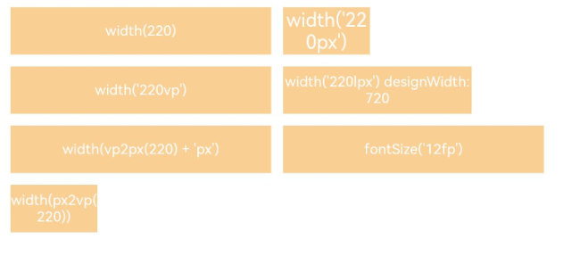

# Pixel Units
<!--Kit: ArkUI-->
<!--Subsystem: ArkUI-->
<!--Owner: @fangzhiyuan1-->
<!--Designer: @fangzhiyuan1-->
<!--Tester: @gouyuanyuan-->
<!--Adviser: @Brilliantry_Rui-->
<!-- md-trans-meta sourceCommit=ca610c3b31eac2a84ffac21a107ce522b473feb1 translatedAt=2026-09-01T11:38:31.203Z pushedAt=2026-09-02T11:24:48.483Z -->

ArkUI provides four pixel units, with vp as the reference data unit.

> **NOTE**
>
> - The initial APIs of this module are supported since API version 7. Newly added APIs will be marked with a superscript to indicate their earliest API version.
>
> - Directly using vp2px/px2vp/fp2px/px2fp/lpx2px/px2lpx may cause issues due to [ambiguous UI context](../../../ui/arkts-global-interface.md#ambiguous-ui-context). The following APIs are deprecated since API version 18. You are advised to obtain a [UIContext](../arkts-apis-uicontext-uicontext.md) instance via **getUIContext()** and then use the [vp2px](../arkts-apis-uicontext-uicontext.md#vp2px12)/[px2vp](../arkts-apis-uicontext-uicontext.md#px2vp12)/[fp2px](../arkts-apis-uicontext-uicontext.md#fp2px12)/[px2fp](../arkts-apis-uicontext-uicontext.md#px2fp12)/[lpx2px](../arkts-apis-uicontext-uicontext.md#lpx2px12)/[px2lpx](../arkts-apis-uicontext-uicontext.md#px2lpx12) under **UIContext** to call instance-bound APIs.
>
> - When no UI instance is created, vp2px/px2vp uses the default screen's virtual pixel ratio for conversion. In this scenario, if you need to replace this API with a UIContext-based one, refer to [Replacing Pixel Unit Conversion APIs with UIContext APIs](../../../ui/arkts-global-interface.md#replacing-pixel-unit-conversion-apis-with-uicontext-apis).

## Basic Pixel Units

| Name| Description                                                        |
| ---- | ------------------------------------------------------------ |
| px   | Physical pixel unit of the screen.                                          |
| vp   | Pixel unit specific to the screen density. Pixels in this unit are converted into physical pixels of the screen based on the screen pixel density. This unit is used for values whose unit is not specified.<br> **NOTE**<br>The ratio of vp to px is subject to the screen pixel density.|
| fp   | Font pixel, similar to vp, adapts to changes in screen pixel density and changes with the system font size setting. |
| lpx  | Logical pixel unit of the window. It is the ratio of the actual screen width to the logical width (configured by [designWidth](../../../quick-start/module-configuration-file.md#pages)). For example, if **designWidth** is set to **720** (default value), then 1 lpx is equal to 2 px for a screen with an actual width of 1440 physical pixels.|

## vp2px<sup>(deprecated)</sup>

vp2px(value: number): number

Converts a value in units of vp to a value in units of px.

> **NOTE**
>
> By default, the virtual pixel ratio of the screen hosting the current UI instance is used for unit conversion. If the UI instance cannot be identified, the virtual pixel ratio of the default screen is used instead, which may lead to unexpected conversion results.
>
> This API is supported since API version 7 and deprecated since API version 18. You are advised to use [vp2px](../arkts-apis-uicontext-uicontext.md#vp2px12) instead.

**Widget capability**: This API can be used in ArkTS widgets since API version 9.

**Atomic service API**: This API can be used in atomic services since API version 11.

**System capability**: SystemCapability.ArkUI.ArkUI.Full

**Parameters**

| Name| Type  | Mandatory| Description                                  |
| ------ | ------ | ---- | -------------------------------------- |
| value | number | Yes  | Value to convert.<br>Value range: (-∞, +∞).|

**Return value**

| Type  | Description          |
| ------ | -------------- |
| number | Converted value, in px.<br/>Value range: (-∞, +∞) |

## px2vp<sup>(deprecated)</sup>

px2vp(value: number): number

Converts a value in units of px to a value in units of vp.

> **NOTE**
>
> By default, the virtual pixel ratio of the screen hosting the current UI instance is used for unit conversion. If the UI instance cannot be identified, the virtual pixel ratio of the default screen is used instead, which may lead to unexpected conversion results.
>
> This API is supported since API version 7 and deprecated since API version 18. You are advised to use [px2vp](../arkts-apis-uicontext-uicontext.md#px2vp12) instead.

**Widget capability**: This API can be used in ArkTS widgets since API version 9.

**Atomic service API**: This API can be used in atomic services since API version 11.

**System capability**: SystemCapability.ArkUI.ArkUI.Full

**Parameters**

| Name| Type  | Mandatory| Description                                  |
| ------ | ------ | ---- | -------------------------------------- |
| value | number | Yes  | Value to convert.<br>Value range: (-∞, +∞).|

**Return value**

| Type  | Description          |
| ------ | -------------- |
| number | Converted value, in vp.<br/>Value range: (-∞, +∞) |

## fp2px<sup>(deprecated)</sup>

fp2px(value: number): number

Converts a value in units of fp to a value in units of px.

> **NOTE**
>
> This API is supported since API version 7 and deprecated since API version 18. You are advised to use [fp2px](../arkts-apis-uicontext-uicontext.md#fp2px12) instead.

**Widget capability**: This API can be used in ArkTS widgets since API version 9.

**Atomic service API**: This API can be used in atomic services since API version 11.

**System capability**: SystemCapability.ArkUI.ArkUI.Full

**Parameters**

| Name| Type  | Mandatory| Description                                  |
| ------ | ------ | ---- | -------------------------------------- |
| value | number | Yes | Used to convert a value in fp to a value in px. fp is affected by both the screen pixel density and the system font size settings. During conversion, the value is calculated based on the current screen virtual pixel ratio and font scale factor.<br/>Value range: (-∞, +∞) |

**Return value**

| Type  | Description          |
| ------ | -------------- |
| number | Converted value, in px.<br/>Value range: (-∞, +∞) |

## px2fp<sup>(deprecated)</sup>

px2fp(value: number): number

Converts a value in units of px to a value in units of fp.

> **NOTE**
>
> This API is supported since API version 7 and deprecated since API version 18. You are advised to use [px2fp](../arkts-apis-uicontext-uicontext.md#px2fp12) instead.

**Widget capability**: This API can be used in ArkTS widgets since API version 9.

**Atomic service API**: This API can be used in atomic services since API version 11.

**System capability**: SystemCapability.ArkUI.ArkUI.Full

**Parameters**

| Name| Type  | Mandatory| Description                                  |
| ------ | ------ | ---- | -------------------------------------- |
| value | number | Yes | Used to convert a value in px to a value in fp. fp is affected by both the screen pixel density and the system font size setting. During conversion, the value is calculated by combining the current screen virtual pixel ratio and the font scale factor.<br/>Value range: (-∞, +∞) |

**Return value**

| Type  | Description          |
| ------ | -------------- |
| number | Converted value, unit: fp.<br/>Value range: (-∞, +∞) |

## lpx2px<sup>(deprecated)</sup>

lpx2px(value: number): number

Converts a value in units of lpx to a value in units of px.

> **NOTE**
>
> This API is supported since API version 7 and deprecated since API version 18. You are advised to use [lpx2px](../arkts-apis-uicontext-uicontext.md#lpx2px12) instead.

**Widget capability**: This API can be used in ArkTS widgets since API version 9.

**Atomic service API**: This API can be used in atomic services since API version 11.

**System capability**: SystemCapability.ArkUI.ArkUI.Full

**Parameters**

| Name| Type  | Mandatory| Description                                  |
| ------ | ------ | ---- | -------------------------------------- |
| value | number | Yes | Used to convert a value in lpx to a value in px. The conversion ratio between lpx and px depends on the ratio of the actual screen width to the logical width (configured through **designWidth**).<br/>Value range: (-∞, +∞) |

**Return value**

| Type  | Description          |
| ------ | -------------- |
| number | Converted value, in px.<br/>Value range: (-∞, +∞) |

## px2lpx<sup>(deprecated)</sup>

px2lpx(value: number): number

Converts a value in units of px to a value in units of lpx.

> **NOTE**
>
> This API is supported since API version 7 and deprecated since API version 18. You are advised to use [px2lpx](../arkts-apis-uicontext-uicontext.md#px2lpx12) instead.

**Widget capability**: This API can be used in ArkTS widgets since API version 9.

**Atomic service API**: This API can be used in atomic services since API version 11.

**System capability**: SystemCapability.ArkUI.ArkUI.Full

**Parameters**

| Name| Type  | Mandatory| Description                                  |
| ------ | ------ | ---- | -------------------------------------- |
| value | number | Yes | Used to convert a value in px to a value in lpx. The conversion ratio between lpx and px depends on the ratio of the actual screen width to the logical width (configured through **designWidth**).<br/>Value range: (-∞, +∞) |

**Return value**

| Type  | Description          |
| ------ | -------------- |
| number | Converted value, in lpx.<br/>Value range: (-∞, +∞) |

## Example

```ts
// xxx.ets
@Entry
@Component
struct Example {
  build() {
    Column() {
      Flex({ wrap: FlexWrap.Wrap }) {
        Column() {
          Text('width(220)')
            .width(220)
            .height(40)
            .backgroundColor(0xF9CF93)
            .textAlign(TextAlign.Center)
            .fontColor(Color.White)
            .fontSize('12vp')
        }.margin(5)

        Column() {
          Text("width('220px')")
            .width('220px')
            .height(40)
            .backgroundColor(0xF9CF93)
            .textAlign(TextAlign.Center)
            .fontColor(Color.White)
        }.margin(5)

        Column() {
          Text("width('220vp')")
            .width('220vp')
            .height(40)
            .backgroundColor(0xF9CF93)
            .textAlign(TextAlign.Center)
            .fontColor(Color.White)
            .fontSize('12vp')
        }.margin(5)

        Column() {
          Text("width('220lpx') designWidth:720")
            .width('220lpx')
            .height(40)
            .backgroundColor(0xF9CF93)
            .textAlign(TextAlign.Center)
            .fontColor(Color.White)
            .fontSize('12vp')
        }.margin(5)

        Column() {
          Text("width(getUIContext().vp2px(220) + 'px')")
            .width(this.getUIContext().vp2px(220) + 'px')
            .height(40)
            .backgroundColor(0xF9CF93)
            .textAlign(TextAlign.Center)
            .fontColor(Color.White)
            .fontSize('12vp')
        }.margin(5)

        Column() {
          Text("fontSize('12fp')")
            .width(220)
            .height(40)
            .backgroundColor(0xF9CF93)
            .textAlign(TextAlign.Center)
            .fontColor(Color.White)
            .fontSize('12fp')
        }.margin(5)

        Column() {
          Text('width(px2vp(220))')
            .width(this.getUIContext().px2vp(220))
            .height(40)
            .backgroundColor(0xF9CF93)
            .textAlign(TextAlign.Center)
            .fontColor(Color.White)
            .fontSize('12fp')
        }.margin(5)
      }.width('100%')
    }
  }
}
```


