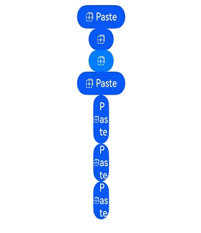

# PasteButton

<!--Kit: ArkUI-->
<!--Subsystem: Security-->
<!--Owner: @harylee-->
<!--Designer: @linshuqing; @hehehe-li-->
<!--Tester: @leiyuqian-->
<!--Adviser: @zengyawen-->

## Overview

**PasteButton** is a security component that provides paste functionality. When users tap this component, the application temporarily gains pasteboard read permissions.

> **NOTE**
>
> This component is supported since API version 10. Updates will be marked with a superscript to indicate their earliest API version.

## Key Classes and APIs

### Key Enums

- [PasteIconStyle](#pasteiconstyle): Enumeration of icon styles for the paste button. Specifies the icon style displayed.
- [PasteDescription](#pastedescription): Enumeration of text descriptions for the paste button. Specifies the text description displayed.
- [PasteButtonOnClickResult](#pastebuttononclickresult): Enumeration of click results for the paste button. Indicates whether authorization succeeds after a click.

### Key APIs

- [PasteButtonOptions](#pastebuttonoptions): Configuration object for the paste button. Defines properties including icon, text and button type.
- [PasteButtonCallback](#pastebuttoncallback18): Callback for paste button clicks. Returns click events, authorization results and error messages.

## Child Components

Not supported

## APIs

### PasteButton

PasteButton()

Creates a **PasteButton** component with an icon, text, and background by default. After creation, the system triggers an authorization check when the button is tapped. Upon successful authorization, the application gains permission to read the current clipboard content.

You may want to learn the [restrictions on security component styles](../../../security/AccessToken/security-component-overview.md#constraints) to avoid authorization failures caused by incompliant styles.

**Model restriction:** This API can be used only in the stage model.

**Atomic service API**: This API can be used in atomic services since API version 11.

**System capability**: SystemCapability.ArkUI.ArkUI.Full

### PasteButton

PasteButton(options: PasteButtonOptions)

Creates a paste button with the specified icon, text and button type. After creation, the system triggers an authorization check when the button is tapped. Upon successful authorization, the app gains temporary permission to read the clipboard.

You may want to learn the [restrictions on security component styles](../../../security/AccessToken/security-component-overview.md#constraints) to avoid authorization failures caused by incompliant styles.

**Model restriction:** This API can be used only in the stage model.

**Atomic service API**: This API can be used in atomic services since API version 11.

**System capability**: SystemCapability.ArkUI.ArkUI.Full

**Parameters**

| Name| Type| Mandatory| Description|
| -------- | -------- | -------- | -------- |
| options | [PasteButtonOptions](#pastebuttonoptions) | Yes| Configuration options for the paste button, used to set properties such as icon, text and button type. You are advised to explicitly set at least one of **icon** or **text** to help users identify the button.<br>If neither **icon** nor **text** is specified, **options** does not take effect and the button is displayed in the default style.<br>{<br>icon: PasteIconStyle.LINES,<br>text: PasteDescription.PASTE,<br>buttonType: ButtonType.Capsule <br>}   |

## PasteButtonOptions

Defines options for the paste button, including icon, text and button type.

> **NOTE**
>
> - You are advised to specify at least one of **icon** or **text**.
> - If neither **icon** nor **text** is specified, **PasteButton** is created with default styles as follows: **PasteIconStyle** defaults to **LINES**, **PasteDescription** to **PASTE**, and **ButtonType** to **Capsule**.
> - The **icon**, **text**, and **buttonType** parameters do not support dynamic modification. Styles and properties of security components are verified by the system upon creation. Dynamic changes may cause the component to violate specifications for security components and invalidate authorization.

**Model restriction:** This API can be used only in the stage model.

**Atomic service API**: This API can be used in atomic services since API version 11.

**System capability**: SystemCapability.ArkUI.ArkUI.Full

| Name| Type| Read-Only| Optional| Description|
| -------- | -------- | -------- | -------- | -------- |
| icon | [PasteIconStyle](#pasteiconstyle) | No| Yes| Icon style of the **PasteButton** component.<br>If this parameter is not specified, no icon is displayed. If neither **icon** nor **text** is provided, the component uses the default style.|
| text | [PasteDescription](#pastedescription) | No| Yes| Text on the **PasteButton** component.<br>If this parameter is not specified, no text is displayed. If neither **text** nor **icon** is provided, the component uses the default style.|
| buttonType | [ButtonType](ts-securitycomponent-attributes.md#buttontype) | No| Yes| Shape of the **PasteButton** component. The value defaults to **ButtonType.Capsule** if this parameter is not specified. Use this parameter to customize the button shape.|

## Attributes

This component can only inherit the [universal attributes of security components](ts-securitycomponent-attributes.md).

## PasteIconStyle

Enumerates icon styles of the **PasteButton** component.

**Model restriction:** This API can be used only in the stage model.

**Atomic service API**: This API can be used in atomic services since API version 11.

**System capability**: SystemCapability.ArkUI.ArkUI.Full

| Name| Value| Description|
| -------- | -------- | -------- |
| LINES | 0 | Line style icon.|

## PasteDescription

Enumerates text descriptions of the **PasteButton** component.

**Model restriction:** This API can be used only in the stage model.

**Atomic service API**: This API can be used in atomic services since API version 11.

**System capability**: SystemCapability.ArkUI.ArkUI.Full

| Name| Value| Description|
| -------- | -------- | -------- |
| PASTE | 0 | The text on the **PasteButton** component is **Paste**.|

## PasteButtonOnClickResult

Enumerates the authorization results after the **PasteButton** component is tapped.

**Model restriction:** This API can be used only in the stage model.

**Atomic service API**: This API can be used in atomic services since API version 11.

**System capability**: SystemCapability.ArkUI.ArkUI.Full

| Name| Value| Description|
| -------- | -------- | -------- |
| SUCCESS | 0 | Authorization is successful.|
| TEMPORARY_AUTHORIZATION_FAILED | 1 | Authorization fails.|

## PasteButtonCallback<sup>18+</sup>

type PasteButtonCallback = (event: ClickEvent, result: PasteButtonOnClickResult, error?: BusinessError&lt;void&gt;) =&gt; void

Triggered when the **PasteButton** component is clicked.

**Model restriction:** This API can be used only in the stage model.

**Atomic service API**: This API can be used in atomic services since API version 18.

**System capability**: SystemCapability.ArkUI.ArkUI.Full

**Parameters**

| Name| Type                  | Mandatory| Description                  |
|------------|------|-------|---------|
| event | [ClickEvent](ts-universal-events-click.md#clickevent) | Yes| Click event object, which includes information such as click position, timestamp and input device.|
| result | [PasteButtonOnClickResult](#pastebuttononclickresult)| Yes| Authorization result for clipboard access permission. A return value of **SUCCESS** means temporary read permission for current clipboard content is granted, and clipboard reading operations can proceed. A return value of **TEMPORARY_AUTHORIZATION_FAILED** means the authorization failed, and you must not attempt to read clipboard content.|
| error | [BusinessError&lt;void&gt;](../../apis-basic-services-kit/js-apis-base.md#businesserror) | No| Error code and message when the component is clicked. The value is **undefined** if the parameter is not specified. Use the **result** parameter to determine the authorization status.<br>Error code 1 indicates an internal system error. Check the system status and try again.<br>Error code 2 indicates property configuration errors, including but not limited to:<br>1. The font or icon size is too small.<br>2. The font or icon color is similar to the component background color.<br>3. The font or icon color is too transparent.<br>4. The padding is negative.<br>5. The component is obscured by other components or windows.<br>6. Text extends beyond the component background area.<br>7. The component exceeds the window or screen bounds.<br>8. The component size is too large.<br>9. The component text is truncated and not fully displayed.<br>10. Improper settings of some security component properties prevent the component from displaying correctly.|

## Events

Only the following events are supported.

### onClick

onClick(event: PasteButtonCallback)

Triggered when the paste button is clicked, returning the authorization result. Upon successful authorization, the application obtains temporary permission to read clipboard content.

You may want to learn the [restrictions on security component styles](../../../security/AccessToken/security-component-overview.md#constraints) to avoid authorization failures caused by incompliant styles.

**Model restriction:** This API can be used only in the stage model.

**Atomic service API**: This API can be used in atomic services since API version 11.

**System capability**: SystemCapability.ArkUI.ArkUI.Full

**Parameters**

| Name| Type                  | Mandatory| Description                  |
|------------|------|-------|---------|
| event | [PasteButtonCallback](#pastebuttoncallback18) | Yes| Callback for the click event, used to handle the authorization result after the paste button is clicked.<br>From API version 10 to 17, the parameter type is (event: [ClickEvent](ts-universal-events-click.md#clickevent), result: [PasteButtonOnClickResult](#pastebuttononclickresult)) => void. Starting from API version 18, **PasteButtonCallback** is adopted uniformly, which additionally provides error information.|

## Example

```ts
// xxx.ets
import { BusinessError } from '@kit.BasicServicesKit';

@Entry
@Component
struct Index {
  // Define the callback for processing the authorization result and error information when the paste button is clicked.
  handlePasteButtonClick: PasteButtonCallback =
    (event: ClickEvent, result: PasteButtonOnClickResult, error?: BusinessError<void>) => {
      if (result === PasteButtonOnClickResult.SUCCESS) {
        console.info('success');
      } else {
        console.error('errCode: ' + error?.code);
        console.error('errMessage: ' + error?.message);
      }
    };

  build() {
    Row() {
      Column({ space: 10 }) {
        // Create a default SaveButton component with an icon, text, and background.
        PasteButton().onClick(this.handlePasteButtonClick)
        // Whether an element is contained depends on whether the parameter corresponding to the element is specified. If buttonType is not passed in, the button uses the ButtonType.Capsule settings.
        PasteButton({ icon: PasteIconStyle.LINES })
        // Create a button with only an icon and background. If the alpha value of the most significant eight bits of the background color is less than 0x1a, the system forcibly adjusts the alpha value to 0xff.
        PasteButton({ icon: PasteIconStyle.LINES, buttonType: ButtonType.Capsule })
          .backgroundColor(0x10007dff)
        // Create a button with an icon, text, and background. If the alpha value of the most significant eight bits of the background color is less than 0x1a, the system forcibly adjusts the alpha value to 0xff.
        PasteButton({ icon: PasteIconStyle.LINES, text: PasteDescription.PASTE, buttonType: ButtonType.Capsule })
        // Create a button with an icon, text, and background. If the set width is less than the minimum allowed, the button's text will wrap to guarantee full text display.
        PasteButton({ icon: PasteIconStyle.LINES, text: PasteDescription.PASTE, buttonType: ButtonType.Capsule })
          .fontSize(16)
          .width(30)
        // Create a button with an icon, text, and background. If the set width is less than the minimum allowed, the button's text will wrap to guarantee full text display.
        PasteButton({ icon: PasteIconStyle.LINES, text: PasteDescription.PASTE, buttonType: ButtonType.Capsule })
          .fontSize(16)
          .size({ width: 30, height: 30 })
        // Create a button with an icon, text, and background. If the set width is less than the minimum allowed, the button's text will wrap to guarantee full text display.
        PasteButton({ icon: PasteIconStyle.LINES, text: PasteDescription.PASTE, buttonType: ButtonType.Capsule })
          .fontSize(16)
          .constraintSize({
            minWidth: 0,
            maxWidth: 30,
            minHeight: 0,
            maxHeight: 30
          })
      }.width('100%')
    }.height('100%')
  }
}
```


