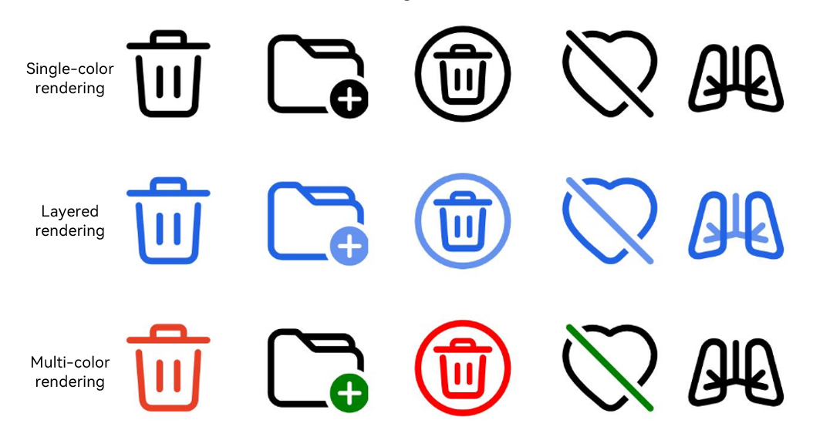

# SaveButton

<!--Kit: ArkUI-->
<!--Subsystem: Security-->
<!--Owner: @harylee-->
<!--Designer: @linshuqing; @hehehe-li-->
<!--Tester: @leiyuqian-->
<!--Adviser: @zengyawen-->

## Overview

**SaveButton** is a system API for the save security control. It applies to scenarios where apps need temporary media library access permissions to save images or videos, such as saving images to albums and exporting media content.

After the **SaveButton** component is integrated into an app, a confirmation dialog will appear when the user taps the component for the first time. If the user allows access, the app obtains temporary authorization to call media library APIs. For related APIs, see [Interface (PhotoAccessHelper)](../../apis-media-library-kit/arkts-apis-photoAccessHelper-PhotoAccessHelper.md). If the user denies access or dismisses the dialog, authorization will not be granted for this operation. No dialog box will appear for subsequent uses.

For API version 19 and earlier, the authorization duration is 10 seconds. For API version 20 and later, the authorization duration is 1 minute.

You need to call media library APIs to obtain file handles and complete temporary-authorized operations such as creating media resources within the authorization period. After authorization expires, existing file handles acquired during the valid period remain available for read and write operations.

> **NOTE**
>
> This component is supported since API version 10. Updates will be marked with a superscript to indicate their earliest API version.

## Key Classes and APIs

### Key Enums

- [SaveIconStyle](#saveiconstyle): Enumeration of icon styles for the save button. Specifies the icon style displayed.
- [SaveDescription](#savedescription): Enumeration of text descriptions for the save button. Specifies the text description displayed.
- [SaveButtonOnClickResult](#savebuttononclickresult): Enumeration of click results for the save button. Indicates whether authorization succeeds after a click.

### Key APIs

- [SaveButtonOptions](#savebuttonoptions): Configuration object for the save button. Defines properties including icon, text and button type.
- [SaveButtonCallback](#savebuttoncallback18): Callback for save button clicks. Returns click events, authorization results and error messages.

## Child Components

Not supported

## APIs

### SaveButton

SaveButton()

Creates a **SaveButton** component with an icon, text, and background. When the user taps the save button for the first time, a dialog will pop up. Once the user grants permission, the app obtains temporary authorization to access media library APIs. No dialog box will appear for subsequent uses.

In API version 19 or earlier, authorization remains valid for 10 seconds. After authorization expires, existing file handles acquired during the valid period remain available for read and write operations.

In API version 20 or later, authorization remains valid for 1 minute. After authorization expires, existing file handles acquired during the valid period remain available for read and write operations.

You may want to learn the [restrictions on security component styles](../../../security/AccessToken/security-component-overview.md#constraints) to avoid authorization failures caused by incompliant styles.

**Model restriction:** This API can be used only in the stage model.

**Atomic service API**: This API can be used in atomic services since API version 11.

**System capability**: SystemCapability.ArkUI.ArkUI.Full

### SaveButton

SaveButton(options: SaveButtonOptions)

Creates a save button with the specified icon, text and button type. When the user taps the save button for the first time, a dialog will pop up. Once the user grants permission, the app obtains temporary authorization to access media library APIs. No dialog box will appear for subsequent uses.

In API version 19 or earlier, authorization remains valid for 10 seconds. After authorization expires, existing file handles acquired during the valid period remain available for read and write operations.

In API version 20 or later, authorization remains valid for 1 minute. After authorization expires, existing file handles acquired during the valid period remain available for read and write operations.

You may want to learn the [restrictions on security component styles](../../../security/AccessToken/security-component-overview.md#constraints) to avoid authorization failures caused by incompliant styles.

**Model restriction:** This API can be used only in the stage model.

**Atomic service API**: This API can be used in atomic services since API version 11.

**System capability**: SystemCapability.ArkUI.ArkUI.Full

**Parameters**

| Name| Type| Mandatory| Description|
| -------- | -------- | -------- | -------- |
| options | [SaveButtonOptions](#savebuttonoptions) | Yes| Configuration options for the save button, used to set properties such as icon, text and button type.<br>You are advised to explicitly set at least one of **icon** and **text** to help users identify the button. If both are not specified, the component uses the default style.|

## SaveButtonOptions

Defines options for the save button, including icon, text, and button type.

> **NOTE**
>
> - You are advised to specify at least one of **icon** or **text**.
> - If neither **icon** nor **text** is specified, **SaveButton** is created with default styles as follows: **SaveIconStyle** defaults to **FULL_FILLED**, **SaveDescription** to **DOWNLOAD**, and **ButtonType** to **Capsule**.
> - The **icon**, **text**, and **buttonType** parameters do not support dynamic modification.

**Model restriction:** This API can be used only in the stage model.

**Atomic service API**: This API can be used in atomic services since API version 11.

**System capability**: SystemCapability.ArkUI.ArkUI.Full

| Name| Type| Read-Only| Optional| Description|
| -------- | -------- | -------- | -------- | -------- |
| icon | [SaveIconStyle](#saveiconstyle) | No| Yes| Icon style of the **SaveButton** component.<br>If this parameter is not specified, no icon is displayed. If neither **icon** nor **text** is provided, the component uses the default style.|
| text | [SaveDescription](#savedescription) | No| Yes| Text on the **SaveButton** component.<br>If this parameter is not specified, no text is displayed. If neither **text** nor **icon** is provided, the component uses the default style.|
| buttonType | [ButtonType](ts-securitycomponent-attributes.md#buttontype) | No| Yes| Background type of the **SaveButton** component.<br>Default value: **ButtonType.Capsule**|

## SaveIconStyle

Enumerates icon styles of the **SaveButton** component.

**Model restriction:** This API can be used only in the stage model.

**Atomic service API**: This API can be used in atomic services since API version 11.

**System capability**: SystemCapability.ArkUI.ArkUI.Full

| Name| Value| Description|
| -------- | -------- | -------- |
| FULL_FILLED | 0 | Filled style icon.|
| LINES | 1 | Line style icon.|

## SaveDescription

Enumerates text descriptions of the **SaveButton** component.

**Model restriction:** This API can be used only in the stage model.

**System capability**: SystemCapability.ArkUI.ArkUI.Full

| Name| Value| Description|
| -------- | -------- | -------- |
| DOWNLOAD | 0 | The text on the **SaveButton** component is **Download**.<br>**Atomic service API**: This API can be used in atomic services since API version 11.|
| DOWNLOAD_FILE | 1 | The text on the **SaveButton** component is **Download file**.<br>**Atomic service API**: This API can be used in atomic services since API version 11.|
| SAVE | 2 | The text on the **SaveButton** component is **Save**.<br>**Atomic service API**: This API can be used in atomic services since API version 11.|
| SAVE_IMAGE | 3 | The text on the **SaveButton** component is **Save image**.<br>**Atomic service API**: This API can be used in atomic services since API version 11.|
| SAVE_FILE | 4 | The text on the **SaveButton** component is **Save file**.<br>**Atomic service API**: This API can be used in atomic services since API version 11.|
| DOWNLOAD_AND_SHARE | 5 | The text on the **SaveButton** component is **Download & share**.<br>**Atomic service API**: This API can be used in atomic services since API version 11.|
| RECEIVE | 6 | The text on the **SaveButton** component is **Receive**.<br>**Atomic service API**: This API can be used in atomic services since API version 11.|
| CONTINUE_TO_RECEIVE | 7 | The text on the **SaveButton** component is **Continue**.<br>**Atomic service API**: This API can be used in atomic services since API version 11.|
| SAVE_TO_GALLERY<sup>12+</sup> | 8 | The text on the **SaveButton** component is **Save to Gallery**.<br>**Atomic service API**: This API can be used in atomic services since API version 12.|
| EXPORT_TO_GALLERY<sup>12+</sup> | 9 | The text on the **SaveButton** component is **Export**.<br>**Atomic service API**: This API can be used in atomic services since API version 12.|
| QUICK_SAVE_TO_GALLERY<sup>12+</sup> | 10 | The text on the **SaveButton** component is **Save to Gallery**.<br>**Atomic service API**: This API can be used in atomic services since API version 12.|
| RESAVE_TO_GALLERY<sup>12+</sup> | 11 | The text on the **SaveButton** component is **Resave**.<br>**Atomic service API**: This API can be used in atomic services since API version 12.|
| SAVE_ALL<sup>18+</sup> | 12 | The text on the **SaveButton** component is **Save all**.<br>**Atomic service API**: This API can be used in atomic services since API version 18.|

## SaveButtonOnClickResult

Enumerates the authorization results after the **SaveButton** component is tapped.

**Model restriction:** This API can be used only in the stage model.

**System capability**: SystemCapability.ArkUI.ArkUI.Full

| Name| Value| Description|
| -------- | -------- | -------- |
| SUCCESS | 0 | Authorization is successful.<br>**Atomic service API**: This API can be used in atomic services since API version 11.|
| TEMPORARY_AUTHORIZATION_FAILED | 1 | Authorization fails.<br>**Atomic service API**: This API can be used in atomic services since API version 11.|
| CANCELED_BY_USER<sup>21+</sup>  | 2 | Authorization is canceled by the user through a dialog box after the **SaveButton** component is clicked. This value is returned in the callback result only when [userCancelEvent](#usercancelevent21) is triggered with its parameter set to **true**.<br>**Atomic service API**: This API can be used in atomic services since API version 21.|

## SaveButtonCallback<sup>18+</sup>

type SaveButtonCallback = (event: ClickEvent, result: SaveButtonOnClickResult, error?: BusinessError&lt;void&gt;) =&gt; void

Triggered when the **SaveButton** component is clicked.

**Model restriction:** This API can be used only in the stage model.

**Atomic service API**: This API can be used in atomic services since API version 18.

**System capability**: SystemCapability.ArkUI.ArkUI.Full

**Parameters**

| Name| Type                  | Mandatory| Description                  |
|------------|------|-------|---------|
| event | [ClickEvent](ts-universal-events-click.md#clickevent) | Yes| Click event object, which includes information such as click position, timestamp, and input device.|
| result | [SaveButtonOnClickResult](#savebuttononclickresult)| Yes| Authorization result. Returns **SUCCESS** if temporary authorization is granted for the save operation, and media library APIs can be accessed. Returns **TEMPORARY_AUTHORIZATION_FAILED** if temporary authorization fails and users cannot proceed with subsequent save actions. Returns **CANCELED_BY_USER** if users manually cancel authorization in the dialog box. This result is returned only when [userCancelEvent](#usercancelevent21) is called with its parameter set to **true**. If **userCancelEvent** is not set to **true**, **TEMPORARY_AUTHORIZATION_FAILED** is returned when users cancel authorization instead.|
| error | [BusinessError&lt;void&gt;](../../apis-basic-services-kit/js-apis-base.md#businesserror) | No| Error code and message when the component is clicked. If this parameter is not specified, the value is **undefined**. Use the **result** parameter to determine the authorization status.<br>Error code 1 indicates an internal system error. Possible causes and solutions are as follows:<br>1. Inter-Process Communication (IPC) failure. Check the system status and try again.<br>2. Failed to display the security component dialog box. Check whether the save button is blocked or complies with style constraints for security components. Correct the issues and retry.<br>Error code 2 indicates invalid property settings. Possible causes are as follows:<br>1. The font or icon size is too small.<br>2. The font or icon color is too similar to the background color.<br>3. The font or icon color is too transparent.<br>4. The padding is negative.<br>5. The component is obscured by other components or windows.<br>6. Text extends beyond the component background area.<br>7. The component exceeds the window or screen bounds.<br>8. The component size is too large.<br>9. The component text is truncated and not fully displayed.<br>10. Other improper property settings affect the display of the security component.|


## Attributes

Universal attributes are not supported. This component supports the attributes listed below, as well as [universal attributes of security components](ts-securitycomponent-attributes.md).

### setIcon<sup>20+</sup>

setIcon(icon: Resource)

Sets the icon of the **SaveButton** component.

**Model restriction:** This API can be used only in the stage model.

**Required permissions**: ohos.permission.CUSTOMIZE_SAVE_BUTTON

**Atomic service API**: This API can be used in atomic services since API version 20.

**System capability**: SystemCapability.ArkUI.ArkUI.Full

**Parameters**

| Name| Type                  | Mandatory| Description                  |
|------------|------|-------|---------|
| icon | [Resource](ts-types.md#resource) | Yes| Custom icon resource information. Only data sources of the Resource type are supported.<br>Images in the following formats are supported: PNG, JPG, JPEG, BMP, SVG, WebP, GIF, and HEIF. For details about the supported image formats, see [Image](ts-basic-components-image.md). If the resource is not an image resource or the format is not supported, the icon is displayed as blank.<br>Since API version 26.0.0, data sources of the Resource type in Symbol format are supported.<br>If the app does not have the **ohos.permission.CUSTOMIZE_SAVE_BUTTON** permission, the custom icon does not take effect and the save button uses the default style.|

### setText<sup>20+</sup>

setText(text: string | Resource)

Sets the text of the **SaveButton** component.

**Model restriction:** This API can be used only in the stage model.

**Required permissions**: ohos.permission.CUSTOMIZE_SAVE_BUTTON

**Atomic service API**: This API can be used in atomic services since API version 20.

**System capability**: SystemCapability.ArkUI.ArkUI.Full

**Parameters**

| Name| Type                  | Mandatory| Description                  |
|------------|------|-------|---------|
| text | string \| [Resource](ts-types.md#resource) | Yes| Custom text, used to replace the default system text for business-specific scenarios. When a string is passed, the text content is directly used. When a Resource is passed, multi-language adaptation is implemented via resource management.<br>If the app does not have the **ohos.permission.CUSTOMIZE_SAVE_BUTTON** permission, this setting does not take effect and the save button uses the default style.|

### iconSize<sup>20+</sup>

iconSize(size: Dimension | SizeOptions)

Sets the icon size of the **SaveButton** component.

**Model restriction:** This API can be used only in the stage model.

**Atomic service API**: This API can be used in atomic services since API version 20.

**System capability**: SystemCapability.ArkUI.ArkUI.Full

**Parameters**

| Name| Type                  | Mandatory| Description                  |
|------------|------|-------|---------|
| size | [Dimension](ts-types.md#dimension10) \| [SizeOptions](ts-types.md#sizeoptions) | Yes| Icon size. Pixel units such as vp and px are supported. The default width and height are 16 vp.<br>Percentage strings are not supported. If a percentage string is passed as a Dimension parameter, the icon will be displayed with the default size. If either the **width** or **height** property of a SizeOptions type parameter is set to a percentage string, the icon will be displayed with a size of 0 vp.<br>For the system icons provided by the **SaveButton** component:<br>- Dimension type: Width and height are both set to the specified value.<br>- SizeOptions type: If width and height are different, the smaller value is used for both. If only one value is specified, it applies to both dimensions. This rule ensures square display and consistent visual appearance of system icons.<br>For custom icons:<br>- Dimension type: Width and height are both set to the specified value.<br>- SizeOptions type: It is recommended that you set both width and height explicitly; if only one value is set, it applies to both dimensions. Custom icons support flexible sizing to adapt to different image aspect ratios.<br>- If the specified size's aspect ratio does not match the custom icon's original ratio, the icon displays in [ImageFit.Cover](ts-appendix-enums.md#imagefit) mode.|

### iconBorderRadius<sup>20+</sup>

iconBorderRadius(radius: Dimension | BorderRadiuses)

Sets the corner radius of the **SaveButton** component.

**Model restriction:** This API can be used only in the stage model.

**Required permissions**: ohos.permission.CUSTOMIZE_SAVE_BUTTON

**Atomic service API**: This API can be used in atomic services since API version 20.

**System capability**: SystemCapability.ArkUI.ArkUI.Full

**Parameters**

| Name| Type                  | Mandatory| Description                  |
|------------|------|-------|---------|
| radius | [Dimension](ts-types.md#dimension10) \| [BorderRadiuses](ts-types.md#borderradiuses9) | Yes| Corner radius of the **SaveButton** component. You can set the radius for each of the four corners individually.<br>The default value is 0 vp for all four corners. Units such as vp and px are supported, and valid values are greater than or equal to 0. Negative values are automatically clamped to **0**.<br>If the app does not have the **ohos.permission.CUSTOMIZE_SAVE_BUTTON** permission, the corner radius setting of the icon does not take effect.|

### stateEffect<sup>20+</sup>

stateEffect(enabled: boolean)

Sets the press effect of the **SaveButton** component.

**Model restriction:** This API can be used only in the stage model.

**Required permissions**: ohos.permission.CUSTOMIZE_SAVE_BUTTON

**Atomic service API**: This API can be used in atomic services since API version 20.

**System capability**: SystemCapability.ArkUI.ArkUI.Full

**Parameters**

| Name| Type                  | Mandatory| Description                  |
|------------|------|-------|---------|
| enabled | boolean | Yes| Whether to enable the press effect. **true** to enable, **false** otherwise.<br>Default value: **true**.<br>If the app does not have the **ohos.permission.CUSTOMIZE_SAVE_BUTTON** permission, the press effect setting does not take effect.|

### userCancelEvent<sup>21+</sup>

userCancelEvent(enabled: boolean)

Sets the user authorization cancellation event for the **SaveButton** component. This API can be used to distinguish between user cancellation and authorization failures for differentiated service logic, such as logging user behaviors or prompting users to retry.

**Model restriction:** This API can be used only in the stage model.

**Atomic service API**: This API can be used in atomic services since API version 21.

**System capability**: SystemCapability.ArkUI.ArkUI.Full

**Parameters**

| Name| Type                  | Mandatory| Description                  |
|------------|------|-------|---------|
| enabled | boolean | Yes| Whether to receive the user authorization cancellation event of the save button. The value **true** indicates that when a user manually cancels authorization in the authorization dialog box, the callback returns the result **CANCELED_BY_USER**. The value **false** indicates that user cancellation is not distinguished from other scenarios.<br>Default value: **false**.<br>You are advised to enable this parameter if your service needs to distinguish between user cancellation and system errors/authorization failures.|

### symbolIconColor

symbolIconColor(color: Array&lt;ResourceColor&gt;)

Sets the color of the symbol icon for the save button.
- Before calling this method, you need to call [setIcon](#seticon20) to configure a symbol-style icon resource (i.e., **$r('sys.symbol.xxx')**).
- If no symbol icon is set, the color set via this method does not take effect.
- It is recommended that you use this API together with [symbolRenderingStrategy](#symbolrenderingstrategy) to achieve different rendering effects.

**Since:** 26.0.0

**Model restriction:** This API can be used only in the stage model.

**Required permissions**: ohos.permission.CUSTOMIZE_SAVE_BUTTON

**Atomic service API**: This API can be used in atomic services since API version 26.0.0.

**System capability**: SystemCapability.ArkUI.ArkUI.Full

**Parameters**

| Name| Type| Mandatory| Description |
| ------ | ---- | ---- | ----- |
| color  | Array\<[ResourceColor](ts-types.md#resourcecolor)\> | Yes  | Symbol icon color of the save button. This parameter applies to scenarios where the symbol icon needs to be consistent with the service visual style.<br>Default value: varies depending on [symbolrenderingstrategy](#symbolrenderingstrategy).<br>If the app does not have the **ohos.permission.CUSTOMIZE_SAVE_BUTTON** permission, the setting does not take effect.|

### symbolFontWeight

symbolFontWeight(fontWeight: number | FontWeight | string | Resource)

Sets the font weight of the symbol icon for the save button.
- Before calling this method, you need to call [setIcon](#seticon20) to configure a symbol-style icon resource (i.e., **$r('sys.symbol.*xxx*')**).
- If no symbol icon is configured, the font weight setting will not apply.

**Since:** 26.0.0

**Model restriction:** This API can be used only in the stage model.

**Required permissions**: ohos.permission.CUSTOMIZE_SAVE_BUTTON

**Atomic service API**: This API can be used in atomic services since API version 26.0.0.

**System capability**: SystemCapability.ArkUI.ArkUI.Full

**Parameters**

| Name| Type                                                        | Mandatory| Description                                               |
| ------ | ------------------------------------------------------------ | ---- | --------------------------------------------------- |
| fontWeight  | number \| [FontWeight](ts-appendix-enums.md#fontweight) \| string \| [Resource](ts-types.md#resource) | Yes  | Symbol icon font weight of the save button.<br>For the number type: The value range is [100, 900] with an increment of 100. Larger values result in bolder font weight.<br>For the string type: The value can be a numeric string of the number type (for example, **"400"**) or a lowercase string of the enumerated value of [FontWeight](ts-appendix-enums.md#fontweight) (for example, **"normal"**).<br>Default value: **FontWeight.Normal** (the corresponding value is **400**)<br>If the app does not have the **ohos.permission.CUSTOMIZE_SAVE_BUTTON** permission, the setting does not take effect.|

### symbolRenderingStrategy

symbolRenderingStrategy(strategy: SymbolRenderingStrategy)

Sets the rendering strategy for the symbol icon of the save button.
- Before calling this method, you need to call [setIcon](#seticon20) to configure a symbol-style icon resource (i.e., **$r('sys.symbol.*xxx*')**).
- The configured rendering strategy will not apply if no symbol icon is set. 
- When this parameter is used together with [symbolIconColor](#symboliconcolor), the rendering strategy determines how the color array is applied.

**Since:** 26.0.0

**Model restriction:** This API can be used only in the stage model.

**Required permissions**: ohos.permission.CUSTOMIZE_SAVE_BUTTON

**Atomic service API**: This API can be used in atomic services since API version 26.0.0.

**System capability**: SystemCapability.ArkUI.ArkUI.Full

**Parameters**

| Name| Type| Mandatory| Description |
| ------ | ---- | ---- | ----- |
| strategy  | [SymbolRenderingStrategy](ts-basic-components-symbolGlyph.md#symbolrenderingstrategy11) | Yes  | Rendering strategy for the symbol icon of the save button, which defines how the symbol icon is rendered.<br>Default value: **SymbolRenderingStrategy.SINGLE**<br>If the app does not have the **ohos.permission.CUSTOMIZE_SAVE_BUTTON** permission, the setting does not take effect.|

The figure below shows the effects of different rendering strategies.



## Events

Only the following events are supported.

### onClick

onClick(event: SaveButtonCallback)

Triggered when the **SaveButton** component is clicked. When a user clicks the save button for the first time, an authorization dialog box is displayed. If the user allows authorization, the app obtains temporary access to media library APIs. For details about the authorization duration, see the description of the [SaveButton](#savebutton-1) constructor. Authorization fails if the user declines authorization or closes the dialog box.

**Model restriction:** This API can be used only in the stage model.

**Atomic service API**: This API can be used in atomic services since API version 11.

**System capability**: SystemCapability.ArkUI.ArkUI.Full

**Parameters**

| Name| Type                  | Mandatory| Description                  |
|------------|------|-------|---------|
| event | [SaveButtonCallback](#savebuttoncallback18) | Yes| Callback object for the click event, which carries click details, authorization result and error information. From API version 10 to 17, the parameter type is (event: [ClickEvent](ts-universal-events-click.md#clickevent), result: [SaveButtonOnClickResult](#savebuttononclickresult)) => void. Starting from API version 18, **SaveButtonCallback** is adopted uniformly, which additionally provides error information.|

## Example 1

```ts
// xxx.ets
import { photoAccessHelper } from '@kit.MediaLibraryKit';
import { fileIo } from '@kit.CoreFileKit';
import { BusinessError } from '@kit.BasicServicesKit';

@Entry
@Component
struct Index {
  handleSaveButtonClick: SaveButtonCallback =
    async (event: ClickEvent, result: SaveButtonOnClickResult, error?: BusinessError) => {
      if (result === SaveButtonOnClickResult.SUCCESS) {
        try {
          // Obtain the app context.
          const context = this.getUIContext().getHostContext();
          // Create an instance of the image access helper.
          let helper = photoAccessHelper.getPhotoAccessHelper(context);
          // Create an image resource and obtain its URI.
          let uri = await helper.createAsset(photoAccessHelper.PhotoType.IMAGE, 'png');
          // Open the file based on its URI. The write process is not time bound.
          let file = await fileIo.open(uri, fileIo.OpenMode.READ_WRITE | fileIo.OpenMode.CREATE);
          // Write to the file.
          await fileIo.write(file.fd, "context");
          // Close the file.
          await fileIo.close(file.fd);
        } catch (err) {
          console.error(`errCode: ${err.code}, errMessage: ${err.message}`);
        }
      } else if (result === SaveButtonOnClickResult.CANCELED_BY_USER) {
        console.info("errCode: " + error?.code);
        console.info("errMessage: " + error?.message);
      } else {
        console.error(`errCode: ${error.code}, errMessage: ${error.message}`);
      }
    };

  build() {
    Row() {
      Column({ space: 10 }) {
        // Create a default button with an icon, text, and background.
        SaveButton().onClick((this.handleSaveButtonClick))
        // Whether the button has an icon, text, and background depends on whether the corresponding parameter is passed in. If buttonType is not passed in, the button uses the ButtonType.Capsule settings.
        SaveButton({ icon: SaveIconStyle.FULL_FILLED })
        // Create a button with only an icon and background. If the alpha value of the most significant eight bits of the background color is less than 0x1a, the system forcibly adjusts the alpha value to 0xff.
        SaveButton({ icon: SaveIconStyle.FULL_FILLED, buttonType: ButtonType.Capsule })
          .backgroundColor(0x10007dff)
        // Create a button with an icon, text, and background. If the alpha value of the most significant eight bits of the background color is less than 0x1a, the system forcibly adjusts the alpha value to 0xff.
        SaveButton({ icon: SaveIconStyle.FULL_FILLED, text: SaveDescription.DOWNLOAD, buttonType: ButtonType.Capsule })
        // Create a button with an icon, text, and background. If the set width is less than the minimum allowed, the button's text will wrap to guarantee full text display.
        SaveButton({ icon: SaveIconStyle.FULL_FILLED, text: SaveDescription.DOWNLOAD, buttonType: ButtonType.Capsule })
          .fontSize(16)
          .width(30)
        // Create a button with an icon, text, and background. If the set width is less than the minimum allowed, the button's text will wrap to guarantee full text display.
        SaveButton({ icon: SaveIconStyle.FULL_FILLED, text: SaveDescription.DOWNLOAD, buttonType: ButtonType.Capsule })
          .fontSize(16)
          .size({ width: 30, height: 30 })
        // Create a button with an icon, text, and background. If the set width is less than the minimum allowed, the button's text will wrap to guarantee full text display.
        SaveButton({ icon: SaveIconStyle.FULL_FILLED, text: SaveDescription.DOWNLOAD, buttonType: ButtonType.Capsule })
          .fontSize(16)
          .constraintSize({
            minWidth: 0,
            maxWidth: 30,
            minHeight: 0,
            maxHeight: 30
          })
        // Configure the SaveButton component to receive the user authorization cancellation event.
        SaveButton({ icon: SaveIconStyle.FULL_FILLED, text: SaveDescription.DOWNLOAD })
          .onClick((this.handleSaveButtonClick))
          .userCancelEvent(true)
      }.width('100%')
    }.height('100%')
  }
}
```

## Example 2

The app requires the **ohos.permission.CUSTOMIZE_SAVE_BUTTON** permission.

```ts
// xxx.ets
@Entry
@Component
struct SetIcon {
  build() {
    Row() {
      Column({ space: 10 }) {
        // Set icon to the resource type. The icon is displayed when permission is granted.
        SaveButton({ icon: SaveIconStyle.FULL_FILLED, text: SaveDescription.DOWNLOAD })
          .setIcon($r('app.media.startIcon'))
        // Set text to the string type. The text is displayed when permission is granted.
        SaveButton({ icon: SaveIconStyle.FULL_FILLED, text: SaveDescription.DOWNLOAD })
          .setText("Set Text for SaveButton")
        // Set text to the resource type. The resource text is displayed when permission is granted.
        SaveButton({ icon: SaveIconStyle.FULL_FILLED, text: SaveDescription.DOWNLOAD })
          .setText($r('app.string.app_name'))
        // Set the save button icon size. The input parameter is of the Dimension type.
        SaveButton({ icon: SaveIconStyle.FULL_FILLED, text: SaveDescription.DOWNLOAD })
          .iconSize(28)
        // Set the default save button icon size. The input parameter is SizeOptions type. It uses smaller value between width and height as the default icon size.
        SaveButton({ icon: SaveIconStyle.FULL_FILLED, text: SaveDescription.DOWNLOAD })
          .iconSize({ width: 20, height: 40 })
        // Set the custom save button icon size. The input parameter is SizeOptions type. The image is displayed based on the configured width and height.
        SaveButton({ icon: SaveIconStyle.FULL_FILLED, text: SaveDescription.DOWNLOAD })
          .setIcon($r('app.media.startIcon'))
          .iconSize({ width: 30, height: 40 })
        // Set the custom save button icon size. The input parameter is of the SizeOptions type with a single value. The image is displayed based on the configured width and height.
        SaveButton({ icon: SaveIconStyle.FULL_FILLED, text: SaveDescription.DOWNLOAD })
          .setIcon($r('app.media.startIcon'))
          .iconSize({ width: 40 })
        // Set the corner radius of the save button icon. The input parameter is of the Dimension type. All four corners use the input parameter value.
        SaveButton({ icon: SaveIconStyle.FULL_FILLED, text: SaveDescription.DOWNLOAD })
          .backgroundColor(Color.Orange)
          .setIcon($r('app.media.background'))
          .iconSize(30)
          .iconBorderRadius(6)
        // Set the square icon corner radius greater than half side length to display as circle.
        SaveButton({ icon: SaveIconStyle.FULL_FILLED, buttonType: ButtonType.Circle })
          .backgroundColor(Color.Orange)
          .setIcon($r('app.media.foreground'))
          .iconSize(30)
          .iconBorderRadius(30)
          .padding(0)
        // Set the custom icon to a circle via iconBorderRadius, with a transparent background and visible border.
        SaveButton({ icon: SaveIconStyle.FULL_FILLED, buttonType: ButtonType.Circle })
          .setIcon($r('app.media.background'))
          .backgroundColor(Color.Transparent)
          .iconSize(40)
          .iconBorderRadius(30)
          .borderWidth(1)
          .borderColor(Color.Black)
          .borderStyle(BorderStyle.Solid)
          .padding(10)
        // Set the border radius for the SaveButton component corners. The input parameter is of the BorderRadiuses type. Each corner uses the corresponding input parameter value. Unset corners remain square.
        SaveButton({ icon: SaveIconStyle.FULL_FILLED, text: SaveDescription.DOWNLOAD })
          .backgroundColor(Color.Orange)
          .setIcon($r('app.media.background'))
          .iconSize(30)
          .iconBorderRadius({ topLeft: 10, topRight: 16, bottomRight: 20 })
        // Disable the pressed state effect for the SaveButton component.
        SaveButton({ icon: SaveIconStyle.FULL_FILLED, text: SaveDescription.DOWNLOAD })
          .stateEffect(false)
      }.width('100%')
    }.height('100%')
  }
}
```

## Example 3

The app requires the **ohos.permission.CUSTOMIZE_SAVE_BUTTON** permission.

```ts
// xxx.ets
@Entry
@Component
struct Index {

  build() {
    Row() {
      Column({ space: 10 }) {
        // Set the symbol icon for the save button.
        SaveButton()
          .setIcon($r('sys.symbol.ohos_folder_badge_plus'))

        // Set the symbol icon color to green and white, and apply the single-color rendering strategy.
        SaveButton()
          .setIcon($r('sys.symbol.ohos_folder_badge_plus'))
          .symbolIconColor([Color.Green, Color.White])
          .symbolRenderingStrategy(SymbolRenderingStrategy.SINGLE)

        // Set the symbol icon color to green and white, and apply the multi-color rendering strategy.
        SaveButton()
          .setIcon($r('sys.symbol.ohos_folder_badge_plus'))
          .symbolIconColor([Color.Green, Color.White])
          .symbolRenderingStrategy(SymbolRenderingStrategy.MULTIPLE_COLOR)

        // Set the symbol icon color to green, and apply the multi-color rendering strategy.
        SaveButton()
          .setIcon($r('sys.symbol.ohos_folder_badge_plus'))
          .symbolIconColor([Color.Green])
          .symbolRenderingStrategy(SymbolRenderingStrategy.MULTIPLE_COLOR)

        // Set the symbol icon color to green and white, and apply the layered rendering strategy.
        SaveButton()
          .setIcon($r('sys.symbol.ohos_folder_badge_plus'))
          .symbolIconColor([Color.Green, Color.White])
          .symbolRenderingStrategy(SymbolRenderingStrategy.MULTIPLE_OPACITY)

        // Set the font weight of the symbol icon to Lighter.
        SaveButton()
          .setIcon($r('sys.symbol.ohos_folder_badge_plus'))
          .symbolIconColor([Color.Green])
          .symbolRenderingStrategy(SymbolRenderingStrategy.MULTIPLE_COLOR)
          .symbolFontWeight(FontWeight.Lighter)

        // Set the font weight of the symbol icon to Bolder.
        SaveButton()
          .setIcon($r('sys.symbol.ohos_folder_badge_plus'))
          .symbolIconColor([Color.Green])
          .symbolRenderingStrategy(SymbolRenderingStrategy.MULTIPLE_COLOR)
          .symbolFontWeight(FontWeight.Bolder)
      }
      .width('100%')
    }
    .height('100%')
  }
}
```
