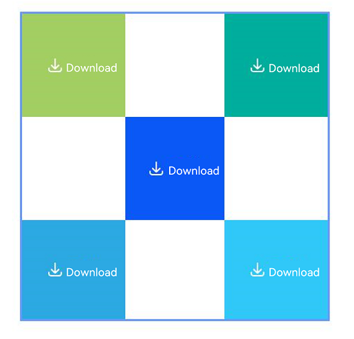

# Security Component Universal Attributes

<!--Kit: ArkUI-->
<!--Subsystem: Security-->
<!--Owner: @harylee-->
<!--Designer: @linshuqing; @hehehe-li-->
<!--Tester: @leiyuqian-->
<!--Adviser: @zengyawen-->
<!-- md-trans-meta sourceCommit=0ec9256974bbb2d1638203cef188296923565691 translatedAt=2026-06-15T07:44:08.611Z pushedAt=2026-06-18T11:27:56.655Z -->

## Overview

The universal attributes module for security components enables unified configuration of universal attributes such as layout, size, text, icon, color, border, and interaction behaviors.

This module is mainly used in the following scenarios:

- Set layout, size, text, icon, color, border, and interaction-related attributes for security components such as [PasteButton](ts-security-components-pastebutton.md#pastebutton-1) and [SaveButton](ts-security-components-savebutton.md#savebutton-1).

- Adjust the display effect and interaction experience of security components while ensuring compliance with the security component specifications. For specific constraints, see [Constraints](../../../security/AccessToken/security-component-overview.md#constraints).

- Reuse the universal attribute capabilities of security components through chained calls.

> **NOTE**
>
> This component is supported since API version 10. Updates will be marked with a superscript to indicate their earliest API version.

## Key Classes and APIs

### Key Enums

- **[SecurityComponentLayoutDirection](#securitycomponentlayoutdirection):** Enumeration of icon and text layout directions for the security component. Specifies horizontal or vertical layout.

- **[ButtonType](#buttontype):** Enumeration of button styles for the security component. Specifies capsule, circle, rounded rectangle, or normal button style.

### Key APIs

- **SecurityComponentMethod&lt;T&gt;:** A collection of universal attribute methods for security components. Configures layout, size, text, icon, color, border, and interaction attributes for specific security components.

## iconSize

iconSize(value: Dimension): T

Sets the icon size of the security component.

**Atomic service API:** This API can be used in atomic services since API version 11.

**System capability:** SystemCapability.ArkUI.ArkUI.Full

**Parameters**

| Name | Type | Mandatory | Description |
|------------|------|-------|---------|
| value | [Dimension](ts-types.md#dimension10) | Yes | Icon size of the security component, in vp by default when no unit is specified.<br>Default value: **16vp**<br>Percentage strings are not supported.<br/>If an invalid value or unit is passed, the attribute does not take effect, and the component is displayed according to the default value. |

**Return value**

| Type | Description |
| -------- | -------- |
| T | Attribute of the security component. |

## layoutDirection

layoutDirection(value: SecurityComponentLayoutDirection): T

Sets the layout direction of the icon and text on the security component.

**Atomic service API:** This API can be used in atomic services since API version 11.

**System capability:** SystemCapability.ArkUI.ArkUI.Full

Parameters

| Name | Type | Mandatory | Description |
|------------|------|-------|---------|
| value | [SecurityComponentLayoutDirection](#securitycomponentlayoutdirection) | Yes | Layout direction of the icon and text on the security component.<br/>Default value: **SecurityComponentLayoutDirection.HORIZONTAL** |

**Return value**

| Type | Description |
| -------- | -------- |
| T | Attribute of the security component. |

## position

position(value: Position): T

Sets the absolute position, which is the offset of the top-left corner of the security component relative to the top-left corner of the parent container.

**Atomic service API:** This API can be used in atomic services since API version 11.

**System capability:** SystemCapability.ArkUI.ArkUI.Full

**Parameters**

| Name | Type | Mandatory | Description |
|------------|------|-------|---------|
| value | [Position](ts-types.md#position) | Yes | Offset position of the security component's top-left corner relative to the parent container's top-left corner. Applicable to scenarios where the security component is placed in a fixed area of the page through absolute positioning.<br/>When the unit is not explicitly specified, the unit is vp.<br/>It is recommended that you pass numeric coordinates for both **x** and **y**.<br/>If the parameter is **undefined** or **null**, or **x** and **y** are non-numeric types, this attribute does not take effect, and invalid coordinates are treated as **0**. |

**Return value**

| Type | Description |
| -------- | -------- |
| T | Attribute of the security component. |

## markAnchor

markAnchor(value: Position): T

Sets the anchor of the security component for moving the component with its top-left corner as the reference point.

**Atomic service API:** This API can be used in atomic services since API version 11.

**System capability:** SystemCapability.ArkUI.ArkUI.Full

**Parameters**

| Name | Type                   | Mandatory | Description                   |
|------------|------|-------|---------|
| value | [Position](ts-types.md#position) | Yes | Anchor of the security component for moving the component with its top-left corner as the reference point. Generally, this attribute is used in conjunction with **position()** and **offset()** for more precise positioning.<br>No default value.<br>This attribute does not take effect when it is set to an invalid value.

**Return value**

| Type | Description |
| -------- | -------- |
| T | Attribute of the security component. |

## offset

offset(value: Position | Edges | LocalizedEdges): T

Sets the coordinate offset of the security component relative to its own layout position.

**Atomic service API:** This API can be used in atomic services since API version 11.

**System capability:** SystemCapability.ArkUI.ArkUI.Full

**Parameters**

| Name | Type                   | Mandatory | Description                   |
|------------|------|-------|---------|
| value | [Position](ts-types.md#position) \| [Edges<sup>12+</sup>](ts-types.md#edges12) \| [LocalizedEdges<sup>12+</sup>](ts-types.md#localizededges12) | Yes | Coordinate offset of the security component relative to its own layout position. This attribute does not affect the layout in the parent container. The offset is used only during drawing.<br>When the unit is not explicitly specified, the unit is vp.<br>No default value.<br>This attribute does not take effect when it is set to an invalid value.

**Return value**

| Type | Description |
| -------- | -------- |
| T | Attribute of the security component. |

## fontSize

fontSize(value: Dimension): T

Sets the font size of the text for the security component.

**Atomic service API:** This API can be used in atomic services since API version 11.

**System capability:** SystemCapability.ArkUI.ArkUI.Full

**Parameters**

| Name | Type                   | Mandatory | Description                   |
|------------|------|-------|---------|
| value | [Dimension](ts-types.md#dimension10) | Yes | Font size of the text on the security component. When the unit is not explicitly specified, the unit is fp.<br/>Default value: **$r('sys.float.ohos_id_text_size_button1')**<br/>Percentage strings are not supported.<br/>This attribute does not take effect when it is set to an invalid value.<br/>Note: When the security component text is not fully displayed, clicking it does not perform authorization. The **fontSize** setting determines whether the text can be fully displayed and thereby affects the authorization behavior of the security component. |

**Return value**

| Type | Description |
| -------- | -------- |
| T | Attribute of the security component. |

## fontStyle

fontStyle(value: FontStyle): T

Sets the font style of the text on the security component.

**Atomic service API:** This API can be used in atomic services since API version 11.

**System capability:** SystemCapability.ArkUI.ArkUI.Full

**Parameters**

| Name | Type                   | Mandatory | Description                   |
|------------|------|-------|---------|
| value | [FontStyle](ts-appendix-enums.md#fontstyle) | Yes | Font style of the text on the security component.<br/>Default value: **FontStyle.Normal** |

**Return value**

| Type | Description |
| -------- | -------- |
| T | Attribute of the security component. |

## fontWeight

fontWeight(value: number | FontWeight | string | Resource): T

Sets the font weight of the text on the security component.

**Atomic service API:** This API can be used in atomic services since API version 11.

**System capability:** SystemCapability.ArkUI.ArkUI.Full

**Parameters**

| Name | Type                   | Mandatory | Description                   |
|------------|------|-------|---------|
| value | number \| [FontWeight](ts-appendix-enums.md#fontweight) \| string \| [Resource](ts-types.md#resource)<sup>20+</sup> | Yes | Font weight of the text on the security component.<br/>For the number type, the value ranges from 100 to 900, at an interval of 100. A larger value indicates a heavier font weight.<br>For the string type, only numeric strings, for example, **'400'**, and the enumerated values of **FontWeight** are supported, including **'bold'**, **'bolder'**, **'lighter'**, **'regular'**, and **'medium'**.<br>The Resource type is supported since API version 20. The Resource type supports only **'integer'** and **'string'** formats. Values follow the number type specifications for the **'integer'** type and the string type specifications for the **'string'** type, both described earlier.<br>If **fontWeight** is not set for the component, the font weight is set to **FontWeight.Medium** by default. If **value** is **undefined** or **null**, a number outside the [100, 900] range, or a string that does not match the string format of **FontWeight** enums, the font weight is set to **FontWeight.Normal**. |

**Return value**

| Type | Description |
| -------- | -------- |
| T | Attribute of the security component. |

## fontFamily

fontFamily(value: string | Resource): T

Sets the font family of the text on the security component.

**Atomic service API:** This API can be used in atomic services since API version 11.

**System capability:** SystemCapability.ArkUI.ArkUI.Full

**Parameters**

| Name | Type                   | Mandatory | Description                   |
|------------|------|-------|---------|
| value | string \| [Resource](ts-types.md#resource) | Yes | Font family of the text on the security component.<br/>Default font: **'HarmonyOS Sans'**|

**Return value**

| Type | Description |
| -------- | -------- |
| T | Attribute of the security component. |

## fontColor

fontColor(value: ResourceColor): T

Sets the font color of the text on the security component.

**Atomic service API:** This API can be used in atomic services since API version 11.

**System capability:** SystemCapability.ArkUI.ArkUI.Full

**Parameters**

| Name | Type                   | Mandatory | Description                   |
|------------|------|-------|---------|
| value | [ResourceColor](ts-types.md#resourcecolor) | Yes | Font color of the text on the security component.<br>Default value: **$r('sys.color.font_on_primary')**|

**Return value**

| Type | Description |
| -------- | -------- |
| T | Attribute of the security component. |

## iconColor

iconColor(value: ResourceColor): T

Sets the icon color of the security component.

**Atomic service API:** This API can be used in atomic services since API version 11.

**System capability:** SystemCapability.ArkUI.ArkUI.Full

**Parameters**

| Name | Type                   | Mandatory | Description                   |
|------------|------|-------|---------|
| value | [ResourceColor](ts-types.md#resourcecolor) | Yes | Icon color of the security component.<br>Default value: **$r('sys.color.icon_on_primary')**

**Return value**

| Type | Description |
| -------- | -------- |
| T | Attribute of the security component. |

## backgroundColor

backgroundColor(value: ResourceColor): T

Sets the background color of the security component.

**Atomic service API:** This API can be used in atomic services since API version 11.

**System capability:** SystemCapability.ArkUI.ArkUI.Full

**Parameters**

| Name | Type                   | Mandatory | Description                   |
|------------|------|-------|---------|
| value | [ResourceColor](ts-types.md#resourcecolor) | Yes | Background color of the security component. If the alpha value of the upper eight bits of the security component's background color is less than **0x1a** (for example, **0x1800ff00**), the system will forcibly adjust this alpha value to **0xff**. This ensures the security component remains sufficiently visible and prevents users from inadvertently triggering authorization due to an overly transparent component.<br/>Default value: **$r('sys.color.icon_emphasize')**|

**Return value**

| Type | Description |
| -------- | -------- |
| T | Attribute of the security component. |

## borderStyle

borderStyle(value: BorderStyle): T

Sets the border style of the security component.

**Atomic service API:** This API can be used in atomic services since API version 11.

**System capability:** SystemCapability.ArkUI.ArkUI.Full

**Parameters**

| Name | Type                   | Mandatory | Description                   |
|------------|------|-------|---------|
| value | [BorderStyle](ts-appendix-enums.md#borderstyle) | Yes | Border style of the security component.<br>No border style is set by default.|

**Return value**

| Type | Description |
| -------- | -------- |
| T | Attribute of the security component. |

## borderWidth

borderWidth(value: Dimension): T

Sets the border width of the security component.

**Atomic service API:** This API can be used in atomic services since API version 11.

**System capability:** SystemCapability.ArkUI.ArkUI.Full

**Parameters**

| Name | Type                   | Mandatory | Description                   |
|------------|------|-------|---------|
| value | [Dimension](ts-types.md#dimension10) | Yes | Border width of the security component.<br/>Default value: **0vp**. When the unit is not explicitly specified, the unit is vp.<br/>Percentage strings are not supported. This attribute does not take effect when it is set to an invalid value.|

**Return value**

| Type | Description |
| -------- | -------- |
| T | Attribute of the security component. |

## borderColor

borderColor(value: ResourceColor): T

Sets the border color of the security component.

**Atomic service API:** This API can be used in atomic services since API version 11.

**System capability:** SystemCapability.ArkUI.ArkUI.Full

**Parameters**

| Name | Type                   | Mandatory | Description                   |
|------------|------|-------|---------|
| value | [ResourceColor](ts-types.md#resourcecolor) | Yes | Border color of the security component.<br/>No border color is set by default.|

**Return value**

| Type | Description |
| -------- | -------- |
| T | Attribute of the security component. |

## borderRadius

borderRadius(value: Dimension): T

Sets the border radius of the security component.

The effect of **borderRadius** is influenced by **ButtonType**. When **ButtonType** is **Capsule** or **Circle**, the **borderRadius** setting does not take effect, and the corner radius is automatically determined by the button type. When the **ButtonType** is **Normal** or **ROUNDED_RECTANGLE**, the **borderRadius** setting takes effect. For details, see [ButtonType](#buttontype).

**Atomic service API:** This API can be used in atomic services since API version 11.

**System capability:** SystemCapability.ArkUI.ArkUI.Full

**Parameters**

| Name | Type                   | Mandatory | Description                   |
|------------|------|-------|---------|
| value |  [Dimension](ts-types.md#dimension10) | Yes | Border radius of the security component. If no unit is explicitly specified, the unit is vp.<br/>Default value: **0vp**<br/>Percentage strings are not supported. The border radius is constrained by the component size, with a minimum of **0** and a maximum of half the smaller of the width and height. If an invalid value is set, this attribute does not take effect. |

**Return value**

| Type | Description |
| -------- | -------- |
| T | Attribute of the security component. |

## borderRadius<sup>15+</sup>

borderRadius(radius: Dimension | BorderRadiuses): T

Sets the border radius of the security component, allowing individual setting of the four corner radii.

The effect of **borderRadius** is influenced by **ButtonType**. When **ButtonType** is **Capsule** or **Circle**, the **borderRadius** setting does not take effect, and the corner radius is automatically determined by the button type. When the **ButtonType** is **Normal** or **ROUNDED_RECTANGLE**, the **borderRadius** setting takes effect. For details, see [ButtonType](#buttontype).

**Atomic service API:** This API can be used in atomic services since API version 15.

**System capability:** SystemCapability.ArkUI.ArkUI.Full

**Parameters**

| Name | Type                   | Mandatory | Description                   |
|------------|------|-------|---------|
| radius |  [Dimension](ts-types.md#dimension10) \| [BorderRadiuses](ts-types.md#borderradiuses9) | Yes | Border radius of the security component. When the unit is not explicitly specified, the unit is vp.<br/>Default value: **0vp**.<br/>The Dimension type does not support setting percentage strings. The border radius is constrained by the component size, with a minimum value of **0** and a maximum value of half the smaller dimension of width and height. When an invalid value is set, this attribute does not take effect.|

**Return value**

| Type | Description |
| -------- | -------- |
| T | Attribute of the security component. |

## padding

padding(value: Padding | Dimension): T

Sets the padding of the security component.

**Atomic service API:** This API can be used in atomic services since API version 11.

**System capability:** SystemCapability.ArkUI.ArkUI.Full

**Parameters**

| Name | Type | Mandatory | Description |
|------------|------|-------|---------|
| value | [Padding](ts-types.md#padding) \| [Dimension](ts-types.md#dimension10) | Yes | Padding of the security component. When the unit is not explicitly specified, the unit is vp.<br>Default value: 8 vp for the top and bottom and 16 vp for the left and right.<br>Note: Percentage strings are not supported. If a percentage string is set, the corresponding padding is **0**.|

**Return value**

| Type | Description |
| -------- | -------- |
| T | Attribute of the security component. |

## align<sup>15+</sup>

align(alignType: Alignment): T

Sets the alignment of the icon and text on the security component.

**Atomic service API:** This API can be used in atomic services since API version 15.

**System capability:** SystemCapability.ArkUI.ArkUI.Full

**Parameters**

| Name | Type                   | Mandatory | Description                   |
|------------|------|-------|---------|
| alignType | [Alignment](ts-appendix-enums.md#alignment) | Yes | Alignment of the icon and text within the security component. The icon and text are aligned as a unit within the component's background area. The alignment is applied based on the **alignType** value after [padding](ts-securitycomponent-attributes.md#padding) takes effect, which also affects the visual result.<br>Default value: **Alignment.Center**|

**Return value**

| Type | Description |
| -------- | -------- |
| T | Attribute of the security component. |

## textIconSpace

textIconSpace(value: Dimension): T

Sets the spacing between the icon and text in the security component.

**Atomic service API:** This API can be used in atomic services since API version 11.

**System capability:** SystemCapability.ArkUI.ArkUI.Full

**Parameters**

| Name | Type                   | Mandatory | Description                   |
|------------|------|-------|---------|
| value | [Dimension](ts-types.md#dimension10) | Yes | Spacing between the icon and text in the security component. When the unit is not explicitly specified, the unit is vp.<br/>Default value: **4vp**<br/>Note: Percentage strings are not supported. If a percentage string is set, the corresponding spacing between the icon and text is **0**. Since API version 14, negative values are treated as the default value.|

**Return value**

| Type | Description |
| -------- | -------- |
| T | Attribute of the security component. |

## width<sup>11+</sup>

width(value: Length): T

Sets the width of the security component. If not set, the width adapts to the element content. When used in conjunction with adaptive font size attributes, the width setting affects whether the text is fully displayed.

**Atomic service API:** This API can be used in atomic services since API version 12.

**System capability:** SystemCapability.ArkUI.ArkUI.Full

**Parameters**

| Name | Type                   | Mandatory | Description                   |
|------------|------|-------|---------|
| value | [Length](ts-types.md#length) | Yes | Width of the security component itself. If not set, the width adapts to the element content. When the unit is not explicitly specified, the unit is vp.<br/>When used in conjunction with [minFontSize](#minfontsize18), [maxFontSize](#maxfontsize18), [maxLines](#maxlines18), and [heightAdaptivePolicy](#heightadaptivepolicy18) for adaptive font sizing, if the text on the security component is truncated, clicking the component does not perform authorization. If an invalid value is set, this attribute does not take effect.|

**Return value**

| Type | Description |
| -------- | -------- |
| T | Attribute of the security component. |

## height<sup>11+</sup>

height(value: Length): T

Sets the height of the security component. If not set, the height adapts to the element content. When used in conjunction with adaptive font size attributes, the height setting affects whether the text is fully displayed.

**Atomic service API:** This API can be used in atomic services since API version 12.

**System capability:** SystemCapability.ArkUI.ArkUI.Full

**Parameters**

| Name | Type                   | Mandatory | Description                   |
|------------|------|-------|---------|
| value | [Length](ts-types.md#length) | Yes | Height of the security component. If not set, the height adapts to the element content. If no unit is explicitly specified, the unit is vp.<br/>When used in conjunction with [minFontSize](#minfontsize18), [maxFontSize](#maxfontsize18), [maxLines](#maxlines18), and [heightAdaptivePolicy](#heightadaptivepolicy18) for adaptive font sizing, if the text on the security component is truncated, clicking the component does not perform authorization. If an invalid value is set, this attribute does not take effect.|

**Return value**

| Type | Description |
| -------- | -------- |
| T | Attribute of the security component. |

## size<sup>11+</sup>

size(value: SizeOptions): T

Sets the width and height. If not set, the width and height adapt to the element content. The **size** method is used to set both width and height at the same time. To set the width or height individually, use the [width](#width11) or [height](#height11) method.

**Atomic service API:** This API can be used in atomic services since API version 12.

**System capability:** SystemCapability.ArkUI.ArkUI.Full

**Parameters**

| Name | Type | Mandatory | Description |
|------------|------|-------|---------|
| value | [SizeOptions](ts-types.md#sizeoptions) | Yes | Width and height of the security component. When this parameter is not specified, the security component automatically adapts its size to the element content. If no unit is explicitly specified, the unit is vp.<br/>When used in conjunction with [minFontSize](#minfontsize18), [maxFontSize](#maxfontsize18), [maxLines](#maxlines18), and [heightAdaptivePolicy](#heightadaptivepolicy18) for adaptive font sizing, if the text on the security component is truncated, clicking the component does not perform authorization. If an invalid value is set, this attribute does not take effect.|

**Return value**

| Type | Description |
| -------- | -------- |
| T | Attribute of the security component. |

## constraintSize<sup>11+</sup>

constraintSize(value: ConstraintSizeOptions): T

Sets the constraint size, limiting the size range during component layout.

**Atomic service API:** This API can be used in atomic services since API version 12.

**System capability:** SystemCapability.ArkUI.ArkUI.Full

**Parameters**

| Name | Type                   | Mandatory | Description                   |
|------------|------|-------|---------|
| value | [ConstraintSizeOptions](ts-types.md#constraintsizeoptions) | Yes | Constraint size, limiting the size range during component layout. When the unit is not explicitly specified, the unit is vp.<br/>**constraintSize** takes precedence over **width** and **height**.<br>When used in conjunction with adaptive font size attributes, if the text on the security component is truncated, clicking the component does not perform authorization. The **constraintSize** setting affects whether the text is fully displayed.<br/>For the value results, see [impact of constraintSize values on width/height](ts-universal-attributes-size.md#constraintsize).<br/>Default value:<br/>{<br/>minWidth:&nbsp;0,<br/>maxWidth:&nbsp;Infinity,<br/>minHeight:&nbsp;0,<br/>maxHeight:&nbsp;Infinity<br/>}.|

**Return value**

| Type | Description |
| -------- | -------- |
| T | Attribute of the security component. |

## alignRules<sup>15+</sup>

alignRules(alignRule: AlignRuleOption): T

Sets the alignment rules for child components within a relative container. This API takes effect only when the parent container is [RelativeContainer](ts-container-relativecontainer.md).

**Atomic service API:** This API can be used in atomic services since API version 15.

**System capability:** SystemCapability.ArkUI.ArkUI.Full

**Parameters**

| Name | Type                                        | Mandatory | Description                     |
| ------ | ------------------------------------------- | ---- | ------------------------ |
| alignRule | [AlignRuleOption](ts-universal-attributes-location.md#alignruleoption9) | Yes   | Alignment rule configuration object that defines anchor alignment options (**top**, **bottom**, **left**, **right**, and **center**). Specifies the alignment position and method of the security component in [RelativeContainer](ts-container-relativecontainer.md). |

**Return value**

| Type | Description |
| -------- | -------- |
| T | Attribute of the security component. |

## alignRules<sup>15+</sup>

alignRules(alignRule: LocalizedAlignRuleOptions): T

Sets the alignment rules for child components within a relative container. This API takes effect only when the parent container is [RelativeContainer](ts-container-relativecontainer.md). In the horizontal direction, this method replaces **left** and **right** in the [alignRules](#alignrules15) above with **start** and **end**, respectively, allowing the layout to be mirrored in RTL mode. You are advised to use this method preferentially.

**Atomic service API:** This API can be used in atomic services since API version 15.

**System capability:** SystemCapability.ArkUI.ArkUI.Full

**Parameters**

| Name | Type                                        | Mandatory | Description                     |
| ------ | ------------------------------------------- | ---- | ------------------------ |
| alignRule | [LocalizedAlignRuleOptions](ts-universal-attributes-location.md#localizedalignruleoptions12) | Yes   | Alignment rule configuration object that uses **start** and **end** in place of **left** and **right** to support RTL layout mirroring. Includes anchor alignment settings for **top**, **bottom**, **start**, **end**, and **center**, specifying the alignment position and method of the security component within [RelativeContainer](ts-container-relativecontainer.md). |

**Return value**

| Type | Description |
| -------- | -------- |
| T | Attribute of the security component. |

## id<sup>15+</sup>

id(id: string): T

Unique ID you assigned for the component.

**Atomic service API:** This API can be used in atomic services since API version 15.

**System capability:** SystemCapability.ArkUI.ArkUI.Full

**Parameters**

| Name   | Type      | Mandatory | Description                       |
| ------ | -------- | -----|---------------------- |
| id | string   | Yes | Unique ID you assigned for the component.<br/>Default value: **''** |

**Return value**

| Type | Description |
| -------- | -------- |
| T | Attribute of the security component. |

## chainMode<sup>15+</sup>

chainMode(direction: Axis, style: ChainStyle): T

Sets the parameters of the chain in which the component is the head. This API takes effect only when the parent container is [RelativeContainer](ts-container-relativecontainer.md).

**Atomic service API:** This API can be used in atomic services since API version 15.

**System capability:** SystemCapability.ArkUI.ArkUI.Full

**Parameters**

| Name | Type                                        | Mandatory | Description                     |
| ------ | ------------------------------------------- | ---- | ------------------------ |
| direction | [Axis](ts-appendix-enums.md#axis) | Yes   | Direction of the chain layout. Specifies the arrangement direction of the chain headed by this component in the [RelativeContainer](ts-container-relativecontainer.md). |
| style | [ChainStyle](ts-universal-attributes-location.md#chainstyle12) | Yes   | Style of the chain layout. Controls how child components are distributed within the chain, such as evenly distributed, aligned at both ends, or compactly arranged. For specific values and effects, see [ChainStyle](ts-universal-attributes-location.md#chainstyle12). |

**Return value**

| Type | Description |
| -------- | -------- |
| T | Attribute of the security component. |

## minFontScale<sup>18+</sup>

minFontScale(scale: number | Resource): T

Sets the minimum font scale factor for the text. When this API is invoked and the system font scaling causes the text to shrink, the font scale factor will not fall below the set minimum scale factor.

This API can be used in conjunction with [maxFontScale](#maxfontscale18). **minFontScale** controls the lower limit of the scale factor and **maxFontScale** controls the upper limit. They can be set independently or together to precisely control font scaling.

**Atomic service API:** This API can be used in atomic services since API version 18.

**System capability:** SystemCapability.ArkUI.ArkUI.Full

**Parameters**

| Name | Type                                          | Mandatory | Description                                          |
| ------ | --------------------------------------------- | ---- | --------------------------------------------- |
| scale  | number \| [Resource](ts-types.md#resource) | Yes   | Minimum font scale factor for the text.<br/>Value range: [0, 1]<br/>NOTE<br/>If the set value is less than 0, the value **0** is used, meaning scaling down to any factor is allowed. If the set value is greater than 1, the value **1** is used, meaning font scaling is not allowed. If the value is **undefined**, **null**, or another invalid value, the attribute has no effect. |

**Return value**

| Type | Description |
| -------- | -------- |
| T | Attribute of the security component. |

## maxFontScale<sup>18+</sup>

maxFontScale(scale: number | Resource): T

Sets the maximum font scale factor. When this API is invoked and the system font scaling causes the text to enlarge, the font scale factor will not exceed the set maximum scale factor.

This API can be used in conjunction with [minFontScale](#minfontscale18). **maxFontScale** controls the upper limit of the scale factor, and **minFontScale** controls the lower limit. They can be set independently or together to precisely control font scaling.

**Atomic service API:** This API can be used in atomic services since API version 18.

**System capability:** SystemCapability.ArkUI.ArkUI.Full

**Parameters**

| Name | Type                                          | Mandatory | Description                                          |
| ------ | --------------------------------------------- | ---- | --------------------------------------------- |
| scale  | number \| [Resource](ts-types.md#resource) | Yes   | Maximum font scale factor for the text.<br/>Value range: [1, +∞)<br/>**NOTE**<br/>If the set value is less than 1, the value **1** is used. If the value is **undefined**, **null**, or another invalid value, the attribute has no effect. |

**Return value**

| Type | Description |
| -------- | -------- |
| T | Attribute of the security component. |

## minFontSize<sup>18+</sup>

minFontSize(minSize: number | string | Resource): T

Sets the minimum font size for text display.

- When used in conjunction with [maxFontSize](#maxfontsize18) and [maxLines](#maxlines18), or in combination with layout size constraints, this attribute enables font size adaptation. Using this attribute alone will not take effect.

- **minFontSize** must be smaller than **maxFontSize**. If the set value is greater than **maxFontSize**, **maxFontSize** is used instead.

- When **minFontSize** is less than or equal to 0, adaptive font size does not take effect.

- When adaptive font size is effective, the **fontSize** setting does not take effect.

- If the security component text is not fully displayed, clicking does not trigger authorization. The **minFontSize** setting affects text visibility, which in turn affects authorization behavior.

**Atomic service API:** This API can be used in atomic services since API version 18.

**System capability:** SystemCapability.ArkUI.ArkUI.Full

**Parameters**

| Name | Type                                                         | Mandatory | Description               |
| ------ | ------------------------------------------------------------ | ---- | ------------------ |
| minSize  | number&nbsp;\|&nbsp;string&nbsp;\|&nbsp;[Resource](ts-types.md#resource) | Yes   | Minimum display font size of the text. When the unit is not explicitly specified, the unit is fp.<br/>Value range: (0, +∞). **minFontSize** must be less than **maxFontSize**. If the set value is greater than **maxFontSize**, **maxFontSize** is used instead. If this parameter is less than or equal to 0, the adaptive font size does not take effect. |

**Return value**

| Type | Description |
| -------- | -------- |
| T | Attribute of the security component. |

## maxFontSize<sup>18+</sup>

maxFontSize(maxSize: number | string | Resource): T

Sets the maximum font size for text display.

- When used in conjunction with [minFontSize](#minfontsize18) and [maxLines](#maxlines18), or in combination with layout size constraints, this attribute enables font size adaptation. Using this attribute alone will not take effect.

- **maxFontSize** must be greater than **minFontSize**. If **maxFontSize** is less than **minFontSize**, **minFontSize** will be treated as **maxFontSize**.

- When adaptive font size is effective, the **fontSize** setting does not take effect.

- If the security component text is not fully displayed, clicking does not trigger authorization. The **maxFontSize** setting affects text visibility, which in turn affects authorization behavior.

**Atomic service API:** This API can be used in atomic services since API version 18.

**System capability:** SystemCapability.ArkUI.ArkUI.Full

**Parameters**

| Name | Type                                                         | Mandatory | Description               |
| ------ | ------------------------------------------------------------ | ---- | ------------------ |
| maxSize  | number&nbsp;\|&nbsp;string&nbsp;\|&nbsp;[Resource](ts-types.md#resource) | Yes   | Maximum display font size of the text. When the unit is not explicitly specified, the unit is fp.<br/>Value range: (0, +∞)<br/>**NOTE**<br/>When the set value is less than or equal to 0, the adaptive font size does not take effect. When an invalid value is set, this attribute does not take effect. |

**Return value**

| Type | Description |
| -------- | -------- |
| T | Attribute of the security component. |

## maxLines<sup>18+</sup>

maxLines(line: number | Resource): T

Sets the maximum number of lines for text. By default, text wraps automatically. When this attribute is specified, the text will display at most the specified number of lines. It can be used independently to limit text lines, or in conjunction with [minFontSize](#minfontsize18), [maxFontSize](#maxfontsize18), and [heightAdaptivePolicy](#heightadaptivepolicy18). When used with adaptive font size attributes, if the security component text is not fully displayed, the click will not trigger authorization. The **maxLines** setting affects whether the text can be fully displayed, thereby affecting the authorization behavior of the security component.

**Atomic service API:** This API can be used in atomic services since API version 18.

**System capability:** SystemCapability.ArkUI.ArkUI.Full

**Parameters**

| Name | Type   | Mandatory | Description             |
| ------ | ------ | ---- | ---------------- |
| line  | number \| [Resource](ts-types.md#resource)<sup>20+</sup> | Yes   | Maximum number of lines for the text.<br/>The number type accepts values in [1, +∞). The Resource type is supported since API version 20. The parameter of the Resource type supports only integers in the range [1, +∞).<br>**NOTE**<br>A value less than 1 is handled as the default value **1000000**. |

**Return value**

| Type | Description |
| -------- | -------- |
| T | Attribute of the security component. |

## heightAdaptivePolicy<sup>18+</sup>

heightAdaptivePolicy(policy: TextHeightAdaptivePolicy): T

Sets the method for text height adaptation. This is applicable to scenarios where the text display of a security component needs to be dynamically adjusted to ensure complete text visibility under different sizes or language environments.

The security component text is laid out at [maxFontSize](#maxfontsize18). If the text can be completely displayed and no adaptive adjustment is needed, this API does not take effect. Otherwise, adaptation proceeds according to the specified policy, as follows:

**TextHeightAdaptivePolicy.MAX_LINES_FIRST**: prioritizes the [maxLines](#maxlines18) attribute for adjusting the text height. If the layout size with **maxLines** exceeds the layout constraints, the security component attempts to reduce the font size within the range of [minFontSize](#minfontsize18) and [maxFontSize](#maxfontsize18) to fit more text. If the text still cannot be fully displayed, the security component adaptively adjusts its height to show all text.

**TextHeightAdaptivePolicy.MIN_FONT_SIZE_FIRST**: prioritizes the [minFontSize](#minfontsize18) attribute for adjusting the text height. If the text can be laid out in a single line using **minFontSize**, the security component attempts to increase the font size within the range of **minFontSize** and [maxFontSize](#maxfontsize18) to use the largest possible font size. If the text cannot be laid out in a single line using **minFontSize**, the security component attempts to use the [maxLines](#maxlines18) attribute for layout. If the text still cannot be fully displayed, the security component adaptively adjusts its height to fully display the text.

**TextHeightAdaptivePolicy.LAYOUT_CONSTRAINT_FIRST**: prioritizes layout constraints for adjusting the text height. If the layout size exceeds the constraints, the security component attempts to reduce the font size within the range of [minFontSize](#minfontsize18) and [maxFontSize](#maxfontsize18). If the layout size still exceeds the constraints after the font size is reduced to **minFontSize**, the security component truncates the excess lines. If the [maxLines](#maxlines18) attribute is set, the number of lines does not exceed the **maxLines** value (horizontal truncation may occur). If **maxLines** is not set, there is no limit on the number of lines.

If the security component text is not fully displayed, clicking does not trigger authorization. Whether the text is fully displayed depends on attributes such as **heightAdaptivePolicy**, **minFontSize**, **maxFontSize**, **maxLines**, **width**, and **height**.

For details, see [Example](#example-3).

**Atomic service API:** This API can be used in atomic services since API version 18.

**System capability:** SystemCapability.ArkUI.ArkUI.Full

**Parameters**

| Name | Type                                                         | Mandatory | Description                                                         |
| ------ | ------------------------------------------------------------ | ---- | ------------------------------------------------------------ |
| policy  | [TextHeightAdaptivePolicy](ts-appendix-enums.md#textheightadaptivepolicy10) | Yes   | Policy for text height adaptation.<br>Default value: **TextHeightAdaptivePolicy.MAX_LINES_FIRST** |

**Return value**

| Type | Description |
| -------- | -------- |
| T | Attribute of the security component. |

## enabled<sup>18+</sup>

enabled(respond: boolean): T

Sets whether the security component is interactive.

**Atomic service API:** This API can be used in atomic services since API version 18.

**System capability:** SystemCapability.ArkUI.ArkUI.Full

**Parameters**

| Name | Type | Mandatory | Description |
| ------ | ------- | ---- | ------------------------------------------------------------ |
| respond  | boolean | Yes | Whether the security component is interactive.<br>**true**: The component is interactive and responds to operations such as clicks.<br>**false**: The component is non-interactive and does not respond to operations such as clicks.<br>Default value: **true**. |

**Return value**

| Type | Description |
| -------- | -------- |
| T | Attribute of the security component. |

## focusBox<sup>22+</sup>

focusBox(style: FocusBoxStyle): T

Sets the style of the system focus box for the security component.

**Atomic service API:** This API can be used in atomic services since API version 22.

**System capability:** SystemCapability.ArkUI.ArkUI.Full

**Parameters**

| Name | Type | Mandatory | Description |
| ---- | ---- | ---- | ---- |
| style  | [FocusBoxStyle](ts-universal-attributes-focus.md#focusboxstyle12) | Yes   | Configuration object for the focus box style. Contains properties such as **margin** (the spacing between the focus box and the component) and **strokeColor** (the stroke color of the focus box) to customize the appearance of the system focus box. |

**Return value**

| Type | Description |
| -------- | -------- |
| T | Attribute of the security component. |

## fallbackLineSpacing

fallbackLineSpacing(enabled: boolean): T

Enables adaptive line height based on the actual text height for multi-line text.

The **fallbackLineSpacing** attribute is closely coupled with the **lineHeight** attribute of [RichEditorTextStyle](ts-basic-components-richeditor.md#richeditortextstyle). When the **lineHeight** value is less than the actual rendering height of the text at the current font size, the **fallbackLineSpacing** value determines whether the line height should adapt based on the actual text height.

**Since:** 26.0.0

**Model restriction:** This API can be used only in the stage model.

**Atomic service API:** This API can be used in atomic services since API version 26.0.0.

**System capability:** SystemCapability.ArkUI.ArkUI.Full

**Parameters**

| Name | Type | Mandatory | Description |
| ------- | ------------------------------------------------------------ | ---- | ------------------------------------------------------------ |
| enabled | boolean | Yes | Whether the line height adapts based on the actual text height.<br/>**true**: The line height adapts based on the actual text height. **false**: The line height does not adapt based on the actual text height. |

**Return value**

| Type | Description |
| -------- | -------- |
| T | Attribute of the security component. |

## accessibilityRole

accessibilityRole(role: SecurityComponentRoleType): T

Sets the accessibility component type. Each component type is announced in a specific way. You can modify the component type based on your app's requirements to control how the component is announced and what content is announced in accessibility mode.

**Since:** 26.0.0

**Model restriction:** This API can be used only in the stage model.

**Atomic service API:** This API can be used in atomic services since API version 26.0.0.

**System capability:** SystemCapability.ArkUI.ArkUI.Full

**Parameters**

| Name   | Type    | Mandatory | Description                                                         |
| -------- | ------- | ---- | ------------------------------------------------------------ |
| role | [SecurityComponentRoleType](#securitycomponentroletype) | Yes   | The component type, such as button or chart, that determines how the component is announced by the screen reader. The specific type can be customized. |

**Return value**

| Type | Description |
| -------- | -------- |
| T | Current object. |

## accessibilityDefaultFocus

accessibilityDefaultFocus(focus: boolean): T

Sets the initial focus for the screen reader on the page, specifying the component that the screen reader announces first after the page loads.

**Since:** 26.0.0

**Model restriction:** This API can be used only in the stage model.

**Atomic service API:** This API can be used in atomic services since API version 26.0.0.

**System capability:** SystemCapability.ArkUI.ArkUI.Full

**Parameters**

| Name | Type | Mandatory | Description |
| ------ | ------- | ---- | ------------------------------------------------------------ |
| focus | boolean | Yes | Sets the initial focus of the screen reader on the page. **true** means the component is the default first focus on the current page; **false** or any other value is invalid. |

**Return value**

| Type | Description |
| -------- | -------- |
| T | Current object. |

## accessibilityNextFocusId

accessibilityNextFocusId(nextId: string): T

Specifies the next focus component for the screen reader.

**Since:** 26.0.0

**Model restriction:** This API can be used only in the stage model.

**Atomic service API:** This API can be used in atomic services since API version 26.0.0.

**System capability:** SystemCapability.ArkUI.ArkUI.Full

**Parameters**

| Name   | Type   | Mandatory | Description                                                         |
| ------ | ------ | --------- | ------------------------------------------------------------ |
| nextId | string | Yes       | The [unique ID](ts-universal-attributes-component-id.md#id) of the next component to be focused. If the unique ID does not correspond to any component, the setting is invalid. |

**Return value**

| Type | Description |
| -------- | -------- |
| T | Current object. |

## accessibilityDescription

accessibilityDescription(description: string | Resource): T

Provides an accessibility description for the component. You can set detailed text descriptions to help users understand the component's functionality and the actions it will perform.

**Since:** 26.0.0

**Model restriction:** This API can be used only in the stage model.

**Atomic service API:** This API can be used in atomic services since API version 26.0.0.

**System capability:** SystemCapability.ArkUI.ArkUI.Full

**Parameters**

| Name | Type | Mandatory | Description |
| ------ | ------ | ---- | ------------------------------------------------------------ |
| description | string \| [Resource](ts-types.md#resource) | Yes | Accessibility description for the component. Provides details about the component's operation, helping users understand what the current action does and its potential consequences. When the component is selected, if it has both text attributes and an accessibility description, the text content is announced first, followed by the accessibility description. The default value is an empty string. |

**Return value**

| Type | Description |
| -------- | -------- |
| T | Current object. |

## SecurityComponentLayoutDirection

Enumerates the layout directions of the icon and text on a security component.

**Atomic service API:** This API can be used in atomic services since API version 11.

**System capability:** SystemCapability.ArkUI.ArkUI.Full

| Name | Value | Description |
| -------- | -------- | -------- |
| HORIZONTAL | 0 | The icon and text on the security component are arranged horizontally. |
| VERTICAL | 1 | The icon and text on the security component are arranged vertically. |

## ButtonType

Enumerates the button types.

The button type affects how the setting for the [borderRadius](ts-securitycomponent-attributes.md#borderradius) attribute is applied. The specific impact is as follows:

- When the button type is **Capsule**, the **borderRadius** setting does not take effect, and the button's corner radius is half the smaller of the width and height.

- When the button type is **Circle**, the **borderRadius** setting does not take effect:

  - If both the width and height are set, the button's corner radius is half the smaller of the width and height.

  - If only one of width or height is set, the button's corner radius is half of the set width or height.

  - If neither width nor height is set, or if the value of **borderRadius** is negative, the button's corner radius is automatically calculated based on the button's actual layout size. This is applicable to icon buttons, such as volume control, play/pause, and similar scenarios.

- When the button type is **Normal**, the button's corner radius can be set via **borderRadius**. The corner size is constrained by the component size, with a minimum value of **0** and a maximum value of half the smaller dimension of the component's width and height. This applies to button scenarios that require custom corner sizes or right-angle corners.

- When the button type is **ROUNDED_RECTANGLE**, if **borderRadius** is not set, the corner radius defaults to **20 vp** and does not change with the button height. This applies to button scenarios that require a uniform corner style.

**Atomic service API:** This API can be used in atomic services since API version 11.

**System capability:** SystemCapability.ArkUI.ArkUI.Full

| Name      | Value | Description               |
| ------- | -------- | ------------------ |
| Normal  | 0 | Normal button.      |
| Capsule | 1 | Capsule button, with a corner radius half the height. |
| Circle  | 2 | Circle button.              |
| ROUNDED_RECTANGLE<sup>16+</sup> | 8 | Rounded rectangle button, with a default corner radius of 20 vp. |

## SecurityComponentRoleType

Defines the screen reader role type of the component.

**Since:** 26.0.0

**Model restriction:** This API can be used only in the stage model.

**Atomic service API:** This API can be used in atomic services since API version 26.0.0.

**System capability:** SystemCapability.ArkUI.ArkUI.Full

| Name | Value | Description |
| ---- | ---- | ------------------ |
| ROLE_NONE | 0 | Null. |
| BUTTON | 1 | Button. |

## Examples

> **NOTE**
> You may want to learn the [constraints of security component styles](../../../security/AccessToken/security-component-overview.md#constraints) to avoid authorization failures caused by styles that do not comply with the rules.

### Example 1

This example demonstrates how to create a **SaveButton** component and set its security component attributes.

```ts
@Entry
@Component
struct Index {
  build() {
    Row() {
      Column({ space: 5 }) {
        // Generate a save button and set its SecurityComponent attributes.
        SaveButton()
          .fontSize(35)
          .fontColor(Color.White)
          .iconSize(30)
          .layoutDirection(SecurityComponentLayoutDirection.HORIZONTAL)
          .borderWidth(1)
          .borderStyle(BorderStyle.Dashed)
          .borderColor(Color.Blue)
          .borderRadius(20)
          .fontWeight(100)
          .iconColor(Color.White)
          .padding({
            left: 50,
            top: 50,
            bottom: 50,
            right: 50
          })
          .textIconSpace(20)
          .backgroundColor(0x3282f6)
        // Generate a save button and set its fixed width and height.
        SaveButton().size({ width: 200, height: 100 })
        // Generate a save button, set its fixed width and height, and set the icon and text to be left-aligned.
        SaveButton()
          .size({ width: 200, height: 100 })
          .align(Alignment.Start)
        // Generate a save button of the Normal type and set the four corner radii respectively.
        SaveButton({ icon: SaveIconStyle.FULL_FILLED, text: SaveDescription.DOWNLOAD, buttonType: ButtonType.Normal })
          .size({ width: 150, height: 80 })
          .borderRadius({
            topLeft: 20,
            topRight: 25,
            bottomRight: 30,
            bottomLeft: 35
          })
        // Generate a save button and set the maximum width constraint.
        SaveButton().constraintSize({ maxWidth: 60 })
      }.width('100%')
    }.height('100%')
  }
}
```

### Example 2

This example demonstrates how to use the container and components within the container as anchors for layout.

```ts
@Entry
@Component
struct Index {
  build() {
    Row() {
      RelativeContainer() {
        // Use the container as the anchor, position it at the top-left corner, and set an ID for other components to reference.
        SaveButton({ icon: SaveIconStyle.FULL_FILLED, text: SaveDescription.DOWNLOAD, buttonType: ButtonType.Normal })
          .width(100)
          .height(100)
          .backgroundColor('#A3CF62')
          .alignRules({
            top: { anchor: '__container__', align: VerticalAlign.Top },
            left: { anchor: '__container__', align: HorizontalAlign.Start }
          })
          .id('row1')

        // Use the container as the anchor, position it at the top-right corner, and set an ID for other components to reference.
        SaveButton({ icon: SaveIconStyle.FULL_FILLED, text: SaveDescription.DOWNLOAD, buttonType: ButtonType.Normal })
          .width(100)
          .height(100)
          .backgroundColor('#00AE9D')
          .alignRules({
            top: { anchor: '__container__', align: VerticalAlign.Top },
            right: { anchor: '__container__', align: HorizontalAlign.End }
          })
          .id('row2')

        // Use row1 and row2 as anchors and place the component between and below the two rows.
        SaveButton({ icon: SaveIconStyle.FULL_FILLED, text: SaveDescription.DOWNLOAD, buttonType: ButtonType.Normal })
          .height(100)
          .backgroundColor('#0A59F7')
          .alignRules({
            top: { anchor: 'row1', align: VerticalAlign.Bottom },
            left: { anchor: 'row1', align: HorizontalAlign.End },
            right: { anchor: 'row2', align: HorizontalAlign.Start }
          })
          .id('row3')

        // Use row3, the container, and row1 as anchors to constrain the component's layout range in the bottom-left area.
        SaveButton({ icon: SaveIconStyle.FULL_FILLED, text: SaveDescription.DOWNLOAD, buttonType: ButtonType.Normal })
          .backgroundColor('#2CA9E0')
          .alignRules({
            top: { anchor: 'row3', align: VerticalAlign.Bottom },
            bottom: { anchor: '__container__', align: VerticalAlign.Bottom },
            left: { anchor: '__container__', align: HorizontalAlign.Start },
            right: { anchor: 'row1', align: HorizontalAlign.End }
          })
          .id('row4')

        // Use row3, row2, and the container as anchors to constrain the component's layout range in the bottom-right area.
        SaveButton({ icon: SaveIconStyle.FULL_FILLED, text: SaveDescription.DOWNLOAD, buttonType: ButtonType.Normal })
          .backgroundColor('#30C9F7')
          .alignRules({
            top: { anchor: 'row3', align: VerticalAlign.Bottom },
            bottom: { anchor: '__container__', align: VerticalAlign.Bottom },
            left: { anchor: 'row2', align: HorizontalAlign.Start },
            right: { anchor: '__container__', align: HorizontalAlign.End }
          })
          .id('row5')
      }
      .width(300).height(300)
      .margin({ left: 50 })
      .border({ width: 2, color: '#6699FF' })
    }
    .height('100%')
  }
}
```



### Example 3

This example demonstrates how to implement text height adaptation of the security component.

```ts
@Entry
@Component
struct Index {
  build() {
    Column() {
      Scroll() {
        Column({ space: 10 }) {
          Column({ space: 10 }) {
            Row() {
              Text('FontSize = 20. Example: ').fontSize(20)
              Text('Quick Save Image').fontSize(20).fontColor(Color.Blue)
            }.width('100%')

            Row() {
              Text('FontSize = 10. Example: ').fontSize(20)
              Text('Quick Save Image').fontSize(10).fontColor(Color.Blue)
            }.width('100%')
          }.width('100%')

          Flex({ wrap: FlexWrap.Wrap }) {
            Column() {
              Row() {
                Text('heightAdaptivePolicy = MIN_FONT_SIZE_FIRST').fontSize(16).fontWeight(FontWeight.Bold)
              }
            }.height(40)

            Column() {
              Column({ space: 10 }) {
                Row() {
                  Text('No adaptive adjustment')
                }.width('90%')

                // The text can be fully displayed in the current layout without adjustment.
                SaveButton({
                  text: SaveDescription.QUICK_SAVE_TO_GALLERY, buttonType: ButtonType.Normal
                })
                  .maxFontSize(20)
                  .minFontSize(10)
                  .maxLines(6)
                  .heightAdaptivePolicy(TextHeightAdaptivePolicy.MIN_FONT_SIZE_FIRST)
                  .width(120)
                  .height(20)
                  .padding(0)
                  .borderRadius(10)
              }
            }.width('50%').height(90).backgroundColor(0x10000000)

            Column() {
              Column({ space: 10 }) {
                Row() {
                  Text('Reduce font size first')
                }.width('90%')

                // The text cannot be fully displayed in the current layout. Reduce the font size first so that the text can be displayed in one line.
                SaveButton({
                  text: SaveDescription.QUICK_SAVE_TO_GALLERY, buttonType: ButtonType.Normal
                })
                  .maxFontSize(20)
                  .minFontSize(10)
                  .maxLines(6)
                  .heightAdaptivePolicy(TextHeightAdaptivePolicy.MIN_FONT_SIZE_FIRST)
                  .width(60)
                  .height(20)
                  .padding(0)
                  .borderRadius(10)
              }
            }.width('50%').height(90).backgroundColor(0x30000000)

            Column() {
              Column({ space: 10 }) {
                Row() {
                  Text('Reduce font size first, then wrap text')
                }.width('90%')

                // The text cannot be fully displayed in the current layout. Reduce the font size first. If the text still cannot be fully displayed after the font size is reduced, use maxLines to wrap lines.
                // The height is automatically adjusted to ensure that the text can be fully displayed.
                SaveButton({
                  text: SaveDescription.QUICK_SAVE_TO_GALLERY, buttonType: ButtonType.Normal
                })
                  .maxFontSize(20)
                  .minFontSize(10)
                  .maxLines(6)
                  .heightAdaptivePolicy(TextHeightAdaptivePolicy.MIN_FONT_SIZE_FIRST)
                  .width(20)
                  .height(20)
                  .padding(0)
                  .borderRadius(10)
              }
            }.width('50%').height(90).backgroundColor(0x30000000)

            Column() {
              Column({ space: 10 }) {
                Row() {
                  Text('Reduce font size + wrap text, text is truncated')
                }.width('90%')

                // The text cannot be fully displayed in the current layout. Reduce the font size first. If the text still cannot be fully displayed after the font size is reduced, use maxLines to wrap lines.
                //The maxLines attribute is set to 3, and only three lines can be displayed. Therefore, the text is truncated.
                // The height is automatically adjusted to ensure that the text can be fully displayed.
                SaveButton({
                  text: SaveDescription.QUICK_SAVE_TO_GALLERY, buttonType: ButtonType.Normal
                })
                  .maxFontSize(20)
                  .minFontSize(10)
                  .maxLines(3)
                  .heightAdaptivePolicy(TextHeightAdaptivePolicy.MIN_FONT_SIZE_FIRST)
                  .width(10)
                  .height(20)
                  .padding(0)
                  .borderRadius(10)
              }
            }.width('50%').height(90).backgroundColor(0x10000000)
          }.width('100%')

          Flex({ wrap: FlexWrap.Wrap }) {
            Column() {
              Row() {
                Text('heightAdaptivePolicy = MAX_LINES_FIRST').fontSize(16).fontWeight(FontWeight.Bold)
              }
            }.height(40)

            Column() {
              Column({ space: 10 }) {
                Row() {
                  Text('No adaptive adjustment')
                }.width('90%')

                // The text can be fully displayed in the current layout without adjustment.
                SaveButton({
                  text: SaveDescription.QUICK_SAVE_TO_GALLERY, buttonType: ButtonType.Normal
                })
                  .maxFontSize(20)
                  .minFontSize(10)
                  .maxLines(6)
                  .heightAdaptivePolicy(TextHeightAdaptivePolicy.MAX_LINES_FIRST)
                  .width(120)
                  .height(20)
                  .padding(0)
                  .borderRadius(10)
              }
            }.width('50%').height(90).backgroundColor(0x10000000)

            Column() {
              Column({ space: 10 }) {
                Row() {
                  Text('Wrap first')
                }.width('90%')

                // The text cannot be fully displayed in the current layout. Use the maxlines attribute first to wrap text.
                // The height is automatically adjusted to ensure that the text can be fully displayed.
                SaveButton({
                  text: SaveDescription.QUICK_SAVE_TO_GALLERY, buttonType: ButtonType.Normal
                })
                  .maxFontSize(20)
                  .minFontSize(10)
                  .maxLines(6)
                  .heightAdaptivePolicy(TextHeightAdaptivePolicy.MAX_LINES_FIRST)
                  .width(60)
                  .height(20)
                  .padding(0)
                  .borderRadius(10)
              }
            }.width('50%').height(90).backgroundColor(0x30000000)

            Column() {
              Column({ space: 10 }) {
                Row() {
                  Text('Wrap first, then reduce font size')
                }.width('90%')

                // The text cannot be fully displayed in the current layout. Use the maxlines attribute first to wrap text. After wrapping, the text still cannot be fully displayed. Reduce the font size and the text can be fully displayed.
                // The height is automatically adjusted to ensure that the text can be completely displayed.
                SaveButton({
                  text: SaveDescription.QUICK_SAVE_TO_GALLERY, buttonType: ButtonType.Normal
                })
                  .maxFontSize(20)
                  .minFontSize(10)
                  .maxLines(3)
                  .heightAdaptivePolicy(TextHeightAdaptivePolicy.MAX_LINES_FIRST)
                  .width(20)
                  .height(20)
                  .padding(0)
                  .borderRadius(10)
              }
            }.width('50%').height(90).backgroundColor(0x30000000)

            Column() {
              Column({ space: 10 }) {
                Row() {
                  Text('Wrap lines and reduce font size, yet text remains truncated')
                }.width('90%')

                // The text cannot be fully displayed in the current layout. Use the maxlines attribute first to wrap text. After wrapping, the text still cannot be fully displayed. Reduce the font size to attempt to change the layout.
                //The minFontSize attribute is set to 10, and only one character can be displayed. Therefore, the text is truncated.
                // The height is automatically adjusted to ensure that the text can be completely displayed.
                SaveButton({
                  text: SaveDescription.QUICK_SAVE_TO_GALLERY, buttonType: ButtonType.Normal
                })
                  .maxFontSize(20)
                  .minFontSize(10)
                  .maxLines(3)
                  .heightAdaptivePolicy(TextHeightAdaptivePolicy.MAX_LINES_FIRST)
                  .width(10)
                  .height(20)
                  .padding(0)
                  .borderRadius(10)
              }
            }.width('50%').height(90).backgroundColor(0x10000000)
          }.width('100%')

          Flex({ wrap: FlexWrap.Wrap }) {

            Column() {
              Row() {
                Text('heightAdaptivePolicy = LAYOUT_CONSTRAINT_FIRST').fontSize(16).fontWeight(FontWeight.Bold)
              }
            }.height(40)

            Column() {
              Column({ space: 10 }) {
                Row() {
                  Text('No adaptive adjustment')
                }.width('90%')

                // The text can be fully displayed in the current layout without adjustment.
                SaveButton({
                  text: SaveDescription.QUICK_SAVE_TO_GALLERY, buttonType: ButtonType.Normal
                })
                  .maxFontSize(20)
                  .minFontSize(10)
                  .maxLines(6)
                  .heightAdaptivePolicy(TextHeightAdaptivePolicy.LAYOUT_CONSTRAINT_FIRST)
                  .width(120)
                  .height(20)
                  .padding(0)
                  .borderRadius(10)
              }
            }.width('50%').height(90).backgroundColor(0x10000000)

            Column() {
              Column({ space: 10 }) {
                Row() {
                  Text('Keep layout constraints unchanged; reduce font size first')
                }.width('90%')

                // The text cannot be fully displayed in the current layout. Reduce the font size first so that the text can be displayed in one line.
                SaveButton({
                  text: SaveDescription.QUICK_SAVE_TO_GALLERY, buttonType: ButtonType.Normal
                })
                  .maxFontSize(20)
                  .minFontSize(10)
                  .maxLines(6)
                  .heightAdaptivePolicy(TextHeightAdaptivePolicy.LAYOUT_CONSTRAINT_FIRST)
                  .width(60)
                  .height(20)
                  .padding(0)
                  .borderRadius(10)
              }
            }.width('50%').height(90).backgroundColor(0x30000000)

            Column() {
              Column({ space: 10 }) {
                Row() {
                  Text('Keep layout constraints unchanged; reduce font size first, then wrap lines')
                }.width('90%')

                // The text cannot be fully displayed in the current layout. Reduce the font size first. If the text still cannot be fully displayed after the font size is reduced, use maxLines to wrap lines. The text can be fully displayed now.
                // In LAYOUT_CONSTRAINT_FIRST mode, the height of the security component does not support adaptive adjustment.
                SaveButton({
                  text: SaveDescription.QUICK_SAVE_TO_GALLERY, buttonType: ButtonType.Normal
                })
                  .maxFontSize(20)
                  .minFontSize(10)
                  .maxLines(6)
                  .heightAdaptivePolicy(TextHeightAdaptivePolicy.LAYOUT_CONSTRAINT_FIRST)
                  .width(20)
                  .height(40)
                  .padding(0)
                  .borderRadius(10)
              }
            }.width('50%').height(90).backgroundColor(0x30000000)

            Column() {
              Column({ space: 10 }) {
                Row() {
                  Text(`Insufficient maxLines\nText truncated`)
                }.width('90%')

                //The text cannot be fully displayed in the current layout. Reduce the font size first. After reduction, it still cannot be fully displayed. Because the component can only display one line for the height, the text is truncated.
                // In LAYOUT_CONSTRAINT_FIRST mode, the height of the security component does not support adaptive adjustment.
                SaveButton({
                  text: SaveDescription.QUICK_SAVE_TO_GALLERY, buttonType: ButtonType.Normal
                })
                  .maxFontSize(20)
                  .minFontSize(10)
                  .maxLines(2)
                  .heightAdaptivePolicy(TextHeightAdaptivePolicy.LAYOUT_CONSTRAINT_FIRST)
                  .width(20)
                  .height(40)
                  .padding(0)
                  .borderRadius(10)
              }
            }.width('25%').height(90).backgroundColor(0x10000000)

            Column() {
              Column({ space: 10 }) {
                Row() {
                  Text(`Insufficient height\nText truncated`)
                }.width('90%')

                // The text cannot be fully displayed in the current layout. Reduce the font size first. After reduction, it still cannot be fully displayed. Because the component can only display one line for the height, the text is truncated.
                // In LAYOUT_CONSTRAINT_FIRST mode, the height of the security component does not support adaptive adjustment.
                SaveButton({
                  text: SaveDescription.QUICK_SAVE_TO_GALLERY, buttonType: ButtonType.Normal
                })
                  .maxFontSize(20)
                  .minFontSize(10)
                  .maxLines(6)
                  .heightAdaptivePolicy(TextHeightAdaptivePolicy.LAYOUT_CONSTRAINT_FIRST)
                  .width(20)
                  .height(20)
                  .padding(0)
                  .borderRadius(10)
              }
            }.width('25%').height(90).backgroundColor(0x20000000)
          }.width('100%')

        }.width('100%')
      }.width('100%').margin({ top: 10, left: 10, right: 10 })
    }
  }
}
```

### Example 4

This example demonstrates how to set the style of the system focus box for the security component.

```ts
import { ColorMetrics, LengthMetrics } from '@kit.ArkUI';

@Entry
@Component
struct Index {
  build() {
    Row() {
      Column({ space: 30 }) {
        Column({ space: 15 }) {
          Text('Default security component (focusBox unset)')
          // Leave focusBox unset to use the system default focus box style.
          SaveButton()
        }

        Column({ space: 15 }) {
          Text('Black focus box tightly fitted to the security component')
          // Set margin to 0 to attach the focus box flush to the component; set stroke color to black.
          SaveButton()
            .focusBox({
              margin: new LengthMetrics(0),
              strokeColor: ColorMetrics.rgba(0, 0, 0),
            })
        }

        Column({ space: 15 }) {
          Text('Red focus box larger than the security component')
          // Set margin to 10 vp, stroke color to red, and stroke width to 10 px.
          SaveButton()
            .focusBox({
              margin: new LengthMetrics(10),
              strokeColor: ColorMetrics.rgba(255, 0, 0),
              strokeWidth: LengthMetrics.px(10)
            })
        }

        Column({ space: 15 }) {
          Text('Rectangular security component')
          // Set a custom focus box for the Normal type component. The focus box renders along the rectangular outer outline of component.
          SaveButton({ icon: SaveIconStyle.FULL_FILLED, text: SaveDescription.DOWNLOAD, buttonType: ButtonType.Normal })
            .focusBox({
              margin: new LengthMetrics(10),
              strokeColor: ColorMetrics.rgba(255, 0, 0),
              strokeWidth: LengthMetrics.px(10)
            })
        }

        Column({ space: 15 }) {
          Text('Circular security component')
          // Set a custom focus box for a Circle type component. The focus box renders along the circular outer outline of component.
          SaveButton({ icon: SaveIconStyle.FULL_FILLED, text: SaveDescription.DOWNLOAD, buttonType: ButtonType.Circle })
            .focusBox({
              margin: new LengthMetrics(10),
              strokeColor: ColorMetrics.rgba(255, 0, 0),
              strokeWidth: LengthMetrics.px(10)
            })
        }
      }
      .width('100%')
    }
    .height('100%')
  }
}
```

### Example 5

This example demonstrates how to set whether the security component supports adaptive text height and related behavior in screen reader mode.

```ts
@Entry
@Component
struct Index {
  build() {
    Row() {
      Column({ space: 10 }) {
        // Set fallbackLineSpacing of the save button to true.
        SaveButton()
          .fallbackLineSpacing(true)
          .id('btn1')

        // Set the save button as the initial focus for the screen reader on the page.
        SaveButton()
          .accessibilityDefaultFocus(true)
          .id('btn2')

        // Specify btn1 as the next focus after this save button during screen reader navigation.
        SaveButton()
          .accessibilityDefaultFocus(true)
          .id('btn3')
          .accessibilityNextFocusId('btn1')

        // Specify the accessibility component type of this save button as null.
        SaveButton()
          .accessibilityRole(SecurityComponentRoleType.ROLE_NONE)
          .id('btn4')

        // Set the accessibility description of this save button.
        SaveButton()
          .accessibilityDescription("test text for description")
          .id('btn5')
      }
      .width('100%')
    }
    .height('100%')
  }
}
```