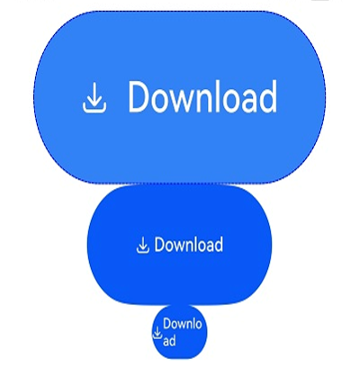
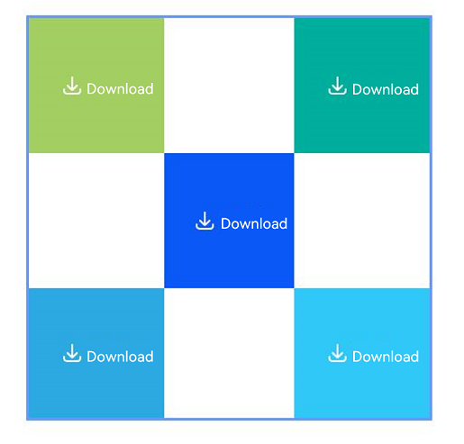

# Security Component Universal Attributes

<!--Kit: ArkUI-->
<!--Subsystem: Security-->
<!--Owner: @harylee-->
<!--Designer: @linshuqing; @hehehe-li-->
<!--Tester: @leiyuqian-->
<!--Adviser: @zengyawen-->
<!-- md-trans-meta sourceCommit=50713b5507bc1dd76af41b33f945afecf178d99e translatedAt=2026-09-07T08:06:26.232Z -->

The security component universal attribute module provides unified configuration capabilities for the layout, size, text, icon, color, border, and interaction universal attributes of security controls.

This module applies to the following scenarios:

- Uniformly sets layout, size, text, icon, color, border, and interaction related attributes for security controls such as [PasteButton](ts-security-components-pastebutton.md#pastebutton-1) and [SaveButton](ts-security-components-savebutton.md#savebutton-1).
- Adjusts the display effect and interaction experience of security controls while complying with the security control specifications. For details about the constraints, see [Constraints](../../../security/AccessToken/security-component-overview.md#constraints).
- Reuses the security control universal attribute capabilities through chained calls.

> **NOTE**
>
> This component is supported since API version 10. Updates will be marked with a superscript to indicate their earliest API version.

## Key Classes and APIs

### Key Enums

- **[SecurityComponentLayoutDirection](#securitycomponentlayoutdirection):** Enumerates the layout direction of the security control icon and text, used to specify a horizontal or vertical layout.
- **[ButtonType](#buttontype):** Enumerates the button styles of a security control, used to specify a capsule, circle, rounded rectangle, or normal button style.

### Key APIs

- **SecurityComponentMethod&lt;T&gt;:** A collection of security control universal attribute methods, used to configure the layout, size, text, icon, color, border, and interaction attributes for a specific security control.

## iconSize

iconSize(value: Dimension): T

Sets the size of the security control icon.

**Atomic service API**: This API can be used in atomic services since API version 11.

**System capability**: SystemCapability.ArkUI.ArkUI.Full

**Parameters**

| Name | Type | Mandatory | Description |
|------------|------|-------|---------|
| value | [Dimension](ts-types.md#dimension10) | Yes | Size of the icon on the security control. If no unit is explicitly specified, the unit is vp.<br/>Default value: **16vp**.<br/>This parameter does not support percentage strings.<br/>If an invalid value or invalid unit is passed in, the attribute does not take effect and the control is displayed with the default value. |

**Return value**

| Type | Description |
| -------- | -------- |
| T | Security control attribute. |

## layoutDirection

layoutDirection(value: SecurityComponentLayoutDirection): T

Sets the direction in which the icon and text are distributed on the security control.

**Atomic service API**: This API can be used in atomic services since API version 11.

**System capability**: SystemCapability.ArkUI.ArkUI.Full

**Parameters**

| Name | Type | Mandatory | Description |
|------------|------|-------|---------|
| value | [SecurityComponentLayoutDirection](#securitycomponentlayoutdirection) | Yes | Direction in which the icon and text are distributed on the security control.<br/>Default value: SecurityComponentLayoutDirection.HORIZONTAL. |

**Return value**

| Type | Description |
| -------- | -------- |
| T | Attribute of the security control. |

## position

position(value: Position): T

Sets the absolute position, that is, the offset of the upper left corner of the security control relative to the upper left corner of the parent container.

**Atomic service API**: This API can be used in atomic services since API version 11.

**System capability**: SystemCapability.ArkUI.ArkUI.Full

**Parameters**

| Name | Type | Mandatory | Description |
|------------|------|-------|---------|
| value | [Position](ts-types.md#position) | Yes | Offset of the upper left corner of the security control relative to the upper left corner of the parent container. It applies to scenarios where the security control is placed in a fixed area of the page through absolute positioning.<br/>If no unit is explicitly specified, the unit is vp.<br/>It is recommended that both x and y be numeric coordinates.<br/>If the parameter is undefined or null, or if x or y is a non-numeric type, this attribute does not take effect, and the abnormal coordinates are processed as 0. |

**Return value**

| Type | Description |
| -------- | -------- |
| T | Returns the attributes of the security control. |

## markAnchor

markAnchor(value: Position): T

Sets the anchor of the security control during position locating, with the upper left corner of the control as the reference point for offsetting.

**Atomic service API**: This API can be used in atomic services since API version 11.

**System capability**: SystemCapability.ArkUI.ArkUI.Full

**Parameters**

| Name | Type | Mandatory | Description |
|------------|------|-------|---------|
| value | [Position](ts-types.md#position) | Yes | Anchor of the security control during position locating, with the upper left corner of the control as the reference point for offsetting. It is usually used together with position() and offset() to set the display position of the control more precisely.<br/>If no unit is explicitly specified, the unit is vp.<br/>There is no default value.<br/>If an invalid value is passed in, this attribute does not take effect. |

**Return value**

| Type | Description |
| -------- | -------- |
| T | Attribute of the security control. |

## offset

offset(value: Position | Edges | LocalizedEdges): T

Sets the coordinate offset of the security control relative to its own layout position.

**Atomic service API**: This API can be used in atomic services since API version 11.

**System capability**: SystemCapability.ArkUI.ArkUI.Full

**Parameters**

| Name | Type                   | Mandatory | Description                   |
|------------|------|-------|---------|
| value | [Position](ts-types.md#position) \| [Edges<sup>12+</sup>](ts-types.md#edges12) \| [LocalizedEdges<sup>12+</sup>](ts-types.md#localizededges12) | Yes | Coordinate offset of the security control relative to its own layout position. After being set, this attribute does not affect the layout of the parent container; it only adjusts the display position of the control during the drawing phase.<br/>When no unit is explicitly specified, the unit is vp.<br/>There is no default value.<br/>When the input parameter is invalid, this attribute does not take effect. |

**Return value**

| Type | Description |
| -------- | -------- |
| T | Attribute of the security control. |

## fontSize

fontSize(value: Dimension): T

Sets the size of the security control text.

**Atomic service API**: This API can be used in atomic services since API version 11.

**System capability**: SystemCapability.ArkUI.ArkUI.Full

**Parameters**

| Name | Type | Mandatory | Description |
|------------|------|-------|---------|
| value | [Dimension](ts-types.md#dimension10) | Yes | Size of the text on the security control. If no unit is explicitly specified, the unit is fp.<br/>Default value: $r('sys.float.ohos_id_text_size_button1').<br/>This parameter does not support percentage strings.<br/>If an invalid value is set, this attribute does not take effect.<br/>**Note:** When the security control text is not fully displayed, tapping does not grant authorization. The fontSize setting affects whether the text can be fully displayed, which in turn affects the authorization behavior of the security control. |

**Return value**

| Type | Description |
| -------- | -------- |
| T | Attributes of the security control. |

## fontStyle

fontStyle(value: FontStyle): T

Sets the style of the text on the security control.

**Atomic service API**: This API can be used in atomic services since API version 11.

**System capability**: SystemCapability.ArkUI.ArkUI.Full

**Parameters**

| Name | Type | Mandatory | Description |
|------------|------|-------|---------|
| value | [FontStyle](ts-appendix-enums.md#fontstyle) | Yes | Style of the text on the security control.<br/>Default value: FontStyle.Normal. |

**Return value**

| Type | Description |
| -------- | -------- |
| T | Returns the attributes of the security control. |

## fontWeight

fontWeight(value: number | FontWeight | string | Resource): T

Sets the font weight of the security control text.

**Atomic service API**: This API can be used in atomic services since API version 11.

**System capability**: SystemCapability.ArkUI.ArkUI.Full

**Parameters**

| Name | Type                   | Mandatory | Description                   |
|------------|------|-------|---------|
| value | number \| [FontWeight](ts-appendix-enums.md#fontweight) \| string \| [Resource](ts-types.md#resource)<sup>20+</sup> | Yes | Font weight of the text on the security control.<br/>For the number type, the value ranges from 100 to 900, in increments of 100. A larger value indicates a bolder font.<br/>For the string type, numeric strings (for example, '400') and strings corresponding to the enum values in FontWeight (for example, 'bold', 'bolder', 'lighter', 'regular', and 'medium') are supported.<br/>Since API version 20, the Resource type is supported. The Resource type supports only 'integer' and 'string'. When the type is 'integer', the value follows the number type described above. When the type is 'string', the value follows the string type described above.<br/>If fontWeight is not set for the control, the font weight is set to FontWeight.Medium by default. If the value parameter is undefined or null, or the number type value is outside the range [100, 900], or the string type value does not conform to the string format corresponding to the FontWeight enum values, the font weight is set to FontWeight.Normal. |

**Return value**

| Type | Description |
| -------- | -------- |
| T | Attribute of the security control. |

## fontFamily

fontFamily(value: string | Resource): T

Sets the font of the security control text.

**Atomic service API**: This API can be used in atomic services since API version 11.

**System capability**: SystemCapability.ArkUI.ArkUI.Full

**Parameters**

| Name | Type                   | Mandatory | Description                   |
|------------|------|-------|---------|
| value | string \| [Resource](ts-types.md#resource) | Yes | Font of the text on the security control.<br/>Default font: 'HarmonyOS Sans'. |

**Return value**

| Type | Description |
| -------- | -------- |
| T | Attributes of the security control. |

## fontColor

fontColor(value: ResourceColor): T

Sets the color of the text on the security control.

**Atomic service API**: This API can be used in atomic services since API version 11.

**System capability**: SystemCapability.ArkUI.ArkUI.Full

**Parameters**

| Name | Type                   | Mandatory | Description                   |
|------------|------|-------|---------|
| value | [ResourceColor](ts-types.md#resourcecolor) | Yes | Color of the text on the security control.<br/>Default value: $r('sys.color.font_on_primary'). |

**Return value**

| Type | Description |
| -------- | -------- |
| T | Attribute of the security control. |

## iconColor

iconColor(value: ResourceColor): T

Sets the color of the security control icon.

**Atomic service API**: This API can be used in atomic services since API version 11.

**System capability**: SystemCapability.ArkUI.ArkUI.Full

**Parameters**

| Name | Type                   | Mandatory | Description                   |
|------------|------|-------|---------|
| value | [ResourceColor](ts-types.md#resourcecolor) | Yes | Color of the icon on the security control.<br/>Default value: $r('sys.color.icon_on_primary'). |

**Return value**

| Type | Description |
| -------- | -------- |
| T | Attribute of the security control. |

## backgroundColor

backgroundColor(value: ResourceColor): T

Sets the background color of the security control.

**Atomic service API**: This API can be used in atomic services since API version 11.

**System capability**: SystemCapability.ArkUI.ArkUI.Full

**Parameters**

| Name | Type                   | Mandatory | Description                   |
|------------|------|-------|---------|
| value | [ResourceColor](ts-types.md#resourcecolor) | Yes | Background color of the security control. When the alpha value of the upper eight bits of the security control button background color is lower than 0x1a (for example, 0x1800ff00), the system forcibly adjusts it to 0xff to ensure that the security control is visible enough and prevent users from triggering authorization unknowingly due to an overly transparent control.<br/>Default value: $r('sys.color.icon_emphasize').|

**Return value**

| Type | Description |
| -------- | -------- |
| T | Attribute of the security control. |

## borderStyle

borderStyle(value: BorderStyle): T

Sets the style of the security control border.

**Atomic service API**: This API can be used in atomic services since API version 11.

**System capability**: SystemCapability.ArkUI.ArkUI.Full

**Parameters**

| Name | Type | Mandatory | Description |
|------------|------|-------|---------|
| value | [BorderStyle](ts-appendix-enums.md#borderstyle) | Yes | Style of the security control border.<br/>By default, no border style is set.|

**Return value**

| Type | Description |
| -------- | -------- |
| T | Attributes of the security control. |

## borderWidth

borderWidth(value: Dimension): T

Sets the border width of the security control.

**Atomic service API**: This API can be used in atomic services since API version 11.

**System capability**: SystemCapability.ArkUI.ArkUI.Full

**Parameters**

| Name | Type | Mandatory | Description |
|------------|------|-------|---------|
| value | [Dimension](ts-types.md#dimension10) | Yes | Border width of the security control.<br/>Default value: **0vp**. If no unit is explicitly specified, the unit is vp.<br/>Percentage strings are not supported. If an invalid value is set, this attribute does not take effect.|

**Return value**

| Type | Description |
| -------- | -------- |
| T | Attribute of the security control. |

## borderColor

borderColor(value: ResourceColor): T

Sets the border color of the security control.

**Atomic service API**: This API can be used in atomic services since API version 11.

**System capability**: SystemCapability.ArkUI.ArkUI.Full

**Parameters**

| Name | Type                   | Mandatory | Description                   |
|------------|------|-------|---------|
| value | [ResourceColor](ts-types.md#resourcecolor) | Yes | Border color of the security control.<br/>By default, no border color is set.|

**Return value**

| Type | Description |
| -------- | -------- |
| T | Attributes of the security control. |

## borderRadius

borderRadius(value: Dimension): T

Sets the border corner radius of the security control.

The effect of borderRadius is affected by ButtonType. When the button type is Capsule or Circle, the borderRadius setting does not take effect, and the button corner radius is automatically determined by the button type. When the button type is Normal or ROUNDED_RECTANGLE, the borderRadius setting takes effect. For details, see [ButtonType](#buttontype).

**Atomic service API**: This API can be used in atomic services since API version 11.

**System capability**: SystemCapability.ArkUI.ArkUI.Full

**Parameters**

| Name | Type                   | Mandatory | Description                   |
|------------|------|-------|---------|
| value |  [Dimension](ts-types.md#dimension10) | Yes | Border corner radius of the security control. If no unit is explicitly specified, the unit is vp.<br/>Default value: **0vp**.<br/>Percentage strings are not supported. The corner radius is limited by the component size. The minimum value is 0, and the maximum value is half of the smaller value between the width and height. If an invalid value is set, this attribute does not take effect.|

**Return value**

| Type | Description |
| -------- | -------- |
| T | Returns the attributes of the security control. |

## borderRadius<sup>15+</sup>

borderRadius(radius: Dimension | BorderRadiuses): T

Sets the border corner radius of the security control. The radius of each of the four corners can be set separately.

The effect of borderRadius is affected by ButtonType. When the button type is Capsule or Circle, the borderRadius setting does not take effect, and the button corner radius is automatically determined by the button type. When the button type is Normal or ROUNDED_RECTANGLE, the borderRadius setting takes effect. For details, see [ButtonType](#buttontype).

**Atomic service API**: This API can be used in atomic services since API version 15.

**System capability**: SystemCapability.ArkUI.ArkUI.Full

**Parameters**

| Name | Type                   | Mandatory | Description                   |
|------------|------|-------|---------|
| radius |  [Dimension](ts-types.md#dimension10) \| [BorderRadiuses](ts-types.md#borderradiuses9) | Yes | Border corner radius of the security control. If no unit is explicitly specified, the unit is vp.<br/>Default value: **0vp**.<br/>The Dimension type does not support percentage strings. The corner radius is limited by the component size. The minimum value is 0, and the maximum value is half of the smaller value between the width and height. If an invalid value is set, this attribute does not take effect.|

**Return value**

| Type | Description |
| -------- | -------- |
| T | Returns the attributes of the security control. |

## padding

padding(value: Padding | Dimension): T

Sets the padding of the security control.

**Atomic service API**: This API can be used in atomic services since API version 11.

**System capability**: SystemCapability.ArkUI.ArkUI.Full

**Parameters**

| Name | Type                   | Mandatory | Description                   |
|------------|------|-------|---------|
| value | [Padding](ts-types.md#padding) \| [Dimension](ts-types.md#dimension10) | Yes | Padding of the security control. If no unit is explicitly specified, the unit is vp.<br/>Default value: 8 vp for top and bottom, 16 vp for left and right.<br/>**Note:** This parameter does not support the percentage string data type. If a percentage string is set, the corresponding padding is displayed as 0.|

**Return value**

| Type | Description |
| -------- | -------- |
| T | Attribute of the security control. |

## align<sup>15+</sup>

align(alignType: Alignment): T

Sets the alignment of the icon and text of the security control.

**Atomic service API**: This API can be used in atomic services since API version 15.

**System capability**: SystemCapability.ArkUI.ArkUI.Full

**Parameters**

| Name | Type                   | Mandatory | Description                   |
|------------|------|-------|---------|
| alignType | [Alignment](ts-appendix-enums.md#alignment) | Yes | Alignment of the icon and text of the security control. The icon and text are aligned as a whole within the control background. The display effect is affected by [padding](ts-securitycomponent-attributes.md#padding). After padding takes effect, alignment is performed according to the alignment specified by the alignType parameter.<br/>Default value: **Alignment.Center**.|

**Return value**

| Type | Description |
| -------- | -------- |
| T | Attribute of the security control. |

## textIconSpace

textIconSpace(value: Dimension): T

Sets the spacing between the icon and text in a security control.

**Atomic service API**: This API can be used in atomic services since API version 11.

**System capability**: SystemCapability.ArkUI.ArkUI.Full

**Parameters**

| Name | Type | Mandatory | Description |
|------------|------|-------|---------|
| value | [Dimension](ts-types.md#dimension10) | Yes | Spacing between the icon and text in a security control. If no unit is explicitly specified, the unit is vp.<br/>Default value: **4vp**<br/>**Note:** This parameter does not support the percentage string data type. If a percentage string is set, the spacing between the icon and text is displayed as 0. Since API version 14, if a negative value is set, the default value is used.|

**Return value**

| Type | Description |
| -------- | -------- |
| T | Attribute of the security control. |

## width<sup>11+</sup>

width(value: Length): T

Sets the width of the security control. If this attribute is not set, the width is adapted based on the element content. When used together with adaptive font size attributes, the width setting affects whether the text can be fully displayed.

**Atomic service API**: This API can be used in atomic services since API version 12.

**System capability**: SystemCapability.ArkUI.ArkUI.Full

**Parameters**

| Name | Type                   | Mandatory | Description                   |
|------------|------|-------|---------|
| value | [Length](ts-types.md#length) | Yes | Width of the security control. If this attribute is not set, the width is adapted based on the element content. If no unit is explicitly specified, the unit is vp.<br/>When used together with [minFontSize](#minfontsize18), [maxFontSize](#maxfontsize18), [maxLines](#maxlines18), and [heightAdaptivePolicy](#heightadaptivepolicy18) to implement adaptive font size, if the security control text is not fully displayed, a tap will not be authorized. If an invalid value is set, this attribute does not take effect.|

**Return value**

| Type | Description |
| -------- | -------- |
| T | Attribute of the security control. |

## height<sup>11+</sup>

height(value: Length): T

Sets the height of the security control. If this attribute is not set, the height is adapted based on the element content. When used together with adaptive font size attributes, the height setting affects whether the text can be fully displayed.

**Atomic service API**: This API can be used in atomic services since API version 12.

**System capability**: SystemCapability.ArkUI.ArkUI.Full

**Parameters**

| Name | Type                   | Mandatory | Description                   |
|------------|------|-------|---------|
| value | [Length](ts-types.md#length) | Yes | Height of the security control. If this attribute is not set, the height is adapted based on the element content. If no unit is explicitly specified, the unit is vp.<br/>When used together with [minFontSize](#minfontsize18), [maxFontSize](#maxfontsize18), [maxLines](#maxlines18), and [heightAdaptivePolicy](#heightadaptivepolicy18) to implement adaptive font size, if the text of the security control is not fully displayed, tapping the control does not grant authorization. If an invalid value is set, this attribute does not take effect.|

**Return value**

| Type | Description |
| -------- | -------- |
| T | Attribute of the security control. |

## size<sup>11+</sup>

size(value: SizeOptions): T

Sets the width and height. If they are not set, the width and height are adapted based on the element content. The size method is used to set the width and height at the same time. To set the width or height separately, use the [width](#width11) or [height](#height11) method.

**Atomic service API**: This API can be used in atomic services since API version 12.

**System capability**: SystemCapability.ArkUI.ArkUI.Full

**Parameters**

| Name | Type                   | Mandatory | Description                   |
|------------|------|-------|---------|
| value | [SizeOptions](ts-types.md#sizeoptions) | Yes | Width and height. If they are not set, the width and height are adapted based on the element content. If no unit is explicitly specified, the unit is vp.<br/>When used together with [minFontSize](#minfontsize18), [maxFontSize](#maxfontsize18), [maxLines](#maxlines18), and [heightAdaptivePolicy](#heightadaptivepolicy18) to implement adaptive font size, if the security control text is not fully displayed, tapping the control will not trigger authorization. The size setting affects whether the text can be fully displayed.|

**Return value**

| Type | Description |
| -------- | -------- |
| T | Returns the attributes of the security control. |

## constraintSize<sup>11+</sup>

constraintSize(value: ConstraintSizeOptions): T

Sets the constraint size to limit the size range during component layout.

**Atomic service API**: This API can be used in atomic services since API version 12.

**System capability**: SystemCapability.ArkUI.ArkUI.Full

**Parameters**

| Name | Type | Mandatory | Description |
|------------|------|-------|---------|
| value | [ConstraintSizeOptions](ts-types.md#constraintsizeoptions) | Yes | Constraint size, which limits the size range during component layout. If no unit is explicitly specified, the unit is vp.<br/>The priority of constraintSize is higher than that of width and height.<br/>When attributes related to adaptive font size are used, incomplete display of the security control text will cause the tap to fail to authorize. The setting of constraintSize affects whether the text can be fully displayed.<br/>For the value result, see [Impact of constraintSize on width/height](ts-universal-attributes-size.md#constraintsize).<br/>Default value:<br/>{<br/>minWidth:&nbsp;0,<br/>maxWidth:&nbsp;Infinity,<br/>minHeight:&nbsp;0,<br/>maxHeight:&nbsp;Infinity<br/>}. |

**Return value**

| Type | Description |
| -------- | -------- |
| T | Returns the attributes of the security control. |

## alignRules<sup>15+</sup>

alignRules(alignRule: AlignRuleOption): T

Sets the alignment rules of a child component in a relative container. This attribute takes effect only when the parent container is [RelativeContainer](ts-container-relativecontainer.md).

**Atomic service API**: This API can be used in atomic services since API version 15.

**System capability**: SystemCapability.ArkUI.ArkUI.Full

**Parameters**

| Name | Type                                        | Required | Description                     |
| ------ | ------------------------------------------- | ---- | ------------------------ |
| alignRule | [AlignRuleOption](ts-universal-attributes-location.md#alignruleoption9) | Yes   | Alignment rule configuration object, which contains anchor alignment configurations such as top, bottom, left, right, and center, and is used to specify the alignment position and mode of the security control in [RelativeContainer](ts-container-relativecontainer.md). |

**Return value**

| Type | Description |
| -------- | -------- |
| T | Returns the attributes of the security control. |

## alignRules<sup>15+</sup>

alignRules(alignRule: LocalizedAlignRuleOptions): T

Sets the alignment rules of a child component in a relative container. This method takes effect only when the parent container is [RelativeContainer](ts-container-relativecontainer.md). Horizontally, this method uses start and end to replace left and right in [alignRules](#alignrules15), so that the layout can be mirrored in RTL mode. It is recommended to use this method preferentially.

**Atomic service API**: This API can be used in atomic services since API version 15.

**System capability**: SystemCapability.ArkUI.ArkUI.Full

**Parameters**

| Name | Type                                        | Mandatory | Description                     |
| ------ | ------------------------------------------- | ---- | ------------------------ |
| alignRule | [LocalizedAlignRuleOptions](ts-universal-attributes-location.md#localizedalignruleoptions12) | Yes   | Alignment rule configuration object, which uses start/end to replace left/right to support RTL layout mirroring. It contains anchor alignment configurations such as top, bottom, start, end, and center, and is used to specify the alignment position and mode of the security control in [RelativeContainer](ts-container-relativecontainer.md). |

**Return value**

| Type | Description |
| -------- | -------- |
| T | Returns the attributes of the security control. |

## id<sup>15+</sup>

id(id: string): T

Unique identifier of the component. The uniqueness is guaranteed by the user.

**Atomic service API**: This API can be used in atomic services since API version 15.

**System capability**: SystemCapability.ArkUI.ArkUI.Full

**Parameters**

| Name   | Type      | Mandatory | Description                       |
| ------ | -------- | -----|---------------------- |
| id | string   | Yes | Unique identifier of the component. The uniqueness is guaranteed by the user.<br/>Default value: ''. |

**Return value**

| Type | Description |
| -------- | -------- |
| T | Returns the attributes of the security control. |

## chainMode<sup>15+</sup>

chainMode(direction: Axis, style: ChainStyle): T

Sets the parameters (including the direction and style of the chain) of the chain layout formed with this component as the chain head. This attribute takes effect only when the parent container is [RelativeContainer](ts-container-relativecontainer.md).

**Atomic service API**: This API can be used in atomic services since API version 15.

**System capability**: SystemCapability.ArkUI.ArkUI.Full

**Parameters**

| Name | Type                                        | Mandatory | Description                     |
| ------ | ------------------------------------------- | ---- | ------------------------ |
| direction | [Axis](ts-appendix-enums.md#axis) | Yes   | Direction of the chain layout, which specifies the arrangement direction of the chain with this component as the chain head in [RelativeContainer](ts-container-relativecontainer.md). |
| style | [ChainStyle](ts-universal-attributes-location.md#chainstyle12) | Yes   | Style of the chain layout, which controls the distribution of child components in the chain, such as even distribution, both-end alignment, or compact arrangement. For details about the values and effects, see [ChainStyle](ts-universal-attributes-location.md#chainstyle12). |

**Return value**

| Type | Description |
| -------- | -------- |
| T | Attribute of the security control. |

## minFontScale<sup>18+</sup>

minFontScale(scale: number | Resource): T

Sets the minimum font scale-down factor for the text. After this API is called, when the system font scaling shrinks the text, the text scale-down factor will not be lower than the set minimum scale-down factor.

It can be used together with [maxFontScale](#maxfontscale18). minFontScale controls the lower limit of the scale-down factor, and maxFontScale controls the upper limit of the scale-up factor. The two can be set independently or simultaneously to precisely control the font scaling range.

**Atomic service API**: This API can be used in atomic services since API version 18.

**System capability**: SystemCapability.ArkUI.ArkUI.Full

**Parameters**

| Name | Type                                          | Mandatory | Description                                          |
| ------ | --------------------------------------------- | ---- | --------------------------------------------- |
| scale  | number \| [Resource](ts-types.md#resource) | Yes   | Minimum font scale-down factor for the text.<br/>Value range: [0, 1].<br/>**Note:** <br/>If the value is less than 0, it is processed as 0, which means the text can be scaled down to any factor. If the value is greater than 1, it is processed as 1, which means the font cannot be scaled down. If the value is an invalid value such as undefined or null, the attribute does not take effect. |

**Return value**

| Type | Description |
| -------- | -------- |
| T | Attribute of the security control. |

## maxFontScale<sup>18+</sup>

maxFontScale(scale: number | Resource): T

Sets the maximum font scale factor for text. After this API is called, when the system font scaling enlarges the text, the text scale factor will not exceed the set maximum scale factor.

It can be used together with [minFontScale](#minfontscale18). maxFontScale controls the upper limit of the scale factor, and minFontScale controls the lower limit of the scale factor. They can be set independently or simultaneously to precisely control the font scaling range.

**Atomic service API**: This API can be used in atomic services since API version 18.

**System capability**: SystemCapability.ArkUI.ArkUI.Full

**Parameters**

| Name | Type                                          | Mandatory | Description                                          |
| ------ | --------------------------------------------- | ---- | --------------------------------------------- |
| scale  | number \| [Resource](ts-types.md#resource) | Yes   | Maximum font scale factor for text.<br/>Value range: [1, +∞).<br/>**Note:** <br/>If the set value is less than 1, it is processed as 1. If the set value is an invalid value such as undefined or null, the attribute does not take effect. |

**Return value**

| Type | Description |
| -------- | -------- |
| T | Attribute of the security control. |

## minFontSize<sup>18+</sup>

minFontSize(minSize: number | string | Resource): T

Sets the minimum font size for the text.
- Use it together with [maxFontSize](#maxfontsize18) and [maxLines](#maxlines18) or layout size constraints to implement adaptive font size. Setting it alone does not take effect.
- minFontSize must be smaller than maxFontSize. If the set value is greater than maxFontSize, maxFontSize is used.
- If minFontSize is less than or equal to 0, adaptive font size does not take effect.
- When adaptive font size takes effect, the fontSize setting does not take effect.
- When the text of a security control is not fully displayed, tapping it does not grant authorization. The minFontSize setting affects whether the text can be fully displayed, which in turn affects the authorization behavior of the security control.

**Atomic service API**: This API can be used in atomic services since API version 18.

**System capability**: SystemCapability.ArkUI.ArkUI.Full

**Parameters**

| Name | Type                                                         | Mandatory | Description               |
| ------ | ------------------------------------------------------------ | ---- | ------------------ |
| minSize  | number&nbsp;\|&nbsp;string&nbsp;\|&nbsp;[Resource](ts-types.md#resource) | Yes   | Minimum font size for the text. If no unit is explicitly specified, the unit is fp.<br/>Value range: (0, +∞). minFontSize must be smaller than maxFontSize. If the set value is greater than maxFontSize, maxFontSize is used; if it is less than or equal to 0, adaptive font size does not take effect. |

**Return value**

| Type | Description |
| -------- | -------- |
| T | Returns the attributes of the security control. |

## maxFontSize<sup>18+</sup>

maxFontSize(maxSize: number | string | Resource): T

Sets the maximum font size for the text.
- Used together with [minFontSize](#minfontsize18) and [maxLines](#maxlines18) or layout size constraints to implement adaptive font size. It does not take effect when set alone.
- maxFontSize must be greater than minFontSize. If maxFontSize is smaller than minFontSize, minFontSize is processed as maxFontSize.
- When adaptive font size takes effect, the configured fontSize does not take effect.
- When the security control text is not fully displayed, tapping does not grant authorization. The setting of maxFontSize affects whether the text can be fully displayed, which in turn affects the authorization behavior of the security control.

**Atomic service API**: This API can be used in atomic services since API version 18.

**System capability**: SystemCapability.ArkUI.ArkUI.Full

**Parameters**

| Name | Type                                                         | Mandatory | Description               |
| ------ | ------------------------------------------------------------ | ---- | ------------------ |
| maxSize  | number&nbsp;\|&nbsp;string&nbsp;\|&nbsp;[Resource](ts-types.md#resource) | Yes   | Maximum font size for the text. When no unit is explicitly specified, the unit is fp.<br/>Value range: (0, +∞).<br/>**NOTE**<br/>When the set value is less than or equal to 0, adaptive font size does not take effect. When an invalid value is set, this attribute does not take effect. |

**Return value**

| Type | Description |
| -------- | -------- |
| T | Attribute of the security control. |

## maxLines<sup>18+</sup>

maxLines(line: number | Resource): T

Sets the maximum number of lines for the text. By default, the text wraps automatically. After this attribute is specified, the maximum number of displayed lines of the text does not exceed the specified value. It can be used independently to limit the number of text lines, or together with [minFontSize](#minfontsize18), [maxFontSize](#maxfontsize18), and [heightAdaptivePolicy](#heightadaptivepolicy18). When used together with the adaptive font size attributes, if the security control text is not fully displayed, a tap does not grant authorization. The setting of maxLines affects whether the text can be fully displayed, which in turn affects the authorization behavior of the security control.

**Atomic service API**: This API can be used in atomic services since API version 18.

**System capability**: SystemCapability.ArkUI.ArkUI.Full

**Parameters**

| Name | Type   | Mandatory | Description             |
| ------ | ------ | ---- | ---------------- |
| line  | number \| [Resource](ts-types.md#resource)<sup>20+</sup> | Yes   | Maximum number of lines for the text.<br/>Value range of the number type input parameter: [1, +∞). Since API version 20, the Resource type is supported. The Resource type supports only 'integer', with a value range of [1, +∞).<br/>**Note:** <br/>If the set value is less than 1, the default value 1000000 is used. |

**Return value**

| Type | Description |
| -------- | -------- |
| T | Attribute of the security control. |

## heightAdaptivePolicy<sup>18+</sup>

heightAdaptivePolicy(policy: TextHeightAdaptivePolicy): T

Sets the text height adaptation mode. This attribute applies to scenarios where a security control needs to dynamically adjust text display to ensure the text is fully displayed under different sizes or language environments.

The security control text is laid out with the value of [maxFontSize](#maxfontsize18). If the text can be fully displayed, no adaptive adjustment is required and this API does not take effect. Otherwise, the text is adjusted according to the specified text height adaptation mode. The specific adaptive adjustment rules are as follows:

When set to TextHeightAdaptivePolicy.MAX_LINES_FIRST, the [maxLines](#maxlines18) attribute is preferentially used to adjust the text height. If the layout size using the maxLines attribute exceeds the layout constraints, the font size is reduced within the range of [minFontSize](#minfontsize18) and [maxFontSize](#maxfontsize18) to display more text. If the text still cannot be fully displayed, the security control adaptively adjusts its height so that the text is fully displayed.

When set to TextHeightAdaptivePolicy.MIN_FONT_SIZE_FIRST, the [minFontSize](#minfontsize18) attribute is preferentially used to adjust the text height. If the text can be laid out in one line using the minFontSize attribute, the font size is increased within the range of minFontSize and [maxFontSize](#maxfontsize18) and the largest possible font size is used. If the text cannot be laid out in one line using the minFontSize attribute, the [maxLines](#maxlines18) attribute is used for layout. If the text still cannot be fully displayed, the security control adaptively adjusts its height so that the text is fully displayed.

When set to TextHeightAdaptivePolicy.LAYOUT_CONSTRAINT_FIRST, the layout constraints are preferentially used to adjust the text height. If the layout size exceeds the layout constraints, the font size is reduced within the range of [minFontSize](#minfontsize18) and [maxFontSize](#maxfontsize18) to meet the layout constraints. If the layout size still exceeds the layout constraints after the font size is reduced to minFontSize, the lines exceeding the layout constraints are removed. If the [maxLines](#maxlines18) attribute is set, the number of lines after layout does not exceed the maxLines value (horizontal truncation may occur). If the maxLines attribute is not set, the number of lines after layout is not limited.

When the security control text is not fully displayed, tapping does not grant authorization. Whether the text is fully displayed is affected by attributes such as heightAdaptivePolicy, minFontSize, maxFontSize, maxLines, width, and height.

For details about the effect, see [Example](#example-3).

**Atomic service API**: This API can be used in atomic services since API version 18.

**System capability**: SystemCapability.ArkUI.ArkUI.Full

**Parameters**

| Name | Type                                                         | Mandatory | Description                                                         |
| ------ | ------------------------------------------------------------ | ---- | ------------------------------------------------------------ |
| policy  | [TextHeightAdaptivePolicy](ts-appendix-enums.md#textheightadaptivepolicy10) | Yes   | Text height adaptation mode.<br/>Default value: TextHeightAdaptivePolicy.MAX_LINES_FIRST. |

**Return value**

| Type | Description |
| -------- | -------- |
| T | Attributes of the security control. |

## enabled<sup>18+</sup>

enabled(respond: boolean): T

Sets whether the security control is interactive.

**Atomic service API**: This API can be used in atomic services since API version 18.

**System capability**: SystemCapability.ArkUI.ArkUI.Full

**Parameters**

| Name | Type | Mandatory | Description |
| ------ | ------- | ---- | ------------------------------------------------------------ |
| respond  | boolean | Yes  | Whether the component is interactive and responds to operations such as tapping.<br/>The value **true** means the component is interactive and responds to operations such as tapping.<br/>The value **false** means the component is not interactive and does not respond to operations such as tapping.<br/>Default value: **true**. |

**Return value**

| Type | Description |
| -------- | -------- |
| T | Returns the attributes of the security control. |

## focusBox<sup>22+</sup>

focusBox(style: FocusBoxStyle): T

Sets the system focus box style of the security control.

**Atomic service API**: This API can be used in atomic services since API version 22.

**System capability**: SystemCapability.ArkUI.ArkUI.Full

**Parameters**

| Name | Type | Mandatory | Description |
| ---- | ---- | ---- | ---- |
| style  | [FocusBoxStyle](ts-universal-attributes-focus.md#focusboxstyle12) | Yes   | Focus box style configuration object, which contains attributes such as margin (the spacing between the focus box and the control) and strokeColor (the border color of the focus box), used to customize the appearance of the system focus box. |

**Return value**

| Type | Description |
| -------- | -------- |
| T | Attribute of the security control. |

## fallbackLineSpacing

fallbackLineSpacing(enabled: boolean): T

For multi-line text overlay, supports adaptive line height based on the actual text height.

The fallbackLineSpacing attribute is strongly related to the lineHeight attribute of [RichEditorTextStyle](ts-basic-components-richeditor.md#richeditortextstyle). When the set lineHeight value is smaller than the actual rendering height of the text at the current font size, whether the line height adapts to the actual text height is determined by the fallbackLineSpacing attribute value.

**Since**: 26.0.0

**Model restriction**: This API can be used only in the stage model.

**Atomic service API:** This API can be used in atomic services since API version 26.0.0.

**System capability**: SystemCapability.ArkUI.ArkUI.Full

**Parameters**

| Name | Type | Mandatory | Description |
| ------- | ------------------------------------------------------------ | ---- | ------------------------------------------------------------ |
| enabled | boolean | Yes | Whether the line height adapts to the actual text height.<br/>The value **true** means the line height adapts to the actual text height; the value **false** means the line height does not adapt to the actual text height. |

**Return value**

| Type | Description |
| -------- | -------- |
| T | Returns the attributes of the security control. |

## accessibilityRole

accessibilityRole(role: SecurityComponentRoleType): T

Sets the accessibility component type. A specific component type has a specific reading mode. You can modify the component type based on application requirements to control how the component is read and what content is read in accessibility mode.

**Since**: 26.0.0

**Model restriction**: This API can be used only in the stage model.

**Atomic service API:** This API can be used in atomic services since API version 26.0.0.

**System capability**: SystemCapability.ArkUI.ArkUI.Full

**Parameters**

| Name | Type | Mandatory | Description |
| -------- | ------- | ---- | ------------------------------------------------------------ |
| role | [SecurityComponentRoleType](#securitycomponentroletype) | Yes | Component type read aloud by the screen reader, such as button or chart. The specific type can be customized by the developer. |

**Return value**

| Type | Description |
| -------- | -------- |
| T | Returns the current object. |

## accessibilityDefaultFocus

accessibilityDefaultFocus(focus: boolean): T

Sets the initial focus for screen reading on a page, which is used to specify the component that is first announced by the screen reader after the page is loaded.

**Since**: 26.0.0

**Model restriction**: This API can be used only in the stage model.

**Atomic service API:** This API can be used in atomic services since API version 26.0.0.

**System capability**: SystemCapability.ArkUI.ArkUI.Full

**Parameters**

| Name | Type    | Mandatory | Description                                                         |
| ------ | ------- | ---- | ------------------------------------------------------------ |
| focus  | boolean | Yes   | Whether to set the initial focus for screen reading on the page. The value **true** indicates that this component is the default first focus of the current page, and the value **false** or any other value is invalid. |

**Return value**

| Type | Description |
| -------- | -------- |
| T | Current object. |

## accessibilityNextFocusId

accessibilityNextFocusId(nextId: string): T

Specifies the next component to be focused during screen reading.

**Since**: 26.0.0

**Model restriction**: This API can be used only in the stage model.

**Atomic service API:** This API can be used in atomic services since API version 26.0.0.

**System capability**: SystemCapability.ArkUI.ArkUI.Full

**Parameters**

| Name | Type | Mandatory | Description |
| ------ | ------ | ---- | ------------------------------------------------------------ |
| nextId | string | Yes | [Unique ID](ts-universal-attributes-component-id.md#id) of the next component to be focused. If no component matches the unique ID, the setting does not take effect. |

**Return value**

| Type | Description |
| -------- | -------- |
| T | Current object. |

## accessibilityDescription

accessibilityDescription(description: string | Resource): T

This attribute is used to provide an accessibility description for the control. Developers can set detailed text descriptions to help users understand the function of the component and the operation to be performed.

**Since**: 26.0.0

**Model restriction**: This API can be used only in the stage model.

**Atomic service API:** This API can be used in atomic services since API version 26.0.0.

**System capability**: SystemCapability.ArkUI.ArkUI.Full

**Parameters**

| Name | Type | Mandatory | Description |
| ------ | ------ | ---- | ------------------------------------------------------------ |
| description | string \| [Resource](ts-types.md#resource) | Yes | Accessibility description of the control. It supplements the detailed operation explanation of the component to help users understand the specific content of the current operation and its potential consequences. When the control is selected, if the component contains both a text attribute and an accessibility description, the text content is announced first, followed by the accessibility description. The default value of this parameter is an empty string. |

**Return value**

| Type | Description |
| -------- | -------- |
| T | Returns the current object. |


## SecurityComponentLayoutDirection

Enumerates the layout direction of the icon and text on a security control.

**Atomic service API**: This API can be used in atomic services since API version 11.

**System capability**: SystemCapability.ArkUI.ArkUI.Full

| Name | Value | Description |
| -------- | -------- | -------- |
| HORIZONTAL | 0 | The icon and text on the security control are arranged horizontally. |
| VERTICAL | 1 | The icon and text on the security control are arranged vertically. |

## ButtonType

Enumerates the button types.

Different button types affect the setting effect of the [borderRadius (border corner radius)](ts-securitycomponent-attributes.md#borderradius) attribute. The effects are as follows:

- When the button type is Capsule, the borderRadius setting does not take effect, and the button corner radius is always half of the smaller value between the width and height.
- When the button type is Circle, the borderRadius setting does not take effect:
  - If both the width and height are set, the button corner radius is half of the smaller value between the width and height;
  - If only one of the width and height is set, the button corner radius is half of the set width or height value;
  - If neither the width nor the height is set, or the borderRadius value is negative, the button corner radius is automatically calculated based on the actual layout size of the button. This applies to icon buttons, such as volume control and play/pause scenarios.
- When the button type is Normal, the button corner radius can be set through borderRadius. The corner size is limited by the component size, with a minimum value of 0 and a maximum value of half of the smaller value between the component width and height. This applies to button scenarios that require a custom corner size or right angles.
- When the button type is ROUNDED_RECTANGLE, if borderRadius is not set, the corner radius of the rounded rectangle button remains at the default value of 20vp and does not change with the button height. This applies to button scenarios that require a unified corner style.

**Atomic service API**: This API can be used in atomic services since API version 11.

**System capability**: SystemCapability.ArkUI.ArkUI.Full

| Name      | Value | Description               |
| ------- | -------- | ------------------ |
| Normal  | 0 | Normal button.      |
| Capsule | 1 | Capsule button (the corner radius is half the height). |
| Circle  | 2 | Circle button.              |
| ROUNDED_RECTANGLE<sup>16+</sup> | 8 | Rounded rectangle button (default value: corner radius of 20 vp). |

## SecurityComponentRoleType

Defines the screen reader role type of a component.

**Since**: 26.0.0

**Model restriction**: This API can be used only in the stage model.

**Atomic service API:** This API can be used in atomic services since API version 26.0.0.

**System capability**: SystemCapability.ArkUI.ArkUI.Full

| Name | Value | Description |
| ---- | ---- | ------------------ |
| ROLE_NONE | 0 | NULL. |
| BUTTON | 1 | Button. |

## Examples

> **NOTE**
> To prevent authorization failure caused by invalid control styles, developers are advised to first understand the [constraints](../../../security/AccessToken/security-component-overview.md#constraints) of security control styles.

### Example 1

Sets the basic attributes of SecurityComponent to create a save control.

```ts
@Entry
@Component
struct Index {
  build() {
    Row() {
      Column({ space: 5 }) {
        // Create a save control and set its SecurityComponent attributes.
        SaveButton()
          .fontSize(35)
          .fontColor(Color.White)
          .iconSize(30)
          .layoutDirection(SecurityComponentLayoutDirection.HORIZONTAL)
          .borderWidth(1)
          .borderStyle(BorderStyle.Dashed)
          .borderColor(Color.Blue)
          .borderRadius(20)
          .fontWeight(100)
          .iconColor(Color.White)
          .padding({
            left: 50,
            top: 50,
            bottom: 50,
            right: 50
          })
          .textIconSpace(20)
          .backgroundColor(0x3282f6)
        // Create a save control and set its fixed width and height.
        SaveButton().size({ width: 200, height: 100 })
        // Create a save control, set its fixed width and height, and align the icon and text to the left.
        SaveButton()
          .size({ width: 200, height: 100 })
          .align(Alignment.Start)
        // Create a save control of the Normal type and set its four corner radii separately.
        SaveButton({ icon: SaveIconStyle.FULL_FILLED, text: SaveDescription.DOWNLOAD, buttonType: ButtonType.Normal })
          .size({ width: 150, height: 80 })
          .borderRadius({
            topLeft: 20,
            topRight: 25,
            bottomRight: 30,
            bottomLeft: 35
          })
        // Create a save control and set its maximum width constraint.
        SaveButton().constraintSize({ maxWidth: 60 })
      }.width('100%')
    }.height('100%')
  }
}
```



### Example 2

Use the container and the components inside the container as anchors for layout.

```ts
@Entry
@Component
struct Index {
  build() {
    Row() {
      RelativeContainer() {
        // Use the container as the anchor to position the control at the upper left corner, and set an ID for other components to reference.
        SaveButton({ icon: SaveIconStyle.FULL_FILLED, text: SaveDescription.DOWNLOAD, buttonType: ButtonType.Normal })
          .width(100)
          .height(100)
          .backgroundColor('#A3CF62')
          .alignRules({
            top: { anchor: '__container__', align: VerticalAlign.Top },
            left: { anchor: '__container__', align: HorizontalAlign.Start }
          })
          .id('row1')

        // Use the container as the anchor to position the control at the upper right corner, and set an ID for other components to reference.
        SaveButton({ icon: SaveIconStyle.FULL_FILLED, text: SaveDescription.DOWNLOAD, buttonType: ButtonType.Normal })
          .width(100)
          .height(100)
          .backgroundColor('#00AE9D')
          .alignRules({
            top: { anchor: '__container__', align: VerticalAlign.Top },
            right: { anchor: '__container__', align: HorizontalAlign.End }
          })
          .id('row2')

        // Use row1 and row2 as anchors to position the control between and below them.
        SaveButton({ icon: SaveIconStyle.FULL_FILLED, text: SaveDescription.DOWNLOAD, buttonType: ButtonType.Normal })
          .height(100)
          .backgroundColor('#0A59F7')
          .alignRules({
            top: { anchor: 'row1', align: VerticalAlign.Bottom },
            left: { anchor: 'row1', align: HorizontalAlign.End },
            right: { anchor: 'row2', align: HorizontalAlign.Start }
          })
          .id('row3')

        // Use row3, the container, and row1 as anchors to constrain the layout range of the control in the lower left area.
        SaveButton({ icon: SaveIconStyle.FULL_FILLED, text: SaveDescription.DOWNLOAD, buttonType: ButtonType.Normal })
          .backgroundColor('#2CA9E0')
          .alignRules({
            top: { anchor: 'row3', align: VerticalAlign.Bottom },
            bottom: { anchor: '__container__', align: VerticalAlign.Bottom },
            left: { anchor: '__container__', align: HorizontalAlign.Start },
            right: { anchor: 'row1', align: HorizontalAlign.End }
          })
          .id('row4')

        // Use row3, row2, and the container as anchors to constrain the layout range of the control in the lower right area.
        SaveButton({ icon: SaveIconStyle.FULL_FILLED, text: SaveDescription.DOWNLOAD, buttonType: ButtonType.Normal })
          .backgroundColor('#30C9F7')
          .alignRules({
            top: { anchor: 'row3', align: VerticalAlign.Bottom },
            bottom: { anchor: '__container__', align: VerticalAlign.Bottom },
            left: { anchor: 'row2', align: HorizontalAlign.Start },
            right: { anchor: '__container__', align: HorizontalAlign.End }
          })
          .id('row5')
      }
      .width(300).height(300)
      .margin({ left: 50 })
      .border({ width: 2, color: '#6699FF' })
    }
    .height('100%')
  }
}
```



### Example 3

The security control text height is adaptive.

```ts
@Entry
@Component
struct Index {
  build() {
    Column() {
      Scroll() {
        Column({ space: 10 }) {
          Column({ space: 10 }) {
            Row() {
              Text('FontSize = 20, legend:').fontSize(20)
              Text('Quickly save image').fontSize(20).fontColor(Color.Blue)
            }.width('100%')

            Row() {
              Text('FontSize = 10, legend:').fontSize(20)
              Text('Quickly save image').fontSize(10).fontColor(Color.Blue)
            }.width('100%')
          }.width('100%')

          Flex({ wrap: FlexWrap.Wrap }) {
            Column() {
              Row() {
                Text('heightAdaptivePolicy = MIN_FONT_SIZE_FIRST').fontSize(16).fontWeight(FontWeight.Bold)
              }
            }.height(40)

            Column() {
              Column({ space: 10 }) {
                Row() {
                  Text('No adaptive adjustment required')
                }.width('90%')

                // The current layout can display the text completely without adjustment, so no adaptive adjustment is required.
                SaveButton({
                  text: SaveDescription.QUICK_SAVE_TO_GALLERY, buttonType: ButtonType.Normal
                })
                  .maxFontSize(20)
                  .minFontSize(10)
                  .maxLines(6)
                  .heightAdaptivePolicy(TextHeightAdaptivePolicy.MIN_FONT_SIZE_FIRST)
                  .width(120)
                  .height(20)
                  .padding(0)
                  .borderRadius(10)
              }
            }.width('50%').height(90).backgroundColor(0x10000000)

            Column() {
              Column({ space: 10 }) {
                Row() {
                  Text('Reduce font size first')
                }.width('90%')

                // The current layout cannot display the text completely. Reduce fontSize first so that the text can be displayed in one line.
                SaveButton({
                  text: SaveDescription.QUICK_SAVE_TO_GALLERY, buttonType: ButtonType.Normal
                })
                  .maxFontSize(20)
                  .minFontSize(10)
                  .maxLines(6)
                  .heightAdaptivePolicy(TextHeightAdaptivePolicy.MIN_FONT_SIZE_FIRST)
                  .width(60)
                  .height(20)
                  .padding(0)
                  .borderRadius(10)
              }
            }.width('50%').height(90).backgroundColor(0x30000000)

            Column() {
              Column({ space: 10 }) {
                Row() {
                  Text('Reduce font size first, then wrap')
                }.width('90%')

                // The current layout cannot display the text completely. Reduce fontSize first. If the text still cannot be displayed completely, use the maxLines attribute to wrap the layout.
                // Since the height is insufficient to display the text completely, automatically adjust the height so that the text is displayed completely.
                SaveButton({
                  text: SaveDescription.QUICK_SAVE_TO_GALLERY, buttonType: ButtonType.Normal
                })
                  .maxFontSize(20)
                  .minFontSize(10)
                  .maxLines(6)
                  .heightAdaptivePolicy(TextHeightAdaptivePolicy.MIN_FONT_SIZE_FIRST)
                  .width(20)
                  .height(20)
                  .padding(0)
                  .borderRadius(10)
              }
            }.width('50%').height(90).backgroundColor(0x30000000)

            Column() {
              Column({ space: 10 }) {
                Row() {
                  Text('Reduce font size + wrap, text truncated')
                }.width('90%')

                // The current layout cannot display the text completely. Reduce fontSize first; if the text still cannot be displayed completely, try using the maxLines attribute for line wrapping.
                // Since the maxLines attribute is 3, only three lines can be displayed, so the text is truncated.
                // Since the height is insufficient for complete display, the height is automatically adjusted to display the text completely.
                SaveButton({
                  text: SaveDescription.QUICK_SAVE_TO_GALLERY, buttonType: ButtonType.Normal
                })
                  .maxFontSize(20)
                  .minFontSize(10)
                  .maxLines(3)
                  .heightAdaptivePolicy(TextHeightAdaptivePolicy.MIN_FONT_SIZE_FIRST)
                  .width(10)
                  .height(20)
                  .padding(0)
                  .borderRadius(10)
              }
            }.width('50%').height(90).backgroundColor(0x10000000)
          }.width('100%')

          Flex({ wrap: FlexWrap.Wrap }) {
            Column() {
              Row() {
                Text('heightAdaptivePolicy = MAX_LINES_FIRST').fontSize(16).fontWeight(FontWeight.Bold)
              }
            }.height(40)

            Column() {
              Column({ space: 10 }) {
                Row() {
                  Text('No adaptive adjustment required')
                }.width('90%')

                // The current layout can display the text completely without adjustment, so no adaptive adjustment is required.
                SaveButton({
                  text: SaveDescription.QUICK_SAVE_TO_GALLERY, buttonType: ButtonType.Normal
                })
                  .maxFontSize(20)
                  .minFontSize(10)
                  .maxLines(6)
                  .heightAdaptivePolicy(TextHeightAdaptivePolicy.MAX_LINES_FIRST)
                  .width(120)
                  .height(20)
                  .padding(0)
                  .borderRadius(10)
              }
            }.width('50%').height(90).backgroundColor(0x10000000)

            Column() {
              Column({ space: 10 }) {
                Row() {
                  Text('Wrap first')
                }.width('90%')

                // The current layout cannot display the text completely. Use the maxLines attribute for line wrapping first; after wrapping, the text can be displayed completely.
                // Since the height is insufficient for complete display, the height is automatically adjusted to display the text completely.
                SaveButton({
                  text: SaveDescription.QUICK_SAVE_TO_GALLERY, buttonType: ButtonType.Normal
                })
                  .maxFontSize(20)
                  .minFontSize(10)
                  .maxLines(6)
                  .heightAdaptivePolicy(TextHeightAdaptivePolicy.MAX_LINES_FIRST)
                  .width(60)
                  .height(20)
                  .padding(0)
                  .borderRadius(10)
              }
            }.width('50%').height(90).backgroundColor(0x30000000)

            Column() {
              Column({ space: 10 }) {
                Row() {
                  Text('Wrap first, then reduce font size')
                }.width('90%')

                // The current layout cannot fully display the text. Prefer the maxLines attribute for line wrapping. If the text still cannot be fully displayed after wrapping, reduce fontSize to attempt layout, and the text can be fully displayed after the font size is reduced.
                // Because the height is insufficient for full display, the height is automatically adjusted so that the text is fully displayed.
                SaveButton({
                  text: SaveDescription.QUICK_SAVE_TO_GALLERY, buttonType: ButtonType.Normal
                })
                  .maxFontSize(20)
                  .minFontSize(10)
                  .maxLines(3)
                  .heightAdaptivePolicy(TextHeightAdaptivePolicy.MAX_LINES_FIRST)
                  .width(20)
                  .height(20)
                  .padding(0)
                  .borderRadius(10)
              }
            }.width('50%').height(90).backgroundColor(0x30000000)

            Column() {
              Column({ space: 10 }) {
                Row() {
                  Text('Line wrap + reduced font size, text truncated')
                }.width('90%')

                // The current layout cannot fully display the text. Prefer the maxLines attribute for line wrapping. If the text still cannot be fully displayed after wrapping, reduce fontSize to attempt layout.
                // Because the minFontSize attribute is 10, only one character can be displayed per line, so the text is truncated.
                // Because the height is insufficient for full display, the height is automatically adjusted so that the text is fully displayed.
                SaveButton({
                  text: SaveDescription.QUICK_SAVE_TO_GALLERY, buttonType: ButtonType.Normal
                })
                  .maxFontSize(20)
                  .minFontSize(10)
                  .maxLines(3)
                  .heightAdaptivePolicy(TextHeightAdaptivePolicy.MAX_LINES_FIRST)
                  .width(10)
                  .height(20)
                  .padding(0)
                  .borderRadius(10)
              }
            }.width('50%').height(90).backgroundColor(0x10000000)
          }.width('100%')

          Flex({ wrap: FlexWrap.Wrap }) {

            Column() {
              Row() {
                Text('heightAdaptivePolicy = LAYOUT_CONSTRAINT_FIRST').fontSize(16).fontWeight(FontWeight.Bold)
              }
            }.height(40)

            Column() {
              Column({ space: 10 }) {
                Row() {
                  Text('No adaptive adjustment required')
                }.width('90%')

                // The current layout can fully display the text without adjustment, so no adaptive adjustment of the text is required.
                SaveButton({
                  text: SaveDescription.QUICK_SAVE_TO_GALLERY, buttonType: ButtonType.Normal
                })
                  .maxFontSize(20)
                  .minFontSize(10)
                  .maxLines(6)
                  .heightAdaptivePolicy(TextHeightAdaptivePolicy.LAYOUT_CONSTRAINT_FIRST)
                  .width(120)
                  .height(20)
                  .padding(0)
                  .borderRadius(10)
              }
            }.width('50%').height(90).backgroundColor(0x10000000)

            Column() {
              Column({ space: 10 }) {
                Row() {
                  Text('Keep the layout constraints unchanged and prefer reducing the font size')
                }.width('90%')

                // The current layout cannot fully display the text. Prefer reducing fontSize, and the text can be displayed in one line after the reduction.
                SaveButton({
                  text: SaveDescription.QUICK_SAVE_TO_GALLERY, buttonType: ButtonType.Normal
                })
                  .maxFontSize(20)
                  .minFontSize(10)
                  .maxLines(6)
                  .heightAdaptivePolicy(TextHeightAdaptivePolicy.LAYOUT_CONSTRAINT_FIRST)
                  .width(60)
                  .height(20)
                  .padding(0)
                  .borderRadius(10)
              }
            }.width('50%').height(90).backgroundColor(0x30000000)

            Column() {
              Column({ space: 10 }) {
                Row() {
                  Text('Keep the layout constraints unchanged, reduce the font size first, and then wrap the text.')
                }.width('90%')

                // If the current layout cannot fully display the text, reduce fontSize first. If the text still cannot be fully displayed after the reduction, use the maxLines attribute to wrap the text. After the layout, the text can be fully displayed.
                // In LAYOUT_CONSTRAINT_FIRST mode, the height of the security control does not support adaptive adjustment.
                SaveButton({
                  text: SaveDescription.QUICK_SAVE_TO_GALLERY, buttonType: ButtonType.Normal
                })
                  .maxFontSize(20)
                  .minFontSize(10)
                  .maxLines(6)
                  .heightAdaptivePolicy(TextHeightAdaptivePolicy.LAYOUT_CONSTRAINT_FIRST)
                  .width(20)
                  .height(40)
                  .padding(0)
                  .borderRadius(10)
              }
            }.width('50%').height(90).backgroundColor(0x30000000)

            Column() {
              Column({ space: 10 }) {
                Row() {
                  Text(`Maxlines is insufficient \n the text is truncated`)
                }.width('90%')

                // If the current layout cannot fully display the text, reduce fontSize first. If the text still cannot be fully displayed after the reduction, the text is truncated because height can display only one line.
                // In LAYOUT_CONSTRAINT_FIRST mode, the height of the security control does not support adaptive adjustment.
                SaveButton({
                  text: SaveDescription.QUICK_SAVE_TO_GALLERY, buttonType: ButtonType.Normal
                })
                  .maxFontSize(20)
                  .minFontSize(10)
                  .maxLines(2)
                  .heightAdaptivePolicy(TextHeightAdaptivePolicy.LAYOUT_CONSTRAINT_FIRST)
                  .width(20)
                  .height(40)
                  .padding(0)
                  .borderRadius(10)
              }
            }.width('25%').height(90).backgroundColor(0x10000000)

            Column() {
              Column({ space: 10 }) {
                Row() {
                  Text(`Insufficient height \n the text is truncated`)
                }.width('90%')

                // If the current layout cannot fully display the text, reduce fontSize first. If the text still cannot be fully displayed after the reduction, the text is truncated because height can display only one line.
                // In LAYOUT_CONSTRAINT_FIRST mode, the height of the security control does not support adaptive adjustment.
                SaveButton({
                  text: SaveDescription.QUICK_SAVE_TO_GALLERY, buttonType: ButtonType.Normal
                })
                  .maxFontSize(20)
                  .minFontSize(10)
                  .maxLines(6)
                  .heightAdaptivePolicy(TextHeightAdaptivePolicy.LAYOUT_CONSTRAINT_FIRST)
                  .width(20)
                  .height(20)
                  .padding(0)
                  .borderRadius(10)
              }
            }.width('25%').height(90).backgroundColor(0x20000000)
          }.width('100%')

        }.width('100%')
      }.width('100%').margin({ top: 10, left: 10, right: 10 })
    }
  }
}
```

<!--Del--> <!--DelEnd-->

### Example 4

Sets the system focus box style of the security control.

```ts
import { ColorMetrics, LengthMetrics } from '@kit.ArkUI';

@Entry
@Component
struct Index {
  build() {
    Row() {
      Column({ space: 30 }) {
        Column({ space: 15 }) {
          Text('Default security control without the focusBox attribute set')
          // Do not set the focusBox attribute; use the system default focus box style.
          SaveButton()
        }

        Column({ space: 15 }) {
          Text('Black focus box close to the security control')
          // Set margin to 0 so that the focus box is close to the control, and set strokeColor to black.
          SaveButton()
            .focusBox({
              margin: new LengthMetrics(0),
              strokeColor: ColorMetrics.rgba(0, 0, 0),
            })
        }

        Column({ space: 15 }) {
          Text('Larger red focus box')
          // Set margin to 10vp, strokeColor to red, and strokeWidth to 10px.
          SaveButton()
            .focusBox({
              margin: new LengthMetrics(10),
              strokeColor: ColorMetrics.rgba(255, 0, 0),
              strokeWidth: LengthMetrics.px(10)
            })
        }

        Column({ space: 15 }) {
          Text('Rectangular security control')
          // Set a custom focus box for the Normal type control. The focus box is displayed along the outer contour of the rectangular control.
          SaveButton({ icon: SaveIconStyle.FULL_FILLED, text: SaveDescription.DOWNLOAD, buttonType: ButtonType.Normal })
            .focusBox({
              margin: new LengthMetrics(10),
              strokeColor: ColorMetrics.rgba(255, 0, 0),
              strokeWidth: LengthMetrics.px(10)
            })
        }

        Column({ space: 15 }) {
          Text('Circular security control')
          // Set a custom focus frame for the Circle-type control. The focus frame is displayed along the outer contour of the circular control.
          SaveButton({ icon: SaveIconStyle.FULL_FILLED, text: SaveDescription.DOWNLOAD, buttonType: ButtonType.Circle })
            .focusBox({
              margin: new LengthMetrics(10),
              strokeColor: ColorMetrics.rgba(255, 0, 0),
              strokeWidth: LengthMetrics.px(10)
            })
        }
      }
      .width('100%')
    }
    .height('100%')
  }
}
```

<!--Del--> <!--DelEnd-->

### Example 5

Sets whether the security control supports adaptive actual text height and the related behavior in screen reader mode.

```ts
@Entry
@Component
struct Index {
  build() {
    Row() {
      Column({ space: 10 }) {
        // Set fallbackLineSpacing of the save control to true.
        SaveButton()
          .fallbackLineSpacing(true)
          .id('btn1')

        // Set the save control as the initial focus for screen reading on the page.
        SaveButton()
          .accessibilityDefaultFocus(true)
          .id('btn2')

        // Specify btn1 as the next focus of the save control during screen reader swipe focus traversal.
        SaveButton()
          .accessibilityDefaultFocus(true)
          .id('btn3')
          .accessibilityNextFocusId('btn1')

        // Specify the accessibility component type of the save control as null.
        SaveButton()
          .accessibilityRole(SecurityComponentRoleType.ROLE_NONE)
          .id('btn4')

        // Specify the accessibility component description of the save control as test text.
        SaveButton()
          .accessibilityDescription("test text for description")
          .id('btn5')
      }
      .width('100%')
    }
    .height('100%')
  }
}
```