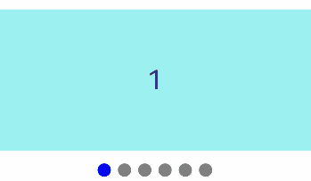

# Indicator
<!--Kit: ArkUI-->
<!--Subsystem: ArkUI-->
<!--Owner: @Hu_ZeQi-->
<!--Designer: @Hu_ZeQi-->
<!--Tester: @gouyuanyuan-->
<!--Adviser: @Brilliantry_Rui-->
<!-- md-trans-meta sourceCommit=0db97a5b7fb8643c5f5eff515ac260c481581357 translatedAt=2026-09-01T11:47:28.347Z -->

The **Indicator** component provides two types of navigation indicators: dot indicators and digit indicators.

It encapsulates the existing [indicator](ts-container-swiper.md#indicator) capabilities—previously part of the [Swiper](ts-container-swiper.md) component—and delivers them as a standalone component.

Developers can display navigation indicators independently without relying on the **Swiper** component, or bind them to the **Swiper** component through [IndicatorComponentController](#indicatorcomponentcontroller) for use in scenarios such as carousels, guide pages, and image browsing that require displaying the current position.

When multiple **Indicator** components are bound to a single **Swiper**, only the last bound **Indicator** is active.

Conversely, if an **Indicator** is bound to multiple **Swiper** components, only the last bound **Swiper** works with the **Indicator**.

> **NOTE**
>
> This component is supported since API version 15. Updates will be marked with a superscript to indicate their earliest API version.
>
> The APIs of this module can be used only in the stage model.


## Child Components

Not supported

## APIs

### IndicatorComponent

IndicatorComponent(controller?: IndicatorComponentController)

A constructor used to create an **Indicator** component. You can optionally pass a controller to manage the **Indicator** component.

**Widget capability**: This API can be used in ArkTS widgets since API version 15.

**Atomic service API**: This API can be used in atomic services since API version 15.

**System capability**: SystemCapability.ArkUI.ArkUI.Full

**Parameters**

|Name|Type|Mandatory|Description|
| ----- | ----- | -- |  --- |
| controller | [IndicatorComponentController](#indicatorcomponentcontroller) | No | Controller, through which the **Indicator** component can be controlled to jump between indicators. If this parameter is not passed, the **Indicator** component cannot be controlled externally. |

## Attributes

In addition to the [universal attributes](ts-component-general-attributes.md), the following attributes are supported.

### style

style(indicatorStyle: DotIndicator | DigitIndicator)

Sets the style of the navigation indicator.

**Widget capability**: This API can be used in ArkTS widgets since API version 15.

**Atomic service API**: This API can be used in atomic services since API version 15.

**System capability**: SystemCapability.ArkUI.ArkUI.Full

**Parameters**

| Name| Type                                                        | Mandatory| Description                                                        |
| ------ | ------------------------------------------------------------ | ---- | ------------------------------------------------------------ |
| indicatorStyle  | [DotIndicator](ts-container-swiper.md#dotindicator10)&nbsp;\|&nbsp;[DigitIndicator](ts-container-swiper.md#digitindicator10)&nbsp;| Yes   | Style of the indicator.<br/> \- **DotIndicator**: dot indicator style, suitable for displaying concise position hints.<br/> \- **DigitIndicator**: digit indicator style, suitable for scenarios where the current position needs to be explicitly displayed.<br/>&nbsp;&nbsp;Default type: **DotIndicator**. |

> **NOTE**
>
> When the **indicatorStyle** type is **DotIndicator** and the component is not bound to a **Swiper** component, [maxDisplayCount](ts-container-swiper.md#maxdisplaycount12) does not take effect before API version 26.1.0, and takes effect from API version 26.1.0.

### count

count(totalCount: number)

Sets the total number of indicators. When not bound to a **Swiper** component, you can use this API to customize the number of indicators.

When the **Indicator** component is bound to a **Swiper** component, the count is subject to the number of pages in the **Swiper** component.

**Widget capability**: This API can be used in ArkTS widgets since API version 15.

**Atomic service API**: This API can be used in atomic services since API version 15.

**System capability**: SystemCapability.ArkUI.ArkUI.Full

**Parameters**

| Name| Type  | Mandatory| Description                                            |
| ------ | ------ | ---- | ------------------------------------------------ |
| totalCount  | number | Yes   |  Total number of navigation dots. The value range is [2, +∞).<br/>Default value: 2.<br/>If 0, 1, or a negative number is passed in, the default value 2 is used. |

### initialIndex

initialIndex(index: number)

Sets the index value of the current indicator when it first appears. If the value is less than 0 or greater than or equal to the total number of indicators, the default value **0** is used.

This attribute does not take effect when the **Indicator** component is bound to a **Swiper** component.

**Widget capability**: This API can be used in ArkTS widgets since API version 15.

**Atomic service API**: This API can be used in atomic services since API version 15.

**System capability**: SystemCapability.ArkUI.ArkUI.Full

**Parameters**

| Name| Type  | Mandatory| Description                                            |
| ------ | ------ | ---- | ------------------------------------------------ |
| index  | number | Yes  | Initial index of the navigation indicator when it first appears.<br>Default value: **0**|

### loop

loop(isLoop: boolean)

Sets whether to enable looping for the indicators.

This attribute does not take effect when the **Indicator** component is bound to a **Swiper** component.

**Widget capability**: This API can be used in ArkTS widgets since API version 15.

**Atomic service API**: This API can be used in atomic services since API version 15.

**System capability**: SystemCapability.ArkUI.ArkUI.Full

**Parameters**

| Name| Type   | Mandatory| Description                           |
| ------ | ------- | ---- | ------------------------------- |
| isLoop  | boolean | Yes  | Whether to enable looping. The value **true** means to enable looping, and **false** means the opposite.<br>Default value: **true**|

### vertical

vertical(isVertical: boolean)

Sets whether the indicators are arranged vertically.

This attribute does not take effect when the **Indicator** component is bound to a **Swiper** component.

**Widget capability**: This API can be used in ArkTS widgets since API version 15.

**Atomic service API**: This API can be used in atomic services since API version 15.

**System capability**: SystemCapability.ArkUI.ArkUI.Full

**Parameters**

| Name| Type   | Mandatory| Description                              |
| ------ | ------- | ---- | ---------------------------------- |
| isVertical  | boolean | Yes   | Whether the indicator is arranged vertically. The value true means vertical arrangement, and false means horizontal arrangement.<br/>Default value: false. |

## Events

In addition to the [universal events](ts-component-general-events.md), the following events are supported.

### onChange

onChange(event: Callback\<number>)

Triggered when the currently selected navigation index changes. The callback provides the new index.

**Widget capability**: This API can be used in ArkTS widgets since API version 15.

**Atomic service API**: This API can be used in atomic services since API version 15.

**System capability**: SystemCapability.ArkUI.ArkUI.Full

**Parameters**

| Name| Type  | Mandatory| Description                |
| ------ | ------ | ---- | -------------------- |
| event  | [Callback](./ts-types.md#callback12)\<number> | Yes   | Callback invoked when the index of the currently displayed selected indicator changes. The callback parameter is the index value of the currently selected indicator.|

## IndicatorComponentController

Controller of the **Indicator** component. You can bind this object to the **Indicator** component to control page turning. By passing the same **IndicatorComponentController** instance to the constructor of the **IndicatorComponent** and the **indicator** attribute of the **Swiper** component, you can bind the **Indicator** and **Swiper** components for linkage.

### constructor

constructor()

A constructor used to create an **IndicatorComponentController** object.

**Widget capability**: This API can be used in ArkTS widgets since API version 15.

**Atomic service API**: This API can be used in atomic services since API version 15.

**System capability**: SystemCapability.ArkUI.ArkUI.Full

### showNext

showNext(): void

Moves to the next indicator. When bound to a **Swiper** component, it also controls the **Swiper** to switch to the next page. This is applicable to scenarios where the indicator switching is controlled through buttons or other interaction methods.

**Widget capability**: This API can be used in ArkTS widgets since API version 15.

**Atomic service API**: This API can be used in atomic services since API version 15.

**System capability**: SystemCapability.ArkUI.ArkUI.Full

### showPrevious

showPrevious(): void

Moves to the previous indicator. When bound to a **Swiper** component, it also controls the **Swiper** to switch to the previous page. This is applicable to scenarios where the indicator switching is controlled through buttons or other interaction methods.

**Widget capability**: This API can be used in ArkTS widgets since API version 15.

**Atomic service API**: This API can be used in atomic services since API version 15.

**System capability**: SystemCapability.ArkUI.ArkUI.Full

### changeIndex

changeIndex(index: number, useAnimation?: boolean): void

Navigates to the specified indicator. Before using this method, ensure that the controller has been bound to the **Indicator** component. This is applicable to scenarios where you need to jump to a specified indicator.

**Widget capability**: This API can be used in ArkTS widgets since API version 15.

**Atomic service API**: This API can be used in atomic services since API version 15.

**System capability**: SystemCapability.ArkUI.ArkUI.Full

**Parameters**

| Name     | Type      | Mandatory | Description    |
| -------- | ---------- | ---- | -------- |
| index| number | Yes    | Index value of the specified indicator.<br/>**Note:** <br/>If the set value is less than 0 or greater than the maximum indicator index, 0 is used. |
| useAnimation| boolean | No   | Whether to use an animation for when the target index is reached. The value **true** means to use an animation, and **false** means the opposite.<br>Default value: **false**.|

## Example

### Example 1: Using a Dot Indicator with a Swiper Component
This example binds the same [IndicatorComponentController](#indicatorcomponentcontroller) object to both the [indicator](ts-container-swiper.md#indicator) API of the [Swiper](ts-container-swiper.md) component and the [IndicatorComponent](#indicatorcomponent) constructor, enabling interaction between the dot indicator and the **Swiper** component.
```ts
@Entry
@Component
struct DotIndicatorDemo {
  private indicatorController: IndicatorComponentController = new IndicatorComponentController();
  private swiperController: SwiperController = new SwiperController();
  @State list: number[] = [];
  aboutToAppear(): void {
    for (let i = 1; i <= 6; i++) {
      this.list.push(i);
    }
  }

  build() {
    Column() {
      Swiper(this.swiperController) {
        ForEach(this.list, (item: number) => {
          Text(item.toString())
            .width('100%')
            .height(160)
            .backgroundColor(0xAFEEEE)
            .textAlign(TextAlign.Center)
            .fontSize(30)
        }, (item: number) => item.toString())
      }
      .cachedCount(2)
      .index(0)
      .autoPlay(true)
      .interval(2000)
      .indicator(this.indicatorController)
      .loop(true)
      .duration(1000)
      .itemSpace(0)
      .curve(Curve.Linear)
      .onChange((index: number) => {
        console.info(index.toString());
      })

      IndicatorComponent(this.indicatorController)
        .initialIndex(0)
        .style(
          new DotIndicator()
            .itemWidth(15)
            .itemHeight(15)
            .selectedItemWidth(15)
            .selectedItemHeight(15)
            .color(Color.Gray)
            .selectedColor(Color.Blue))
        .loop(true)
        .count(6)
        .vertical(true)
        .onChange((index: number) => {
          console.info('current index: ' + index);
        })
    }
  }
}
```


### Example 2: Using a Digit Indicator with a Swiper Component

This example binds the same [IndicatorComponentController](#indicatorcomponentcontroller) object to both the [indicator](ts-container-swiper.md#indicator) API of the [Swiper](ts-container-swiper.md) component and the [IndicatorComponent](#indicatorcomponent) constructor, enabling interaction between the digit indicator and the **Swiper** component.

```ts
@Entry
@Component
struct DigitIndicatorDemo {
  private indicatorController: IndicatorComponentController = new IndicatorComponentController();
  private swiperController: SwiperController = new SwiperController();
  @State list: number[] = [];
  aboutToAppear(): void {
    for (let i = 1; i <= 6; i++) {
      this.list.push(i);
    }
  }

  build() {
    Column() {
      Swiper(this.swiperController) {
        ForEach(this.list, (item: number) => {
          Text(item.toString())
            .width('100%')
            .height(160)
            .backgroundColor(0xAFEEEE)
            .textAlign(TextAlign.Center)
            .fontSize(30)
        }, (item: number) => item.toString())
      }
      .cachedCount(2)
      .index(0)
      .autoPlay(true)
      .interval(2000)
      .indicator(this.indicatorController)
      .loop(true)
      .duration(1000)
      .itemSpace(0)
      .curve(Curve.Linear)
      .onChange((index: number) => {
        console.info(index.toString());
      })

      IndicatorComponent(this.indicatorController)
        .initialIndex(0)
        .style(Indicator.digit()
          .fontColor(Color.Gray)
          .selectedFontColor(Color.Gray)
          .digitFont({ size: 20, weight: FontWeight.Bold })
          .selectedDigitFont({ size: 20, weight: FontWeight.Normal }))
        .loop(true)
        .count(6)
        .vertical(true)
        .onChange((index: number) => {
          console.info('current index: ' + index);
        })
    }
  }
}
```


