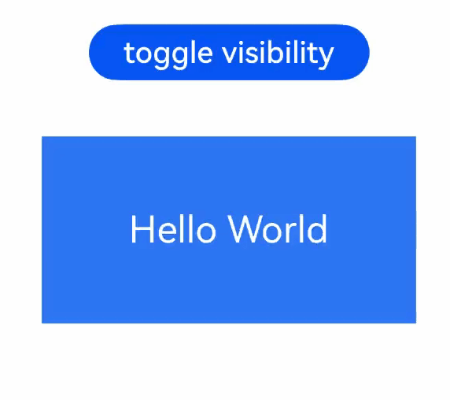

# Component Transition (transition)
<!--Kit: ArkUI-->
<!--Subsystem: ArkUI-->
<!--Owner: @hehongyang3-->
<!--Designer: @hehongyang3-->
<!--Tester: @lxl007-->
<!--Adviser: @Brilliantry_Rui-->
<!-- md-trans-meta sourceCommit=39ca26def5c22dc659f3dc0b76ef62a29421e77a translatedAt=2026-09-01T11:56:21.865Z -->

In-component transition mainly configures transition parameters through the **transition** attribute to display transition animations when child components of a container component are inserted or deleted, thereby improving user experience. For details about how to use in-component transition, see [Enter/Exit Transition](../../../ui/arkts-enter-exit-transition.md).

>  **NOTE**
>
>  This feature is supported since API version 7. Updates will be marked with a superscript to indicate their earliest API version.
>
>  There are two ways to trigger a component's transition:
>  1. When a component is inserted or deleted (for example, when the if condition changes or ForEach adds or deletes components), the transition effects of all newly inserted/deleted components are triggered recursively.
>  2. When the [visibility](ts-universal-attributes-visibility.md#visibility) attribute of a component changes between visible and invisible (Visibility.Hidden or Visibility.None), only the transition effect of that component is triggered. When switching between Visibility.Visible and Visibility.None, if the component is directly set to Visibility.None, the component layout size becomes 0, in which case the transition effect cannot be observed. When the visibility attribute is changed to Visibility.None within an animation, the change of the component layout to 0 carries the animation effect. In this case, the transition and layout animations are superimposed, producing a composite dual-animation effect. For details about the specific effect, see [Example 4](#example-4-dual-animation-composite-effect-during-visibility-switching).

## transition

transition(value: TransitionOptions | TransitionEffect): T

Transition effect for the insertion, display, deletion, and hiding of a component. It can be triggered by component insertion/deletion (for example, when the if condition changes or ForEach adds or deletes components) or by switching the visibility attribute between visible and invisible.

**System capability**: SystemCapability.ArkUI.ArkUI.Full

**Atomic service API**: This API can be used in atomic services since API version 11.

**Widget capability**: This API can be used in ArkTS widgets since API version 9.

**Parameters**

| Name| Type| Mandatory| Description|
| -------- | -------- |  ---- | -------- |
| value | [TransitionOptions](#transitionoptionsdeprecated)<sup>(deprecated)</sup> \| [TransitionEffect](#transitioneffect10)  | Yes | Sets the transition effect for component insertion, display, and deletion hiding.<br>**NOTE**<br>For details, see the object descriptions of [TransitionOptions](#transitionoptionsdeprecated) and [TransitionEffect](#transitioneffect10). |

**Return value**

| Type| Description|
| -------- | -------- |
| T | Current component, used for chained calls. |

## transition<sup>12+</sup>

transition(effect: TransitionEffect, onFinish: Optional&lt;TransitionFinishCallback&gt;): T

Sets the transition effects used when a component is inserted or removed. Compared with [transition](#transition), this API provides the callback when the transition animation ends.

>**NOTE**
>
> This API can be called within [attributeModifier](ts-universal-attributes-attribute-modifier.md#attributemodifier) since API version 20.

**Model restriction**: This API can be used only in the stage model.

**System capability**: SystemCapability.ArkUI.ArkUI.Full

**Atomic service API**: This API can be used in atomic services since API version 12.

**Widget capability**: This API can be used in ArkTS widgets since API version 12.

**Parameters**

| Name| Type| Mandatory| Description|
| -------- | -------- |  ---- | -------- |
| effect | [TransitionEffect](#transitioneffect10)  | Yes| Transition effects used when a component is inserted or removed.|
| onFinish | Optional&lt;[TransitionFinishCallback](#transitionfinishcallback12)&gt; | Yes | Transition animation end callback. For the specific conditions under which it takes effect, see [TransitionFinishCallback](#transitionfinishcallback12). If undefined is passed in, the transition animation end callback is not registered, and no callback notification is received after the transition animation ends. |

**Return value**

| Type| Description|
| -------- | -------- |
| T | Current component, used for chained calls. |

## TransitionEdge<sup>10+</sup>

Enumerates the transition edge types.

**Widget capability**: This API can be used in ArkTS widgets since API version 10.

**Atomic service API**: This API can be used in atomic services since API version 11.

**Model restriction**: This API can be used only in the stage model.

**System capability**: SystemCapability.ArkUI.ArkUI.Full

| Name    | Value| Description    |
| ------ | ------ | ------ |
| TOP    | 0 | Top edge of the window.|
| BOTTOM | 1 | Bottom edge of the window.|
| START  | 2 | Start edge of the window, which is the left edge for left-to-right scripts and the right edge for right-to-left scripts.|
| END    | 3 | End edge of the window, which is the right edge for left-to-right scripts and the left edge for right-to-left scripts.|

## TransitionEffect<sup>10+</sup>

Defines the transition effect by using the provided APIs, as listed below.

**Model restriction**: This API can be used only in the stage model.

**System capability**: SystemCapability.ArkUI.ArkUI.Full

**Atomic service API**: This API can be used in atomic services since API version 11.

**Widget capability**: This API can be used in ArkTS widgets since API version 10.

### Properties

| Name| Type| Read-Only| Optional| Description|
| -------- | ---------- | -------- | -------- | -------- |
| IDENTITY | [TransitionEffect](#transitioneffect10)\<"identity"> | Yes | No | Disables the transition effect. If a component is attached to or detached from the component tree or its visibility changes within the animation range, and the component is not configured with transition, a default opacity transition effect (TransitionEffect.OPACITY) is applied to the component. If this default effect is not needed, configure IDENTITY to disable it so that the component appears or disappears directly. |
| OPACITY | [TransitionEffect](#transitioneffect10)\<"opacity"> | Yes| No| Applies a transition effect with the opacity changing from 0 to 1 when the component appears and from 1 to 0 when the component disappears. This is equivalent to **TransitionEffect.opacity(0)**.|
| SLIDE | [TransitionEffect](#transitioneffect10)\<"asymmetric", { appear: [TransitionEffect](#transitioneffect10)\<"move", [TransitionEdge](#transitionedge10)>; disappear: [TransitionEffect](#transitioneffect10)\<"move", [TransitionEdge](#transitionedge10)>; }> | Yes| No| Applies a transition effect of sliding in from the start edge when the component appears and sliding out from the end edge when the component disappears. This means sliding in from the left edge and sliding out from the right edge for left-to-right scripts, and sliding in from the right edge and sliding out from the left edge for right-to-left scripts. This is equivalent to **TransitionEffect.asymmetric(TransitionEffect.move(TransitionEdge.START), TransitionEffect.move(TransitionEdge.END))**. |
| SLIDE_SWITCH | [TransitionEffect](#transitioneffect10)\<"slideSwitch"> | Yes | No | Specifies the transition effect in which the component shrinks and then enlarges while sliding in from the right when appearing, and shrinks and then enlarges while sliding out to the left when disappearing. This effect comes with built-in animation parameters, which can be overridden by custom animation parameters specified through the .animation() method. The built-in animation parameters have a duration of 600 ms, use the animation curve cubicBezierCurve(0.24, 0.0, 0.50, 1.0), and have a minimum scale ratio of 0.85. |

>  **NOTE**
>
>  1. TransitionEffect can combine multiple transition effects through the combine function. You can specify the animation parameter for each effect separately, and the animation parameter of the preceding effect can also apply to the following effect. For example, in TransitionEffect.OPACITY.animation({duration: 1000}).combine(TransitionEffect.translate({x: 100})), the animation parameter with a duration of 1000 ms applies to both OPACITY and translate.
>  2. The precedence of animation parameters is as follows: the animation parameter specified by this TransitionEffect > the animation parameter specified by the preceding TransitionEffect > the animation parameter in animateTo that triggers the appearance and disappearance of the component.
>  3. If animateTo is not used to trigger the transition animation and no animation parameter is specified in TransitionEffect, the component appears or disappears directly.
>  4. If the attribute value specified in TransitionEffect is the same as the default value, no transition animation is generated for that attribute. For example, in TransitionEffect.opacity(1).animation({duration:1000}), since the default value of opacity is also 1, no opacity animation is generated, and the component appears or disappears directly.
>  5. For more details about the scale and rotate effects, see [Transformation](ts-universal-attributes-transformation.md).
>  6. If the insertion/removal or visibility ([visibility](ts-universal-attributes-visibility.md#visibility)) change of a component is triggered within an animation scope ([animateTo](../arkts-apis-uicontext-uicontext.md#animateto), [animation](ts-animatorproperty.md)), and the root component of the subtree has no transition configured, a default opacity transition, that is, TransitionEffect.OPACITY, is added to the component, with the animation parameter following that of the current animation environment. If this is not needed, you can disable it by explicitly configuring TransitionEffect.IDENTITY so that the component appears or disappears directly.
>  7. When the disappearance transition is triggered by deleting an entire subtree, to observe the complete disappearance transition process, ensure that the root component of the deleted subtree has sufficient disappearance transition time. See Example 3.

### translate<sup>10+</sup>

translate(options: TranslateOptions): TransitionEffect\<"translate">

Sets the translation effect for component transitions.

**Atomic service API**: This API can be used in atomic services since API version 11.

**Widget capability**: This API can be used in ArkTS widgets since API version 10.

**Model restriction**: This API can be used only in the stage model.

**System capability**: SystemCapability.ArkUI.ArkUI.Full

**Parameters**

| Name| Type                                  | Mandatory| Description          |
| ------ | ------------------------------------------ | ---- | ------------------ |
| options  | [TranslateOptions](ts-universal-attributes-transformation.md#translateoptions)      | Yes   | Translation effect during component transition, which is the value at the start point upon insertion and at the end point upon deletion.<br>-x: horizontal translation distance.<br>-y: vertical translation distance.<br>-z: translation distance along the z-axis. |

**Return value**

| Type  | Description                    |
| ------ | ------------------------ |
| [TransitionEffect](#transitioneffect10)\<"translate"> | Translation effect for the current animation.|

### rotate<sup>10+</sup>

rotate(options: RotateOptions): TransitionEffect\<"rotate">

Sets the rotation effect for component transitions.

**Atomic service API**: This API can be used in atomic services since API version 11.

**Widget capability**: This API can be used in ArkTS widgets since API version 10.

**Model restriction**: This API can be used only in the stage model.

**System capability**: SystemCapability.ArkUI.ArkUI.Full

**Parameters**

| Name| Type                                  | Mandatory| Description          |
| ------ | ------------------------------------------ | ---- | ------------------ |
| options  | [RotateOptions](ts-universal-attributes-transformation.md#rotateoptions)      | Yes   | Rotation effect during component transition, which is the value at the start point on insertion and at the end point on deletion.<br>-angle: rotation angle in degrees (°), which determines the rotation amplitude around the rotation axis.<br>-x: horizontal rotation vector component.<br>-y: vertical‑longitudinal rotation vector component.<br>-z: vertical‑elevational rotation vector component.<br>-&nbsp;centerX and centerY specify the rotation center point. The default values of centerX and centerY are "50%", and the numeric type is in vp, meaning that the component center point is used as the rotation center point by default. The string format supports percentages (for example, "50%").<br>-&nbsp;A center point of (0, 0) represents the top-left corner of the component.<br>-&nbsp;When centerX and centerY are set to invalid strings (for example, "illegalString"), the default value is "0".<br>-centerZ specifies the z-axis anchor point, that is, the z-axis component of the 3D rotation center point. The default value of centerZ is 0.<br>-perspective specifies the viewing distance. The perspective attribute is not supported for transition animation. |

**Return value**

| Type  | Description                    |
| ------ | ------------------------ |
| [TransitionEffect](#transitioneffect10)\<"rotate"> | Rotation effect for the current animation.|

### scale<sup>10+</sup>

scale(options: ScaleOptions): TransitionEffect\<"scale">

Sets the scaling effect for component transitions.

**Atomic service API**: This API can be used in atomic services since API version 11.

**Widget capability**: This API can be used in ArkTS widgets since API version 10.

**Model restriction**: This API can be used only in the stage model.

**System capability**: SystemCapability.ArkUI.ArkUI.Full

**Parameters**

| Name| Type                                  | Mandatory| Description          |
| ------ | ------------------------------------------ | ---- | ------------------ |
| options  | [ScaleOptions](ts-universal-attributes-transformation.md#scaleoptions)      | Yes   | Scale effect during component transition, which is the value at the start point during insertion and at the end point during deletion. The set scale value is multiplicatively superimposed on the current scale attribute of the component. For example, if the current scale value of the component is 0.8 and the transition scale value is set to 0.5, the scale value of the component entry animation starts from 0.8×0.5=0.4.<br>-&nbsp;x: horizontal magnification (or reduction ratio).<br>-&nbsp;y: vertical magnification (or reduction ratio).<br>-&nbsp;z: This parameter is invalid because the current display is two-dimensional.<br>-&nbsp;centerX and centerY indicate the center point of scaling. The default values of centerX and centerY are "50%", that is, the center point of the component is used as the scaling center point by default.<br>-&nbsp;A center point of (0, 0) represents the top-left corner of the component.<br>**NOTE**<br>When centerX and centerY are set to invalid strings (for example, "illegalString"), the default value is "0". |

**Return value**

| Type  | Description                    |
| ------ | ------------------------ |
| [TransitionEffect](#transitioneffect10)\<"scale"> | Scaling effect for component transitions.|

### opacity<sup>10+</sup>

opacity(alpha: number): TransitionEffect\<"opacity">

Sets the opacity for component transition.

**Atomic service API**: This API can be used in atomic services since API version 11.

**Widget capability**: This API can be used in ArkTS widgets since API version 10.

**Model restriction**: This API can be used only in the stage model.

**System capability**: SystemCapability.ArkUI.ArkUI.Full

**Parameters**

| Name| Type                                  | Mandatory| Description          |
| ------ | ------------------------------------------ | ---- | ------------------ |
| alpha  | number      | Yes   | Opacity effect during component transition, which is the value at the start point of insertion and the end point of deletion.<br>Value range: [0, 1]<br>**Note:** <br>An invalid value less than 0 is processed as 0, and an invalid value greater than 1 is processed as 1. When alpha is 1 (the same as the default value), no opacity transition effect is generated, and the component appears or disappears directly. |

**Return value**

| Type  | Description                    |
| ------ | ------------------------ |
| [TransitionEffect](#transitioneffect10)\<"opacity"> | Returns a TransitionEffect object that represents the opacity transition effect, used to configure the opacity transition animation when a component appears and disappears. |

### move<sup>10+</sup>

move(edge: TransitionEdge): TransitionEffect\<"move">

Sets the effect of sliding in from and out to the window edge during component transition.

**Atomic service API**: This API can be used in atomic services since API version 11.

**Widget capability**: This API can be used in ArkTS widgets since API version 10.

**Model restriction**: This API can be used only in the stage model.

**System capability**: SystemCapability.ArkUI.ArkUI.Full

**Parameters**

| Name| Type                                  | Mandatory| Description          |
| ------ | ------------------------------------------ | ---- | ------------------ |
| edge  | [TransitionEdge](#transitionedge10)     | Yes   | Effect of sliding in and out from the window edge during component transition. It is essentially a translation effect, serving as the start point on insertion and the end point on deletion. Unlike translate, move automatically calculates the offset based on the window edge position through TransitionEdge (including RTL/LTR direction adaptation), without the need to manually specify a specific offset value. It is suitable for scenarios where the component slides in and out from the window edge. translate requires manually specifying the offset value and is suitable for scenarios where the offset direction and distance need to be customized. |

**Return value**

| Type  | Description                    |
| ------ | ------------------------ |
| [TransitionEffect](#transitioneffect10)\<"move"> | Effect of the current animation sliding in and out from the window edge. |

### asymmetric<sup>10+</sup>

asymmetric(appear: TransitionEffect, disappear: TransitionEffect): TransitionEffect\<"asymmetric">

Sets an asymmetric transition effect, that is, appearance and disappearance use two independent and different animations, and the effects are not inverse processes of each other. It applies to scenarios where different animation strategies are required for appearance and disappearance. For details about the specific effect, see [Example 2](#example-2-using-different-transitioneffect-configurations-for-image-appearance-and-disappearance).

**Atomic service API**: This API can be used in atomic services since API version 11.

**Widget capability**: This API can be used in ArkTS widgets since API version 10.

**Model restriction**: This API can be used only in the stage model.

**System capability**: SystemCapability.ArkUI.ArkUI.Full

**Parameters**

| Name| Type                                  | Mandatory| Description          |
| ------ | ------------------------------------------ | ---- | ------------------ |
| appear  | [TransitionEffect](#transitioneffect10)      | Yes   | Transition effect for appearance.<br>If the TransitionEffect is not constructed through the asymmetric function, this effect takes effect both when the component appears and when it disappears. |
| disappear  | [TransitionEffect](#transitioneffect10)      | Yes   | Transition effect for disappearance.<br>If the TransitionEffect is not constructed through the asymmetric function, this effect takes effect both when the component appears and when it disappears. |

**Return value**

| Type  | Description                    |
| ------ | ------------------------ |
| [TransitionEffect](#transitioneffect10)\<"asymmetric"> | Returns a TransitionEffect object that represents an asymmetric transition effect, where appearance and disappearance use different transition animations. |

### constructor<sup>10+</sup>

constructor(type: Type, effect: Effect)

Constructs a **TransitionEffect** object.

**Atomic service API**: This API can be used in atomic services since API version 11.

**Widget capability**: This API can be used in ArkTS widgets since API version 10.

**Model restriction**: This API can be used only in the stage model.

**System capability**: SystemCapability.ArkUI.ArkUI.Full

**Parameters**

| Name| Type                                  | Mandatory| Description          |
| ------ | ------------------------------------------ | ---- | ------------------ |
| type  | [Type](ts-appendix-enums.md#transitiontype)                                    | Yes   | Transition type, which specifies the scenario where this transition effect takes effect. Default value: **TransitionType.All**, which means the transition effect takes effect for both insertion and deletion. If **type** is not specified, the default value **TransitionType.All** is used. |
| effect  | [Effect](#transitioneffect10)                                     | Yes   | Transition effect configuration, which specifies the specific transition animation effect, including the parameter settings of transition effects such as opacity, translation, rotation, and scale. |

### combine<sup>10+</sup>

combine(transitionEffect: TransitionEffect): TransitionEffect

Combination of transition effects.

**Atomic service API**: This API can be used in atomic services since API version 11.

**Widget capability**: This API can be used in ArkTS widgets since API version 10.

**Model restriction**: This API can be used only in the stage model.

**System capability**: SystemCapability.ArkUI.ArkUI.Full

**Parameters**

| Name| Type| Mandatory| Description          |
| ------ | -------- | ---- | ------------------ |
| transitionEffect  | [TransitionEffect](#transitioneffect10)   | Yes  | Combined transition effect.|

**Return value**

| Type  | Description                    |
| ------ | ------------------------ |
| [TransitionEffect](#transitioneffect10) | Combined transition effect. |

### animation<sup>10+</sup>

animation(value: AnimateParam): TransitionEffect

Animation settings.

**Atomic service API**: This API can be used in atomic services since API version 11.

**Widget capability**: This API can be used in ArkTS widgets since API version 10.

**Model restriction**: This API can be used only in the stage model.

**System capability**: SystemCapability.ArkUI.ArkUI.Full

**Parameters**

| Name| Type| Mandatory| Description          |
| ------ | -------- | ---- | ------------------ |
| value  | [AnimateParam](ts-explicit-animation.md#animateparam)   | Yes   | Animation parameter.<br>This parameter is used only to specify the animation parameter. The onFinish callback of the input parameter AnimateParam does not take effect.<br>If TransitionEffect objects are combined through combine, the animation parameter of the preceding TransitionEffect can also be used for the following TransitionEffect. |

**Return value**

| Type  | Description                    |
| ------ | ------------------------ |
| [TransitionEffect](#transitioneffect10) | Returns a TransitionEffect object configured with the specified animation parameters, which take effect in the transition effect. |


## TransitionFinishCallback<sup>12+</sup>

type TransitionFinishCallback = (transitionIn: boolean) => void

Defines the type of the callback invoked when the component transition animation ends.

**Widget capability**: This API can be used in ArkTS widgets since API version 12.

**Atomic service API**: This API can be used in atomic services since API version 12.

**Model restriction**: This API can be used only in the stage model.

**System capability**: SystemCapability.ArkUI.ArkUI.Full

**Parameters**

| Name  | Type                     | Mandatory| Description                                                        |
| -------- | ------------------------- | ---- | ------------------------------------------------------------ |
| transitionIn | boolean | Yes   | End callback type of the transition animation.<br>true indicates the appearance animation end callback, false indicates the disappearance animation end callback. |

>  **NOTE**
>  1. When the appearance and disappearance transitions are triggered recursively by inserting or removing a subtree, only the disappearance animation end callback of the root component is guaranteed to be invoked. If the disappearance animation end callback of a child component occurs later than that of the root component, the child component's end callback will not be invoked because the entire subtree has been destroyed.
>  2. The end callback is invoked only after the last animation of the same type (appearance or disappearance) of the same component ends. That is, if the appearance and disappearance animations are triggered repeatedly (for example, through Visibility), only the end callback of the last appearance or disappearance is invoked.

## TransitionOptions<sup>(deprecated)</sup>

Defines the transition effect by setting parameters in the struct.

> **NOTE**
>
> This API is supported since API version 7 and deprecated since API version 10. You are advised to use [TransitionEffect](#transitioneffect10) instead.

**System capability**: SystemCapability.ArkUI.ArkUI.Full

| Name| Type| Read-Only| Optional| Description|
| -------- | -------- | -------- | -------- | -------- |
| type | [TransitionType](ts-appendix-enums.md#transitiontype) | No | Yes | Specifies the scenario in which the transition effect takes effect.<br>Default value: TransitionType.All<br>**Note:**<br>If type is not specified, the default value TransitionType.All is used, which means the transition effect takes effect for both insertion and deletion. |
| opacity | number | No | Yes | Sets the opacity effect during component transition, which is the value at the start point of insertion and the end point of deletion. Set this attribute when a fade-in/fade-out transition effect is required. If this attribute is not set and no other transition effect is set, an opacity transition effect is generated by default (equivalent to opacity being 0). If other transition effects are set, no opacity transition effect is generated.<br>Value range: [0, 1]<br>**Note:** <br>If an invalid value less than 0 is set, it is processed as 0. If an invalid value greater than 1 is set, it is processed as 1. |
| translate | [TranslateOptions](ts-universal-attributes-transformation.md#translateoptions) | No | Yes | Sets the translation effect during component transition, which is the value at the start point of insertion and the end point of deletion.<br>-x: translation distance along the horizontal axis.<br>-y: translation distance along the vertical axis.<br>-z: translation distance along the depth axis. |
| scale | [ScaleOptions](ts-universal-attributes-transformation.md#scaleoptions) | No | Yes | Sets the scale effect during component transition, which is the value at the start point of insertion and the end point of deletion. The set scale value is multiplied by the component's current scale attribute. For example, if the component's current scale value is 0.8 and the transition scale value is set to 0.5, the scale value of the component's entry animation starts from 0.8×0.5=0.4.<br>-x: horizontal scale factor (or reduction ratio).<br>-y: vertical scale factor (or reduction ratio).<br>-z: currently the display is two-dimensional, so this parameter is invalid.<br>-&nbsp;centerX and centerY specify the scale center point. The default values of centerX and centerY are "50%", which means the component's center point is used as the scale center point by default.<br>-&nbsp;A center point of (0, 0) represents the top-left corner of the component.<br>**Note:** <br>If centerX or centerY is set to an invalid string (for example, "illegalString"), the default value "0" is used. |
| rotate | [RotateOptions](ts-universal-attributes-transformation.md#rotateoptions) | No | Yes | Sets the rotation effect during component transition, which is the value at the start point of insertion and the end point of deletion.<br>-x: rotation vector component along the horizontal axis.<br>-y: rotation vector component along the vertical axis.<br>-z: rotation vector component along the depth axis.<br>-&nbsp;centerX and centerY specify the rotation center point. The default values of centerX and centerY are "50%", which means the component's center point is used as the rotation center point by default. The string format supports percentages (for example, "50%").<br>-&nbsp;A center point of (0, 0) represents the top-left corner of the component.<br>-&nbsp;If centerX or centerY is set to an invalid string (for example, "illegalString"), the default value "0" is used. |

>  **NOTE**
>
>  1. When the transition effect is specified using an input parameter of the TransitionOptions type, it **must** be used together with [animateTo](../arkts-apis-uicontext-uicontext.md#animateto) to take effect. The animation duration, curve, and delay follow the configuration in animateTo.
>  2. When TransitionOptions is used as the input parameter and no parameter other than type is specified, it is equivalent to specifying an opacity transition effect. For example, specifying {type: TransitionType.Insert} is equivalent to specifying the transition effect {type: TransitionType.Insert, opacity: 0}. When a specific effect is specified, the default opacity transition effect is not added.

## Examples

### Example 1: Using the Same TransitionEffect Configuration for Image Appearance and Disappearance

This example primarily demonstrates how to use the same [TransitionEffect](#transitioneffect10) to achieve both the appearance and disappearance of an image, where the appearance and disappearance are inverse processes of each other.
```ts
// xxx.ets
@Entry
@Component
struct TransitionEffectExample1 {
  @State flag: boolean = true;
  @State show: string = 'show';

  build() {
    Column() {
      Button(this.show).width(80).height(30).margin(30)
        .onClick(() => {
          // Click the button to show or hide the image.
          if (this.flag) {
            this.show = 'hide';
          } else {
            this.show = 'show';
          }
          this.flag = !this.flag;
        })
      if (this.flag) {
        // Apply the same transition effect to the appearance and disappearance of the image.
        // When the image appears, it changes from the state where the opacity is 0 and the rotation angle is 180° around the z-axis to the state where the opacity is 1 and the rotation angle is 0°. The durations of the opacity and rotation animations are both 2000 ms.
        // When the image disappears, it changes from the state where the opacity is 1 and the rotation angle is 0° to the state where the opacity is 0 and the rotation angle is 180° around the z-axis. The durations of the opacity and rotation animations are both 2000 ms.
        // Replace $r('app.media.testImg') with the image resource file you use.
        Image($r('app.media.testImg')).width(200).height(200)
          .transition(TransitionEffect.OPACITY.animation({ duration: 2000, curve: Curve.Ease }).combine(
            TransitionEffect.rotate({ z: 1, angle: 180 })
          ))
      }
    }.width('100%')
  }
}
```
Schematic diagram:<br>


### Example 2: Using Different TransitionEffect Configurations for Image Appearance and Disappearance

This example demonstrates how to use different [TransitionEffect](#transitioneffect10) configurations to implement the appearance and disappearance of an image.
```ts
// xxx.ets
@Entry
@Component
struct TransitionEffectExample2 {
  @State flag: boolean = true;
  @State show: string = 'show';

  build() {
    Column() {
      Button(this.show).width(80).height(30).margin(30)
        .onClick(() => {
          // Click the button to show or hide the image.
          if (this.flag) {
            this.show = 'hide';
          } else {
            this.show = 'show';
          }
          this.getUIContext().animateTo({ duration: 2000 }, () => {
            // In the first image, **TransitionEffect** contains **animation**, and therefore the animation settings are those configured in **TransitionEffect**.
            // In the second image, **TransitionEffect** does not contain **animation**, and therefore the animation settings are those configured in **animateTo**.
            this.flag = !this.flag;
          });
        })
      if (this.flag) {
        // Apply different transition effects to the appearance and disappearance of the image.
        // When the image appears, its opacity changes from 0 to 1 (default value) over the duration of 1000 ms, and after 1000 ms has elapsed, its rotation angle changes from 180° around the z-axis to 0° (default value) over the duration of 1000 ms.
        // When the image disappears, after 1000 ms has elapsed, its opacity changes from 1 (default value) to 0 over the duration of 1000 ms, and its rotation angle changes from 0° (default value) to 180° around the z-axis over the duration of 1000 ms.
        // Replace $r('app.media.testImg') with the image resource file you use.
        Image($r('app.media.testImg')).width(200).height(200)
          .transition(
            TransitionEffect.asymmetric(
              TransitionEffect.OPACITY.animation({ duration: 1000 }).combine(
              TransitionEffect.rotate({ z: 1, angle: 180 }).animation({ delay: 1000, duration: 1000 }))
              ,
              TransitionEffect.OPACITY.animation({ delay: 1000, duration: 1000 }).combine(
              TransitionEffect.rotate({ z: 1, angle: 180 }).animation({ duration: 1000 }))
            )
          )
        // When the image appears, the scale along the x- and y- axes is changed from 0 to 1 (default value). The animation duration is 2000 ms specified in **animateTo**.
        // When the image disappears, no transition effect is applied.
        // Replace $r('app.media.testImg') with the image resource file you use.
        Image($r('app.media.testImg')).width(200).height(200).margin({ top: 100 })
          .transition(
            TransitionEffect.asymmetric(
              TransitionEffect.scale({ x: 0, y: 0 }),
              TransitionEffect.IDENTITY
            )
          )
      }
    }.width('100%')
  }
}
```
Schematic diagram:<br>


### Example 3: Setting transition on Parent and Child Components

This example demonstrates how to configure [transition](#transition) on both parent and child components to implement the appearance and disappearance of images.
```ts
// xxx.ets
@Entry
@Component
struct TransitionEffectExample3 {
  @State flag: boolean = true;
  @State show: string = 'show';

  build() {
    Column() {
      Button(this.show).width(80).height(30).margin(30)
        .onClick(() => {
          // Click the button to show or hide the image.
          if (this.flag) {
            this.show = 'hide';
          } else {
            this.show = 'show';
          }
          this.flag = !this.flag;
        })
      if (this.flag) {
        // When the flag condition is changed, it will trigger the transition animation for elements with the IDs column1, image1, and image2.
        // The component with the ID column1 is the root node of this newly appearing/disappearing subtree.
        Column() {
          Row() {
            // Replace $r('app.media.testImg') with the image resource file you use.
            Image($r('app.media.testImg')).width(150).height(150).id('image1')
              .transition(TransitionEffect.OPACITY.animation({ duration: 1000 }))
          }

          // Replace $r('app.media.testImg') with the image resource file you use.
          Image($r('app.media.testImg'))
            .width(150)
            .height(150)
            .margin({ top: 50 })
            .id('image2')
            .transition(TransitionEffect.scale({ x: 0, y: 0 }).animation({ duration: 1000 }))
          Text('view').margin({ top: 50 })
        }
        .id('column1')
        // Use opacity(0.99) instead of 1 for the root component to avoid the transition animation not being triggered when the property value equals the default value.
        .transition(TransitionEffect.opacity(0.99).animation({ duration: 1000 }),
          // The end callback is set on the first layer of disappearing nodes to ensure that there is a callback at the end of the disappearance.
          (transitionIn: boolean) => {
            console.info("transition finish, transitionIn:" + transitionIn);
          }
        )
      }
    }.width('100%')
  }
}
```
Schematic diagram:<br>


### Example 4: Dual-animation Composite Effect During Visibility Switching

This example demonstrates the dual-animation composite effect produced when [transition](#transition) animation is superimposed on layout animation as [visibility](ts-universal-attributes-visibility.md#visibility) switches between Visibility.Visible and Visibility.None.

```ts
// xxx.ets
@Entry
@Component
struct TransitionVisibilityExample {
  @State isVisible: boolean = true;

  build() {
    Column() {
      Button('toggle visibility').width(150).height(30).margin(30)
        .onClick(() => {
          this.getUIContext()?.animateTo({ duration: 1000 }, () => {
            this.isVisible = !this.isVisible;
          });
        })
      Column() {
        Text('Hello World')
          .fontSize(20)
          .fontColor(Color.White)
      }
      .width(200)
      .height(100)
      .backgroundColor('#317AF7')
      .justifyContent(FlexAlign.Center)
      .transition(TransitionEffect.OPACITY.animation({ duration: 1000 }))
      .visibility(this.isVisible ? Visibility.Visible : Visibility.None)
    }.width('100%').height('100%').justifyContent(FlexAlign.Center)
  }
}
```
Schematic diagram:<br>


