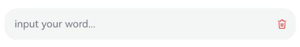

# Symbol Glyph Modifier

<!--Kit: ArkUI-->
<!--Subsystem: ArkUI-->
<!--Owner: @hddgzw-->
<!--Designer: @pssea-->
<!--Tester: @jiaoaozihao-->
<!--Adviser: @HelloCrease-->

You can use **SymbolGlyphModifier** to construct components and configure their attributes. Through **SymbolGlyphModifier**, you can access the attributes and style APIs of the encapsulated component.

>  **NOTE**
>
>  The initial APIs of this module are supported since API version 12. Updates will be marked with a superscript to indicate their earliest API version.

## SymbolGlyphModifier

Defines the **SymbolGlyphModifier**.

**Atomic service API**: This API can be used in atomic services since API version 12.

**System capability**: SystemCapability.ArkUI.ArkUI.Full

### constructor

constructor(src?: Resource)

Constructs a **SymbolGlyphModifier** object.

**Atomic service API**: This API can be used in atomic services since API version 12.

**System capability**: SystemCapability.ArkUI.ArkUI.Full

**Parameters**

| Name | Type                             | Mandatory| Description  |
| ------- | --------------------------------- | ---- | --------------------------------- |
| src | [Resource](ts-types.md#resource) | No  | Resource information.|

### applyNormalAttribute

applyNormalAttribute?(instance: SymbolGlyphAttribute): void

Applies the style of a component in the normal state.

**Atomic service API**: This API can be used in atomic services since API version 12.

**System capability**: SystemCapability.ArkUI.ArkUI.Full

**Parameters**

| Name | Type                             | Mandatory| Description  |
| ------- | --------------------------------- | ---- | --------------------------------- |
| instance | [SymbolGlyphAttribute](ts-basic-components-symbolGlyph.md) | Yes  | Dynamic attribute setting for the SymbolGlyph component.|

## Example

This example demonstrates how to use [SymbolGlyphModifier](#symbolglyphmodifier) and the [cancelButton](ts-basic-components-textinput.md#cancelbutton18) attribute of the **TextInput** component to customize the style of the symbol-type cancel button on the right side of the text box.

```ts
import { SymbolGlyphModifier } from '@kit.ArkUI';

// xxx.ets
@Entry
@Component
struct Index {
  @State text: string = '';
  symbolModifier: SymbolGlyphModifier =
    new SymbolGlyphModifier($r('sys.symbol.trash')).fontColor([Color.Red]).fontSize(16).fontWeight(FontWeight.Regular);

  build() {
    Column() {
      TextInput({ text: this.text, placeholder: 'input your word...' })
        .height(50)
        .cancelButton({
          style: CancelButtonStyle.CONSTANT,
          icon: this.symbolModifier // The symbol type is supported since API version 18.
        })
    }.margin(10)
  }
}
```


