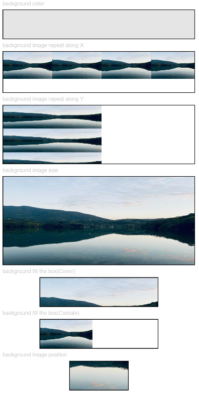
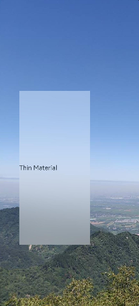
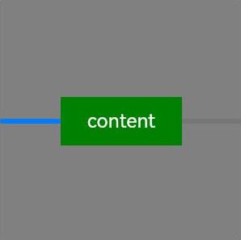
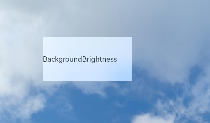
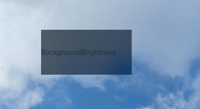
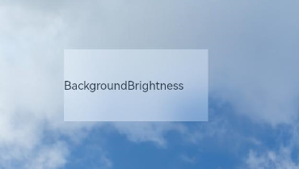
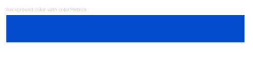

# Background
<!--Kit: ArkUI-->
<!--Subsystem: ArkUI-->
<!--Owner: @hehongyang3-->
<!--Designer: @hehongyang3-->
<!--Tester: @lxl007-->
<!--Adviser: @Brilliantry_Rui-->
<!-- md-trans-meta sourceCommit=b0395888e9f91cb6bfb01f0c7fcec66a0083da3e translatedAt=2026-09-01T12:18:13.079Z -->

You can set the background for a component.

>  **NOTE**
>
>  The initial APIs of this module are supported since API version 7. Updates will be marked with a superscript to indicate their earliest API version.

## background<sup>10+</sup>

background(content: CustomBuilder | ResourceColor, options?: BackgroundOptions): T

Sets the background of the component. Since API version 20, the **content** parameter supports the [ResourceColor](ts-types.md#resourcecolor) type, and the capability of extending the background into the safe area of the parent component is added. When you only need to set the background color without extending into the safe area, use [backgroundColor](#backgroundcolor). When you need the background color to extend into the safe area, use background(content: ResourceColor) together with the ignoresLayoutSafeAreaEdges attribute.

>**NOTE**
>
> - Events related to node mounting and unmounting, such as [onAppear](ts-universal-events-show-hide.md#onappear) and [onDisAppear](ts-universal-events-show-hide.md#ondisappear), are not supported.
>
> - Since API version 20, this API can be called in [attributeModifier](ts-universal-attributes-attribute-modifier.md#attributemodifier) only when the **content** parameter is of the ResourceColor type.

**Atomic service API**: This API can be used in atomic services since API version 11.

**Model restriction**: This API can be used only in the stage model.

**System capability**: SystemCapability.ArkUI.ArkUI.Full

**Parameters**

| Name | Type                                                | Mandatory| Description                                                        |
| ------- | ---------------------------------------------------- | ---- | ------------------------------------------------------------ |
| content | [CustomBuilder](ts-types.md#custombuilder8) \| [ResourceColor](ts-types.md#resourcecolor)        | Yes   | Sets the background content, which supports a custom-built background of the CustomBuilder type and a color background of the ResourceColor type.                                                 |
| options | [BackgroundOptions](#backgroundoptions20) | No   | Sets the custom background options.<br>**Note:**<br>Before API version 20, options: <br>{<br>align?:&nbsp;[Alignment](ts-appendix-enums.md#alignment)<br>}|

**Return value**

| Type| Description|
| -------- | -------- |
| T | Current component, used for chained calls. |

>  **NOTE**
>
> - The custom background takes some time to render and cannot respond to events during this rendering period. This property cannot be nested.
> - A CustomBuilder background cannot be previewed in the previewer.
> - Since API version 20, the background can be dynamically updated.
> - When background, backgroundColor, and backgroundImage are set at the same time, they are stacked in the following order:
>   - If background is of the ResourceColor type, or the ignoresLayoutSafeAreaEdges attribute is set, background is at the bottom, and backgroundColor is below backgroundImage.
>   - In other cases, background is at the top, and backgroundColor is below backgroundImage.
> - When the **content** parameter of background is of the CustomBuilder type, background does not change as the CustomBuilder content is updated.

## BackgroundOptions<sup>20+</sup>

Provides background options.

**Model restriction**: This API can be used only in the stage model.

**System capability**: SystemCapability.ArkUI.ArkUI.Full

| Name         | Type  | Read-Only| Optional| Description                                                        |
| ------------- | ------ | ---- | ---- | ------------------------------------------------------------ |
| align<sup>10+</sup>          | [Alignment](ts-appendix-enums.md#alignment) | No   | Yes   | Alignment mode of the custom background with the component. This attribute takes effect only for backgrounds of the CustomBuilder type. Setting the align attribute for backgrounds of the ResourceColor type is invalid. If ignoresLayoutSafeAreaEdges is set, the layout area of the background includes the extended safe area. If null/undefined is set, Alignment.TopStart is used.<br>Default value: Alignment.Center<br>**Atomic service API:** Since API version 11, this API is supported in atomic services. |
| ignoresLayoutSafeAreaEdges | Array<[LayoutSafeAreaEdge](ts-universal-attributes-expand-safe-area.md#layoutsafeareaedge12)> | No   |  Yes   |Configures the safe areas to which the background is extended, including the status bar, the navigation bar, and [safeAreaPadding](ts-universal-attributes-size.md#safeareapadding14). After this attribute is set, the alignment layout area of the background includes the extended safe area.<br> Default value:<br>- CustomBuilder background: [], not extended.<br>- ResourceColor background: [LayoutSafeAreaEdge.ALL], extended to all directions.<br>**Atomic service API:** Since API version 20, this API is supported in atomic services. |

> **NOTE**
>
> The default value of **clip** of the **Shape**, **RowSplit**, **ColumnSplit**, **SideBarContainer**, **Stepper**, **List**, **Grid**, **WaterFlow**, **Scroll**, **Refresh**, **Swiper**, and **Tabs** components is **true**, and the background extension of the child component is clipped.

## backgroundColor

backgroundColor(value: ResourceColor): T

Sets the background color of the component.

> **NOTE**
>
> When background, backgroundColor, and backgroundImage are set at the same time, they are stacked as follows: if background is of the ResourceColor type, or the ignoresLayoutSafeAreaEdges attribute is set, background is at the bottom; in other cases, background is at the top.

**Widget capability**: This API can be used in ArkTS widgets since API version 9.

**Atomic service API**: This API can be used in atomic services since API version 11.

**System capability**: SystemCapability.ArkUI.ArkUI.Full

**Parameters**

| Name| Type                                      | Mandatory| Description              |
| ------ | ------------------------------------------ | ---- | ------------------ |
| value  | [ResourceColor](ts-types.md#resourcecolor) | Yes  | Background color of the component.|

**Return value**

| Type  | Description                    |
| ------ | ------------------------ |
| T | Current component, used for chained calls. |

## backgroundColor<sup>18+</sup>

backgroundColor(color: Optional\<ResourceColor>): T

Sets the background color of the component. Compared to [backgroundColor](#backgroundcolor), the **color** parameter supports the **undefined** type.

**Widget capability**: This API can be used in ArkTS widgets since API version 18.

**Atomic service API**: This API can be used in atomic services since API version 18.

**Model restriction**: This API can be used only in the stage model.

**System capability**: SystemCapability.ArkUI.ArkUI.Full

**Parameters**

| Name| Type                                                 | Mandatory| Description                                                        |
| ------ | ----------------------------------------------------- | ---- | ------------------------------------------------------------ |
| color  | Optional\<[ResourceColor](ts-types.md#resourcecolor)> | Yes   | Sets the background color of the component.<br>When the value of color is undefined, restores to the default transparent background color. |

**Return value**

| Type  | Description                    |
| ------ | ------------------------ |
| T | Current component, used for chained calls. |

>  **NOTE**
>
>  If the background color is specified through **inactiveColor** in [backgroundBlurStyle](#backgroundblurstyle9), avoid setting the background color again using **backgroundColor**.

## backgroundColor<sup>20+</sup>

backgroundColor(color: Optional<ResourceColor | ColorMetrics>): T

Sets the background color of the component. Compared with [backgroundColor](#backgroundcolor18), this API supports the [ColorMetrics](../js-apis-arkui-graphics.md#colormetrics12) type for the **color** parameter.

> **NOTE**
>
> When the background color is specified through inactiveColor in [backgroundBlurStyle](#backgroundblurstyle9), it is not recommended to set the background color through backgroundColor.

**Widget capability**: This API can be used in ArkTS widgets since API version 20.

**Atomic service API**: This API can be used in atomic services since API version 20.

**Model restriction**: This API can be used only in the stage model.

**System capability**: SystemCapability.ArkUI.ArkUI.Full

**Parameters**

| Name| Type                                                 | Mandatory| Description                                                        |
| ------ | ----------------------------------------------------- | ---- | ------------------------------------------------------------ |
| color  | Optional\<[ResourceColor](ts-types.md#resourcecolor) \| [ColorMetrics](../js-apis-arkui-graphics.md#colormetrics12)> | Yes   | Sets the background color of the component.<br>When the value of color is undefined, the default transparent background color is restored.<br>When a P3 wide color gamut background color needs to be set, use a ColorMetrics type parameter.<br>**Note:**<br>When using ColorMetrics to set a P3 color gamut color, first call the setColorSpace API to set the current window to the wide color gamut; otherwise, the P3 color gamut color cannot be displayed correctly. |

**Return value**

| Type  | Description                    |
| ------ | ------------------------ |
| T | Current component, used for chained calls. |

## backgroundImage

backgroundImage(src: ResourceStr&nbsp;|&nbsp;PixelMap, repeat?: ImageRepeat): T

Sets the background image of the component. Network images, local images, Base64, and PixelMap resources are supported.

**Widget capability**: This API can be used in ArkTS widgets since API version 9.

**Atomic service API**: This API can be used in atomic services since API version 11.

**System capability**: SystemCapability.ArkUI.ArkUI.Full

**Parameters**

| Name| Type                                           | Mandatory| Description                                                        |
| ------ | ----------------------------------------------- | ---- | ------------------------------------------------------------ |
| src    | [ResourceStr](ts-types.md#resourcestr) \| [PixelMap](../../apis-image-kit/arkts-apis-image-PixelMap.md)<sup>12+</sup>         | Yes   | Image source. In API version 22 and earlier, network image resource URLs, local image resource URLs, Base64, and PixelMap resources are supported. SVG images and animated images such as GIF and WebP are not supported. Since API version 23, animated images of the WebP and GIF types are supported, with the first frame displayed. Other types of animated images are not supported.|
| repeat | [ImageRepeat](ts-appendix-enums.md#imagerepeat) | No   | Sets the repeat style of the background image. The default value is no repeat. When a valid [backgroundImageResizable](#backgroundimageresizable12) is set, this parameter does not take effect. When the background image has a transparent background and backgroundColor is also set, the two are displayed in an overlaid manner, with the background color at the bottom. |

**Return value**

| Type  | Description                    |
| ------ | ------------------------ |
| T | Current component, used for chained calls. |

## backgroundImage<sup>18+</sup>

backgroundImage(src: ResourceStr&nbsp;|&nbsp;PixelMap, options?: BackgroundImageOptions): T

Sets the background image of the component. Compared with [backgroundImage](#backgroundimage), this API allows you to specify synchronous or asynchronous loading modes for images.

> **NOTE**
>
> This API cannot be called within [attributeModifier](ts-universal-attributes-attribute-modifier.md#attributemodifier).

**Widget capability**: This API can be used in ArkTS widgets since API version 18.

**Atomic service API**: This API can be used in atomic services since API version 18.

**Model restriction**: This API can be used only in the stage model.

**System capability**: SystemCapability.ArkUI.ArkUI.Full

**Parameters**

<!--Table: 10%; auto; 10%; auto-->
| Name| Type                                           | Mandatory| Description                                                        |
| ------ | ----------------------------------------------- | ---- | ------------------------------------------------------------ |
| src    | [ResourceStr](ts-types.md#resourcestr) \| [PixelMap](../../apis-image-kit/arkts-apis-image-PixelMap.md)          | Yes   | Image source. In API version 22 and earlier versions, network image resource addresses, local image resource addresses, Base64, and PixelMap resources are supported. SVG images and animated images such as GIF and WebP are not supported. Starting from API version 23, support for WebP and GIF animated images is added, and the first frame of the animated image is displayed. Other types of animated images are not supported. |
| options | [BackgroundImageOptions](ts-universal-attributes-image-effect.md#backgroundimageoptions18) | No   | Sets the background image options, which are used to configure parameters such as the synchronous or asynchronous loading mode of the image. |

**Return value**

| Type  | Description                    |
| ------ | ------------------------ |
| T | Current component, used for chained calls. |

## backgroundImageSize

backgroundImageSize(value: SizeOptions | ImageSize): T

Sets the width and height of the background image for the component. If **backgroundImageSize** is not set, the [ImageSize.Auto](ts-appendix-enums.md#imagesize) effect is applied.

**Widget capability**: This API can be used in ArkTS widgets since API version 9.

**Atomic service API**: This API can be used in atomic services since API version 11.

**System capability**: SystemCapability.ArkUI.ArkUI.Full

**Parameters**

| Name| Type                                                        | Mandatory| Description                                                        |
| ------ | ------------------------------------------------------------ | ---- | ------------------------------------------------------------ |
| value  | [SizeOptions](ts-types.md#sizeoptions)&nbsp;\|&nbsp;[ImageSize](ts-appendix-enums.md#imagesize) | Yes   | Sets the height and width of the background image. By default, the aspect ratio of the original image is maintained.<br>Value range of width and height: [0, +∞)<br>ImageSize is used to control the image scaling display mode, such as maintaining the aspect ratio and filling the boundary.<br>**NOTE**<br>When both width and height are set to a value less than or equal to 0, the value 0 is used for display. When only one of width and height is not set or is set to a value less than or equal to 0, the other is adjusted based on the original aspect ratio of the image. |

**Return value**

| Type  | Description                    |
| ------ | ------------------------ |
| T | Current component, used for chained calls. |

## backgroundImagePosition

backgroundImagePosition(value: Position | Alignment): T

Sets the position of the background image. When backgroundImagePosition is not set, the default position of the background image is the upper left corner of the current component.

**Widget capability**: This API can be used in ArkTS widgets since API version 9.

**Atomic service API**: This API can be used in atomic services since API version 11.

**System capability**: SystemCapability.ArkUI.ArkUI.Full

**Parameters**

| Name| Type                                                        | Mandatory| Description                                                        |
| ------ | ------------------------------------------------------------ | ---- | ------------------------------------------------------------ |
| value  | [Position](ts-types.md#position)&nbsp;\|&nbsp;[Alignment](ts-appendix-enums.md#alignment) | Yes   | Position of the background image in the component, that is, the coordinates relative to the upper left corner of the component.<br> When x and y are set in percentage, the offset is calculated relative to the width and height of the component itself. |

**Return value**

| Type  | Description                    |
| ------ | ------------------------ |
| T | Current component, used for chained calls. |

## BlurStyle<sup>9+</sup>

Enumerates blur styles.

**System capability**: SystemCapability.ArkUI.ArkUI.Full

| Name                  | Value| Description       |
| -------------------- | ------- | --------- |
| Thin                 | - | Thin material blur.<br>**Card capability**: This API can be used in ArkTS widgets since API version 9.<br>**Atomic service API**: This API can be used in atomic services since API version 11.  |
| Regular              | - | Regular material blur.<br>**Card capability**: This API can be used in ArkTS widgets since API version 9.<br>**Atomic service API**: This API can be used in atomic services since API version 11. |
| Thick                | - | Thick material blur.<br>**Card capability**: This API can be used in ArkTS widgets since API version 9.<br>**Atomic service API**: This API can be used in atomic services since API version 11.    |
| BACKGROUND_THIN<sup>10+</sup>       | 3 | Near-distance depth-of-field blur.<br>**Card capability**: This API can be used in ArkTS widgets since API version 11.<br>**Atomic service API**: This API can be used in atomic services since API version 11.<br>**Model constraint**: This API can be used only in the stage model.   |
| BACKGROUND_REGULAR<sup>10+</sup>    | 4 | Medium-distance depth-of-field blur.<br>**Card capability**: This API can be used in ArkTS widgets since API version 11.<br>**Atomic service API**: This API can be used in atomic services since API version 11.<br>**Model constraint**: This API can be used only in the stage model.   |
| BACKGROUND_THICK<sup>10+</sup>      | 5 | Far-distance depth-of-field blur.<br>**Card capability**: This API can be used in ArkTS widgets since API version 11.<br>**Atomic service API**: This API can be used in atomic services since API version 11.<br>**Model constraint**: This API can be used only in the stage model.   |
| BACKGROUND_ULTRA_THICK<sup>10+</sup> | 6 | Ultra-far-distance depth-of-field blur.<br>**Card capability**: This API can be used in ArkTS widgets since API version 11.<br>**Atomic service API**: This API can be used in atomic services since API version 11.<br>**Model constraint**: This API can be used only in the stage model.  |
| NONE<sup>10+</sup> | 7 | Disables blur.<br>**Card capability**: This API can be used in ArkTS widgets since API version 10.<br>**Atomic service API**: This API can be used in atomic services since API version 11.<br>**Model constraint**: This API can be used only in the stage model.  |
| COMPONENT_ULTRA_THIN<sup>11+</sup> | 8 | Ultra-thin material blur for components.<br>**Card capability**: This API can be used in ArkTS widgets since API version 11.<br>**Atomic service API**: This API can be used in atomic services since API version 12.<br>**Model constraint**: This API can be used only in the stage model. |
| COMPONENT_THIN<sup>11+</sup> | 9 | Thin material blur for components.<br>**Card capability**: This API can be used in ArkTS widgets since API version 11.<br>**Atomic service API**: This API can be used in atomic services since API version 12.<br>**Model constraint**: This API can be used only in the stage model. |
| COMPONENT_REGULAR<sup>11+</sup> | 10 | Regular material blur for components.<br>**Card capability**: This API can be used in ArkTS widgets since API version 11.<br>**Atomic service API**: This API can be used in atomic services since API version 12.<br>**Model constraint**: This API can be used only in the stage model. |
| COMPONENT_THICK<sup>11+</sup> | 11 | Thick material blur for components.<br>**Card capability**: This API can be used in ArkTS widgets since API version 11.<br>**Atomic service API**: This API can be used in atomic services since API version 12.<br>**Model constraint**: This API can be used only in the stage model. |
| COMPONENT_ULTRA_THICK<sup>11+</sup> | 12 | Ultra-thick material blur for components.<br>**Card capability**: This API can be used in ArkTS widgets since API version 11.<br>**Atomic service API**: This API can be used in atomic services since API version 12.<br>**Model constraint**: This API can be used only in the stage model. |

## SystemAdaptiveOptions<sup>19+</sup>

Provides parameters for system adaptive adjustments. By default, the system performs adaptive adjustments based on chip performance.

**Widget capability**: This API can be used in ArkTS widgets since API version 19.

**Atomic service API**: This API can be used in atomic services since API version 19.

**Model restriction**: This API can be used only in the stage model.

**System capability**: SystemCapability.ArkUI.ArkUI.Full

<!--Table: auto; auto; 10%; 10%; auto-->
| Name       |   Type  |   Read-Only |  Optional | Description                       |
| ----        |  ----   |   ---- |  ---- | --------------------------  |
| disableSystemAdaptation   |  boolean   |   No   |  Yes  |  System adaptive adjustment parameter. It is recommended not to carry this parameter. The value **true** means to disable the system adaptive adjustment, and **false** means to enable it. This parameter takes effect only on low-computing-power devices, whose definition is determined by the device vendor. On devices with low chip computing power, the system automatically decides whether to use a low-computing-power approximate effect to replace the original effect based on conditions such as computing power and load. For example, for the blur effect, adaptive effect degradation is performed by combining the blur-related parameter values carried in the API and other low-computing-power processing logic.<br>Default value: false |

## backgroundBlurStyle<sup>9+</sup>

backgroundBlurStyle(value: BlurStyle, options?: BackgroundBlurStyleOptions): T

Defines the background material blur style. It encapsulates various blur radius, mask color, mask opacity, saturation, and brightness values through enum values.

> **NOTE**
>
> backgroundBlurStyle, [backdropBlur](#backdropblur), and [backgroundEffect](#backgroundeffect11) are all background blur APIs that provide different levels of blur customization: backgroundBlurStyle quickly sets a predefined blur style through an enum value; backdropBlur supports custom blur radius and grayscale parameters; backgroundEffect supports more parameters such as custom blur radius, brightness, saturation, and color. When multiple background blur APIs are set on the same component at the same time, only the last one takes effect, and the previous blur effect is overwritten.

**Widget capability**: This API can be used in ArkTS widgets since API version 9.

**Atomic service API**: This API can be used in atomic services since API version 11.

**System capability**: SystemCapability.ArkUI.ArkUI.Full

**Parameters**

| Name               | Type                                                        | Mandatory| Description                                                        |
| --------------------- | ------------------------------------------------------------ | ---- | ------------------------------------------------------------ |
| value                 | [BlurStyle](#blurstyle9)                                     | Yes  | Settings of the background blur style, including the blur radius, mask color, mask opacity, saturation, and brightness.|
| options | [BackgroundBlurStyleOptions](#backgroundblurstyleoptions10) | No   | Background blur options, used to configure the blur activation policy and the background color when the blur is not in effect. If not passed, the default activation policy [BlurStyleActivePolicy](#blurstyleactivepolicy14).ALWAYS_ACTIVE is used.<br>This parameter is not supported in ArkTS cards.                                              |

**Return value**

| Type  | Description                    |
| ------ | ------------------------ |
| T | Current component, used for chained calls. |

## backgroundBlurStyle<sup>18+</sup>

backgroundBlurStyle(style: Optional\<BlurStyle>, options?: BackgroundBlurStyleOptions): T

Defines the background material blur style. It encapsulates various blur radius, mask color, mask opacity, saturation, and brightness values through enum values. Compared to [backgroundBlurStyle<sup>9+</sup>](#backgroundblurstyle9), the **style** parameter supports the **undefined** type.

**Widget capability**: This API can be used in ArkTS widgets since API version 18.

**Atomic service API**: This API can be used in atomic services since API version 18.

**Model restriction**: This API can be used only in the stage model.

**System capability**: SystemCapability.ArkUI.ArkUI.Full

**Parameters**

| Name               | Type                                                        | Mandatory| Description                                                        |
| --------------------- | ------------------------------------------------------------ | ---- | ------------------------------------------------------------ |
| style                 | Optional\<[BlurStyle](#blurstyle9)>                          | Yes   | Background blur style. The blur style encapsulates five parameters: blur radius, mask color, mask transparency, saturation, and brightness.<br>When the value of style is undefined, the background is restored to the default state with blur disabled. |
| options | [BackgroundBlurStyleOptions](#backgroundblurstyleoptions10) | No   | Background blur options. For configuration of the blur activation policy and the background color when the blur does not take effect. If not passed, the default activation policy [BlurStyleActivePolicy](#blurstyleactivepolicy14).ALWAYS_ACTIVE is used.<br>This parameter is not supported in ArkTS cards.                                            |

**Return value**

| Type  | Description                    |
| ------ | ------------------------ |
| T | Current component, used for chained calls. |

>  **NOTE**
>
>  If the background color is specified through **inactiveColor** in **backgroundBlurStyle**, avoid setting the background color again using [backgroundColor](#backgroundcolor).

## backgroundBlurStyle<sup>19+</sup>

backgroundBlurStyle(style: Optional\<BlurStyle>, options?: BackgroundBlurStyleOptions, sysOptions?: SystemAdaptiveOptions): T

Defines the background material blur style. It encapsulates various blur radius, mask color, mask opacity, saturation, and brightness values through enum values. Compared with [backgroundBlurStyle<sup>18+</sup>](#backgroundblurstyle18), this API adds the **sysOptions** parameter, which allows for system adaptive adjustments.

**Widget capability**: This API can be used in ArkTS widgets since API version 19.

**Atomic service API**: This API can be used in atomic services since API version 19.

**Model restriction**: This API can be used only in the stage model.

**System capability**: SystemCapability.ArkUI.ArkUI.Full

**Parameters**

| Name               | Type                                                        | Mandatory| Description                                                        |
| --------------------- | ------------------------------------------------------------ | ---- | ------------------------------------------------------------ |
| style                 | Optional\<[BlurStyle](#blurstyle9)>                          | Yes   | Background blur style. The blur style encapsulates five parameters: blur radius, mask color, mask transparency, saturation, and brightness.<br>When the value of style is undefined, the background is restored to the default state with blur disabled. |
| options | [BackgroundBlurStyleOptions](#backgroundblurstyleoptions10) | No   | Background blur options. Used to configure the blur activation policy and the background color when the blur does not take effect. If not passed, the default activation policy [BlurStyleActivePolicy](#blurstyleactivepolicy14).ALWAYS_ACTIVE is used.<br>This parameter is not supported in ArkTS cards.                                            |
| sysOptions   |  [SystemAdaptiveOptions](#systemadaptiveoptions19)    |   No   |  System adaptive adjustment parameters.<br>Default value: { disableSystemAdaptation: false }    |

**Return value**

| Type  | Description                    |
| ------ | ------------------------ |
| T | Current component, used for chained calls. |

>  **NOTE**
>
>  If the background color is specified through **inactiveColor** in **backgroundBlurStyle**, avoid setting the background color again using [backgroundColor](#backgroundcolor).

## backdropBlur

backdropBlur(value: number, options?: BlurOptions): T

Applies a background blur effect to the component. It samples and blurs the visual content behind the component, and supports custom blur radius and grayscale parameters.

**Widget capability**: This API can be used in ArkTS widgets since API version 9.

**Atomic service API**: This API can be used in atomic services since API version 11.

**System capability**: SystemCapability.ArkUI.ArkUI.Full

**Parameters**

| Name               | Type                                                        | Mandatory| Description                                                        |
| --------------------- | ------------------------------------------------------------ | ---- | ------------------------------------------------------------ |
| value                 | number                                                       | Yes   | Adds a background blur effect to the current component. The input parameter is the blur radius. A larger blur radius produces a stronger blur effect, and a value of 0 means no blur. If a negative value is passed in, it is automatically corrected to 0.<br>Value range: [0, +∞)<br>Default value: 0 |
| options<sup>11+</sup> | [BlurOptions](ts-universal-attributes-foreground-blur-style.md#bluroptions11) | No   | Grayscale blur parameter. Adjusts the black and white levels in the image to make them tend toward gray, reducing the black-white contrast. It has no effect on the adjustment of colors in the image.<br>Default value: grayscale: [0,0]  |

**Return value**

| Type  | Description                    |
| ------ | ------------------------ |
| T | Current component, used for chained calls. |

## backdropBlur<sup>18+</sup>

backdropBlur(radius: Optional\<number>, options?: BlurOptions): T

Applies a background blur effect to the component. It samples and blurs the visual content behind the component, and supports custom blur radius and grayscale parameters. Compared to [backdropBlur](#backdropblur), the **radius** parameter supports the undefined type.

**Widget capability**: This API can be used in ArkTS widgets since API version 18.

**Atomic service API**: This API can be used in atomic services since API version 18.

**Model restriction**: This API can be used only in the stage model.

**System capability**: SystemCapability.ArkUI.ArkUI.Full

**Parameters**

| Name               | Type                                                        | Mandatory| Description                                                        |
| --------------------- | ------------------------------------------------------------ | ---- | ------------------------------------------------------------ |
| radius                | Optional\<number>                                            | Yes   | Adds a background blur effect to the current component. The input parameter is the blur radius. A larger blur radius produces a stronger blur effect, and a value of 0 means no blur. When the value of radius is undefined, the background is restored to the default state without blur.<br>Value range: [0, +∞)<br>Default value: 0<br>Unit: px |
| options | [BlurOptions](ts-universal-attributes-foreground-blur-style.md#bluroptions11) | No   | Grayscale blur parameters. Adjusts the black and white levels in the image to make them tend toward gray and produce softer transitions. It has no effect on the color adjustment in the image.<br>Default value: grayscale: [0,0] |

**Return value**

| Type  | Description                    |
| ------ | ------------------------ |
| T | Current component, used for chained calls. |

>  **NOTE**
>
>  **backgroundBlurStyle**, **blur**, and **backdropBlur** are real-time blur APIs that perform real-time rendering per frame, resulting in high performance overhead. When neither the blur content nor the blur radius needs to change, use the static blur API [blur](../../apis-arkgraphics2d/js-apis-effectKit.md#blur).

## backdropBlur<sup>19+</sup>

backdropBlur(radius: Optional\<number>, options?: BlurOptions, sysOptions?: SystemAdaptiveOptions): T

Applies a background blur effect to the component. You can customize the blur radius and grayscale parameters. Compared with [backdropBlur<sup>18+</sup>](#backdropblur18), this API adds the **sysOptions** parameter, which allows for system adaptive adjustments.

**Widget capability**: This API can be used in ArkTS widgets since API version 19.

**Atomic service API**: This API can be used in atomic services since API version 19.

**Model restriction**: This API can be used only in the stage model.

**System capability**: SystemCapability.ArkUI.ArkUI.Full

**Parameters**

| Name               | Type                                                        | Mandatory| Description                                                        |
| --------------------- | ------------------------------------------------------------ | ---- | ------------------------------------------------------------ |
| radius                | Optional\<number>                                            | Yes   | Adds a background blur effect to the current component. The input parameter is the blur radius. A larger blur radius produces a stronger blur effect, and a value of 0 means no blur. A negative value is automatically corrected to 0.<br>When the value of radius is undefined, the background is restored to the default state without blur.<br>Value range: [0, +∞)<br>Default value: 0 |
| options | [BlurOptions](ts-universal-attributes-foreground-blur-style.md#bluroptions11) | No   | Grayscale blur parameters. Adjusts the black and white levels in the image to make them tend toward gray and produce softer transitions. It has no effect on the adjustment of colors in the image.<br>Default value: grayscale: [0,0] |
| sysOptions   |  [SystemAdaptiveOptions](#systemadaptiveoptions19)    |   No   |  System adaptive adjustment parameters.<br>Default value: { disableSystemAdaptation: false }    |

**Return value**

| Type  | Description                    |
| ------ | ------------------------ |
| T | Current component, used for chained calls. |

>  **NOTE**
>
>  **backgroundBlurStyle**, **blur**, and **backdropBlur** perform real-time rendering per frame, resulting in high performance overhead. When both the blur content and blur radius remain unchanged, it is recommended that you use the static blur API [blur](../../apis-arkgraphics2d/js-apis-effectKit.md#blur). For best practices, see [Image Blurring Optimization – When to Use](https://developer.huawei.com/consumer/en/doc/best-practices/bpta-fuzzy-scene-performance-optimization#section4945532519).

## backgroundEffect<sup>11+</sup>

backgroundEffect(options: BackgroundEffectOptions): T

Sets the component background attributes, which are processed in real-time rendering, including parameters such as the background blur radius, brightness, saturation, and color.

>  **NOTE**
>
>  **backgroundEffect** is a real-time API that performs real-time rendering of the blur effect per frame, resulting in high performance overhead. When the component background blur effect does not need to change, use the static blur API [blur](../../apis-arkgraphics2d/js-apis-effectKit.md#blur) to implement the blur effect.

**Atomic service API**: This API can be used in atomic services since API version 12.

**Model restriction**: This API can be used only in the stage model.

**System capability**: SystemCapability.ArkUI.ArkUI.Full

**Parameters**

| Name | Type                                                 | Mandatory| Description                                      |
| ------- | ----------------------------------------------------- | ---- | ------------------------------------------ |
| options | [BackgroundEffectOptions](#backgroundeffectoptions11) | Yes  | Background effect of the component, including the blur radius, brightness, saturation, and color.|

**Return value**

| Type  | Description                    |
| ------ | ------------------------ |
| T | Current component, used for chained calls. |

## backgroundEffect<sup>18+</sup>

backgroundEffect(options: Optional\<BackgroundEffectOptions>): T

Sets the component background attributes, including parameters such as the background blur radius, brightness, saturation, and color. Compared with [backgroundEffect<sup>11+</sup>](#backgroundeffect11), the **options** parameter additionally supports the **undefined** type.

**Atomic service API**: This API can be used in atomic services since API version 18.

**Model restriction**: This API can be used only in the stage model.

**System capability**: SystemCapability.ArkUI.ArkUI.Full

**Parameters**

| Name | Type                                                        | Mandatory| Description                                                        |
| ------- | ------------------------------------------------------------ | ---- | ------------------------------------------------------------ |
| options | Optional\<[BackgroundEffectOptions](#backgroundeffectoptions11)> | Yes | Sets the component background attributes, including the background blur radius, brightness, saturation, and color.<br>When the value of options is undefined, the background is restored to the default state with no effect. |

**Return value**

| Type  | Description                    |
| ------ | ------------------------ |
| T | Current component, used for chained calls. |

## backgroundEffect<sup>19+</sup>

backgroundEffect(options: Optional\<BackgroundEffectOptions>, sysOptions?: SystemAdaptiveOptions): T

Sets the background effect of the component, including the blur radius, brightness, saturation, and color. Compared with [backgroundEffect<sup>18+</sup>](#backgroundeffect18), this API adds the **sysOptions** parameter, which allows for system adaptive adjustments.

>  **NOTE**
>
>  **backgroundEffect** is a real-time API that performs real-time rendering of the blur effect per frame, resulting in high performance overhead. When the component background blur effect does not need to change, use the static blur API [blur](../../apis-arkgraphics2d/js-apis-effectKit.md#blur) to implement the blur effect. For best practices, see [Image Blurring Optimization - When to Use](https://developer.huawei.com/consumer/en/doc/best-practices/bpta-fuzzy-scene-performance-optimization#section4945532519).

**Atomic service API**: This API can be used in atomic services since API version 19.

**Model restriction**: This API can be used only in the stage model.

**System capability**: SystemCapability.ArkUI.ArkUI.Full

**Parameters**

| Name | Type                                                        | Mandatory| Description                                                        |
| ------- | ------------------------------------------------------------ | ---- | ------------------------------------------------------------ |
| options | Optional\<[BackgroundEffectOptions](#backgroundeffectoptions11)> | Yes | Sets the component background properties, including the background blur radius, brightness, saturation, and color.<br>When the value of options is undefined, restores the background to no effect. |
| sysOptions   |  [SystemAdaptiveOptions](#systemadaptiveoptions19)    |   No   |  System adaptive adjustment parameter.<br>Default value: { disableSystemAdaptation: false }    |

**Return value**

| Type  | Description                    |
| ------ | ------------------------ |
| T | Current component, used for chained calls. |

## BackgroundEffectOptions<sup>11+</sup>

Describes the background effect.

**Model restriction**: This API can be used only in the stage model.

**System capability**: SystemCapability.ArkUI.ArkUI.Full

<!--Table: auto; auto; 10%; 10%; auto-->
| Name       |   Type        |   Read-Only |  Optional |  Description                       |
| ----         |  ----         |   ---- |  ---- | --------------------------  |
| radius       | number        |   No   |   No   |   Blur radius, in vp. Value range: [0, +∞), default value: 0. <br> **Atomic service API:** Since API version 12, this API is supported in atomic services. |
| saturation   | number        |   No   |   Yes   |  Saturation. Value range: [0, +∞), default value: 1. Recommended value range: [0, 50]. If a negative value is passed in, the default value 1 is restored. If the value exceeds the recommended range, the effect may not meet expectations. <br> **Atomic service API:** Since API version 12, this API is supported in atomic services.    |
| brightness   | number        |   No   |   Yes   |  Brightness. Value range: [0, +∞), default value: 1. Recommended value range: [0, 2]. If a negative value is passed in, the default value 1 is restored. If the value exceeds the recommended range, the effect may not meet expectations.<br> **Atomic service API:** Since API version 12, this API is supported in atomic services. |
| color        | [ResourceColor](ts-types.md#resourcecolor)         |   No   |   Yes   |   Mask color of the background effect. The default value is transparent. When adaptiveColor is AVERAGE, color must have transparency for the color sampling mode to take effect. Setting different color values overlays a mask layer of the corresponding color on the background blur effect.<br> **Atomic service API:** Since API version 12, this API is supported in atomic services.  |
| adaptiveColor | [AdaptiveColor](ts-universal-attributes-foreground-blur-style.md#adaptivecolor) |   No  |   Yes  | Color sampling mode used by the background blur effect. The default value is DEFAULT. When AVERAGE is used, color must have transparency for the color sampling mode to take effect; if color does not have transparency, the color sampling mode does not take effect. <br> **Atomic service API:** Since API version 12, this API is supported in atomic services.  |
| blurOptions  | [BlurOptions](ts-universal-attributes-foreground-blur-style.md#bluroptions11) |   No   |   Yes   |   Grayscale blur parameters. The default value is [0,0]. <br> **Atomic service API:** Since API version 12, this API is supported in atomic services. |
| policy<sup>14+</sup>    | [BlurStyleActivePolicy](#blurstyleactivepolicy14) | No  |   Yes  | Blur activation policy.<br> Default value: BlurStyleActivePolicy.ALWAYS_ACTIVE <br> **Atomic service API:** Since API version 14, this API is supported in atomic services.|
| inactiveColor<sup>14+</sup>  | [ResourceColor](ts-types.md#resourcecolor)  | No   |   Yes  | Background color used when the blur does not take effect. This parameter must be used together with the policy parameter. When policy disables the blur, the component blur effect is removed. If inactiveColor is set, it is used as the component background color; if inactiveColor is not set, the component background color is restored to the default transparent color. By default, inactiveColor is not set.<br> **Atomic service API:** Since API version 14, this API is supported in atomic services. |

## backgroundImageResizable<sup>12+</sup>

backgroundImageResizable(value: ResizableOptions): T

Sets the resizable image options for stretching the background image, that is, defines the stretchable regions and fixed regions of the image to achieve a 9-patch-like slice stretching effect.

When **ResizableOptions** is set to a valid value, the **repeat** parameter in [backgroundImage](#backgroundimage) does not take effect.

When the sum of the values of **top** and **bottom** is greater than the source image height, or the sum of the values of **left** and **right** is greater than the source image width, the **ResizableOptions** attribute does not take effect.

**Atomic service API**: This API can be used in atomic services since API version 12.

**Model restriction**: This API can be used only in the stage model.

**System capability**: SystemCapability.ArkUI.ArkUI.Full

**Parameters**

| Name| Type                                   | Mandatory| Description                            |
| ------ | --------------------------------------- | ---- | -------------------------------- |
| value  | [ResizableOptions](ts-basic-components-image.md#resizableoptions11) | Yes  | Resizable image options.|

**Return value**

| Type  | Description                    |
| ------ | ------------------------ |
| T | Current component, used for chained calls. |

## BackgroundBlurStyleOptions<sup>10+</sup>

Inherits from [BlurStyleOptions](ts-universal-attributes-foreground-blur-style.md#blurstyleoptions).

**Atomic service API**: This API can be used in atomic services since API version 11.

**Model restriction**: This API can be used only in the stage model.

**System capability**: SystemCapability.ArkUI.ArkUI.Full

<!--Table: 10%; 10%; 10%; 10%; 60%-->
| Name| Type                                                        | Read-Only| Optional| Description                                                |
| ------ | ------------------------------------------------------------ | ---- | ---- |---------------------------------------------------- |
| policy<sup>14+</sup>  | [BlurStyleActivePolicy](#blurstyleactivepolicy14) | No | Yes   | Blur activation policy.<br> Default value: BlurStyleActivePolicy.ALWAYS_ACTIVE <br>**Atomic service API:** Since API version 14, this API is supported in atomic services. |
| inactiveColor<sup>14+</sup>  | [ResourceColor](ts-types.md#resourcecolor) | No | Yes    | Background color used when the blur does not take effect. This parameter must be used together with the policy parameter. When the policy disables the blur, the component blur effect is removed. If inactiveColor is set, it is used as the component background color. By default, inactiveColor is not set.<br>**Atomic service API:** Since API version 14, this API is supported in atomic services. |

## BlurStyleActivePolicy<sup>14+</sup>

Enumerates the activation policies for the background blur effect.

**Atomic service API**: This API can be used in atomic services since API version 14.

**Model restriction**: This API can be used only in the stage model.

**System capability**: SystemCapability.ArkUI.ArkUI.Full

| Name    | Value|Description                           |
| ------ | ----------------------------- |----------------------------- |
| FOLLOWS_WINDOW_ACTIVE_STATE| 0|The blur effect changes according to the window's focus state; it is inactive when the window is not in focus and active when the window is in focus.|
|  ALWAYS_ACTIVE  | 1|The blur effect is always active.|
| ALWAYS_INACTIVE |2 |The blur effect is always inactive.|

## backgroundBrightness<sup>12+</sup>

backgroundBrightness(params: BackgroundBrightnessOptions): T

Sets the component background brightening effect, which changes the brightness performance of the component background by adjusting the brightness change rate and the brightening degree.

**Atomic service API**: This API can be used in atomic services since API version 12.

**Model restriction**: This API can be used only in the stage model.

**System capability**: SystemCapability.ArkUI.ArkUI.Full

**Parameters**

| Name| Type                                                        | Mandatory| Description                                                |
| ------ | ------------------------------------------------------------ | ---- | ---------------------------------------------------- |
| params | [BackgroundBrightnessOptions](#backgroundbrightnessoptions12) | Yes | Sets the background brightness effect of the component, including the brightness change rate and brightness level. |

**Return value**

| Type  | Description                    |
| ------ | ------------------------ |
| T | Current component, used for chained calls. |

## backgroundBrightness<sup>18+</sup>

backgroundBrightness(options: Optional\<BackgroundBrightnessOptions>): T

Sets the component background brightening effect, which changes the brightness performance of the component background by adjusting the brightness change rate and the brightening degree. Compared with [backgroundBrightness<sup>12+</sup>](#backgroundbrightness12), the **options** parameter additionally supports the **undefined** type.

**Atomic service API**: This API can be used in atomic services since API version 18.

**Model restriction**: This API can be used only in the stage model.

**System capability**: SystemCapability.ArkUI.ArkUI.Full

**Parameters**

| Name | Type                                                        | Mandatory| Description                                                        |
| ------- | ------------------------------------------------------------ | ---- | ------------------------------------------------------------ |
| options | Optional\<[BackgroundBrightnessOptions](#backgroundbrightnessoptions12) | Yes | Sets the background brightening effect of the component, including the brightness change rate and brightening degree.<br>When the value of options is undefined, the background is restored to the state without the brightening effect. |

**Return value**

| Type  | Description                    |
| ------ | ------------------------ |
| T | Current component, used for chained calls. |

## BackgroundBrightnessOptions<sup>12+</sup>

Provides background brightness options.

**Atomic service API**: This API can be used in atomic services since API version 12.

**Model restriction**: This API can be used only in the stage model.

**System capability**: SystemCapability.ArkUI.ArkUI.Full

| Name         | Type  | Read-Only |  Optional| Description                                                        |
| ------------- | ------ | ---- | ---- | ------------------------------------------------------------ |
| rate          | number | No   |  No   | Rate of brightness change. A larger value means the light-up degree decreases faster. If rate is 0, lightUpDegree does not take effect, that is, no light-up effect is produced.<br>Default value: 0.0 <br>Value range: [0.0, +∞) |
| lightUpDegree | number | No   |  No   | Light-up degree. A larger value means a more obvious brightness increase.<br>**Note:**<br>When rate is 0, lightUpDegree does not take effect.<br> Default value: 0.0 <br>Value range: [-1.0, 1.0] |

>  **NOTE**
>
>  For the component background content, the brightness (grayscale value) of each pixel is calculated as follows:
>  `Y = (0.299R + 0.587G + 0.114B) / 255.0` (R, G, and B represent the red, green, and blue channel values of the pixel respectively, and Y represents the grayscale value). The grayscale value of the pixel is normalized to the range of 0 to 1 using the formula above.
>  The brightness enhancement is calculated as follows: `ΔY = -rate*Y + lightUpDegree`. For example, when rate=0.5 and lightUpDegree=0.5, the brightness increment of a pixel with a grayscale value of 0.2 is `-0.5*0.2 + 0.5 = 0.4`, and the brightness increment of a pixel with a grayscale value of 1 is `-0.5*1 + 0.5 = 0`.

## Example

### Example 1: Setting Basic Background Styles

This example shows how to configure basic background styles by setting **backgroundColor**, **backgroundImage**, **backgroundImageSize**, and **backgroundImagePosition**.

```ts
// xxx.ets
@Entry
@Component
struct BackgroundExample {
  build() {
    Column({ space: 5 }) {
      Text('background color').fontSize(9).width('90%').fontColor(0xCCCCCC)
      Row().width('90%').height(50).backgroundColor(0xE5E5E5).border({ width: 1 })

      Text('background image repeat along X').fontSize(9).width('90%').fontColor(0xCCCCCC)
      Row()
      // Replace $r('app.media.image') with the image resource file you use.
        .backgroundImage($r('app.media.image'), ImageRepeat.X)
        .backgroundImageSize({ width: '250px', height: '140px' })
        .width('90%')
        .height(70)
        .border({ width: 1 })

      Text('background image repeat along Y').fontSize(9).width('90%').fontColor(0xCCCCCC)
      Row()
      // Replace $r('app.media.image') with the image resource file you use.
        .backgroundImage($r('app.media.image'), ImageRepeat.Y)
        .backgroundImageSize({ width: '500px', height: '120px' })
        .width('90%')
        .height(100)
        .border({ width: 1 })

      Text('background image size').fontSize(9).width('90%').fontColor(0xCCCCCC)
      Row()
        .width('90%')
        .height(150)
        // Replace $r('app.media.image') with the image resource file you use.
        .backgroundImage($r('app.media.image'), ImageRepeat.NoRepeat)
        .backgroundImageSize({ width: 1000, height: 500 })
        .border({ width: 1 })

      Text('background fill the box(Cover)').fontSize(9).width('90%').fontColor(0xCCCCCC)
      // Occupy all the space of the container, without ensuring that the image is completely displayed.
      Row()
        .width(200)
        .height(50)
        // Replace $r('app.media.image') with the image resource file you use.
        .backgroundImage($r('app.media.image'), ImageRepeat.NoRepeat)
        .backgroundImageSize(ImageSize.Cover)
        .border({ width: 1 })

      Text('background fill the box(Contain)').fontSize(9).width('90%').fontColor(0xCCCCCC)
      // Maximize the image while ensuring that it can be completely displayed.
      Row()
        .width(200)
        .height(50)
        // Replace $r('app.media.image') with the image resource file you use.
        .backgroundImage($r('app.media.image'), ImageRepeat.NoRepeat)
        .backgroundImageSize(ImageSize.Contain)
        .border({ width: 1 })

      Text('background image position').fontSize(9).width('90%').fontColor(0xCCCCCC)
      Row()
        .width(100)
        .height(50)
        // Replace $r('app.media.image') with the image resource file you use.
        .backgroundImage($r('app.media.image'), ImageRepeat.NoRepeat)
        .backgroundImageSize({ width: 1000, height: 560 })
        .backgroundImagePosition({ x: -500, y: -300 })
        .border({ width: 1 })
    }
    .width('100%').height('100%').padding({ top: 5 })
  }
}
```



### Example 2: Setting the Background Blur Style

This example sets the background blur style using **backgroundBlurStyle**.

```ts
// xxx.ets
@Entry
@Component
struct BackgroundBlurStyleDemo {
  build() {
    Column() {
      Row() {
        Text('Thin Material')
      }
      .width('50%')
      .height('50%')
      .backgroundBlurStyle(BlurStyle.Thin,
        { colorMode: ThemeColorMode.LIGHT, adaptiveColor: AdaptiveColor.DEFAULT, scale: 1.0 })
      .position({ x: '15%', y: '30%' })
    }
    .height('100%')
    .width('100%')
    // Replace $r('app.media.bg') with the image resource file you use.
    .backgroundImage($r('app.media.bg'))
    .backgroundImageSize(ImageSize.Cover)
  }
}
```



### Example 3: Setting the Component Background

This example shows how to set the component background using **background**.

```ts
// xxx.ets
@Entry
@Component
struct BackgroundExample {
  @Builder
  renderBackground() {
    Column() {
      Progress({ value: 50 })
    }
  }

  build() {
    Column() {
      Text("content")
        .width(100)
        .height(40)
        .fontColor("#FFF")
        .position({ x: 50, y: 80 })
        .textAlign(TextAlign.Center)
        .backgroundColor(Color.Green)
    }
    .width(200).height(200)
    .background(this.renderBackground)
    .backgroundColor(Color.Gray)
  }
}
```



### Example 4: Setting Component Background Brightness

This example sets the component background brightness using **backgroundBrightness**.

```ts
// xxx.ets
@Entry
@Component
struct BackgroundBrightnessDemo {
  build() {
    Column() {
      Row() {
        Text("BackgroundBrightness")
      }
      .width(200)
      .height(100)
      .position({ x: 100, y: 100 })
      .backgroundBlurStyle(BlurStyle.Thin, { colorMode: ThemeColorMode.LIGHT, adaptiveColor: AdaptiveColor.DEFAULT})
      .backgroundBrightness({rate:0.5,lightUpDegree:0.5}) // Background brightness
    }
    .width('100%')
    .height('100%')
    // Replace $r('app.media.image') with the image resource file you use.
    .backgroundImage($r('app.media.image'))
    .backgroundImageSize(ImageSize.Cover)
  }
}
```

The following figures show how the component looks with the background brightness set.

When **rate** and **lightUpDegree** are both set to **0.5**



When **rate** is set to **0.5** and **lightUpDegree** **-0.1**



The following figure shows how the component looks without the background brightness set.



### Example 5: Setting Blur Effects

This example shows how to use **blur** to apply a foreground blur effect and **backdropBlur** to apply a background blur effect.

```ts
// xxx.ets
@Entry
@Component
struct BlurEffectsExample {
  build() {
    Column({ space: 10 }) {
      // Blur the font.
      Text('font').fontSize(15).fontColor(0xCCCCCC).width('90%')
      Flex({ alignItems: ItemAlign.Center }) {
        Text('original').margin(10)
        Text('blur')
          .blur(5).margin(10)
        Text('blur')
          .blur(10, undefined).margin(10) // Content blur radius is 10, with no grayscale set.
        Text('blur')
          .blur(15).margin(10)
      }.width('90%').height(40)
      .backgroundColor(0xF9CF93)


      // Blur the background.
      Text('backdropBlur').fontSize(15).fontColor(0xCCCCCC).width('90%')
      Text()
        .width('90%')
        .height(40)
        .fontSize(16)
        .backdropBlur(3)
        // Replace $r('app.media.image') with the image resource file you use.
        .backgroundImage($r('app.media.image'))
        .backgroundImageSize({ width: 1200, height: 160 })
    }.width('100%').margin({ top: 5 })
  }
}
```


### Example 6: Setting Text Blur Effects

This example uses [blendMode](ts-universal-attributes-image-effect.md#blendmode11) and backgroundEffect to implement an irregular text blur effect.<br>
If line leakage occurs, developers should first ensure that the components where the two blendMode attributes are set have exactly the same size. If the sizes are confirmed to be the same, the component boundary may fall on floating-point coordinates. In this case, try setting the [pixelRound](ts-universal-attributes-pixelRoundForComponent.md#pixelround) universal attribute to align the component boundaries on both sides of the generated white or dark lines to integer pixel coordinates.

```ts
// xxx.ets
@Entry
@Component
struct Index {
  @State shadowColor: Color = Color.White;
  @State dateFontSize: number = 20;
  @State redValue: number = 255;
  @State greenValue: number = 255;
  @State blueValue: number = 255;
  @State alphaValue: number = 0.1;
  @State blurRadius: number = 40;
  @State saturationValue: number = 0.8;
  @State brightnessValue: number = 1.5;
  build() {
    Stack() {
      // Replace $r('app.media.image') with the image resource file you use.
      Image($r('app.media.image'))
      Column() {
        Column({ space: 0 }) {
          Column() {
            Text('11')
              .fontSize(144)
              .fontWeight(FontWeight.Bold)
              .fontColor('rgba(255,255,255,1)')
              .fontFamily('HarmonyOS-Sans-Digit')
              .maxLines(1)
              .lineHeight(120 * 1.25)
              .height(120 * 1.25)
              .letterSpacing(4 * 1.25)
            Text('42')
              .fontSize(144)
              .fontWeight(FontWeight.Bold)
              .fontColor('rgba(255,255,255,1)')
              .fontFamily('HarmonyOS-Sans-Digit')
              .maxLines(1)
              .lineHeight(120 * 1.25)
              .height(120 * 1.25)
              .letterSpacing(4 * 1.25)
              .shadow({
                color: 'rgba(0,0,0,0)',
                radius: 20,
                offsetX: 0,
                offsetY: 0
              })
            Row() {
              Text('October 16')
                .fontSize(this.dateFontSize)
                .height(22)
                .fontWeight('medium')
                .fontColor('rgba(255,255,255,1)')
              Text('Monday')
                .fontSize(this.dateFontSize)
                .height(22)
                .fontWeight('medium')
                .fontColor('rgba(255,255,255,1)')
            }
          }
          // Use offscreen rendering for blendMode. In DST_IN mode, only the overlapping area of the current component and the underlying canvas is displayed.
          .blendMode(BlendMode.DST_IN, BlendApplyType.OFFSCREEN)
          .pixelRound({
            start: PixelRoundCalcPolicy.FORCE_FLOOR ,
            top: PixelRoundCalcPolicy.FORCE_FLOOR ,
            end: PixelRoundCalcPolicy.FORCE_CEIL,
            bottom: PixelRoundCalcPolicy.FORCE_CEIL
          })
        }
        // Use offscreen rendering for blendMode. In SRC_OVER mode, the content of the current component is displayed over the underlying canvas.
        .blendMode(BlendMode.SRC_OVER, BlendApplyType.OFFSCREEN)
        // Configure the blur radius, saturation, brightness, and dynamic RGBA color of the component background through backgroundEffect.
        .backgroundEffect({
          radius: this.blurRadius,
          saturation: this.saturationValue,
          brightness: this.brightnessValue,
          color: this.getVolumeDialogWindowColor()
        })
        .justifyContent(FlexAlign.Center)
        .pixelRound({
          start: PixelRoundCalcPolicy.FORCE_FLOOR ,
          top: PixelRoundCalcPolicy.FORCE_FLOOR ,
          end: PixelRoundCalcPolicy.FORCE_CEIL,
          bottom: PixelRoundCalcPolicy.FORCE_CEIL
        })
      }
    }
  }
  getVolumeDialogWindowColor(): ResourceColor | string {
    return `rgba(${this.redValue.toFixed(0)}, ${this.greenValue.toFixed(0)}, ${this.blueValue.toFixed(0)}, ${this.alphaValue.toFixed(2)})`;
  }
}
```

<!--Del--> <!--DelEnd-->

### Example 7: Comparing Blur Effects

This example compares three different blur effects: [backgroundEffect<sup>11+</sup>](#backgroundeffect11), [backdropBlur](#backdropblur), and [backgroundBlurStyle<sup>9+</sup>](#backgroundblurstyle9).

```ts
// xxx.ets
@Entry
@Component
struct BackgroundBlur {
  private imageSize: number = 150;

  build() {
    Column({ space: 5 }) {
      // Use backgroundBlurStyle with an enum value to set blur parameters.
      Stack() {
        // Replace $r('app.media.test') with the image resource file you use.
        Image($r('app.media.test'))
          .width(this.imageSize)
          .height(this.imageSize)
        Column()
          .width(this.imageSize)
          .height(this.imageSize)
          .backgroundBlurStyle(BlurStyle.Thin)
      }

      // backgroundEffect can customize parameters such as blur radius, brightness, and saturation.
      Stack() {
        // Replace $r('app.media.test') with the image resource file you use.
        Image($r('app.media.test'))
          .width(this.imageSize)
          .height(this.imageSize)
        Column()
          .width(this.imageSize)
          .height(this.imageSize)
          .backgroundEffect({ radius: 20, brightness: 0.6, saturation: 15 })
      }

      // backdropBlur only sets blur radius and grayscale parameters.
      Stack() {
        // Replace $r('app.media.test') with the image resource file you use.
        Image($r('app.media.test'))
          .width(this.imageSize)
          .height(this.imageSize)
        Column()
          .width(this.imageSize)
          .height(this.imageSize)
          .backdropBlur(20, { grayscale: [30, 50] })
      }
    }
    .width('100%')
    .padding({ top: 5 })
  }
}
```


### Example 8: Applying a P3 Color Gamut Background Effect

This example demonstrates how to apply a P3 color gamut background effect using [backgroundColor](#backgroundcolor20), available since API version 20.

```ts
// xxx.ets
// To set the P3 color gamut, use the setColorSpace API in ets/entryability/EntryAbility.ets to set the current window to a wide color gamut.
import { ColorMetrics } from '@kit.ArkUI';

@Entry
@Component
struct P3BackgroundDemo {
  @State p3Color: ColorMetrics = ColorMetrics.colorWithSpace(ColorSpace.DISPLAY_P3, 0, 0.3, 0.8, 1);

  build() {
    Column({ space: 5 }) {
      Text('background color with colorMetrics').fontSize(9).width('90%').fontColor(0xCCCCCC)
      Row().width('90%').height(50).backgroundColor(this.p3Color)
    }
    .width('100%')
    .height('100%')
  }
}
```



### Example 9: Setting Component Background Extension

This example shows how to use [background](#background10) to extend the component's background to the parent component's safe area, supported since API version 20.

```ts
import { LengthMetrics } from '@kit.ArkUI';

@Entry
@Component
struct BackgroundExtension {
  @Builder
  myImages() {
    Column() {
      Image($r('app.media.startIcon'))
        .width('100%')
        .height('100%')
    }
  }

  build() {
    Column({space: 10}) {
      Stack() {
        // A background of the CustomBuilder type with the ignoresLayoutSafeAreaEdges property set extends to the parent component's safe area.
        Column()
          .size({ width: '100%', height: '100%' })
          .border({ width: 1, color: Color.Red })
          .background(
            this.myImages(),
            { align: Alignment.Center , ignoresLayoutSafeAreaEdges: [ LayoutSafeAreaEdge.START, LayoutSafeAreaEdge.TOP ] }
          )
      }
      .size({ width: 300, height: 300 })
      .backgroundColor('#004aaf')
      .safeAreaPadding(LengthMetrics.vp(50))

      Stack() {
        // A background of the ResourceColor type without the ignoresLayoutSafeAreaEdges property set extends to the parent component's safe area by default.
        Column()
          .size({ width: '100%', height: '100%' })
          .border({ width: 1, color: Color.Red })
          .background('#d5d5d5', { align: Alignment.Center })
      }
      .size({ width: 300, height: 300 })
      .backgroundColor('#707070')
      .safeAreaPadding(LengthMetrics.vp(50))
    }
    .margin(10)
  }
}
```


