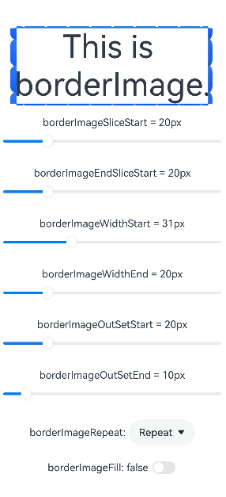

# Border Image
<!--Kit: ArkUI-->
<!--Subsystem: ArkUI-->
<!--Owner: @liyujie43-->
<!--Designer: @weixin_52725220-->
<!--Tester: @xiong0104-->
<!--Adviser: @Brilliantry_Rui-->
<!-- md-trans-meta sourceCommit=03c605dae538ca07ef624305c900aa5c89bb4da2 translatedAt=2026-09-01T12:14:36.345Z -->

You can draw an image around a component.

>  **NOTE**
>
>  The APIs of this module are supported since API version 9. Updates will be marked with a superscript to indicate their earliest API version.

## borderImage

borderImage(value: BorderImageOption): T

Sets the border image of the component.

**Widget capability**: Since API version 9, this feature is supported in ArkTS widgets.

**Atomic service API**: This API can be used in atomic services since API version 11.

**System capability**: SystemCapability.ArkUI.ArkUI.Full

**Parameters**

| Name     | Type                                           | Mandatory| Description                          |
| ----------- | ----------------------------------------------- | ---- | -------------------------------- |
| value | [BorderImageOption](#borderimageoption) | Yes  | Border image or border gradient.|

**Return value**

| Type  | Description                    |
| ------ | ------------------------ |
| T | Current component.|

## BorderImageOption

**Widget capability**: Since API version 9, this feature is supported in ArkTS widgets.

**Atomic service API**: This API can be used in atomic services since API version 11.

**System capability**: SystemCapability.ArkUI.ArkUI.Full

<!--Table: 15%; 25%; 8%; 8%; 44%-->
| Name  | Type                                                        | Read-Only| Optional| Description                                                 |
| ------ | ------------------------------------------------------------ | ---- |  ------------------------------------------------------------ |  ------------------------------------------------------------ |
| source | string \| [Resource](ts-types.md#resource) \| [LinearGradient](#lineargradient) | No | Yes | Border image source or gradient color settings. When the parameter type is string, it is used to set the border image source. For details about how to reference, see [Loading Image Resources](../../../ui/arkts-graphics-display.md#loading-image-resources).<br/>Default value: undefined (the border image source is not set)<br/>**Note:**<br>The border image source applies only to container components, such as [Row](ts-container-row.md), [Column](ts-container-column.md), and [Flex](ts-container-flex.md). It does not take effect on non-container components. |
| slice  | [Length](ts-types.md#length) \| [EdgeWidths](ts-types.md#edgewidths9)  \| [LocalizedEdgeWidths](ts-types.md#localizededgewidths12)<sup>12+</sup>| No| Yes| Slice width and height of the upper left corner, upper right corner, lower left corner, and lower right corner of the border image.<br>Default value: **0**<br>**NOTE**<br>If this parameter is set to a negative value, the default value is used.<br>When this parameter is set to a value of the [Length](ts-types.md#length) type, the value applies to the four corners in a unified manner.<br>When this parameter is set to a value of the [EdgeWidths](ts-types.md#edgewidths9) type:<br>- **Top**: slice height of the top of the image.<br>- **Bottom**: slice height of the bottom of the image.<br>- **Left**: slice width of the left of the image.<br>- **Right**: slice width of the right of the image.<br>When the parameter type is [LocalizedEdgeWidths](ts-types.md#localizededgewidths12)<sup>12+</sup>:<br>- **Top**: slice height of the top of the image.<br>- **Bottom**: slice height of the bottom of the image.<br>- **Start**: slice width of the left of the image.<br>This parameter specifies the slice width of the right of the image for right-to-left scripts.<br>- **End**: slice width of the right of the image.<br>This parameter specifies the slice width of the left of the image for right-to-left scripts.|
| width  | [Length](ts-types.md#length) \| [EdgeWidths](ts-types.md#edgewidths9) \| [LocalizedEdgeWidths](ts-types.md#localizededgewidths12)<sup>12+</sup> | No | Yes | Sets the width of the image border.<br/>Default value: 0<br/>**Note:**<br/>If a negative value is set, the default value is used.<br/>When the parameter type is [Length](ts-types.md#length), the width of all four borders is set uniformly.<br/>When the parameter type is [EdgeWidths](ts-types.md#edgewidths9):<br/>-&nbsp;Top: sets the width of the top border of the image border.<br/>-&nbsp;Bottom: sets the width of the bottom border of the image border.<br/>-&nbsp;Left: sets the width of the left border of the image border.<br/>-&nbsp;Right: sets the width of the right border of the image border.<br/>When the parameter type is [LocalizedEdgeWidths](ts-types.md#localizededgewidths12)<sup>12+</sup>:<br/>-&nbsp;Top: sets the width of the top border of the image border.<br/>-&nbsp;Bottom: sets the width of the bottom border of the image border.<br/>-&nbsp;Start: sets the width of the left border of the image border.<br />In right-to-left display language mode, sets the width of the right border of the image border.<br/>-&nbsp;End: sets the width of the right border of the image border.<br />In right-to-left display language mode, sets the width of the left border of the image border. |
| outset | [Length](ts-types.md#length) \| [EdgeWidths](ts-types.md#edgewidths9) \| [LocalizedEdgeWidths](ts-types.md#localizededgewidths12)<sup>12+</sup> | No| Yes| Amount by which the border image is extended beyond the border box.<br>Default value: **0**<br>**NOTE**<br>If this parameter is set to a negative value, the default value is used.<br>When this parameter is set to a value of the [Length](ts-types.md#length) type, the value applies to the four corners in a unified manner.<br>When this parameter is set to a value of the [EdgeWidths](ts-types.md#edgewidths9) type:<br>- **Top**: amount by which the top edge of the border image is extended beyond the border box.<br>- **Bottom**: amount by which the bottom edge of the border image is extended beyond the border box.<br>- **Left**: amount by which the left edge of the border image is extended beyond the border box.<br>- **Right**: amount by which the right edge of the border image is extended beyond the border box.<br>When the parameter type is [LocalizedEdgeWidths](ts-types.md#localizededgewidths12)<sup>12+</sup>:<br>- **Top**: amount by which the top edge of the border image is extended beyond the border box.<br>- **Bottom**: amount by which the bottom edge of the border image is extended beyond the border box.<br>- **Start**: amount by which the left edge of the border image is extended beyond the border box for left-to-right scripts;<br>amount by which the right edge of the border image is extended beyond the border box for right-to-left scripts.<br>- **End**: amount by which the right edge of the border image is extended beyond the border box for left-to-right scripts;<br>amount by which the left edge of the border image is extended beyond the border box for right-to-left scripts.|
| repeat | [RepeatMode](#repeatmode)                            | No| Yes| Repeat mode of the source image's slices on the border.<br>Default value: **RepeatMode.Stretch**|
| fill   | boolean                                                      | No| Yes| Whether to fill the center of the border image. **true**: Fill the center of the border image.<br>**false**: Do not fill the center of the border image.<br>Default value: **false**                    |

## RepeatMode

Sets the repetition mode of the cut image on the border.

**Widget capability**: Since API version 9, this feature is supported in ArkTS widgets.

**Atomic service API**: This API can be used in atomic services since API version 11.

**System capability**: SystemCapability.ArkUI.ArkUI.Full

| Name     | Value                             | Description                              |
| ------- | ----------------------------------- | ----------------------------------- |
| Repeat  | 0        | Tiles the sliced image repeatedly along the border, clipping any overflow.         |
| Stretch | 1              | Stretches the sliced image to fill the entire border.               |
| Round   | 2 | Repeats the sliced image in integer multiples. If exact tiling does not fit the border, the image is compressed to achieve full coverage.|
| Space   | 3 | Repeats the sliced image in integer multiples. If exact tiling does not fit the border, the remaining gaps are filled with space.  |

## LinearGradient

Used to set the linear gradient effect of the border.

**Atomic service API**: This API can be used in atomic services since API version 11.

**System capability**: SystemCapability.ArkUI.ArkUI.Full

| Name         | Type  | Read-Only| Optional| Description                     |
| --------------- | ------ | ---- | ---- | ------------------------- |
| angle  | number \| string | No   | Yes   |  Start angle of the linear gradient. The 12 o'clock direction is 0 degrees, and the clockwise direction is the positive angle.<br/>Default value: 180<br/>When the angle is a string, a combination of a value and a unit is supported. The unit can only be 'deg', 'grad', 'rad', or 'turn', for example, '90deg', '180grad', '3.14rad', and '0.25turn'.<br/>**Note:**<br/>If direction is set, this attribute does not take effect. |
| direction  | [GradientDirection](ts-appendix-enums.md#gradientdirection) | No  | Yes  | Direction of the linear gradient. It does not take effect when **angle** is set.<br>Default value: **GradientDirection.Bottom**.|
| colors  | Array<[[ResourceColor](ts-types.md#resourcecolor), number]> | No   | No   | Array that specifies the gradient colors and their corresponding percentage positions. Each array element is a [color, position] pair. The value range of position is [0.0, 1.0]. It is recommended to arrange the positions in ascending order. Invalid colors are skipped. |
| repeating  | boolean | No  | Yes  | Whether the gradient colors can be repeatedly rendered.<br>Default value: **false**<br>**true**: yes<br>**false**: no|

## Example

### Example 1: Setting a Gradient Border

This example demonstrates how to set a gradient border for a component using the [borderImage](#borderimage) API.

```ts
// xxx.ets
@Entry
@Component
struct Index {
  build() {
    Row() {
      Column() {
        Text('This is gradient color.').textAlign(TextAlign.Center).height(50).width(200)
          .borderImage({
            source: {
              direction: GradientDirection.Left,
              colors: [[0xAEE1E1, 0.0], [0xD3E0DC, 0.3], [0xFCD1D1, 1.0]],
              repeating: false
            },
            slice: { top: 10, bottom: 10, left: 10, right: 10 },
            width: { top: "10px", bottom: "10px", left: "10px", right: "10px" },
            repeat: RepeatMode.Stretch,
            fill: false
          })
      }
      .width('100%')
    }
    .height('100%')
  }
}
```


### Example 2: Dynamically Adjusting Property Values

Dynamically adjusts the property values in the [borderImage](#borderimage) API via the [Slider](../../apis-arkui/arkui-js/js-components-basic-slider.md) API.

```ts
// xxx.ets
@Entry
@Component
struct BorderImage {
  @State WidthValue: number = 0
  @State SliceValue: number = 0
  @State OutSetValue: number = 0
  @State RepeatValue: RepeatMode[] = [RepeatMode.Repeat, RepeatMode.Stretch, RepeatMode.Round, RepeatMode.Space]
  @State SelectIndex: number = 0
  @State SelectText: string = 'Repeat'
  @State FillValue: boolean = false

  build() {
    Row() {
      Column({ space: 20 }) {
        Row() {
          Text('This is borderImage.').textAlign(TextAlign.Center).fontSize(50)
        }
        .borderImage({
          source: $r('app.media.icon'),
          slice: this.SliceValue,
          width: this.WidthValue,
          outset: this.OutSetValue,
          repeat: this.RepeatValue[this.SelectIndex],
          fill: this.FillValue
        })

        Column() {
          Text(`borderImageSlice = ${this.SliceValue}px`)
          Slider({
            value: this.SliceValue,
            min: 0,
            max: 100,
            style: SliderStyle.OutSet
          })
            .onChange((value: number, mode: SliderChangeMode) => {
              this.SliceValue = value
            })
        }

        Column() {
          Text(`borderImageWidth = ${this.WidthValue}px`)
          Slider({
            value: this.WidthValue,
            min: 0,
            max: 100,
            style: SliderStyle.OutSet
          })
            .onChange((value: number, mode: SliderChangeMode) => {
              this.WidthValue = value
            })
        }

        Column() {
          Text(`borderImageOutSet = ${this.OutSetValue}px`)
          Slider({
            value: this.OutSetValue,
            min: 0,
            max: 100,
            style: SliderStyle.OutSet
          })
            .onChange((value: number, mode: SliderChangeMode) => {
              this.OutSetValue = value
            })
        }

        Row() {
          Text('borderImageRepeat: ')
          Select([{ value: 'Repeat' }, { value: 'Stretch' }, { value: 'Round' }, { value: 'Space' }])
            .value(this.SelectText)
            .selected(this.SelectIndex)
            .onSelect((index: number, value?: string) => {
              this.SelectIndex = index
              this.SelectText = value as string
            })
        }

        Row() {
          Text(`borderImageFill: ${this.FillValue} `)
          Toggle({ type: ToggleType.Switch, isOn: this.FillValue })
            .onChange((isOn: boolean) => {
              this.FillValue = isOn
            })
        }

      }
      .width('100%')
    }
    .height('100%')
  }
}
```


### Example 3: Using LocalizedEdgeWidths Type Values

This example demonstrates how to use the [LocalizedEdgeWidths](ts-types.md#localizededgewidths12) type for the **slice**, **width**, and **outset** properties in the [borderImage](#borderimage) API.

```ts
// xxx.ets
import { LengthMetrics } from '@kit.ArkUI'

@Entry
@Component
struct BorderImage {
  @State WidthStartValue: number = 0
  @State WidthEndValue: number = 0
  @State SliceStartValue: number = 0
  @State SliceEndValue: number = 0
  @State OutSetStartValue: number = 0
  @State OutSetEndValue: number = 0
  @State RepeatValue: RepeatMode[] = [RepeatMode.Repeat, RepeatMode.Stretch, RepeatMode.Round, RepeatMode.Space]
  @State SelectIndex: number = 0
  @State SelectText: string = 'Repeat'
  @State FillValue: boolean = false

  build() {
    Row() {
      Column({ space: 20 }) {
        Row() {
          Text('This is borderImage.').textAlign(TextAlign.Center).fontSize(50)
        }
        .borderImage({
          source: $r('app.media.startIcon'),
          slice: {
            top: LengthMetrics.px(10),
            bottom: LengthMetrics.px(10),
            start: LengthMetrics.px(this.SliceStartValue),
            end: LengthMetrics.px(this.SliceEndValue) },
          width: {
            top: LengthMetrics.px(10),
            bottom: LengthMetrics.px(10),
            start: LengthMetrics.px(this.WidthStartValue),
            end: LengthMetrics.px(this.WidthEndValue)
          },
          outset: {
            top: LengthMetrics.px(10),
            bottom: LengthMetrics.px(10),
            start: LengthMetrics.px(this.OutSetStartValue),
            end: LengthMetrics.px(this.OutSetEndValue)
          },
          repeat: this.RepeatValue[this.SelectIndex],
          fill: this.FillValue
        })

        Column() {
          Text(`borderImageSliceStart = ${this.SliceStartValue}px`)
          Slider({
            value: this.SliceStartValue,
            min: 0,
            max: 100,
            style: SliderStyle.OutSet
          })
            .onChange((value: number, mode: SliderChangeMode) => {
              this.SliceStartValue = value
            })
        }

        Column() {
          Text(`borderImageSliceEnd = ${this.SliceEndValue}px`)
          Slider({
            value: this.SliceEndValue,
            min: 0,
            max: 100,
            style: SliderStyle.OutSet
          })
            .onChange((value: number, mode: SliderChangeMode) => {
              this.SliceEndValue = value
            })
        }

        Column() {
          Text(`borderImageWidthStart = ${this.WidthStartValue}px`)
          Slider({
            value: this.WidthStartValue,
            min: 0,
            max: 100,
            style: SliderStyle.OutSet
          })
            .onChange((value: number, mode: SliderChangeMode) => {
              this.WidthStartValue = value
            })
        }

        Column() {
          Text(`borderImageWidthEnd = ${this.WidthEndValue}px`)
          Slider({
            value: this.WidthEndValue,
            min: 0,
            max: 100,
            style: SliderStyle.OutSet
          })
            .onChange((value: number, mode: SliderChangeMode) => {
              this.WidthEndValue = value
            })
        }

        Column() {
          Text(`borderImageOutSetStart = ${this.OutSetStartValue}px`)
          Slider({
            value: this.OutSetStartValue,
            min: 0,
            max: 100,
            style: SliderStyle.OutSet
          })
            .onChange((value: number, mode: SliderChangeMode) => {
              this.OutSetStartValue = value
            })
        }

        Column() {
          Text(`borderImageOutSetEnd = ${this.OutSetEndValue}px`)
          Slider({
            value: this.OutSetEndValue,
            min: 0,
            max: 100,
            style: SliderStyle.OutSet
          })
            .onChange((value: number, mode: SliderChangeMode) => {
              this.OutSetEndValue = value
            })
        }

        Row() {
          Text('borderImageRepeat: ')
          Select([{ value: 'Repeat' }, { value: 'Stretch' }, { value: 'Round' }, { value: 'Space' }])
            .value(this.SelectText)
            .selected(this.SelectIndex)
            .onSelect((index: number, value?: string) => {
              this.SelectIndex = index
              this.SelectText = value as string
            })
        }

        Row() {
          Text(`borderImageFill: ${this.FillValue} `)
          Toggle({ type: ToggleType.Switch, isOn: this.FillValue })
            .onChange((isOn: boolean) => {
              this.FillValue = isOn
            })
        }

      }
      .width('100%')
    }
    .height('100%')
  }
}
```

The following shows how the example is represented with scripts.


