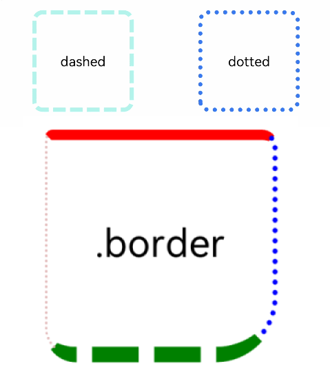
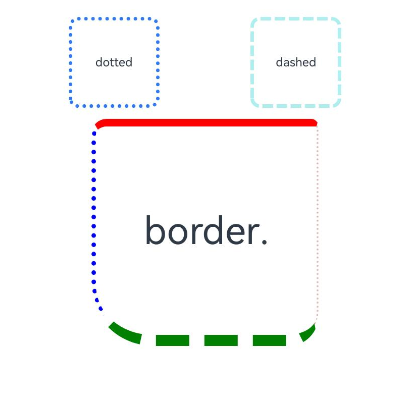

# Border Styling
<!--Kit: ArkUI-->
<!--Subsystem: ArkUI-->
<!--Owner: @zju_ljz-->
<!--Designer: @fenglinbailu-->
<!--Tester: @liuli0427-->
<!--Adviser: @Brilliantry_Rui-->
<!-- md-trans-meta sourceCommit=75a7d62c0702c21a06ca0119552a942305a023cc translatedAt=2026-09-01T12:18:36.361Z -->

The border attributes are used to set border styles for components.

> **NOTE**
>
> The initial APIs of this module are supported since API version 7. Updates will be marked with a superscript to indicate their earliest API version.
>

## border

border(value: BorderOptions): T

Sets the border.

**Widget capability**: This API can be used in ArkTS widgets since API version 9.

**Atomic service API**: This API can be used in atomic services since API version 11.

**System capability**: SystemCapability.ArkUI.ArkUI.Full

**Parameters**

| Name| Type                                   | Mandatory| Description                                                        |
| ------ | --------------------------------------- | ---- | ------------------------------------------------------------ |
| value  | [BorderOptions](./ts-types.md#borderoptions) | Yes  | Unified border style setting API.<br>**NOTE**<br>The default border width is 0, that is, no border is displayed. The default border corner radius is 0, that is, no corner radius is displayed. The default border color is Color.Black.<br>Since API version 9, the border of the parent node is displayed above the content of the child node.<br>When color and radius are not set, to ensure that [borderColor](#bordercolor) and [borderRadius](#borderradius) take effect, set [borderColor](#bordercolor) and [borderRadius](#borderradius) after [border](#border). |

**Return value**

| Type| Description|
| --- | --- |
|  T | Current component, used for chained calls. |


>  **NOTE**
>
>  When neither **color** nor **radius** is specified, set [borderColor](#bordercolor) and [borderRadius](#borderradius) after [border](#border) to ensure they take effect.

## borderStyle

borderStyle(value: BorderStyle | EdgeStyles): T

Sets the border style.

**Widget capability**: This API can be used in ArkTS widgets since API version 9.

**Atomic service API**: This API can be used in atomic services since API version 11.

**System capability**: SystemCapability.ArkUI.ArkUI.Full

**Parameters**

| Name| Type                                                        | Mandatory| Description                                              |
| ------ | ------------------------------------------------------------ | ---- | -------------------------------------------------- |
| value  | [BorderStyle](ts-appendix-enums.md#borderstyle)&nbsp;\|&nbsp;[EdgeStyles](./ts-types.md#edgestyles9)<sup>9+</sup> | Yes   | Element border style.<br>Default Value: BorderStyle.Solid |

**Return value**

| Type| Description|
| --- | --- |
|  T | Current component, used for chained calls. |

## borderWidth

borderWidth(value: Length | EdgeWidths | LocalizedEdgeWidths): T

Sets the border width.

**Widget capability**: This API can be used in ArkTS widgets since API version 9.

**Atomic service API**: This API can be used in atomic services since API version 11.

**System capability**: SystemCapability.ArkUI.ArkUI.Full

**Parameters**

| Name| Type                                                        | Mandatory| Description                              |
| ------ | ------------------------------------------------------------ | ---- | ---------------------------------- |
| value  | [Length](ts-types.md#length)&nbsp;\|&nbsp;[EdgeWidths](./ts-types.md#edgewidths9)<sup>9+</sup>&nbsp;\|&nbsp;[LocalizedEdgeWidths](./ts-types.md#localizededgewidths12)<sup>12+</sup> | Yes   | Sets the border width of the element. Percentage is not supported. Default unit: vp.<br>Default value: 0.<br>**Note:** When the LocalizedEdgeWidths type is used, the border width setting differs under different language directions. See Example 2. |

**Return value**

| Type| Description|
| --- | --- |
|  T | Current component, used for chained calls. |

## borderColor

borderColor(value: ResourceColor | EdgeColors | LocalizedEdgeColors): T

Sets the border color.

> **NOTE**
>
> When using border for unified setting of the border and the color parameteris omitted, borderColor must be called after border to take effect.

**Widget capability**: This API can be used in ArkTS widgets since API version 9.

**Atomic service API**: This API can be used in atomic services since API version 11.

**System capability**: SystemCapability.ArkUI.ArkUI.Full

**Parameters**

| Name| Type                                                        | Mandatory| Description                                        |
| ------ | ------------------------------------------------------------ | ---- | -------------------------------------------- |
| value  | [ResourceColor](ts-types.md#resourcecolor)&nbsp;\|&nbsp;[EdgeColors](./ts-types.md#edgecolors9)<sup>9+</sup>&nbsp;\|&nbsp;[LocalizedEdgeColors](./ts-types.md#localizededgecolors12)<sup>12+</sup> | Yes   | Sets the border color of the element. After setting, the border is displayed in the corresponding color.<br>Default value: Color.Black<br>**Note:** <br>When using the LocalizedEdgeColors type, the border color settings differ under different language directions. See Example 2. |

**Return value**

| Type| Description|
| --- | --- |
|  T | Current component, used for chained calls. |

## borderRadius

borderRadius(value: Length | BorderRadiuses | LocalizedBorderRadiuses): T

Sets the border radius.

> **NOTE**
>
> When using border for unified setting of the border and the radius parameteris omitted, borderRadius must be called after border to take effect.

**Widget capability**: This API can be used in ArkTS widgets since API version 9.

**Atomic service API**: This API can be used in atomic services since API version 11.

**System capability**: SystemCapability.ArkUI.ArkUI.Full

**Parameters**

| Name| Type                                                        | Mandatory| Description                                  |
| ------ | ------------------------------------------------------------ | ---- | -------------------------------------- |
| value  | [Length](ts-types.md#length)&nbsp;\|&nbsp;[BorderRadiuses](./ts-types.md#borderradiuses9)<sup>9+</sup>&nbsp;\|&nbsp;[LocalizedBorderRadiuses](./ts-types.md#localizedborderradiuses12)<sup>12+</sup> | Yes   | Element border corner radius. Percentage is supported, and the percentage is based on the component width. Default unit: vp.<br>Default value: 0. After the corner radius is set, you can use the [clip](./ts-universal-attributes-sharp-clipping.md#clip12) attribute to clip the component so that child components do not exceed the component itself.<br>**NOTE**<br>When the LocalizedBorderRadiuses type is used, the border corner radius settings differ under different language directions. See Also example 2.<br>Set Four different corner radii. If a corner radius exceeds half of the smaller value between the height and the width, the irregular corner radius is drawn differently by value ratio. See example 4 for the effect.|

**Return value**

| Type| Description|
| --- | --- |
|  T | Current component, used for chained calls. |

## borderRadius<sup>22+</sup>

borderRadius(value: Length | BorderRadiuses | LocalizedBorderRadiuses, type?: RenderStrategy): T

Sets the border corner radius and the rendering strategy for rounded corners.

> **NOTE**
>
> When using border for unified setting of the border and the radius parameteris omitted, borderRadius must be called after border to take effect.

**Widget capability**: This API can be used in ArkTS widgets since API version 22.

**Atomic service API**: This API can be used in atomic services since API version 22.

**Model restriction**: This API can be used only in the stage model.

**System capability**: SystemCapability.ArkUI.ArkUI.Full

**Parameters**

| Name| Type                                                        | Mandatory| Description                                  |
| ------ | ------------------------------------------------------------ | ---- | -------------------------------------- |
| value  | [Length](ts-types.md#length)&nbsp;\|&nbsp;[BorderRadiuses](./ts-types.md#borderradiuses9)&nbsp;\|&nbsp;[LocalizedBorderRadiuses](./ts-types.md#localizedborderradiuses12) | Yes   | Set the border corner radius of the element. Percentage is supported, and the percentage is based on the component width. Default unit: vp.<br>Default Value: 0. After the corner radius is set, you can use the [clip](./ts-universal-attributes-sharp-clipping.md#clip12) attribute to clip the component so that child components do not exceed the component itself.<br>**Note:** <br>When using the LocalizedBorderRadiuses type, the border corner radius settings differ under different language directions. See also example 2.<br>Set four different corner radius values. If a corner radius value exceeds half of the smaller value of the height and width, the irregular corner radius is drawn differently by value ratio. See example 4 for the effect.|
| type  | [RenderStrategy](ts-appendix-enums.md#renderstrategy22) | No   |Sets the mode for drawing the corner radius of the component.<br>Default Value: RenderStrategy.FAST.<br>Optional values:<br>- RenderStrategy.FAST: fast rendering mode, suitable for common corner radius scenarios with better performance. If the component contains complex visual effects such as blur, using this mode may cause abnormal corner radius clipping.<br>- RenderStrategy.OFFSCREEN: offscreen rendering mode, suitable for corner radius scenarios with complex visual effects such as blur. It can render the corner radius correctly but incurs higher performance overhead.|

**Return value**

| Type| Description|
| --- | --- |
|  T | Current component, used for chained calls. |

## Example

### Example 1: Setting Basic Styles

This example shows how to set the border width, color, border radius, and styles such as dotted or dashed lines.

```ts
// xxx.ets
@Entry
@Component
struct BorderExample {
  build() {
    Column() {
      Flex({ justifyContent: FlexAlign.SpaceAround, alignItems: ItemAlign.Center }) {
        // Dashed line.
        Text('dashed')
          .borderStyle(BorderStyle.Dashed)
          .borderWidth(5)
          .borderColor(0xAFEEEE)
          .borderRadius(10)
          .width(120)
          .height(120)
          .textAlign(TextAlign.Center)
          .fontSize(16)
        // Dotted border
        Text('dotted')
          .border({
            width: 5,
            color: 0x317AF7,
            radius: 10,
            style: BorderStyle.Dotted
          })
          .width(120)
          .height(120)
          .textAlign(TextAlign.Center)
          .fontSize(16)
      }.width('100%').height(150)

      Text('.border')
        .fontSize(50)
        .width(300)
        .height(300)
        // Use the border attribute to set the width, color, corner radius, and style of the left, right, top, and bottom edges respectively.
        .border({
          width: {
            left: 3,
            right: 6,
            top: 10,
            bottom: 15
          },
          color: {
            left: '#e3bbbb',
            right: Color.Blue,
            top: Color.Red,
            bottom: Color.Green
          },
          radius: {
            topLeft: 10,
            topRight: 20,
            bottomLeft: 40,
            bottomRight: 80
          },
          style: {
            left: BorderStyle.Dotted,
            right: BorderStyle.Dotted,
            top: BorderStyle.Solid,
            bottom: BorderStyle.Dashed
          }
        })
        .textAlign(TextAlign.Center)
    }
  }
}
```



### Example 2: Border Width, Corner Radius, and Color Types

The width, radius, and color attribute values of the border attribute use the LocalizedEdgeWidths, LocalizedBorderRadiuses, and LocalizedEdgeColors types, respectively.

```ts
// xxx.ets
import { LengthMetrics } from '@kit.ArkUI';

@Entry
@Component
struct BorderExample {
  build() {
    Column() {
      Flex({ justifyContent: FlexAlign.SpaceAround, alignItems: ItemAlign.Center }) {
        // Dashed line.
        Text('dashed')
          .borderStyle(BorderStyle.Dashed)
          .borderWidth(5)
          .borderColor(0xAFEEEE)
          .borderRadius(10)
          .width(120)
          .height(120)
          .textAlign(TextAlign.Center)
          .fontSize(16)
        // Dotted border
        Text('dotted')
          .border({
            width: 5,
            color: 0x317AF7,
            radius: 10,
            style: BorderStyle.Dotted
          })
          .width(120)
          .height(120)
          .textAlign(TextAlign.Center)
          .fontSize(16)
      }.width('100%').height(150)

      Text('.border')
        .fontSize(50)
        .width(300)
        .height(300)
        // Use the LocalizedEdgeWidths and LocalizedBorderRadiuses types to adapt the start/end directions to RTL/LTR layouts.
        .border({
          width: {
            start: LengthMetrics.vp(3),
            end: LengthMetrics.vp(6),
            top: LengthMetrics.vp(10),
            bottom: LengthMetrics.vp(15)
          },
          color: {
            start: '#e3bbbb',
            end: Color.Blue,
            top: Color.Red,
            bottom: Color.Green
          },
          radius: {
            topStart: LengthMetrics.vp(10),
            topEnd: LengthMetrics.vp(20),
            bottomStart: LengthMetrics.vp(40),
            bottomEnd: LengthMetrics.vp(80)
          },
          style: {
            left: BorderStyle.Dotted,
            right: BorderStyle.Dotted,
            top: BorderStyle.Solid,
            bottom: BorderStyle.Dashed
          }
        })
        .textAlign(TextAlign.Center)
    }
  }
}
```

Example image for left-to-right (LTR) display languages


Example image for right-to-left (RTL) display languages



### Example 3: Configuring Offscreen Rounded Corners

This example demonstrates how to set the rendering strategy for drawing rounded corners on components, supported since API version 22.

```ts
// xxx.ets
@Entry
@Component
struct RenderStrategyExample {
  build() {
    NavDestination() {
      Column({ space: 20 }) {
        // Fast rendering mode: suitable for regular corner radius scenarios, with better performance.
        Stack() {
          Column()
            .width(320)
            .height(320)
            .backgroundColor(Color.Black)

          Stack() {
            Stack() {
              Scroll(new Scroller()) {
                Image($r('app.media.startIcon'))
                  .width('100%')
                  .height('200%')
              }

              Column()
                .blur(50) // Set the blur effect.
                .width(300)
                .height(100)
                .position({ x: 0, y: 0 })
            }
          }
          .width(300)
          .height(300)
          .backgroundColor(Color.Pink)
          .borderRadius(50, RenderStrategy.FAST) // Set the corner radius in fast rendering mode.
          .clip(true)
        }

        // Offscreen rendering mode: suitable for corner radius scenarios with blur effects, avoiding clipping anomalies.
        Stack() {
          Column()
            .width(320)
            .height(320)
            .backgroundColor(Color.Black)

          Stack() {
            Stack() {
              Scroll(new Scroller()) {
                Image($r('app.media.startIcon'))
                  .width('100%')
                  .height('200%')
              }

              Column()
                .blur(50) // Set the blur effect.
                .width(300)
                .height(100)
                .position({ x: 0, y: 0 })
            }
          }
          .width(300)
          .height(300)
          .backgroundColor(Color.Pink)
          .borderRadius(50, RenderStrategy.OFFSCREEN) // Set the corner radius in offscreen rendering mode.
          .clip(true)
        }
      }
    }
    .width('100%')
    .height('100%')
  }
}
```

The fast rendering mode (RenderStrategy.FAST) performs real-time rendering through GPU hardware acceleration and is suitable for common corner radius scenarios. The offscreen rendering mode (RenderStrategy.OFFSCREEN) first draws the component to an offscreen buffer and then composites it, which is suitable for corner radius scenarios involving complex content such as blur and scrolling, and can avoid corner radius clipping anomalies. The following illustration compares the online rendering mode (top) with the offscreen rendering mode (bottom):


### Example 4: Setting Irregular Corner Radii

This example uses [borderRadius](#borderradius) to set four different corner radius values. When one of the corner radius values exceeds half of the smaller value of the height or width, the irregular corner radius is drawn by value ratio.

```ts
// xxx.ets
@Entry
@Component
struct BorderExample {
  build() {
    Column() {
      Flex({ justifyContent: FlexAlign.SpaceAround, alignItems: ItemAlign.Center }) {
        Text('Text')
          .borderWidth(5)
          .borderColor(0xAFEEEE)
          // topLeft: 2000 exceeds half of the minimum value (100), draw the irregular corner radius by value ratio.
          .borderRadius({
            topLeft: 2000,
            topRight: 10,
            bottomLeft: 30,
            bottomRight: 50
          })
          .width(100)
          .height(100)
          .textAlign(TextAlign.Center)
          .fontSize(16)
      }
    }
  }
}
```

