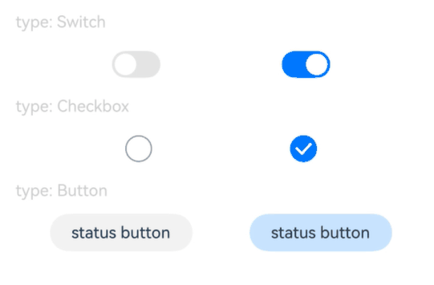

# Click Feedback Effect
<!--Kit: ArkUI-->
<!--Subsystem: ArkUI-->
<!--Owner: @hehongyang3-->
<!--Designer: @hehongyang3-->
<!--Tester: @lxl007-->
<!--Adviser: @Brilliantry_Rui-->
<!-- md-trans-meta sourceCommit=39ca26def5c22dc659f3dc0b76ef62a29421e77a translatedAt=2026-09-01T12:17:43.383Z -->

Sets the click bounce effect of the component.

>  **NOTE**
>
> - This feature is supported since API version 10. Updates will be marked with a superscript to indicate their earliest API version.
>
> - The APIs of this module can be used only in the stage model.

## clickEffect

clickEffect(value: ClickEffect \| null): T

Sets the click bounce effect of the current component. The intensity level of the click bounce effect determines the scaling amplitude during the bounce.

**Atomic service API**: This API can be used in atomic services since API version 11.

**System capability**: SystemCapability.ArkUI.ArkUI.Full

**Parameters**

| Name| Type                                                 | Mandatory| Description                                                        |
| ------ | ----------------------------------------------------- | ---- | ------------------------------------------------------------ |
| value  | [ClickEffect](#clickeffect)&nbsp;\|&nbsp;null | Yes   | Sets the click bounce effect of the current component.<br>**Note:**<br>You can pass null to cancel the click bounce effect.<br>It is not recommended to use this feature in scenarios where the component size changes dynamically, as it may cause abnormal bounce effects.<br>When the component cannot trigger universal events (such as the [click event](ts-universal-events-click.md)), this attribute is not supported.<br>After the bounce triggers scaling, the touch point may no longer be on the component, and the component cannot respond to gesture events. |

**Return value**

| Type  | Description                    |
| ------ | ------------------------ |
| T | Current component, used for chained calls. |

## clickEffect<sup>18+</sup>

clickEffect(effect: Optional\<ClickEffect \| null>): T

Sets the click bounce effect of the current component. Compared with [clickEffect](#clickeffect), this API adds support for the undefined type. The intensity level of the click bounce effect determines the scaling amplitude during the bounce.

**Atomic service API**: This API can be used in atomic services since API version 18.

**System capability**: SystemCapability.ArkUI.ArkUI.Full

**Parameters**

| Name| Type                                                        | Mandatory| Description                                                        |
| ------ | ------------------------------------------------------------ | ---- | ------------------------------------------------------------ |
| effect | [Optional](ts-universal-attributes-custom-property.md#optionalt)\<[ClickEffect](#clickeffect)&nbsp;\|&nbsp;null> | Yes | Level of the click bounce effect, used to control the intensity of the bounce.<br>**Note:**<br>You can cancel the click bounce effect by setting this parameter to undefined or null.<br>It is not recommended to use this feature in scenarios where the component size changes dynamically.<br>This attribute is not supported when the component cannot trigger universal events (such as the [click event](ts-universal-events-click.md)). Specifically, in scenarios where the component is set to the disabled state, is invisible, or is covered by other components, universal events cannot be triggered, and the clickEffect attribute does not take effect.<br>After the bounce triggers scaling, the touch point may no longer be on the component, and the component cannot respond to gesture events. |

**Return value**

| Type  | Description                    |
| ------ | ------------------------ |
| T | Current component, used for chained calls. |

## ClickEffect

Defines the click bounce effect.

**Atomic service API**: This API can be used in atomic services since API version 11.

**System capability**: SystemCapability.ArkUI.ArkUI.Full

| Name | Type                                                 | Read-Only   | Optional  |  Description                                                        |
| ----- | ----------------------------------------------------------- | ---- | --------- | --------------------------------------------------------- |
| level | [ClickEffectLevel](ts-appendix-enums.md#clickeffectlevel10) | No   | No  |Level of the click bounce effect. Its value affects the default scale ratio.<br>Default value: ClickEffectLevel.LIGHT<br>**Note:**<br>When level is undefined or null, ClickEffect uses the bounce effect corresponding to ClickEffectLevel.LIGHT. For the specific default scale ratio, see the description of the scale attribute below.  |
| scale | number                                                      | No   | Yes  |Bounce scale ratio, in the range (0, 1]. It supports fine-tuning based on the set ClickEffectLevel. If the value is out of range, the default scale ratio corresponding to the current level is used.<br>**Note:**<br>When level is ClickEffectLevel.LIGHT, the default value is 0.90.<br>When level is ClickEffectLevel.MIDDLE or ClickEffectLevel.HEAVY, the default value is 0.95.<br>When level is undefined or null, level is ClickEffectLevel.LIGHT and the default value is 0.90.<br>When scale is undefined or null, the default scale ratio corresponding to the current level is used. |

## Example

This example demonstrates the click feedback effects on different types of components.

```ts
// xxx.ets
@Entry
@Component
struct ToggleExample {
  build() {
    Column({ space: 10 }) {
      Text('type: Switch').fontSize(12).fontColor(0xcccccc).width('90%')
      Flex({ justifyContent: FlexAlign.SpaceEvenly, alignItems: ItemAlign.Center }) {
        Toggle({ type: ToggleType.Switch, isOn: false })
          .clickEffect({ level: ClickEffectLevel.LIGHT })
          .selectedColor('#007DFF')
          .switchPointColor('#FFFFFF')
          .onChange((isOn: boolean) => {
            console.info('Component status:' + isOn);
          })

        Toggle({ type: ToggleType.Switch, isOn: true })
          .clickEffect({ level: ClickEffectLevel.LIGHT, scale: 0.5 })
          .selectedColor('#007DFF')
          .switchPointColor('#FFFFFF')
          .onChange((isOn: boolean) => {
            console.info('Component status:' + isOn);
          })
      }

      Text('type: Checkbox').fontSize(12).fontColor(0xcccccc).width('90%')
      Flex({ justifyContent: FlexAlign.SpaceEvenly, alignItems: ItemAlign.Center }) {
        Toggle({ type: ToggleType.Checkbox, isOn: false })
          .clickEffect({ level: ClickEffectLevel.MIDDLE })
          .size({ width: 20, height: 20 })
          .selectedColor('#007DFF')
          .onChange((isOn: boolean) => {
            console.info('Component status:' + isOn);
          })

        Toggle({ type: ToggleType.Checkbox, isOn: true })
          .clickEffect({ level: ClickEffectLevel.MIDDLE, scale: 0.5 })
          .size({ width: 20, height: 20 })
          .selectedColor('#007DFF')
          .onChange((isOn: boolean) => {
            console.info('Component status:' + isOn);
          })
      }

      Text('type: Button').fontSize(12).fontColor(0xcccccc).width('90%')
      Flex({ justifyContent: FlexAlign.SpaceEvenly, alignItems: ItemAlign.Center }) {
        Toggle({ type: ToggleType.Button, isOn: false }) {
          Text('status button').fontColor('#182431').fontSize(12)
        }.width(106)
        .clickEffect({ level: ClickEffectLevel.HEAVY })
        .selectedColor('rgba(0,125,255,0.20)')
        .onChange((isOn: boolean) => {
          console.info('Component status:' + isOn);
        })

        Toggle({ type: ToggleType.Button, isOn: true }) {
          Text('status button').fontColor('#182431').fontSize(12)
        }.width(106)
        .clickEffect({ level: ClickEffectLevel.HEAVY, scale: 0.5 })
        .selectedColor('rgba(0,125,255,0.20)')
        .onChange((isOn: boolean) => {
          console.info('Component status:' + isOn);
        })
      }
    }.width('100%').padding(24)
  }
}
```

