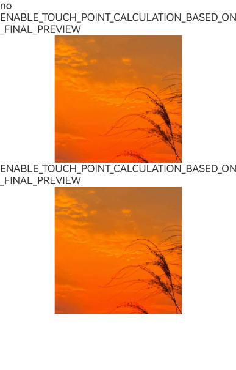
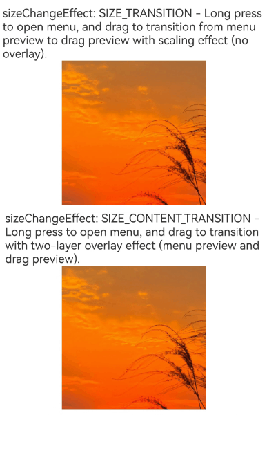
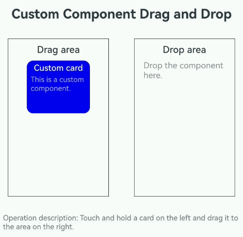

# Drag and Drop Control
<!--Kit: ArkUI-->
<!--Subsystem: ArkUI-->
<!--Owner: @yihao-lin-->
<!--Designer: @piggyguy-->
<!--Tester: @songyanhong-->
<!--Adviser: @Brilliantry_Rui-->
<!-- md-trans-meta sourceCommit=9430c77017ca73641537d932a3d7d8a4c99c078b translatedAt=2026-09-01T12:28:49.504Z -->

Components provide attributes and APIs to configure their response to drag events and influence system handling of drag operations, including drag enablement settings, data types, preview image styles, and interaction effects.

> **NOTE**
>
> - The initial APIs of this module are supported since API version 10. Updates will be marked with a superscript to indicate their earliest API version.
>
> - The APIs of this module can be used only in the stage model.

The ArkUI framework provides default drag and drop capabilities for the following components, allowing them to serve as the drag source (from which data can be dragged) or drop target (to which data can be dropped). You can also define drag responses by implementing common drag events.

- The following components support drag actions by default (data can be dragged out of them): [Search](ts-basic-components-search.md), [TextInput](ts-basic-components-textinput.md), [TextArea](ts-basic-components-textarea.md), [RichEditor](ts-basic-components-richeditor.md), [Text](ts-basic-components-text.md), [Image](ts-basic-components-image.md), [Hyperlink](ts-container-hyperlink.md). Developers can control the use of the default drag capability by setting the [draggable](#draggable) attribute of these components.

- The following components support drop actions by default (the target component can respond to dropped data): [Search](ts-basic-components-search.md), [TextInput](ts-basic-components-textinput.md), [TextArea](ts-basic-components-textarea.md), [RichEditor](ts-basic-components-richeditor.md). Developers can disable the default drop capability by setting the [allowDrop](#allowdrop) attribute of these components to null.

- The following components do not support drag actions: [ArcScrollBar](./ts-basic-components-arcscrollbar.md), [MultiNavigation](./ohos-arkui-advanced-MultiNavigation.md), [ToolBarItem](./ts-basic-components-toolbaritem.md), [ArcSlider](./ohos-arkui-advanced-ArcSlider.md), [Span](./ts-basic-components-span.md), [ImageSpan](./ts-basic-components-imagespan.md), [ContainerSpan](./ts-basic-components-containerspan.md), [SymbolSpan](./ts-basic-components-symbolSpan.md), [ArcAlphabetIndexer](./ts-container-arc-alphabet-indexer.md), [OffscreenCanvas](./ts-components-offscreencanvas.md), [Menu](./ts-basic-components-menu.md), [MenuItem](./ts-basic-components-menuitem.md), [MenuItemGroup](./ts-basic-components-menuitemgroup.md), [PasteButton](./ts-security-components-pastebutton.md), [SaveButton](./ts-security-components-savebutton.md), [WithTheme](./ts-container-with-theme.md), [NavPushPathHelper](./ohos-atomicservice-NavPushPathHelper.md), [ContentSlot](./ts-components-contentSlot.md), [Chip](./ohos-arkui-advanced-Chip.md), [ExceptionPrompt](./ohos-arkui-advanced-ExceptionPrompt.md), [Filter](./ohos-arkui-advanced-Filter.md), [FormMenu](./ohos-arkui-advanced-formmenu.md), [Popup](./ohos-arkui-advanced-Popup.md), [SelectionMenu](./ohos-arkui-advanced-SelectionMenu.md), [SplitLayout](./ohos-arkui-advanced-SplitLayout.md), and all popup window components.

<!--RP1--><!--RP1End-->
To enable drag and drop for other components, you need to set the **draggable** attribute to **true** and implement data encapsulation and transmission in APIs such as [onDragStart](./ts-universal-events-drag-drop.md#ondragstart) to correctly handle drag operations.

> **NOTE**
>
> When using the **Text** component for dragging, set [copyOption](ts-basic-components-text.md#copyoption9) to **CopyOptions.InApp** or **CopyOptions.LocalDevice** to enable text dragging.

## allowDrop

allowDrop(value: Array&lt;UniformDataType&gt; | null | Array&lt;string&gt;): T

Sets the data types allowed to be dropped on this component. If **allowDrop** is not set, the component accepts all data types by default. If **allowDrop** is set, only dropped data that matches the specified data types is allowed to be dropped on this component; data that does not match the specified data types is rejected and does not trigger the [onDrop](./ts-universal-events-drag-drop.md#ondrop) event.

**Atomic service API**: This API can be used in atomic services since API version 11.

**System capability**: SystemCapability.ArkUI.ArkUI.Full

**Parameters**

| Name| Type                                                        | Mandatory| Description                                           |
| ------ | ------------------------------------------------------------ | ---- | ----------------------------------------------- |
| value  | Array\<[UniformDataType](#uniformdatatype)> \| null<sup>12+</sup> \| Array\<string><sup>23+</sup> | Yes   | Sets the data types allowed to be dropped on this component. Since API version 12, null can be set so that this component does not accept any data type. Since API version 23, custom data types Array\<string> can be set. A custom data type is a data type string defined by the application. The string has no explicit format requirements, but it should not duplicate the standard type format of UniformDataType to avoid confusion with standard types. It is recommended to define it based on the principle of being easy to remember and distinguish. |

**Return value**

| Type| Description|
| -------- | -------- |
| T | Current component, which can be used for chained calls. |

## draggable

draggable(value: boolean): T

Sets whether the component is draggable. By default, the component is not draggable.

**Atomic service API**: This API can be used in atomic services since API version 11.

**System capability**: SystemCapability.ArkUI.ArkUI.Full

**Parameters**

| Name| Type   | Mandatory| Description                                          |
| ------ | ------- | ---- | ---------------------------------------------- |
| value  | boolean | Yes  | Whether the component is draggable. <br>**true**: The component is draggable.<br>**false**: The component is not draggable.|

**Return value**

| Type| Description|
| -------- | -------- |
| T | Current component, which can be used for chained calls. |

## dragPreview<sup>11+</sup>

dragPreview(value: CustomBuilder | DragItemInfo | string): T

Sets the preview image displayed during component drag operations.

> **NOTE**
>
> When this API is called in [attributeModifier](ts-universal-attributes-attribute-modifier.md#attributemodifier), passing a value of the [CustomBuilder](ts-types.md#custombuilder8) type to the **preview** parameter is not supported, nor is setting the **builder** field in [DragItemInfo](ts-universal-events-drag-drop.md#dragiteminfo).

**Atomic service API**: This API can be used in atomic services since API version 12.

**System capability**: SystemCapability.ArkUI.ArkUI.Full

**Parameters**

| Name| Type                                                        | Mandatory| Description                                                        |
| ------ | ------------------------------------------------------------ | ---- | ------------------------------------------------------------ |
| value  | [CustomBuilder](ts-types.md#custombuilder8)&nbsp;\|&nbsp;[DragItemInfo](ts-universal-events-drag-drop.md#dragiteminfo) \| string<sup>12+</sup> | Yes   | Sets the preview image of the component during the float and drag process. This parameter is valid only in the [onDragStart](ts-universal-events-drag-drop.md#ondragstart) drag mode.<br>When the component supports drag and the preview image of [bindContextMenu](ts-universal-attributes-menu.md#bindcontextmenu8) is set simultaneously, the preview image for long press float is determined by the preview image set in [bindContextMenu](ts-universal-attributes-menu.md#bindcontextmenu8). The backdrop image returned by the developer in [onDragStart](ts-universal-events-drag-drop.md#ondragstart) has a lower priority than the preview image set in [dragPreview](#dragpreview11). When the [dragPreview](#dragpreview11) preview image is set, the backdrop image during the drag process uses the [dragPreview](#dragpreview11) preview image. Since [CustomBuilder](ts-types.md#custombuilder8) can be used only after offline rendering, it incurs certain performance overhead and latency. It is recommended to preferentially use the [PixelMap](../../apis-image-kit/arkts-apis-image-PixelMap.md) method in [DragItemInfo](ts-universal-events-drag-drop.md#dragiteminfo).<br> When an ID of the string type is passed in, the screenshot of the component corresponding to the ID is used as the preview image. If the component corresponding to the ID cannot be found, or if the [Visibility](ts-appendix-enums.md#visibility) attribute of the component corresponding to the ID is set to None or Hidden, a screenshot of the component itself is taken as the drag preview image. Currently, the screenshot does not contain visual effects such as brightness, shadow, blur, and rotation.|

**Return value**

| Type| Description|
| -------- | -------- |
| T | Current component, which can be used for chained calls. |

## dragPreview<sup>15+</sup>

dragPreview(preview: CustomBuilder | DragItemInfo | string, config?: PreviewConfiguration):T

Sets the preview image displayed during the component float and drag process. The **config** parameter can be used to configure whether the preview image is used only for the float effect and whether its creation is delayed.

> **NOTE**
>
> When this API is called in [attributeModifier](ts-universal-attributes-attribute-modifier.md#attributemodifier), passing a value of the [CustomBuilder](ts-types.md#custombuilder8) type to the **preview** parameter is not supported, nor is setting the **builder** field in [DragItemInfo](ts-universal-events-drag-drop.md#dragiteminfo).

**Atomic service API**: This API can be used in atomic services since API version 15.

**System capability**: SystemCapability.ArkUI.ArkUI.Full

**Parameters**

| Name| Type                                                        | Mandatory| Description                                                        |
| ------ | ------------------------------------------------------------ | ---- | ------------------------------------------------------------ |
| preview  | [CustomBuilder](ts-types.md#custombuilder8)&nbsp;\|&nbsp;[DragItemInfo](ts-universal-events-drag-drop.md#dragiteminfo) \| string | Yes   | Sets the preview image during the component float and drag process. This parameter takes effect only in the [onDragStart](ts-universal-events-drag-drop.md#ondragstart) drag mode.<br>When the component supports drag and the preview image of [bindContextMenu](ts-universal-attributes-menu.md#bindcontextmenu8) is set at the same time, the preview image for long press float is determined by the preview image set by [bindContextMenu](ts-universal-attributes-menu.md#bindcontextmenu8). The backdrop image returned by the developer in [onDragStart](ts-universal-events-drag-drop.md#ondragstart) has a lower priority than the preview image set by [dragPreview](#dragpreview11). When the [dragPreview](#dragpreview11) preview image is set, the backdrop image during the drag process uses the [dragPreview](#dragpreview11) preview image. Because [CustomBuilder](ts-types.md#custombuilder8) can be used only after offline rendering, it increases the performance overhead and latency of preview image generation. It is recommended to use the [PixelMap](../../apis-image-kit/arkts-apis-image-PixelMap.md) method in [DragItemInfo](ts-universal-events-drag-drop.md#dragiteminfo).<br> When an ID of the string type is passed in, the screenshot of the component corresponding to the ID is used as the preview image. If the component corresponding to the ID cannot be found, or the [Visibility](ts-appendix-enums.md#visibility) attribute of the component corresponding to the ID is set to None or Hidden, a screenshot of the component itself is taken as the drag preview image. Currently, the screenshot does not contain visual effects such as brightness, shadow, blur, and rotation.|
| config | [PreviewConfiguration](ts-universal-events-drag-drop.md#previewconfiguration15) | No | Configures the preview image during the custom drag process. This parameter takes effect only for the preview in [dragPreview](#dragpreview15). Pass this parameter when you need to configure custom preview behaviors such as whether the preview image is used only for the float effect and whether to delay creation. If this parameter is not passed, the system default drag preview behavior is used, that is, the preview image is not restricted to the float effect only and is not created with a delay.|

**Return value**

| Type| Description|
| -------- | -------- |
| T | Current component, which can be used for chained calls. |

## dragPreviewOptions<sup>11+</sup>

dragPreviewOptions(value: DragPreviewOptions, options?: DragInteractionOptions): T

Sets the preview image processing mode, the display of the number badge, and the interaction mode of preview image floating during the drag process. Dragging a GridItem through the Grid [onItemDragStart](ts-container-grid.md#onitemdragstart8) and dragging a ListItem through the List [onItemDragStart](ts-container-list.md#onitemdragstart8) are not supported.

> **NOTE**
>
> This API can be called within [attributeModifier](ts-universal-attributes-attribute-modifier.md#attributemodifier) since API version 20.

**Atomic service API**: This API can be used in atomic services since API version 12.

**System capability**: SystemCapability.ArkUI.ArkUI.Full

**Parameters**

| Name| Type                                                           | Mandatory| Description                                                        |
| ------ | -------------------------------------------------------------- | ---- | ------------------------------------------------------------ |
| value  | [DragPreviewOptions](#dragpreviewoptions11-1)<sup>11+</sup>      | Yes   | Sets the preview image handling mode, number badge display, backdrop image style, and the transition effect between float and drag preview images during the drag process.|
| options<sup>12+</sup>| [DragInteractionOptions](#draginteractionoptions12)<sup>12+</sup>| No   | Sets the interaction mode for the preview image float during the drag process. Pass this parameter when interaction capabilities such as multi-selection aggregation, default tap effect, disabling float, edge auto-scrolling, or vibration feedback need to be enabled. If this parameter is not passed, the drag interaction is handled according to the default values of the fields in [DragInteractionOptions](#draginteractionoptions12).|

**Return value**

| Type| Description|
| -------- | -------- |
| T | Current component, which can be used for chained calls. |

## DragPreviewOptions<sup>11+</sup>

Sets the preview image processing mode, the display of the number badge, the backdrop image style, and the transition effect during the drag process.

**System capability**: SystemCapability.ArkUI.ArkUI.Full

<!--Table: 20%; 27%; 8%; 8%; 37%-->
| Name | Type | Read-Only | Optional | Description |
| -------- | -------- | -------- | -------- | --- |
| mode | [DragPreviewMode](#dragpreviewmode11) \| Array<[DragPreviewMode](#dragpreviewmode11)><sup>12+</sup> | No | Yes | Indicates the preview image processing mode during dragging.<br>Default value: DragPreviewMode.AUTO<br>When a component has both DragPreviewMode.AUTO and other enumeration values set at the same time, DragPreviewMode.AUTO takes effect, and the settings of the other enumeration values do not take effect.<br>**Atomic service API:** Since API version 12, this API is supported in atomic services. |
| numberBadge<sup>12+</sup> | boolean \| number | No | Yes | Controls whether the count badge is displayed, or forcibly sets the displayed count. When set to true, the badge is displayed and the actual number of dragged objects is used. When set to false, the badge is not displayed. When set to a number value, the badge forcibly displays the specified count. When setting the count badge, the value range is [0, 2<sup>31</sup>-1]; values outside this range are processed as the default value true. When set to a floating-point number, only the integer part is displayed.<br>**Note:** <br>In multi-select drag scenarios, use this API to set the number of dragged objects.<br>Default value: true.<br>**Atomic service API:** Since API version 12, this API is supported in atomic services. |
| modifier<sup>12+</sup> | [ImageModifier](#imagemodifier12) | No | Yes | Used to configure the style Modifier object of the drag backdrop image. You can use the attributes and styles supported by the image component to configure the backdrop image style (see Example 6). Currently, opacity, shadow, background blur, rounded corners, and material effects are supported. Text drag supports only the default effect and does not support customization through modifier.<br>1. Opacity.<br>Set the opacity through [opacity](ts-universal-attributes-opacity.md#opacity). The value range of opacity is [0, 1]. When set to 0 or not set, the default backdrop image opacity 0.95 is used. When set to 1 or a value outside the range, the image is opaque.<br>2. Shadow.<br>Set the shadow through [shadow](ts-universal-attributes-image-effect.md#shadow).<br>3. Background blur.<br>Set the background blur through [backgroundEffect](ts-universal-attributes-background.md#backgroundeffect11) or [backgroundBlurStyle](ts-universal-attributes-background.md#backgroundblurstyle9). If both are set, the attribute set later takes effect.<br>4. Rounded corners.<br>Set the rounded corners through [border](ts-universal-attributes-border.md#border) or [borderRadius](ts-universal-attributes-border.md#borderradius). When rounded corners are set in both mode and modifier, the rounded corners set in mode have a lower display priority than those set in modifier.<br>5. Material effect, supported since API version 26.0.0.<br>Set the system material effect through [systemMaterial](ts-universal-attributes-image-effect.md#systemmaterial).<br>Default value: empty, meaning no style is set for the drag backdrop image.<br>**Atomic service API:** Since API version 12, this API is supported in atomic services.<br>**Note:** <br>1. If a node has background blur or material effect set, using it directly as the drag preview causes the screenshot to include these effects, conflicting with the drag modifier attribute. It is recommended to use [dragPreview](#dragpreview11) to customize a preview that does not include background blur and material effects.<br>2. The [colorInvert](../arkts-apis-uimaterial.md#immersiveoptions) parameter of [ImmersiveMaterial](../arkts-apis-uimaterial.md#immersivematerial) does not take effect during dragging. |
| sizeChangeEffect<sup>19+</sup> | [DraggingSizeChangeEffect](#draggingsizechangeeffect19)<sup>19+</sup> | No | Yes | Used to select the transition effect between the long-press floating image and the drag preview image.<br>Default value: DraggingSizeChangeEffect.DEFAULT.<br>**Atomic service API:** Since API version 19, this API is supported in atomic services. |

## DragPreviewMode<sup>11+</sup>

Sets the display mode of the drag preview.

**System capability**: SystemCapability.ArkUI.ArkUI.Full

| Name| Value| Description|
| -------- | ------- | -------- |
| AUTO  | 1 | The system automatically changes the follow-finger point position based on the drag scenario and automatically scales the drag backdrop image.<br>**Atomic service API:** Since API version 12, this API is supported in atomic services. |
| DISABLE_SCALE  | 2 | Disables the system scaling behavior on the drag backdrop image. Applicable to scenarios where the original size of the drag preview image needs to be maintained and automatic system scaling is not desired, such as precise-size dragging or custom preview image size control.<br>**Atomic service API:** Since API version 12, this API is supported in atomic services. |
| ENABLE_DEFAULT_SHADOW<sup>12+</sup> | 3 | Enables the default shadow effect for non-text components. Applicable to scenarios where visual hierarchy needs to be added to the drag preview image and the recognizability of the dragged object needs to be improved.<br>**Atomic service API:** Since API version 12, this API is supported in atomic services. |
| ENABLE_DEFAULT_RADIUS<sup>12+</sup> | 4 | Enables the unified corner radius effect for non-text components. Applicable to scenarios where a consistent rounded-corner appearance needs to be provided for the drag preview image. The default value is 12vp. When the corner radius set by the application itself is greater than the default value or the corner radius set by the modifier, the application's custom corner radius effect is displayed.<br>**Atomic service API:** Since API version 12, this API is supported in atomic services. |
| ENABLE_DRAG_ITEM_GRAY_EFFECT<sup>18+</sup> | 5 | Enables the gray-out (opacity) effect for the original dragged object. This effect does not take effect for text content dragging. When the user lifts the object, the original object displays the gray-out effect; when released, the original object restores its original effect. After the default gray-out effect is enabled, it is not recommended to modify the opacity after dragging starts. If the developer modifies the application opacity after dragging is initiated, the gray-out effect will be overwritten, and the original opacity effect cannot be correctly restored when dragging ends.<br>**Atomic service API:** Since API version 18, this API is supported in atomic services. |
| ENABLE_MULTI_TILE_EFFECT<sup>18+</sup> | 6 | Enables the effect of not clustering multiple selected objects during mouse dragging. This effect does not take effect for text content dragging. Each drag image is displayed at a position relative to its original position. This parameter takes effect only when multiple [GridItem](./ts-container-griditem.md) or [ListItem](./ts-container-listitem.md) are selected and isMultiSelectionEnabled is true. The non-clustering effect has a higher priority than [dragPreview](#draggingsizechangeeffect19). Secondary dragging, corner radius, and scaling settings are not supported.<br>**Atomic service API:** Since API version 18, this API is supported in atomic services. |
| ENABLE_TOUCH_POINT_CALCULATION_BASED_ON_FINAL_PREVIEW<sup>19+</sup> | 7 | Enables calculation of the follow-finger point position based on the original size of the final drag preview image before scaling. Used when the long press float image and the drag preview image are inconsistent. This does not take effect for mouse dragging when DragPreviewMode.ENABLE_MULTI_TILE_EFFECT is set.<br>**Atomic service API:** Since API version 19, this API is supported in atomic services. |

## DraggingSizeChangeEffect<sup>19+</sup>

Enumerates the transition effects for switching between the floating image (set through [bindContextMenu](ts-universal-attributes-menu.md#bindcontextmenu12)) and the drag preview when both are configured on a component.

**Atomic service API**: This API can be used in atomic services since API version 19.

**System capability**: SystemCapability.ArkUI.ArkUI.Full

| Name| Value| Description|
| -------- | ------- | -------- |
| DEFAULT | 0 | Direct transition from the menu preview to the final drag preview image upon drag initiation.|
| SIZE_TRANSITION | 1 | Smooth size transition from the menu preview to the final drag preview. Disabled when **DISABLE_SCALE** is set in [DragPreviewMode](#dragpreviewmode11). Used when the floating preview matches the drag preview.|
| SIZE_CONTENT_TRANSITION | 2 | Gradual transition from the menu preview to the final drag preview with opacity and size animations. Disabled when **DISABLE_SCALE** is set in [DragPreviewMode](#dragpreviewmode11). Suitable for significant visual differences between preview images.|


## DragInteractionOptions<sup>12+</sup>

**System capability**: SystemCapability.ArkUI.ArkUI.Full

<!--Table: 25%; 15%; 8%; 8%; 44%-->
| Name| Type| Read-Only| Optional| Description|
| -------- | -------- | -------- | -------- | ---- |
| isMultiSelectionEnabled | boolean | No | Yes | Indicates whether the backdrop image supports the multi-select aggregation effect during the drag process. The value **true** means the multi-select aggregation effect is supported, and **false** means the opposite. This parameter takes effect only for the [GridItem](ts-container-griditem.md) component in the [Grid](ts-container-grid.md) component and the [ListItem](ts-container-listitem.md) component in the [List](ts-container-list.md) component.<br>When an item component is set to multi-select drag, its child components cannot be dragged. The priority of the preview image set for the aggregated components is the string in [dragPreview](#dragpreviewmode11), the PixelMap in dragPreview, and the component self-screenshot, in descending order. The Builder form in dragPreview is not supported.<br>The mode in which the **isShown** parameter exists in [bindContextMenu](ts-universal-attributes-menu.md#bindcontextmenu12) bound to the component is not supported.<br>Default value: **false**<br>**Atomic Service API:** This API is supported in atomic services since API version 12. |
| defaultAnimationBeforeLifting | boolean | No | Yes | Indicates whether to enable the default tap effect (shrinking) of the component itself during the long press float phase. The value **true** means the default tap effect is enabled, and **false** means the opposite.<br>Default value: **false**<br>**Atomic Service API:** This API is supported in atomic services since API version 12. |
| isLiftingDisabled<sup>15+</sup> | boolean | No | Yes | Indicates whether to disable the float effect during long press drag. The value **true** means the float effect is disabled, and **false** means the opposite.<br>If this parameter is set to **true**, when the component supports drag and [bindContextMenu](ts-universal-attributes-menu.md#bindcontextmenu8) is set at the same time, only the configured custom menu preview is displayed.<br>Default value: **false**<br>**Atomic Service API:** This API is supported in atomic services since API version 15. |
| enableEdgeAutoScroll<sup>18+</sup> | boolean | No | Yes | Sets whether to trigger automatic scrolling when dragging to the edge of a scrollable component. The value **true** means automatic scrolling is triggered, and **false** means the opposite.<br>Default value: **true**<br>**Atomic Service API:** This API is supported in atomic services since API version 18. |
| enableHapticFeedback<sup>18+</sup> | boolean | No | Yes | Indicates whether to enable vibration during drag. The value **true** means vibration is enabled, and **false** means the opposite. This takes effect only in the preview scenario with a mask (through [bindContextMenu](ts-universal-attributes-menu.md#bindcontextmenu12)).<br>**Note:** This takes effect only when the application has the **ohos.permission.VIBRATE** permission and the user has enabled haptic feedback.<br>Default value: **false**<br>**Atomic Service API:** This API is supported in atomic services since API version 18. |

## UniformDataType

type UniformDataType = import('../api/@ohos.data.uniformTypeDescriptor').default.UniformDataType

Defines the uniform data type.

**Atomic service API**: This API can be used in atomic services since API version 11.

**System capability**: SystemCapability.ArkUI.ArkUI.Full

| Type| Description|
| ----- | ----------------- |
| import('../api/@ohos.data.uniformTypeDescriptor').default.[UniformDataType](../../apis-arkdata/js-apis-data-uniformTypeDescriptor.md#uniformdatatype) | Standardized data type. |

## ImageModifier<sup>12+</sup>

type ImageModifier = import('../api/arkui/ImageModifier').ImageModifier

Defines the image component modifier.

**Atomic service API**: This API can be used in atomic services since API version 12.

**System capability**: SystemCapability.ArkUI.ArkUI.Full

| Type| Description|
| ----- | ----------------- |
| import('../api/arkui/ImageModifier').[ImageModifier](ts-universal-attributes-attribute-modifier.md#custom-modifier) | Modifier object of the image component. |

## Example
### Example 1: Allowing Drag and Drop

This example demonstrates how to use [allowDrop](#allowdrop) to configure component drop targets and [draggable](#draggable) to enable component dragging.

```ts
// xxx.ets
import { unifiedDataChannel, uniformTypeDescriptor } from '@kit.ArkData';

@Entry
@Component
struct ImageExample {
  @State uri: string = '';
  @State disallowedBlockArr: string[] = [];
  @State allowedBlockArr: string[] = [];
  @State disallowedAreaVisible: Visibility = Visibility.Visible;

  build() {
    Column() {
      Text('Image drag and drop')
        .fontSize('30dp')
      Flex({ direction: FlexDirection.Row, alignItems: ItemAlign.Center, justifyContent: FlexAlign.SpaceAround }) {
        // Replace $r('app.media.icon') with the image resource file you use.
        Image($r('app.media.icon'))
          .width(100)
          .height(100)
          .border({ width: 1 })
          .visibility(this.disallowedAreaVisible)
          .draggable(true)
          .onDragEnd((event: DragEvent) => {
            let ret = event.getResult();
            if (ret == 0) {
              console.info('enter ret == 0');
              this.disallowedAreaVisible = Visibility.Hidden;
            } else {
              console.info('enter ret != 0');
              this.disallowedAreaVisible = Visibility.Visible;
            }
          })
      }
      .margin({ bottom: 20 })

      Row() {
        Column() {
          Text('Invalid drop target')
            .fontSize('15dp')
            .height('10%')
          List() {
            ForEach(this.disallowedBlockArr, (item: string, index) => {
              ListItem() {
                Image(item)
                  .width(100)
                  .height(100)
                  .border({ width: 1 })
              }
              .margin({ left: 30, top: 30 })
            }, (item: string) => item)
          }
          .height('90%')
          .width('100%')
          .allowDrop([uniformTypeDescriptor.UniformDataType.TEXT])
          .onDrop((event?: DragEvent, extraParams?: string) => {
            this.uri = JSON.parse(extraParams as string)?.extraInfo;
            this.disallowedBlockArr.splice(JSON.parse(extraParams as string)?.insertIndex, 0, this.uri);
            console.info('ondrop not udmf data');
          })
          .border({ width: 1 })
        }
        .height('50%')
        .width('45%')
        .border({ width: 1 })
        .margin({ left: 12 })

        Column() {
          Text('Valid drop target')
            .fontSize('15dp')
            .height('10%')
          List() {
            ForEach(this.allowedBlockArr, (item: string, index) => {
              ListItem() {
                Image(item)
                  .width(100)
                  .height(100)
                  .border({ width: 1 })
              }
              .margin({ left: 30, top: 30 })
            }, (item: string) => item)
          }
          .border({ width: 1 })
          .height('90%')
          .width('100%')
          .allowDrop([uniformTypeDescriptor.UniformDataType.IMAGE])
          .onDrop((event?: DragEvent, extraParams?: string) => {
            console.info('enter onDrop');
            let dragData: UnifiedData = (event as DragEvent).getData() as UnifiedData;
            if (dragData != undefined) {
              let arr: Array<unifiedDataChannel.UnifiedRecord> = dragData.getRecords();
              if (arr.length > 0) {
                let image = arr[0] as unifiedDataChannel.Image;
                this.uri = image.imageUri;
                this.allowedBlockArr.splice(JSON.parse(extraParams as string)?.insertIndex, 0, this.uri);
              } else {
                console.info(`dragData arr is null`);
              }
            } else {
              console.info(`dragData  is undefined`);
            }
            console.info('ondrop udmf data');
          })
        }
        .height('50%')
        .width('45%')
        .border({ width: 1 })
        .margin({ left: 12 })
      }
    }.width('100%')
  }
}
```


### Example 2: Setting the Drag Preview

This example demonstrates how to configure the preview displayed during the drag process using [dragPreview](#dragpreview11).

```ts
// xxx.ets
@Entry
@Component
struct DragPreviewDemo {
  @Builder
  dragPreviewBuilder() {
    Column() {
      Text('dragPreview')
        .width(150)
        .height(50)
        .fontSize(20)
        .borderRadius(10)
        .textAlign(TextAlign.Center)
        .fontColor(Color.Black)
        .backgroundColor(Color.Pink)
    }
  }

  @Builder
  menuBuilder() {
    Flex({ direction: FlexDirection.Column, justifyContent: FlexAlign.Center, alignItems: ItemAlign.Center }) {
      Text('menu item 1')
        .fontSize(15)
        .width(100)
        .height(40)
        .textAlign(TextAlign.Center)
        .fontColor(Color.Black)
        .backgroundColor(Color.Pink)
      Divider()
        .height(5)
      Text('menu item 2')
        .fontSize(15)
        .width(100)
        .height(40)
        .textAlign(TextAlign.Center)
        .fontColor(Color.Black)
        .backgroundColor(Color.Pink)
    }
    .width(100)
  }

  build() {
    Row() {
      Column() {
        // Replace $r('app.media.image') with the image resource file you use.
        Image($r('app.media.image'))
          .width('30%')
          .draggable(true)
          .bindContextMenu(this.menuBuilder, ResponseType.LongPress)
          .onDragStart(() => {
            console.info('Image onDragStart');
          })
          .dragPreview(this.dragPreviewBuilder)
      }
      .width('100%')
    }
    .height('100%')
  }
}
```


### Example 3: Setting the Drag Preview Style

This example demonstrates how to configure the drag preview style using [dragPreviewOptions](#dragpreviewoptions11). Set **ENABLE_DEFAULT_SHADOW** and **ENABLE_DEFAULT_RADIUS** for default shadow and unified rounded corner effects. Starting from API version 18, set [dragPreviewOptions](#dragpreviewoptions11) to **ENABLE_DRAG_ITEM_GRAY_EFFECT** to enable grayscale effects on the original drag item.

```ts
// xxx.ets
@Entry
@Component
struct DragPreviewOptionsDemo {
  build() {
    Row() {
      Column() {
        // Replace $r('app.media.image') with the image resource file you use.
        Image($r('app.media.image'))
          .margin({ top: 10 })
          .width('30%')
          .draggable(true)
          .dragPreviewOptions({ mode: DragPreviewMode.AUTO })
        // Replace $r('app.media.image') with the image resource file you use.
        Image($r('app.media.image'))
          .margin({ top: 10 })
          .width('30%')
          .border({
            radius: {
              topLeft: 1,
              topRight: 2,
              bottomLeft: 4,
              bottomRight: 8
            }
          })
          .draggable(true)
          .onDragStart(() => {
            console.info('Image onDragStart');
          })
          .dragPreviewOptions({
            mode: [DragPreviewMode.ENABLE_DEFAULT_SHADOW, DragPreviewMode.ENABLE_DEFAULT_RADIUS,
              DragPreviewMode.ENABLE_DRAG_ITEM_GRAY_EFFECT]
          })
      }
      .width('100%')
      .height('100%')
    }
  }
}
```


### Example 4: Enabling the Multi-select Drag Functionality

This example demonstrates how to configure [isMultiSelectionEnabled](#draginteractionoptions12) to enable the multi-select drag functionality in the **Grid** component.

```ts
@Entry
@Component
struct Example {
  @State numbers: number[] = [0, 1, 2, 3, 4, 5, 6, 7, 8]

  build() {
    Column({ space: 5 }) {
      Grid() {
        ForEach(this.numbers, (item: number) => {
          GridItem() {
            Column()
              .backgroundColor(Color.Blue)
              .width('100%')
              .height('100%')
          }
          .width(90)
          .height(90)
          .selectable(true)
          .selected(true)
          .dragPreviewOptions({}, { isMultiSelectionEnabled: true })
          .onDragStart(() => {

          })
        }, (item: number) => item.toString())
      }
      .columnsTemplate('1fr 1fr 1fr')
      .rowsTemplate('1fr 1fr 1fr')
      .height(300)
    }
    .width('100%')
  }
}
```


### Example 5: Enabling the Default Pressed State Animation

This example demonstrates configuring [defaultAnimationBeforeLifting](#draginteractionoptions12) to enable the default press animation effect in the **Grid** component.

```ts
@Entry
@Component
struct Example {
  @State numbers: number[] = [0, 1, 2, 3, 4, 5, 6, 7, 8]

  build() {
    Column({ space: 5 }) {
      Grid() {
        ForEach(this.numbers, (item: number) => {
          GridItem() {
            Column()
              .backgroundColor(Color.Blue)
              .width('100%')
              .height('100%')
          }
          .width(90)
          .height(90)
          .selectable(true)
          .selected(true)
          .dragPreviewOptions({}, { isMultiSelectionEnabled: true, defaultAnimationBeforeLifting: true })
          .onDragStart(() => {

          })
        }, (item: number) => item.toString())
      }
      .columnsTemplate('1fr 1fr 1fr')
      .rowsTemplate('1fr 1fr 1fr')
      .height(300)
    }
    .width('100%')
  }
}
```


### Example 6: Customizing the Preview Style

This example demonstrates customizing the **Image** component background by configuring [ImageModifier](#imagemodifier12).

```ts
// xxx.ets
import { ImageModifier } from '@kit.ArkUI';

@Entry
@Component
struct DragPreviewOptionsDemo {
  @State myModifier: ImageAttribute = new ImageModifier().opacity(0.5)
  @State opacityIndex: number = 0
  @State opacityList: (number | undefined | null)[] = [
    0.3, 0.5, 0.7, 1, -50, 0, 10, undefined, null
  ]

  build() {
    Row() {
      Column() {
        Text(this.opacityList[this.opacityIndex] + '')
        Button('Opacity')
          .onClick(() => {
            this.opacityIndex++;
            if (this.opacityIndex > this.opacityList.length - 1) {
              this.opacityIndex = 0;
            }
          })
        // Replace $r('app.media.image') with the image resource file you use.
        Image($r('app.media.image'))
          .margin({ top: 10 })
          .width('100%')
          .draggable(true)
          .dragPreviewOptions({
            modifier: this.myModifier.opacity(this.opacityList[this.opacityIndex]) as ImageModifier
          })
      }
      .width('50%')
      .height('50%')
    }
  }
}
```


### Example 7: Configuring Image Dragging Settings

This example demonstrates drag configuration for different image types (online resources, local resources, and PixelMap).

The **ohos.permission.INTERNET** permission is required for using online images. For details about how to apply for a permission, see [Declaring Permissions](../../../security/AccessToken/declare-permissions.md).

```ts
// xxx.ets
import { uniformTypeDescriptor, unifiedDataChannel } from '@kit.ArkData';
import { image } from '@kit.ImageKit';
import { request } from '@kit.BasicServicesKit';
import { fileIo } from '@kit.CoreFileKit';
import { buffer } from '@kit.ArkTS';
import { BusinessError } from '@kit.BasicServicesKit';

@Entry
@Component
struct ImageDrag {
  @State targetImage1: string | PixelMap | null = null;
  @State targetImage2: string | PixelMap | null = null;
  @State targetImage3: string | PixelMap | null = null;
  context: Context | undefined = this.getUIContext().getHostContext();
  filesDir = this.context?.filesDir;

  public async createPixelMap(pixelMap: unifiedDataChannel.SystemDefinedPixelMap): Promise<image.PixelMap | null> {
    let pixelMapWidth: number = (pixelMap.details?.width ?? -1) as number;
    let pixelMapHeight: number = (pixelMap.details?.height ?? -1) as number;
    let pixelMapPixelFormat: image.PixelMapFormat =
      (pixelMap.details?.['pixel-format'] ?? image.PixelMapFormat.UNKNOWN) as image.PixelMapFormat;
    let itemPixelMapData: Uint8Array = pixelMap.rawData;
    const opts: image.InitializationOptions = {
      editable: false, pixelFormat: pixelMapPixelFormat, size: {
        height: pixelMapHeight,
        width: pixelMapWidth
      }
    };
    const buffer: ArrayBuffer = itemPixelMapData.buffer.slice(itemPixelMapData.byteOffset,
      itemPixelMapData.byteLength + itemPixelMapData.byteOffset);
    try {
      let pixelMap: image.PixelMap = await image.createPixelMap(buffer, opts);
      return pixelMap;
    } catch (err) {
      console.error('dragtest--> getPixelMap', err);
      return null;
    }
  }

  build() {
    Column() {
      Flex({ direction: FlexDirection.Row, justifyContent: FlexAlign.Center }) {
        // Drag an online image.
        Column() {
          Text('Online Image').fontSize(14)
          Image('https://www.example.com/xxx.png') // Fill in a specific network image address.
            .objectFit(ImageFit.Contain)
            .draggable(true)
            .onDragStart(() => {
            })
            .width(100)
            .height(100)
        }
        .border({
          width: 2,
          color: Color.Gray,
          radius: 5,
          style: BorderStyle.Dotted
        })
        .alignItems(HorizontalAlign.Center).justifyContent(FlexAlign.Center)

        // Drag a local image.
        Column() {
          Text('Local Image').fontSize(14)
          // Replace $r('app.media.example') with the image resource file you use.
          Image($r('app.media.example'))
            .objectFit(ImageFit.Contain)
            .draggable(true)
            .onDragStart(() => {
            })
            .width(100)
            .height(100)
        }
        .border({
          width: 2,
          color: Color.Gray,
          radius: 5,
          style: BorderStyle.Dotted
        })
        .alignItems(HorizontalAlign.Center).justifyContent(FlexAlign.Center)

        // Drag a PixelMap object.
        Column() {
          Text('PixelMap').fontSize(14)
          // Replace $r('app.media.example') with the image resource file you use.
          Image(this.context?.resourceManager.getDrawableDescriptor($r('app.media.example').id).getPixelMap())
            .objectFit(ImageFit.Contain)
            .draggable(true)
            .onDragStart(() => {
            })
            .width(100)
            .height(100)
        }
        .border({
          width: 2,
          color: Color.Gray,
          radius: 5,
          style: BorderStyle.Dotted
        })
        .alignItems(HorizontalAlign.Center).justifyContent(FlexAlign.Center)
      }

      // Set the drop data type to Image.
      Text('Data type is Image').fontSize(14).margin({ top: 10 })
      Column() {
        Image(this.targetImage1)
          .objectFit(ImageFit.Contain)
          .width('70%')
          .height('70%')
          .allowDrop([uniformTypeDescriptor.UniformDataType.IMAGE])
          .onDrop((event: DragEvent, extraParams: string) => {
            if (extraParams === null || extraParams === undefined) {
              return;
            }
            // Obtain the image through extraParams.
            let arr: Record<string, object> = JSON.parse(extraParams) as Record<string, object>;
            let uri = arr['extraInfo'];
            if (typeof uri == 'string') {
              this.targetImage1 = uri;
              try {
                request.downloadFile(this.context, {
                  url: uri,
                  filePath: this.filesDir + '/example.png'
                }).then((downloadTask: request.DownloadTask) => {
                  let file = fileIo.openSync(this.filesDir + '/example.png', fileIo.OpenMode.READ_WRITE);
                  let arrayBuffer = new ArrayBuffer(1024);
                  let readLen = fileIo.readSync(file.fd, arrayBuffer);
                  let buf = buffer.from(arrayBuffer, 0, readLen);
                  console.info(`The content of file: ${buf.toString()}`);
                  fileIo.closeSync(file);
                });
              } catch (error) {
              }
            }
          })
      }
      .width('70%')
      .height('25%')
      .border({
        width: 2,
        color: Color.Gray,
        radius: 5,
        style: BorderStyle.Dotted
      })
      .alignItems(HorizontalAlign.Center)
      .justifyContent(FlexAlign.Center)

      Column() {
        Image(this.targetImage2)
          .objectFit(ImageFit.Contain)
          .width('70%')
          .height('70%')
          .allowDrop([uniformTypeDescriptor.UniformDataType.IMAGE])
          .onDrop((event: DragEvent, extraParams: string) => {
            // Obtain the image through uniformTypeDescriptor.
            let data: UnifiedData = event.getData();
            let records: Array<unifiedDataChannel.UnifiedRecord> = data.getRecords();
            if (records[0].getType() === uniformTypeDescriptor.UniformDataType.IMAGE) {
              let image: unifiedDataChannel.Image = records[0] as unifiedDataChannel.Image;
              this.targetImage2 = image.imageUri;
            }
          })
      }
      .width('70%')
      .height('25%')
      .border({
        width: 2,
        color: Color.Gray,
        radius: 5,
        style: BorderStyle.Dotted
      })
      .alignItems(HorizontalAlign.Center)
      .justifyContent(FlexAlign.Center)

      // Set the drop data type to PixelMap.
      Text('Data type is PixelMap').fontSize(14).margin({ top: 10 })
      Column() {
        Image(this.targetImage3)
          .objectFit(ImageFit.Contain)
          .width('70%')
          .height('70%')
          .allowDrop([uniformTypeDescriptor.UniformDataType.OPENHARMONY_PIXEL_MAP])
          .onDrop(async (event: DragEvent, extraParams: string) => {
            // Obtain the image through uniformTypeDescriptor.
            let data: UnifiedData = event.getData();
            let records: Array<unifiedDataChannel.UnifiedRecord> = data.getRecords();
            if (records[0].getType() === uniformTypeDescriptor.UniformDataType.OPENHARMONY_PIXEL_MAP) {
              let record: unifiedDataChannel.SystemDefinedPixelMap =
                records[0] as unifiedDataChannel.SystemDefinedPixelMap;
              this.targetImage3 = await this.createPixelMap(record);

              // Save data to local storage.
              const imagePackerApi = image.createImagePacker();
              let packOpts: image.PackingOption = { format: 'image/jpeg', quality: 98 };
              const path: string = this.context?.cacheDir + "/pixel_map.jpg";
              let file = fileIo.openSync(path, fileIo.OpenMode.CREATE | fileIo.OpenMode.READ_WRITE);
              imagePackerApi.packToFile(this.targetImage3, file.fd, packOpts).then(() => {
                // Pack the image into the file.
                fileIo.closeSync(file);
              }).catch((error: BusinessError) => {
                fileIo.closeSync(file);
                console.error('Failed to pack the image. And the error is: ' + error);
              });
            }
          })
      }
      .width('70%')
      .height('25%')
      .border({
        width: 2,
        color: Color.Gray,
        radius: 5,
        style: BorderStyle.Dotted
      })
      .alignItems(HorizontalAlign.Center)
      .justifyContent(FlexAlign.Center)

    }.width('100%').height('100%')
  }
}
```


### Example 8: Enabling Haptic Feedback for Dragging

This example demonstrates enabling haptic feedback during image drag operations by configuring [enableHapticFeedback](#draginteractionoptions12), supported since API version 18.

```ts
// xxx.ets
@Entry
@Component
struct DragPreviewDemo {
  @Builder
  menuBuilder() {
    Flex({ direction: FlexDirection.Column, justifyContent: FlexAlign.Center, alignItems: ItemAlign.Center }) {
      Text('menu item 1')
        .fontSize(15)
        .width(100)
        .height(40)
        .textAlign(TextAlign.Center)
        .fontColor(Color.Black)
        .backgroundColor(Color.Pink)
      Divider()
        .height(5)
      Text('menu item 2')
        .fontSize(15)
        .width(100)
        .height(40)
        .textAlign(TextAlign.Center)
        .fontColor(Color.Black)
        .backgroundColor(Color.Pink)
    }
    .width(100)
  }

  build() {
    Row() {
      Column() {
        // Replace $r('app.media.app_icon') with the image resource file you use.
        Image($r('app.media.app_icon'))
          .width('30%')
          .draggable(true)
          .dragPreviewOptions({},
            { isMultiSelectionEnabled: true, defaultAnimationBeforeLifting: true, enableHapticFeedback: true })
          .bindContextMenu(this.menuBuilder, ResponseType.LongPress)
          .onDragStart(() => {
            console.info('Image onDragStart');
          })
      }
      .width('100%')
    }
    .height('100%')
  }
}
```

### Example 9: Customizing the Drag Preview
Starting from API version 15, this example configures [onlyForLifting](./ts-universal-events-drag-drop.md#previewconfiguration15) to create a custom preview image exclusively for the lift animation effect, and [isLiftingDisabled](#draginteractionoptions12) to disable the lift animation effect.
```ts
// xxx.ets
@Entry
@Component
struct LiftingExampleDemo {
  @Builder
  dragPreviewBuilder() {
    Column() {
      Text('dragPreview builder')
        .width(150)
        .height(50)
        .fontSize(20)
        .borderRadius(10)
        .textAlign(TextAlign.Center)
        .fontColor(Color.Black)
        .backgroundColor(Color.Green)
    }
  }

  @Builder
  menuBuilder() {
    Flex({ direction: FlexDirection.Column, justifyContent: FlexAlign.Center, alignItems: ItemAlign.Center }) {
      Text('menu 1')
        .fontSize(25)
        .width(200)
        .height(60)
        .textAlign(TextAlign.Center)
        .fontColor(Color.Black)
        .backgroundColor(Color.Green)
      Divider()
        .height(5)
      Text('menu 2')
        .fontSize(25)
        .width(200)
        .height(60)
        .textAlign(TextAlign.Center)
        .fontColor(Color.Black)
        .backgroundColor(Color.Green)
    }
    .width(100)
  }

  build() {
    Column() {
      Column() {
        Text('Lifting effect disabled')
          .fontSize(30)
          .height(30)
          .backgroundColor('#FFFFFF')
          .margin({ top: 30 })
        // Replace $r('app.media.startIcon') with the image resource file you use.
        Image($r('app.media.startIcon'))
          .width('40%')
          .draggable(true)
          .margin({ top: 15 })
          .bindContextMenu(this.menuBuilder, ResponseType.LongPress)
          .onDragStart(() => {
          })
          .dragPreviewOptions({}, {
            isLiftingDisabled: true
          })
          .dragPreview(this.dragPreviewBuilder, {
            onlyForLifting: true,
            delayCreating: true
          })
      }.width('100%')

      Column() {
        Text('Lifting effect only')
          .fontSize(30)
          .height(30)
          .backgroundColor('#FFFFFF')
          .margin({ top: 80 })
        // Replace $r('app.media.startIcon') with the image resource file you use.
        Image($r('app.media.startIcon'))
          .width('40%')
          .draggable(true)
          .margin({ top: 15 })
          .onDragStart(() => {
          })
          .dragPreviewOptions({}, {
            isLiftingDisabled: false
          })
          .dragPreview(this.dragPreviewBuilder, {
            onlyForLifting: true,
            delayCreating: true
          })
      }.width('100%')
    }.height('100%')
  }
}
```

Custom preview for the lifting effect only


Custom preview with the lifting effect disabled


### Example 10: Implementing Touch Point Calculation Based on Initial Drag Preview Size

Since API version 19, Example 10 implements the calculation of the follow-finger point position during the drag process based on the original size of the final drag preview image by configuring [DragPreviewMode](#draginteractionoptions12) to ENABLE_TOUCH_POINT_CALCULATION_BASED_ON_FINAL_PREVIEW. When [DragPreviewMode](#dragpreviewmode11) is set to ENABLE_MULTI_TILE_EFFECT, this attribute does not take effect.

```ts
@Entry
@Component
struct Index {
  // Replace $r('app.media.app_icon') with the image resource file you use.
  private iconStr: ResourceStr = $r('app.media.app_icon')

  @Builder
  myPreview() {
    // Replace $r('app.media.image') with the image resource file you use.
    Image($r('app.media.image'))
      .width(100)
      .height(100)
  }

  @Builder
  myMenuPreview() {
    Column() {
      // Replace $r('app.media.image') with the image resource file you use.
      Image($r('app.media.image'))
        .width(100)
        .height(100)
    }
    .backgroundColor(Color.Green)
    .width(300)
    .height(300)
  }

  @Builder
  myMenu() {
    Menu() {
      MenuItem({ startIcon: this.iconStr, content: 'Menu option' })
      MenuItem({ startIcon: this.iconStr, content: 'Menu option' })
    }
  }

  build() {
    NavDestination() {
      Scroll() {
        Column() {
          Text('no ENABLE_TOUCH_POINT_CALCULATION_BASED_ON_FINAL_PREVIEW')
          // Replace $r('app.media.image') with the image resource file you use.
          Image($r('app.media.image'))
            .width(200)
            .height(200)
            .bindContextMenu(this.myMenu, ResponseType.LongPress, {
              preview: this.myPreview
            })
            .dragPreview(this.myMenuPreview)
            .draggable(true)

          Text('ENABLE_TOUCH_POINT_CALCULATION_BASED_ON_FINAL_PREVIEW')
          // Replace $r('app.media.image') with the image resource file you use.
          Image($r('app.media.image'))
            .width(200)
            .height(200)
            .bindContextMenu(this.myMenu, ResponseType.LongPress, {
              preview: this.myPreview
            })
            .dragPreview(this.myMenuPreview)
            .draggable(true)
            .dragPreviewOptions({
              mode: [DragPreviewMode.ENABLE_TOUCH_POINT_CALCULATION_BASED_ON_FINAL_PREVIEW]
            })
        }.width('100%')
      }
    }
    .height('100%')
    .width('100%')
  }
}
```



### Example 11: Implementing Transition Effects Between Floating Images and Drag Previews
This example demonstrates how to implement different transition effects between floating images and drag previews by configuring [DraggingSizeChangeEffect](#draggingsizechangeeffect19), supported since API version 19.
```ts
@Entry
@Component
struct Index {
  // Replace $r('app.media.app_icon') with the image resource file you use.
  private iconStr: ResourceStr = $r('app.media.app_icon');

  @Builder
  myPreview() {
    // Replace $r('app.media.image') with the image resource file you use.
    Image($r('app.media.image'))
      .width(200)
      .height(200)
  }

  @Builder
  myMenuPreviewSame() {
    Column() {
      // Replace $r('app.media.image') with the image resource file you use.
      Image($r('app.media.image'))
        .width(300)
        .height(300)
    }
  }

  @Builder
  myMenuPreview() {
    Column() {
      // Replace $r('app.media.startIcon') with the image resource file you use.
      Image($r('app.media.startIcon'))
        .width(300)
        .height(300)
    }
  }

  @Builder
  myMenu() {
    Menu() {
      MenuItem({ startIcon: this.iconStr, content: 'Menu option' })
      MenuItem({ startIcon: this.iconStr, content: 'Menu option' })
    }
  }

  build() {
    Column() {
      Text('sizeChangeEffect: SIZE_TRANSITION - Long press to open menu, and drag to transition from menu preview to drag preview with scaling effect (no overlay).')
        .margin({ top: 10 })
      // Replace $r('app.media.image') with the image resource file you use.
      Image($r('app.media.image'))
        .width(200)
        .height(200)
        .bindContextMenu(this.myMenu, ResponseType.LongPress, {
          preview: this.myMenuPreviewSame
        })
        .dragPreview(this.myPreview)
        .dragPreviewOptions({
          sizeChangeEffect: DraggingSizeChangeEffect.SIZE_TRANSITION
        })
        .draggable(true)

      Text('sizeChangeEffect: SIZE_CONTENT_TRANSITION - Long press to open menu, and drag to transition with two-layer overlay effect (menu preview and drag preview).')
        .margin({ top: 10 })
      // Replace $r('app.media.image') with the image resource file you use.
      Image($r('app.media.image'))
        .width(200)
        .height(200)
        .bindContextMenu(this.myMenu, ResponseType.LongPress, {
          preview: this.myMenuPreview
        })
        .dragPreview(this.myPreview)
        .dragPreviewOptions({
          sizeChangeEffect: DraggingSizeChangeEffect.SIZE_CONTENT_TRANSITION
        })
        .draggable(true)
    }
    .height('100%')
    .width('100%')
  }
}
```



### Example 12: Setting Dropping of a Custom Component
In API version 23 and later, this example demonstrates how to implement the drag-and-drop function for a custom component by passing a type through the component's [onDragStart](ts-universal-events-drag-drop.md#ondragstart) API and setting the target component's [allowDrop](#allowdrop) attribute to allow dropping of that type.
```ts
import { unifiedDataChannel } from '@kit.ArkData';

@Entry
@Component
struct CustomExample {
  // Store information about dropped components.
  @State droppedItems: Array<string> = []

  build() {
    Column() {
      // Title.
      Text('Custom Component Drag and Drop')
        .fontSize(25)
        .fontWeight(FontWeight.Bold)
        .margin(10)

      // Container for the drag and drop area.
      Row() {
        // Left - Drag source area
        Column() {
          Text('Drag area')
            .fontSize(18)
            .fontWeight(FontWeight.Medium)
            .margin(10)

          // Custom component - dragable
          CustomCard({title:'Custom card', color: Color.Blue})
            .draggable(true)
            .onDragStart((event: DragEvent) => {
              // Construct data of the UnifiedData type.
              let customCardData: Record<string, string> = {
                'uniformDataType': 'custom.card',
                'value': 'Custom card'
              };
              let unifiedRecord = new unifiedDataChannel.UnifiedRecord('custom.card', customCardData);
              let unifiedData = new unifiedDataChannel.UnifiedData(unifiedRecord);
              event.setData(unifiedData);
            })
        }
        .backgroundColor(Color.White)
        .border({ color: '#ff0e0303', width: 1 })
        .width('40%')
        .height(300)

        // Right - Drop area
        Column() {
          Text('Drop area')
            .fontSize(18)
            .fontWeight(FontWeight.Medium)
            .margin(10)

          // Drop area.
          if (this.droppedItems.length === 0) {
            Text('Drop the component here.')
              .fontSize(16)
              .opacity(0.6)
          } else {
            // Display the dropped components.
            ForEach(this.droppedItems, (item: string) => {
              CustomCard({ title: item, color: Color.Blue })
            }, (item: string) => item)
          }
        }
        .backgroundColor(Color.White)
        .border({ color: '#ff0e0303', width: 1 })
        .width('40%')
        .height(300)
        // Allowed drop types in string array format.
        .allowDrop(['custom.card'])
        .onDrop((event: DragEvent) => {
          console.info('setData onDrop success');
          let data = event.getData();
          let arr: Array<unifiedDataChannel.UnifiedRecord> = data.getRecords();
          if (arr.length > 0) {
            if (arr[0].getTypes()[0] === 'custom.card') {
              let customCardData = arr[0].getValue() as Record<string, string>;
              this.droppedItems.push(customCardData.value);
            }
          }
        })
      }
      .justifyContent(FlexAlign.SpaceAround)
      .width('100%')
      .height('70%')

      // Operation description
      Text('Operation description: Touch and hold a card on the left and drag it to the area on the right.')
        .fontSize(14)
        .opacity(0.7)
        .margin(10)
    }
    .width('100%')
    .height('65%')
    .backgroundColor('#f8f9fa')
  }
}

// Custom card.
@Component
struct CustomCard {
  title: string = 'Default Title';
  color: Color = Color.Gray;

  build() {
    Column() {
      Text(this.title)
        .fontSize(16)
        .fontColor(Color.White)
        .fontWeight(FontWeight.Medium)
        .margin(5)

      Text('This is a custom component.')
        .fontColor(Color.White)
        .fontSize(14)
        .opacity(0.7)
    }
    .backgroundColor(this.color)
    .borderRadius(12)
    .width(120)
    .height(100)
  }
}
```



### Example 13: Setting the Material Effect of the Drag Backdrop Image

This example sets the material effect of the drag backdrop by configuring the [systemMaterial](ts-universal-attributes-image-effect.md#systemmaterial) attribute in [allowDrop](#allowdrop).

Since API version 26.0.0, the modifier parameter in the [DragPreviewOptions](#imagemodifier12) interface additionally supports the [systemMaterial](ts-universal-attributes-image-effect.md#systemmaterial) attribute.

```ts
// xxx.ets
import { ImageModifier } from '@kit.ArkUI';
import { uiMaterial } from '@kit.ArkUI';

@Entry
@Component
struct DragPreviewMaterialDemo {
  @State materialIndex: number = 0;
  @State materialName: string = 'ULTRA_THIN';
  // Material style list
  @State materialList: uiMaterial.ImmersiveStyle[] = [
    uiMaterial.ImmersiveStyle.ULTRA_THIN,
    uiMaterial.ImmersiveStyle.THIN,
    uiMaterial.ImmersiveStyle.REGULAR,
    uiMaterial.ImmersiveStyle.THICK,
    uiMaterial.ImmersiveStyle.ULTRA_THICK
  ]
  @State materialNames: string[] = [
    'ULTRA_THIN', 'THIN', 'REGULAR', 'THICK', 'ULTRA_THICK'
  ]

  build() {
    Row() {
      Column() {
        Text('Current material style:' + this.materialName)
          .fontSize(16)
          .margin({ bottom: 10 })

        Button('Switch material style')
          .onClick(() => {
            this.materialIndex++;
            if (this.materialIndex > this.materialList.length - 1) {
              this.materialIndex = 0;
            }
            this.materialName = this.materialNames[this.materialIndex];
          })
          .margin({ bottom: 20 })

        Column() {
          Text('Material effect')
            .fontSize(20)
            .fontColor(Color.White)
            .margin({ top: 30, bottom: 10 })
          Text('Drag to view the effect')
            .fontSize(14)
            .fontColor(Color.White)
        }
        .width(150)
        .height(150)
        .backgroundColor('rgba(100, 150, 255, 0.3)')
        .justifyContent(FlexAlign.Center)
        .draggable(true)
        .onDragStart((event: DragEvent) => {
        })
        .dragPreviewOptions({
          modifier: new ImageModifier().systemMaterial(
            new uiMaterial.ImmersiveMaterial({
              style: this.materialList[this.materialIndex]
            })
          ) as ImageModifier
        })

        Text('Instructions: long press the square and drag\nView different material effects')
          .fontSize(14)
          .fontColor(Color.Gray)
          .margin({ top: 20 })
          .textAlign(TextAlign.Center)
      }
      .width('100%')
      .height('100%')
      .padding(20)
    }
    .width('100%')
    .height('100%')
    .backgroundColor('#f5f5f5')
  }
}
```
<!--Del--> <!--DelEnd-->
