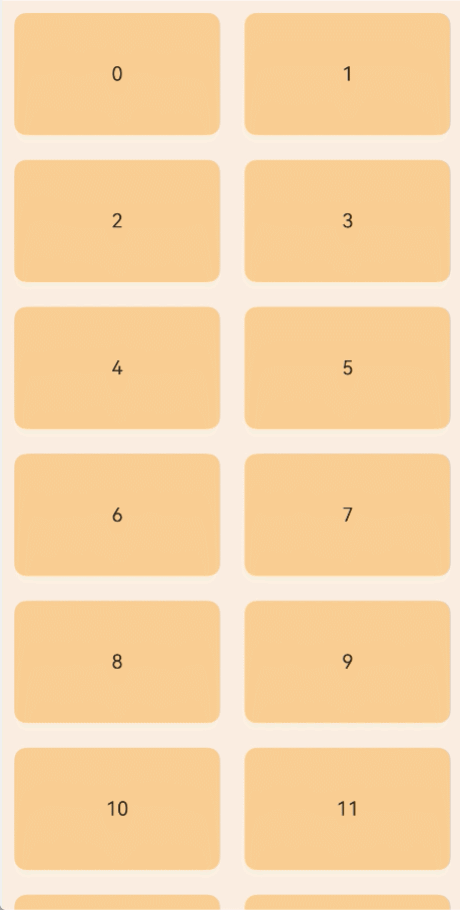
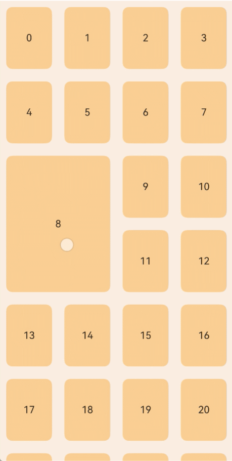
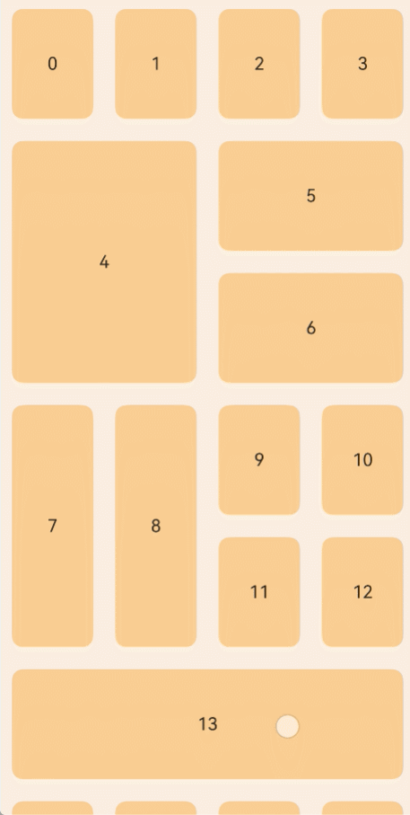
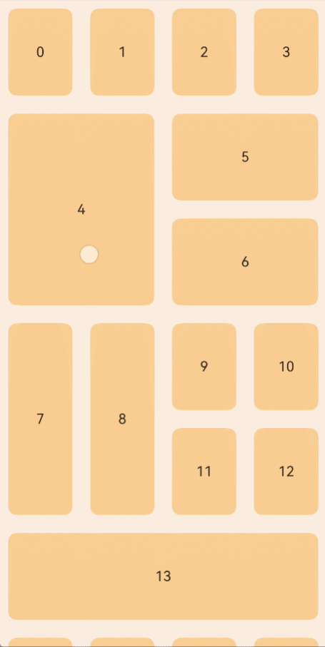

# Drag-and-Drop Sorting

<!--Kit: ArkUI-->
<!--Subsystem: ArkUI-->
<!--Owner: @rongShao-Z; @wind_-->
<!--Designer: @yangcan18-->
<!--Tester: @leiyuqian-->
<!--Adviser: @Brilliantry_Rui-->
<!-- md-trans-meta sourceCommit=608175d8fd85ddfce5e6f9d9b165b9d12862adb2 translatedAt=2026-09-01T12:26:57.181Z -->

Drag sorting is used to implement manual sorting of list items or grid items, and is applicable to scenarios where users need to customize the order of items, such as to-do list sorting and playlist management. By using ForEach/LazyForEach/Repeat within a List or Grid component and setting the onMove event, drag sorting can be enabled when each iteration generates a ListItem or GridItem. After the drag is released, if the data position changes, the onMove event is triggered to report the start index and target index of the data movement. In the onMove event, the data source must be modified based on the reported start index and target index. Ensure that only the order of the data changes so that the placement animation can be executed properly.

> **NOTE**
>
> - Supported since API version 12. If new content is added in later versions, a superscript is used to mark the earliest API version of the content.
>
> - Since API version 26.0.0, Grid supports onMove drag sorting. Currently, Grid supports onMove drag sorting only in scrollable scenarios. When a Grid contains GridItems spanning rows and columns, if the next GridItem to be placed cannot fully fit in the current row, the system searches downward row by row until it can be placed. Therefore, when drag sorting is performed in a Grid with GridItems spanning rows and columns, the new layout after dragging may contain some gaps. You can drag again to adjust the GridItem positions to fill the gaps.
>
> - When setting nodes spanning rows and columns in a Grid, use [GridLayoutOptions](ts-container-grid.md#gridlayoutoptions10). In the onMove event, the application should synchronously modify the corresponding irregular node information to keep it consistent with the new layout after dragging. For details, see [Example 4: Using ForEach onMove for Drag Sorting in Grid Irregular Layout and Setting the Drag Event Callback](#example-4-using-foreach-onmove-for-drag-sorting-in-grid-irregular-layout-and-setting-the-drag-event-callback), [Example 5: Using LazyForEach onMove for Drag Sorting in Grid Irregular Layout and Setting the Drag Event Callback](#example-5-using-lazyforeach-onmove-for-drag-sorting-in-grid-irregular-layout-and-setting-the-drag-event-callback), and [Example 6: Using Repeat's onMove for Drag Sorting in Grid Irregular Layout and Setting the Drag Event Callback](#example-6-using-repeats-onmove-for-drag-sorting-in-grid-irregular-layout-and-setting-the-drag-event-callback).
>
> - The APIs of this module can be used only in the stage model.

## onMove

onMove(handler: Optional\<OnMoveHandler\>): T

Callback for data movement during drag sorting. It takes effect only when the parent container component is [List](./ts-container-list.md) or [Grid](./ts-container-grid.md) and each iteration of ForEach/LazyForEach/Repeat generates a ListItem or GridItem component. After being called, the drag sorting feature is enabled. After the drag is released, if the data position changes, the handler callback is triggered to report the start index and target index of the data movement. The data source must be modified in the callback, and it must be ensured that only the order of the data changes so that the placement animation can be executed properly.

**Atomic service API**: This API can be used in atomic services since API version 12.

**System capability**: SystemCapability.ArkUI.ArkUI.Full

**Parameters**

| Name| Type     | Mandatory| Description      |
| ------ | --------- | ---- | ---------- |
| handler  | Optional\<[OnMoveHandler](#onmovehandler)\> | Yes   | Callback for data movement during drag sorting. Triggered when the data position changes due to dragging. In the callback, modify the data source based on the start index and target index. |

**Return value**

| Type     | Description      |
| ------ | --------- |
| T  | Current component.|

## onMove<sup>20+</sup>

onMove(handler: Optional\<OnMoveHandler\>, eventHandler: ItemDragEventHandler): T

Callback for data movement during drag sorting. It takes effect only when the parent container component is [List](./ts-container-list.md) or [Grid](./ts-container-grid.md) and each iteration of ForEach/LazyForEach/Repeat generates a ListItem or GridItem component. After being called, the drag sorting feature is enabled. After the drag is released, if the data position changes, the handler callback is triggered to report the start index and target index of the data movement. The data source must be modified in the callback, and it must be ensured that only the order of the data changes so that the placement animation can be executed properly. Compared with [onMove](#onmove), this API adds the eventHandler parameter, which can listen to drag phase events such as long press, drag start, passing over other components, and drag end.

**Atomic service API**: This API can be used in atomic services since API version 20.

**System capability**: SystemCapability.ArkUI.ArkUI.Full

**Parameters**

| Name| Type     | Mandatory| Description      |
| ------ | --------- | ---- | ---------- |
| handler  | Optional\<[OnMoveHandler](#onmovehandler)\> | Yes   | Callback for drag sorting data movement. Invoked when the data position changes due to dragging. In the callback, modify the data source based on the start index and target index. |
| eventHandler  | [ItemDragEventHandler](#itemdrageventhandler20) | Yes   | Set of drag event callbacks, used to listen for drag phase events such as long press, drag start, passing over other components, and drag end. |

**Return value**

| Type     | Description      |
| ------ | --------- |
| T  | Current component.|

## OnMoveHandler

type OnMoveHandler = (from: number, to: number) => void

Defines the callback triggered when data is moved during drag-and-drop sorting.

**Atomic service API**: This API can be used in atomic services since API version 12.

**System capability**: SystemCapability.ArkUI.ArkUI.Full

**Parameters**

| Name| Type     | Mandatory| Description      |
| ------ | --------- | ---- | ---------- |
| from  | number | Yes  | Start index of the drag operation. The value range is [0, data source length - 1].|
| to  | number | Yes  | End index of the drag operation. The value range is [0, data source length - 1].|

## ItemDragEventHandler<sup>20+</sup>

Defines callbacks for drag events on a data source, allowing you to respond to different drag operations.

**Atomic service API**: This API can be used in atomic services since API version 20.

**System capability**: SystemCapability.ArkUI.ArkUI.Full

| Name| Type  | Read-Only| Optional| Description                |
| ------ | ------ | ---- | ---- | -------------------- |
| onLongPress  |  [Callback](../../apis-basic-services-kit/js-apis-base.md#callback)\<number\> | No  | Yes | Callback triggered when long pressed. When not set, this callback is not triggered.<br>- The parameter **index** is the index of the current target when long pressed. The value range is [0, Data Source Length - 1]. |
| onDragStart  | [Callback](../../apis-basic-services-kit/js-apis-base.md#callback)\<number\> | No   | Yes | Callback triggered when drag starts. When not set, this callback is not triggered.<br>- The parameter **index** is the index of the current target when drag starts. The value range is [0, Data Source Length - 1]. |
| onMoveThrough  | [OnMoveHandler](#onmovehandler) | No   | Yes | Callback triggered when passing through other components during page-following sliding. When not set, this callback is not triggered.<br>- The parameter **from** is the Start Index of the drag, and the parameter **to** is the Target Index currently passed through. The value range of both is [0, Data Source Length - 1]. |
| onDrop  | [Callback](../../apis-basic-services-kit/js-apis-base.md#callback)\<number\> | No   | Yes | Callback triggered when drag ends. When not set, this callback is not triggered.<br>- The parameter **index** is the index of the current target when drag ends. The value range is [0, Data Source Length - 1]. |

## Example

### Example 1: Using OnMove for Drag Sorting in List

This example demonstrates how to use **onMove** for drag and drop with **ForEach** in a **List** component.

```ts
@Entry
@Component
struct ForEachSort {
  @State arr: Array<string> = [];

  build() {
    Row() {
      List() {
        ForEach(this.arr, (item: string) => {
          ListItem() {
            Text(item)
              .fontSize(16)
              .textAlign(TextAlign.Center)
              .size({height: 100, width: '100%'})
          }.margin(10)
          .borderRadius(10)
          .backgroundColor('#FFFFFFFF')
        }, (item: string) => item)
          .onMove((from: number, to: number) => {
            // Move data based on the drag start and end indexes to ensure that the data order is consistent with the drag result.
            let tmp = this.arr.splice(from, 1);
            this.arr.splice(to, 0, tmp[0]);
          })
      }
      .width('100%')
      .height('100%')
      .backgroundColor('#FFDCDCDC')
    }
  }
  aboutToAppear(): void {
    for (let i = 0; i < 100; i++) {
      this.arr.push(i.toString());
    }
  }
}
```

### Example 2: Using OnMove for Drag Sorting in List and Setting Drag Event Callback

This example demonstrates how to use **onMove** with additional drag event callbacks in a **List** component containing ForEach, available since API version 20.

```ts
// xxx.ets
@Entry
@Component
struct ListOnMoveExample {
  @State arr: number[] = [0, 1, 2, 3, 4, 5, 6];

  build() {
    Column() {
      List({ space: 20, initialIndex: 0 }) {
        ForEach(this.arr, (item: number) => {
          ListItem() {
            Text('First list' + item)
              .width('100%')
              .height(80)
              .fontSize(16)
              .textAlign(TextAlign.Center)
              .borderRadius(10)
              .backgroundColor(0xFFFFFF)
          }
        }, (item: number) => item.toString())
          .onMove((from: number, to: number) => {
            // Move data based on the drag start and end indices to ensure the data order matches the drag result.
            let tmp = this.arr.splice(from, 1);
            this.arr.splice(to, 0, tmp[0]);
            console.info('List onMove From: ' + from);
            console.info('List onMove To: ' + to);
          },
            {
              onLongPress: (index: number) => {
                console.info('List onLongPress: ' + index);
              },
              onDrop: (index: number) => {
                console.info('List onDrop: ' + index);
              },
              onDragStart: (index: number) => {
                console.info('List onDragStart: ' + index);
              },
              onMoveThrough: (from: number, to: number) => {
                console.info('List onMoveThrough From: ' + from);
                console.info('List onMoveThrough To: ' + to);
              }
            }
          )
      }.width('90%')
      .scrollBar(BarState.Off)
    }.width('100%').height('100%').backgroundColor(0xDCDCDC).padding({ top: 5 })
  }
}
```

### Example 3: Using ForEach onMove for Drag Sorting in a Grid with Regular Layout and Setting the Drag Event Callback

Supported since API version 26.0.0, the following example shows the callback event triggered after the Grid component sets the drag effect for ForEach. All GridItems in the Grid are regular.

```ts
// xxx.ets
@Entry
@Component
struct GridOnMoveExample {
  private arr: Array<string> = [];

  build() {
    Row() {
      Grid() {
        ForEach(this.arr, (item: string) => {
          GridItem() {
            Text(item.toString())
              .fontSize(16)
              .textAlign(TextAlign.Center)
              .size({height: 100, width: '100%'})
          }.margin(10)
          .borderRadius(10)
          .backgroundColor(0xF9CF93)
        }, (item: string) => item)
          // Triggered when the dragged item is released and its final position differs from its position before dragging. from is the start index, and to is the target index.
          .onMove((from: number, to: number) => {
            let tmp = this.arr.splice(from, 1);  // Remove the dragged element from its original position.
            this.arr.splice(to, 0, tmp[0]);      // Insert the removed dragged element into the target position.
            console.info('Grid onMove From: ' + from);
            console.info('Grid onMove To: ' + to);
          },
            {
              onLongPress: (index: number) => {
                // Triggered when a GridItem is lifted after a long press.
                console.info('Grid onLongPress: ' + index);
              },
              onDrop: (index: number) => {
                // Triggered when the dragged GridItem is released.
                console.info('Grid onDrop: ' + index);
              },
              onDragStart: (index: number) => {
                // Triggered when a GridItem is lifted after a long press and dragging starts.
                console.info('Grid onDragStart: ' + index);
              },
              onMoveThrough: (from: number, to: number) => {
                // Triggered continuously while the GridItem is being dragged.
                console.info('Grid onMoveThrough From: ' + from);
                console.info('Grid onMoveThrough To: ' + to);
              }
            }
          )
      }
      .columnsTemplate('1fr 1fr')  // Two-column equal-width layout.
      .width('100%')
      .height('100%')
      .backgroundColor(0xFAEEE0)
    }
  }
  aboutToAppear(): void {
    // Initialize 100 data items as the Grid content.
    for (let i = 0; i < 100; i++) {
      this.arr.push(i.toString())
    }
  }
}
```



### Example 4: Using ForEach onMove for Drag Sorting in Grid Irregular Layout and Setting the Drag Event Callback

Since API version 26.0.0, the following example shows the callback event triggered after the Grid component sets the drag effect for ForEach, where the Grid contains irregular GridItems. The application can use [irregularIndexes](ts-container-grid.md#gridlayoutoptions10) to set which indexes are irregular nodes, and adjust the number of rows and columns occupied by the GridItem by modifying the rectSize of the corresponding index.

```ts
// xxx.ets
class Rects {
  id: number = 0
  // rectSize indicates the number of [rows, columns] occupied by the GridItem. The default [1, 1] is a regular node.
  rectSize: [number, number] = [1, 1]
  constructor(id_: number) {
    this.id = id_
  }
}

@Entry
@Component
struct GridOnMoveExample {
  @State arr: Array<Rects> = [];

  // Grid layout options (actually effective), declaring the indexes of irregular nodes and the number of rows and columns each occupies.
  @State layoutOptions: GridLayoutOptions = {
    regularSize: [1, 1],
    irregularIndexes: [8],   // The GridItem with index 8 is an irregular node.
    onGetIrregularSizeByIndex: (index: number) => {
      return this.arr[index].rectSize
    }
  };

  // Layout options (backup), used to trigger a layoutOptions refresh through overall assignment during dragging.
  layoutOptions_back: GridLayoutOptions = {
    regularSize: [1, 1],
    irregularIndexes: [8],   // The GridItem with index 8 is an irregular node.
    onGetIrregularSizeByIndex: (index: number) => {
      return this.arr[index].rectSize
    }
  };

  build() {
    Row() {
      Grid(undefined, this.layoutOptions) {
        ForEach(this.arr, (item: Rects) => {
          GridItem() {
            Text(item.id.toString())
              .fontSize(16)
              .textAlign(TextAlign.Center)
              .size({ height: 100 * item.rectSize[0] + (item.rectSize[0] - 1) * 20, width: '100%'}) // Set the height. A GridItem spanning multiple rows needs extra margins (the spacing of a regular GridItem is 2*10) for interface alignment.
          }.margin(10)
          .borderRadius(10)
          .backgroundColor(0xF9CF93)
        }, (item: Rects) => item.id.toString())
          // Triggered when the dragged item is released and its final position differs from its position before dragging. from is the start index, and to is the target index.
          .onMove((from:number, to:number) => {
            console.info("Grid onMove from " + from + " to " + to)
            // Update the this.arr data source.
            let tmp = this.arr.splice(from, 1);
            this.arr.splice(to, 0, tmp[0]);
            if (from < to) {  // The index of the dragged item is smaller than the target position index.
              // First save the position of the dragged item in the irregularIndexes array to avoid indexOf locating errors caused by duplicate values generated in subsequent loop updates.
              let from_idx = -1
              if (this.layoutOptions.irregularIndexes?.includes(from)) {
                from_idx = this.layoutOptions.irregularIndexes.indexOf(from)
              }

              // Shift the elements between the dragged item and the target position forward by one position (index -1).
              if (this.layoutOptions.irregularIndexes != undefined) {
                let len = this.layoutOptions.irregularIndexes.length
                for (let i = len - 1; i >= 0; i --) {
                  let irregularIndex = this.layoutOptions.irregularIndexes[i]
                  if (irregularIndex > from && irregularIndex <= to) {
                    this.layoutOptions.irregularIndexes[i] --
                  }
                }
              }

              // If the dragged item itself is an irregular node, update its index to the target position.
              if (from_idx != -1 && this.layoutOptions.irregularIndexes != undefined) {
                this.layoutOptions.irregularIndexes[from_idx] = to
              }
            } else {  // The index of the dragged item is greater than or equal to the target position index.
              // First save the position of the dragged item in the irregularIndexes array to avoid indexOf locating errors caused by duplicate values generated in subsequent loop updates.
              let from_idx = -1
              if (this.layoutOptions.irregularIndexes?.includes(from)) {
                from_idx = this.layoutOptions.irregularIndexes.indexOf(from)
              }

              // Shift the elements between the target position and the dragged item backward by one position (index +1).
              if (this.layoutOptions.irregularIndexes != undefined) {
                let len = this.layoutOptions.irregularIndexes.length
                for (let i = 0; i < len; i ++) {
                  let irregularIndex = this.layoutOptions.irregularIndexes[i]
                  if (irregularIndex >= to && irregularIndex < from) {
                    this.layoutOptions.irregularIndexes[i] ++
                  }
                }
              }

              // If the dragged item itself is an irregular node, update its index to the target position.
              if (from_idx != -1 && this.layoutOptions.irregularIndexes != undefined) {
                this.layoutOptions.irregularIndexes[from_idx] = to
              }
            }
            // Force layoutOptions to refresh and take effect through overall assignment of the backup object.
            this.layoutOptions_back.irregularIndexes = this.layoutOptions.irregularIndexes
            this.layoutOptions = this.layoutOptions_back
            console.info("Grid this.layoutOptions.irregularIndexes " + this.layoutOptions.irregularIndexes)
          },
            {
              onLongPress: (index: number) => {
                // Triggered when a GridItem is lifted after a long press.
                console.info('Grid onLongPress: ' + index);
              },
              onDrop: (index: number) => {
                // Triggered when the dragged GridItem is released.
                console.info('Grid onDrop: ' + index);
              },
              onDragStart: (index: number) => {
                // Triggered when a GridItem is lifted after a long press and dragging starts.
                console.info('Grid onDragStart: ' + index);
              },
              onMoveThrough: (from: number, to: number) => {
                // Triggered continuously while the GridItem is being dragged.
                console.info('Grid onMoveThrough From: ' + from + ' to: ' + to);
              }
            })
      }
      .columnsTemplate('1fr 1fr 1fr 1fr')   // Four-column equal-width layout.
      .width('100%')
      .height('100%')
      .backgroundColor(0xFAEEE0)
    }
  }
  aboutToAppear(): void {
    // Initialize 100 rectangle data items and set index 8 as a 2x2 irregular node.
    for (let i = 0; i < 100; i++) {
      this.arr.push(new Rects(i));
    }
    this.arr[8].rectSize = [2, 2] // 2 rows and 2 columns.
  }
}
```



### Example 5: Using LazyForEach onMove for Drag Sorting in Grid Irregular Layout and Setting the Drag Event Callback

Starting from API version 26.0.0, the following example demonstrates the callback event triggered after the drag effect is set for the Grid component using LazyForEach, where the Grid contains irregular GridItems. The application can use irregularIndexes to set which indexes are irregular nodes, and adjust the number of rows and columns occupied by the GridItem by modifying the rectSize of the corresponding index.

```ts
// RectGridDataSource.ets
export class Rects {
  id: number = 0
  // rectSize indicates the number of [rows, columns] occupied by the GridItem. The default [1, 1] is a regular node.
  rectSize: [number, number] = [1, 1]
  constructor(id_: number) {
    this.id = id_
  }
}

// Data source of LazyForEach, implementing the IDataSource interface and responsible for managing data and notifying the UI to refresh.
export class RectGridDataSource implements IDataSource {
  private list: Array<Rects> = [];
  private listeners: DataChangeListener[] = [];

  constructor(list: Rects[]) {
    this.list = list;
  }

  // Return the total number of data items.
  totalCount(): number {
    return this.list.length;
  }

  // Obtain the corresponding data item by index.
  getData(index: number): Rects {
    return this.list[index];
  }

  // Register a data change listener.
  registerDataChangeListener(listener: DataChangeListener): void {
    if (this.listeners.indexOf(listener) < 0) {
      this.listeners.push(listener);
    }
  }

  // Unregister a data change listener.
  unregisterDataChangeListener(listener: DataChangeListener): void {
    const pos = this.listeners.indexOf(listener);
    if (pos >= 0) {
      this.listeners.splice(pos, 1);
    }
  }

  // Notify the controller of a data position change.
  notifyDataMove(from: number, to: number): void {
    this.listeners.forEach(listener => {
      listener.onDataMove(from, to);
    })
  }

  // Reload all data.
  notifyDataReload(): void {
    this.listeners.forEach(listener => {
      listener.onDataReloaded();
    })
  }

  // Move the element at the from position to the to position and notify the UI to reload all data.
  public moveItem(from: number, to: number): void {
    let tmp = this.list.splice(from, 1);  // First remove the dragged item.
    this.list.splice(to, 0, tmp[0]);      // Insert the dragged item into the target position.
    this.notifyDataReload()
  }
}
```

```ts
// xxx.ets
import { RectGridDataSource, Rects } from './RectGridDataSource';

@Entry
@Component
struct GridOnMoveExample {
  numbers: RectGridDataSource = new RectGridDataSource([]);

  // Grid layout options (actually effective), declaring the indexes of irregular nodes and the number of rows and columns each occupies.
  @State layoutOptions: GridLayoutOptions = {
    regularSize: [1, 1],
    irregularIndexes: [4, 5, 6, 7, 8, 13],   // Set which indexes correspond to GridItems that are irregular nodes.
    onGetIrregularSizeByIndex: (index: number) => {
      return this.numbers.getData(index).rectSize
    }
  };

  // Layout options (backup), used to trigger a layoutOptions refresh through overall assignment during dragging.
  layoutOptions_back: GridLayoutOptions = {
    regularSize: [1, 1],
    irregularIndexes: [4, 5, 6, 7, 8, 13],
    onGetIrregularSizeByIndex: (index: number) => {
      return this.numbers.getData(index).rectSize
    }
  };

  build() {
    Row() {
      Grid(undefined, this.layoutOptions) {
        LazyForEach(this.numbers, (item: Rects) => {
          GridItem() {
            Text(item.id.toString())
              .fontSize(16)
              .textAlign(TextAlign.Center)
              // Set the height. A GridItem spanning multiple rows needs extra margins (the spacing of a regular GridItem is 2*10) for interface alignment.
              .size({ height: 100 * item.rectSize[0] + (item.rectSize[0] - 1) * 20, width: '100%'})
          }.margin(10)
          .borderRadius(10)
          .backgroundColor(0xF9CF93)
        }, (index: Rects) => index.id.toString())
          // Triggered when the dragged item is released and its final position differs from its position before dragging. from is the start index, and to is the target index.
          .onMove((from:number, to:number) => {
            console.info("Grid onMove from " + from + " to " + to)
            // Update the data source.
            this.numbers.moveItem(from, to)
            if (from < to) {  // The index of the dragged item is smaller than the target position index.
              // First save the position of the dragged item in the irregularIndexes array to avoid indexOf locating errors caused by duplicate values generated in subsequent loop updates.
              let from_idx = -1
              if (this.layoutOptions.irregularIndexes?.includes(from)) {
                from_idx = this.layoutOptions.irregularIndexes.indexOf(from)
              }

              // Shift the elements between the dragged item and the target position forward by one position (index -1).
              if (this.layoutOptions.irregularIndexes != undefined) {
                let len = this.layoutOptions.irregularIndexes.length
                for (let i = len - 1; i >= 0; i --) {
                  let irregularIndex = this.layoutOptions.irregularIndexes[i]
                  if (irregularIndex > from && irregularIndex <= to) {
                    this.layoutOptions.irregularIndexes[i] --
                  }
                }
              }

              // If the dragged item itself is an irregular node, update its index to the target position.
              if (from_idx != -1 && this.layoutOptions.irregularIndexes != undefined) {
                this.layoutOptions.irregularIndexes[from_idx] = to
              }
            } else {  // The index of the dragged item is greater than or equal to the target position index.
              // First save the position of the dragged item in the irregularIndexes array to avoid indexOf locating errors caused by duplicate values generated in subsequent loop updates.
              let from_idx = -1
              if (this.layoutOptions.irregularIndexes?.includes(from)) {
                from_idx = this.layoutOptions.irregularIndexes.indexOf(from)
              }

              // Shift the elements between the target position and the dragged item backward by one position (index +1).
              if (this.layoutOptions.irregularIndexes != undefined) {
                let len = this.layoutOptions.irregularIndexes.length
                for (let i = 0; i < len; i ++) {
                  let irregularIndex = this.layoutOptions.irregularIndexes[i]
                  if (irregularIndex >= to && irregularIndex < from) {
                    this.layoutOptions.irregularIndexes[i] ++
                  }
                }
              }

              // If the dragged item itself is an irregular node, update its index to the target position.
              if (from_idx != -1 && this.layoutOptions.irregularIndexes != undefined) {
                this.layoutOptions.irregularIndexes[from_idx] = to
              }
            }
            // Force layoutOptions to refresh and take effect through overall assignment of the backup object.
            this.layoutOptions_back.irregularIndexes = this.layoutOptions.irregularIndexes
            this.layoutOptions = this.layoutOptions_back
            console.info("Grid this.layoutOptions.irregularIndexes " + this.layoutOptions.irregularIndexes)
          },
            {
              onLongPress: (index: number) => {
                // Triggered when a GridItem is lifted after a long press.
                console.info('Grid onLongPress: ' + index);
              },
              onDrop: (index: number) => {
                // Triggered when the dragged GridItem is released.
                console.info('Grid onDrop: ' + index);
              },
              onDragStart: (index: number) => {
                // Triggered when a GridItem is lifted after a long press and dragging starts.
                console.info('Grid onDragStart: ' + index);
              },
              onMoveThrough: (from: number, to: number) => {
                // Triggered continuously while the GridItem is being dragged.
                console.info('Grid onMoveThrough From: ' + from + ' to: ' + to);
              }
            })
      }
      .columnsTemplate('1fr 1fr 1fr 1fr')   // Four-column equal-width layout.
      .width('100%')
      .height('100%')
      .backgroundColor(0xFAEEE0)
    }
  }

  aboutToAppear(): void {
    // Initialize 100 rectangle data items and set the spanning size of each irregular node.
    let list: Rects[] = [];
    for (let i = 0; i < 100; i++) {
      list.push(new Rects(i));
    }
    list[4].rectSize = [2, 2] // 2 rows and 2 columns.
    list[5].rectSize = [1, 2] // 1 row and 2 columns.
    list[6].rectSize = [1, 2] // 1 row and 2 columns.
    list[7].rectSize = [2, 1] // 2 rows and 1 column.
    list[8].rectSize = [2, 1] // 2 rows and 1 column.
    list[13].rectSize = [1, 4]  // 1 row and 4 columns.
    this.numbers = new RectGridDataSource(list);
  }
}
```



### Example 6: Using Repeat's onMove for Drag Sorting in Grid Irregular Layout and Setting the Drag Event Callback

Supported since API version 26.0.0, the example below shows the callback event triggered after Repeat sets the drag effect in the Grid component, where the Grid contains irregular GridItems. The application can use irregularIndexes to set which indexes are irregular nodes, and adjust the number of rows and columns occupied by the GridItem by modifying the rectSize of the corresponding index.

```ts
// xxx.ets
class Rects {
  id: number = 0
  // rectSize indicates the number of [rows, columns] occupied by the GridItem. The default [1, 1] is a regular node.
  rectSize: [number, number] = [1, 1]
  constructor(id_: number) {
    this.id = id_
  }
}

@Entry
@ComponentV2
struct GridOnMoveExample {
  @Local arr: Array<Rects> = [];

  // Grid layout options (actually effective), declaring the indexes of irregular nodes and the number of rows and columns each occupies.
  @Local layoutOptions: GridLayoutOptions = {
    regularSize: [1, 1],
    irregularIndexes: [4, 5, 6, 7, 8, 13],   // Set which indexes correspond to GridItems that are irregular nodes.
    onGetIrregularSizeByIndex: (index: number) => {
      return this.arr[index].rectSize
    }
  };

  // Layout options (backup), used to trigger a layoutOptions refresh through overall assignment during dragging.
  layoutOptions_back: GridLayoutOptions = {
    regularSize: [1, 1],
    irregularIndexes: [4, 5, 6, 7, 8, 13],
    onGetIrregularSizeByIndex: (index: number) => {
      return this.arr[index].rectSize
    }
  };

  aboutToAppear(): void {
    // Initialize 100 rectangle data items.
    for (let i = 0; i < 100; i++) {
      this.arr.push(new Rects(i));
    }
    // Set the spanning size of each irregular node.
    this.arr[4].rectSize = [2, 2] // 2 rows and 2 columns.
    this.arr[5].rectSize = [1, 2] // 1 row and 2 columns.
    this.arr[6].rectSize = [1, 2] // 1 row and 2 columns.
    this.arr[7].rectSize = [2, 1] // 2 rows and 1 column.
    this.arr[8].rectSize = [2, 1] // 2 rows and 1 column.
    this.arr[13].rectSize = [1, 4] // 1 row and 4 columns.
  }

  build() {
    Column() {
      Grid(undefined, this.layoutOptions) {
        Repeat<Rects>(this.arr)
        // Triggered when the dragged item is released and its final position differs from its position before dragging. from is the start index, and to is the target index.
          .onMove((from: number, to: number) => {
            if (from == to) {
              return
            }
            console.info("Grid onMove from " + from + " to " + to)
            // Update the this.arr data source.
            let tmp = this.arr.splice(from, 1);
            this.arr.splice(to, 0, tmp[0]);
            if (from < to) {  // The index of the dragged item is smaller than the target position index.
              // First save the position of the dragged item in the irregularIndexes array to avoid indexOf locating errors caused by duplicate values generated in subsequent loop updates.
              let from_idx = -1
              if (this.layoutOptions.irregularIndexes?.includes(from)) {
                from_idx = this.layoutOptions.irregularIndexes.indexOf(from)
              }

              // Shift the elements between the dragged item and the target position forward by one position (index -1).
              if (this.layoutOptions.irregularIndexes != undefined) {
                let len = this.layoutOptions.irregularIndexes.length
                for (let i = len - 1; i >= 0; i --) {
                  let irregularIndex = this.layoutOptions.irregularIndexes[i]
                  if (irregularIndex > from && irregularIndex <= to) {
                    this.layoutOptions.irregularIndexes[i] --
                  }
                }
              }

              // If the dragged item itself is an irregular node, update its index to the target position.
              if (from_idx != -1 && this.layoutOptions.irregularIndexes != undefined) {
                this.layoutOptions.irregularIndexes[from_idx] = to
              }
            } else {  // The index of the dragged item is greater than or equal to the target position index.
              // First save the position of the dragged item in the irregularIndexes array to avoid indexOf locating errors caused by duplicate values generated in subsequent loop updates.
              let from_idx = -1
              if (this.layoutOptions.irregularIndexes?.includes(from)) {
                from_idx = this.layoutOptions.irregularIndexes.indexOf(from)
              }

              // Shift the elements between the target position and the dragged item backward by one position (index +1).
              if (this.layoutOptions.irregularIndexes != undefined) {
                let len = this.layoutOptions.irregularIndexes.length
                for (let i = 0; i < len; i ++) {
                  let irregularIndex = this.layoutOptions.irregularIndexes[i]
                  if (irregularIndex >= to && irregularIndex < from) {
                    this.layoutOptions.irregularIndexes[i] ++
                  }
                }
              }

              // If the dragged item itself is an irregular node, update its index to the target position.
              if (from_idx != -1 && this.layoutOptions.irregularIndexes != undefined) {
                this.layoutOptions.irregularIndexes[from_idx] = to
              }
            }
            // Force layoutOptions to refresh and take effect through overall assignment of the backup object.
            this.layoutOptions_back.irregularIndexes = this.layoutOptions.irregularIndexes
            this.layoutOptions = this.layoutOptions_back
            console.info("Grid this.layoutOptions.irregularIndexes " + this.layoutOptions.irregularIndexes)
          },
            {
              onLongPress: (index: number) => {
                // Triggered when a GridItem is lifted after a long press.
                console.info('Grid onLongPress: ' + index);
              },
              onDrop: (index: number) => {
                // Triggered when the dragged GridItem is released.
                console.info('Grid onDrop: ' + index);
              },
              onDragStart: (index: number) => {
                // Triggered when a GridItem is lifted after a long press and dragging starts.
                console.info('Grid onDragStart: ' + index);
              },
              onMoveThrough: (from: number, to: number) => {
                // Triggered continuously while the GridItem is being dragged.
                console.info('Grid onMoveThrough From: ' + from + ' to: ' + to);
              }
            })
          .each((obj: RepeatItem<Rects>) => {
            GridItem() {
              Text(obj.item.id.toString())
                .fontSize(16)
                .textAlign(TextAlign.Center)
                // Set the height. A GridItem spanning multiple rows needs extra margins (the spacing of a regular GridItem is 2*10) for interface alignment.
                .size({ height: 100 * this.arr[obj.index].rectSize[0] + (this.arr[obj.index].rectSize[0] - 1) * 20, width: '100%' })
            }.margin(10)
            .borderRadius(10)
            .backgroundColor(0xF9CF93)
          })
          .key((item: Rects, index: number) => {
            return item.id.toString();
          })
          .virtualScroll({ totalCount: this.arr.length })   // Enable virtual scrolling to render only visible items for better performance.
      }
      .columnsTemplate('1fr 1fr 1fr 1fr')   // Four-column equal-width layout.
      .border({ width: 1 })
      .backgroundColor(0xFAEEE0)
      .width('100%')
      .height('100%')
    }
  }
}
```


