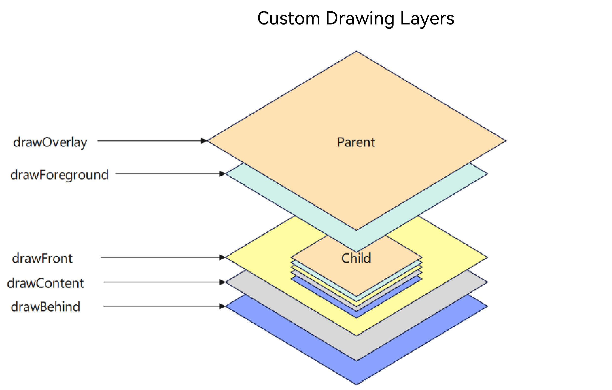

# Drawing Modifier
<!--Kit: ArkUI-->
<!--Subsystem: ArkUI-->
<!--Owner: @wangyang2022-->
<!--Designer: @wangyang2022-->
<!--Tester: @sally__-->
<!--Adviser: @Brilliantry_Rui-->
<!-- md-trans-meta sourceCommit=aacbe0ecdb6d917ab568af42254d52ee08ae5829 translatedAt=2026-09-01T12:26:51.728Z -->

When the drawn content of a component does not meet the requirements, you can use the custom component drawing feature to draw part of the component on the basis of the original component, or draw the entire component by yourself, so as to achieve the expected effect. For example, a unique button shape, an icon that combines text and images, and so on. The custom component drawing feature provides a custom drawing modifier to implement more flexible component drawing.

> **NOTE**
>
> - The initial APIs of this module are supported since API version 12. Updates will be marked with a superscript to indicate their earliest API version.
>
> - The APIs of this module can be used only in the stage model.

## drawModifier

drawModifier(modifier: DrawModifier | undefined): T

Creates a drawing modifier.

> **NOTE**
>
> This API cannot be called within [attributeModifier](ts-universal-attributes-attribute-modifier.md#attributemodifier).

**Atomic service API**: This API can be used in atomic services since API version 12.

**System capability**: SystemCapability.ArkUI.ArkUI.Full

**Supported components**

[AlphabetIndexer](ts-container-alphabet-indexer.md), [Badge](ts-container-badge.md), [Blank](ts-basic-components-blank.md), [Button](ts-basic-components-button.md), [CalendarPicker](ts-basic-components-calendarpicker.md), [Checkbox](ts-basic-components-checkbox.md), [CheckboxGroup](ts-basic-components-checkboxgroup.md), [Circle](ts-drawing-components-circle.md), [Column](ts-container-column.md), [ColumnSplit](ts-container-columnsplit.md), [Counter](ts-container-counter.md), [DataPanel](ts-basic-components-datapanel.md), [DatePicker](ts-basic-components-datepicker.md), [Ellipse](ts-drawing-components-ellipse.md), [Flex](ts-container-flex.md), [FlowItem](ts-container-flowitem.md), [FolderStack](ts-container-folderstack.md), [FormLink](ts-container-formlink.md), [Gauge](ts-basic-components-gauge.md), [Grid](ts-container-grid.md), [GridCol](ts-container-gridcol.md), [GridItem](ts-container-griditem.md), [GridRow](ts-container-gridrow.md), [Hyperlink](ts-container-hyperlink.md), [Image](ts-basic-components-image.md), [ImageAnimator](ts-basic-components-imageanimator.md), [ImageSpan](ts-basic-components-imagespan.md), [Line](ts-drawing-components-line.md), [List](ts-container-list.md), [ListItem](ts-container-listitem.md), [ListItemGroup](ts-container-listitemgroup.md), [LoadingProgress](ts-basic-components-loadingprogress.md), [Marquee](ts-basic-components-marquee.md), [Menu](ts-basic-components-menu.md), [MenuItem](ts-basic-components-menuitem.md), [MenuItemGroup](ts-basic-components-menuitemgroup.md), [NavDestination](ts-basic-components-navdestination.md), [Navigation](ts-basic-components-navigation.md), [Navigator](ts-container-navigator.md), [NavRouter](ts-basic-components-navrouter.md), [NodeContainer](ts-basic-components-nodecontainer.md), [Path](ts-drawing-components-path.md), [PatternLock](ts-basic-components-patternlock.md), [Polygon](ts-drawing-components-polygon.md), [Polyline](ts-drawing-components-polyline.md), [Progress](ts-basic-components-progress.md), [QRCode](ts-basic-components-qrcode.md), [Radio](ts-basic-components-radio.md), [Rating](ts-basic-components-rating.md), [Rect](ts-drawing-components-rect.md), [Refresh](ts-container-refresh.md), [RelativeContainer](ts-container-relativecontainer.md), [RichEditor](ts-basic-components-richeditor.md), [Row](ts-container-row.md), [RowSplit](ts-container-rowsplit.md), [Scroll](ts-container-scroll.md), [ScrollBar](ts-basic-components-scrollbar.md), [Search](ts-basic-components-search.md), [Select](ts-basic-components-select.md), [Shape](ts-drawing-components-shape.md), [SideBarContainer](ts-container-sidebarcontainer.md), [Slider](ts-basic-components-slider.md), [Stack](ts-container-stack.md), [Stepper](ts-basic-components-stepper.md), [StepperItem](ts-basic-components-stepperitem.md), [Swiper](ts-container-swiper.md), [SymbolGlyph](ts-basic-components-symbolGlyph.md), [TabContent](ts-container-tabcontent.md), [Tabs](ts-container-tabs.md), [Text](ts-basic-components-text.md), [TextArea](ts-basic-components-textarea.md), [TextClock](ts-basic-components-textclock.md), [TextInput](ts-basic-components-textinput.md), [TextPicker](ts-basic-components-textpicker.md), [TextTimer](ts-basic-components-texttimer.md), [TimePicker](ts-basic-components-timepicker.md), [Toggle](ts-basic-components-toggle.md), [WaterFlow](ts-container-waterflow.md), [XComponent](ts-basic-components-xcomponent.md)

**Parameters**

| Name| Type                                                | Mandatory| Description                                                        |
| ------ | ---------------------------------------------------- | ---- | ------------------------------------------------------------ |
| modifier  | &nbsp;[DrawModifier](#drawmodifier-1)&nbsp;\|&nbsp;undefined | Yes   | Custom drawing modifier, which defines the logic of custom drawing. <br> Default value: **undefined**. If no custom drawing modifier is set, the component uses the original default drawing behavior and does not perform custom drawing. <br>**Note:** <br> Each custom drawing modifier takes effect only on the [FrameNode](../js-apis-arkui-frameNode.md) of the currently bound component, and does not take effect on its child nodes. Each DrawModifier instance can be set to only one component, and repeated setting is prohibited. |

**Return value**

| Type| Description|
| --- | --- |
| T | Current component, used for chained calls. |

## DrawModifier

DrawModifier can set the drawing methods of the mask layer (drawOverlay<sup>23+</sup>), foreground (drawForeground<sup>20+</sup>), content foreground (drawFront), content (drawContent), and content background (drawBehind), and also provides the [invalidate](#invalidate) method to actively trigger redrawing. Each DrawModifier instance can be set to only one component, and repeated setting is prohibited.

> **NOTE**
>
> The drawing order from bottom to top is: content background (drawBehind) → content (drawContent) → content foreground (drawFront) → foreground (drawForeground) → mask layer (drawOverlay). Each layer is drawn independently, and the methods of each layer are optional to implement.

The figure below shows the custom drawing layers.



**Atomic service API**: This API can be used in atomic services since API version 12.

**System capability**: SystemCapability.ArkUI.ArkUI.Full

### drawFront

drawFront?(drawContext: DrawContext): void

Draws the content foreground. Override this method to implement custom content foreground drawing. The content foreground is located between the content and the foreground, and is suitable for scenarios where drawing content needs to be added above the component content and below the component foreground. The Canvas in the [DrawContext](../js-apis-arkui-graphics.md#drawcontext) of this API is a temporary canvas used to record instructions, not the actual canvas of the node. For usage, see [Adjusting the Transformation Matrix of the Custom Drawing Canvas](../../../ui/arkts-user-defined-extension-drawModifier.md#adjusting-the-transformation-matrix-of-the-custom-drawing-canvas).

**Atomic service API**: This API can be used in atomic services since API version 12.

**System capability**: SystemCapability.ArkUI.ArkUI.Full

**Parameters**

| Name | Type                                                  | Mandatory| Description            |
| ------- | ------------------------------------------------------ | ---- | ---------------- |
| drawContext | [DrawContext](#drawcontext) | Yes | Graphics drawing context that provides properties such as canvas (canvas object) and size (drawing area size), used to perform specific drawing operations in custom drawing methods. |

**Example**

See [Example 1: Implementing Custom Drawing Through DrawModifier](#example-1-implementing-custom-drawing-through-drawmodifier).

### drawContent

drawContent?(drawContext: DrawContext): void

Draws the content. Override this method to implement custom content drawing, which will replace the component's default content drawing function. It is suitable for scenarios where the component content drawing needs to be fully customized and the component's original content drawing logic is not used. The Canvas in the [DrawContext](../js-apis-arkui-graphics.md#drawcontext) of this API is a temporary canvas used to record instructions, not the actual canvas of the node. For usage, see [Adjusting the Transformation Matrix of the Custom Drawing Canvas](../../../ui/arkts-user-defined-extension-drawModifier.md#adjusting-the-transformation-matrix-of-the-custom-drawing-canvas).

**Atomic service API**: This API can be used in atomic services since API version 12.

**System capability**: SystemCapability.ArkUI.ArkUI.Full

**Parameters**

| Name | Type                                                  | Mandatory| Description            |
| ------- | ------------------------------------------------------ | ---- | ---------------- |
| drawContext | [DrawContext](#drawcontext) | Yes | Graphics drawing context that provides properties such as canvas (canvas object) and size (drawing area size), used to perform specific drawing operations in custom drawing methods. |

**Example**

See [Example 1: Implementing Custom Drawing Through DrawModifier](#example-1-implementing-custom-drawing-through-drawmodifier).

### drawBehind

drawBehind?(drawContext: DrawContext): void

Draws the content background. Override this method to implement custom content background drawing. The background is located below the component content layer, and is suitable for scenarios where decorative background elements need to be added at the bottom layer of the component. The Canvas in the [DrawContext](../js-apis-arkui-graphics.md#drawcontext) of this API is a temporary canvas used to record instructions, not the actual canvas of the node. For usage, see [Adjusting the Transformation Matrix of the Custom Drawing Canvas](../../../ui/arkts-user-defined-extension-drawModifier.md#adjusting-the-transformation-matrix-of-the-custom-drawing-canvas).

**Atomic service API**: This API can be used in atomic services since API version 12.

**System capability**: SystemCapability.ArkUI.ArkUI.Full

**Parameters**

| Name | Type                                                  | Mandatory| Description            |
| ------- | ------------------------------------------------------ | ---- | ---------------- |
| drawContext | [DrawContext](#drawcontext) | Yes | Graphics drawing context that provides properties such as canvas (canvas object) and size (drawing area size), used to perform specific drawing operations in custom drawing methods. |

**Example**

See [Example 1: Implementing Custom Drawing Through DrawModifier](#example-1-implementing-custom-drawing-through-drawmodifier).

### drawForeground<sup>20+</sup>

drawForeground(drawContext: DrawContext): void

Draws the foreground. Override this method to implement custom foreground drawing. Compared with [drawFront](#drawfront) (content foreground), drawForeground is at a higher layer and is drawn above the content foreground and below the mask layer. drawFront is suitable for drawing the foreground effect of the component content itself, while drawForeground is suitable for scenarios where an additional foreground effect needs to be added above the content foreground. The Canvas in the [DrawContext](../js-apis-arkui-graphics.md#drawcontext) of this API is a temporary canvas used to record instructions, not the actual canvas of the node. For usage, see [Adjusting the Transformation Matrix of the Custom Drawing Canvas](../../../ui/arkts-user-defined-extension-drawModifier.md#adjusting-the-transformation-matrix-of-the-custom-drawing-canvas).

**Atomic service API**: This API can be used in atomic services since API version 20.

**System capability**: SystemCapability.ArkUI.ArkUI.Full

**Parameters**

| Name | Type                                                  | Mandatory| Description            |
| ------- | ------------------------------------------------------ | ---- | ---------------- |
| drawContext | [DrawContext](#drawcontext) | Yes | Graphics drawing context that provides properties such as canvas (canvas object) and size (drawing area size), used to perform specific drawing operations in custom drawing methods. |

**Example**

See [Example 2: Implementing Custom Foreground Drawing for a Container Through DrawModifier](#example-2-implementing-custom-foreground-drawing-for-a-container-through-drawmodifier).

### drawOverlay<sup>23+</sup>

drawOverlay(drawContext: DrawContext): void

Interface for custom drawing of the mask. If this method is overridden, custom drawing of the mask can be performed. The mask is the topmost drawing layer, suitable for scenarios where a mask effect (such as highlighting or masking) needs to be added to the topmost layer of a component. The Canvas in [DrawContext](../js-apis-arkui-graphics.md#drawcontext) of this interface is a temporary canvas used to record instructions, not the actual canvas of the node. For usage, see [Adjusting the Transformation Matrix of the Custom Drawing Canvas](../../../ui/arkts-user-defined-extension-drawModifier.md#adjusting-the-transformation-matrix-of-the-custom-drawing-canvas).

**Atomic service API**: This API can be used in atomic services since API version 23.

**System capability**: SystemCapability.ArkUI.ArkUI.Full

**Parameters**

| Name | Type                                                  | Mandatory| Description            |
| ------- | ------------------------------------------------------ | ---- | ---------------- |
| drawContext | [DrawContext](#drawcontext) | Yes | Graphics drawing context that provides properties such as canvas (canvas object) and size (drawing area size), used to perform specific drawing operations in custom drawing methods. |

**Example**


```ts
// test.ets
import { drawing } from '@kit.ArkGraphics2D';

class MyOverlayDrawModifier extends DrawModifier {
  public scaleX: number = 3;
  public scaleY: number = 3;
  uiContext: UIContext;

  constructor(uiContext: UIContext) {
    super();
    this.uiContext = uiContext;
  }

  // Override the drawOverlay method to implement custom drawing of the overlay layer.
  drawOverlay(context: DrawContext): void {
    const brush = new drawing.Brush();
    brush.setColor({
      alpha: 255,
      red: 0,
      green: 50,
      blue: 100
    });
    context.canvas.attachBrush(brush);
    const halfWidth = context.size.width / 2;
    const halfHeight = context.size.height / 2;
    context.canvas.drawRect({
      left: this.uiContext.vp2px(halfWidth - 30 * this.scaleX),
      top: this.uiContext.vp2px(halfHeight - 30 * this.scaleY),
      right: this.uiContext.vp2px(halfWidth + 30 * this.scaleX),
      bottom: this.uiContext.vp2px(halfHeight + 60 * this.scaleY)
    });
  }
}

@Entry
@Component
struct DrawModifierExample {
  // Instantiate the class for the custom drawing overlay layer and pass in the UIContext instance.
  private overlayModifier: MyOverlayDrawModifier = new MyOverlayDrawModifier(this.getUIContext());

  build() {
    Column() {
      Text('Here is a child node')
        .fontSize(36)
        .width('100%')
        .height('100%')
        .textAlign(TextAlign.Center)
    }
    .margin(50)
    .width(280)
    .height(300)
    .backgroundColor(0x87CEEB)
    // Call this API and pass in the class instance of the custom drawing overlay layer to implement the custom drawing overlay layer.
    .drawModifier(this.overlayModifier)
  }
}
```

### invalidate

invalidate(): void

Interface for proactively triggering redrawing. Developers do not need to and cannot override this method. Calling it triggers redrawing of the bound component. When the attributes that custom drawing depends on (such as size, color, and position) change, for example, when drawing parameters are dynamically updated during an animation, call this method to make the latest drawing effect take effect.

**Atomic service API**: This API can be used in atomic services since API version 12.

**System capability**: SystemCapability.ArkUI.ArkUI.Full

**Example**

See [Example 1: Implementing Custom Drawing Through DrawModifier](#example-1-implementing-custom-drawing-through-drawmodifier).

## DrawContext

type DrawContext = import('../api/arkui/Graphics').DrawContext

**Atomic service API**: This API can be used in atomic services since API version 12.

**System capability**: SystemCapability.ArkUI.ArkUI.Full

| Type                                                     | Description                   |
| --------------------------------------------------------- | ----------------------- |
| import('../api/arkui/Graphics').[DrawContext](../js-apis-arkui-graphics.md#drawcontext) | Graphics drawing context used to perform custom drawing operations. |

## Example

### Example 1: Implementing Custom Drawing Through DrawModifier

This example demonstrates how to implement custom drawing for the [Text](ts-basic-components-text.md) component through **DrawModifier**.

```ts
// xxx.ets
import { drawing } from '@kit.ArkGraphics2D';
import { AnimatorResult } from '@kit.ArkUI';

// Implement a custom drawing controller by extending DrawModifier.
class MyFullDrawModifier extends DrawModifier {
  public scaleX: number = 1;
  public scaleY: number = 1;
  uiContext: UIContext;

  constructor(uiContext: UIContext) {
    super();
    this.uiContext = uiContext;
  }

  // Override the drawBehind API for custom background drawing. 
  drawBehind(context: DrawContext): void {
    const brush = new drawing.Brush();
    brush.setColor({
      alpha: 255,
      red: 255,
      green: 0,
      blue: 0
    });
    context.canvas.attachBrush(brush);
    const halfWidth = context.size.width / 2;
    const halfHeight = context.size.height / 2;
    context.canvas.drawRect({
      left: this.uiContext.vp2px(halfWidth - 50 * this.scaleX),
      top: this.uiContext.vp2px(halfHeight - 50 * this.scaleY),
      right: this.uiContext.vp2px(halfWidth + 50 * this.scaleX),
      bottom: this.uiContext.vp2px(halfHeight + 50 * this.scaleY)
    });
  }

  // Override the drawContent API for custom content drawing.
  drawContent(context: DrawContext): void {
    const brush = new drawing.Brush();
    brush.setColor({
      alpha: 255,
      red: 0,
      green: 255,
      blue: 0
    });
    context.canvas.attachBrush(brush);
    const halfWidth = context.size.width / 2;
    const halfHeight = context.size.height / 2;
    context.canvas.drawRect({
      left: this.uiContext.vp2px(halfWidth - 30 * this.scaleX),
      top: this.uiContext.vp2px(halfHeight - 30 * this.scaleY),
      right: this.uiContext.vp2px(halfWidth + 30 * this.scaleX),
      bottom: this.uiContext.vp2px(halfHeight + 30 * this.scaleY)
    });
  }

  // Override the drawFront API for custom foreground drawing.
  drawFront(context: DrawContext): void {
    const brush = new drawing.Brush();
    brush.setColor({
      alpha: 255,
      red: 0,
      green: 0,
      blue: 255
    });
    context.canvas.attachBrush(brush);
    const halfWidth = context.size.width / 2;
    const halfHeight = context.size.height / 2;
    const radiusScale = (this.scaleX + this.scaleY) / 2;
    context.canvas.drawCircle(this.uiContext.vp2px(halfWidth), this.uiContext.vp2px(halfHeight),
      this.uiContext.vp2px(20 * radiusScale));
  }
}

// Implement a custom drawing controller by extending DrawModifier, supporting only custom foreground drawing.
class MyFrontDrawModifier extends DrawModifier {
  public scaleX: number = 1;
  public scaleY: number = 1;
  uiContext: UIContext;

  constructor(uiContext: UIContext) {
    super();
    this.uiContext = uiContext;
  }

  drawFront(context: DrawContext): void {
    const brush = new drawing.Brush();
    brush.setColor({
      alpha: 255,
      red: 0,
      green: 0,
      blue: 255
    });
    context.canvas.attachBrush(brush);
    const halfWidth = context.size.width / 2;
    const halfHeight = context.size.height / 2;
    const radiusScale = (this.scaleX + this.scaleY) / 2;
    context.canvas.drawCircle(this.uiContext.vp2px(halfWidth), this.uiContext.vp2px(halfHeight),
      this.uiContext.vp2px(20 * radiusScale));
  }
}

@Entry
@Component
struct DrawModifierExample {
  private fullModifier: MyFullDrawModifier = new MyFullDrawModifier(this.getUIContext());
  private frontModifier: MyFrontDrawModifier = new MyFrontDrawModifier(this.getUIContext());
  private drawAnimator: AnimatorResult | undefined = undefined;
  @State modifier: DrawModifier = new MyFrontDrawModifier(this.getUIContext());
  private count = 0;

  // Create an Animator object and set the animation.
  create() {
    let self = this;
    this.drawAnimator = this.getUIContext().createAnimator({
      duration: 1000,
      easing: 'ease',
      delay: 0,
      fill: 'forwards',
      direction: 'normal',
      iterations: 1,
      begin: 0,
      end: 2
    });
    // Set the frame callback to dynamically update the scale value and trigger redraw.
    this.drawAnimator.onFrame = (value: number) => {
      console.info('frame value =', value);
      const tempModifier = self.modifier as MyFullDrawModifier | MyFrontDrawModifier;
      tempModifier.scaleX = Math.abs(value - 1);
      tempModifier.scaleY = Math.abs(value - 1);
      // Manually trigger redraw.
      self.modifier.invalidate();
    };
  }

  build() {
    Column() {
      Row() {
        Text('test text')
          .width(100)
          .height(100)
          .margin(10)
          .backgroundColor(Color.Gray)
          .onClick(() => {
            const tempModifier = this.modifier as MyFullDrawModifier | MyFrontDrawModifier;
            tempModifier.scaleX -= 0.1;
            tempModifier.scaleY -= 0.1;
          })
          .drawModifier(this.modifier)
      }

      Row() {
        Button('create')
          .width(100)
          .height(100)
          .borderRadius(50)
          .margin(10)
          .onClick(() => {
            this.create();
          })
        Button('play')
          .width(100)
          .height(100)
          .borderRadius(50)
          .margin(10)
          .onClick(() => {
            if (this.drawAnimator) {
              this.drawAnimator.play();
            }
          })
        Button('changeModifier')
          .width(100)
          .height(100)
          .borderRadius(50)
          .margin(10)
          .onClick(() => {
            this.count += 1;
            if (this.count % 2 === 1) {
              console.info('change to full modifier');
              this.modifier = this.fullModifier;
            } else {
              console.info('change to front modifier');
              this.modifier = this.frontModifier;
            }
          })
      }
    }
    .width('100%')
    .height('100%')
  }
}
```


### Example 2: Implementing Custom Foreground Drawing for a Container Through DrawModifier

This example demonstrates how to implement custom foreground drawing for a [Column](ts-container-column.md) container using **DrawModifier**.

```ts
// xxx.ets
import { drawing } from '@kit.ArkGraphics2D';

class MyForegroundDrawModifier extends DrawModifier {
  public scaleX: number = 3;
  public scaleY: number = 3;
  uiContext: UIContext;

  constructor(uiContext: UIContext) {
    super();
    this.uiContext = uiContext;
  }

  // Override the drawForeground method to customize foreground drawing.
  drawForeground(context: DrawContext): void {
    const brush = new drawing.Brush();
    brush.setColor({
      alpha: 255,
      red: 0,
      green: 50,
      blue: 100
    });
    context.canvas.attachBrush(brush);
    const halfWidth = context.size.width / 2;
    const halfHeight = context.size.height / 2;
    context.canvas.drawRect({
      left: this.uiContext.vp2px(halfWidth - 30 * this.scaleX),
      top: this.uiContext.vp2px(halfHeight - 30 * this.scaleY),
      right: this.uiContext.vp2px(halfWidth + 30 * this.scaleX),
      bottom: this.uiContext.vp2px(halfHeight + 30 * this.scaleY)
    });
  }
}

@Entry
@Component
struct DrawModifierExample {
  // Instantiate the foreground drawing class, passing the UIContext instance.
  private foregroundModifier: MyForegroundDrawModifier = new MyForegroundDrawModifier(this.getUIContext());

  build() {
    Column() {
      Text('Here is a child node')
        .fontSize(36)
        .width('100%')
        .height('100%')
        .textAlign(TextAlign.Center)
    }
    .margin(50)
    .width(280)
    .height(300)
    .backgroundColor(0x87CEEB)
    // Apply custom foreground drawing by passing the DrawModifier instance.
    .drawModifier(this.foregroundModifier)
  }
}

```
