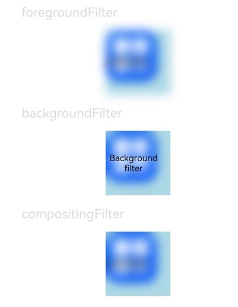

# Visual Effect
<!--Kit: ArkUI-->
<!--Subsystem: ArkUI-->
<!--Owner: @CCFFWW-->
<!--Designer: @CCFFWW-->
<!--Tester: @lxl007-->
<!--Adviser: @Brilliantry_Rui-->

The visual effect attributes set filter effects (such as blur and pixel stretch) and non-filter effects (such as point light) for components.

>  **NOTE**
>
>  The initial APIs of this module are supported since API version 12. Updates will be marked with a superscript to indicate their earliest API version.

## visualEffect

visualEffect(effect: VisualEffect): T

Sets a visual effect that is not a filter effect.

>**NOTE**
>
> This API can be called within [attributeModifier](ts-universal-attributes-attribute-modifier.md#attributemodifier) since API version 20.

**Atomic service API**: This API can be used in atomic services since API version 12.

**System capability**: SystemCapability.ArkUI.ArkUI.Full

**Parameters**

| Name| Type                                                        | Mandatory| Description                                                |
| ------ | ------------------------------------------------------------ | ---- | ---------------------------------------------------- |
| effect | [VisualEffect](#visualeffect-1) | Yes  | Visual effect.|

**Return value**

| Type| Description|
| -------- | -------- |
| T | Current component.|

## backgroundFilter

backgroundFilter(filter: Filter): T

Sets the visual effect of the background filter.

>**NOTE**
>
> This API can be called within [attributeModifier](ts-universal-attributes-attribute-modifier.md#attributemodifier) since API version 20.

**Atomic service API**: This API can be used in atomic services since API version 12.

**System capability**: SystemCapability.ArkUI.ArkUI.Full

**Parameters**

| Name| Type                                                        | Mandatory| Description                                                |
| ------ | ------------------------------------------------------------ | ---- | ---------------------------------------------------- |
| filter | [Filter](#filter) | Yes  | Visual effect of the background filter.|

**Return value**

| Type| Description|
| -------- | -------- |
| T | Current component.|

## foregroundFilter

foregroundFilter(filter: Filter): T

Sets the visual effect of the foreground (content) filter.

>**NOTE**
>
> This API can be called within [attributeModifier](ts-universal-attributes-attribute-modifier.md#attributemodifier) since API version 20.

**Atomic service API**: This API can be used in atomic services since API version 12.

**System capability**: SystemCapability.ArkUI.ArkUI.Full

**Parameters**

| Name| Type                                                        | Mandatory| Description                                                |
| ------ | ------------------------------------------------------------ | ---- | ---------------------------------------------------- |
| filter | [Filter](#filter) | Yes  | Visual effect of the foreground (content) filter.|

**Return value**

| Type| Description|
| -------- | -------- |
| T | Current component.|

## compositingFilter

compositingFilter(filter: Filter): T

Sets the visual effect of the compositing filter.

>**NOTE**
>
> This API can be called within [attributeModifier](ts-universal-attributes-attribute-modifier.md#attributemodifier) since API version 20.

**Atomic service API**: This API can be used in atomic services since API version 12.

**System capability**: SystemCapability.ArkUI.ArkUI.Full

**Parameters**

| Name| Type                                                        | Mandatory| Description                                                |
| ------ | ------------------------------------------------------------ | ---- | ---------------------------------------------------- |
| filter | [Filter](#filter) | Yes  | Visual effect of the compositing filter.|

**Return value**

| Type| Description|
| -------- | -------- |
| T | Current component.|

## Filter

type Filter = Filter

Represents a filter object.

**Atomic service API**: This API can be used in atomic services since API version 12.

**System capability**: SystemCapability.ArkUI.ArkUI.Full

| Type  | Description                    |
| ------ | ------------------------ |
| [Filter](../../apis-arkgraphics2d/js-apis-uiEffect.md#filter) | Used to apply the specified visual effect to the target component.|

## VisualEffect

type VisualEffect = VisualEffect

Represents a visual effect configuration object.

**Atomic service API**: This API can be used in atomic services since API version 12.

**System capability**: SystemCapability.ArkUI.ArkUI.Full

| Type  | Description                    |
| ------ | ------------------------ |
| [VisualEffect](../../apis-arkgraphics2d/js-apis-uiEffect.md#visualeffect) | Used to apply the specified visual effect to the target component.|

## Example

This example demonstrates how to apply blur effects using **foregroundFilter**, **backgroundFilter**, and **compositingFilter**.

```ts
// xxx.ets
import { uiEffect } from '@kit.ArkGraphics2D';

@Entry
@Component
struct FilterEffectExample {
  @State filterTest1: uiEffect.Filter = uiEffect.createFilter().blur(10);
  @State filterTest2: uiEffect.Filter = uiEffect.createFilter().blur(10);
  @State filterTest3: uiEffect.Filter = uiEffect.createFilter().blur(10);

  build() {
    Column({ space: 15 }) {

      Text('foregroundFilter').fontSize(20).width('75%').fontColor('#DCDCDC')
      Text('Foreground filter')
        .width(100)
        .height(100)
        .backgroundColor('#ADD8E6')
        .backgroundImage($r("app.media.app_icon"))
        .backgroundImageSize({ width: 80, height: 80 })
        .foregroundFilter(this.filterTest1) // Set the blur effect using foregroundFilter.

      Text('backgroundFilter').fontSize(20).width('75%').fontColor('#DCDCDC')
      Text('Background filter')
        .width(100)
        .height(100)
        .backgroundColor('#ADD8E6')
        .backgroundImage($r("app.media.app_icon"))
        .backgroundImageSize({ width: 80, height: 80 })
        .backgroundFilter(this.filterTest2) // Set the blur effect using backgroundFilter.

      Text('compositingFilter').fontSize(20).width('75%').fontColor('#DCDCDC')
      Text('Compositing filter')
        .width(100)
        .height(100)
        .backgroundColor('#ADD8E6')
        .backgroundImage($r("app.media.app_icon"))
        .backgroundImageSize({ width: 80, height: 80 })
        .compositingFilter(this.filterTest3) // Set the blur effect using compositingFilter.
    }
    .height('100%')
    .width('100%')
  }
}
```


