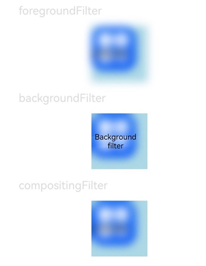

# Visual Effect
<!--Kit: ArkUI-->
<!--Subsystem: ArkUI-->
<!--Owner: @hehongyang3-->
<!--Designer: @hehongyang3-->
<!--Tester: @lxl007-->
<!--Adviser: @Brilliantry_Rui-->
<!-- md-trans-meta sourceCommit=39ca26def5c22dc659f3dc0b76ef62a29421e77a translatedAt=2026-09-01T12:29:57.488Z -->

This module provides APIs for setting component visual effects, including filter effects (such as blur and pixel expansion) and non-filter effects (such as point light sources).

>  **NOTE**
>
> - The initial APIs of this module are supported since API version 12. Updates will be marked with a superscript to indicate their earliest API version.
>
> - The APIs of this module can be used only in the stage model.

## visualEffect

visualEffect(effect: VisualEffect): T

Sets non-filter visual effects, such as point light sources. For details about the effects that can be added, see the method description of VisualEffect.

>**NOTE**
>
> This API can be called within [attributeModifier](ts-universal-attributes-attribute-modifier.md#attributemodifier) since API version 20.

**Atomic service API**: This API can be used in atomic services since API version 12.

**System capability**: SystemCapability.ArkUI.ArkUI.Full

**Parameters**

| Name| Type                                                        | Mandatory| Description                                                |
| ------ | ------------------------------------------------------------ | ---- | ---------------------------------------------------- |
| effect | [VisualEffect](#visualeffect-1) | Yes | Non-filter visual effect, such as a point light source. |

**Return value**

| Type| Description|
| -------- | -------- |
| T | Current component, used for chained calls. |

## backgroundFilter

backgroundFilter(filter: Filter): T

Sets the background filter visual effect, which applies to the background layer of the component. For the drawing order of each filter, see [materialFilter](#materialfilter23).

>**NOTE**
>
> This API can be called within [attributeModifier](ts-universal-attributes-attribute-modifier.md#attributemodifier) since API version 20.

**Atomic service API**: This API can be used in atomic services since API version 12.

**System capability**: SystemCapability.ArkUI.ArkUI.Full

**Parameters**

| Name| Type                                                        | Mandatory| Description                                                |
| ------ | ------------------------------------------------------------ | ---- | ---------------------------------------------------- |
| filter | [Filter](#filter) | Yes | Background filter visual effect, such as blur and pixel expansion. This filter is drawn after materialFilter and is located on the upper layer of materialFilter. |

**Return value**

| Type| Description|
| -------- | -------- |
| T | Current component, used for chained calls. |

## foregroundFilter

foregroundFilter(filter: Filter): T

Sets the foreground filter (content) visual effect, such as blur and pixel expansion. When multiple filters are set on the same component, the foreground filter is drawn above all other filters. The drawing order from bottom to top is: materialFilter → backgroundFilter → compositingFilter → foregroundFilter.

>**NOTE**
>
> This API can be called within [attributeModifier](ts-universal-attributes-attribute-modifier.md#attributemodifier) since API version 20.

**Atomic service API**: This API can be used in atomic services since API version 12.

**System capability**: SystemCapability.ArkUI.ArkUI.Full

**Parameters**

| Name| Type                                                        | Mandatory| Description                                                |
| ------ | ------------------------------------------------------------ | ---- | ---------------------------------------------------- |
| filter | [Filter](#filter) | Yes | Visual effect of the foreground filter (content), such as blur and pixel expansion. |

**Return value**

| Type| Description|
| -------- | -------- |
| T | Current component, used for chained calls. |

## compositingFilter

compositingFilter(filter: Filter): T

Sets the composite filter visual effect, such as blur and pixel expansion. The composite filter applies a filter effect to the overall image obtained after the component foreground and background are composited. When multiple filters are set on the same component, the composite filter is drawn above the background filter and below the foreground filter. The drawing order from bottom to top is: materialFilter → backgroundFilter → compositingFilter → foregroundFilter.

>**NOTE**
>
> This API can be called within [attributeModifier](ts-universal-attributes-attribute-modifier.md#attributemodifier) since API version 20.

**Atomic service API**: This API can be used in atomic services since API version 12.

**System capability**: SystemCapability.ArkUI.ArkUI.Full

**Parameters**

| Name| Type                                                        | Mandatory| Description                                                |
| ------ | ------------------------------------------------------------ | ---- | ---------------------------------------------------- |
| filter | [Filter](#filter) | Yes | Composite filter visual effect, such as blur, pixel expansion, and other filter effects. |

**Return value**

| Type| Description|
| -------- | -------- |
| T | Current component, used for chained calls. |

## materialFilter<sup>23+</sup>

materialFilter(filter: Filter \| undefined): T

Sets the system material filter visual effect. The system material is a material style predefined by the system. The system material filter is drawn prior to [backgroundFilter](#backgroundfilter), that is, it occupies a layer beneath backgroundFilter. The drawing order from bottom to top is: materialFilter → backgroundFilter → compositingFilter → foregroundFilter.

>**NOTE**
>
> This API can be called within [attributeModifier](ts-universal-attributes-attribute-modifier.md#attributemodifier).

**Atomic service API:** This API can be used in atomic services since API version 23.

**System capability**: SystemCapability.ArkUI.ArkUI.Full

**Parameters**

| Name| Type                                                        | Mandatory| Description                                                |
| ------ | ------------------------------------------------------------ | ---- | ---------------------------------------------------- |
| filter | [Filter](#filter) &nbsp;\|&nbsp; undefined | Yes | System material filter visual effect. This filter is drawn before backgroundFilter and is at a lower layer than backgroundFilter. When set to undefined, the system material filter effect is removed. |

**Return value**

| Type| Description|
| -------- | -------- |
| T | Current component, used for chained calls. |

## Filter

type Filter = import('../api/@ohos.graphics.uiEffect').default.Filter

Represents a filter object.

**Atomic service API**: This API can be used in atomic services since API version 12.

**System capability**: SystemCapability.ArkUI.ArkUI.Full

| Type  | Description                    |
| ------ | ------------------------ |
| import('../api/@ohos.graphics.uiEffect').default.[Filter](../../apis-arkgraphics2d/js-apis-uiEffect.md#filter) | Used to add a filter effect to the specified component. |

## VisualEffect

type VisualEffect = import('../api/@ohos.graphics.uiEffect').default.VisualEffect

Represents a visual effect configuration object.

**Atomic service API**: This API can be used in atomic services since API version 12.

**System capability**: SystemCapability.ArkUI.ArkUI.Full

| Type  | Description                    |
| ------ | ------------------------ |
| import('../api/@ohos.graphics.uiEffect').default.[VisualEffect](../../apis-arkgraphics2d/js-apis-uiEffect.md#visualeffect) | Used to add a non-filter visual effect to a specified component. |

## Example

This example demonstrates how to apply blur effects using **foregroundFilter**, **backgroundFilter**, and **compositingFilter**.

```ts
// xxx.ets
import { uiEffect } from '@kit.ArkGraphics2D';

@Entry
@Component
struct FilterEffectExample {
  @State foregroundBlurFilter: uiEffect.Filter = uiEffect.createFilter().blur(10);
  @State backgroundBlurFilter: uiEffect.Filter = uiEffect.createFilter().blur(10);
  @State compositingBlurFilter: uiEffect.Filter = uiEffect.createFilter().blur(10);

  build() {
    Column({ space: 15 }) {

      Text('foregroundFilter').fontSize(20).width('75%').fontColor('#DCDCDC')
      Text('Foreground filter')
        .width(100)
        .height(100)
        .backgroundColor('#ADD8E6')
        // $r("app.media.app_icon") requires an image resource file named app_icon to be prepared in the "resources/base/media" directory of the project.
        .backgroundImage($r('app.media.app_icon'))
        .backgroundImageSize({ width: 80, height: 80 })
        .foregroundFilter(this.foregroundBlurFilter) // Set the blur effect through foregroundFilter.

      Text('backgroundFilter').fontSize(20).width('75%').fontColor('#DCDCDC')
      Text('Background filter')
        .width(100)
        .height(100)
        .backgroundColor('#ADD8E6')
        // Replace $r("app.media.app_icon") with the resource file you use.
        .backgroundImage($r('app.media.app_icon'))
        .backgroundImageSize({ width: 80, height: 80 })
        .backgroundFilter(this.backgroundBlurFilter) // Set the blur effect through backgroundFilter.

      Text('compositingFilter').fontSize(20).width('75%').fontColor('#DCDCDC')
      Text('Compositing filter')
        .width(100)
        .height(100)
        .backgroundColor('#ADD8E6')
        // Replace $r("app.media.app_icon") with the resource file you use.
        .backgroundImage($r('app.media.app_icon'))
        .backgroundImageSize({ width: 80, height: 80 })
        .compositingFilter(this.compositingBlurFilter) // Set the blur effect through compositingFilter.
    }
    .height('100%')
    .width('100%')
  }
}
```


