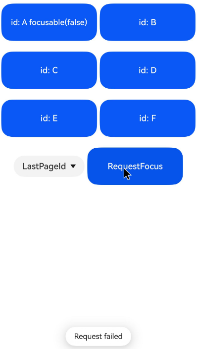
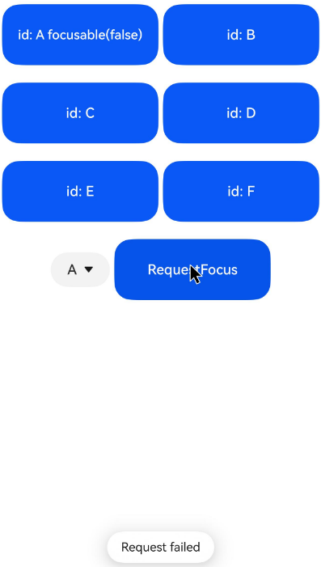
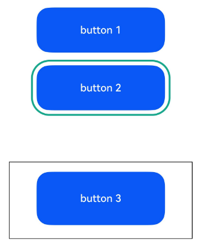
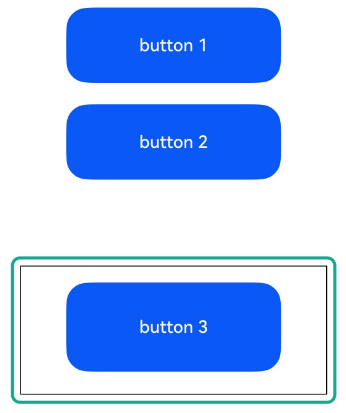
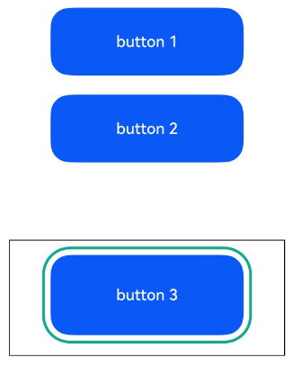
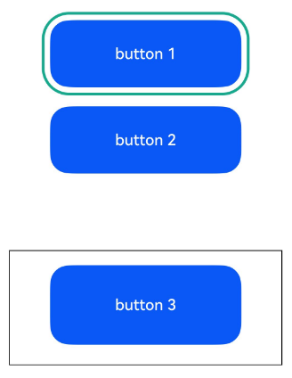

# Focus Control

<!--Kit: ArkUI-->
<!--Subsystem: ArkUI-->
<!--Owner: @yihao-lin-->
<!--Designer: @piggyguy-->
<!--Tester: @songyanhong-->
<!--Adviser: @Brilliantry_Rui-->
<!-- md-trans-meta sourceCommit=8de0c2610841efa4333c462e6a318256c709bce8 translatedAt=2026-08-24T06:56:57.641Z pushedAt=2026-08-25T07:34:51.247Z -->

Focus control manages the focus capability and focus movement behavior of components. It supports setting whether a component can gain focus, the default focus, focus on touch, focus box style, focus group and focus priority, Tab key and arrow key focus navigation order, focus stay rules, as well as actively requesting focus and customizing focus navigation logic through APIs. It is suitable for non-touch interaction scenarios such as keyboards and remote controls, helping improve focus navigation efficiency on complex pages.

>  **NOTE**
>
>  - The initial APIs of this module are supported since API version 8. Updates will be marked with a superscript to indicate their earliest API version.
>
>  - Custom components do not have the focus capability. Setting [focusable](#focusable), [enabled](ts-universal-attributes-enable.md#enabled), and other attributes to false, or setting the [visibility](ts-universal-attributes-visibility.md#visibility) attribute to Hidden or None, does not affect the focus capability of their child components.
>
>  - A component actively obtaining focus is not controlled by the window focus.
>
>  - For focus development, see [Implementing Focus Support](../../../ui/arkts-common-events-focus-event.md).

## focusable

focusable(value: boolean): T

Sets whether the component is focusable.

**Atomic service API**: This API can be used in atomic services since API version 11.

**System capability**: SystemCapability.ArkUI.ArkUI.Full

**Parameters**

| Name| Type   | Mandatory| Description                                                        |
| ------ | ------- | ---- | ------------------------------------------------------------ |
| value  | boolean | Yes  | Whether the current component can gain focus. The value **true** means the component can gain focus, and the value **false** means the opposite.<br>**NOTE**<br>Components with default interaction logic, such as [Button](ts-basic-components-button.md) and [TextInput](ts-basic-components-textinput.md), are focusable by default, while components such as [Text](ts-basic-components-text.md) and [Image](ts-basic-components-image.md) are not focusable by default. In the non-focusable state, the [focus event](ts-universal-focus-event.md) cannot be triggered. |

**Return value**

| Type| Description|
| -------- | -------- |
| T | Current component.|

## tabIndex<sup>9+</sup>

tabIndex(index: number): T

Sets the Tab key focus navigation capability of the component. When **tabIndex** is not set for the component, focus movement follows the preset focus movement rules by default.

>  **NOTE**
>
>  - **tabIndex** only customizes **Tab** key navigation. For arrow key navigation customization, use [nextFocus](#nextfocus18).

**Atomic service API**: This API can be used in atomic services since API version 11.

**System capability**: SystemCapability.ArkUI.ArkUI.Full

**Parameters**

<!--Table: 10%; 10%; 10%; 70%-->

| Name| Type  | Mandatory| Description           |
| ------ | ------ | ---- | ------------------------------------ |
| index  | number | Yes   | Index for the Tab key focus navigation order of the component. If there are components with **tabIndex** greater than 0, Tab key focus navigation traverses only the components with **tabIndex** greater than 0, in ascending order of **tabIndex** values and cyclically. If there is no component with **tabIndex** greater than 0, components with **tabIndex** equal to 0 are traversed according to the preset focus navigation rules of the components.<br>The [UiExtension](../js-apis-arkui-uiExtension.md) component does not adapt to **tabIndex**. Using **tabIndex** in a [hierarchical page](../../../ui/arkts-common-events-focus-event.md#basic-concepts) that contains a [UiExtension](../js-apis-arkui-uiExtension.md) component causes focus navigation disorder.<br>- **tabIndex** greater than 0: indicates that the element is focusable and can be accessed through Tab key focus navigation.<br>- **tabIndex** equal to 0: indicates that the element is focusable and can be accessed through Tab key focus navigation when no node with **tabIndex** greater than 0 exists in the hierarchical page.<br>- **tabIndex** less than 0 (usually **tabIndex** equal to -1): indicates that the element is focusable but cannot be accessed through Tab key focus navigation.<br> **NOTE**<br>**tabIndex** and **focusScopeId** cannot be used together; otherwise, the focus navigation result may not meet expectations.|

**Return value**

| Type| Description|
| -------- | -------- |
| T | Current component.|

## defaultFocus<sup>9+</sup>

defaultFocus(value: boolean): T

Sets whether the current component is the default focus on the current [hierarchical page](../../../ui/arkts-common-events-focus-event.md#basic-concepts). When **defaultFocus** is not set, the component is not the default focus of the current hierarchical page by default. Difference from [groupDefaultFocus](#groupdefaultfocus9): **defaultFocus** takes effect within the hierarchical page scope, while **groupDefaultFocus** takes effect within the container focus scope. The two can be used simultaneously but take effect in different scopes.

>  **NOTE**
>
>  Pages that can set the default focus refer to container components that support page routing or pop-up types, such as **Page**, **NavDestination**, **NavBar**, **PopUp**, and **Dialog**.

**Atomic service API**: This API can be used in atomic services since API version 11.

**System capability**: SystemCapability.ArkUI.ArkUI.Full

**Parameters**

<!--Table: 10%; 10%; 10%; 70%-->

| Name| Type   | Mandatory| Description                                                        |
| ------ | ------- | ---- | ------------------------------------------------------------ |
| value  | boolean | Yes   | Whether the current component is the default focus on the current [hierarchical page](../../../ui/arkts-common-events-focus-event.md#basic-concepts). This takes effect only when the [hierarchical page](../../../ui/arkts-common-events-focus-event.md#basic-concepts) is entered for the first time after initial creation.<br>**NOTE**<br>The value **true** indicates that the component is the default focus, and **false** indicates that it is not.<br>If no component in the [hierarchical page](../../../ui/arkts-common-events-focus-event.md#basic-concepts) has **defaultFocus(true)** set, before API version 11, the default focus of the [hierarchical page](../../../ui/arkts-common-events-focus-event.md#basic-concepts) is the first focusable non-container component on the current [hierarchical page](../../../ui/arkts-common-events-focus-event.md#basic-concepts); from API version 11 onward, the default focus of the [hierarchical page](../../../ui/arkts-common-events-focus-event.md#basic-concepts) is the root container of the [hierarchical page](../../../ui/arkts-common-events-focus-event.md#basic-concepts).<br>If multiple components in a [hierarchical page](../../../ui/arkts-common-events-focus-event.md#basic-concepts) have **defaultFocus(true)** set, the first component found by depth-first traversal of the component tree is used as the default focus. |

**Return value**

| Type| Description|
| -------- | -------- |
| T | Current component.|

## groupDefaultFocus<sup>9+</sup>

groupDefaultFocus(value: boolean): T

Specifies whether to set the component as the default focus of the container. If **groupDefaultFocus** is not set, the component will not receive focus by default when its container is focused.

**Atomic service API**: This API can be used in atomic services since API version 11.

**System capability**: SystemCapability.ArkUI.ArkUI.Full

**Parameters**

<!--Table: 10%; 10%; 10%; 70%-->

| Name| Type   | Mandatory| Description                                                        |
| ------ | ------- | ---- | ------------------------------------------------------------ |
| value  | boolean | Yes  | Whether the current component is the default focus when the container where it resides gains focus. This takes effect only when the container node is created and gains focus for the first time. The value **true** means that the current component is the default focus when the container where it resides gains focus, and **false** means the opposite.<br>**NOTE**<br>This attribute must be used together with [tabIndex](#tabindex9). Setting **groupDefaultFocus** alone does not take effect. When a container has **tabIndex** set and a child component inside the container or the container itself has **groupDefaultFocus**(**true**) set, the focus is automatically transferred to the specified component when the container gains focus through the Tab key for the first time. If multiple components inside the container (including the container itself) have **groupDefaultFocus**(**true**) set, the first component found through depth-first traversal of the component tree is used as the final result. |

**Return value**

| Type| Description|
| -------- | -------- |
| T | Current component.|

## focusOnTouch<sup>9+</sup>

focusOnTouch(value: boolean): T

Sets whether the component is focusable on touch. If **focusOnTouch** is not set, the component is not focusable on touch by default.

**Atomic service API**: This API can be used in atomic services since API version 11.

**System capability**: SystemCapability.ArkUI.ArkUI.Full

**Parameters**

| Name| Type   | Mandatory| Description                                                        |
| ------ | ------- | ---- | ------------------------------------------------------------ |
| value  | boolean | Yes   | Whether the current component supports the tap-to-focus capability. **true** indicates that the component supports tap-to-focus, and **false** indicates the opposite.<br>**NOTE**<br>The component can gain focus only when it is tappable and focusable. |

**Return value**

| Type| Description|
| -------- | -------- |
| T | Current component.|

## focusBox<sup>12+</sup>

focusBox(style: FocusBoxStyle): T

Sets the system focus box style for the component.

**Atomic service API**: This API can be used in atomic services since API version 12.

**Model restriction**: This API can be used only in the stage model.

**System capability**: SystemCapability.ArkUI.ArkUI.Full

**Parameters**

| Name| Type| Mandatory| Description|
| ---- | ---- | ---- | ---- |
| style  | [FocusBoxStyle](#focusboxstyle12) | Yes   | System focus box style of the current component.<br>**NOTE**<br>Only affects components that display the system focus box during focus navigation. |

**Return value**

| Type| Description|
| -------- | -------- |
| T | Current component.|

## focusControl<sup>9+</sup>

Focus control module, used to actively request focus for a specified component through APIs. It is suitable for scenarios where focus transfer needs to be actively controlled in code.

> **NOTE**
>
> Directly using **focusControl** may lead to the issue of [ambiguous UI context](../../../ui/arkts-global-interface.md#ambiguous-ui-context). It is recommended that you use **getUIContext()** to obtain a [UIContext](../arkts-apis-uicontext-uicontext.md) instance, and use [getFocusController](../arkts-apis-uicontext-uicontext.md#getfocuscontroller12) to obtain the **focusControl** bound to the instance.

**Atomic service API**: This API can be used in atomic services since API version 11.

**System capability**: SystemCapability.ArkUI.ArkUI.Full

### requestFocus<sup>9+</sup>

requestFocus(value: string): boolean

Global API that transfers focus to the component specified by the parameter during the next frame rendering.

For scenarios requiring immediate focus changes, it is recommended that you use the focus synchronization transfer API [requestFocus](../arkts-apis-uicontext-focuscontroller.md#requestfocus12) in **FocusController**.

**Atomic service API**: This API can be used in atomic services since API version 11.

**System capability**: SystemCapability.ArkUI.ArkUI.Full

**Parameters**

| Name| Type| Mandatory| Description|
| ----- | ------ | ---- | ---- |
| value | string | Yes  | String bound to the target component using **key(value: string)** or **id(value: string)**.|

**Return value**

| Type| Description|
| ------- | ---- |
| boolean | Returns whether focus transfer is successfully requested for the target component. If the target component pointed to by the parameter exists, is mounted to the component tree, and is focusable, **true** is returned. Otherwise, **false** is returned.|

>  **NOTE**
>
>  The following components support focus control: [TextInput](ts-basic-components-textinput.md), [TextArea](ts-basic-components-textarea.md), [Search](ts-basic-components-search.md), [Button](ts-basic-components-button.md), [Text](ts-basic-components-text.md), [Image](ts-basic-components-image.md), [List](ts-container-list.md), [Grid](ts-container-grid.md). Currently, the running effect of the focus event can be displayed only on a real device.

## FocusBoxStyle<sup>12+</sup>

Sets the system focus box style for the component.

**Atomic service API**: This API can be used in atomic services since API version 12.

**Model restriction**: This API can be used only in the stage model.

**System capability**: SystemCapability.ArkUI.ArkUI.Full

| Name| Type|  Read-Only| Optional| Description |
| ---- | ---- | ---- |  ---- | ---- |
| margin  | [LengthMetrics](../js-apis-arkui-graphics.md#lengthmetrics12) | No | Yes |Distance between the focus box and the component edge.<br>A positive value indicates the outside, and a negative value indicates the inside. Percentages are not supported. If not set, the default focus box margin **2.0vp** is used. |
| strokeColor  | [ColorMetrics](../js-apis-arkui-graphics.md#colormetrics12) | No | Yes |Focus box color. If not set, the default focus box color **#FF007DFF** is used. |
| strokeWidth | [LengthMetrics](../js-apis-arkui-graphics.md#lengthmetrics12) | No | Yes |Focus box width.<br>Negative values and percentages are not supported. If not set, the default focus box width **2.0vp** is used.|

## focusScopePriority<sup>12+</sup>

focusScopePriority(scopeId: string, priority?: FocusPriority): T

Sets the focus priority of this component in a specified container. It must be used together with [focusScopeId](#focusscopeid12).

**Atomic service API**: This API can be used in atomic services since API version 12.

**Model restriction**: This API can be used only in the stage model.

**System capability**: SystemCapability.ArkUI.ArkUI.Full

**Parameters**

| Name| Type   | Mandatory| Description                                                        |
| ------ | ------- | ---- | ------------------------------------------------------------ |
| scopeId  | string | Yes  | ID of the container component in which the focus priority set for the current component takes effect.<br>**NOTE**<br>1. The current component must be inside the container identified by **scopeId**, or its owning container must be inside the container identified by **scopeId**.<br>2. A component cannot be set with multiple priorities repeatedly. Repeated setting may cause the container to select an unexpected priority component when gaining focus.<br>3. A container component with **focusScopeId** set cannot be set with a priority; otherwise, the set priority does not take effect. |
| priority  | [FocusPriority](#focuspriority12)  | No  | Focus priority.<br>**NOTE**<br>If **priority** is not set, the AUTO priority is used by default.<br>Impact of priority on focus navigation and the focused component:<br>1. When the container gains focus as a whole (switching of [hierarchical pages](../../../ui/arkts-common-events-focus-event.md#basic-concepts)/focus switching to a focus group/**requestFocus** called by a container component), if a component with the **PREVIOUS** priority exists in the container, that component gains focus; otherwise, the component that last gained focus in the container gains focus.<br>2. When the container does not gain focus as a whole (focus navigation using the Tab key or arrow keys in a non-focus-group scenario), if the container gains focus for the first time, the component with the highest priority in the container gains focus; if the container does not gain focus for the first time, focus navigation follows the preset focus navigation algorithm of the container without considering priority. |

**Return value**

| Type| Description|
| -------- | -------- |
| T | Current component.|

### FocusPriority<sup>12+</sup>

Sets the focus priority of the component.

**Atomic service API**: This API can be used in atomic services since API version 12.

**Model restriction**: This API can be used only in the stage model.

**System capability**: SystemCapability.ArkUI.ArkUI.Full

| Name   | Value     | Description       |
| ----------- | ----- |-------- |
| AUTO | 0|Default priority, that is, the focus priority assigned by default.|
| PRIOR | 2000 | Priority for a container to gain focus first when it gains focus for the first time. The priority is higher than **AUTO**. |
| PREVIOUS | 3000|Priority of a previously focused node in the container. This level is higher than **PRIOR**.|

## KeyProcessingMode<sup>15+</sup>

Sets the mode for processing key events.

**Atomic service API**: This API can be used in atomic services since API version 15.

**Model restriction**: This API can be used only in the stage model.

**System capability**: SystemCapability.ArkUI.ArkUI.Full

| Name    | Value   | Description       |
| -----------| ----------- | --------- |
| FOCUS_NAVIGATION  | 0 | Default value. When the current component does not consume the key, the Tab/arrow keys prioritize focus navigation within the current container. |
| ANCESTOR_EVENT  | 1  |  When the current component does not consume the key, the Tab/arrow keys prioritize bubbling the event to the parent component. |

## focusScopeId<sup>12+</sup>

focusScopeId(id: string, isGroup?: boolean): T

Assigns an ID to this container component and specifies whether the container is a focus group.

**Atomic service API**: This API can be used in atomic services since API version 12.

**Model restriction**: This API can be used only in the stage model.

**System capability**: SystemCapability.ArkUI.ArkUI.Full

**Parameters**

| Name| Type   | Mandatory| Description                                                        |
| ------ | ------- | ---- | ------------------------------------------------------------ |
| id  | string | Yes  | ID of the current container component.<br>**Note:** <br>Within a single [hierarchical page](../../../ui/arkts-common-events-focus-event.md#basic-concepts), the ID must be globally unique. If IDs are duplicated, the later-set ID does not take effect, the later-set component cannot become the focus scope or focus group corresponding to that ID, and the focus priority set for that ID inside it does not take effect either. |
| isGroup  | boolean | No  | Whether the current container component is a focus group. The value **true** means that the container component is a focus group, and **false** means that it is not. The default value is **false**.<br>**Note:** <br>Focus groups cannot be nested. When nested, the inner focus group does not take effect independently, and focus navigation mainly follows the rules of the outer focus group.<br>The same component cannot have both **focusScopeId** and **tabIndex** set. Mixing them does not throw an exception, but Tab key focus navigation is affected by the **tabIndex** rule. When **tabIndex** is greater than 0, the focus group may be selected by the Tab key and cannot jump out as expected.<br>The purpose of configuring a focus group is to enable the container and the elements inside it to navigate focus according to the focus group rules. The focus group navigation rules are as follows:<br>1. Within a focus group container, focus can be navigated only by using the arrow keys. The Tab key moves focus out of the focus group container.<br>2. When focus is switched from outside the focus group container to inside it by using the arrow keys, if there is a component with the priority **PREVIOUS** inside the focus group container, that component gains focus; otherwise, the component that last gained focus inside the focus group container gains focus.|

**Return value**

| Type| Description|
| -------- | -------- |
| T | Current component.|

## focusScopeId<sup>14+</sup>

focusScopeId(id: string, isGroup?: boolean, arrowStepOut?: boolean): T

Sets the ID of the current container component and whether it is a focus group. The new parameter arrowStepOut sets whether the arrow keys can be used to navigate focus out of the current focus group.

**Atomic service API**: This API can be used in atomic services since API version 14.

**Model restriction**: This API can be used only in the stage model.

**System capability**: SystemCapability.ArkUI.ArkUI.Full

**Parameters**

| Name| Type   | Mandatory| Description                                                        |
| ------ | ------- | ---- | ------------------------------------------------------------ |
| id  | string | Yes   | ID of the current container component.<br>**NOTE**<br>Within a single [hierarchical page](../../../ui/arkts-common-events-focus-event.md#basic-concepts), the ID must be globally unique. If IDs are duplicated, the ID set later does not take effect, the component set later cannot become the focus scope or focus group corresponding to that ID, and the focus priority set for that ID inside it does not take effect either. |
| isGroup  | boolean | No   | Whether the current container component is a focus group. The value **true** indicates that the container component is a focus group, and **false** indicates that it is not. The default value is **false**.<br>**NOTE**<br>Focus groups cannot be nested. When nested, the inner focus group does not take effect independently, and focus navigation mainly follows the rules of the outer focus group.<br>The same component cannot have both **focusScopeId** and **tabIndex** set. Mixing them does not throw an exception, but Tab key focus navigation is affected by the **tabIndex** rule. When **tabIndex** is greater than 0, the focus group may be selected by the Tab key and cannot jump out as expected.<br>The purpose of configuring a focus group is to enable the container and the elements inside it to navigate focus according to the focus group rules. The focus group navigation rules are as follows:<br>1. Within a focus group container, focus can be navigated only by using the arrow keys. The Tab key moves focus out of the focus group container.<br>2. When focus is switched from outside the focus group container to inside it by using the arrow keys, if a component with the priority **PREVIOUS** exists in the focus group container, that component gains focus; otherwise, the component that last gained focus in the focus group container gains focus.|
| arrowStepOut  | boolean | No  | Whether the focus can be moved out of the current focus group using arrow keys. <br>**true**: The focus can be moved out of the current focus group using arrow keys.<br>**false**: The focus cannot be moved out of the current focus group using arrow keys.<br> The default value is **true**.|

**Return value**

| Type| Description|
| -------- | -------- |
| T | Current component.|

## tabStop<sup>14+</sup>

tabStop(isTabStop: boolean): T

Sets the **tabStop** of the current container component, which determines whether the focus stays at the current container during focus traversal. When not set, **tabStop** defaults to **false**, and the focus does not stay at the current container due to **tabStop** during focus traversal.

**Atomic service API**: This API can be used in atomic services since API version 14.

**Model restriction**: This API can be used only in the stage model.

**System capability**: SystemCapability.ArkUI.ArkUI.Full

**Parameters**

<!--Table: auto; 10%; 10%; auto-->

| Name| Type   | Mandatory| Description                                                        |
| ------ | ------- | ---- | ------------------------------------------------------------ |
| isTabStop  | boolean  | Yes   | Whether the current container component is a focus-stay container. The value **true** means that the current container component is a focus-stay container, and **false** means the opposite.<br>**NOTE**<br>1. To configure **tabStop**, ensure that the component is a container component with focusable child components. By default, a container component cannot directly gain focus.<br>2. When focus is requested through [requestFocus](../arkts-apis-uicontext-focuscontroller.md#requestfocus12), if the component is a container component with **tabStop** configured, the focus can stay on the container component. If the target container component does not have **tabStop** configured, the target component can still gain focus even if there is a component with **tabStop** configured on the entire focus chain.<br>3. Containers with **tabStop** configured cannot be nested more than two levels.<br>**tabStop** focus navigation rules:<br>1. When navigating focus with the Tab key and arrow keys, the focus stays on the component with **tabStop** configured. If the focus stays inside a container with **tabStop** configured, it can navigate to the next focusable component inside the container. If the focus stays outside a container with **tabStop** configured, it can navigate to the next focusable component outside the container.<br>2. When the focus stays on **tabStop**, pressing Enter navigates the focus to the first focusable component inside, pressing ESC returns the focus to the previous component with **tabStop** configured that does not exceed the root container of the current [hierarchical page](../../../ui/arkts-common-events-focus-event.md#basic-concepts), and pressing the spacebar triggers the **onClick** event of the container.<br>3. Configuring **tabStop** on the root container is not recommended. If the root container has **tabStop** configured, after the focus is cleared to the root container through [clearFocus](../arkts-apis-uicontext-focuscontroller.md#clearfocus12), pressing Enter navigates the focus back to the last focused component inside, and after the focus is cleared to the root container through the ESC key, pressing Enter navigates the focus to the first focusable component inside.|

**Return value**

| Type| Description|
| -------- | -------- |
| T | Current component.|

**Describe the keys during focus navigation and the focused component**


If the current focus stays on **button2**, pressing the **Tab** key navigates the focus to **Column3**, and pressing the **Tab** key again cycles the focus back to **button1**.

## nextFocus<sup>18+</sup>

nextFocus(nextStep: Optional\<FocusMovement>): T

Sets the custom focus navigation logic of the component, suitable for scenarios where the focus flow needs to be precisely controlled.

**Atomic service API**: This API can be used in atomic services since API version 18.

**Model restriction**: This API can be used only in the stage model.

**System capability**: SystemCapability.ArkUI.ArkUI.Full

**Parameters**

| Name| Type   | Mandatory| Description                                                        |
| ------ | ------- | ---- | ------------------------------------------------------------ |
| nextStep  | Optional\<[FocusMovement](#focusmovement18)> | Yes | Custom focus navigation rule for the current component.<br>**NOTE**<br>The default value resets **nextStep** to empty.<br>If no custom focus navigation rule is set, or if the target component specified in the custom focus navigation rule does not exist, the default focus navigation rule is still used for focus navigation.|

**Return value**

| Type| Description|
| -------- | -------- |
| T | Current component.|

## FocusMovement<sup>18+</sup>

Sets the target component for focus navigation corresponding to the key. If not set, the default focus navigation rules are followed.

**Atomic service API**: This API can be used in atomic services since API version 18.

**Model restriction**: This API can be used only in the stage model.

**System capability**: SystemCapability.ArkUI.ArkUI.Full

| Name| Type| Read-Only| Optional| Description|
| ---- | ---- | ---- | ---- | ---- |
| forward  | string | No  | Yes  | Navigates focus to the component [id](ts-universal-attributes-component-id.md#id) by pressing the **Tab** key.<br>The default value resets **forward** to empty. |
| backward  | string | No  | Yes  | Navigates focus to the component id by pressing **Shift** + **Tab**.<br>The default value resets **backward** to empty. |
| up  | string | No  | Yes  | Navigates focus to the component id by pressing the Up arrow key.<br>The default value resets **up** to empty. |
| down  | string | No  | Yes  | Navigates focus to the component id by pressing the Down arrow key.<br>The default value resets **down** to empty. |
| left  | string | No  | Yes  | Navigates focus to the component id by pressing the Left arrow key.<br>The default value resets **left** to empty. |
| right  | string | No  | Yes  | Navigates focus to the component id by pressing the Right arrow key.<br>The default value resets **right** to empty. |

## Example

### Example 1: Setting Focus and Focus Traversal Effects for Components

This example shows how to use [defaultFocus](#defaultfocus9), [groupDefaultFocus](#groupdefaultfocus9), and [focusOnTouch](#focusontouch9). **defaultFocus** sets the bound component as the initial focus after the [hierarchical page](../../../ui/arkts-common-events-focus-event.md#basic-concepts) is created. **groupDefaultFocus** sets the bound component as the initial focus after the container with the specified **tabIndex** is created. **focusOnTouch** sets the bound component to obtain focus upon being clicked.

```ts
// focusTest.ets
@Entry
@Component
struct FocusableExample {
  @State inputValue: string = '';

  build() {
    Scroll() {
      Row({ space: 20 }) {
        Column({ space: 20 }) {
          Column({ space: 5 }) {
            Button('Group1')
              .width(165)
              .height(40)
              .fontColor(Color.White)
              .focusOnTouch(true) // The button is focusable on touch.
            Row({ space: 5 }) {
              Button()
                .width(80)
                .height(40)
                .fontColor(Color.White)
              Button()
                .width(80)
                .height(40)
                .fontColor(Color.White)
                .focusOnTouch(true) // The button is focusable on touch.
            }

            Row({ space: 5 }) {
              Button()
                .width(80)
                .height(40)
                .fontColor(Color.White)
              Button()
                .width(80)
                .height(40)
                .fontColor(Color.White)
            }
          }.borderWidth(2).borderColor(Color.Red).borderStyle(BorderStyle.Dashed)
          .tabIndex(1) // This Column component is the first component to gain focus when navigating with the Tab key.
          Column({ space: 5 }) {
            Button('Group2')
              .width(165)
              .height(40)
              .fontColor(Color.White)
            Row({ space: 5 }) {
              Button()
                .width(80)
                .height(40)
                .fontColor(Color.White)
              Button()
                .width(80)
                .height(40)
                .fontColor(Color.White)
                .groupDefaultFocus(true) // The button obtains focus when its upper-level column is in focus.
            }

            Row({ space: 5 }) {
              Button()
                .width(80)
                .height(40)
                .fontColor(Color.White)
              Button()
                .width(80)
                .height(40)
                .fontColor(Color.White)
            }
          }.borderWidth(2).borderColor(Color.Green).borderStyle(BorderStyle.Dashed)
          .tabIndex(2) // This Column component is the second component to gain focus when navigating with the Tab key.
        }

        Column({ space: 5 }) {
          TextInput({ placeholder: 'input', text: this.inputValue })
            .onChange((value: string) => {
              this.inputValue = value;
            })
            .width(156)
            .defaultFocus(true) // The TextInput component is the initial default focus of the hierarchical page.
          Button('Group3')
            .width(165)
            .height(40)
            .fontColor(Color.White)
          Row({ space: 5 }) {
            Button()
              .width(80)
              .height(40)
              .fontColor(Color.White)
            Button()
              .width(80)
              .height(40)
              .fontColor(Color.White)
          }

          Button()
            .width(165)
            .height(40)
            .fontColor(Color.White)
          Row({ space: 5 }) {
            Button()
              .width(80)
              .height(40)
              .fontColor(Color.White)
            Button()
              .width(80)
              .height(40)
              .fontColor(Color.White)
          }

          Button()
            .width(165)
            .height(40)
            .fontColor(Color.White)
          Row({ space: 5 }) {
            Button()
              .width(80)
              .height(40)
              .fontColor(Color.White)
            Button()
              .width(80)
              .height(40)
              .fontColor(Color.White)
          }
        }.borderWidth(2).borderColor(Color.Orange).borderStyle(BorderStyle.Dashed)
        .tabIndex(3) // This Column component is the third component to gain focus when navigating with the Tab key.
      }.alignItems(VerticalAlign.Top)
    }
  }
}
```

Diagrams:

On first-time access, the focus is on the **TextInput** component bound to **defaultFocus**.


When the **Tab** key is pressed for the first time, the focus switches to the container with **tabIndex(1)**, and automatically navigates to the first focusable component inside it:


When the **Tab** key is pressed for the second time, the focus switches to the container with **tabIndex(2)**, and automatically navigates to the component bound to **groupDefaultFocus** inside it:


When the **Tab** key is pressed for the third time, the focus switches to the container with **tabIndex(3)**, and automatically navigates to the component configured with **defaultFocus** inside it:


Tap the component bound to **focusOnTouch**, the component itself gains focus, the focus box is cleared, and after pressing the **Tab** key again, the focus box is displayed:


### Example 2: Setting Focus on a Specific Component

This example demonstrates how to set focus on a specific component using [focusControl.requestFocus](#requestfocus9).

```ts
// requestFocus.ets
@Entry
@Component
struct RequestFocusExample {
  @State idList: string[] = ['A', 'B', 'C', 'D', 'E', 'F', 'LastPageId'];
  @State selectId: string = 'LastPageId';

  build() {
    Column({ space: 20 }) {
      Row({ space: 5 }) {
        Button('id: ' + this.idList[0] + ' focusable(false)')
          .width(180)
          .height(70)
          .fontColor(Color.White)
          .id(this.idList[0])
          .focusable(false)
        Button('id: ' + this.idList[1])
          .width(180).height(70).fontColor(Color.White)
          .id(this.idList[1])
      }

      Row({ space: 5 }) {
        Button('id: ' + this.idList[2])
          .width(180).height(70).fontColor(Color.White)
          .id(this.idList[2])
        Button('id: ' + this.idList[3])
          .width(180).height(70).fontColor(Color.White)
          .id(this.idList[3])
      }

      Row({ space: 5 }) {
        Button('id: ' + this.idList[4])
          .width(180).height(70).fontColor(Color.White)
          .id(this.idList[4])
        Button('id: ' + this.idList[5])
          .width(180).height(70).fontColor(Color.White)
          .id(this.idList[5])
      }

      Row({ space: 5 }) {
        Select([{ value: this.idList[0] },
          { value: this.idList[1] },
          { value: this.idList[2] },
          { value: this.idList[3] },
          { value: this.idList[4] },
          { value: this.idList[5] },
          { value: this.idList[6] }])
          .value(this.selectId)
          .onSelect((index: number) => {
            this.selectId = this.idList[index];
          })
        Button('RequestFocus')
          .width(180).height(70).fontColor(Color.White)
          .onClick(() => {
            // You are advised to use this.getUIContext().getFocusController().requestFocus().
            let res = focusControl.requestFocus(this.selectId); // Make the component selected by this.selectId gain focus.
            if (res) {
              this.getUIContext().getPromptAction().showToast({ message: 'Request success' })
            } else {
              this.getUIContext().getPromptAction().showToast({ message: 'Request failed' })
            }
          })
      }
    }.width('100%').margin({ top: 20 })
  }
}
```

Diagrams:

Press the **Tab** key to activate the focus state display.

Below shows how the UI behaves when you request focus for a component that does not exist.



Below shows how the UI behaves when you request focus for a component that is not focusable.



Below shows how the UI behaves when you request focus for a focusable component.


### Example 3: Customizing the Focus Box Style

This example shows how to change the focus box style of a component by configuring [focusBox](#focusbox12).

```ts
import { ColorMetrics, LengthMetrics } from '@kit.ArkUI';

@Entry
@Component
struct FocusBoxExample {
  build() {
    Column({ space: 30 }) {
      Button('small black focus box')
        .focusBox({
          margin: new LengthMetrics(0),
          strokeColor: ColorMetrics.rgba(0, 0, 0),
        })
      Button('large red focus box')
        .focusBox({
          margin: LengthMetrics.px(20),
          strokeColor: ColorMetrics.rgba(255, 0, 0),
          strokeWidth: LengthMetrics.px(10)
        })
    }
    .alignItems(HorizontalAlign.Center)
    .width('100%')
  }
}
```


### Example 4: Setting Focus Group Traversal

This example demonstrates how to set a component as the initial focus when its container gains focus by configuring [focusScopePriority](#focusscopepriority12). Configuring [focusScopeId](#focusscopeid12) allows the bound container component to become a focus group.

```ts
// focusTest.ets
@Entry
@Component
struct FocusableExample {
  @State inputValue: string = '';

  build() {
    Scroll() {
      Row({ space: 20 }) {
        Column({ space: 20 }) { // Labeled as Column1.
          Column({ space: 5 }) {
            Button('Group1')
              .width(165)
              .height(40)
              .fontColor(Color.White)
            Row({ space: 5 }) {
              Button()
                .width(80)
                .height(40)
                .fontColor(Color.White)
              Button()
                .width(80)
                .height(40)
                .fontColor(Color.White)
            }

            Row({ space: 5 }) {
              Button()
                .width(80)
                .height(40)
                .fontColor(Color.White)
              Button()
                .width(80)
                .height(40)
                .fontColor(Color.White)
            }
          }.borderWidth(2).borderColor(Color.Red).borderStyle(BorderStyle.Dashed)

          Column({ space: 5 }) {
            Button('Group2')
              .width(165)
              .height(40)
              .fontColor(Color.White)
            Row({ space: 5 }) {
              Button()
                .width(80)
                .height(40)
                .fontColor(Color.White)
              Button()
                .width(80)
                .height(40)
                .fontColor(Color.White)
                .focusScopePriority('ColumnScope1', FocusPriority.PRIOR) // Focus when Column1 first gains focus.
            }

            Row({ space: 5 }) {
              Button()
                .width(80)
                .height(40)
                .fontColor(Color.White)
              Button()
                .width(80)
                .height(40)
                .fontColor(Color.White)
            }
          }.borderWidth(2).borderColor(Color.Green).borderStyle(BorderStyle.Dashed)
        }
        .focusScopeId('ColumnScope1')

        Column({ space: 5 }) { // Labeled as Column2.
          TextInput({ placeholder: 'input', text: this.inputValue })
            .onChange((value: string) => {
              this.inputValue = value
            })
            .width(156)
          Button('Group3')
            .width(165)
            .height(40)
            .fontColor(Color.White)
          Row({ space: 5 }) {
            Button()
              .width(80)
              .height(40)
              .fontColor(Color.White)
            Button()
              .width(80)
              .height(40)
              .fontColor(Color.White)
          }

          Button()
            .width(165)
            .height(40)
            .fontColor(Color.White)
            .focusScopePriority('ColumnScope2', FocusPriority.PREVIOUS) // Focus when Column2 gains focus.
          Row({ space: 5 }) {
            Button()
              .width(80)
              .height(40)
              .fontColor(Color.White)
            Button()
              .width(80)
              .height(40)
              .fontColor(Color.White)
          }

          Button()
            .width(165)
            .height(40)
            .fontColor(Color.White)
          Row({ space: 5 }) {
            Button()
              .width(80)
              .height(40)
              .fontColor(Color.White)
            Button()
              .width(80)
              .height(40)
              .fontColor(Color.White)
          }
        }.borderWidth(2).borderColor(Color.Orange).borderStyle(BorderStyle.Dashed)
        .focusScopeId('ColumnScope2', true) // Column2 is a focus group.
      }.alignItems(VerticalAlign.Top)
    }
  }
}
```

Diagrams:

When the **Tab** key is pressed for the first time, the focus transfers to the component bound to **focusScopePriority** in container 1.


Continue pressing the **Tab** key, and the focus transfers to the next component in container 1.


Press the **Tab** key again, and the focus transfers to the next component in container 1.


Continue pressing the **Tab** key, and the focus transfers to the component configured with **focusScopePriority** in container 2.


Continue pressing the **Tab** key, and the focus transfers to the component named **Group1** in container 1.


### Example 5: Setting Tab Focus Stay

This example implements Tab key focus stay on a component by configuring [tabStop](#tabstop14).

```ts
import { ColorMetrics, LengthMetrics } from '@kit.ArkUI';

@Entry
@Component
struct TabStop {
  build() {
    Column({ space: 20 }) {
      Column({ space: 20 }) {
        Column({ space: 20 }) {
          Row({ space: 5 }) {
            Button('button 1')
              .width(200).height(70).fontColor(Color.White)
              .focusBox({
                margin: LengthMetrics.px(20),
                strokeColor: ColorMetrics.rgba(23, 169, 141),
                strokeWidth: LengthMetrics.px(10)
              })
          }

          Row({ space: 5 }) {
            Button('button 2')
              .width(200).height(70).fontColor(Color.White)
              .focusBox({
                margin: LengthMetrics.px(20),
                strokeColor: ColorMetrics.rgba(23, 169, 141),
                strokeWidth: LengthMetrics.px(10)
              })
          }
        }.width('80%').margin({ top: 30 }).borderColor(Color.Black)
      }.width('95%').margin({ top: 60 }).borderColor(Color.Black)

      Column({ space: 20 }) {
        Column({ space: 20 }) {
          Row({ space: 5 }) {
            Button('button 3')
              .width(200)
              .height('70%')
              .fontColor(Color.White)
              .focusBox({
                margin: LengthMetrics.px(20),
                strokeColor: ColorMetrics.rgba(23, 169, 141),
                strokeWidth: LengthMetrics.px(10)
              })
              .margin({ top: 15 })
          }
        }
        .width('80%')
        .height(120)
        .borderColor(Color.Black)
        .margin({ top: 10 })
        .tabStop(true)
        .focusBox({
          margin: LengthMetrics.px(20),
          strokeColor: ColorMetrics.rgba(23, 169, 141),
          strokeWidth: LengthMetrics.px(10)
        })
        .borderWidth(1)
      }.width('95%').margin({ top: 50 }).borderColor(Color.Black)
    }
  }
}
```

Diagrams:

Press the **Tab** key twice consecutively, and the focus transfers to **button2**.



Then press the **Tab** key, and the focus transfers to the component configured with **tabStop**.



Pressing **Enter** moves the focus to **button3**.



Pressing **ESC** again moves the focus to the component configured with **tabStop**.


Press the **Tab** key again, and the focus cycles back to button1.



### Example 6: Setting Custom Focus Movement

This example demonstrates how to implement custom focus movement logic using the [nextFocus](#nextfocus18) API, available since API version 18.

If [nextFocus](#nextfocus18) is not configured, the default focus navigation order when pressing the Tab key is: M->A->B->C->D->E->F. After [nextFocus](#nextfocus18) is configured, the focus navigation order changes to: M->D->F->B->C.

```ts
class MyButtonModifier implements AttributeModifier<ButtonAttribute> {
  applyNormalAttribute(instance: ButtonAttribute): void {
    instance.id('M');
    instance.nextFocus({ forward: 'D', up: 'C', down: 'D' });
  }
}

@Entry
@Component
struct Index {
  @State modifier: MyButtonModifier = new MyButtonModifier();
  @State idList: string[] = ['A', 'B', 'C', 'D', 'E', 'F'];

  build() {
    Column({ space: 10 }) {
      Row({ space: 10 }) {
        Button('id: M')
          .attributeModifier(this.modifier)
        Button('id: ' + this.idList[0])
          .id(this.idList[0])
          .nextFocus({
            forward: 'C',
            backward: 'M',
            up: 'E',
            right: 'F',
            down: 'B',
            left: 'D'
          });
        Button('id: ' + this.idList[1])
          .id(this.idList[1])
      }

      Column({ space: 10 }) {
        Button('id: ' + this.idList[2])
          .id(this.idList[2]);
        Button('id: ' + this.idList[3])
          .id(this.idList[3])
          .nextFocus({ forward: 'F' });
      }

      Row({ space: 10 }) {
        Button('id: ' + this.idList[4])
          .id(this.idList[4]);
        Button('id: ' + this.idList[5])
          .id(this.idList[5])
          .nextFocus({ forward: 'B' });
      }
    }
  }
}
```

