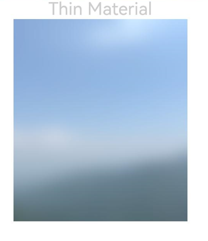

# Foreground Blur
<!--Kit: ArkUI-->
<!--Subsystem: ArkUI-->
<!--Owner: @CCFFWW-->
<!--Designer: @CCFFWW-->
<!--Tester: @lxl007-->
<!--Adviser: @Brilliantry_Rui-->
<!-- md-trans-meta sourceCommit=39ca26def5c22dc659f3dc0b76ef62a29421e77a translatedAt=2026-09-01T12:35:50.302Z -->

You can apply foreground blur effects to a component.

>  **NOTE**
>
> - Supported since API version 10. If new content is added in later versions, the starting version of the new content is marked separately with a superscript.
>
> - The APIs of this module can be used only in the stage model.
>
> - The **foregroundBlurStyle** API is a real-time blurring API that performs rendering frame by frame, which incurs significant performance overhead. When neither the blur content nor the blur radius needs to change, use the static blurring API [blur](../../apis-arkgraphics2d/js-apis-effectKit.md#blur) instead. For best practices, see [Image Blurring Optimization - When to Use](https://developer.huawei.com/consumer/en/doc/best-practices/bpta-fuzzy-scene-performance-optimization#section4652132214525).

## foregroundBlurStyle

foregroundBlurStyle(value: BlurStyle, options?: ForegroundBlurStyleOptions): T

Applies a foreground blur style to the component.

>**NOTE**
>
> This API can be called within [attributeModifier](ts-universal-attributes-attribute-modifier.md#attributemodifier) since API version 18.

**Atomic service API**: This API can be used in atomic services since API version 11.

**System capability**: SystemCapability.ArkUI.ArkUI.Full

**Parameters**

| Name | Type                                                        | Mandatory| Description                    |
| ------- | ------------------------------------------------------------ | ---- | ------------------------ |
| value   | [BlurStyle](ts-universal-attributes-background.md#blurstyle9) | Yes  | Settings of the foreground blur style.          |
| options | [ForegroundBlurStyleOptions](#foregroundblurstyleoptions) | No | Content blur option. If not passed, the system default blur effect configuration is used. For the default value, see [ForegroundBlurStyleOptions](#foregroundblurstyleoptions). |

**Return value**

| Type  | Description                    |
| ------ | ------------------------ |
| T | Current component, used for chained calls. |

## foregroundBlurStyle<sup>18+</sup>

foregroundBlurStyle(style: Optional\<BlurStyle>, options?: ForegroundBlurStyleOptions): T

Applies a foreground blur style to the component. Compared to [foregroundBlurStyle](#foregroundblurstyle), the **style** parameter supports the **undefined** type.

**Atomic service API**: This API can be used in atomic services since API version 18.

**System capability**: SystemCapability.ArkUI.ArkUI.Full

**Parameters**

| Name | Type                                                        | Mandatory| Description                                                        |
| ------- | ------------------------------------------------------------ | ---- | ------------------------------------------------------------ |
| style   | [Optional](ts-universal-attributes-custom-property.md#optionalt)\<[BlurStyle](ts-universal-attributes-background.md#blurstyle9)> | Yes   | Content blur style.<br>When the value of style is undefined, the content is restored to the state without blur, and the options parameter does not take effect. |
| options | [ForegroundBlurStyleOptions](#foregroundblurstyleoptions) | No   | Content blur option. When not passed, the system default blur effect configuration is used. For the default value, see [ForegroundBlurStyleOptions](#foregroundblurstyleoptions).                                   |

**Return value**

| Type  | Description                    |
| ------ | ------------------------ |
| T | Returns the current component, used for chained calls. |

## foregroundBlurStyle<sup>19+</sup>

foregroundBlurStyle(style: Optional\<BlurStyle>, options?: ForegroundBlurStyleOptions, sysOptions?: SystemAdaptiveOptions): T

Provides content blur capability for the current component. Compared to [foregroundBlurStyle<sup>18+</sup>](#foregroundblurstyle18), this API adds the **sysOptions** parameter, which supports system adaptive adjustment parameters. The system can automatically adjust the rendering effect of the foreground blur based on conditions such as device performance or display policies.

>  **NOTE**
>
>  The **foregroundBlurStyle** API is a real-time blurring API that performs rendering frame by frame, which incurs higher performance overhead than the static blurring API. When neither the blur content nor the blur radius needs to change, use the static blurring API [blur](../../apis-arkgraphics2d/js-apis-effectKit.md#blur) instead. For best practices, see [Image Blurring Optimization - When to Use](https://developer.huawei.com/consumer/en/doc/best-practices/bpta-fuzzy-scene-performance-optimization#section4652132214525).


**Atomic service API**: This API can be used in atomic services since API version 19.

**System capability**: SystemCapability.ArkUI.ArkUI.Full

**Parameters**

| Name | Type                                                        | Mandatory| Description                                                        |
| ------- | ------------------------------------------------------------ | ---- | ------------------------------------------------------------ |
| style   | [Optional](ts-universal-attributes-custom-property.md#optionalt)\<[BlurStyle](ts-universal-attributes-background.md#blurstyle9)> | Yes   | Content blur style.<br>When the value of style is undefined, the content is restored to the state without blur. |
| options | [ForegroundBlurStyleOptions](#foregroundblurstyleoptions) | No | Content blur options. If this parameter is not passed, the system default blur effect configuration is used. For the default value, see [ForegroundBlurStyleOptions](#foregroundblurstyleoptions).                                   |
| sysOptions   |  [SystemAdaptiveOptions](ts-universal-attributes-background.md#systemadaptiveoptions19)    |   No   |  System adaptive adjustment parameters, used to control whether to enable the system's adaptive adjustment of the blur effect.<br>Default value: { disableSystemAdaptation: false }    |

**Return value**

| Type  | Description                    |
| ------ | ------------------------ |
| T | Returns the current component, used for chained calls. |

## ForegroundBlurStyleOptions

Inherits from [BlurStyleOptions](#blurstyleoptions). Content blur style options.

**Atomic service API**: This API can be used in atomic services since API version 11.

**System capability**: SystemCapability.ArkUI.ArkUI.Full

## BlurStyleOptions

Blur style options, used to configure the light/dark mode, color sampling mode, grayscale blur parameters, and blur degree of the blur effect.

**System capability**: SystemCapability.ArkUI.ArkUI.Full

| Name                       | Type                                               | Read-Only| Optional| Description                                                        |
| --------------------------- | ------------------------------------------------------- | ---- | ---- |------------------------------------------------------------ |
| colorMode     | [ThemeColorMode](#themecolormode) | No | Yes  | Light/dark color mode used for the content blur effect.<br>Default value: ThemeColorMode.SYSTEM<br>**Atomic service API:** Since API version 11, this API is supported in atomic services. |
| adaptiveColor | [AdaptiveColor](#adaptivecolor)   | No | Yes   | Adaptive color sampling mode used for the content blur effect.<br>Default value: AdaptiveColor.DEFAULT<br>**Atomic service API:** Since API version 11, this API is supported in atomic services. |
| blurOptions<sup>11+</sup> | [BlurOptions](#bluroptions11)         | No | Yes    | Grayscale blur parameters, which take effect only on black and white in the image and have no effect on colors.<br>Default value: grayscale: [0,0] <br>**Atomic service API:** Since API version 12, this API is supported in atomic services.|
| scale<sup>12+</sup> | number   | No | Yes  | Degree of the content blur effect.<br>Default value: 1.0 <br>Value range: [0.0, 1.0] <br>1.0 indicates the highest blur degree. <br>0.0 indicates the lowest blur degree.<br>If the value is out of range, it is automatically corrected to the boundary value.<br>**Atomic service API:** Since API version 12, this API is supported in atomic services.|

## ThemeColorMode

Enumerates the color modes.

**Atomic service API**: This API can be used in atomic services since API version 11.

**System capability**: SystemCapability.ArkUI.ArkUI.Full

| Name    | Value| Description      |
| ------ | --- | ------- |
| SYSTEM | 0 | System color mode.|
| LIGHT  | 1 | Light color mode. |
| DARK   | 2 | Dark color mode. |

## AdaptiveColor

Enumerates the adaptive color modes used for the background blur effect.

**Atomic service API**: This API can be used in atomic services since API version 11.

**System capability**: SystemCapability.ArkUI.ArkUI.Full

| Name     | Value| Description                       |
| ------- | ---- | --------------------- |
| DEFAULT | 0 | Color sampling blur is not used. The system preset color is used as the mask color. The color sampling calculation using a non-DEFAULT mode takes longer than that using the DEFAULT mode.    |
| AVERAGE | 1 | Color sampling blur is used. The average color of the color sampling area is used as the mask color. The AVERAGE mode takes longer than the DEFAULT mode. In performance-sensitive scenarios, the DEFAULT mode is recommended. |

## BlurOptions<sup>11+</sup>
Grayscale blur parameters.

**Atomic service API**: This API can be used in atomic services since API version 12.

**System capability**: SystemCapability.ArkUI.ArkUI.Full

| Name       |   Type  |   Read-Only| Optional| Description                       |
| ----        |  ----   |   ---- | ------- | -------------------  |
| grayscale   |  [number, number]   |   No | No   |  Grayscale blur parameter. The value range of both parameters is [0, 127]. Adjusts the levels of black and white in the image to make them tend toward gray, resulting in a softer visual transition. It has no effect on the adjustment of colors in the image. The first parameter indicates the degree to which black is brightened, and the second parameter indicates the degree to which white is darkened. A larger parameter value produces a more obvious adjustment effect (black and white become grayer). For example, if the parameters are set to (20, 20), the RGB value of a black pixel in the image, [0, 0, 0], is adjusted to [20, 20, 20], and the RGB value of a white pixel, [255, 255, 255], is adjusted to [235, 235, 235] (255-20). Colored pixels in the image remain unchanged. |


## Example

This example demonstrates how to apply content blur to an image using **foregroundBlurStyle**.

```ts
// xxx.ets
@Entry
@Component
struct ForegroundBlurStyleDemo {
  build() {
    Column() {
      Text('Thin Material').fontSize(30).fontColor(0xCCCCCC)
      // Replace $r("app.media.bg") with the image resource file you use.
      Image($r('app.media.bg'))
        .width(300)
        .height(350)
        .foregroundBlurStyle(BlurStyle.Thin,
          { colorMode: ThemeColorMode.LIGHT, adaptiveColor: AdaptiveColor.DEFAULT, scale: 1.0 })
    }
    .height('100%')
    .width('100%')
  }
}
```


